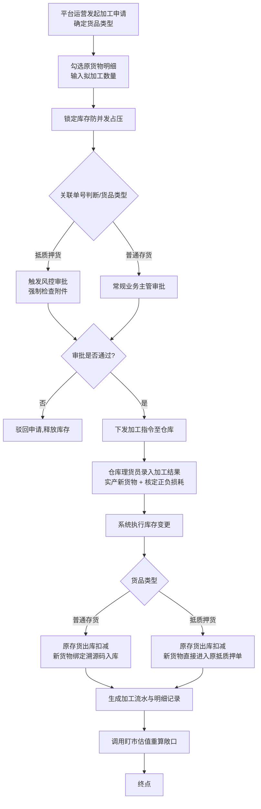
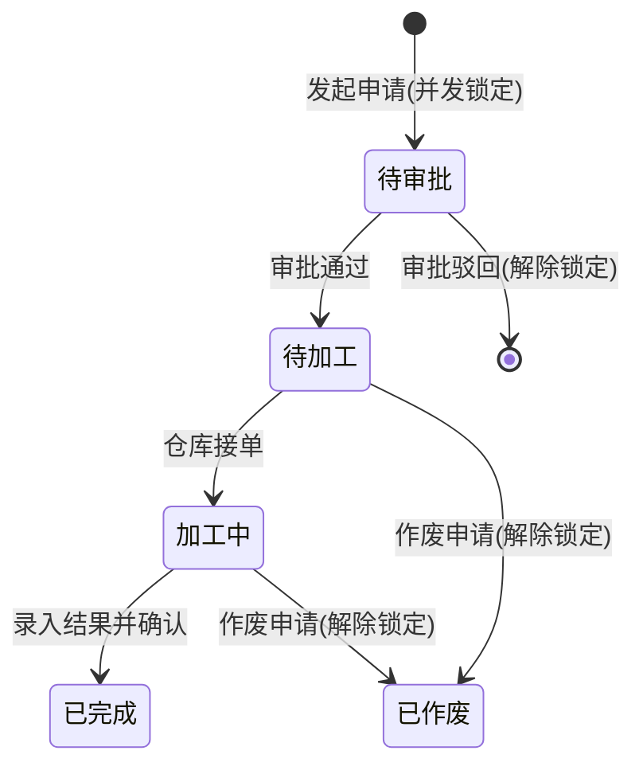

# 供应链金融存货系统 - 货物加工转变功能 产品需求文档（PRD）

版本号：V2.0.0

| 版本   | 时间       | 修订人 | 备注             |
|--------|-----------|--------|-----------------|
| V1.0.0 | 2026/07/16 | pm-master | 创建初版结构 |
| V1.1.0 | 2026/07/16 | pm-master | 补充并发锁定、部分加工、溯源及合规决议 |
| V2.0.0 | 2026/07/16 | pm-master | 增补完整数据字典、字段交互管控逻辑 |

## 一、概述（为什么做）

### 1.1 产品概述及目标

#### 1.1.1 背景介绍
在供应链金融和仓储监管业务中，存货在库期间往往需要进行物理加工或形态转换（例如：钢卷切割成钢板、原矿冶炼为精矿）。加工导致货物的 SKU、数量、单位发生变化。目前系统缺乏完善的加工状态流转与存货变更闭环，导致加工前后账实不符，特别是针对已处于「质押」状态的货物，形态变化直接影响金融敞口和监管安全。

#### 1.1.2 产品概述
本功能旨在提供一套完整的「货物加工转变」流程。支持由平台运营方代货主发起加工申请（支持整件或部分数量拆分加工），在系统中完成 1:N、N:1、N:N 等多种形态转换。加工产生的新存货将继承原货物的状态（普通存货直接入库至货主名下，质押存货直接进入原抵质押单），通过内置溯源码机制实现血缘追踪，并自动记录对应的库存流水、明细与正负损耗，实现账实相符与风控闭环。

#### 1.1.3 产品目标
**业务目标**
| 目标 | 指标 | 目标值 | 达成时间 |
|------|------|--------|---------|
| 完善库存流转闭环 | 加工导致的账实不符异常率 | 降至 0% | 上线后 1 个月 |
| 保障质押物价值可视 | 加工前后的质押物价值敞口自动重算率 | 100% 覆盖 | 上线后立即生效 |

**用户目标**
| 目标用户 | 用户目标 | 衡量指标 |
|---------|---------|---------|
| 平台运营 | 能合规、高效地在系统内完成货物的形态转换登记 | 加工申请到库存更新的系统操作平均耗时 < 5 分钟 |
| 风控专员 | 能够清晰追踪质押货物在加工前后的去向与价值变化 | 货权档案及流水通过溯源码追溯 100% 连贯 |

#### 1.1.4 目标用户
| 角色 | 描述 | 核心诉求 |
|------|------|---------|
| 平台运营 | 代货主发起加工申请、跟进加工进度 | 快速发起申请，能按部分数量切分加工 |
| 审批中心(风控/主管) | 审核加工申请，特别是涉及质押存货时的物权合规 | 确保物权变更手续完备，合规放行 |
| 仓库理货员 | 实地监督加工过程，并在系统登记实际产出与损耗 | 操作简便，能真实记录 N:N 的转化与增减重 |

### 1.2 名词说明
| 名词 | 说明 |
|------|------|
| 加工转变 | 货物在仓储期间，因物理或化学加工导致的 SKU、形态、数量发生变化的过程。 |
| 存货损耗 | 加工过程中不可避免的物理消耗（或因吸水等原因导致的增重，计为负损耗）。 |
| 溯源码 | 货物在入库时由系统分配的唯一追溯标识，新生成的货物可向上寻址到原始溯源码。 |

### 1.3 角色及权限
| 角色 | 权限范围 | 数据范围 |
|------|---------|---------|
| 平台运营 | 发起加工申请，查看加工单及流水 | 所负责客户的数据 |
| 审批人员 | 审批加工申请 | 全局或指定业务线数据 |
| 仓库理货员 | 录入实际加工产出与损耗、确认加工完成 | 所属仓库的数据 |

## 二、产品描述（做什么）

### 2.1 产品整体流程

#### 2.1.1 主流程

#### 2.1.2 状态转换图（加工申请单状态）

### 2.2 全局说明
**核心业务规则：**
1. **并发防死锁（库存锁定）**：运营发起加工申请的瞬间，系统必须按【提报的拟加工数量】冻结底层库存。在加工单处于【已驳回】、【已作废】或【已完成】之前，该部分数量禁止被用于出库、移库或解押转让。
2. **部分数量加工**：支持“切香肠”式加工。在选择原货物明细时，不必整单消耗，运营可修改【拟加工数量】。
3. **货品类型与选货逻辑强控**：
   - 选择“抵质押货”时，必须关联具体“单号”，强控【附件】必填；且系统自动反显并锁定该单据下固定的货物列表，原货物明细不支持手动增加或删除，仅可调整每行的拟加工数量。
   - 选择“存货”时，隐藏“关联单号”，系统显示“选择库存明细”按钮，允许运营自定义勾选添加多笔存货。
4. **部分加工底层库存拆分规则**：当拟加工数量小于可用库存时，系统需在发起申请通过后，在底层物理库存表将原库存明细拆分为两行：行A（拟加工锁定数量，进入加工流程）与行B（剩余数量，保留原状态释放可用），以防止加工锁定影响剩余货物的出库和流转。行B需自动生成原溯源码的关联子编码。
5. **单据作废与库存释放**：对于处于【待加工】或【加工中】的单据，若中途因故终止，系统提供【作废】操作（若为抵质押货需加签风控审批）。作废成功后，系统需立即原路解除底层库存的冻结锁定，恢复为可用库存。
6. **质押物加工后估值下跌预警**：支持加工的物理损耗全放行。但对于【抵质押货】，当加工结果登记完成后，系统触发盯市估值重算。若新产出货物的重估评估价值低于原原货物的 95%，系统需在自动记账完成的同时，向风控人员推送“质押物加工评估值下跌预警”通知，防范金融虚胖及过度损耗带来的敞口风险。
7. **血缘追踪（溯源码）**：新加工产生的货物入库时，继承原货物的【溯源码】前缀或生成关联表。用户可通过搜索溯源码，一键查看这批新货是由最初的哪个原货物演变而来的。
8. **暂无逆向纠错**：V2.0 暂不开发冲销回退功能。理货员提交加工结果属于强确认行为，若发生人为录入错误（错写产出或损耗），需提交特殊工单由 IT 技术团队从底层处理。

## 三、功能需求（怎么做）

### 3.1 数据字典（核心单据字段）
以下是系统加工功能的完整字段表及页面交互逻辑配置：

| 所属模块 | 字段名称 | 字段来源 | 取值说明 | 必填性 | 新增页 | 编辑页 | 列表展示 | 可筛选 | 字段说明 | 备注 |
|---|---|---|---|---|---|---|---|---|---|---|
| 头部字段 | 申请单号 | 系统生成 | 格式：PR+YYYYMMDD+流水号 | 系统自动 | 不展示 | 只读 | 是 | 是 | 加工申请的唯一标识号 | 单据创建后系统自动生成 |
| 头部字段 | 货主 | 用户填写 | 枚举选择，关联货主底表 | 必填 | 可编辑 | 只读 | 是 | 是 | 本次加工货物归属的客户 | 审核后不可修改 |
| 头部字段 | 仓库 | 用户填写 | 枚举选择，关联仓库底表 | 必填 | 可编辑 | 只读 | 是 | 是 | 发生加工的物理仓库 | 审核后不可修改 |
| 头部字段 | 状态 | 系统带出并存储 | 枚举：待审批/待加工/加工中/已完成/已驳回 | 系统自动 | 不展示 | 只读 | 是 | 是 | 申请单当前业务状态 | 流转过程中系统后台更新 |
| 头部字段 | 货品类型 | 用户填写 | 枚举：存货、抵质押货 | 系统自动 | 可编辑 | 只读 | 是 | 是 | 展示当前货物类型 | |
| 头部字段 | 关联单号 | 系统生成 | 单据号 | 系统自动 | 只读 | 只读 | 是 | 是 | 判断底层是否占用抵质押的货物 | 普通存货不展示，抵质押货物展示并可快捷跳转 |
| 头部字段 | 附件 | 用户填写 | 支持PDF/图片 | 选填 | 可编辑 | 可编辑 | 否 | 否 | 质押物的资金方同意函等证明 | 前端强控：货品类型为抵质押货时必填 |
| 头部字段 | 加工原因 | 用户填写 | 文本格式，最多200字 | 选填 | 可编辑 | 可编辑 | 否 | 否 | 发起加工的业务背景或特殊说明 | - |
| 明细(原货物) | 原明细主键 | 系统生成 | 主键ID | 系统自动 | 不展示 | 不展示 | 否 | 否 | 输入行的主键标识 | - |
| 明细(原货物) | 底层库存明细 | 用户填写 | 弹窗选择带回库存主键 | 必填 | 可编辑 | 只读 | 否 | 否 | 关联底层物理库存批次 | 选中后系统防并发锁定 |
| 明细(原货物) | 原商品形态 | 系统带出并存储 | 商品编号，关联SKU表 | 系统自动 | 只读 | 只读 | 是 | 否 | 加工前的原商品形态 | 基于选中的底层库存自动带出 |
| 明细(原货物) | 质押单号 | 系统带出并存储 | 质押单据号 | 系统自动 | 只读 | 只读 | 是 | 否 | 选中库存目前归属的质押单 | 用于加工完成后新产物的状态继承 |
| 明细(原货物) | 拟加工数量 | 用户填写 | 正数值，支持4位小数 | 必填 | 可编辑 | 可编辑 | 是 | 否 | 运营发起时填报的计划耗用量 | 填写值不能大于该底层库存可用量，支持部分加工 |
| 明细(原货物) | 实际消耗量 | 下游回写 | 正数值，支持4位小数 | 系统自动 | 不展示 | 只读 | 是 | 否 | 理货员实操后填报的实际消耗 | “待加工”及以后状态才展示，初期默认等于拟加工量 |
| 明细(原货物) | 原溯源码 | 系统带出并存储 | 溯源标识字符串 | 系统自动 | 只读 | 只读 | 是 | 否 | 原货物的入库溯源码快照 | 快照存储，用于后期血缘追踪 |
| 明细(新产出) | 产出明细主键 | 系统生成 | 主键ID | 系统自动 | 不展示 | 不展示 | 否 | 否 | 产出行的主键标识 | - |
| 明细(新产出) | 预期产出商品 | 用户填写 | 弹窗选择关联商品库 | 必填 | 可编辑 | 可编辑 | 是 | 否 | 期望加工出的新商品形态 | 支持 1:N/N:1/N:N 映射填写 |
| 明细(新产出) | 预期产出数量 | 用户填写 | 正数值，支持4位小数 | 必填 | 可编辑 | 可编辑 | 是 | 否 | 期望能产出的新货数量 | - |
| 明细(新产出) | 实际产出商品 | 下游回写 | 弹窗选择关联商品库 | 系统自动 | 不展示 | 只读 | 是 | 否 | 理货员实地确认产出的最终商品 | 理货员结单时填写，默认取预期商品 |
| 明细(新产出) | 实际产出数量 | 下游回写 | 正数值，支持4位小数 | 系统自动 | 不展示 | 只读 | 是 | 否 | 理货员实操后的最终产出数量 | 理货员结单时填写，默认取预期数量 |
| 明细(新产出) | 账面损耗量 | 系统计算 | 数值，支持正负值 | 系统自动 | 不展示 | 只读 | 是 | 否 | 实际消耗与实际产出总量的差额 | 系统依据理货员最终填报算得，用于核销出库 |
| 明细(新产出) | 新溯源码 | 下游回写 | 溯源标识字符串 | 系统自动 | 不展示 | 只读 | 是 | 否 | 加工完成并新货入库生成的溯源码 | 加工结单流转入库时底层服务生成回写 |
| 系统字段 | 创建人 | 系统生成 | 用户ID | 系统自动 | 不展示 | 只读 | 是 | 是 | 单据发起操作人 | - |
| 系统字段 | 创建时间 | 系统生成 | 格式：YYYY-MM-DD HH:MM:SS | 系统自动 | 不展示 | 只读 | 是 | 是 | 单据发起时间 | - |
| 系统字段 | 理货确认人 | 下游回写 | 用户ID | 系统自动 | 不展示 | 只读 | 是 | 否 | 最后录入产出并结单的仓库理货员 | - |
| 系统字段 | 完成时间 | 下游回写 | 格式：YYYY-MM-DD HH:MM:SS | 系统自动 | 不展示 | 只读 | 是 | 是 | 加工最终结单入账时间 | - |

### 3.2 发起加工申请与联动逻辑
1. **货品类型联动**：表单中的【货品类型】选择“抵质押货”时，下方展现【关联单号】字段（需后端关联该库存所属的抵质押单），同时表单的【附件】从选填转为必填验证，不传附件不允许提交。
2. **原货选择逻辑控制**：
   - 当类型为【抵质押货】且选定了【关联单号】后，系统自动调取并锁定该抵质押单下的固定货品，填充至原货物明细表中，锁定行不可删除，亦不可通过按钮增选其他库存。
   - 当类型为【存货】时，界面显示【选择库存明细】操作按钮，用户可点击弹窗，在可用普通存货中自由勾选、合并、删除。
3. **防超额拦截**：在填写【拟加工数量】时，前端需校验 `拟加工数量 <= 原库存可用量`。
4. **单据中途作废控制**：在“待加工”与“加工中”状态下，运营端或仓库端可发起“作废申请”。非抵质押货一键作废；抵质押货作废时，需风控主管二次审核确认并上传终止声明，审核通过后系统更新单据状态为【已作废】，并调用库存接口执行原路库存解锁。

### 3.3 加工结果登记与库存变更（底层逻辑）
1. **理货数量逻辑校验**：
   - 实际消耗量校验：`实际消耗量` 必须 `> 0` 且 `≤ 锁定预扣数量`，防止越权消耗未锁定的库存。
   - 实际产出量校验：`实际产出数量` 必须 `> 0`。
   - 前端表单录入及后端 API 需对上述规则做强校验拦截。
2. **库存与状态流转原子事务**：
   当理货员修改并确认最终的【实际产出商品】与【实际产出数量】并提交后，系统在单个数据库事务内执行以下原子操作：
   - **出库扣减**：解除冻结并正式生成「加工领料出库」流水，扣减锁定仓储明细。
   - **损耗核销**：系统自动算得 `账面损耗量 = 实际消耗量 - 实际产出数量`，生成「加工损耗出库」或「加工损耗入库」流水。
   - **入库入账**：生成「加工产成品入库」流水，生成【新溯源码】（与原溯源码前缀做父子关联），并将新商品形态和实产数量更新入库。
   - **质押单继承与重估**：如货品类型为【抵质押货】，新库存明细行默认继承并锁定该【关联单号】；完成入账后，立即调用【盯市估值模块】重算当前质押物总额并验证跌值阀值。

## 四、非功能需求（注意事项）

### 4.1 安全与风控合规
- **无撤销机制的警告**：一期系统关闭了业务端自主冲销能力。界面操作必须增加强提醒：“提交后数据不可逆转且不支持撤回，确认提交加工结果？”
- **并发锁定的健壮性**：锁定库存的逻辑必须在底层分布式锁保障下进行，绝对禁止出现超卖、并发扣减库存等极端情况。

### 4.2 系统集成
| 对接系统 | 接口方向 | 协议 | 说明 |
|---------|---------|------|------|
| 盯市估值模块 | 调用 | HTTP | 加工完成后推送新SKU信息以重新计算质押物总价值敞口 |
