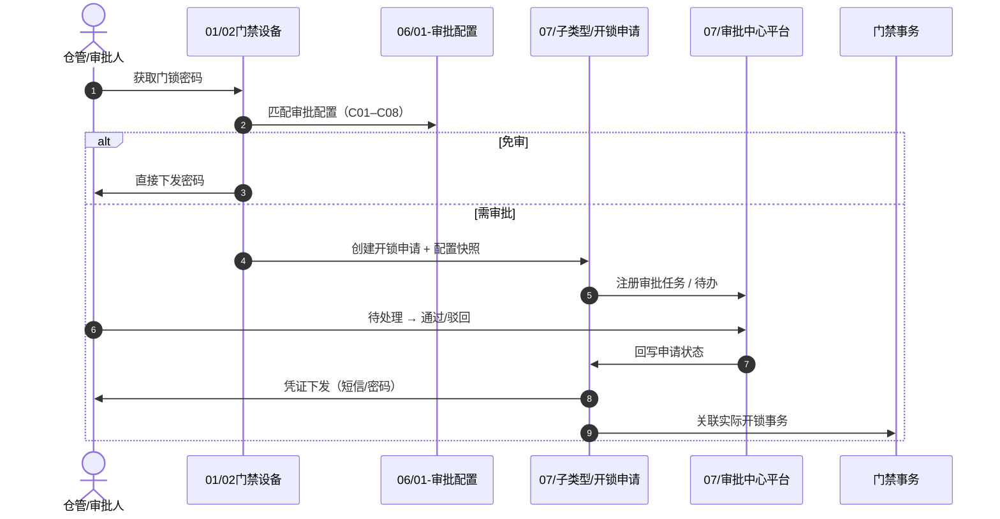

# 07-审批中心 结构整理预览（草案）

> **用途**：供评审「07 目录为何看起来怪、怎么改才一眼能懂」  
> **状态**：已落地（2026-08-28）— 正式文档见 `07-审批中心/`
> **日期**：2026-08-28

---

## 一、三模块职责对照（建议写入「审批中心总索引 § 职责边界」）

### 1.1 一句话分工

| 模块 | 角色类比 | 管什么 | 不管什么 |
| :--- | :--- | :--- | :--- |
| **07-审批中心** | 审批大厅（平台） | 待办/已办/我的申请；审批任务；通过/驳回/撤回 | 业务申请字段、凭证、各子类型配置 CRUD |
| **07/子类型/xx** | 业务单据插件 | 申请主表、后置业务（凭证/事务）、子类型待办扩展展示 | 平台任务状态机、通用审批动作 |
| **06-门禁开锁审批** | 领域编排 + 配置 | 何时需审批、审批链配置；全链路推演与规则 ID 索引 | 申请/待办/凭证字段正文 |
| **01/02门禁设备** | 业务入口 | 设备主档、获取密码/门锁密码入口 | 审批单据、待办处理 |

### 1.2 对象归属速查

| 对象 | 唯一定义文档 | 物理目录 |
| :--- | :--- | :--- |
| 审批任务（平台） | [审批中心字段清单](../02-PRD文档/B-迭代需求/6.2版本（2026.08）/07-审批中心/审批中心字段清单.md) | `07/` 根目录 |
| 通用审批动作（通过/驳回/撤回） | [通用审批处理字段清单](../02-PRD文档/B-迭代需求/6.2版本（2026.08）/07-审批中心/操作字段清单/01通用审批处理字段清单.md) | `07/操作字段清单/` |
| 开锁申请主表 | [01开锁申请主表字段清单](../02-PRD文档/B-迭代需求/6.2版本（2026.08）/07-审批中心/子类型/01-开锁申请/字段清单/01开锁申请主表字段清单.md) | `07/子类型/01-开锁申请/` |
| 临时开锁凭证 | [03临时开锁凭证字段清单](../02-PRD文档/B-迭代需求/6.2版本（2026.08）/07-审批中心/子类型/01-开锁申请/字段清单/03临时开锁凭证字段清单.md) | 同上（**无 02**：02 已升格为平台审批任务） |
| 开锁审批配置 | [门禁开锁审批配置业务规则规格](../02-PRD文档/B-迭代需求/6.2版本（2026.08）/06-门禁开锁审批/01-审批配置/门禁开锁审批配置业务规则规格.md) | `06/01-审批配置/` |
| 全链路推演与设计决策 | [门禁开锁审批-业务流程推演](../02-PRD文档/B-迭代需求/6.2版本（2026.08）/06-门禁开锁审批/门禁开锁审批-业务流程推演.md) | `06/` 根目录 |

### 1.3 端到端时序（读文档时的推荐路径）



---

## 二、建议的正式目录树（整理后目标态）

```text
07-审批中心/
├── 审批中心总索引.md              ← 加「§ 职责边界」对照表 + 上图
├── 审批中心主PRD.md              ← 待补（见下文章节大纲）
├── 审批中心业务规则规格.md        ← 已有；平台 R10–R13、P04–P05
├── 审批中心字段清单.md            ← 已有；含原「02审批任务」
├── 操作字段清单/
│   ├── 操作字段清单索引.md
│   └── 01通用审批处理字段清单.md
└── 子类型/
    └── 01-开锁申请/
        ├── 开锁申请业务规则规格.md
        ├── 开锁申请字段清单.md      ← 索引入口
        ├── 字段清单/
        │   ├── 01开锁申请主表字段清单.md
        │   ├── 03临时开锁凭证字段清单.md   # 02 已迁至平台，保留编号避免改链
        │   └── 04门禁事务关联字段清单.md
        └── 操作字段清单/
            ├── 操作字段清单索引.md
            ├── 01发起开锁申请字段清单.md
            ├── 02开锁申请待办展示字段清单.md
            └── 03开锁申请异常处理字段清单.md

# 待清理（勿再引用）
06-门锁配置/                        ← 旧副本，建议删除或移入 04-历史迁移
06-门禁开锁审批/01-开锁审批配置/     ← 与 01-审批配置 重复，建议合并保留后者
```

---

## 三、《审批中心主PRD》章节大纲预览

> 对齐 V3.0 标杆（1~10 章），**只写平台层**；开锁申请细节引用子类型，不重复。

| 章 | 标题 | 主要内容 |
| :---: | :--- | :--- |
| 1 | 文档说明 | 版本、唯一定义边界、与子类型/06 的分工 |
| 2 | 背景与目标 | 全系统审批大厅；首期接入 `UNLOCK_APPLY` |
| 3 | 功能范围 | 待处理 / 已处理 / 抄送我的 / 我的申请管理 |
| 4 | 用户与权限 | 引用全局 RBAC；P04/P05 平台审批与数据隔离 |
| 5 | 页面与交互 | 列表壳 + 按 `biz_type` 动态扩展列；详情壳 + 子类型分区 |
| 6 | 状态与流转 | 审批任务四态；与子类型申请状态的联动（不替代） |
| 7 | 通用审批动作 | 通过 / 驳回 / 撤回；R10–R13、R18–R19 |
| 8 | 子类型注册机制 | `biz_type` 注册表；扩展点（待办列、详情分区、后置回调） |
| 9 | 非功能需求 | 并发幂等 A02、审计 A04、列表性能 |
| 10 | 附录 | 已注册子类型索引；跨模块路由 `ROUTE-APPR-*` |

**明确不写进主 PRD 的内容**（仅引用）：
- 开锁申请主表 / 凭证 / 事务 → `子类型/01-开锁申请`
- 审批链配置 CRUD → `06/01-审批配置`
- 流程推演与设计决策 → `06/门禁开锁审批-业务流程推演`

---

## 四、整理动作清单（确认后执行）

| 优先级 | 动作 | 预期效果 |
| :---: | :--- | :--- |
| P0 | 在 `审批中心总索引.md` 写入 §一 对照表 + Mermaid 时序图 | 新人 5 分钟看懂 06/07 分工 |
| P0 | 补 `审批中心主PRD.md`（按上表大纲） | 与其他模块 V3.0 结构对齐 |
| P1 | 删除或归档 `06-门锁配置/` 整目录 | 消除新旧双份困惑 |
| P1 | 合并 `06/01-开锁审批配置` → `06/01-审批配置` | 06 内只保留一套配置文档 |
| P2 | 在 `子类型/01-开锁申请/字段清单/` 加 `README` 一行说明「02 已升格平台」 | 消除编号断档疑虑 |

---

## 五、请你确认的点

1. **对照表 + 时序图** 放进 `审批中心总索引`，还是单独做「06+07 联合导读」？
2. **主 PRD** 是否按上面 10 章大纲展开（平台-only）？
3. **`06-门锁配置` 旧副本** 直接删，还是移到 `04-历史迁移与割接方案/` 归档？

确认后我按你的选择改正式文档。
