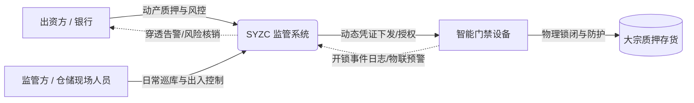
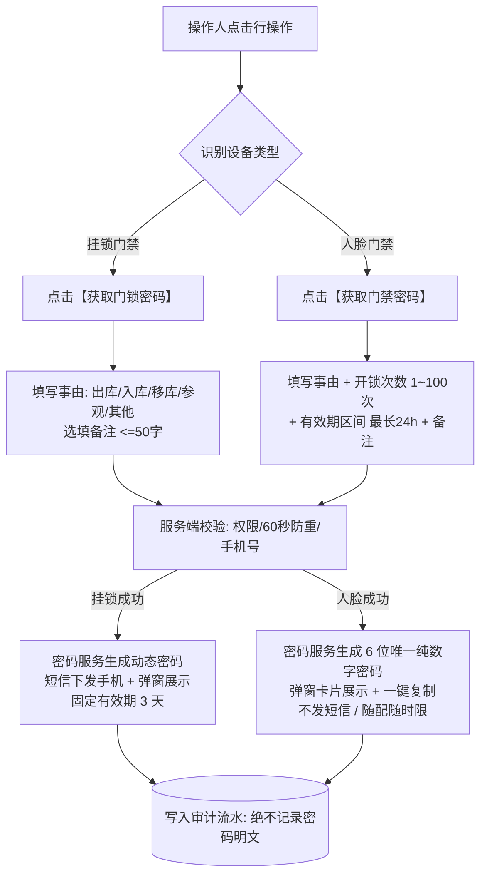
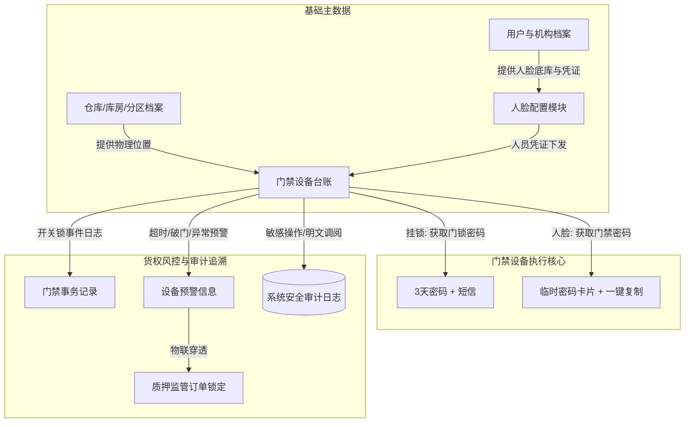

# 🚪 森云科技 - SYZC 供应链金融存货监管系统
## 门禁设备管理客户交付与操作说明书

> **文档性质**：面向客户实施交付、业务培训、系统运维及客户风控团队的系统操作与配置讲解指南  
> **适用版本**：SYZC 仓储与物联管理标准版  
> **更新日期**：2026年9月  
> **业务模块**：仓储管理 / 设备管理 - 门禁设备  
> **文档定位**：本模块为门禁设备基础档案维护与实时安全控制层，不承载审批单据，不建立独立审批流程，提供直接高效的开锁凭证下发、人脸授权与设备数据追溯能力。

---

## 目录

1. [一、 交付导读与业务背景](#一-交付导读与业务背景)
   - 1.1 为什么质押监管需要管控门禁？
   - 1.2 系统核心定位与价值
   - 1.3 门禁设备分类与核心能力差异（挂锁门禁 vs 人脸门禁）
2. [二、 核心业务规则与设计原理（向客户讲透设计）](#二-核心业务规则与设计原理向客户讲透设计)
   - 2.1 差异化凭证与时效控制机制
   - 2.2 为什么人脸门禁不下发短信？（安全边界）
   - 2.3 密码脱敏机制与司法存证级审计
   - 2.4 在押订单防篡改硬阻断机制
   - 2.5 设备移除“全量回滚”与 5 分钟自愈重入机制
3. [三、 门禁设备日常操作实操指南（SOP）](#三-门禁设备日常操作实操指南sop)
   - 3.1 门禁设备台账查询与状态查看
   - 3.2 设备重命名与仓库位置绑定
   - 3.3 挂锁门禁【获取门锁密码】操作步骤
   - 3.4 人脸门禁【获取门禁密码】操作步骤
   - 3.5 人脸门禁【人脸配置】开门授权管理（平铺视图）
   - 3.6 查看【设备数据】（事务记录与风险预警）
   - 3.7 【移除设备】与应急解绑处理
4. [四、 关联配置与上下游协同体系](#四-关联配置与上下游协同体系)
   - 4.1 仓库/库房/货区档案与位置层级
   - 4.2 人脸管理人员底库与初始凭证联动
   - 4.3 质押/监管订单与物联预警穿透闭环
   - 4.4 角色权限（RBAC）与仓库数据权限划分
5. [五、 客户交付高频问题解答 (FAQ) 与故障排查](#五-客户交付高频问题解答-faq-与故障排查)

---

## 一、 交付导读与业务背景

### 1.1 为什么质押监管需要管控门禁？

在大宗商品（如电解铜、铝锭、热轧卷板、天然橡胶等）供应链金融业务中，**“对货物的实质物理控制”是出资机构（商业银行、信托、保理公司）和专业监管公司的核心生命线**。

传统仓储监管往往面临如下严峻风险：
1. **物理管控与数字化断层**：库管员手动开锁、纸质进出登记，极易滋生“阴阳账本”、“账实不符”；
2. **私自移库与飞单盗货**：监管人员稍有脱岗，或企业私自开仓提货、换货，系统完全无法实时感知；
3. **事后举证无据可查**：一旦发生质押物缺失或爆仓纠纷，难以核查何人、在何时、以何种理由开启了哪一扇仓门。

**森云科技 SYZC 存货监管系统**将物理门禁（智能电子挂锁、人脸识别门禁终端）纳为物联风控第一道实体防线，实现**“开锁动作实时留痕、临时密码动态受控、物理防线与货权状态深度绑定”**，为客户构建透明可信的数字化监管屏障。

---

### 1.2 系统核心定位与价值



* **出入控制在线化**：出库、入库、移库、日常参观等所有需要开启仓门的作业，均通过系统直接申请与下发受控的开门密码，杜绝私配钥匙与固定静态密码；
* **物理防线与货权穿透**：门禁精确绑定至仓库、库房及分区。一旦门禁遭遇异常（撬锁、破门、门锁超时未闭合），告警直接关联对应在押货品；
* **极简高效、即开即用**：本模块不设置冗长的审批单据与审批等待流程，聚焦设备台账维护、直发密码与人员人脸授权，保障仓储现场作业的极高流转效率。

---

### 1.3 门禁设备分类与核心能力差异

系统根据现场物理设备形态，将其划分为两类，具备明确的能力与操作差异：

| 维度 | 挂锁门禁 (Padlock Access) | 人脸门禁 (Face Terminal) |
| :--- | :--- | :--- |
| **物理形态** | 智能电子挂锁、特种货柜封条锁、仓间挂锁 | 智能人脸识别门禁机、带摄像头的通行面板机 |
| **典型应用场景** | 仓间大门、货位防护隔离网、保税露天堆场大门 | 库区主出入口通道、人员门禁闸机、监管办公室门禁 |
| **系统菜单归属** | 仅归属于【门禁设备】菜单 | **双重归属**：同时在【门禁设备】与【监控设备】展示 |
| **视频视讯能力** | ❌ 无摄像头/无视频能力 | ✅ 支持实时视频直播、录像回放及图像锚点联动 |
| **密码获取操作** | 行操作：**【获取门锁密码】** | 行操作：**【获取门禁密码】** |
| **密码时效与规则** | 固定有效期 **3 天**（72 小时）动态密码 | 自定义开锁次数（1~100次）与有效期（最长 **24 小时**） |
| **短信发送能力** | ✅ 短信自动发送至操作人手机 + 页面弹窗展示 | ❌ **绝不调用短信 API**，仅在前端页面弹窗展示与复制 |
| **人员人脸授权** | ❌ 不支持人脸识别 | ✅ 支持在当前设备上下文下进行**【人脸配置】**开门授权 |

> **💡 交付人员对客户的关键解释点**：
> “人脸门禁”不仅是一台门禁，它同时是一台高清摄像头。在【门禁设备】中，您管理它‘能不能开门、谁能刷脸通行’；在【监控设备】中，您用它‘看实时监控、查抓拍回放’。两处展示的是同一台物理设备的唯一编码，底层数据实时双向同步。

---

## 二、 核心业务规则与设计原理（向客户讲透设计）

在面对客户合规风控团队、IT部门或仓库总监时，交付人员需要清晰讲明系统底层设计的严密逻辑。

### 2.1 差异化凭证与时效控制机制

系统为两类设备设计了完全契合现场作业特性的凭证时效模型：



* **挂锁门禁（3天时效）**：大宗商品作业（如一列火车的铝锭或几百吨电解铜卸货入库）往往需要持续 1~3 天。固定 3 天动态密码可避免库管员在作业期间频繁重复申请，兼顾作业连续性与安全性。
* **人脸门禁（高频受控临时密码）**：人脸门禁平时主要依赖人员刷脸通行。临时密码仅用于外来人员临时参观、货车司机临时进出等偶发场景，因此支持精确控制开锁次数（如仅限 1 次）和时间范围（最长 24 小时），用完即作废。

---

### 2.2 为什么人脸门禁不下发短信？（安全边界）

客户现场常常会问：*“为什么电子挂锁可以把密码发到我手机短信上，而人脸门禁的临时密码不发短信，只能在屏幕上看？”*

交付人员请向客户说明以下三点安全原因：
1. **认证主体与场景不同**：人脸门禁平时依靠**“人脸生物活体识别”**，临时密码仅作为临时访客或现场人员未录入人脸时的**应急补充通道**；
2. **防止二次转发扩散**：人脸门禁临时密码具有极高的时效性（如单次有效、2小时有效）。如果通过短信发送，接收人极易通过手机截图或短信二次转发给未报备人员，破坏人员出入准入控制；
3. **现场即时核对原则**：页面提供“临时开锁密码”卡片和“一键复制”功能，由具备权限的监管人员现场核实访客身份后，当面提供或输入，确保身份与开门动作强一致。

---

### 2.3 密码脱敏机制与司法存证级审计

由于涉及大宗货品的物权安全，系统提供银行级的敏感信息保护与审计保障：
* **明文密码零落库、零日志**：生成的挂锁密码与人脸临时密码，在系统数据库与服务器运行日志中**绝对不存储明文**，仅保存加盐哈希指纹；
* **前端阅后即焚**：操作弹窗一旦关闭，界面不再留存明文密码；若后续具有敏感权限的用户点击“眼睛图标”查看明文，系统将单独记录一条不可逆的**【明文查阅审计日志】**（包含查阅人、IP、精确时间）；
* **60 秒防刷保护**：同一操作人在 60 秒内禁止对同一台设备连续重复发起密码请求，防止误操作或恶意刷取密码。

---

### 2.4 在押订单防篡改硬阻断机制

* **单仓库多库区原则**：一台门禁设备最多只能绑定一个仓库，但可级联绑定该仓库下的多个库房和分区；
* **在押强校验**：系统在保存仓库绑定变更前，必须强校验该设备所在位置是否存在**“有效抵质押/监管订单”**。若存在在押货物，系统立即硬拦截并提示：  
  `“该设备已绑定有效订单，请先解绑后再修改。”`  
  **彻底杜绝在货物在押期间随意调整物理门禁归属导致监管失控！**

---

### 2.5 设备移除“全量回滚”与 5 分钟自愈重入机制

当设备报废、返厂或库区调整需要移除设备时：
* **全量回滚原则（All-or-Nothing）**：移除设备会跨模块联动解除人脸授权分配、解除订单绑定、作废未处理告警并清空位置。如果其中任意一个联动因网络或数据冲突失败，**系统立即执行全量回滚**，恢复操作前全部状态，绝不产生“系统以为删了，但硬件里还能开门”的半成品漏洞；
* **5 分钟物联自愈机制**：如果管理人员在系统中误删了设备，但现场物理硬件仍然通电并在物联平台上正常上报心跳，后台守护程序每 5 分钟巡检一次，发现实际硬件仍在，会自动把该设备**重新加入列表**。  
  *注意：自愈重入的设备属于初始未配置状态（系统内名称、位置绑定及人脸授权均清空，需重新配置），确保物理资产绝不失控遗漏。*

---

## 三、 门禁设备日常操作实操指南（SOP）

### 3.1 门禁设备台账查询与状态查看

进入路径：`【仓储管理】/【物联网 IOT 管理】 → 【设备管理】 → 【门禁设备】`

```
┌───────────────────────────────────────────────────────────────────────────────────────────┐
│ 门禁设备列表                                                                               │
├───────────────────────────────────────────────────────────────────────────────────────────┤
│ 筛选区：                                                                                  │
│ [设备名称模糊...]  [设备编码...]  [设备类型: 全部/挂锁/人脸 ▼]  [状态: 全部/在线/离线 ▼]       │
│ [绑定仓库: 全部 ▼]  [绑定状态: 全部/已绑定/未绑定 ▼]       [ 🔍 查询 ]   [ 🔄 重置 ]             │
├───────────────────────────────────────────────────────────────────────────────────────────┤
│ 表格列：                                                                                  │
│ 设备编码 | 设备类型 | 系统内名称   | 绑定仓库/库房/分区 | 状态 | 操作                      │
│ PAD-001  | 挂锁门禁 | 1号库大门挂锁 | 华东一号仓/A库房   | 在线 | 获取门锁密码 重命名 仓库绑定 ...│
│ FACE-002 | 人脸门禁 | 主通道人脸闸机| 华东一号仓/主通道  | 在线 | 获取门禁密码 人脸配置 重命名 ...│
└───────────────────────────────────────────────────────────────────────────────────────────┘
```

#### 操作指引：
1. **多维筛选**：支持按“设备名称”（模糊匹配系统内名称）、“设备编码”（精确匹配硬件编号）、“设备类型”（挂锁门禁/人脸门禁）、“设备状态”（在线/离线）、“绑定仓库”及“绑定状态”（已绑定/未绑定）进行灵活组合检索；
2. **设备状态识别**：
   * `🟢 在线`：设备与物联平台正常通信（在线时方可下发人脸授权凭证）；
   * `⚪ 离线`：设备断电、网络欠费或通信中断（设备数据仍可查看历史日志，但无法直连下发新授权）；
3. **数据可见范围**：已绑定位置的设备，用户必须拥有对应仓库的数据权限方可查看；未绑定位置的新设备，租户内具备门禁菜单权限的用户均可见。

---

### 3.2 设备重命名与仓库位置绑定

#### 1. 重命名设备
* **适用设备**：挂锁门禁、人脸门禁；
* **操作步骤**：点击操作列**【重命名】**，在弹窗中录入“系统内名称”（最多 50 个字，如“保税铜材库西侧挂锁”），点击确认保存；
* **业务价值**：硬件接入时通常为厂商原厂英文字符（如 `SN-HIK-2026-X99`），重命名为通俗易懂的业务名称，便于日常检索与现场作业识别。修改后三方平台同步不会覆盖人工命名的值。

#### 2. 仓库位置绑定
* **适用设备**：挂锁门禁、人脸门禁；
* **操作步骤**：点击操作列**【仓库绑定】**；
  1. 选择所属**仓库**（单选下拉，受用户仓库数据权限过滤）；
  2. 级联选择**库房**及**分区**（支持多选，库房必须归属所选仓库，分区必须归属所选库房）；
  3. 填写**具体位置**（选填文本，最多 50 个字，如“西侧双开铁门右门环”）；
* **在押拦截**：若目标设备已绑定正在执行监管的质押订单，系统将自动拦截并提示先解绑订单。

---

### 3.3 挂锁门禁【获取门锁密码】操作步骤

* **适用设备**：仅“挂锁门禁”设备行展示该操作；
* **操作步骤**：
  1. 找到需要开锁的挂锁门禁行，点击**【获取门锁密码】**；
  2. 弹出“获取门锁密码提示”对话框，展示当前设备编码与名称；
  3. **选择事由（必填）**：从下拉菜单中选择出入目的（【出库】、【入库】、【移库】、【参观】、【其他】）；
  4. **输入备注（选填）**：如有补充说明可输入，最多 50 个字；
  5. **点击【确定】提交**：
     * 系统自动触发密码生成与短信网关；
     * 操作人员绑定的手机号将收到一条包含动态开锁密码的短信；
     * 页面弹窗中同时直接显示开锁密码明文，并提示“密码有效期为 3 天”；
  6. 弹窗关闭后，界面清空密码明文，作业人员凭短信或记录的密码至现场开锁。

---

### 3.4 人脸门禁【获取门禁密码】操作步骤

* **适用设备**：仅“人脸门禁”设备行展示该操作；
* **操作步骤**：
  1. 找到需要临时开门的人脸门禁行，点击**【获取门禁密码】**；
  2. 弹出配置弹窗，填写本次临时通行的具体参数：
     * **事由（必填）**：下拉选择（出库 / 入库 / 移库 / 参观 / 其他）；
     * **开锁次数（必填）**：输入允许开锁的次数，范围为 **1 ~ 100** 次整数，默认为 1 次；
     * **有效期区间（必填）**：选择开始时间与结束时间。开始时间默认当前时间，结束时间距开始时间最长**不超过 24 小时**；
     * **备注（选填）**：输入补充事由说明（最多 50 字）；
  3. **点击【确定】提交**：
     * 服务端校验参数无误后，生成一组系统唯一的 **6 位纯数字临时密码**；
     * 界面弹出**“临时开锁密码”卡片**，清晰展示 6 位数字密码、开锁次数、有效时间段；
     * 卡片提供**【一键复制】**按钮，操作人点击即可复制密码；
     * **（特别说明：人脸门禁不会向手机发送短信）**。

---

### 3.5 人脸门禁【人脸配置】开门授权管理（平铺视图）

用于为本库区的常驻人员（如专职监管员、驻库理货员）快速配置刷脸开门或固定开锁密码权限。

```
┌───────────────────────────────────────────────────────────────────────────────────────────┐
│ 人脸管理（当前设备：主通道人脸闸机）              [❓ 未找到可分配的用户 前往管理页面 ❯]    │
├───────────────────────────────────────────────────────────────────────────────────────────┤
│ [人员姓名 模糊搜索...]   [ 🔍 查询 ]  [ 🔄 重置 ]                                           │
├───────────────────────────────────────────────────────────────────────────────────────────┤
│ 姓名    | 账号/手机号  | 人脸状态 | 开锁密码 | 所属机构 | 开门权限 (Switch 开关)            │
│ 王监管  | 138****0001  | 已录入   | 已设置   | 监管一部 | [  ON   ] (已授权排在前)           │
│ 张库管  | 139****0002  | 已录入   | 未设置   | 仓储中心 | [  OFF  ] ──> 点击即可开启         │
└───────────────────────────────────────────────────────────────────────────────────────────┘
```

#### 操作步骤：
1. **平铺展开视图**：在人脸门禁行，点击**【人脸配置】**，当前页面**直接平铺展开**人员列表（不离开门禁设备页面）；
2. **候选人员展示规则**：
   * 只有在人脸管理模块中**已完成“人脸照片录入”或“开锁密码设置”**其中至少一项的有效账号，才会出现在该列表中；
   * 从未录入人脸且未设置密码的人员，系统自动隐藏，防止无效下发；
   * 列表中**已拥有本设备开门权限的人员（Switch=开）固定置顶在最上方**；
3. **切换开门权限**：
   * 点击人员右侧的 Switch 开关，弹出二次确认提示框：`“确认开启/关闭该人员用于开门的权限？”`；
   * 点击确认后，系统向物理门禁机实时下发凭证写入/撤销指令；
   * **下发失败自动回滚**：若设备离线或网络通讯异常导致下发失败，系统会弹出报错提醒，且 **Switch 开关自动弹回原状态**，保证界面所见即物理设备真实状态；
4. **快速跳往人脸底库**：
   * 若列表中未找到想授权的新员工，可点击页面右上角红字：**【未找到可分配的用户 前往管理页面 ❯】**，系统将携带当前设备信息跳转至【人脸配置】主功能录入人脸底库。

---

### 3.6 查看【设备数据】（事务记录与风险预警）

点击行操作**【设备数据】**，打开弹窗，内含两个独立加载的只读 Tab 页签：

* **Tab 1：事务记录（只读）**
  * 实时呈现物理门禁上报的每一次**物理动作日志**；
  * 包含：开锁事件类型（人脸识别开门、临时密码开门、蓝牙遥控开门、机械应急钥匙开门等）、开锁人员、开锁时间、门锁当前电量等；
  * 本 Tab 数据与独立菜单【物联网 IOT 管理 - 门禁事务记录】属于同源数据集，此处根据当前设备编码自动过滤。
* **Tab 2：预警记录（只读）**
  * 汇总当前门禁设备触发的安全告警流水（如门锁超时未闭合预警、多次密码试错锁定预警、非法防拆破门报警等）；
  * 仅供快速核验当前设备健康度；如需处置预警，需前往【风险预警信息】模块处理。

---

### 3.7 【移除设备】与应急解绑处理

* **适用场景**：设备严重损坏返厂、设备报废淘汰、仓库彻底终止监管；
* **操作步骤**：点击操作列**【移除设备】**；
  1. 系统弹出风险提示弹窗，提醒移除后将同时解除人员授权与仓库绑定；
  2. **填写说明（必填）**：在文本域输入移除原因（如“设备硬件彻底故障，更换新机”，最多 200 字）；
  3. 点击确认，系统自动执行全量级联解绑并记录最高级别安全审计。

---

## 四、 关联配置与上下游协同体系

交付人员在向客户培训系统全景时，应帮助客户理清门禁设备与上下游各模块的协同拓扑：



### 4.1 仓库/库房/货区档案与位置层级
* **来源模块**：【仓储管理】 → 【仓库档案】；
* **联动机制**：门禁设备绑定的仓库、库房、分区均来自于标准仓库主数据；当仓库进行库位拆分或调整时，门禁设备台账中的位置快照会同步联动，确保巡库人员精准定位物理门锁。

### 4.2 人脸管理人员底库与初始凭证联动
* **来源模块**：【设备管理】 → 【人脸配置】；
* **联动机制**：人员的人脸照片采集、人脸特征值提取、工号初始开门密码均由该模块统一维护。门禁设备平铺页只作为**“将已有人脸授权给这台设备”**的操作出口，职责分工清晰。

### 4.3 质押/监管订单与物联预警穿透闭环
* **业务联动**：
  1. 门禁设备绑定到具体仓库库房；
  2. 客户在【业务办理】发起的质押订单、出质入库单绑定在同一库房；
  3. 当门禁设备发生**“门锁超时未闭合”**或**“防拆破门报警”**时，物联风控引擎自动将该预警穿透关联至在押订单，**临时锁定出质货物的解押与提货申请**，直至现场安全排查完毕并解除预警。

### 4.4 角色权限（RBAC）与仓库数据权限划分

| 角色身份 | 典型人员 | 门禁设备模块核心权限分配 |
| :--- | :--- | :--- |
| **仓储设备管理员** | 驻库 IT、设备运维工程师 | 列表查看、重命名、仓库绑定、人脸配置开门授权、移除设备 |
| **现场监管/库管员** | 驻库监管员、仓储出入库理货员 | 列表查看、获取门锁密码（挂锁）、获取门禁密码（人脸）、设备数据查看 |
| **风控与合规审计员** | 资方风控专员、合规稽核人员 | 列表只读查看、设备数据只读查看、敏感明文密码调阅审计、全量门禁事务追溯 |

---

## 五、 客户交付高频问题解答 (FAQ) 与故障排查

交付工程师在客户现场培训、验收交接及上线初期，可直接根据下述标准口径解答客户高频疑问：

#### Q1：为什么现场人员点击【获取门禁密码】后，手机一直没有收到密码短信？
> **标准应答**：  
> 这是系统的合规设计。根据系统安全规范，**人脸门禁的临时密码绝不会发送短信**，密码是在提交后直接在屏幕上的**“临时开锁密码”专属卡片中展示，并提供一键复制**。  
> 人脸设备平时主要依靠刷脸进出，临时密码是提供给外来访客或临时作业的应急凭据，要求操作人现场当面核实后告知受访者使用，以防通过短信转发造成密码泄露与扩散。

---

#### Q2：在人脸门禁点击【人脸配置】展开的列表中，为什么找不到新入职的仓管员小李？
> **标准应答**：  
> 请核实小李是否已经在系统中采集过人脸照片或设置过开锁密码。系统设定了准入规则：**只有人脸状态为“已录入”或开锁密码为“已录入”的有效员工，才会出现在当前设备的授权列表中**。如果小李仅建了账号但未录入人脸，请先点击页面右上角的【前往管理页面 ❯】为人脸建档，建档完成后返回该列表即可直接开启授权。

---

#### Q3：为什么在对某台门禁设备进行【仓库绑定】调整位置时，系统提示报错并被阻止？
> **标准应答**：  
> 系统提示：`“该设备已绑定有效订单，请先解绑后再修改。”` 说明该门禁绑定的库区当前存在处于质押监管状态的有效订单。为了防止货物在押期间监管防线被随意移走，系统锁定了物理绑定关系。如确实因库区调整需要修改，必须先由业务方完成订单解押或办理订单解绑手续。

---

#### Q4：在人脸配置里给员工点击开启开门权限（Switch），为什么开关会自动弹回去变回“关”？
> **标准应答**：  
> 这代表**指令下发至物理硬件终端失败**。常见原因有：
> 1. 门禁设备在列表中的状态为“离线”（现场断网、断电或物联网卡欠费）；
> 2. 现场网络信号弱导致与门禁机通讯超时。  
> 系统的原则是“所见即所得”，只有终端真正成功写入开门特征，开关才会保持开启。如果下发失败，开关会自动回滚，请先排查门禁机网络与通电状态。

---

#### Q5：为什么在列表里【获取门锁密码】或【获取门禁密码】连续点击时会提示“请求过于频繁”？
> **标准应答**：  
> 系统设置了 **60 秒防重复提交安全保护机制**。同一操作人员在 60 秒内对同一台门禁设备只能发起一次密码获取请求，防止手误连续点击或者恶意刷号，等待 60 秒冷却期过后即可正常操作。

---

#### Q6：如果设备密码窗口关闭了，作业人员忘记了刚才的密码，还能去哪里看？
> **标准应答**：  
> - **如果是挂锁门禁**：操作人的手机短信中完整保留了 3 天有效的动态密码，直接查看手机短信即可；
> - **如果是人脸门禁**：若密码已遗忘且未复制，建议重新点击【获取门禁密码】重新生成一组 6 位临时密码；具备安全权限的管理人员可在后台密码操作记录中通过“眼睛图标”查阅，查阅行为将被系统永久记录审计。

---

### 交付排障速查卡（现场快速诊断）

| 故障现象 | 首要检查项 | 解决措施 |
| :--- | :--- | :--- |
| **设备在列表中显示离线** | 1. 现场电源适配器/POE交换机指示灯；<br/>2. 4G/5G 物联网流量卡是否欠费；<br/>3. 网线接口或现场 Wi-Fi 信号强度 | 恢复现场供电，补缴物联卡流量，重新插拔网线 |
| **短信发送失败/未收到** | 1. 操作人员登录账号是否绑定了正确的有效手机号；<br/>2. 手机是否安装了拦截软件或处于欠费停机状态 | 核对个人中心手机号，检查手机短信拦截垃圾箱 |
| **人脸授权下发超时** | 检查门禁设备与物联平台的实时通信延迟 | 确保门禁机在线且延时小于 1000ms 后重新切换 Switch |
| **误删设备后自动重新出现** | 现场物理设备未拆除或未断电，物联心跳依然正常上报 | 若需彻底停用，请先将现场硬件断电并于物联底座注销 |

---
*文档编制：森云科技交付实施中心 & 产品研发部*  
*技术支持：如现场遇到硬件协议适配问题或网络连通性异常，请联系森云物联技术支持专线。*
