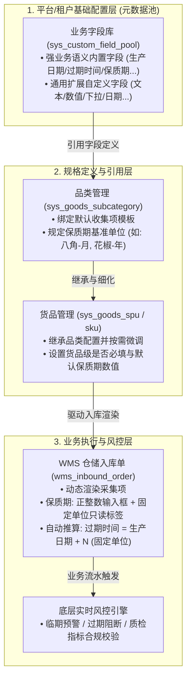
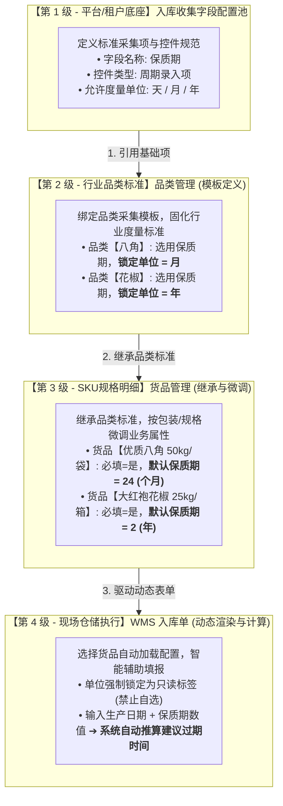
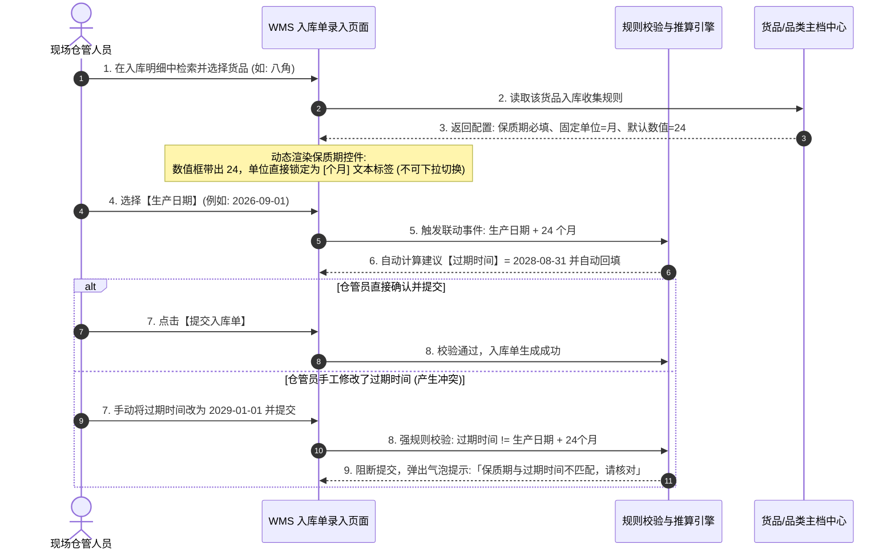

# 货品管理入库收集信息基础字段配置与固定保质期单位需求方案

> **文档属性**：草稿对话与需求方案记录，非正式 PRD，供团队评审与后续版本立项使用  
> **讨论日期**：2026-09-20  
> **需求来源**：货品管理与入库作业协同优化  
> **核心主题**：入库收集信息解耦为 SaaS 级基础字段配置池，并在货品/品类端实现保质期单位固定与标准化  
> **架构路径决策**：采纳 **路径 B（平台级基础字段池抽象 + 品类/货品多级引用绑定）**，以更好地支撑 SaaS 多租户及多行业扩展需求  

---

## 一、 需求背景与核心痛点

### 1. 业务痛点
* **保质期单位混乱，数据口径不一致**：
  * 目前入库收集信息中的【保质期】属于系统固定项，入库单填报时统一采用 `周期组合控件`（正整数 + `天/月/年` 自选下拉框）。
  * 现场录单时，不同仓管人员对同一种货品录入口径不一（例如：花椒/八角，有人录入 `2 年`，有人录入 `24 个月`，甚至有人按 `730 天` 填报）。
  * 导致存货台账、批次管理、临期预警规则及数字仓单的展示口径撕裂，下游难以统一统计分析与风控阻断。
* **重复选配，现场作业效率低下**：
  * 许多货品（如香辛料按月/年、冷鲜农产品按天）在货品主档定义时即有固定的行业度量习惯，入库环节重复手动选择单位极易产生人为误操作。
* **16 项预置字段难以适配 SaaS 多租户多品类**：
  * SYZC 面向金属、化工、农粮、中药材、冷链等多行业客户。不同大宗商品所关注的质检与仓储属性差异极大（如煤炭的热值/灰分，棉花的纤维长度，中药材的重金属/农残等），写死 16 项预置项无法满足后续业务横向扩展。

---

## 二、 核心讨论结论与方向选择

经讨论，确定采用 **路径 B（平台级基础字段池抽象 + 品类/货品引用绑定）** 方案进行体系化设计：



1. **元数据与实体解耦**：
   * 将入库收集信息从“货品代码中硬编码的 16 项”中剥离，抽象为平台级/租户级的**【入库收集字段配置池】**。
2. **区分“强业务语义字段”与“扩展自定义字段”**：
   * **强业务语义字段**（如：保质期、生产日期、过期时间、批次号）：系统内置底层算法，但**支持在配置端固化其单位与校验行为**；
   * **扩展自定义字段**（如：行业质检指标、特殊仓储标签）：租户可自主扩展字段名称、编码、控件类型与选项。
3. **两级引用机制（品类定义标准，货品继承与微调）**：
   * **品类端**：配置该品类的默认采集字段集及固定单位（如品类“八角”默认固定单位为“月”）；
   * **货品端**：默认继承品类规则，并允许设置“是否必填”及可选的“默认保质期数值”（如八角某特定规格默认 24 个月）。
4. **入库端严格受控锁定**：
   * WMS 入库单选择货品后，若保质期已固定单位，界面展示为 **【正整数数值输入框 + 固定单位文本（不可修改）】**；
   * 自动按固定单位结合生产日期推算建议过期时间，杜绝人工单位错选。

---

## 三、 详细功能与分层设计方案

### 1. 基础配置层：【入库收集字段配置池】（新增功能模块）
* **模块归属**：`08-配置管理` 下新增 `04-平台管理-业务收集项配置`（或类似基础配置子菜单）。
* **功能特性**：
  * **字段列表**：展示字段编码、字段名称、分类（货品基础类/生产质检类/仓储要求类/自定义属性）、字段类型、状态（启用/停用）；
  * **字段属性定义**：
    * 控件类型：单行文本、多行文本、下拉单选、下拉多选、数字区间、单数值（带单位）、日期选择器、**周期组合项**；
    * 对于【保质期】字段，支持配置：
      * 可选单位范围（`天` / `月` / `年`）；
      * 默认基准单位；
      * 是否允许下级货品锁定固定单位（默认允许）。

### 2. 货品规格层：【品类/货品管理】引用与单位固化
* **品类管理端**：
  * 在新增/编辑品类时，新增「入库收集项模板」区域，从字段池中批量勾选该品类需要的收集项；
  * 若勾选了【保质期】，下拉单选指定该品类统一的**【固定保质期单位】**（如：八角指定为 `月`，花椒指定为 `年`）。
* **货品管理端（SKU）**：
  * 自动继承所属品类的入库收集配置清单及保质期固定单位；
  * 支持对勾选项设置 `required: true/false`（是否必填）；
  * **增强配置（可选）**：支持配置【默认保质期数值】（如填入 `24`，则入库时默认带出 `24 个月`，可编辑修改数值，但单位锁定为 `月`）。

### 3. 执行层：【仓储 WMS 入库单】表单动态渲染与联动强校验
* **交互形态转变**：
  * 原先控件：`[ 数值输入框 ] [ 天/月/年 下拉框 ]`
  * 改造后控件：`[ 数值输入框 ] 个月`（单位变为输入框后置文本标签或置灰锁定状态，仓管无法修改单位）。
* **日期勾稽校验升级（SKU-F04 联动）**：
  * 生产日期 + 保质期数值 $\rightarrow$ 自动推算建议过期时间：
    * 固定单位为 `天`：$\text{过期时间} = \text{生产日期} + N \text{天}$；
    * 固定单位为 `月`：$\text{过期时间} = \text{生产日期} + N \text{个自然月}$（自动处理大小月及平闰年）；
    * 固定单位为 `年`：$\text{过期时间} = \text{生产日期} + N \text{年}$。
  * 若仓管手动改动过期时间，系统提交时执行服务端强校验，不符合推算关系时阻断保存并提示核对。

---

## 四、 产品模型与业务流转设计（非代码实现）

### 1. 四级配置与业务流转模型（Mermaid 业务图）



---

### 2. 产品全链路配置与表现对照矩阵

| 业务层级 | 功能页面位置 | 核心操作主体 | 该层级负责配置的内容 | 【八角】业务配置示例 | 【花椒】业务配置示例 |
| :--- | :--- | :--- | :--- | :--- | :--- |
| **第 1 级：字段池** | `配置管理-业务字段配置` | 平台运营 / 系统管理员 | • 新建/维护采集字段<br/>• 定义控件类型（文本/单选/日期/周期）<br/>• 定义保质期可选单位枚举范围 | 维护【保质期】字段，支持单位为 `天 / 月 / 年` | 维护【保质期】字段，支持单位为 `天 / 月 / 年` |
| **第 2 级：品类端** | `品类管理-添加/编辑品类` | 行业商品主管 / 运营人员 | • 勾选该品类需要的收集项池<br/>• **指定该品类统一的固定保质期单位** | 勾选【保质期】，**固定单位选择：`月`** | 勾选【保质期】，**固定单位选择：`年`** |
| **第 3 级：货品端** | `货品管理-添加/编辑货品` | 商品档案员 / 仓储主管 | • 继承品类收集项<br/>• 设置该货品是否必填（必填/选填）<br/>• （可选）配置默认保质期数值 | 继承“月”单位，勾选**必填**，设置**默认值 `24`** | 继承“年”单位，勾选**必填**，设置**默认值 `2`** |
| **第 4 级：入库单** | `仓储WMS-新建入库单` | 现场仓管员 / 录单人员 | • 选择货品后动态加载表单<br/>• 填报生产日期与保质期数值<br/>• **单位只读不可选**，系统自动推算过期日 | 界面显示：`[ 24 ] 个月`<br/>单位只读，可微调数值 | 界面显示：`[ 2 ] 年`<br/>单位只读，可微调数值 |

---

### 3. WMS 入库单现场作业交互与智能推算时序（Mermaid 时序图）



---

### 4. 页面交互原型与控件形态示意（ASCII 线框）

#### ① 货品主档（SKU）入库收集配置弹窗：
```text
┌────────────────────────────────────────────────────────────────────────┐
│ 入库信息收集项配置                                                     │
├────────────────────────────────────────────────────────────────────────┤
│ ☑ 生产日期       ○ 必填   ● 选填                                      │
│                                                                        │
│ ☑ 保质期         ● 必填   ○ 选填                                      │
│    └─ 单位规范: [ 锁定单位: 个月 (继承自八角品类) ▾ (已锁定) ]        │
│    └─ 默认数值: [ 24       ] (入库时自动填入，可修改)                  │
│                                                                        │
│ ☑ 过期时间       ● 必填   ○ 选填                                      │
│    └─ 联动规则: 系统根据 生产日期 + 保质期 自动计算推算                │
└────────────────────────────────────────────────────────────────────────┘
```

#### ② 仓储 WMS 入库单现场录入控件形态对比：
```text
【改造前（每次手动自选，容易产生数据撕裂）】：
保质期: [ 24     ] [ 月 ▾ ]   <-- 仓管A选月，仓管B容易选成 2 年，造成口径冲突！

-------------------------------------------------------------------------

【改造后（根据货品标准自动固化，单位只读，杜绝人为差错）】：
保质期: [ 24     ] 个月       <-- 单位置灰/纯文本锁定，仓管仅需确认或调整数字
```

---

## 五、 兼容性与边界处理规则

1. **存量历史货品平滑兼容**：
   * 对于存量未配置 `fixed_unit` 的货品，系统读取配置时解析为 `mode: "FREE"`；
   * 入库单识别到旧数据结构时，**自动降级兼容展示原有的自选下拉框**，不阻碍存量货品正常入库；
   * 仅当维护人员重新编辑该货品或品类并指定固定单位后，后续新入库单才无缝切换为固定单位模式。
2. **已产生业务数据的货品编辑限制（遵循既有 SKU-F08 规则）**：
   * 若某货品已在 `wms_inbound_order_detail` 中产生有效入库流水，依然遵循主档拦截规则：阻断修改其核心入库配置，防止历史批次与新批次在同一规格下产生度量歧义；如确实需调整单位，建议新建细分规格或品类。

---

## 六、 后续落地与推进建议

1. **立项版本规划**：
   * 建议将该需求列入 **6.3 版本或后续版本（2026.09+）的【存量改造与基础配置中台化升级】**。
2. **文档编写顺序（遵循 AGENTS.md §4.0 三件套规范）**：
   * **第一步**：在 `08-配置管理` 下规划「入库收集项配置」模块，输出标准三件套；
   * **第二步**：升级【品类管理】与【货品管理】三件套，引入字段池勾选与保质期单位锁定规则；
   * **第三步**：输出入库单动态表单渲染与自动推算时序图，同步 WMS 团队及风控团队进行联调验收。
