# 供应链金融存货系统 - 人脸门禁摄像头接入视频监控功能 PRD 说明书

版本号：V1.0.0

| 版本 | 时间 | 修订人 | 备注 |
|---|---|---|---|
| V1.0.0 | 2026/07/21 | pm-master / pm-prd-writer | 初始创建人脸门禁摄像头接入视频监控 PRD 文档 (存放在 02仓储板块/09设备管理) |

---

## 一、概述（为什么做）

### 1.1 产品概述及目标

#### 1.1.1 背景介绍
在供应链金融和仓储物联网（IoT）安全监管中，安装在仓库大门、库房通道处的人脸识别门禁一体机（Face Recognition Access Control Terminal）硬件本身自带高清摄像头通道（支持 RTSP / RTMP / WebRTC 视频流输出）。
在系统历史对接或设备分类中，该类设备被硬编码归类为**“门禁设备 (`ACCESS_CONTROL`)”**。这就导致系统中的视频监控大屏、直播播放器及监控设备列表默认按 `device_type = 'CAMERA'` 过滤，直接排除了门禁设备，使得运营与风控人员**无法在视频监控列表中查看人脸门禁的实时视频直播画面**。

若简单地将设备类型变更位“监控设备”，会导致门禁防窜货控制、刷脸考勤、开门闸机联动等门禁核心功能失效。

#### 1.1.2 产品概述
本功能设计并实现了**“一机多能 (Multi-Capability Device Model)”**抽象设备模型，并对视频监控列表与播放器进行升级：
1. **一机多能模型**：保持主设备属性为 `ACCESS_CONTROL` (门禁设备) 不变，赋予其扩展能力标签 `VIDEO_MONITORING` (视频监控)，并映射其视频通道。
2. **监控列表类型扩展**：在视频监控列表及大屏设备筛选中，新增**【人脸门禁摄像头】**设备子类型。
3. **视频监控与门禁联动**：将人脸门禁摄像头的视频流无缝接入视频播放网格，支持实时直播查看；同时在刷脸开门、强行闯入告警时自动联动对应摄像头的画面抓拍与短视频归档。

#### 1.1.3 产品目标

**业务目标**
| 目标 | 指标 | 目标值 | 达成时间 |
|---|---|---|---|
| 提高硬件资源复用率 | 人脸门禁摄像头在视频监控大屏的接入率 | 100% 支持直播播放 | 上线后立即生效 |
| 保障门禁与监控功能双完备 | 门禁控门功能与视频监控直播并行成功率 | 100% 互不干涉 | 上线后立即生效 |
| 提高门禁事件抓拍追溯率 | 刷脸开门与异常闯入事件视频抓拍率 | 100% 联动保存短视频 | 上线后 1 个月 |

**用户目标**
| 目标用户 | 用户目标 | 衡量指标 |
|---|---|---|
| 平台风控专员 / 金融资金方 | 在视频监控列表中选择【人脸门禁摄像头】，实时查看大门出入口的监控画面 | 监控列表可直接播放门禁画面 |
| 仓库安全管理员 | 刷脸告警发生时，直接调取门禁摄像头实时画面进行现场核验 | 告警日志一键查看现场抓拍视频 |

---

### 1.2 名词说明

| 名词 | 说明 |
|---|---|
| 人脸门禁一体机 | 集成了刷脸开门、门禁闸机控制与高清视频摄像功能的物联网终端。 |
| 一机多能模型 (`Multi-Capability`) | 允许单个硬件设备具备多重业务能力标签（如：既是门禁，也是视频监控）。 |
| 人脸门禁摄像头 (`ACCESS_CONTROL_CAMERA`) | 在视频监控列表中新增的设备子类型，代表人脸门禁设备的视频流通道。 |
| 视频通道映射 (`Stream Channel Mapping`) | 将人脸门禁设备的 RTSP/WebRTC 视频流地址映射为监控流通道。 |

---

### 1.3 角色及权限

| 角色 | 权限范围 | 说明 |
|---|---|---|
| 平台风控专员 / 运营人员 | 在视频监控列表、大屏网格中选择播放人脸门禁摄像头画面 | 查看直播与告警抓拍 |
| 系统管理员 / 运维工程师 | 配置门禁设备的多能力标签、视频流通道地址 (RTSP/WebRTC) | 维护设备能力映射 |

---

## 二、产品描述（做什么）

### 2.1 产品整体架构与数据流

#### 2.1.1 “一机多能”设备抽象模型关系图

```mermaid
graph TD
    Device[物理硬件: 人脸门禁一体机 (SN: AC-202607-001)] --> MainType[主设备分类: ACCESS_CONTROL (门禁设备)]
    Device --> Capabilities[扩展能力标签集: Capabilities]
    
    Capabilities --> Cap1[能力1: DOOR_LOCK (闸机/门禁控制)]
    Capabilities --> Cap2[能力2: FACE_VERIFY (人脸识别)]
    Capabilities --> Cap3[能力3: VIDEO_MONITORING (视频监控直播/回放)]
    
    Cap1 --> App1[门禁管理系统: 刷脸开门 / 考勤 / 闸机控制]
    Cap3 --> App2[视频监控系统: 看板直播 / 画面播放 / 告警抓拍]

    style Device fill:#1e293b,stroke:#3b82f6,stroke-width:2px;
    style MainType fill:#0f172a,stroke:#34d399,stroke-width:1px;
    style Cap3 fill:#0f172a,stroke:#f97316,stroke-width:1px;
    style App2 fill:#1e293b,stroke:#f97316,stroke-width:2px;
```

#### 2.1.2 监控列表拉取与视频流播放流程图

```mermaid
flowchart TD
    Start[用户打开视频监控列表/看板] --> FetchList[调用 GET /api/v1/monitoring/devices 接口]
    
    FetchList --> QueryDB[后端数据库查询逻辑:\n WHERE (device_type = 'CAMERA' OR capabilities LIKE '%VIDEO_MONITORING%')\n AND is_active = 1]
    
    QueryDB --> ReturnList[返回设备列表: 枪机/球机/地磅枪机 + 人脸门禁摄像头]
    
    ReturnList --> SelectDevice[用户在列表中勾选【人脸门禁摄像头】播放画面]
    SelectDevice --> RequestStream[请求媒体服务器拉取门禁 RTSP/WebRTC 流]
    
    RequestStream --> CheckStream{媒体流拉取状态}
    CheckStream -->|成功| RenderVideo[在监控网格中直播播放门禁摄像头画面\n标注: 📍 生鲜仓库大门 | 类型: 人脸门禁]
    CheckStream -->|失败| ShowError[网格提示: 门禁视频流连接失败,重试]
```

---

## 三、功能需求（怎么做）

### 3.1 设备管理“一机多能 (Multi-Capability)”模型设计

1. **能力标签配置**：
   - 在 `sys_device_info` 设备表增加 `capabilities` (JSON 数组) 字段。
   - 人脸门禁设备默认赋值：`["ACCESS_CONTROL", "FACE_VERIFY", "VIDEO_MONITORING"]`。
2. **视频通道参数配置**：
   - 当 `capabilities` 包含 `VIDEO_MONITORING` 时，支持配置 RTSP 直播流地址（`stream_rtsp_url`）及通道号（`video_channel_no`）。

---

### 3.2 视频监控列表设备类型扩展

在所有视频监控相关界面（监控大屏、视频列表、设备选择下拉框、看板搜索）增加设备子类型选择：

| 设备大类 | 设备子类型编码 | 子类型名称 | 说明 |
|---|---|---|---|
| 视频监控设备 | `GUN_CAMERA` | 普通枪机摄像头 | 用于通道、周界监控 |
| 视频监控设备 | `DOME_CAMERA` | 全景球机摄像头 | 用于库房全景巡查 |
| 视频监控设备 | `WEIGHT_BRIDGE_CAMERA` | 地磅车牌识别摄像头 | 用于车辆进出检测 |
| **视频监控设备 (新增)** | `ACCESS_CONTROL_CAMERA` | **人脸门禁摄像头** | **人脸门禁一体机自带视频流** |

- **API 查询逻辑改造**：
  将原有的查询条件：
  `WHERE device_type = 'CAMERA'`
  重构升级为：
  `WHERE (device_type = 'CAMERA' OR JSON_CONTAINS(capabilities, '"VIDEO_MONITORING"'))`

---

### 3.3 看板与视频播放网格展示规范

1. **视频播放网格卡片**：
   - 支持在 2x2、3x3 视频播放网格中直接载入人脸门禁摄像头的 WebRTC / HLS 直播画面。
   - 视频卡片 Header 标注设备名称（如：`门禁监控: 生鲜仓库大门人脸一体机`）。
   - 视频卡片 Footer 标注物理位置与类型：`📍 生鲜仓库大门 | 类型: 人脸门禁摄像头`。
2. **门禁事件与视频抓拍联动**：
   - 当发生“刷脸成功开门”或“门禁强行闯入告警”时，系统调用该门禁摄像头的视频通道，自动抓拍一张高清晰照片并截取前后 10 秒短视频，附在右侧告警日志中供风控调阅。

---

### 3.4 核心数据字典与 API 设计

#### 核心设备数据表 (`sys_device_info`)
| 字段名 | 类型 | 必填 | 默认值 | 说明 |
|---|---|---|---|---|
| `device_id` | BIGINT | 是 | 自增 | 设备主键 ID |
| `device_code` | VARCHAR(64) | 是 | - | 设备编码/SN 码 |
| `device_name` | VARCHAR(128) | 是 | - | 设备名称 |
| `main_type` | VARCHAR(32) | 是 | 'ACCESS_CONTROL' | 主设备分类：`CAMERA`, `ACCESS_CONTROL`, `IOT_SENSOR` |
| `sub_type` | VARCHAR(32) | 是 | 'ACCESS_CONTROL_CAMERA' | 子类型：`GUN_CAMERA`, `ACCESS_CONTROL_CAMERA` |
| `capabilities` | JSON | 是 | '["ACCESS_CONTROL"]' | 设备能力集，如 `["ACCESS_CONTROL", "VIDEO_MONITORING"]` |
| `stream_rtsp_url` | VARCHAR(255) | 否 | - | 视频流 RTSP / WebRTC 地址 |
| `video_channel_no` | INT | 否 | 1 | 视频通道号 |

#### 监控设备列表查询 API
- **接口**：`GET /api/v1/monitoring/devices`
- **请求参数**：`warehouse_id=101&sub_type=ACCESS_CONTROL_CAMERA`
- **响应示例**：
```json
{
  "code": 200,
  "data": [
    {
      "device_id": 2001,
      "device_name": "生鲜仓库大门人脸一体机",
      "main_type": "ACCESS_CONTROL",
      "sub_type": "ACCESS_CONTROL_CAMERA",
      "capabilities": ["ACCESS_CONTROL", "FACE_VERIFY", "VIDEO_MONITORING"],
      "stream_url": "webrtc://media.scf.com/live/ac_gate_01",
      "location_name": "生鲜仓库大门",
      "status": "ONLINE"
    }
  ]
}
```

---

### 3.5 业务推演与闭环边界异常防御规则

为确保人脸门禁接入视频监控后系统 100% 闭环且不引入新的性能与安全 Bug，系统强制执行以下四大边界防御机制：

#### 3.5.1 流媒体中继隔离防御 (防止挤占门禁开门通道)
- **潜在 Bug/风险**：人脸门禁一体机的硬件 SOC 芯片 RTSP 流并发支持极低（通常仅 2~4 路）。若监控大屏多终端直接请求门禁硬件拉流，会挤占门禁刷脸比对的通道，导致**刷脸开门卡顿甚至闸机失效**。
- **闭环解法**：**必须引入“流媒体中继服务器 (Media Proxy Server / ZLMediaKit)”**：
  - 人脸门禁硬件仅向流媒体中继推送 **1 路原始 RTSP 流**。
  - 看板大屏、Web 浏览器及抓拍服务统一向流媒体中继拉取 WebRTC / HLS 转码流，实现**大屏高并发调阅与物理门禁硬件开门性能的彻底物理隔离**。

```mermaid
graph LR
    Hardware[人脸门禁一体机硬件] -->|仅推 1 路 RTSP 流| Proxy[流媒体中继代理 Server]
    Proxy -->|WebRTC 流| Web1[看板大屏 终端 1]
    Proxy -->|WebRTC 流| Web2[风控人员桌面 终端 2]
    Proxy -->|HLS/抓拍| Snapshot[刷脸告警抓拍服务]

    style Hardware fill:#1e293b,stroke:#f97316,stroke-width:2px;
    style Proxy fill:#0f172a,stroke:#3b82f6,stroke-width:2px;
```



#### 3.5.2 能力配置强校验防御 (防止无摄像头门禁误接入)
- **潜在 Bug/风险**：若运维人员误将普通刷卡门禁（无摄像头）配置了 `VIDEO_MONITORING` 视频监控能力，会导致监控大屏频繁播放失败报错。
- **闭环解法**：后端在保存设备能力配置时校验：
  - 仅当 `sub_type == 'ACCESS_CONTROL_CAMERA'` 且 `stream_rtsp_url` 非空时，才允许勾选保存 `VIDEO_MONITORING` 能力标签。
  - 普通无摄像头的 NFC 刷卡门禁强制禁止赋予视频监控能力。

#### 3.5.3 统一心跳与离线熔断机制
- **潜在 Bug/风险**：门禁设备断电离线后，门禁列表显示离线，但监控大屏仍频繁向媒体服务器发起重连拉流请求，造成带宽浪费。
- **闭环解法**：门禁在线状态由统一 MQTT / Ping 心跳服务维护。一旦 `online_status = 'OFFLINE'`，流媒体代理自动断开中继，大屏监控网格直接渲染“门禁设备已离线”占位卡片，熔断无休止拉流。

#### 3.5.4 视图与权限解耦机制 (防止风控越权开门)
- **潜在 Bug/风险**：风控人员在监控列表中调阅门禁视频画面时，误操作触发了远程开门。
- **闭环解法**：**权限与视图严格解耦**：
  - 视频监控大屏调阅接口只授予 `monitoring:stream:view` (监控只读权限)。
  - 界面上不露出“远程开门”按钮；后端的远程开门接口 `POST /api/v1/access-control/open-door` 需单独鉴权 `access:control:open` (门禁控制权限)。

---

## 四、非功能需求

### 4.1 视频并发与稳定性要求
- **流媒体播放成功率**：人脸门禁摄像头 WebRTC/HLS 视频流拉取播放成功率 `> 99%`。
- **流媒体拉取延迟**：直播画面时延控制在 `< 1.5s` 以内。
- **多端兼容**：播放器兼容 H.264 / H.265 编码，支持 Chrome、Edge、移动端浏览器流畅播放。

### 4.2 业务隔离与权限
- 修改设备能力标签只作用于“视频监控”视图拉取，不得改变该设备在“门禁系统”中的权限控制逻辑。

---

## 五、附录

### 5.1 验收标准与测试要点

1. **能力配置测试**：
   - 验证为门禁设备勾选 `VIDEO_MONITORING` 能力后，视频监控列表中成功出现该人脸门禁。
2. **直播播放测试**：
   - 在视频监控大屏网格中点击播放人脸门禁摄像头，画面正常播放，视频底部准确显示`类型: 人脸门禁摄像头`。
3. **门禁控制独立性测试**：
   - 验证在监控列表中播放视频的同时，该人脸门禁的刷脸开门、闸机扣锁功能不受任何影响。
4. **刷脸事件联动测试**：
   - 模拟刷脸开门事件，验证系统能否自动抓拍门禁摄像头画面并挂载至告警/事件日志中。

---

### 5.2 待确认项清单

| 序号 | 待确认事项 | 影响范围 | 默认建议值 |
|---|---|---|---|
| 1 | 门禁设备离线时，监控列表是否同步显示为“离线”？ | 状态同步 | 建议同步状态，离线时网格显示“门禁摄像头离线” |
| 2 | 人脸门禁是否支持双目（可见光+红外）双通道直播？ | 流媒体播放 | 默认拉取**可见光通道**直播，红外通道用于人脸比对 |
