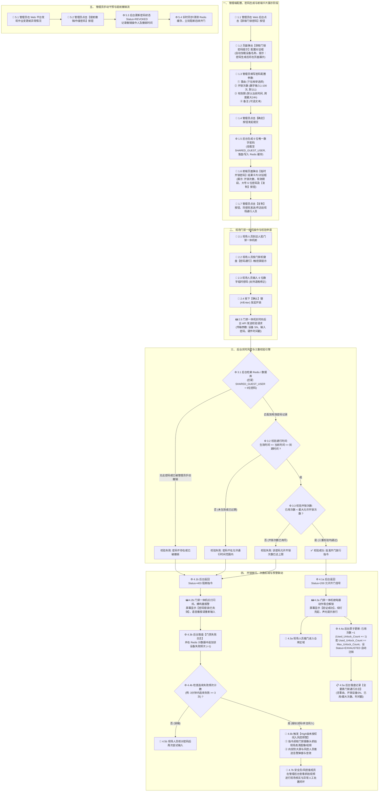

# 森云科技 SYZC - 人脸门禁设备临时密码后台逻辑与用户操作流程图

---

| 文档版本 | 更新时间 | 编写人 | 状态 | 存储目录 |
| :--- | :--- | :--- | :--- | :--- |
| **V1.2.0 (前端弹窗/无短信版)** | 2026-08-07 | AI PM Agent | 草稿/讨论稿 | `00-草稿对话/` |

---

## 📖 1. 业务背景与设计前提

在供应链金融存货监管与数字仓库安全管控场景中，部分接入的人脸门禁一体机硬件**本身不具备原生的临时访客/动态密码管理功能**。为了实现灵活、安全的临时人员通行与库区巡检，后台系统制定了以下核心逻辑：

1. **共享公共默认用户 (`SHARED_GUEST_USER`)**：
   - 仓库/园区系统统一创建并共享一个公共默认用户（如 `PARK_PUBLIC_GUEST`）。
   - 后台生成的所有临时密码均统一挂载在该公共默认用户名下，实现数据的合法关联与统一审计。
2. **前端页面生成与即时展示（无短信下发）**：
   - **免手机号绑定**：创建流程取消发送手机短信下发机制，管理员/仓管员在 Web 后台配置后直接在页面生成并展示【临时开锁密码】卡片。
   - **一键复制共享**：页面卡片展示 6 位数字密码、允许开锁次数及有效期范围，提供 `【复制】` 按钮便于操作人员直接复制并传达给现场通行人员。
3. **开锁次数与有效期双重控制 (Dual Expiration Rules)**：
   - **开锁次数限制 (`Max_Unlock_Count`)**：支持配置密码允许开锁的最大次数（`1 ~ 100 次`，默认 1 次）。每次开锁成功后后台原子递增已用次数 (`Used_Unlock_Count + 1`)，当已用次数达到最大开锁次数时密码自动作废。
   - **时间范围限制 (`Start_Time` ~ `End_Time`)**：开始时间默认当前时间（年月日时分秒），结束时间最大不得超过开始时间 **24 小时**（`Start_Time <= Now <= End_Time`）。
4. **密码位数与全局唯一性**：
   - 系统统一分配为 **6 位数字密码**，且保持系统内活跃状态密码的全局唯一性，防止不同设备/不同时段密码碰撞。
5. **实时在线校验 (Real-Time Online Verification)**：
   - 门禁硬件本地不保存任何临时密码。现场人员在门禁一体机键盘输入 6 位密码时，门禁机通过 API 实时向后台校验引擎发起开门请求。
6. **风控与安全联动**：
   - **全路径审计日志**：记录包含操作人、事由、设备 SN、通行时间、关联开锁次数的完整日志。
   - **未授权闯入预警**：3 分钟内连续 3 次校验失败时，系统自动判断为疑似非法试码或强行闯入，触发 High 级别风控告警并联动现场门禁摄像头抓拍。

---

## 📊 2. 全流程交互与逻辑流程图 (Mermaid)



---

## 🔍 3. 用户操作节点与功能全景映射表 (MECE)

| 阶段序号 | 阶段名称 | 操作主体 (Role) | 交互终端 (Terminal) | 用户操作动作 (User Action) | 系统与硬件响应 (System/Hardware Response) | 前置/后置条件 | 边界规则与异常场景 |
| :--- | :--- | :--- | :--- | :--- | :--- | :--- | :--- |
| **P1-01** | 触发获取密码 | 仓管员 / 风控管理员 | Web 管理后台 | 在设备监控/门禁列表选择目标设备，点击【获取门锁密码】按钮。 | 弹出【获取门锁密码提示】配置对话框，自动渲染设备名称与安全提示信息。 | **前置**：拥有门禁密码管理权限；设备处于可管理状态。 | 若设备离线，弹窗顶部展示黄色警示标语。 |
| **P1-02** | 属性配置与提交 | 仓管员 / 风控管理员 | Web 管理后台 | 选择事由（下拉框）、设置开锁次数（数字输入，最大100次）、设置有效期段（默认当前时间，最大24h）、填写备注，点击【确定】。 | 后台发起开锁密码创建，生成 6 位唯一数字密码，将记录挂载至 `SHARED_GUEST_USER` 并写入 Redis 缓存。 | **后置**：关闭配置弹窗，直接弹出【临时开锁密码】结果展示卡片。 | **校验阻断**：<br/>1. 事由、开锁次数、有效期为必填项；<br/>2. 开锁次数允许范围 `1 ~ 100` 次；<br/>3. 有效期结束时间不得早于开始时间，且时间跨度 `<= 24 小时`。 |
| **P1-03** | 密码展示与复制 | 仓管员 / 风控管理员 | Web 管理后台 | 查看弹出的【临时开锁密码】卡片（含开锁次数、有效期范围、6位加粗密码），点击【复制】按钮。 | 系统将 6 位密码文本写入剪贴板，提示“密码已复制到剪贴板”；管理员可关闭卡片或点击 `X`。 | **前置**：密码创建成功。 | 若浏览器不支持自动剪贴板 API，提供备选手动选中文本复制机制。 |
| **P2-01** | 现场模式选择 | 现场人员 / 巡检员 | 人脸门禁一体机 | 物理到达门禁机前，触摸点击屏幕【密码通行】（或按物理键盘 `*` 键）。 | 门禁机切入密码输入界面，屏幕提示“请输入 6 位临时密码”，键盘灯亮起。 | **前置**：门禁一体机通电且网络与后台 API 连通。 | 若设备断网，屏幕常显“离线模式中，请联系管理员”。 |
| **P2-02** | 密码输入与修整 | 现场人员 / 巡检员 | 人脸门禁一体机 | 按数字键输入密码；输错时可按 `退格` / `C` 键清除上一位。 | 每输入一位屏幕显示掩码 `*` 并发出按键音，按退格键删除末位。 | **前置**：处于密码输入模式。 | 超过 30 秒无按键操作，系统自动超时并返回初始主界面。 |
| **P2-03** | 提交校验请求 | 现场人员 / 巡检员 | 人脸门禁一体机 | 输满 6 位后按下 `#` / `Enter` 确认键。 | 门禁机屏幕显示“校验中...”，封装包含设备 SN、密码文本与时间戳的 API 报文发往后台。 | **后置**：触发后台三重校验引擎。 | **防重复提交**：防止现场人员连续快速敲击确认键导致并发校验。 |
| **P3/P4-01**| 开锁放行 (成功) | 现场人员 / 巡检员 | 人脸门禁一体机 / 仓库大门 | 查看屏幕与听提示音，推门进入仓库。 | 收到 Status=200 允许信号：继电器吸合解锁（如 5 秒），显示“验证成功”，绿灯亮起，声光提示。 | **后置**：后台原子设 `Used_Unlock_Count + 1`；若达到 `Max_Unlock_Count` 则标记自动失效；记录通行成功日志。 | 若开锁后 15 秒内门磁未检测到关门，门禁机发出长鸣提醒关门。 |
| **P3/P4-02**| 阻断与警示 (失败) | 现场人员 / 巡检员 | 人脸门禁一体机 | 查看失败提示，重新确认密码文本。 | 收到 Status=403 阻断信号：红灯闪烁，蜂鸣器报警，显示“密码无效/已过期/次数用尽”，语音提醒。 | **后置**：后台落盘失败日志，设备失败计数器 +1。 | 重新核对管理员传达的 6 位密码后再次尝试输入。 |
| **P4-03** | 未授权闯入报警 | 安全员 / 风控值班员 | 安防大屏 / 风控后台 | 收到 High 级别告警推送，在大屏弹窗中查看抓拍照片/实时视频并人工处置。 | 后台监测到 3 分钟内失败 >= 3 次，自动联动门禁摄像头抓拍，向大屏推送警报并响告警音。 | **前置**：失败计数器达到阈值。 | 值班员可点击【确认误报】消除告警，或点击【启动防范】联动安保接管。 |
| **P5-01** | 管理员手动撤销 | 仓管员 / 风控管理员 | Web 管理后台 | 在“有效密码列表”找到目标记录，点击【提前撤销】，确认弹窗。 | 后台将密码状态改为 `REVOKED`，同步清除 Redis 缓存。 | **后置**：该密码即使在有效期与次数内也无法再开门。 | 记录撤销操作人 ID、撤销时间及撤销原因。 |

---

## 🛠️ 4. 扩展数据结构 (数据字段全要素定义)

### 4.1 临时密码实体结构 (Password Entry Model)
```json
{
  "password_id": "PWD_20260807_00192",
  "bound_user_id": "SHARED_GUEST_USER",
  "password_code": "258693",
  "device_sn": "FACE_LOCK_A102",
  "device_name": "东库1号人脸门禁机",
  "warehouse_id": "WH_EAST_001",
  "reason": "CHECK_INVENTORY", 
  "max_unlock_count": 3,
  "used_unlock_count": 0,
  "start_time": "2026-10-10T10:10:10Z",
  "end_time": "2026-11-12T10:10:10Z",
  "remark": "质押大豆盘点临时入库巡检",
  "status": "ACTIVE", 
  "created_by": "ADMIN_001",
  "created_by_name": "张管理员",
  "created_at": "2026-08-07T14:20:00Z",
  "revoked_by": null,
  "revoked_at": null
}
```

> **字段枚举说明**：
> - `reason`（事由）：`CHECK_INVENTORY`（质押盘点）、`ROUTINE_INSPECTION`（日常巡检）、`EXHAUST_CHECK`（异常排查）、`TEMPORARY_PICKUP`（临时提货）、`OTHER`（其他）。
> - `status`（状态）：`ACTIVE`（生效中）、`EXHAUSTED`（次数用尽）、`EXPIRED`（已过期）、`REVOKED`（已手动撤销）。

### 4.2 门禁通行审计日志结构 (Access Audit Log)
```json
{
  "log_id": "LOG_ACC_20260807_88192",
  "device_sn": "FACE_LOCK_A102",
  "warehouse_id": "WH_EAST_001",
  "password_id": "PWD_20260807_00192",
  "input_password_code": "258693",
  "verify_result": "SUCCESS", 
  "failure_reason": null,
  "reason": "CHECK_INVENTORY",
  "current_used_count": 1,
  "max_unlock_count": 3,
  "snapshot_image_url": "https://oss.senyun.com/snapshots/20260807/A102_143001.jpg",
  "event_timestamp": "2026-08-07T14:30:01Z"
}
```

---

## 🎨 5. 前端 Vue 3 + Element Plus 原型组件设计

在前段原型 demo 中，对应 UI 原型交互包含以下核心组件：

### 5.1 密码配置对话框组件 (`GetLockPasswordModal.vue`)
* **组件类型**：`el-dialog`
* **弹窗标题**：`获取门锁密码提示`
* **提示文案**：`您正在操作获取 {{设备名称}} 的开锁密码，密码生成后将在页面直接展示，切勿随意透露给任何人！`
* **表单项 (el-form)**：
  1. `*事由` (`el-select`)：下拉框选择（系统枚举选项）。
  2. `*开锁次数` (`el-input-number`)：数字步进器，默认 1，最小值 1，最大值 100。下方带辅助说明：“设置次数后，在有效期内，允许该密码开锁的最大次数”。
  3. `*有效期` (`el-date-picker` type="datetimerange")：时间范围选择器。开始时间默认当前时间，结束时间限制为从开始时间起最大 24 小时。
  4. `备注` (`el-input` type="textarea")：多行文本框（约束字数长度与挂锁备注一致）。
* **底部按钮**：`【取消】`（普通按钮）、`【确定】`（主色调按钮）。

### 5.2 临时开锁密码结果卡片/弹窗组件 (`ShowPasswordResultModal.vue`)
* **组件类型**：`el-dialog` / 自定义卡片弹窗
* **头部设计**：带警告图标 `!` 与标题 `临时开锁密码`，右上角包含关闭按钮 `X`。
* **卡片内容区**：
  1. **开锁次数**：展示 `开锁次数：X次`
  2. **有效期**：展示 `有效期：YYYY.MM.DD HH:mm:ss ~ YYYY.MM.DD HH:mm:ss`
  3. **密码展示**：6 位大号粗体数字，字符间距放大（例：`2 5 8 6 9 3`）。
  4. **复制按钮**：`【复制】` 主色按钮，点击调用剪贴板复制密码文本并弹出 Toast 提示“已复制”。
