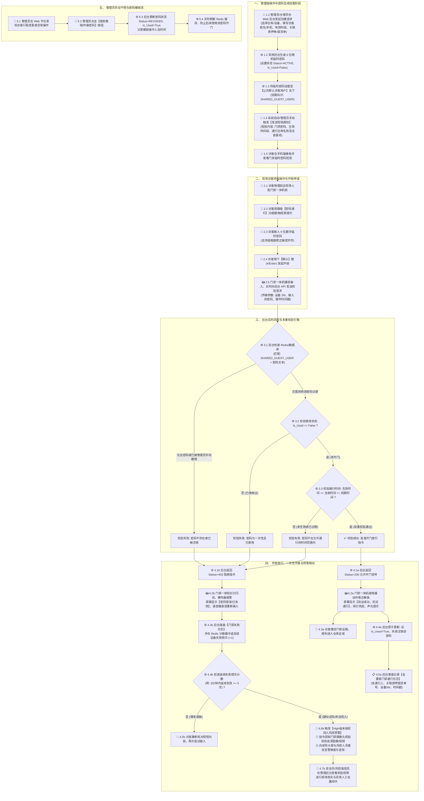

# 森云科技 SYZC - 人脸门禁设备临时密码后台逻辑与用户操作流程图

---

| 文档版本 | 更新时间 | 编写人 | 状态 | 存储目录 |
| :--- | :--- | :--- | :--- | :--- |
| **V1.1.0 (完备版)** | 2026-07-31 | AI PM Agent | 草稿/讨论稿 | `00-草稿对话/` |

---

## 📖 1. 业务背景与设计前提

在供应链金融存货监管与数字仓库安全管控场景中，部分接入的人脸门禁一体机硬件**本身不具备原生的临时访客/动态密码管理功能**。为了实现灵活、安全的访客或临时人员通行，后台系统制定了以下核心逻辑：

1. **共享公共默认用户 (`SHARED_GUEST_USER`)**：
   - 仓库/园区系统统一创建并共享一个公共默认用户（如 `PARK_PUBLIC_GUEST`）。
   - 后台生成的所有临时密码均统一挂载在该公共默认用户名下，实现数据的合法关联与统一审计。
2. **多终端全角色用户操作链路**：
   - **管理员/仓管员**：通过 Web 管理后台或移动端发起密码创建、关联业务单号（如质押提货单）、推送到访客手机、手动撤销作废密码。
   - **访客/临时通行人员**：在人脸门禁机现场键盘输入密码、确认/退格、根据屏幕/语音播报反馈推门通行。
   - **安全员/风控值班员**：在安防大屏/风控后台接收闯入预警，查看现场摄像头抓拍图像并进行人工处置。
3. **实时在线校验 (Real-Time Online Verification)**：
   - 门禁硬件本地不保存任何临时密码，解决硬件存储空间限制与离线下发延迟问题。
   - 访客在门禁机键盘输入密码时，门禁机通过 HTTP/WebSocket/MQTT 实时向后台 API 发起开门校验请求。
4. **双重失效与生命周期 (Dual Expiration Rules)**：
   - **时间范围限制**：临时密码具备明确的生效开始时间与到期结束时间（`Start_Time <= Now <= End_Time`）。
   - **一次性使用/手动作废**：密码核验成功并触发开锁后，后台采用原子事务操作将密码状态置为 `Is_Used = True`，立即销毁/注销挂载关系，彻底杜绝复用。
5. **风控与安全联动**：
   - **开门日志全路径审计**：记录包含操作人、访客、设备 SN、通行时间、关联业务单号的全过程数据。
   - **陌生人/未授权闯入预警**：连续多次（如 3 分钟内连续 3 次）校验失败时，系统自动判断为疑似非法试码或强行闯入，触发 High 级别风控告警并联动现场门禁摄像头抓拍。

---

## 📊 2. 全流程交互与逻辑流程图 (Mermaid)



---

## 🔍 3. 用户操作节点与功能全景映射表 (MECE)

| 阶段序号 | 阶段名称 | 操作主体 (Role) | 交互终端 (Terminal) | 用户操作动作 (User Action) | 系统与硬件响应 (System/Hardware Response) | 前置/后置条件 | 异常场景与风控逻辑 |
| :--- | :--- | :--- | :--- | :--- | :--- | :--- | :--- |
| **P1-01** | 密码生成发起 | 仓管员 / 风控管理员 | Web 管理后台 / 移动端 App | 在门禁管理列表点击【生成临时密码】，选择对应仓库及门禁设备。 | 弹出密码生成配置对话框，加载可绑定设备的在线状态。 | **前置**：用户具备 `access:password:create` 权限。 | 若设备处于离线状态，展示黄色预警标识提醒管理员。 |
| **P1-02** | 属性配置与提交 | 仓管员 / 风控管理员 | Web 管理后台 | 填写访客姓名、手机号、生效/失效时间段，选择关联业务单号（如质押提货单号 `TH20260731001`），点击【确认生成】。 | 后台生成 6 位随机密码，挂载至 `SHARED_GUEST_USER`；返回生成成功提示与密码摘要卡片。 | **后置**：数据库落盘，Redis 缓存密码条目（带 TTL）。 | 开始时间不得晚于结束时间；时间跨度最大不得超过 24 小时。 |
| **P1-03** | 通知推送与接收 | 管理员 / 访客 | 短信 Gateway / 微信小程序 / 手机 | 系统自动/管理员手动点击【推送通知】，访客手机接收通行短信/通知。 | 短信平台发送开门密钥、生效时间段、仓库导航地址及安全须知。 | **前置**：手机号格式正确。 | 发送失败时 Web 端提示【短信发送失败】，支持一键重新发送或复制文本。 |
| **P2-01** | 现场模式选择 | 访客 / 临时人员 | 人脸门禁一体机 | 物理到达门禁机前，触摸点击屏幕【密码通行】按钮（或直接按物理键盘 `*` 键）。 | 门禁机切入密码输入界面，屏幕显示“请输入 6 位临时密码”，键盘灯亮起。 | **前置**：门禁一体机通电且网络与后台 API 连通。 | 若设备断网，屏幕常显“离线模式中，请联系管理员”。 |
| **P2-02** | 密码输入与修整 | 访客 / 临时人员 | 人脸门禁一体机 | 按数字键输入密码；若输错可按 `退格` / `C` 键清除上一位。 | 每输入一位屏幕显示掩码 `*` 并发出按键音，按下退格键删除末位。 | **前置**：处于密码输入模式。 | 超过 30 秒无按键操作，系统自动超时并返回初始主界面。 |
| **P2-03** | 提交校验请求 | 访客 / 临时人员 | 人脸门禁一体机 | 输满 6 位后按下 `#` / `Enter` 确认键。 | 门禁机屏幕显示“校验中...”，封装包含设备 SN、密码文本与时间戳的 API 报文发往后台。 | **后置**：触发后台三重校验引擎。 | 防重复提交机制：防止访客连续快速敲击确认键造成重复请求。 |
| **P3/P4-01**| 开锁放行 (成功) | 访客 | 人脸门禁一体机 / 仓库大门 | 查看屏幕与听提示音，推门进入仓库。 | 收到 Status=200 允许信号：继电器吸合 5 秒开锁，显示“验证成功”，绿灯亮起，语音提示“验证成功”。 | **后置**：后台原子设 `Is_Used=True`；记录通行成功日志。 | 若开锁后 15 秒内门磁未检测到关门，门禁机发出长鸣提醒关门。 |
| **P3/P4-02**| 阻断与警示 (失败) | 访客 | 人脸门禁一体机 | 查看失败提示，重新检查手机短信中的密码。 | 收到 Status=403 阻断信号：红灯闪烁，蜂鸣器报警，显示“密码无效/已过期”，语音“密码无效”。 | **后置**：后台记录失败日志，设备失败计数器 +1。 | 访客可根据提示核查短信，重新进行 P2-02 输入。 |
| **P4-03** | 未授权闯入报警 | 安全员 / 风控值班员 | 安防大屏 / 风控后台 / 手机 | 收到 High 级别告警推送，在大屏弹窗中查看抓拍照片/实时视频，进行处置确认。 | 后台监测到 3 分钟内失败 >= 3 次，自动联动门禁摄像头抓拍，向大屏推送警报并响告警音。 | **前置**：失败计数器达到阈值。 | 值班员可点击【确认误报】消除告警，或点击【启动防范】联动安保接管。 |
| **P5-01** | 管理员手动撤销 | 仓管员 / 风控管理员 | Web 管理后台 | 在“生效中密码”列表找到目标记录，点击【提前注销/作废】，确认弹窗。 | 提交请求后，后台直接将密码记录的 Status 改为 `REVOKED`，`Is_Used=True`，同步清除/更新 Redis。 | **后置**：该密码即便在有效时间内也无法再开门。 | 详细记录撤销操作人 ID、撤销时间及撤销原因（如访客提前离开）。 |

---

## 🛠️ 4. 扩展数据结构 (数据字段全要素定义)

### 4.1 挂载密码实体结构 (Password Entry Model)
```json
{
  "password_id": "PWD_20260731_00982",
  "bound_user_id": "SHARED_GUEST_USER",
  "password_code": "849201",
  "warehouse_id": "WH_EAST_001",
  "device_sn": "FACE_LOCK_A102",
  "visitor_name": "张三",
  "visitor_phone": "13800138000",
  "business_biz_no": "TH20260731001", 
  "start_time": "2026-07-31T14:00:00Z",
  "end_time": "2026-07-31T18:00:00Z",
  "status": "ACTIVE", 
  "is_used": false,
  "used_at": null,
  "created_by": "ADMIN_001",
  "created_at": "2026-07-31T11:00:00Z",
  "revoked_by": null,
  "revoked_at": null
}
```

### 4.2 门禁通行审计日志结构 (Access Audit Log)
```json
{
  "log_id": "LOG_ACC_20260731_88192",
  "device_sn": "FACE_LOCK_A102",
  "warehouse_id": "WH_EAST_001",
  "password_id": "PWD_20260731_00982",
  "input_password_code": "849201",
  "verify_result": "SUCCESS", 
  "failure_reason": null,
  "visitor_name": "张三",
  "visitor_phone": "13800138000",
  "business_biz_no": "TH20260731001",
  "snapshot_image_url": "https://oss.senyun.com/snapshots/20260731/A102_143001.jpg",
  "event_timestamp": "2026-07-31T14:30:01Z"
}
```

---

## 🎨 5. 前端 Vue 3 + Element Plus 原型组件设计建议

当在原型 demo (`03-前端原型demo/`) 中落地该功能时，应包含以下三个核心组件与页面模块：

1. **密码生成弹窗组件 (`CreatePasswordDialog.vue`)**：
   - 使用 `el-dialog` + `el-form`。
   - 输入项：关联仓库与设备 (`el-cascader`)、访客姓名/电话 (`el-input`)、生效时间范围 (`el-date-picker` type="datetimerange")、关联提货单/质押单 (`el-select` 模糊搜索)。
   - 操作按钮：`【生成密码并推送短信】`（主按钮，高亮绿/蓝）、`【仅生成密码】`、`【取消】`。

2. **临时密码管控卡片/列表组件 (`PasswordManagementTable.vue`)**：
   - 使用 `el-table` + `el-tag` 状态展示（绿色: 生效中，灰色: 已使用，黄色: 已过期，红色: 已手动撤销）。
   - 操作列：包含 `【一键发送短信】`、`【复制密码】`、`【提前注销】`（点击弹出二次确认对话框 `el-popconfirm`）。

3. **风控警报弹窗/大屏浮层组件 (`IntrusionAlarmModal.vue`)**：
   - 当检测到设备失败频次达到警报阈值时，大屏使用红色脉冲波与警报音触发 `el-dialog` 强提醒。
   - 包含摄像头实时抓拍缩略图（`el-image` 带大图预览）、触发设备名称、连续输错次数、一键处置按钮（`【核验误报】` / `【呼叫安保】`）。
