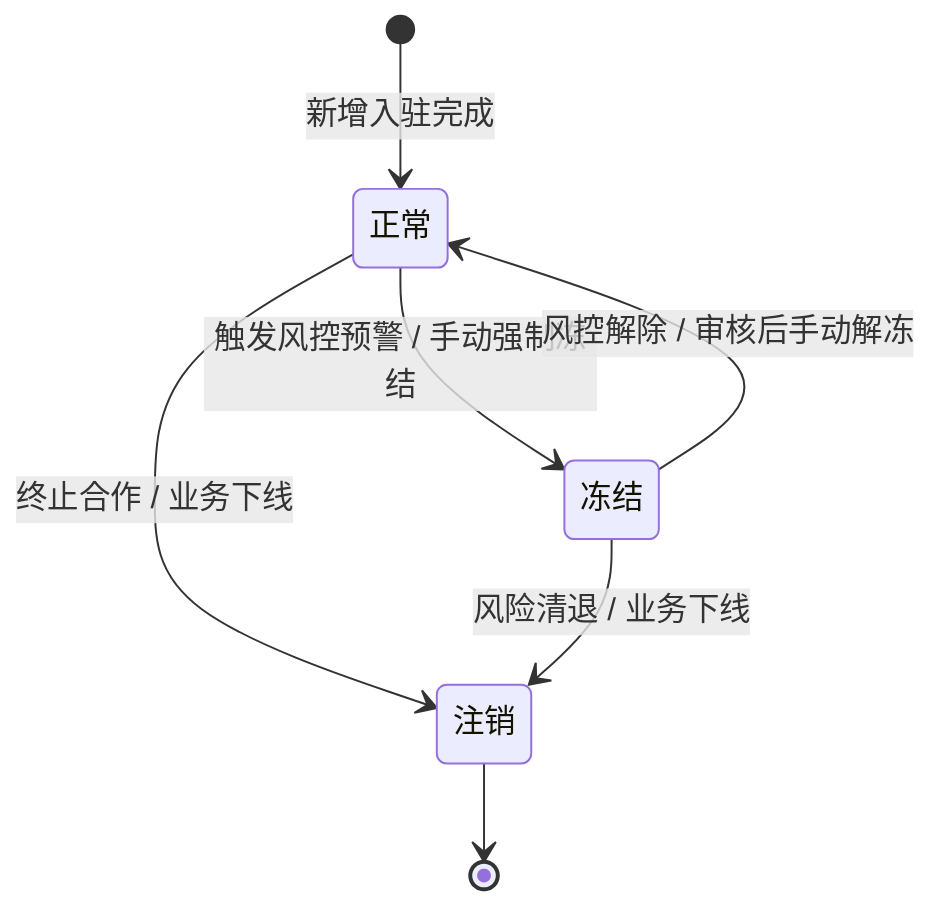

# 合作方统一管理模块 PRD

> **文档类型**：PRD（产品需求文档）  
> **版本**：V1.0  
> **创建日期**：2026-05-29  
> **最后更新**：2026-05-29  

---

## 1. 需求背景与目标

### 1.1 业务背景
当前供应链金融仓储平台涉及多种参与角色（银行、仓库、监管方、企业客户、平台运营方）。为了实现平台化能力，避免角色管理散落在不同模块，需要设计一个**“统一合作方管理”**板块。
本系统核心本质是“以货物为核心资产”的全生命周期监管平台。统一合作方管理将为全平台的货权、单据、追溯事件提供唯一的主体标识。

### 1.2 需求目标
1. **统一收口**：以“机构/企业主体”为核心，实现单一企业多重身份（例如既是货主又是仓储方）的聚合管理。
2. **底层支撑**：为下游的入库单、抵质押单、金融授信、全链路审计提供统一的防篡改基础数据支撑。
3. **风控前置**：联动风控与预警中心，实现对合作方状态（冻结/预警）的全局控制。

### 1.3 需求范围
**包含**：
- 合作方列表查询与筛选
- 合作方主体与多角色档案创建
- 合作方360°穿透式详情页
- 合作方状态机流转控制（正常/冻结/注销）
- AI原型设计提示词

**不包含**：
- 银行授信额度的具体计算模型（属于风控引擎模块）
- 具体的账户密码登录管理系统（属于IAM权限中心）

---

## 2. 功能清单

| 编号 | 功能名称 | 功能描述 | 优先级 |
| ---- | ---------- | ---------- | ------ |
| F01 | 合作方查询 | 支持多维度搜索，支持角色类型、状态等快捷筛选 | P0 |
| F02 | 合作方新增/编辑 | 创建统一企业档案，分配多重角色标签 | P0 |
| F03 | 合作方冻结/解冻 | 控制业务启停，对接风控中心进行强制阻断 | P0 |
| F04 | 360°详情视图 | 按角色动态渲染业务Tab，支持穿透查看单据、IoT设备、流水记录 | P0 |
| F05 | 合作方操作日志 | 记录对合作方本身所有的关键变更事件，保证审计合规 | P1 |

---

## 3. 字段说明

### 3.1 合作方主表字段

| 字段名 | 类型 | 必填 | 唯一 | 说明 |
| ------ | ------ | ---- | ---- | ---------------------------- |
| orgId | String | 是 | 是 | 机构内部唯一标识（系统生成） |
| orgName | String | 是 | 是 | 合作方全称（需与营业执照一致） |
| creditCode | String | 是 | 是 | 统一社会信用代码，作为企业唯一性硬校验标准 |
| roleTags | Array | 是 | 否 | 角色枚举标签（支持多选） |
| contactName | String | 是 | 否 | 核心业务对接人姓名 |
| contactPhone | String | 是 | 否 | 手机号或座机 |
| status | Enum | 是 | 否 | 当前业务状态（正常/冻结/注销） |
| joinTime | Date | 是 | 否 | 入驻时间，格式 YYYY-MM-DD HH:mm:ss |

### 3.2 枚举值定义

#### status（业务状态）
- `Active`：正常（可发起一切平台业务）
- `Frozen`：冻结（不可发起新业务，存量业务受限并预警）
- `Closed`：注销（彻底终止合作历史归档）

#### roleTags（角色标签）
- `Bank`：银行 / 资金方
- `Warehouse`：仓储企业 / 监管仓
- `Regulator`：监管方 / 街道办等政务机构
- `Customer`：企业客户 / 贸易企业 / 货主
- `Operator`：平台运营方

---

## 4. 业务规则

| 规则编号 | 规则描述 | 适用场景 |
| -------- | ---------- | ---------- |
| R01 | 唯一主体识别 | 新增/编辑合作方时 |
| R02 | 存量风控强制降级 | 对合作方执行“冻结”操作时 |
| R03 | 审计溯源不变性 | 合作方属性或状态变更时 |

**详细说明**：

### R01：唯一主体识别
- **规则描述**：系统全局以【统一社会信用代码】判断主体的唯一性。若新增时发现代码已存在，直接拦截，并引导用户去已存在的档案中【追加角色标签】。
- **处理逻辑**：拦截表单提交，抛出提示：“该企业已入驻系统，请前往【某某企业】详情补充角色配置。”

### R02：存量风控强制降级
- **规则描述**：合作方一旦被标记为【冻结】，该机构下的所有账号登录后，**不可**发起任何新增性质的业务（如新建入库单、发起质押、发起货权转让）。
- **处理逻辑**：
  - 新增业务接口强校验 status=Active。
  - 存量单据（如在库的抵质押物）仍可进行出库或解押操作，但必定触发风控预警中心的高危提示，需提级审批。

### R03：审计溯源不变性
- **规则描述**：无论合作方的信息如何修改、状态如何变更为注销，该主体在历史产生的全部 `trace_event`（溯源事件）**坚决不可修改或删除**，保证证据链归档完整。

---

## 5. 状态与流转

### 5.1 状态说明

| 状态值 | 状态名称 | 状态说明 |
| ------ | -------- | ---------- |
| Active | 正常 | 允许系统内一切正常业务流转。 |
| Frozen | 冻结 | 命中高危风控或手动限制，中断该主体的新增业务权限。 |
| Closed | 注销 | 完全退出平台合作，相关账号不可登入，仅留存审计历史。 |

### 5.2 状态流转图

### 5.3 流转条件说明

| 流转 | 触发条件 | 操作人权限 | 备注 |
| --------------- | ------------ | ------------- | ------ |
| 正常 → 冻结 | 人工提交冻结原因（并记录日志） | 风控专员 / 管理员 | 强审计事件 |
| 冻结 → 正常 | 人工提交解冻审批（并记录日志） | 部门主管 / 管理员 | 强审计事件 |
| 任意 → 注销 | 企业无存量在库物资且无未结融资 | 超级管理员 | 资金/物资必须双结清才可注销 |

---

## 6. 页面与交互

### 6.1 列表工作台

#### 筛选项
- 合作方名称（模糊搜索）
- 信用代码（精确匹配）
- 角色类型（下拉多选）
- 状态（下拉单选）
- 入驻时间（日期范围）

#### 列表展示
| 列名 | 字段 | 格式 | 排序 |
| -------- | --------- | ------------------- | ---- |
| 企业名称 | orgName | 文本展示，支持点击下钻 | - |
| 信用代码 | creditCode| 文本原样 | - |
| 角色类型 | roleTags | 多Tag彩色徽标（银行金/仓库蓝/客户绿）| - |
| 联系人 | contactName | 原样 | - |
| 联系电话 | contactPhone| 原样脱敏展示（如 138****1234） | - |
| 状态 | status | 🟢正常 / 🔴冻结 / ⚪注销 | - |
| 操作 | actions | 详情、编辑、冻结/解冻 | - |

#### 操作约束
- 列表页操作按钮支持批量冻结（需二次弹窗确认并输入原因）。
- 如果企业命中预警中心高危记录，企业名称右侧固定展示 `⚠️风险` 徽标。

### 6.2 合作方 360° 穿透详情页

#### 页面布局
- **顶部概览卡片**：展示核心字段，固定展示风险与冻结提示条幅。
- **Tab 1：基础档案**：工商主体信息、资质证书（营业执照、扫描件预览）。
- **Tab 2：业务视图（根据拥有的角色动态渲染）**：
  - *若含Bank角色*：授信总额度度盘、关联抵质押单列表、风险敞口流水。
  - *若含Warehouse角色*：管理库区列表、IoT设备总数及在线率、近期盘点异常统计。
  - *若含Customer角色*：在库商品总值、动态库存明细表、货权溯源时间轴入口。
- **Tab 3：风控与操作日志**：平台内所有针对该机构的增删改查事件（trace_event）及预警推送记录。

---

## 7. 异常处理

| 异常场景 | 触发条件 | 处理规则 | 提示信息 |
| ------------ | ---------- | ---------- | -------------------------------- |
| 信用代码重复 | 新增合作方，代码已存在 | 阻止保存 | "该主体已存在，请前往 [企业名称] 追加角色配置。" |
| 强制注销拦截 | 注销时名下仍有货物或仓单 | 阻止注销 | "不可注销，该主体名下仍存在未流转完毕的仓单/在库货物。" |
| 冻结状态发单 | 合作方状态为Frozen时请求接口 | 拦截发单请求 | "该主体业务状态异常，无法发起新单据，请联系风控人员。" |

---

## 8. 权限矩阵

| 操作 | 平台超管 | 风控专员 | 业务运营 | 外部合作方本身 |
| ---- | ------ | ------------------ | ------ | -------------- |
| 新增档案 | ✅ | ❌ | ✅ | ❌（仅允许查看自己）|
| 修改基础档案| ✅ | ❌ | ✅ | ✅（仅修改联系人）|
| 变更角色标签| ✅ | ❌ | ✅ | ❌ |
| 冻结 / 解冻 | ✅ | ✅（核心权限） | ❌ | ❌ |
| 注销 | ✅ | ❌ | ❌ | ❌ |
| 查看360详情 | ✅ | ✅ | ✅ | ❌（外部只可见自己的业务台账）|

---

## 9. 附录：AI 原型设计提示词（供 UI 设计/ Axure 生成）

> **复制以下内容提供给设计工具或设计团队：**
>
> 1. **页面主题**：供应链金融仓储监管平台 - 统一合作方台账。
> 2. **色彩规范**：B端深色风控主题或严谨的蓝白相间色调。强调数据严肃性，警示色要极其醒目。
> 3. **列表页要求**：
>    - 页面包含顶部复合条件筛选区和下方的数据大表。
>    - “角色类型”列要求使用不同颜色 Tag 区分（例如银行=金色，仓库=浅蓝，客户=绿色，监管方=紫色）。
>    - “状态”列使用带呼吸动画的指示灯（绿点代表正常，红点代表冻结，灰点代表注销）。
>    - 数据行如果被风控标记为高危，行背景色呈现浅红色警告，并在名称后跟随红色警告图标。
> 4. **详情页（360度视图）要求**：
>    - 使用多 Tab 结构切换，第一 Tab 是静态工商信息。
>    - 第二 Tab 是业务穿透视图，画出多个数据可视化小卡片（如：仪表盘显示授信额度、折线图显示历史预警次数、列表显示关联设备与单据）。
>    - 第三 Tab 必须包含严格的时间轴 UI，展示对该合作方的所有操作留痕（体现强审计监管属性）。
