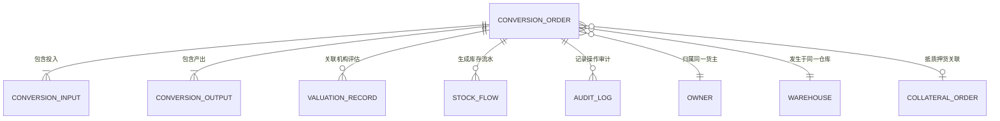

# 存货形态转换业务字段清单

> **文档类型**：字段清单  
> **实体名称**：存货形态转换单  
> **文档版本**：V1.3  
> **创建日期**：2026-07-27  
> **最后更新**：2026-07-27  
> **作者**：森云科技产品管理部

---

## 业务说明

存货形态转换单用于记录普通货物或同一抵押/质押单下货物的加工转换业务，支持 `1:N`、`N:1`、`N:N`。单据以整单方式建立投入与产出血缘，不维护逐行投入产出分配关系。

单据提交时锁定投入库存并进入企业配置的审批流；审批通过后填写实际消耗量和实际产出数量；完成时以原子事务同步执行投入扣减、未消耗库存释放、产出入库及抵质押关系继承。抵质押货物入库时使用外部价格计价，入库后相关机构可录入评估价，并由押品风控模块据此重算和生成预警。

本功能不设草稿或草稿箱。只有提交成功后才生成正式单据。

---

## 页面字段清单

### 列表页

#### 筛选区

| 字段名称 | 控件类型 | 查询方式 | 数据来源/规则 |
|---|---|---|---|
| 单据号 | 输入框 | 模糊查询 | 匹配`conversionNo` |
| 业务日期范围 | 日期范围选择器 | 起止日期查询 | 匹配`businessDate` |
| 货主名称/标识 | 输入框 | 模糊查询 | 同时匹配`ownerName`、`ownerIdentifier` |
| 仓库名称 | 级联选择器 | 精确筛选 | 按企业/区域/仓库级联，匹配`warehouseId` |
| 货品名称 | 级联选择器 | 精确筛选 | 同时检索投入SKU和产出SKU；命中任一明细即可返回单据 |
| 制单人 | 下拉选择器 | 精确筛选 | 匹配`submittedBy` |
| 制单时间 | 日期时间范围选择器 | 起止时间查询 | 匹配`submittedAt` |
| 存货类型 | 下拉选择器 | 精确筛选 | 普通货、抵质押货 |
| 单据状态 | 多选下拉 | 枚举筛选 | 匹配`status`，不包含草稿 |

#### 列表区

| 展示字段 | 对应字段/计算口径 | 展示规则 |
|---|---|---|
| 序号 | 前端分页序号 | 当前页从1开始 |
| 单据号 | `conversionNo` | 支持进入详情页 |
| 货主名称/标识 | `ownerName`、`ownerIdentifier` | 上下两行或“名称 / 标识”展示 |
| 业务类型 | `businessType` | 本功能展示“形态转换”；字段预留其他库存业务类型 |
| 转换方式 | `conversionMode` | 展示1:N、N:1、N:N |
| 业务时间 | `businessDate` | 格式`YYYY-MM-DD HH:mm:ss` |
| 仓库名称 | `warehouseName` | 展示仓库名称快照 |
| 关联单号 | `collateralOrderNo` | 普通货显示`--`；抵质押货展示可跳转单号 |
| 投入货物 | 投入明细聚合 | 按SKU分别展示“货物名称 × 计划投入数量 单位”，不同单位不合计 |
| 产出货物 | 产出明细聚合 | 未完成前展示预计数量，完成后展示实际数量；按SKU分别展示，不同单位不合计 |
| 制单人/时间 | `submittedByName`、`submittedAt` | 上下两行展示 |
| 状态 | `status` | 使用状态标签展示 |
| 操作 | 权限及状态计算 | 查看；审批中可撤回；待完成可完成或按权限作废 |

### 新增页

#### 基础信息区

| 字段名称 | 控件类型 | 必填 | 数据来源/交互规则 |
|---|---|---|---|
| 业务时间 | 日期时间选择器 | 是 | 用户填写，默认当前时间，可按业务权限调整 |
| 货主主体类型 | 单选/下拉 | 是 | `PERSONAL`个人、`ENTERPRISE`企业 |
| 货主名称 | 模糊搜索选择器 | 是 | 先选择货主主体类型，再按名称模糊查询匹配货主；只能选择系统已有货主 |
| 货主标识 | 只读 | 是 | 选择货主后自动带出；个人为身份标识，企业为统一社会信用代码等主体标识 |
| 存货类型 | 单选 | 是 | 普通货、抵质押货；决定可选库存范围 |
| 业务类型 | 只读 | 是 | 本功能固定展示“形态转换”，字段预留其他库存业务类型 |
| 转换方式 | 只读 | 是 | 系统根据投入、产出行数自动识别1:N、N:1、N:N |
| 仓库 | 级联选择器 | 是 | 选定后，所有投入只能来自该仓库 |
| 关联抵质押单 | 模糊搜索选择器 | 条件必填 | 抵质押货必填；普通货隐藏 |
| 转换原因 | 多行文本 | 否 | 最大500字符 |
| 备注 | 多行文本 | 否 | 最大1000字符 |

#### 投入货品明细区

投入货品沿用系统现有的“一级货品汇总＋二级库存明细”结构。

**一级货品标题**

| 字段名称 | 来源/规则 |
|---|---|
| 序号 | 前端生成 |
| 货物名称 | 按投入SKU分组展示 |
| 计划投入数量 | 汇总该SKU下全部二级库存明细的业务数量，单位保持SKU计量单位 |
| 操作 | 添加货品、移除货品；提交成功后不可修改 |

**二级库存明细**

| 字段名称 | 来源/规则 |
|---|---|
| 序号 | 前端生成 |
| 货物位置 | 库存明细反显 |
| 具体位置 | 库区、库位等具体位置反显 |
| 入库时间 | 原库存入库时间快照 |
| 其他信息 | 原库存的生产时间及用户自定义扩展信息快照 |
| 存货条码 | 原库存条码反显 |
| 状态 | 原库存状态反显，仅可选择符合加工条件且数量可用的库存 |
| 计划投入数量 | 用户填写，必须`>0`且不超过该二级明细可用数量 |
| 操作 | 移除该库存明细 |

#### 添加投入货品弹窗

| 层级 | 展示字段 | 交互规则 |
|---|---|---|
| 一级货品 | 序号、货物名称、可用数量、计划投入数量 | 填写一级数量后，系统按现有库存分配规则自动扣取二级明细数量 |
| 二级库存 | 序号、货物位置、具体位置、入库时间、其他信息、存货条码、状态、计划投入数量 | 用户逐行填写二级数量时，系统实时汇总一级计划投入数量 |

一级与二级数量必须始终满足：

```text
一级货品计划投入数量 = 该货品全部二级库存明细计划投入数量之和
```

#### 预计产出明细区

| 字段名称 | 控件类型 | 必填 | 规则 |
|---|---|---|---|
| 序号 | 自动编号 | 是 | 从1开始 |
| 产出货物 | SKU选择器 | 是 | 支持添加1～N条；提交后不可新增、删除或替换 |
| 规格型号 | 只读 | 否 | SKU自动带出 |
| 计量单位 | 只读 | 是 | SKU自动带出 |
| 预计产出数量 | 数字输入框 | 是 | 必须`>0` |
| 行业参考单价 | 只读 | 否 | 由外部价格接口自动获取；缺失时提示但不阻断提交 |
| 预计产出行金额 | 只读 | 否 | 预计数量×行业参考单价，用于行级计算与审计 |
| 操作 | 图标按钮 | 是 | 提交前允许添加、移除 |

表格底部展示汇总字段：

| 字段名称 | 控件类型 | 必填 | 规则 |
|---|---|---|---|
| 预计产出总金额 | 只读汇总 | 否 | 全部产出行金额之和；任一产出缺少行业参考单价时显示“无法完整试算” |

#### 加工损耗信息

加工损耗信息放置在预计产出明细表及预计产出总金额下方，视觉上归属于加工产出结果，但字段属于整张转换单，不归属于任何单条产出明细。

| 字段名称 | 控件类型 | 必填 | 规则 |
|---|---|---|---|
| 损耗比例 | 数字输入框 | 是 | `0%～100%`；无损耗填写`0%` |
| 损耗说明 | 多行文本 | 是 | 说明整次加工的损耗情况；仅作为业务记录，不参与库存、金额或质押率计算 |

#### 加工前影像

用户提交时，系统根据投入货物所在仓库自动获取加工前现场照片和设备抓拍图，并与正式转换单关联。影像获取失败是否阻断提交尚待业务确认。

### 完成加工页

#### 实际投入区

| 字段名称 | 控件类型 | 必填 | 规则 |
|---|---|---|---|
| 投入货物 | 只读 | 是 | 展示提交时确定的投入SKU及二级库存明细 |
| 锁定数量 | 只读 | 是 | 展示提交时锁定数量 |
| 实际消耗数量 | 数字输入框 | 是 | 每条必须`>0`且不得超过对应锁定数量 |
| 自动释放数量 | 只读 | 是 | 锁定数量－实际消耗数量 |

#### 实际产出及入库位置区

| 字段名称 | 控件类型 | 必填 | 规则 |
|---|---|---|---|
| 产出货物 | 只读 | 是 | 只能使用申请时确定的SKU |
| 预计产出数量 | 只读 | 是 | 申请数据快照 |
| 实际产出数量 | 数字输入框 | 是 | 必须`>0`，可以大于或小于预计数量 |
| 货物位置 | 级联选择器 | 是 | 选择产出货物入库位置；必须属于主表仓库 |
| 具体位置 | 级联/下拉选择器 | 是 | 选择库区、库位等最细可用位置 |
| 存货条码 | 只读 | 完成后必有 | 完成事务成功后系统自动生成，不允许用户填写 |
| 完成时行业参考单价 | 只读 | 否 | 由外部价格接口自动获取；缺价提示但不阻断完成 |
| 实际产出行金额 | 只读 | 否 | 实际产出数量×完成时行业参考单价 |

任一产出未选择货物位置或具体位置，禁止提交加工完成。

### 详情页

#### 基础信息区

| 字段名称 | 对应字段/来源 |
|---|---|
| 单据号 | `conversionNo` |
| 状态 | `status` |
| 制单人 | `submittedByName` |
| 制单时间 | `submittedAt` |
| 货主名称 | `ownerName` |
| 货主标识 | `ownerIdentifier` |
| 业务时间 | `businessDate` |
| 存货类型 | `stockType` |
| 业务类型 | `businessType`，本功能展示“形态转换” |
| 转换方式 | `conversionMode`，展示1:N、N:1、N:N |
| 仓库名称 | `warehouseName` |
| 关联单号 | `collateralOrderNo`，普通货为空 |
| 损耗比例/说明 | `lossRate`、`lossDescription` |
| 备注信息 | `remark` |
| 现场照片 | `sitePhotoIds`，展示提交时自动获取的加工前照片 |
| 设备抓拍图 | `deviceSnapshotIds`，展示提交时自动获取的仓库设备抓拍图 |

#### 货物明细区

详情页分别展示“投入货物”和“产出货物”两个页签或区块：

- 投入货物保留一级货品汇总和二级库存明细，展示货物位置、具体位置、入库时间、其他信息、存货条码、状态、计划投入数量、实际消耗数量及释放数量。
- 产出货物展示预计数量、实际数量、行业参考单价快照、入库位置、具体位置、新存货条码、继承抵质押单及机构最新评估结果。

---

## 实体关系



---

## 主表字段

建议实体：`StockConversionOrder`

### 标识与业务属性

| 字段名 | 中文名称 | 类型 | 必填 | 来源/维护方式 | 说明 |
|---|---|---|---|---|---|
| id | 转换单ID | String | 是 | 系统生成 | 全局唯一主键，提交成功后生成 |
| conversionNo | 转换单号 | String | 是 | 系统生成 | 唯一，格式建议：`CVT-YYYYMMDD-流水号` |
| businessDate | 业务时间 | DateTime | 是 | 用户填写 | 形态转换业务发生时间，用于业务日期查询 |
| ownerSubjectType | 货主主体类型 | Enum | 是 | 用户选择 | `PERSONAL`个人、`ENTERPRISE`企业；先选择类型再查询货主 |
| businessType | 业务类型 | Enum | 是 | 系统带出 | 本功能固定为`STOCK_CONVERSION`形态转换；枚举预留其他库存业务类型 |
| stockType | 存货类型 | Enum | 是 | 用户选择 | `ORDINARY`普通货、`COLLATERAL`抵质押货；单据内不可混合 |
| conversionMode | 转换方式 | Enum | 是 | 系统计算 | 根据投入、产出明细行数计算：`ONE_TO_MANY`、`MANY_TO_ONE`、`MANY_TO_MANY`；本次范围不包含1:1 |
| status | 单据状态 | Enum | 是 | 系统维护 | 不包含草稿状态，见状态枚举 |
| lossRate | 损耗比例 | Number | 是 | 用户填写 | 范围 `0～100`，单位 `%`；无损耗填写`0`；仅留痕，不参与库存、货值或质押率计算 |
| lossDescription | 损耗说明 | String | 是 | 用户填写 | 最大500字符，说明损耗原因或加工情况 |
| conversionReason | 转换原因 | String | 否 | 用户填写 | 最大500字符 |
| remark | 备注 | String | 否 | 用户填写 | 最大1000字符 |
| sitePhotoIds | 加工前现场照片 | Array<Ref<Attachment>> | 待确认 | 系统自动获取 | 提交时按投入仓库抓取并保存附件引用；抓取失败是否阻断提交待确认 |
| deviceSnapshotIds | 加工前设备抓拍图 | Array<Ref<Attachment>> | 待确认 | 系统自动获取 | 提交时调用仓库联网设备抓拍并保存附件引用；抓拍失败是否阻断提交待确认 |

### 货主、仓库与抵质押关系

| 字段名 | 中文名称 | 类型 | 必填 | 来源/维护方式 | 说明 |
|---|---|---|---|---|---|
| ownerId | 货主ID | Ref<Owner> | 是 | 用户选择/库存反显 | 所有投入必须属于同一货主 |
| ownerCode | 货主编码快照 | String | 是 | 系统快照 | 提交时保存，避免基础资料变更影响历史单据 |
| ownerName | 货主名称快照 | String | 是 | 系统快照 | 提交时保存 |
| ownerIdentifier | 货主标识快照 | String | 是 | 系统快照 | 个人或企业主体标识；用于列表、详情展示和模糊查询 |
| warehouseId | 仓库ID | Ref<Warehouse> | 是 | 用户选择/库存反显 | 所有投入必须位于同一仓库 |
| warehouseCode | 仓库编码快照 | String | 是 | 系统快照 | 提交时保存 |
| warehouseName | 仓库名称快照 | String | 是 | 系统快照 | 提交时保存 |
| collateralOrderType | 抵质押单类型 | Enum | 条件必填 | 系统反显 | 抵质押货必填：`MORTGAGE`抵押、`PLEDGE`质押；普通货为空 |
| collateralOrderId | 原抵质押单ID | Ref<CollateralOrder> | 条件必填 | 用户选择/库存反显 | 抵质押货必填；所有投入只能属于该单 |
| collateralOrderNo | 原抵质押单号快照 | String | 条件必填 | 系统快照 | 产出库存继承关系及追溯依据 |

### 审批流程字段

| 字段名 | 中文名称 | 类型 | 必填 | 来源/维护方式 | 说明 |
|---|---|---|---|---|---|
| processDefinitionId | 流程定义ID | Ref<ProcessDefinition> | 是 | 系统匹配 | 按企业流程配置匹配普通货或抵质押货审批流 |
| processDefinitionName | 流程名称快照 | String | 是 | 系统快照 | 保存提交时采用的流程名称 |
| processInstanceId | 流程实例ID | Ref<ProcessInstance> | 是 | 系统生成 | 提交成功后创建 |
| currentApprovalNode | 当前审批节点 | String | 条件必填 | 流程引擎回写 | `PENDING_APPROVAL`状态必填 |
| approvalPassedAt | 审批通过时间 | DateTime | 条件必填 | 系统回写 | 进入`PENDING_COMPLETION`时生成 |
| rejectedAt | 驳回时间 | DateTime | 条件必填 | 系统回写 | `REJECTED`状态必填 |
| rejectedBy | 驳回人ID | Ref<User> | 条件必填 | 系统回写 | `REJECTED`状态必填 |
| rejectionReason | 驳回原因 | String | 条件必填 | 审批人填写 | 最大500字符 |
| withdrawnAt | 撤回时间 | DateTime | 条件必填 | 系统回写 | `WITHDRAWN`状态必填 |
| withdrawnBy | 撤回人ID | Ref<User> | 条件必填 | 系统回写 | 仅申请人可在审批中撤回 |
| withdrawalReason | 撤回原因 | String | 否 | 用户填写 | 最大500字符 |
| voidedAt | 作废时间 | DateTime | 条件必填 | 系统回写 | `VOIDED`状态必填 |
| voidedBy | 作废人ID | Ref<User> | 条件必填 | 系统回写 | 具备权限的用户可在待完成状态直接作废 |
| voidReason | 作废原因 | String | 条件必填 | 用户填写 | 最大500字符 |

### 提交试算字段

以下字段仅用于申请阶段风险提示，不直接生成正式押品预警。

| 字段名 | 中文名称 | 类型 | 必填 | 来源/维护方式 | 说明 |
|---|---|---|---|---|---|
| estimatedOutputValue | 预计产出总金额 | Number | 条件必填 | 系统计算 | 抵质押货且全部预计产出存在行业参考单价时生成，等于全部预计产出行金额之和，单位：元，保留2位 |
| financingPrincipalSnapshot | 融资本金快照 | Number | 条件必填 | 融资/抵质押单快照 | 抵质押货试算时保存，单位：元 |
| warningLineSnapshot | 质押警戒线快照 | Number | 条件必填 | 风控规则快照 | 抵质押货试算时保存；具体数值口径沿用押品风控模块 |
| estimatedPledgeRatio | 预计质押率 | Number | 条件必填 | 系统计算 | 可完成试算时生成，单位：`%` |
| estimatedRiskLevel | 预计风险等级 | Enum | 条件必填 | 系统计算 | `LOW`、`MEDIUM`、`HIGH`、`UNAVAILABLE` |
| priceUnavailable | 是否存在缺价 | Boolean | 是 | 系统计算 | 任一预计产出没有外部价格时为`true` |
| missingPriceSkuCount | 缺价SKU数 | Number | 是 | 系统计算 | 默认0 |
| proceedAfterRiskPrompt | 风险提示后继续 | Boolean | 条件必填 | 用户确认 | 预计结果触发风险弹窗后，用户仍提交时为`true` |
| riskPromptConfirmedAt | 风险确认时间 | DateTime | 条件必填 | 系统生成 | 用户确认继续时记录 |
| trialCalculatedAt | 预计试算时间 | DateTime | 条件必填 | 系统生成 | 成功试算或确认无法试算时记录 |

### 完成与行业参考价格计价字段

| 字段名 | 中文名称 | 类型 | 必填 | 来源/维护方式 | 说明 |
|---|---|---|---|---|---|
| actualExternalOutputValue | 实际产出总金额 | Number | 条件必填 | 系统计算 | 仅当全部实际产出均有完成时行业参考单价时生成；任一SKU缺价则为空，避免部分金额被误认为完整总金额 |
| completionPriceUnavailable | 完成时是否存在缺价 | Boolean | 是 | 系统计算 | 缺价不阻断库存转换 |
| completionMissingPriceSkuCount | 完成时缺价SKU数 | Number | 是 | 系统计算 | 默认0 |
| completionValuedAt | 完成计价时间 | DateTime | 条件必填 | 系统生成 | 读取完成时行业参考单价的时间 |
| completionIdempotencyKey | 完成幂等键 | String | 条件必填 | 客户端生成/系统校验 | 同一完成请求只允许成功一次 |
| completionTransactionId | 完成事务ID | String | 条件必填 | 系统生成 | 关联投入扣减、释放、产出入库及抵质押继承 |
| completedAt | 完成时间 | DateTime | 条件必填 | 系统生成 | `COMPLETED`状态必填 |
| completedBy | 完成人ID | Ref<User> | 条件必填 | 系统获取 | `COMPLETED`状态必填 |

### 系统控制与审计字段

| 字段名 | 中文名称 | 类型 | 必填 | 来源/维护方式 | 说明 |
|---|---|---|---|---|---|
| submitIdempotencyKey | 提交幂等键 | String | 是 | 客户端生成/系统校验 | 防止重复生成单据和重复锁库 |
| version | 数据版本号 | Number | 是 | 系统维护 | 乐观锁字段，从1递增；防止撤回、作废、完成等并发冲突 |
| submittedAt | 提交时间 | DateTime | 是 | 系统生成 | 同时作为正式单据创建时间 |
| submittedBy | 提交人ID | Ref<User> | 是 | 系统获取 | 申请人 |
| submittedByName | 提交人姓名快照 | String | 是 | 系统快照 | 用于历史展示 |
| createdAt | 创建时间 | DateTime | 是 | 系统生成 | 与首次提交成功时间一致 |
| createdBy | 创建人ID | Ref<User> | 是 | 系统生成 | 与提交人一致 |
| updatedAt | 更新时间 | DateTime | 是 | 系统维护 | 最后一次数据变化时间 |
| updatedBy | 更新人ID | Ref<User> | 是 | 系统维护 | 最后操作人 |

---

## 投入明细字段

建议实体：`StockConversionInput`

| 字段名 | 中文名称 | 类型 | 必填 | 来源/维护方式 | 说明 |
|---|---|---|---|---|---|
| inputId | 投入明细ID | String | 是 | 系统生成 | 明细主键 |
| conversionOrderId | 转换单ID | Ref<StockConversionOrder> | 是 | 系统关联 | 关联主表 |
| sequenceNo | 行号 | Number | 是 | 系统生成 | 从1开始 |
| inventoryDetailId | 原库存明细ID | Ref<InventoryDetail> | 是 | 用户选择 | 锁定和扣减的底层库存记录 |
| inventoryBatchNo | 原库存批次号快照 | String | 是 | 系统快照 | 用于库存追溯 |
| traceCode | 原溯源码快照 | String | 是 | 系统快照 | 加工整体血缘来源 |
| storageLocationId | 原货物位置ID | Ref<StorageLocation> | 是 | 库存反显 | 原库存所属位置 |
| storageLocationName | 原货物位置快照 | String | 是 | 系统快照 | 一级位置名称 |
| storageBinId | 原具体位置ID | Ref<StorageBin> | 是 | 库存反显 | 原库存所在库区、库位等最细位置 |
| storageBinName | 原具体位置快照 | String | 是 | 系统快照 | 详情展示使用 |
| originalInboundAt | 原入库时间 | DateTime | 是 | 系统快照 | 原库存入库时间 |
| customInfoSnapshot | 其他信息快照 | Object | 否 | 系统快照 | 生产时间及用户自定义扩展信息，保留字段标识、名称和值 |
| inventoryBarcode | 原存货条码 | String | 是 | 库存反显/快照 | 原库存唯一条码 |
| inventoryStatusSnapshot | 原库存状态快照 | String | 是 | 系统快照 | 提交时库存状态 |
| skuId | 投入SKU ID | Ref<Sku> | 是 | 库存反显 | 提交后不可变更 |
| skuCode | 投入SKU编码快照 | String | 是 | 系统快照 | 提交时保存 |
| skuName | 投入SKU名称快照 | String | 是 | 系统快照 | 提交时保存 |
| specification | 规格型号快照 | String | 否 | 系统快照 | 来源于库存/SKU |
| unitId | 计量单位ID | Ref<Unit> | 是 | 系统反显 | 不要求与其他投入或产出单位一致 |
| unitName | 计量单位名称快照 | String | 是 | 系统快照 | 如吨、件、套 |
| availableQuantitySnapshot | 提交前可用数量快照 | Number | 是 | 系统快照 | 数量精度沿用库存模块 |
| plannedInputQuantity | 计划投入数量 | Number | 是 | 用户填写 | 必须`>0`且不得超过提交时可用数量 |
| lockedQuantity | 已锁定数量 | Number | 是 | 系统回写 | 提交成功时等于计划投入数量 |
| actualConsumedQuantity | 实际消耗数量 | Number | 条件必填 | 完成时用户填写 | 必须`>0`且`≤lockedQuantity`；某行完全不使用时需取消当前单据后重发 |
| releasedQuantity | 释放数量 | Number | 条件必填 | 系统计算 | 完成时=`lockedQuantity-actualConsumedQuantity`；撤回、驳回、作废时=`lockedQuantity` |
| deductionStockFlowId | 投入扣减流水ID | Ref<StockFlow> | 条件必填 | 完成事务回写 | 完成后关联加工领料扣减流水 |
| releaseStockFlowId | 库存释放流水ID | Ref<StockFlow> | 否 | 系统回写 | 有未消耗量或单据终止释放时关联 |
| collateralOrderId | 原抵质押单ID | Ref<CollateralOrder> | 条件必填 | 系统快照 | 抵质押货必填，所有投入值必须相同 |
| collateralOrderNo | 原抵质押单号快照 | String | 条件必填 | 系统快照 | 普通货为空 |
| rowVersion | 明细版本号 | Number | 是 | 系统维护 | 库存并发校验 |

---

## 产出明细字段

建议实体：`StockConversionOutput`

| 字段名 | 中文名称 | 类型 | 必填 | 来源/维护方式 | 说明 |
|---|---|---|---|---|---|
| outputId | 产出明细ID | String | 是 | 系统生成 | 明细主键 |
| conversionOrderId | 转换单ID | Ref<StockConversionOrder> | 是 | 系统关联 | 关联主表 |
| sequenceNo | 行号 | Number | 是 | 系统生成 | 从1开始 |
| skuId | 产出SKU ID | Ref<Sku> | 是 | 用户选择 | 提交后不可新增、删除或替换 |
| skuCode | 产出SKU编码快照 | String | 是 | 系统快照 | 提交时保存 |
| skuName | 产出SKU名称快照 | String | 是 | 系统快照 | 提交时保存 |
| specification | 规格型号快照 | String | 否 | 系统快照 | 来源于SKU |
| unitId | 计量单位ID | Ref<Unit> | 是 | SKU反显 | 不建立投入产出单位转换系数 |
| unitName | 计量单位名称快照 | String | 是 | 系统快照 | 如吨、件、套 |
| plannedOutputQuantity | 预计产出数量 | Number | 是 | 用户填写 | 必须`>0` |
| estimatedExternalPrice | 申请时行业参考单价快照 | Number | 否 | 外部价格接口 | 业务页面展示为“行业参考单价”；单位：元；无价格时为空且不阻断提交 |
| estimatedExternalPriceTime | 申请时价格时间 | DateTime | 否 | 外部价格接口 | 价格对应的行情时间 |
| estimatedExternalPriceSource | 申请时价格来源 | String | 否 | 外部价格接口 | 保存价格提供方/市场来源 |
| estimatedOutputAmount | 预计产出行金额 | Number | 否 | 系统计算 | `plannedOutputQuantity × estimatedExternalPrice`，用于汇总预计产出总金额，保留2位 |
| actualOutputQuantity | 实际产出数量 | Number | 条件必填 | 完成时用户填写 | 必须`>0`，可以大于或小于预计数量 |
| completionExternalPrice | 完成时行业参考单价快照 | Number | 否 | 外部价格接口 | 业务页面展示为“完成时行业参考单价”；无价格时为空且不阻断完成 |
| completionExternalPriceTime | 完成时价格时间 | DateTime | 否 | 外部价格接口 | 完成时采用价格的行情时间 |
| completionExternalPriceSource | 完成时价格来源 | String | 否 | 外部价格接口 | 保存价格提供方/市场来源 |
| actualExternalOutputAmount | 实际产出行金额 | Number | 否 | 系统计算 | `actualOutputQuantity × completionExternalPrice` |
| targetStorageLocationId | 产出货物位置ID | Ref<StorageLocation> | 条件必填 | 完成时用户选择 | 完成提交时必填，必须属于主表仓库 |
| targetStorageLocationName | 产出货物位置快照 | String | 条件必填 | 系统快照 | 完成时保存 |
| targetStorageBinId | 产出具体位置ID | Ref<StorageBin> | 条件必填 | 完成时用户选择 | 完成提交时必填，必须是有效可用库位 |
| targetStorageBinName | 产出具体位置快照 | String | 条件必填 | 系统快照 | 完成时保存 |
| generatedInventoryDetailId | 新库存明细ID | Ref<InventoryDetail> | 条件必填 | 完成事务生成 | 产出入库后的底层库存记录 |
| generatedInventoryBatchNo | 新库存批次号 | String | 条件必填 | 完成事务生成 | 用于库存追溯 |
| generatedTraceCode | 新溯源码 | String | 条件必填 | 完成事务生成 | 通过整张转换单关联全部投入来源 |
| generatedInventoryBarcode | 新存货条码 | String | 条件必填 | 完成事务生成 | 每条产出库存自动生成唯一条码，不允许用户填写 |
| inheritedCollateralOrderId | 继承抵质押单ID | Ref<CollateralOrder> | 条件必填 | 系统回写 | 抵质押货全部产出必须等于主表原抵质押单ID |
| inheritedCollateralOrderNo | 继承抵质押单号 | String | 条件必填 | 系统回写 | 普通货为空 |
| stockInFlowId | 产出入库流水ID | Ref<StockFlow> | 条件必填 | 完成事务回写 | 关联加工产出入库流水 |
| latestInstitutionValuationId | 最新机构评估记录ID | Ref<ValuationRecord> | 否 | 评估模块回写 | 机构尚未评估时为空，不生成待评估任务 |
| latestInstitutionUnitPrice | 最新机构评估单价 | Number | 否 | 评估模块回写 | 机构评估价优先用于正式押品估值 |
| latestInstitutionValuedAt | 最新机构评估时间 | DateTime | 否 | 评估模块回写 | 展示最新评估时点 |

---

## 机构评估记录字段

建议实体：`ConversionValuationRecord`。机构可以在加工入库后多次评估，采用独立历史表保存，不覆盖历史价格。

| 字段名 | 中文名称 | 类型 | 必填 | 来源/维护方式 | 说明 |
|---|---|---|---|---|---|
| valuationId | 评估记录ID | String | 是 | 系统生成 | 主键 |
| conversionOrderId | 转换单ID | Ref<StockConversionOrder> | 是 | 系统关联 | 关联已完成的转换单 |
| outputId | 产出明细ID | Ref<StockConversionOutput> | 是 | 系统关联 | 对具体产出SKU评估 |
| institutionId | 评估机构ID | Ref<Institution> | 是 | 用户选择/接口传入 | 相关评估机构 |
| institutionName | 评估机构名称快照 | String | 是 | 系统快照 | 历史展示 |
| unitPrice | 机构评估单价 | Number | 是 | 机构录入/接口同步 | 必须`>0`，单位：元 |
| valuationQuantity | 评估数量快照 | Number | 是 | 系统反显 | 默认采用该产出当前有效押品数量 |
| valuationAmount | 评估金额 | Number | 是 | 系统计算 | `valuationQuantity × unitPrice` |
| valuedAt | 评估时间 | DateTime | 是 | 机构录入/接口同步 | 评估价生效时间 |
| sourceDocumentNo | 评估报告编号 | String | 否 | 机构录入/接口同步 | 评估依据编号 |
| sourceAttachmentIds | 评估附件 | Array<Ref<Attachment>> | 否 | 机构上传/接口同步 | 评估报告等材料 |
| isLatest | 是否最新有效评估 | Boolean | 是 | 系统维护 | 同一产出仅一条为`true` |
| riskCalculationId | 风控重算记录ID | Ref<RiskCalculation> | 否 | 风控模块回写 | 录入评估价后触发重算；未满足预警条件时也保留计算记录 |
| warningId | 押品预警ID | Ref<CollateralWarning> | 否 | 风控模块回写 | 仅满足预警条件时生成 |
| createdAt | 创建时间 | DateTime | 是 | 系统生成 | 留痕字段 |
| createdBy | 创建人ID | Ref<User> | 是 | 系统获取 | 留痕字段 |

---

## 库存转换流水字段

建议沿用统一库存流水实体`StockFlow`，本功能至少补充以下关联字段。

| 字段名 | 中文名称 | 类型 | 必填 | 说明 |
|---|---|---|---|---|
| stockFlowId | 库存流水ID | String | 是 | 唯一主键 |
| conversionOrderId | 转换单ID | Ref<StockConversionOrder> | 是 | 关联形态转换单 |
| conversionTransactionId | 完成事务ID | String | 条件必填 | 完成时产生的扣减、释放、入库流水使用同一事务ID |
| flowType | 流水类型 | Enum | 是 | `CONVERSION_LOCK`、`CONVERSION_RELEASE`、`CONVERSION_CONSUME`、`CONVERSION_OUTPUT_IN` |
| inventoryDetailId | 库存明细ID | Ref<InventoryDetail> | 是 | 发生变化的库存记录 |
| quantity | 变动数量 | Number | 是 | 必须`>0`；变动方向由流水类型决定 |
| unitId | 计量单位ID | Ref<Unit> | 是 | 与对应库存明细一致 |
| quantityBefore | 变动前数量 | Number | 是 | 库存快照 |
| quantityAfter | 变动后数量 | Number | 是 | 库存快照 |
| lockQuantityBefore | 变动前锁定数量 | Number | 是 | 锁定快照 |
| lockQuantityAfter | 变动后锁定数量 | Number | 是 | 锁定快照 |
| occurredAt | 发生时间 | DateTime | 是 | 系统生成 |
| operatorId | 操作人ID | Ref<User> | 是 | 用户操作或系统执行账号 |

---

## 操作审计日志字段

建议实体：`StockConversionAuditLog`。审计日志只追加、不修改、不删除。

| 字段名 | 中文名称 | 类型 | 必填 | 说明 |
|---|---|---|---|---|
| auditId | 审计日志ID | String | 是 | 唯一主键 |
| conversionOrderId | 转换单ID | Ref<StockConversionOrder> | 是 | 关联单据 |
| conversionNo | 转换单号快照 | String | 是 | 便于独立检索 |
| actionType | 操作类型 | Enum | 是 | 见审计动作枚举 |
| operatorId | 操作人ID | Ref<User> | 是 | 系统动作使用系统账号 |
| operatorName | 操作人姓名快照 | String | 是 | 历史展示 |
| operatorRole | 操作角色快照 | String | 是 | 记录操作时角色 |
| clientIp | 客户端IP | String | 是 | 安全审计 |
| requestId | 请求追踪ID | String | 是 | 关联接口链路 |
| idempotencyKey | 幂等键 | String | 否 | 提交、完成等关键动作保存 |
| versionBefore | 操作前版本号 | Number | 否 | 新建提交时为空 |
| versionAfter | 操作后版本号 | Number | 是 | 状态变更后版本 |
| snapshotBefore | Object | 否 | 操作前主表及相关明细快照 |
| snapshotAfter | Object | 是 | 操作后主表及相关明细快照 |
| failureCode | 失败编码 | String | 否 | 失败动作记录错误码 |
| failureMessage | 失败原因 | String | 否 | 不记录敏感技术堆栈 |
| createdAt | 操作时间 | DateTime | 是 | 毫秒级时间戳 |

---

## 枚举值定义

### ownerSubjectType（货主主体类型）

- `PERSONAL`：个人货主。
- `ENTERPRISE`：企业货主。

### stockType（存货类型）

- `ORDINARY`：普通货物。
- `COLLATERAL`：抵押或质押货物。

### businessType（业务类型）

- `STOCK_CONVERSION`：形态转换，本功能固定值。
- 其他库存业务类型由统一业务类型字典扩展，例如普通出库、抵押出库、质押出库、转让出库；本清单不定义其具体编码。

### conversionMode（转换方式）

- `ONE_TO_MANY`：1:N，一条投入、多条产出。
- `MANY_TO_ONE`：N:1，多条投入、一条产出。
- `MANY_TO_MANY`：N:N，多条投入、多条产出。

### status（单据状态）

- `PENDING_APPROVAL`：审批中。提交成功、库存已锁定，等待审批。
- `PENDING_COMPLETION`：待完成。审批通过，等待录入实际结果并完成入库。
- `COMPLETING`：完成处理中。系统内部瞬时状态，禁止撤回、作废和重复完成。
- `COMPLETED`：已完成。库存转换原子事务成功，终态。
- `REJECTED`：已驳回。审批驳回、库存已释放，终态。
- `WITHDRAWN`：已撤回。申请人在审批中撤回、库存已释放，终态。
- `VOIDED`：已作废。审批通过后由有权限用户作废、库存已释放，终态。

> 不定义`DRAFT`。新增页面关闭后不保留数据；首次提交失败不产生正式单据。

### estimatedRiskLevel（预计风险等级）

- `LOW`：预计风险低。
- `MEDIUM`：预计风险中。
- `HIGH`：预计达到高风险提示条件，但不阻断提交或完成。
- `UNAVAILABLE`：部分产出缺少外部价格，无法完成试算；只提示，不产生正式预警。

### flowType（库存流水类型）

- `CONVERSION_LOCK`：提交时锁定投入库存。
- `CONVERSION_RELEASE`：撤回、驳回、作废或完成时释放未消耗库存。
- `CONVERSION_CONSUME`：完成时扣减实际消耗库存。
- `CONVERSION_OUTPUT_IN`：完成时生成产出库存。

### actionType（审计动作）

- `SUBMIT`：提交申请并锁定库存。
- `RISK_TRIAL`：预计货值和质押率试算。
- `RISK_CONFIRM_CONTINUE`：风险提示后确认继续提交。
- `APPROVE`：审批通过。
- `REJECT`：审批驳回并释放库存。
- `WITHDRAW`：审批中撤回并释放库存。
- `VOID`：待完成状态作废并释放库存。
- `COMPLETE_REQUEST`：提交加工完成请求。
- `COMPLETE_SUCCESS`：原子库存转换成功。
- `COMPLETE_FAILURE`：原子库存转换失败并回滚。
- `INSTITUTION_VALUATION`：机构评估价录入或同步。
- `COLLATERAL_REVALUE`：按机构评估价重算押品价值。
- `WARNING_CREATED`：满足条件后生成押品预警。

---

## 字段约束与规则

### 提交规则

1. 不提供保存草稿接口或草稿状态。
2. 提交成功必须在同一事务中完成：生成主从表、生成审批实例、锁定全部投入库存、写入库存锁定流水和审计日志。
3. 任一环节失败，单据和锁定结果全部不生效。
4. 投入与产出明细均至少一条，并据此计算转换方式。
5. 单据内所有投入必须属于同一货主、同一仓库。
6. 普通货与抵质押货不得混合。
7. 抵质押货的所有投入必须属于同一张抵押单或质押单。
8. 计划投入数量必须`>0`且不得超过实时可用库存；前后端均需校验。
9. 预计产出数量必须`>0`。
10. 损耗比例必填，范围为`0～100`；系统不校验其与投入、产出数量的算术关系。
11. 货主主体类型选择后，货主名称只能从该类型下的系统货主数据中模糊查询并选定，货主标识自动反显。
12. 同一SKU的一级计划投入数量必须等于其全部二级库存明细计划投入数量之和。
13. 提交时自动获取投入仓库的加工前现场照片和设备抓拍图；获取失败是否阻断提交待确认。

### 审批与终止规则

1. 普通货和抵质押货均进入企业配置的审批流。
2. 审批驳回后进入`REJECTED`，释放全部库存，不退回草稿。
3. 申请人在审批中撤回后进入`WITHDRAWN`，释放全部库存，不可恢复或重新提交。
4. 审批通过后进入`PENDING_COMPLETION`。
5. 具备作废权限的用户可在`PENDING_COMPLETION`直接作废，无需作废审批；作废后释放全部库存并进入`VOIDED`。
6. `REJECTED`、`WITHDRAWN`、`VOIDED`、`COMPLETED`均为不可编辑终态。

### 完成规则

1. 完成时只能填写每条投入的实际消耗数量和每条产出的实际产出数量。
2. 实际消耗数量必须`>0`且不得超过对应锁定数量；未消耗部分自动释放。
3. 某条投入完全未使用时，不允许填写0；需取消当前单据后重新发起。
4. 实际产出SKU不得新增、删除或替换，只能调整数量。
5. 每条实际产出数量必须`>0`，可以大于预计数量。
6. 每条产出必须选择主表仓库内有效的货物位置及具体位置，任一项缺失均禁止完成。
7. 完成时按最新外部价格计价；缺价只提示，不阻断完成，不允许填写临时价格。
8. 完成操作必须原子执行投入扣减、未消耗库存释放、产出入库、新存货条码生成、整体血缘建立及抵质押关系继承。
9. 任一步失败全部回滚，单据回到或保持`PENDING_COMPLETION`。
10. 完成后不支持业务冲正。

### 评估与预警规则

1. 抵质押货的所有产出库存自动继承主表原抵质押单。
2. 加工完成后不自动创建待评估任务，也不因缺少机构评估价阻断业务。
3. 机构录入评估价后，以机构评估价优先于外部价格更新押品估值。
4. 机构评估价触发押品货值、质押率重算，满足条件时生成正式押品预警。
5. 正式High预警不回滚加工结果，由用户进入现有押品预警流程处置。

### 并发与幂等规则

1. 提交、撤回、驳回、作废、完成必须校验主表`version`。
2. 提交和完成必须携带唯一幂等键。
3. 作废与完成并发时只允许一个事务成功；失败请求提示单据状态已变化。
4. 重复完成请求返回首次成功结果，不得重复扣减或重复入库。

---

## 字段类型说明

| 类型 | 说明 | 示例 |
|---|---|---|
| String | 字符串 | `CVT-20260727-001` |
| Number | 整数或小数 | `58.5000`、`15200.00` |
| Boolean | 布尔值 | `true`、`false` |
| DateTime | 日期时间 | `2026-07-27 15:30:00` |
| Enum | 固定枚举值 | `PENDING_APPROVAL` |
| Object | JSON对象/数据快照 | `{ "status": "PENDING_APPROVAL" }` |
| Array<Type> | 数组 | `[{...}, {...}]` |
| Ref<Entity> | 其他实体引用 | `Ref<InventoryDetail>` |

数量字段精度默认沿用库存模块配置；金额及单价字段建议使用数据库定点数，金额展示保留2位，不使用浮点数存储。

---

## TypeScript类型定义（供前端使用）

```typescript
type StockType = 'ORDINARY' | 'COLLATERAL';
type OwnerSubjectType = 'PERSONAL' | 'ENTERPRISE';
type BusinessType = 'STOCK_CONVERSION';
type ConversionMode = 'ONE_TO_MANY' | 'MANY_TO_ONE' | 'MANY_TO_MANY';
type ConversionStatus =
  | 'PENDING_APPROVAL'
  | 'PENDING_COMPLETION'
  | 'COMPLETING'
  | 'COMPLETED'
  | 'REJECTED'
  | 'WITHDRAWN'
  | 'VOIDED';
type RiskLevel = 'LOW' | 'MEDIUM' | 'HIGH' | 'UNAVAILABLE';

interface StockConversionOrder {
  id: string;
  conversionNo: string;
  businessDate: string;
  ownerSubjectType: OwnerSubjectType;
  businessType: BusinessType;
  stockType: StockType;
  conversionMode: ConversionMode;
  status: ConversionStatus;
  ownerId: string;
  ownerName: string;
  ownerIdentifier: string;
  warehouseId: string;
  warehouseName: string;
  collateralOrderId?: string;
  collateralOrderNo?: string;
  lossRate: number;
  lossDescription: string;
  estimatedOutputValue?: number;
  estimatedPledgeRatio?: number;
  estimatedRiskLevel?: RiskLevel;
  priceUnavailable: boolean;
  actualExternalOutputValue?: number;
  completionPriceUnavailable: boolean;
  processInstanceId: string;
  sitePhotoIds?: string[];
  deviceSnapshotIds?: string[];
  version: number;
  submittedAt: string;
  submittedBy: string;
  completedAt?: string;
  completedBy?: string;
  inputs: StockConversionInput[];
  outputs: StockConversionOutput[];
}

interface StockConversionInput {
  inputId: string;
  inventoryDetailId: string;
  inventoryBatchNo: string;
  traceCode: string;
  storageLocationId: string;
  storageLocationName: string;
  storageBinId: string;
  storageBinName: string;
  originalInboundAt: string;
  customInfoSnapshot?: Record<string, unknown>;
  inventoryBarcode: string;
  inventoryStatusSnapshot: string;
  skuId: string;
  skuCode: string;
  skuName: string;
  unitId: string;
  unitName: string;
  plannedInputQuantity: number;
  lockedQuantity: number;
  actualConsumedQuantity?: number;
  releasedQuantity?: number;
}

interface StockConversionOutput {
  outputId: string;
  skuId: string;
  skuCode: string;
  skuName: string;
  unitId: string;
  unitName: string;
  plannedOutputQuantity: number;
  estimatedExternalPrice?: number;
  estimatedOutputAmount?: number;
  actualOutputQuantity?: number;
  completionExternalPrice?: number;
  actualExternalOutputAmount?: number;
  targetStorageLocationId?: string;
  targetStorageLocationName?: string;
  targetStorageBinId?: string;
  targetStorageBinName?: string;
  generatedInventoryDetailId?: string;
  generatedTraceCode?: string;
  generatedInventoryBarcode?: string;
  inheritedCollateralOrderId?: string;
  latestInstitutionUnitPrice?: number;
}
```

---

## Mock数据示例（供前端使用）

```typescript
const mockConversionOrder: StockConversionOrder = {
  id: 'CVT-ID-20260727-001',
  conversionNo: 'CVT-20260727-001',
  businessDate: '2026-07-27 09:15:00',
  ownerSubjectType: 'ENTERPRISE',
  businessType: 'STOCK_CONVERSION',
  stockType: 'COLLATERAL',
  conversionMode: 'MANY_TO_ONE',
  status: 'PENDING_COMPLETION',
  ownerId: 'OWNER-HDLY-001',
  ownerName: '华东铝业有限公司',
  ownerIdentifier: '91330200MA2EXAMPLE',
  warehouseId: 'WH-NB-001',
  warehouseName: '宁波监管仓',
  collateralOrderId: 'PLG-ID-202607-018',
  collateralOrderNo: 'ZY202607270018',
  lossRate: 8,
  lossDescription: '熔炼及除渣损耗',
  estimatedOutputValue: 880000,
  estimatedPledgeRatio: 90.91,
  estimatedRiskLevel: 'HIGH',
  priceUnavailable: false,
  completionPriceUnavailable: false,
  processInstanceId: 'PROC-20260727-0088',
  version: 3,
  submittedAt: '2026-07-27 09:20:15',
  submittedBy: 'USR-1008',
  inputs: [
    {
      inputId: 'IN-001',
      inventoryDetailId: 'INV-AL-PLATE-001',
      inventoryBatchNo: 'BATCH-AL-20260701',
      traceCode: 'TRACE-AL-0001',
      storageLocationId: 'LOC-NB-A',
      storageLocationName: 'A区',
      storageBinId: 'BIN-NB-A-01-03',
      storageBinName: 'A区01排03位',
      originalInboundAt: '2026-07-01 10:20:00',
      inventoryBarcode: 'STK-NB-20260701-0001',
      inventoryStatusSnapshot: 'PLEDGED',
      skuId: 'SKU-AL-PLATE',
      skuCode: 'AL-PLATE-1060',
      skuName: '1060铝板',
      unitId: 'UNIT-TON',
      unitName: '吨',
      plannedInputQuantity: 40,
      lockedQuantity: 40,
    },
    {
      inputId: 'IN-002',
      inventoryDetailId: 'INV-AL-SCRAP-001',
      inventoryBatchNo: 'BATCH-AL-20260702',
      traceCode: 'TRACE-AL-0002',
      storageLocationId: 'LOC-NB-A',
      storageLocationName: 'A区',
      storageBinId: 'BIN-NB-A-02-01',
      storageBinName: 'A区02排01位',
      originalInboundAt: '2026-07-02 14:10:00',
      inventoryBarcode: 'STK-NB-20260702-0008',
      inventoryStatusSnapshot: 'PLEDGED',
      skuId: 'SKU-AL-SCRAP',
      skuCode: 'AL-SCRAP-01',
      skuName: '铝边料',
      unitId: 'UNIT-TON',
      unitName: '吨',
      plannedInputQuantity: 20,
      lockedQuantity: 20,
    },
  ],
  outputs: [
    {
      outputId: 'OUT-001',
      skuId: 'SKU-AL-INGOT',
      skuCode: 'AL-INGOT-ADC12',
      skuName: 'ADC12铝合金锭',
      unitId: 'UNIT-TON',
      unitName: '吨',
      plannedOutputQuantity: 55,
      estimatedExternalPrice: 16000,
      estimatedOutputAmount: 880000,
    },
  ],
};
```

---

## 数据溯源清单

| 追溯对象 | 来源字段 | 目标字段/记录 | 追溯方式 |
|---|---|---|---|
| 原库存 | `input.inventoryDetailId` | 投入扣减/释放流水 | 库存明细ID关联 |
| 原批次与溯源码 | `inventoryBatchNo`、`traceCode` | 转换单整体血缘 | 投入明细快照关联 |
| 产出库存 | `output.generatedInventoryDetailId` | 产出入库流水 | 库存明细ID关联 |
| 投入与产出关系 | 全部投入明细 | 全部产出明细 | 通过`conversionOrderId`整单关联，不做逐行分配 |
| 原抵质押单 | `collateralOrderId` | `inheritedCollateralOrderId` | 抵质押产出强制继承 |
| 外部价格 | 价格、时间、来源字段 | 预计/实际金额 | 价格快照，不随后续行情覆盖 |
| 机构评估价 | `valuationId` | 风控重算及预警记录 | 保留多次评估历史，最新记录单独标识 |
| 关键操作 | `auditLog` | 前后版本快照 | 操作人、时间、IP、请求ID全路径留痕 |

---

## 备注

1. 本字段清单以2026-07-27前确认的业务规则为准，与旧版PRD中“草稿箱、审批后锁库、自动计算损耗、实际产出可更换SKU、完成即按机构评估价预警”等旧口径不一致时，以本清单规则为准。
2. `COMPLETING`是保障原子事务和防重复处理的内部状态，可以不在业务列表中作为独立筛选项展示。
3. 质押率公式、Low/Medium/High阈值及预警处置字段复用现有押品风控模块，本清单只保存转换业务所需快照和关联ID。
4. 机构评估价未产生时不创建待办任务；外部价格或机构评估价缺失均不得由用户手工填写临时估值。

---

## 修订记录

| 版本 | 日期 | 修订内容 | 修订人 |
|---|---|---|---|
| V1.3 | 2026-07-27 | 将损耗信息调整至预计产出明细下方；业务页面将外部价格展示为行业参考单价，并增加预计产出总金额汇总 | 森云科技产品管理部 |
| V1.2 | 2026-07-27 | 拆分“业务类型”和“转换方式”：业务类型固定为形态转换，转换方式用于1:N、N:1、N:N | 森云科技产品管理部 |
| V1.1 | 2026-07-27 | 对齐其他库存业务页面规范，补充列表、两级投入库存、加工前影像、产出库位及存货条码字段 | 森云科技产品管理部 |
| V1.0 | 2026-07-27 | 基于已确认的业务流程、状态机和业务推演形成首版字段清单 | 森云科技产品管理部 |
