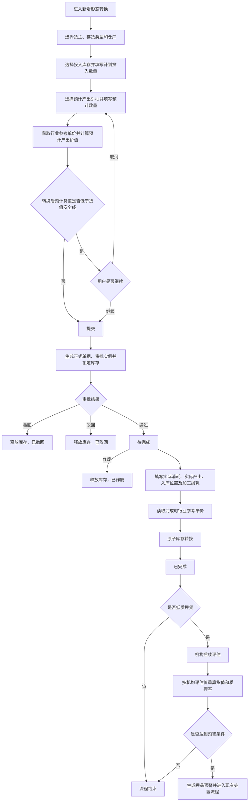
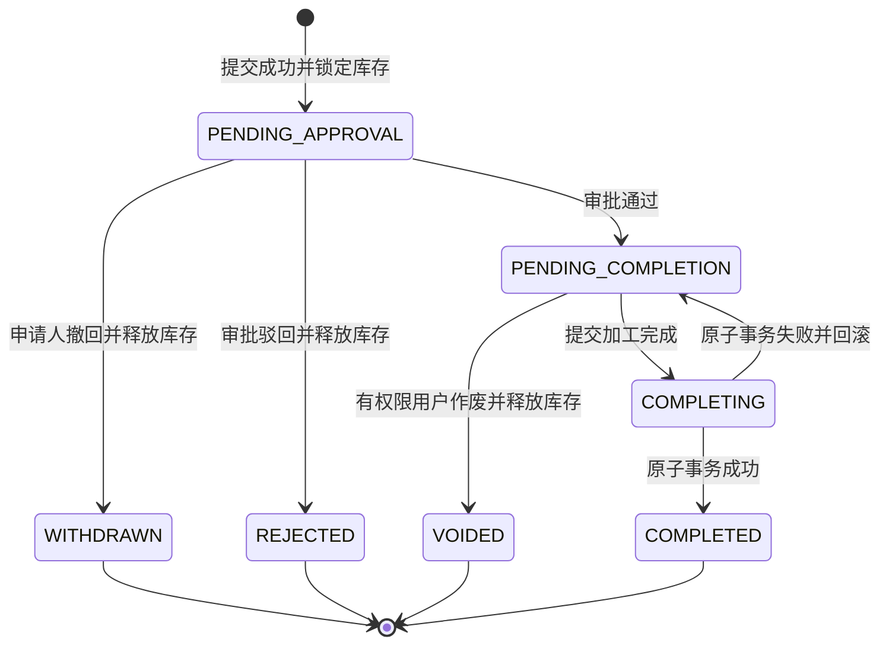
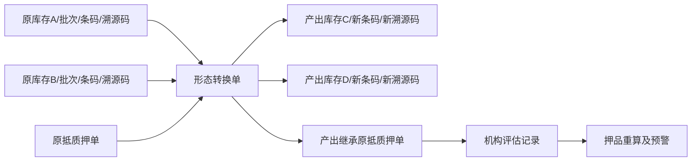

# SYZC存货形态转换功能产品需求文档

> **文档类型**：PRD（产品需求文档）  
> **版本**：V1.1  
> **文档状态**：已确认  
> **创建日期**：2026-07-27  
> **最后更新**：2026-07-27  
> **作者**：森云科技产品管理部  
> **适用版本**：SYZC 6.1

---

## 1. 需求背景与目标

### 1.1 业务背景

供应链金融存货监管过程中，仓内普通货物及抵押、质押货物可能因生产经营需要发生切割、熔炼、组装、拆分等加工行为。加工后货物的SKU、数量、计量单位和物理形态发生变化，系统必须同步调整库存，并保证抵质押货物加工前后的货权关系、押品价值和监管链路不中断。

当前业务需要支持以下典型转换：

- `1:N`：一种投入货物转换成多种产出货物，例如钢卷转换成钢板和边角料。
- `N:1`：多种投入货物共同转换成一种产出货物，例如铝板、铝边料熔炼成铝合金锭。
- `N:N`：多种投入货物共同转换成多种产出货物，例如钢材、零件组装成设备组件并产生废料。

若缺少系统化管理，将产生以下风险：

1. 加工申请未锁定库存，可能与出库、解押、移库等业务并发占用。
2. 抵质押货物加工后未继承原抵质押单，造成货权链路断裂。
3. 投入和产出单位不同，若强行自动计算损耗会形成错误账务数据。
4. 产出货值下降后未重新评估，资金方无法及时识别质押率风险。
5. 加工完成涉及多次库存操作，部分成功会导致账实不符。

### 1.2 需求目标

| 目标 | 衡量口径 | 目标值 |
|---|---|---|
| 建立加工库存闭环 | 完成单投入扣减、余量释放、产出入库的一致率 | 100% |
| 保证货权连续 | 抵质押产出正确继承原抵质押单比例 | 100% |
| 防止库存并发占用 | 同一库存超额锁定或重复扣减事件 | 0 |
| 建立加工追溯 | 已完成单可通过整单追溯全部投入和产出 | 100% |
| 完成风险衔接 | 机构评估价产生后触发押品重算 | 100% |
| 保证关键操作审计 | 提交、审批、撤回、驳回、作废、完成、评估全量留痕 | 100% |

### 1.3 需求范围

**包含**：

- 普通货物、抵押货物和质押货物的形态转换。
- 系统按最高`N:N`能力承载投入与产出组合，兼容`1:N`、`N:1`和`N:N`，页面不要求用户选择或查看转换方式。
- 同货主、同仓库、同抵质押单的投入限制。
- 一级货品汇总及二级库存明细选货。
- 预计投入、预计产出，以及完成加工时登记损耗比例和损耗说明。
- 提交即锁定库存，并进入企业配置的审批流。
- 申请阶段按行业参考单价计算预计产出价值，并按“原抵质押单货品总价值－本次投入货品价值＋预计产出货品价值”试算转换后预计货值。
- 审批中撤回、审批驳回、审批通过后作废。
- 实际消耗、实际产出和产出库位登记。
- 库存转换原子事务、存货条码生成和整单血缘。
- 抵质押产出自动继承原抵质押单。
- 加工完成后机构评估、押品重算及正式预警衔接。
- 加工前现场照片及仓库设备抓拍图自动获取。
- 全路径审计、幂等和并发控制。

**不包含**：

- 普通货与抵质押货混合加工。
- 多货主、跨仓库加工。
- 多张抵押单或质押单共同投入。
- `1:1`形态转换。
- 投入与产出的逐行分配矩阵。
- 计量单位转换系数、BOM、配方和标准工艺管理。
- 根据投入、产出数量自动计算损耗。
- 加工成本归集及产出成本分摊。
- 质检、委外加工及加工费用结算。
- 自动创建机构待评估任务。
- 加工完成后的业务冲正。
- High预警阻断或回滚库存转换。

### 1.4 名词说明

| 名词 | 定义 |
|---|---|
| 业务类型 | 当前库存业务的类别。本功能固定为“形态转换”，并为其他库存业务类型预留字典扩展能力 |
| N:N能力 | 系统允许多种投入SKU共同转换为多种产出SKU，同时自然兼容1:N和N:1；不作为用户选择或页面展示字段 |
| 计划投入数量 | 申请时选定并在提交成功后锁定的库存数量 |
| 实际消耗数量 | 完成加工时确认实际消耗的投入数量，不得超过锁定数量 |
| 预计产出 | 申请阶段确定的产出SKU和预计数量 |
| 实际产出 | 完成阶段在预计SKU不变的前提下填写的实际数量 |
| 行业参考单价 | 系统通过外部价格接口获取的参考价格，用于申请试算和完成计价，不允许用户手工填写 |
| 机构评估价 | 加工入库后由相关机构自行评估形成的价格，优先用于正式押品估值及预警 |
| 整单血缘 | 记录“A、B通过本转换单共同转换成C、D”，不拆分某条投入对应某条产出的数量 |

---

## 2. 用户、场景与功能清单

### 2.1 目标用户

| 用户 | 核心职责 | 数据范围 |
|---|---|---|
| 业务操作员 | 发起形态转换、查看单据、审批中撤回 | 所属企业及授权货主、仓库 |
| 流程审批人 | 按企业配置审批或驳回加工申请 | 流程节点授权数据 |
| 仓库操作员 | 录入实际消耗、实际产出、产出库位和加工损耗，提交完成 | 所属仓库 |
| 业务主管 | 查看、作废待完成单据 | 所属组织和授权仓库 |
| 评估机构用户 | 对已入库的抵质押产出录入或同步评估价 | 本机构授权押品 |
| 风控人员 | 查看押品重算结果及预警并进行后续处置 | 关联资金方或业务线 |
| 系统管理员 | 配置角色权限、查看审计信息 | 按系统权限范围 |

### 2.2 功能清单

| 编号 | 功能名称 | 功能描述 | 优先级 |
|---|---|---|---|
| F01 | 转换单列表 | 查询、筛选、查看形态转换单及状态 | P0 |
| F02 | 新增转换申请 | 录入基础信息，选择投入库存和预计产出 | P0 |
| F03 | 投入货物选择 | 按一级SKU、二级库存明细选择并联动数量 | P0 |
| F04 | 同源业务校验 | 校验存货类型、货主、仓库和抵质押单一致性 | P0 |
| F05 | 预计产出登记 | 确定产出SKU、数量并计算预计产出金额 | P0 |
| F06 | 货值安全线试算 | 计算投入后剩余价值、预计产出价值及转换后预计货值，并与货值安全线比较 | P0 |
| F07 | 提交与库存锁定 | 无草稿，提交成功后生成正式单据、审批实例并锁库 | P0 |
| F08 | 审批流程 | 普通货及抵质押货均接入企业可配置审批流 | P0 |
| F09 | 撤回、驳回和作废 | 按状态结束单据并释放锁定库存 | P0 |
| F10 | 加工结果登记 | 填写实际消耗、实际产出、产出入库位置、损耗比例和损耗说明 | P0 |
| F11 | 原子库存转换 | 同时完成扣减、释放、入库、条码和抵质押继承 | P0 |
| F12 | 整单血缘追溯 | 通过转换单关联全部投入与产出 | P0 |
| F13 | 机构评估衔接 | 机构评估后触发押品重算和正式预警 | P0 |
| F14 | 加工前影像 | 提交时自动获取投入仓库现场照片及设备抓拍图 | P1 |
| F15 | 操作审计 | 保存关键操作、前后快照、IP、版本和请求链路 | P0 |

---

## 3. 总体业务流程

### 3.1 主流程



### 3.2 提交事务

提交成功必须同时完成：

```text
业务校验通过
+ 正式转换单及投入、产出明细落库
+ 审批流程实例创建
+ 全部投入库存锁定
+ 锁定流水生成
+ 操作审计记录
= 提交成功并进入审批中
```

上述核心步骤任一步失败时，不生成正式单据，不保留草稿，不锁定任何库存。提交同时发起加工前影像获取和关联；影像失败是否影响核心提交结果，按待确认项T01的评审结论执行。

### 3.3 完成事务

完成成功必须在同一原子事务中完成：

```text
实际投入扣减
+ 未消耗库存释放
+ 产出库存生成
+ 产出库位写入
+ 新存货条码生成
+ 整单血缘建立
+ 抵质押关系继承（抵质押货）
+ 库存流水和审计日志生成
= 加工单完成
```

任一步失败则全部回滚，单据保持“待完成”。

---

## 4. 字段说明

完整数据字典见[存货形态转换业务字段清单V1.3](./存货形态转换业务字段清单_V1.3.md)。本节列出页面及业务控制所需核心字段。

### 4.1 主表核心字段

| 字段名 | 中文名称 | 类型 | 必填 | 说明 |
|---|---|---|---|---|
| id | 转换单ID | String | 是 | 提交成功后系统生成 |
| conversionNo | 单据号 | String | 是 | 格式：`CVT-YYYYMMDD-流水号` |
| businessDate | 业务时间 | DateTime | 是 | 用户填写的业务发生时间 |
| ownerSubjectType | 货主主体类型 | Enum | 是 | 个人、企业 |
| businessType | 业务类型 | Enum | 是 | 固定为`STOCK_CONVERSION`形态转换 |
| stockType | 存货类型 | Enum | 是 | 普通存货、抵押货、质押货 |
| ownerId | 货主ID | Ref<Owner> | 是 | 所有投入必须一致 |
| ownerIdentifier | 货主标识快照 | String | 是 | 用于查询和历史展示 |
| warehouseId | 仓库ID | Ref<Warehouse> | 是 | 所有投入必须一致 |
| collateralOrderId | 原抵质押单ID | Ref<CollateralOrder> | 条件必填 | 抵质押货必填且仅能关联一张 |
| lossRate | 损耗比例 | Number | 条件必填 | 完成加工时填写，`0%～100%`，只留痕、不参与计算 |
| lossDescription | 损耗说明 | String | 条件必填 | 完成加工时填写的整次加工损耗说明 |
| estimatedOutputValue | 预计产出总金额 | Number | 条件必填 | 全部预计产出行金额之和；存在缺价时为空 |
| originalCollateralValue | 原抵质押单货品总价值 | Number | 条件必填 | 抵押货或质押货提交试算时读取 |
| inputGoodsValue | 本次投入货品价值 | Number | 条件必填 | 按本次选定投入库存的有效价格计算 |
| remainingGoodsValue | 投入后单据剩余价值 | Number | 条件必填 | 原抵质押单货品总价值－本次投入货品价值 |
| goodsSafetyLine | 货值安全线 | Number | 条件必填 | 抵质押单当前生效的货值安全阈值 |
| estimatedPostConversionValue | 转换后预计货值 | Number | 条件必填 | 投入后单据剩余价值＋预计产出货品价值 |
| status | 单据状态 | Enum | 是 | 不包含草稿状态 |
| version | 数据版本号 | Number | 是 | 并发控制，从1递增 |
| processInstanceId | 审批实例ID | Ref<ProcessInstance> | 是 | 提交成功后创建 |
| sitePhotoIds | 加工前现场照片 | Array<Ref<Attachment>> | 待确认 | 提交时按仓库自动获取 |
| deviceSnapshotIds | 设备抓拍图 | Array<Ref<Attachment>> | 待确认 | 提交时由仓库联网设备抓拍 |
| submittedBy | 制单人 | Ref<User> | 是 | 当前登录用户 |
| submittedAt | 制单时间 | DateTime | 是 | 提交成功时间 |
| completedBy | 完成人 | Ref<User> | 条件必填 | 完成后生成 |
| completedAt | 完成时间 | DateTime | 条件必填 | 完成后生成 |

### 4.2 投入明细核心字段

| 字段名 | 中文名称 | 类型 | 必填 | 说明 |
|---|---|---|---|---|
| inputId | 投入明细ID | String | 是 | 明细主键 |
| inventoryDetailId | 原库存明细ID | Ref<InventoryDetail> | 是 | 锁定和扣减对象 |
| skuId | 投入SKU | Ref<Sku> | 是 | 提交后不可变更 |
| storageLocationId | 货物位置 | Ref<StorageLocation> | 是 | 原库存位置快照 |
| storageBinId | 具体位置 | Ref<StorageBin> | 是 | 原库区、库位快照 |
| originalInboundAt | 原入库时间 | DateTime | 是 | 原库存入库时间快照 |
| customInfoSnapshot | 其他信息 | Object | 否 | 生产时间和用户自定义信息快照 |
| inventoryBarcode | 原存货条码 | String | 是 | 原库存唯一条码 |
| plannedInputQuantity | 计划投入数量 | Number | 是 | 必须大于0且不超过可用数量 |
| lockedQuantity | 锁定数量 | Number | 是 | 提交成功后等于计划投入数量 |
| actualConsumedQuantity | 实际消耗数量 | Number | 条件必填 | 完成时必须大于0且不超过锁定数量 |
| releasedQuantity | 释放数量 | Number | 条件必填 | 完成时为锁定量减实际量；终止时为全部锁定量 |
| traceCode | 原溯源码 | String | 是 | 整单血缘来源 |

### 4.3 产出明细核心字段

| 字段名 | 中文名称 | 类型 | 必填 | 说明 |
|---|---|---|---|---|
| outputId | 产出明细ID | String | 是 | 明细主键 |
| skuId | 产出SKU | Ref<Sku> | 是 | 提交后不可新增、删除或替换 |
| plannedOutputQuantity | 预计产出数量 | Number | 是 | 必须大于0 |
| estimatedExternalPrice | 行业参考单价快照 | Number | 否 | 申请时由外部价格接口获取 |
| estimatedOutputAmount | 预计产出行金额 | Number | 否 | 预计数量×行业参考单价 |
| actualOutputQuantity | 实际产出数量 | Number | 条件必填 | 必须大于0，可大于或小于预计数量 |
| completionExternalPrice | 完成时行业参考单价 | Number | 否 | 完成时重新获取 |
| targetStorageLocationId | 产出货物位置 | Ref<StorageLocation> | 条件必填 | 完成时必填，必须属于主表仓库 |
| targetStorageBinId | 产出具体位置 | Ref<StorageBin> | 条件必填 | 完成时必填 |
| generatedInventoryBarcode | 新存货条码 | String | 条件必填 | 完成事务自动生成 |
| generatedTraceCode | 新溯源码 | String | 条件必填 | 通过整单关联所有投入来源 |
| inheritedCollateralOrderId | 继承抵质押单ID | Ref<CollateralOrder> | 条件必填 | 抵质押产出必填且与主表一致 |

### 4.4 核心枚举

#### businessType（业务类型）

- `STOCK_CONVERSION`：形态转换。本功能固定值，统一业务类型字典预留其他库存业务。

#### stockType（存货类型）

- `ORDINARY`：普通存货，仅可选择状态为“存货中”的库存。
- `MORTGAGE`：抵押货，仅可选择所选抵押单下状态为“抵押中”的库存。
- `PLEDGE`：质押货，仅可选择所选质押单下状态为“质押中”的库存。

#### status（单据状态）

- `PENDING_APPROVAL`：审批中。
- `PENDING_COMPLETION`：待完成。
- `COMPLETING`：完成处理中，系统内部瞬时状态。
- `COMPLETED`：已完成。
- `REJECTED`：已驳回。
- `WITHDRAWN`：已撤回。
- `VOIDED`：已作废。

> 系统不定义`DRAFT`状态。

---

## 5. 业务规则

### 5.1 规则总表

| 规则编号 | 规则名称 | 规则描述 | 适用场景 |
|---|---|---|---|
| R01 | 无草稿提交 | 新增数据不暂存，提交成功才生成正式单据 | 新增、提交 |
| R02 | 存货类型隔离 | 普通存货、抵押货、质押货三种类型不得在同一单据混合 | 选货、提交 |
| R03 | 同货主同仓库 | 所有投入必须属于同一货主和同一仓库 | 选货、提交 |
| R04 | 抵质押同源 | 抵质押投入只能来自同一抵押单或质押单 | 选货、提交 |
| R05 | 提交即锁库 | 提交成功后按计划投入数量锁定库存 | 提交 |
| R06 | 两级数量一致 | 一级计划投入等于二级库存计划投入之和 | 选货、提交 |
| R07 | 产出SKU冻结 | 提交后产出SKU不可新增、删除或替换 | 审批、完成 |
| R08 | 损耗人工记录 | 完成加工时填写损耗比例和说明，不通过投入产出自动计算 | 完成、详情 |
| R09 | 预计货值试算 | 按行业参考单价计算预计产出价值，并按货值安全线公式试算 | 提交 |
| R10 | 缺价不阻断 | 无行业参考价时提示无法完整试算但允许流转 | 提交、完成 |
| R11 | 实际投入上限 | 实际消耗大于0且不超过锁定数量 | 完成 |
| R12 | 未耗库存释放 | 实际消耗小于锁定量时自动释放余量 | 完成 |
| R13 | 实际产出校验 | 实际产出数量大于0，可偏离预计数量 | 完成 |
| R14 | 产出位置必填 | 每条产出必须选择本仓库内有效位置和具体位置 | 完成 |
| R15 | 原子库存转换 | 完成相关库存及货权操作同时成功或同时失败 | 完成 |
| R16 | 抵质押继承 | 抵质押全部产出继承原抵质押单 | 完成 |
| R17 | 整单血缘 | 全部投入和产出通过转换单建立整体关系 | 完成、追溯 |
| R18 | 机构后评估 | 入库后机构评估，按评估价重算并生成正式预警 | 评估、风控 |
| R19 | High不回滚 | 正式High预警不撤销或回滚已完成转换 | 风控 |
| R20 | 完成不可冲正 | 已完成单据不提供业务冲正 | 完成后 |
| R21 | 幂等与版本控制 | 提交、状态操作及完成需防重和校验版本 | 全流程 |

### 5.2 同源校验规则

系统在选择库存和提交时进行两次校验：

1. 普通货单据只能选择普通货库存。
2. 抵押货单据只能选择所选抵押单下状态为“抵押中”的库存；质押货单据只能选择所选质押单下状态为“质押中”的库存；普通存货单据只能选择状态为“存货中”的库存。
3. 所有投入的`ownerId`必须相同。
4. 所有投入的`warehouseId`必须相同。
5. 抵质押投入的`collateralOrderId`必须相同，且与主表关联单一致。
6. 任一校验不通过时禁止加入或提交，并指出冲突库存。

### 5.3 投入数量规则

1. 用户可在一级货品行填写计划投入数量，系统按现有库存分配规则自动分配到二级库存明细。
2. 用户也可逐条填写二级库存计划投入数量，系统实时汇总一级数量。
3. 一级数量必须等于二级数量之和。
4. 每条二级计划投入数量必须大于0且不超过实时可用数量。
5. 提交时重新读取实时库存，不能仅依赖页面查询快照。
6. 实际消耗数量必须大于0且不超过该行锁定数量。
7. 某条投入实际完全未使用时不能填0；审批中先撤回，审批通过后需作废，然后重新发起正确单据。

### 5.4 产出与损耗规则

1. 申请时确定全部预计产出SKU和预计数量。
2. 完成时只允许调整每条实际产出数量，不得改变SKU结构。
3. 每条预计和实际产出数量均必须大于0。
4. 实际产出数量可以大于或小于预计数量。
5. 边角料、副产品或废料需要入库时，必须在申请阶段作为产出SKU录入。
6. 损耗比例和损耗说明不在申请阶段填写，只在“完成形态转换”时录入。
7. 损耗比例范围为`0%～100%`且必填，无损耗时填写`0%`；损耗说明必填。
8. 损耗不参与库存、金额或质押率计算，系统不校验投入产出之间的单位换算和平衡关系。

### 5.5 价格、试算与预警规则

#### 申请阶段

1. 系统为每条预计产出读取行业参考单价，用户不可编辑。
2. 预计产出行金额=`预计产出数量×行业参考单价`。
3. 预计产出总金额为全部产出行金额之和。
4. 新增页面仅展示预计产出总金额，不展示融资本金、预计质押率或风险等级板块。
5. 任一SKU缺价时，显示“部分产出暂无价格，无法完成货值安全线试算”，不生成预警、不阻断提交。
6. 抵押货或质押货提交时，系统读取原抵质押单货品总价值、本次投入货品价值及货值安全线，并计算：
   - 投入后单据剩余价值=`原抵质押单货品总价值－本次投入货品价值`；
   - 转换后预计货值=`投入后单据剩余价值＋预计产出货品价值`。
7. 当转换后预计货值低于货值安全线时，提交动作弹出风险提示，展示上述各项价值、货值缺口及计算公式；用户可取消调整，也可确认继续。
8. 示例：原货品总价值100万元、本次投入价值60万元、预计产出价值20万元，则转换后预计货值为`100－60＋20=60万元`；因低于80万元货值安全线而触发提示。
9. 用户确认继续只记录预计风险及确认痕迹，不生成正式押品预警，也不阻断后续库存转换。

#### 完成阶段

1. 系统按实际产出数量及完成时最新行业参考单价重新计算实际产出金额。
2. 缺少行业参考单价时只提示，不阻断库存转换，不允许填写临时价格。
3. 行业参考价格用于加工入库计价，不替代后续机构评估。

#### 入库后评估阶段

1. 机构可在加工入库后自行评估产出押品。
2. 系统不创建“待评估任务”，评估价长期缺失也不影响加工单状态。
3. 机构评估价产生后，以机构评估价优先于行业参考价更新押品估值。
4. 系统重算货值和质押率，满足阈值时生成正式押品预警。
5. High预警不回滚加工结果，用户在现有押品预警流程中处理。

### 5.6 影像获取规则

1. 用户点击提交时，系统根据投入仓库自动获取加工前现场照片。
2. 系统调用仓库联网设备获取设备抓拍图。
3. 图片需保存设备、仓库、抓拍时间及附件引用，并与转换单关联。
4. 加工完成后不重复抓取加工后影像。
5. 影像获取失败是否阻断提交属于待确认项，见第13章。

---

## 6. 状态与流转

### 6.1 状态定义

| 状态值 | 状态名称 | 可执行操作 | 是否终态 | 库存影响 |
|---|---|---|---|---|
| PENDING_APPROVAL | 审批中 | 查看、申请人撤回、流程审批 | 否 | 计划投入数量保持锁定 |
| PENDING_COMPLETION | 待完成 | 查看、完成、按权限作废 | 否 | 计划投入数量保持锁定 |
| COMPLETING | 完成处理中 | 只读 | 否，内部瞬时状态 | 库存事务执行中 |
| COMPLETED | 已完成 | 查看、追溯 | 是 | 实际投入已扣减，余量已释放，产出已入库 |
| REJECTED | 已驳回 | 查看 | 是 | 全部锁定库存已释放 |
| WITHDRAWN | 已撤回 | 查看 | 是 | 全部锁定库存已释放 |
| VOIDED | 已作废 | 查看 | 是 | 全部锁定库存已释放 |

### 6.2 状态流转图



### 6.3 流转条件

| 流转 | 触发条件 | 操作权限 | 后置影响 |
|---|---|---|---|
| 新增页→审批中 | 全部校验通过、库存锁定成功、流程实例创建成功 | 转换单提交 | 生成正式单据和审计记录 |
| 审批中→已撤回 | 当前用户为申请人，流程尚未结束 | 转换单撤回 | 终止审批并释放全部库存 |
| 审批中→已驳回 | 当前审批节点执行驳回 | 流程审批 | 结束流程并释放全部库存 |
| 审批中→待完成 | 所有审批节点通过 | 流程审批 | 保持库存锁定，开放完成入口 |
| 待完成→已作废 | 单据未开始完成事务 | 转换单作废 | 无需作废审批，释放全部库存 |
| 待完成→完成处理中 | 实际结果及库位校验通过 | 转换单完成 | 获取排他锁并开始原子事务 |
| 完成处理中→已完成 | 全部库存和货权步骤成功 | 系统 | 形成库存、条码、血缘和审计记录 |
| 完成处理中→待完成 | 任一步失败 | 系统 | 全部回滚，允许排障后重试 |

---

## 7. 页面与交互

### 7.1 列表页

#### 筛选区

| 筛选项 | 控件 | 规则 |
|---|---|---|
| 单据号 | 输入框 | 模糊查询 |
| 业务日期范围 | 日期范围 | 按业务时间起止查询 |
| 货主名称/标识 | 输入框 | 同时模糊匹配货主名称和标识 |
| 仓库名称 | 级联筛选 | 按企业、区域、仓库级联 |
| 货品名称 | 级联筛选 | 查询投入或产出SKU，任一命中即可 |
| 制单人 | 下拉选择 | 精确查询 |
| 制单时间 | 日期时间范围 | 按提交时间查询 |
| 存货类型 | 下拉选择 | 普通存货、抵押货、质押货 |
| 单据状态 | 多选下拉 | 不含草稿 |

#### 列表字段

| 列名 | 展示规则 |
|---|---|
| 序号 | 当前分页从1开始 |
| 单据号 | 可点击进入详情 |
| 货主名称/标识 | 名称与标识组合展示 |
| 业务类型 | 固定展示“形态转换” |
| 业务时间 | `YYYY-MM-DD HH:mm:ss` |
| 仓库名称 | 名称快照 |
| 关联单号 | 普通货显示`--`，抵质押货可跳转原单 |
| 投入货物 | 分SKU显示“名称×计划数量 单位”，不同单位不合计 |
| 产出货物 | 未完成展示预计数量，完成后展示实际数量 |
| 制单人/时间 | 组合展示 |
| 状态 | 状态标签 |
| 操作 | 查看、撤回、完成、作废，按状态和权限显示 |

交互原型及测试数据至少提供10条转换单，覆盖普通存货、抵押货、质押货以及审批中、待完成、已完成、已撤回、已驳回、已作废等状态。

### 7.2 新增页

页面按以下顺序展示：

1. 基础信息。
2. 投入货品明细。
3. 预计产出明细。
4. 预计产出总金额。

#### 基础信息

- 业务时间。
- 货主主体类型：个人、企业。
- 货主名称：选择类型后按名称模糊查询，只能选择已有货主。
- 货主标识：选择货主后只读反显。
- 业务类型：只读，固定为“形态转换”。
- 存货类型：下拉选择普通存货、抵押货或质押货；不展示转换方式，系统按N:N能力处理投入产出关系。
- 仓库：级联选择。
- 关联抵押单/质押单：根据存货类型动态展示并必填，普通存货隐藏。
- 转换原因、备注。

#### 投入货品明细

一级货品列：序号、货物名称、计划投入数量、操作。

二级库存列：序号、货物位置、具体位置、入库时间、其他信息、存货条码、状态、计划投入数量、操作。

交互要求：

1. 添加货品弹窗采用同样的两级结构。
2. 一级填写数量后，按系统现有库存分配规则自动扣取二级数量。
3. 二级逐行填写后，自动汇总一级数量。
4. 移除最后一条二级库存时，同步移除空的一级货品行。
5. 切换存货类型、货主、仓库或抵质押单后，若已选投入，必须提示用户确认清空相关投入。
6. 存货类型与明细状态联动：抵押货仅展示“抵押中”、质押货仅展示“质押中”、普通存货仅展示“存货中”。

#### 预计产出明细

产出明细列：序号、产出货物、规格型号、计量单位、预计产出数量、行业参考单价、预计产出行金额、操作。

表格底部展示“预计产出总金额”。任一SKU缺价时展示“无法完整试算”，不得将部分金额作为完整总金额展示。

新增页不展示或填写加工损耗信息，也不展示融资本金、预计质押率和风险等级板块。

#### 提交交互

1. 点击提交后按钮进入加载状态，防止重复点击。
2. 前端完成基础校验后调用后端提交，后端必须重新校验所有规则。
3. 抵押货或质押货提交时才执行货值安全线试算；转换后预计货值低于安全线时弹出风险提示。
4. 弹窗展示原抵质押单货品总价值、本次投入货品价值、投入后剩余价值、预计产出货品价值、转换后预计货值、货值安全线及缺口。
5. 用户取消后留在当前页面调整；用户确认继续后记录确认时间和操作人。
6. 提交成功跳转详情页或列表页，并提示“提交成功，库存已锁定”。
7. 提交失败保留当前页面已填写数据，但服务端不生成单据和库存锁定；刷新或关闭页面后数据不保留。

### 7.3 完成加工页

#### 实际投入

按提交时二级库存明细逐行展示：投入货物、锁定数量、实际消耗数量、自动释放数量。

- 实际消耗数量默认可带出锁定数量，但必须由用户确认。
- 实际消耗必须大于0且不超过锁定数量。
- 自动释放数量实时计算，只读展示。

#### 实际产出及入库位置

逐行展示：产出货物、预计数量、实际数量、货物位置、具体位置、完成时行业参考单价、实际产出行金额、存货条码。

- 产出SKU只读。
- 实际数量必须大于0。
- 货物位置和具体位置必须属于主表仓库。
- 存货条码在完成成功后生成，提交前展示“系统生成”。
- 任一产出未选择位置或具体位置时禁止完成。

#### 加工损耗

- 加工损耗信息位于实际产出明细下方，仅在完成加工时填写。
- 损耗比例必填，范围为`0%～100%`；无损耗填写`0%`。
- 损耗说明必填；损耗仅作为整单记录，不参与库存、货值或安全线计算。

#### 强确认

点击“完成加工”后展示确认弹窗，至少包含：

- 全部实际投入、释放数量。
- 全部实际产出、入库位置。
- 损耗比例和损耗说明。
- 实际产出总金额或缺价提示。
- 抵质押关系继承提示。
- “完成后不支持业务冲正”的明确提示。

用户二次确认后提交完成请求。

### 7.4 详情页

#### 基础信息

展示单据号、状态、制单人/时间、货主名称/标识、业务时间、存货类型、业务类型、仓库、关联单号、转换原因和备注。已完成单额外展示加工损耗；未完成单不展示损耗结果。

详情页顶部必须提供“返回”按钮，返回转换单列表。

#### 加工前影像

现场照片和设备抓拍图直接展示在基础信息区域内，不设置独立“加工前影像”区块标题；支持预览并保留设备、仓库和抓拍时间信息。

#### 投入货物

采用与新增选货一致的两级结构：一级按SKU汇总计划投入数量，二级展示原位置、具体位置、入库时间、其他信息、存货条码、状态、计划投入、实际消耗和释放数量。

#### 产出货物

展示预计数量、实际数量、行业参考价格快照、产出位置和新存货条码；列表不展示“机构评估价”字段。

#### 审核记录

详情仅提供“投入货物”“产出货物”“审核记录”三个Tab，不展示“估值与预警”和“操作记录”Tab。审核记录需支持发起节点、自动节点、普通审批、会签、或签、抄送和待处理节点，展示处理人、参与人、结果、状态、时间及说明。

整单血缘仅展示“投入货物集合→产出货物集合”的流向，不在页面流向中展示批次号或转换单号；底层仍通过转换单ID保存完整追溯关系。

### 7.5 空、错和弱网状态

- 无可用库存：展示空状态，不允许提交。
- 行业参考单价加载中：价格及金额显示加载状态，不允许重复请求。
- 价格接口失败：展示缺价提示，允许继续。
- 提交或完成请求超时：不得直接认定失败，应使用幂等键查询原请求结果。
- 列表加载失败：保留筛选条件，提供重试。
- 完成事务失败：提示失败原因，保持待完成状态和原锁定库存。

---

## 8. 异常处理

| 编号 | 异常场景 | 触发条件 | 处理规则 | 提示信息 |
|---|---|---|---|---|
| E01 | 必填字段缺失 | 任一必填字段为空 | 阻止提交并定位字段 | “请填写：{字段名称}” |
| E02 | 无投入或产出 | 任一明细列表为空 | 阻止提交 | “请至少添加一条投入货物和一条产出货物” |
| E03 | 不支持1:1 | 投入和产出均只有一条 | 阻止提交 | “当前仅支持1:N、N:1、N:N形态转换” |
| E04 | 存货类型混合 | 普通货与抵质押货混选 | 阻止加入或提交 | “普通货与抵质押货不能共同加工” |
| E05 | 货主不一致 | 投入存在不同货主 | 阻止加入或提交 | “同一转换单只能选择同一货主的货物” |
| E06 | 仓库不一致 | 投入存在不同仓库 | 阻止加入或提交 | “同一转换单只能选择同一仓库的货物” |
| E07 | 抵质押单不一致 | 投入来自多张抵质押单 | 阻止加入或提交 | “抵质押货物必须来自同一抵质押单” |
| E08 | 库存不足 | 提交时实时可用量小于计划量 | 整单提交失败，不部分锁定 | “库存可用数量已变化，请重新选择” |
| E09 | 一级二级数量不一致 | 汇总数量不等 | 阻止提交 | “货物{名称}的明细数量与汇总数量不一致” |
| E10 | 行业参考价缺失 | 任一产出未获取价格 | 提示但不阻断 | “部分产出暂无价格，无法完成货值安全线试算” |
| E11 | 预计货值低于安全线 | 转换后预计货值小于货值安全线 | 弹窗展示价值构成和缺口，可取消或确认继续 | “预计转换后货值低于货值安全线，请补充保证金或增加押品” |
| E12 | 实际消耗为0 | 任一投入实际消耗为0 | 阻止完成 | “实际消耗数量必须大于0；如未使用请取消后重新发起” |
| E13 | 实际消耗超限 | 实际量超过锁定量 | 阻止完成 | “实际消耗数量不能超过锁定数量” |
| E14 | 实际产出为0 | 任一实际产出小于等于0 | 阻止完成 | “实际产出数量必须大于0” |
| E15 | 产出SKU变化 | 请求SKU与申请不一致 | 阻止完成 | “产出货物不能调整，只能修改数量” |
| E16 | 产出位置缺失 | 任一位置或具体位置为空 | 阻止完成 | “请选择全部产出货物的入库位置” |
| E17 | 位置跨仓库 | 产出位置不属于主表仓库 | 阻止完成 | “产出位置必须属于本转换单仓库” |
| E18 | 完成部分失败 | 扣减、释放、入库等任一步异常 | 全部回滚并保持待完成 | “加工完成失败，库存未发生变化，请重试” |
| E19 | 重复提交 | 相同幂等键重复请求 | 返回首次处理结果 | 不重复生成单据或扣减库存 |
| E20 | 并发状态冲突 | 撤回、作废、完成并发 | 仅首个有效操作成功 | “单据状态已发生变化，请刷新后重试” |
| E21 | 机构评估价缺失 | 加工完成后尚无机构价 | 不创建待办、不预警、不阻断 | 不强提示 |
| E22 | 完成后录入错误 | 已完成后要求修改 | 不提供冲正入口 | “加工已完成，不支持业务冲正” |
| E23 | 损耗信息缺失或越界 | 完成时损耗说明为空，或比例不在0%～100% | 阻止完成 | “请填写0%至100%的加工损耗比例和损耗说明” |

---

## 9. 撤回、驳回与作废规则

### 9.1 撤回

- 仅申请人可在“审批中”撤回。
- 撤回后进入“已撤回”终态。
- 终止审批实例，释放全部锁定库存。
- 不生成产出库存，不产生正式押品预警。
- 不恢复为草稿，不允许修改或重新提交。

### 9.2 驳回

- 由当前审批节点按流程权限执行。
- 驳回后进入“已驳回”终态。
- 释放全部锁定库存。
- 原单只读；继续业务需重新创建转换单。

### 9.3 作废

- 仅“待完成”状态允许作废。
- 具备作废权限的用户可直接作废，不再次发起作废审批。
- 作废后进入“已作废”终态并释放全部锁定库存。
- 作废必须填写原因并记录前后快照。

### 9.4 并发处理

作废、完成、撤回、审批均需校验`status+version`。同一时刻只允许一个有效状态变更成功。

---

## 10. 权限说明

### 10.1 权限点

| 权限编码 | 权限名称 | 说明 |
|---|---|---|
| stockConversion:list | 转换单列表 | 查看列表和筛选 |
| stockConversion:view | 转换单查看 | 查看详情及普通操作记录 |
| stockConversion:create | 转换单新增 | 进入新增页并提交 |
| stockConversion:withdraw | 转换单撤回 | 仅申请人在审批中使用 |
| stockConversion:approve | 转换单审批 | 按流程节点权限执行 |
| stockConversion:complete | 转换单完成 | 录入实际数据并完成库存转换 |
| stockConversion:void | 转换单作废 | 待完成状态直接作废 |
| stockConversion:trace | 加工血缘查看 | 查看投入产出追溯 |
| stockConversion:audit | 审计详情查看 | 查看IP及前后版本快照 |
| collateral:valuation | 机构评估 | 录入或同步机构评估价 |
| collateral:warning | 押品预警查看 | 查看重算和预警结果 |

### 10.2 RBAC矩阵

| 操作 | 业务操作员 | 流程审批人 | 仓库操作员 | 业务主管 | 评估机构用户 | 风控人员 | 系统管理员 |
|---|---:|---:|---:|---:|---:|---:|---:|
| 列表/详情 | 授权范围 | 授权范围 | 本仓库 | 授权范围 | 关联押品 | 关联业务 | 全部 |
| 新增提交 | 是 | 否 | 按配置 | 是 | 否 | 否 | 是 |
| 审批中撤回 | 仅本人 | 否 | 仅本人发起 | 仅本人发起 | 否 | 否 | 按配置 |
| 流程审批/驳回 | 否 | 按节点 | 按节点 | 按节点 | 否 | 按节点 | 按配置 |
| 完成加工 | 否 | 否 | 本仓库 | 按授权 | 否 | 否 | 按配置 |
| 作废 | 否 | 否 | 按授权 | 是 | 否 | 否 | 是 |
| 血缘查看 | 授权范围 | 授权范围 | 本仓库 | 授权范围 | 关联押品 | 关联业务 | 全部 |
| 机构评估 | 否 | 否 | 否 | 否 | 本机构 | 否 | 按配置 |
| 押品预警处置 | 否 | 否 | 否 | 只读 | 只读 | 是 | 按配置 |
| 完整审计快照 | 否 | 否 | 否 | 按授权 | 否 | 按授权 | 全部 |

所有权限均需同时受数据权限约束，不得仅依赖前端隐藏按钮。

---

## 11. 数据溯源与审计

### 11.1 数据溯源



| 追溯对象 | 关键字段 | 目标记录 |
|---|---|---|
| 原库存 | inventoryDetailId、batchNo、barcode、traceCode | 投入明细、扣减/释放流水 |
| 产出库存 | generatedInventoryDetailId、generatedBarcode、generatedTraceCode | 产出明细、入库流水 |
| 投入产出关系 | conversionOrderId | 整单关联全部投入与产出 |
| 抵质押关系 | collateralOrderId、inheritedCollateralOrderId | 原抵质押单与产出库存 |
| 行业参考价格 | 单价、价格时间、价格来源 | 预计及完成价格快照 |
| 机构评估 | valuationId、institutionId、valuedAt | 风控重算及预警记录 |

### 11.2 审计动作

必须记录：提交、风险试算、风险确认继续、审批通过、驳回、撤回、作废、完成请求、完成成功、完成失败、机构评估、押品重算、预警生成。

### 11.3 审计字段

| 字段 | 说明 |
|---|---|
| auditId | 日志唯一ID |
| conversionOrderId/conversionNo | 关联转换单 |
| actionType | 操作动作 |
| operatorId/operatorName/operatorRole | 操作主体及角色快照 |
| clientIp | 客户端IP |
| requestId/idempotencyKey | 请求链路及防重标识 |
| versionBefore/versionAfter | 操作前后版本 |
| snapshotBefore/snapshotAfter | 主表、投入、产出及关键关联数据镜像 |
| failureCode/failureMessage | 失败动作结果 |
| createdAt | 毫秒级操作时间 |

日志只允许追加，不允许业务用户修改或删除。

---

## 12. 非功能要求

### 12.1 一致性

- 提交锁库和完成库存转换必须使用数据库事务及库存排他校验。
- 抵质押继承失败视为完成事务失败，不允许先入普通库存再异步补挂。
- 所有库存数量使用库存模块统一精度，金额使用定点数。

### 12.2 幂等

- 提交和完成必须携带唯一幂等键。
- 相同幂等键重复请求返回首次结果。
- 弱网超时后客户端先查询原请求结果，不直接再次创建业务数据。

### 12.3 并发

- 库存锁定需校验实时可用量和库存版本。
- 状态操作需校验单据`status+version`。
- 作废与完成、撤回与审批等并发操作只允许一个成功。

### 12.4 性能

| 场景 | 目标 |
|---|---|
| 列表查询 | 常规条件下P95≤2秒 |
| 可用库存查询 | 常规条件下P95≤2秒 |
| 提交锁库 | 不含外部影像和价格接口等待时P95≤3秒 |
| 完成事务 | 常规明细量下P95≤5秒 |

### 12.5 安全

- 后端校验所有权限、状态和数据范围。
- 货主标识在非必要场景按系统隐私规则脱敏。
- 审计快照和影像附件按企业、仓库和资金方数据权限隔离。
- 错误信息不得向前端暴露数据库堆栈或敏感配置。

---

## 13. 待确认事项

| 编号 | 待确认问题 | 当前已确定部分 | 影响范围 |
|---|---|---|---|
| T01 | 提交时现场照片或设备抓拍图获取失败，是否阻断提交？ | 提交时自动获取加工前影像；详情页需展示 | 字段必填性、提交事务、超时和异常提示 |

除T01外，核心业务规则已确认。

---

## 14. 验收标准

| 编号 | 验收场景 | 验收标准 |
|---|---|---|
| AC01 | 无草稿 | 页面关闭后不产生草稿；提交成功才有正式单据 |
| AC02 | 提交锁库 | 提交成功即按二级库存计划量锁定；提交失败不产生任何锁定 |
| AC03 | 普通/抵质押隔离 | 混选时前后端均阻断 |
| AC04 | 同源限制 | 跨货主、跨仓库、跨抵质押单均无法提交 |
| AC05 | 1:N | 一条投入可关联多条产出并完成入库 |
| AC06 | N:1 | 多条投入可关联一条产出并完成入库 |
| AC07 | N:N | 多条投入和产出以整单建立血缘，不生成逐行分配关系 |
| AC08 | 两级数量 | 一级计划数量始终等于二级明细之和 |
| AC09 | 损耗 | 新增时不展示；完成时比例和说明必填，比例为0%～100%，不参与库存、金额或安全线计算 |
| AC10 | 价格缺失 | 显示无法完整试算，仍可提交和完成，不产生正式预警 |
| AC11 | 货值安全线提示 | 按“原货值－投入价值＋预计产出价值”计算；低于安全线时可确认继续，保存确认痕迹但不生成正式预警 |
| AC12 | 撤回 | 审批中申请人撤回后释放库存并进入不可恢复终态 |
| AC13 | 驳回 | 驳回后释放库存，不退回草稿 |
| AC14 | 作废 | 待完成单由有权限用户直接作废并释放库存 |
| AC15 | 实际消耗 | 每行大于0且不超过锁定量，余量自动释放 |
| AC16 | 产出SKU | 完成时不能增加、删除或替换SKU |
| AC17 | 实际产出 | 每行数量大于0，可大于或小于预计数量 |
| AC18 | 入库位置 | 任一产出位置或具体位置为空时禁止完成 |
| AC19 | 原子完成 | 任一步失败全部回滚并保持待完成，不出现部分库存结果 |
| AC20 | 抵质押继承 | 抵质押全部产出100%挂接原抵质押单 |
| AC21 | 存货条码 | 每条产出库存完成时生成唯一条码 |
| AC22 | 机构评估 | 评估价产生后触发押品重算，满足条件生成正式预警 |
| AC23 | High预警 | 不回滚已完成库存转换 |
| AC24 | 不支持冲正 | 已完成单无修改、撤回、冲正入口 |
| AC25 | 幂等 | 重复提交或完成不重复生成单据、扣减或入库 |
| AC26 | 并发 | 作废与完成等并发只允许一个结果成功 |
| AC27 | 审计 | 所有关键动作包含操作人、时间、IP和前后版本快照 |
| AC28 | 存货状态联动 | 普通存货、抵押货、质押货分别只允许选择存货中、抵押中、质押中库存 |
| AC29 | 新增页精简 | 不展示转换方式、加工损耗、融资本金、预计质押率和风险等级板块 |
| AC30 | 详情投入层级 | 投入货物按一级SKU汇总和二级库存明细展示，一级数量等于二级之和 |
| AC31 | 详情Tab | 仅展示投入货物、产出货物、审核记录；产出列表无机构评估价字段 |
| AC32 | 审批节点展示 | 审核记录可正确展示发起、自动、审批、会签、或签、抄送和待处理节点 |

---

## 15. 研发工作项拆分

单项控制在2个人日以内，实际排期由研发评审后确认。

| 工作项 | 内容 | 建议工作量 |
|---|---|---:|
| W01 | 转换单主从表、评估关联及审计表设计 | 1.5人日 |
| W02 | 列表查询、筛选及数据权限接口 | 1.5人日 |
| W03 | 新增页基础信息及货主联动 | 1人日 |
| W04 | 两级投入库存选择及数量联动 | 2人日 |
| W05 | 同源、存货状态及数量校验 | 1.5人日 |
| W06 | 预计产出、行业价格及金额汇总 | 1.5人日 |
| W07 | 货值安全线试算及风险确认交互 | 1.5人日 |
| W08 | 提交、审批实例创建和库存锁定事务 | 2人日 |
| W09 | 撤回、驳回、作废及库存释放 | 2人日 |
| W10 | 完成页实际投入和产出交互 | 1.5人日 |
| W11 | 产出位置选择和存货条码生成 | 1.5人日 |
| W12 | 原子库存转换及幂等控制 | 2人日 |
| W13 | 抵质押继承及整单血缘 | 2人日 |
| W14 | 机构评估价、押品重算及预警集成 | 2人日 |
| W15 | 加工前影像接口及详情展示 | 1.5人日 |
| W16 | 详情页两级投入、产出及审核记录展示 | 1.5人日 |
| W17 | 并发、异常及弱网处理 | 2人日 |
| W18 | 权限点、数据权限及审计快照 | 2人日 |
| W19 | 单元测试、接口测试及事务回滚测试 | 2人日 |
| W20 | 前端E2E及业务验收用例 | 2人日 |

---

## 附录

### A. 修订记录

| 版本 | 日期 | 修订内容 | 修订人 |
|---|---|---|---|
| V1.0 | 2026-07-27 | 基于已确认业务规则、业务推演和字段清单生成首版PRD | 森云科技产品管理部 |
| V1.1 | 2026-07-27 | 同步已确认原型：取消转换方式展示，拆分三类存货及状态，调整货值安全线公式，损耗移至完成页，更新详情层级、Tab及审批节点 | 森云科技产品管理部 |

### B. 参考文档

- [PRD文档模板](../../../05-常用模板/d-1文档模板.md)
- [存货形态转换业务字段清单V1.3](./存货形态转换业务字段清单_V1.3.md)
- [货物加工转变功能PRD V2.0](../../a-最新基准版/02仓储板块/01-货物加工/货物加工转变功能_PRD_V2.0.md)（仅作历史参考，冲突口径不沿用）

### C. 业务口径优先级

本PRD V1.1使用截至2026-07-27已确认的原型和业务口径。历史文档中若存在转换方式字段、申请阶段填写损耗、按融资本金/预计质押率展示申请风险、详情展示机构评估价或操作记录Tab、审批通过后才锁库、自动计算损耗、实际产出可替换SKU、完成时立即按机构评估价预警等描述，以本PRD为准。
