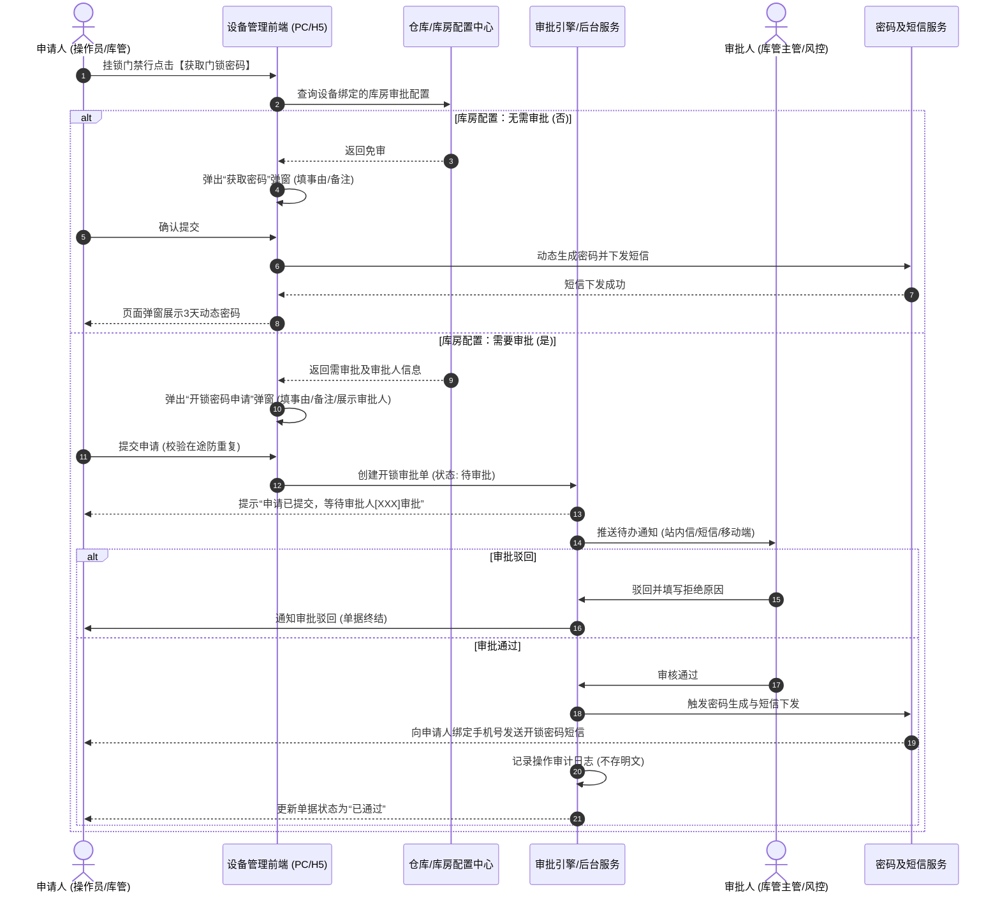

# 挂锁门禁开锁审批与密码下发方案草稿

> **文档状态**：草稿（AI 对话方案归档）  
> **记录时间**：2026-08-25  
> **所属模块**：仓储管理（设备管理-门禁设备 / 仓库管理-库房配置）  
> **涉及端**：Web 管理后台（PC端）、移动端（H5工作台/审批中心）

---

## 1. 原始需求与背景

### 1.1 业务诉求
在现有的设备管理体系中，挂锁门禁设备通常安装在仓库库房/仓位物理大门上，直接关系在库动产（尤其为质押物）的实物安全。为杜绝未经授权私自开锁或流程外开锁风险，提出以下需求：
1. **库房级审批控制配置**：在【仓库管理】的“库房”层级配置是否需要开锁审批；若需要审批，配置对应的审批人。
2. **设备端申请与阻断**：在【门禁设备】列表操作列点击【获取门锁密码】时，若绑定的库房开启了审批，则进入开锁审批流，不直接下发/展示密码。
3. **审批与密码受控下发**：审批人在审批待办中完成审核；审核通过后，系统通过密码服务生成临时动态密码并经由短信网关发送给申请人，确保安全与可追溯。

---

## 2. 业务全景与流转时序

---

## 3. 核心功能与详细设计

### 3.1 仓库管理 - 库房位置配置改造
在【仓库管理】→ 仓库详情 →【库房与分区配置】中，对**库房**维度的配置项进行扩展：

| 字段名称 | 字段类型 | 必填性 | 默认值 | 交互与联动规则 |
| :--- | :--- | :--- | :--- | :--- |
| **挂锁开锁是否审批** | 单选枚举 (`是` / `否`) | 必填 | `否` | 切换为“是”时，下方动态显示并必填【开锁审批人】；切换为“否”时隐藏。 |
| **开锁审批人** | 远程下拉选择 (单选/多选) | 条件必填 | 空 | 当开锁审批为“是”时必填。数据源为当前仓库/所属机构具备审批权限的有效账号（支持配置具体人员或角色）。 |
| **审批超时设置** | 数字输入（小时） | 选填 | 24小时 | 申请单超过指定时间未审批自动失效作废，避免挂死。 |

> **绑定继承规则**：
> - 门禁设备在绑定到对应仓库及库房后，自动继承该库房的开锁审批规则。
> - 若挂锁门禁**未绑定库房**（仅绑定到仓库或未绑定），点击获取密码时拦截并提示：*“该设备尚未绑定具体库房，请先完成仓库库房绑定配置后再操作”*。

---

### 3.2 设备管理 - 挂锁门禁【获取门锁密码】交互改造

在【仓储】→【设备管理-门禁设备】列表操作列：

1. **防重复申请拦截**：
   - 点击【获取门锁密码】时，系统首先检索该设备是否存在**“待审批”**状态的申请单。
   - 若存在，阻断弹窗并 Toast 提示：*“当前设备已有审批中的开锁申请（申请单号：XXXX），请勿重复提交或催促审批人处理”*。
2. **免审场景（库房配置为“否”）**：
   - 保持原有逻辑：填写事由（必填）、备注（选填）→ 确认提交 → 直接触发短信发送并弹窗展示动态密码（3天时效）。
3. **需审批场景（库房配置为“是”）**：
   - 弹窗变更为**【门锁开锁密码申请】**：
     - **展示字段**：设备编码、设备名称、所属仓库/库房、当前审批人姓名。
     - **填写字段**：
       - **开锁事由**（必填，下拉：入库、出库、移库、盘点、巡检、参观、其他）；
       - **申请开锁时间/预计使用时段**（选填）；
       - **申请备注**（选填，最多 100 字）。
     - **提交结果**：点击【提交申请】后关闭弹窗，气泡提示：*“开锁申请已提交至[审批人姓名]，审批通过后密码将以短信形式发送至您绑定的手机号”*。

---

### 3.3 审批中心与密码受控下发机制

1. **审批单据属性**：
   - **单据编号**：自动生成全局唯一单号（如 `LOCK-APP-YYYYMMDD-XXXX`）。
   - **单据状态流转**：`待审批` → `已通过` / `已驳回` / `已失效(超时)`。
2. **审批操作**：
   - **审批入口**：工作台【我的待办】/【审批管理】及移动端 H5 审批中心。
   - **审批操作项**：
     - **【通过】**：可填写审批意见（选填），确认后系统底层通过原子事务调用密码生成服务及短信网关下发密码。
     - **【驳回】**：必须填写驳回原因（必填，最多 200 字）。
3. **密码与安全下发**：
   - **短信直达**：审批通过后，密码仅发送到**申请人账号绑定的手机号**，审批人界面和单据列表**不显示**密码明文。
   - **有效期控制**：生成的挂锁密码维持原有 3 天时效规则。
   - **线上查看通道（可选增强）**：申请人在审批通过后的有效时效内，可在申请单详情中通过短信验证码/二次身份确认后查看一次性密码明文。

---

## 4. 异常与边界规则（MECE）

| 异常分类 | 场景描述 | 系统处置策略 |
| :--- | :--- | :--- |
| **在途单据与配置变更** | 库房修改了审批人或将“需要审批”改为了“无需审批”，但此前已有提交中的申请单。 | **版本快照机制**：已发起的申请单按发起时刻快照的审批流继续执行；若原审批人账号被禁用，管理员/上级主管可在审批台进行【转派】。 |
| **手机号缺失** | 申请人账号未绑定手机号。 | 提交申请前前端校验拦截，提示：*“当前账号未绑定手机号，无法接收开锁密码短信，请先前往个人中心绑定手机号”*。 |
| **短信下发失败** | 审批人点击通过，但短信运营商网关返回失败。 | 单据状态标记为“已通过（短信发送失败）”，允许审批人或申请人在单据详情点击【重新发送短信】，并记录失败原因。 |
| **设备解绑/停用** | 申请提交后，该门禁设备被解绑或停用。 | 审批人审批时校验设备状态，若设备已被移除/停用，阻断审批并提示：*“该设备已被停用或解绑，申请单已自动失效”*。 |

---

## 5. 安全与审计规范

1. **零明文留存**：
   - 数据库申请单表、审批流转表、系统操作审计日志严禁明文存储动态密码及短信全文。
2. **全流程留痕**：
   - 审计日志须完整串联：`申请人发起 -> 审批人审批(附意见) -> 密码服务生成标识(Token) -> 短信网关下发响应`。
   - 包含 IP、操作时间戳、设备编码、仓库库房唯一标识。
