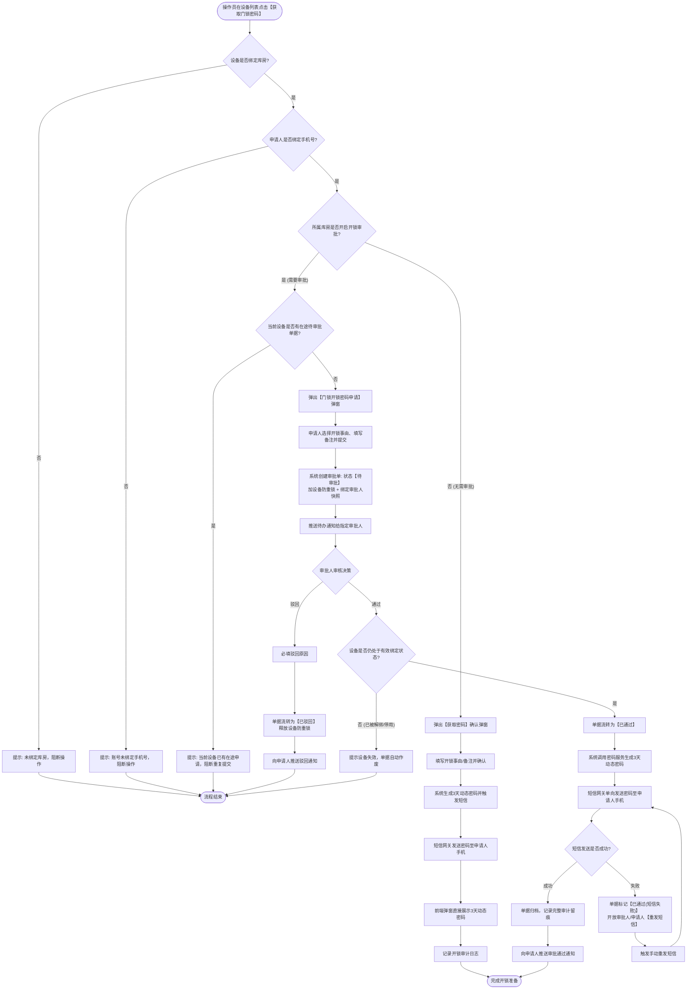
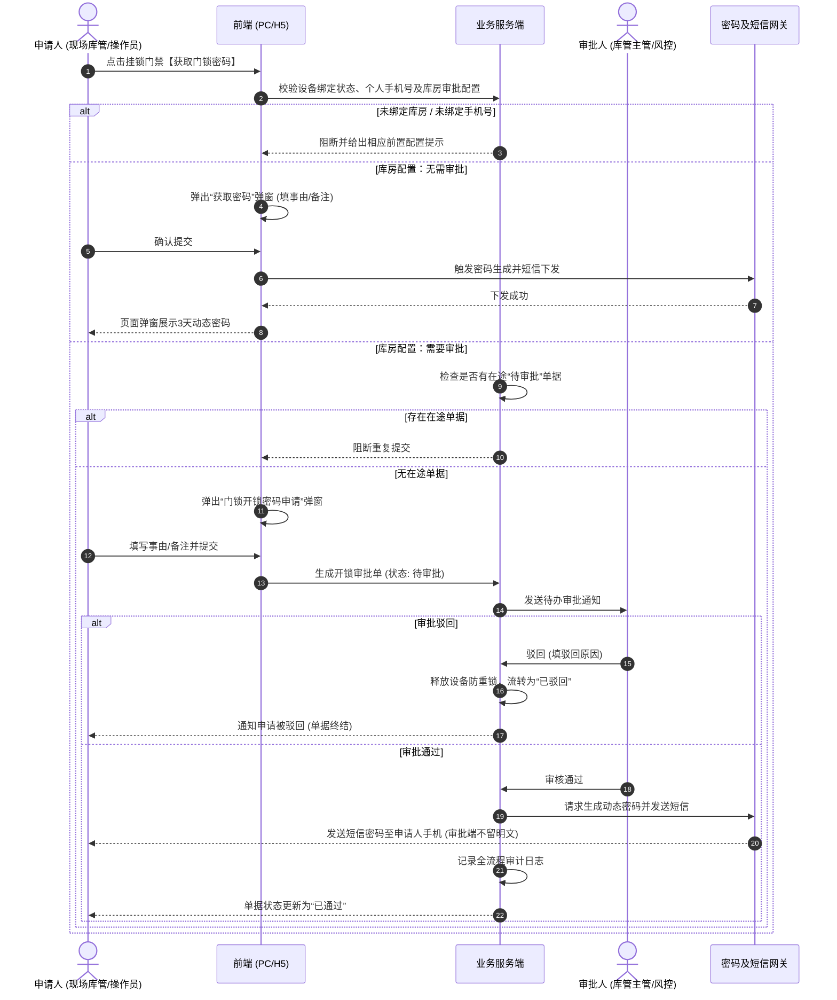
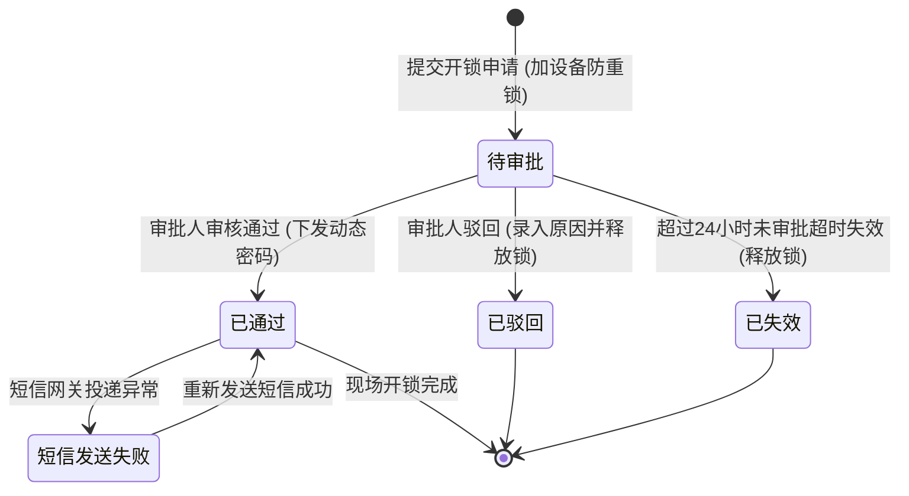
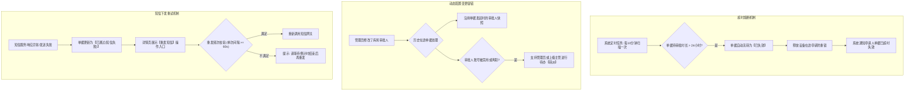
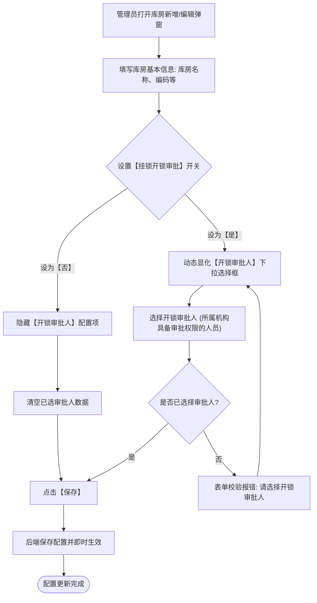
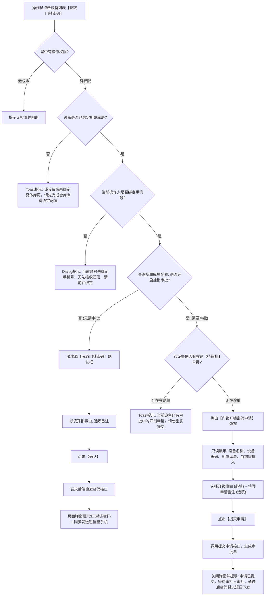
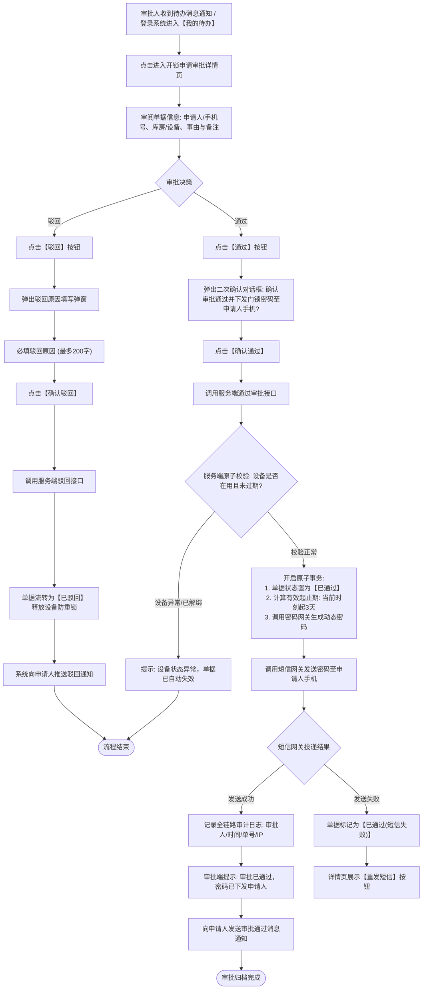

# 挂锁门禁开锁审批功能 简要PRD（草稿）

> **文档版本**：V1.0 (Draft)  
> **文档状态**：草稿  
> **归档位置**：`00-草稿对话/`  
> **编写时间**：2026-08-25  
> **适用终端**：Web 管理端 (PC)、移动工作台 (H5/App)

---

## 1. 需求背景与目标

### 1.1 业务背景
在存货监管体系中，挂锁门禁作为库房实物物理屏障，直接关乎质押物安全。原有机制下具备权限的操作员点击【获取门锁密码】即可直接获取，存在无序开锁及监管盲区。

### 1.2 核心目标
1. **库房级精细管控**：支持在库房维度配置是否开启挂锁开锁审批及指定审批人。
2. **事前审批流转**：开启审批的库房，开锁必须提交申请，经审批人审核通过后方可下发密码。
3. **密码安全下发**：审批通过后，系统调用密码服务并经短信网关单向发送至申请人手机，全程留痕且不在页面/日志留存明文。

---

## 2. 业务流程与状态机

### 2.1 端到端业务全景流程图

### 2.2 跨系统交互时序图

### 2.3 申请单状态机与流转图

### 2.4 异常处置与容错恢复流程图

---

## 3. 功能模块与界面规格

### 3.1 仓库管理 - 库房配置模块

**页面位置**：【配置管理】→【仓库管理】→ 仓库详情 →【库房与分区配置】页签 → 库房新增/编辑弹窗

#### 1. 库房审批配置流程图

#### 2. 字段规则表

| 字段名称 | 控件类型 | 必填性 | 默认值 | 校验与联动规则 |
| :--- | :--- | :--- | :--- | :--- |
| **库房名称** | 单行文本框 | 必填 | 无 | 同仓库内唯一，不超过50字符 |
| **出入库审核** | 单选框 (`是`/`否`) | 选填 | `否` | 原有出入库流程控制 |
| **挂锁开锁审批** | 单选框 (`是`/`否`) | 必填 | `否` | 切换为“是”时，下方显示【开锁审批人】；切换为“否”时隐藏该配置 |
| **开锁审批人** | 远程下拉选择 (单选/多选) | 条件必填 | 空 | 仅当“挂锁开锁审批”=`是`时必填；候选人范围为所属机构具备审批角色的有效账号 |
| **备注** | 多行文本框 | 选填 | 无 | 不超过500字符 |

---

### 3.2 设备管理 - 挂锁门禁【获取门锁密码】操作

**页面位置**：【仓储】→【设备管理-门禁设备】列表“操作”列

#### 1. 前端交互与分支控制流程图

#### 2. 交互逻辑与分支控制说明

1. **前置校验**：
   - 账号是否具备“获取门锁密码”角色权限；
   - 挂锁设备是否已绑定所属库房（若未绑定库房，阻断并提示：*“该设备尚未绑定具体库房，请先完成仓库库房绑定配置后再操作”*）；
   - 申请人是否绑定手机号（若未绑定，阻断并提示：*“当前账号未绑定手机号，无法接收开锁密码短信，请先前往个人中心绑定手机号”*）；
   - 设备当前是否存在“待审批”单据（若存在，阻断并提示：*“当前设备已有审批中的开锁申请，请勿重复提交”*）。
2. **分支 A：库房配置“无需审批”**
   - 弹出原【获取门锁密码】确认弹窗；
   - 填写事由（必填）、备注（选填）→ 点击确定 → 短信发送并页面展示 3 天动态密码。
3. **分支 B：库房配置“需要审批”**
   - 弹出【门锁开锁密码申请】弹窗；
   - **展示项**：设备名称、设备编码、所属仓库/库房、当前审批人姓名；
   - **输入项**：
     - **开锁事由**（下拉单选，必填）：出库、入库、移库、盘点、巡检、参观、其他；
     - **申请备注**（多行文本，选填，最多100字）；
   - **提交交互**：点击【提交申请】后关闭弹窗，Toast 提示：*“申请已提交，等待审批人[XXX]审批，通过后密码将以短信形式下发”*。

---

### 3.3 审批中心 - 开锁申请审批模块

**页面位置**：工作台【我的待办】/【审批管理】及移动端 H5 待办列表

#### 1. 审批人审核与密码下发处理流程图

#### 2. 待办详情信息展示规格
- 申请单号、发起时间、申请人姓名、申请人联系手机（脱敏展示）；
- 设备信息：设备名称、设备编码、所属仓库、所属库房；
- 申请信息：申请事由、申请备注。

#### 3. 审批操作规则
- **【通过】**：
  - 点击弹出确认提示框；
  - 确认后后端触发原子事务：生成挂锁动态密码（时效从审批通过时刻起计算 3 天）并调用短信网关发送至申请人手机；
  - 审批人端**不展示密码明文**。
- **【驳回】**：
  - 弹出驳回弹窗，**驳回原因必填**（最多200字）；
  - 确认后单据流转为“已驳回”，向申请人推送驳回通知。

---

## 4. 异常与边界处理

| 场景分类 | 异常场景 | 系统处置与提示 |
| :--- | :--- | :--- |
| **前置条件缺失** | 申请人账号未绑定手机号 | 提交申请前前端校验拦截，提示：*“当前账号未绑定手机号，无法接收开锁密码短信，请先前往个人中心绑定手机号”* |
| **设备状态异常** | 单据审批过程中设备被解绑或停用 | 审批人点击通过时服务端校验阻断，单据自动作废，提示：*“该设备已被解绑或停用，单据已失效”* |
| **配置变更** | 申请提交后，库房配置修改了审批人 | 保持**快照机制**，当前单据仍由发起时刻指定的审批人处理；若人员被禁用，由管理员进行单据转派 |
| **短信发送异常** | 审批通过后短信网关返回发送失败 | 单据标记为“已通过(短信失败)”，并在详情页向审批人/申请人提供【重发短信】操作 |
| **超时未审批** | 单据超过24小时未完成审核 | 自动流转为“已失效”，释放当前设备的申请防重锁 |

---

## 5. 权限与安全审计

### 5.1 RBAC 权限矩阵

| 功能点 / 操作 | 仓库操作员 | 库管主管 / 风控员 | 仓库管理员 | 系统超级管理员 |
| :--- | :---: | :---: | :---: | :---: |
| 库房开锁审批配置 | ❌ | ❌ | ✅ | ✅ |
| 发起开锁申请 / 获取密码 | ✅ | ✅ | ✅ | ✅ |
| 开锁申请审批 (通过/驳回) | ❌ | ✅ | ✅ | ✅ |
| 审批历史与审计日志查看 | 仅查看自己 | 范围内查看 | 仓库内查看 | 全局查看 |

### 5.2 安全审计规范
- **敏感信息脱敏**：数据库、申请单表、系统操作审计日志中**严禁明文存储动态密码与短信内容**。
- **审计留痕要素**：全流程记录 `单据号`、`操作人ID/姓名`、`操作动作(发起/审批/重发)`、`操作时间`、`终端IP`、`设备编码`、`库房标识`、`短信发送状态码`。
