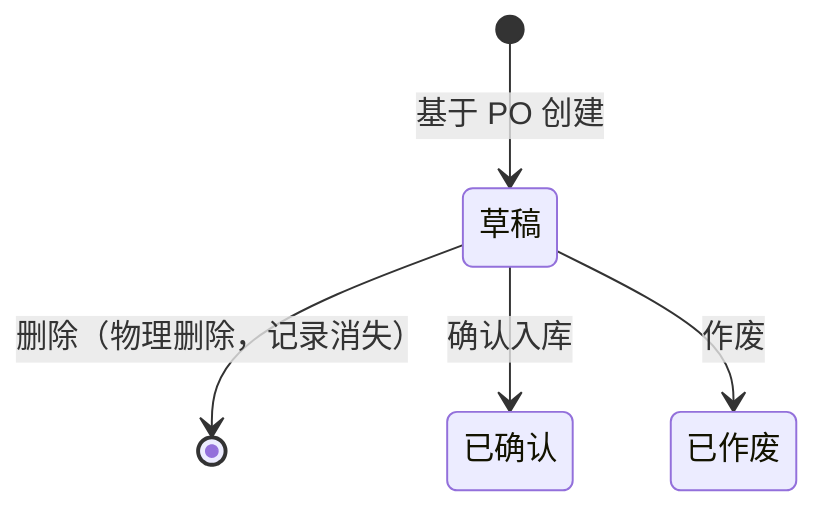

# 采购入库单 业务规则规格

> **文档定位**：采购入库单状态机、动作约束、校验规则、权限与计算规则的唯一定义来源。页面 Demo PRD 与流程推演文档只引用本文件，不重复定义状态与规则本体。
>
> **参考文档**：《采购订单主PRD》《采购订单字段清单》《单据状态与流转设计规范》《06-核心业务场景与流程》
>
> **版本**：V1.2 | 2026-05-26

---

## 一、单据定位

| 项目 | 内容 |
| :--- | :--- |
| 单据层级 | **第2层——执行层（结果单）** |
| 核心职责 | 记录「本次实际收到多少、验货通过入库多少」，触发库存增加与应付形成 |
| 单据来源 | 基于已审核通过的采购订单手动创建（一期唯一方式） |
| 上游单据 | 采购订单（1:N，一张 PO 可对应多张 PI） |
| 下游影响 | 库存台账 +N、基础应付记录；已确认 PI 可被采购退货单引用 |
| 审核流 | **无**——执行层单据，核心路径为「草稿 → 确认入库」 |

**与采购订单的数量口径关系**（三个数量禁止合并）：

| 口径 | 存在于 | 含义 |
| :--- | :--- | :--- |
| 采购数量 | 采购订单明细 | 原计划购买数量（审核后锁定） |
| 本次实收数量 | 采购入库单明细 | 本次实际收到货的数量（含质量问题货品） |
| 本次入库数量 | 采购入库单明细 | 本次验货通过、正式计入库存的数量 |

---

## 二、状态定义

| 状态 | 枚举值 | 含义 | 是否终态 | 进入条件 | 离开条件 |
| :--- | :--- | :--- | :---: | :--- | :--- |
| 草稿 | `DRAFT` | 已创建或保存草稿，尚未确认入库，可自由编辑和物理删除 | 否 | 基于 PO 创建入库单时 | 确认入库 / 作废 / 物理删除 |
| 已确认 | `CONFIRMED` | 入库已生效，库存与应付已生成，单据只读 | **是** | 「确认入库」动作成功 | — |
| 已作废 | `VOIDED` | 草稿被作废，单据失效不可恢复为草稿 | **是** | 「作废」动作确认 | — |

**设计说明**：

- 执行层单据不设审核态；仓管点收后由「确认入库」一次性生效。
- 「已确认」为业务终态，不可作废；如需逆向须走采购退货单 → 采购退货出库单。
- 「已作废」仅适用于从未确认过的草稿；记录保留可查，不参与库存与应付汇总。

---

## 三、状态流转图



---

## 四、状态流转表

> 前置条件须全部满足才允许触发动作；「后置影响」列出除状态变更以外的所有级联影响。

| 当前状态 | 动作 | 前置条件 | 结果状态 | 二次确认 | 后置影响 | 失败处理 |
| :--- | :--- | :--- | :--- | :--- | :--- | :--- |
| 草稿 | 保存草稿 | 已关联有效 PO；PO 状态为「待入库」或「部分入库」；明细不为空；数量链校验通过（见第六章） | 草稿 | 无 | 持久化当前编辑内容；不触发库存/应付/PO 回写 | Toast：「保存失败，{字段名}不满足条件」 |
| 草稿 | 确认入库 | 同「保存草稿」；满足之一：① 至少一行入库>0；② 整单拒收（所有行实收=0 且入库=0，且已填差异原因）；差异原因规则见第6.1节 | 已确认 | 有入库：「确认后将增加库存并生成应付，不可撤销，确认入库？」；整单拒收：「本次无入库数量，仅记录拒收事实，不可撤销，确认？」 | **有入库**：库存+、应付+、PO 回写+、锁定。**整单拒收**：仅锁定，不写库存/应付/PO 累计 | Toast：「确认失败，{具体原因}」 |
| 草稿 | 作废 | 无下游依赖（草稿态天然满足） | 已作废 | 「作废后不可恢复，确认作废？」 | 单据进入只读；不触发库存/应付/PO 回写 | — |
| 草稿 | 删除（物理） | 无限制 | 物理消失 | 「删除后不可恢复，确认删除？」 | 记录从系统彻底移除 | — |
| 已确认 | — | — | — | — | 仅允许查看、导出；修正走采购退货 | — |
| 已作废 | — | — | — | — | 仅允许查看、导出 | — |

**整单拒收特殊规则**（实收=0）：

- 允许创建 PI 并「确认入库」，但所有行「本次入库数量」必须为 0。
- 确认后不增加库存、不生成应付、不回写 PO「累计已入库数量」。
- 须在行级填写「差异原因」；PO 保持「待入库」或「部分入库」，等待补货或缺量关闭。

---

## 五、动作能力矩阵

> ✅ = 允许；❌ = 不允许（不展示入口）；✅（条件）= 允许但有前置条件（见第六章、第七章）

| 动作 | 草稿 | 已确认 | 已作废 |
| :--- | :----: | :----: | :----: |
| 查看 | ✅ | ✅ | ✅ |
| 编辑 | ✅ | ❌ | ❌ |
| 保存草稿 | ✅ | ❌ | ❌ |
| 确认入库 | ✅ | ❌ | ❌ |
| 作废 | ✅ | ❌ | ❌ |
| 删除（物理） | ✅ | ❌ | ❌ |
| 导出 | ✅ | ✅ | ✅ |
| 创建退货单 | ❌ | ✅ | ❌ |

**终态约束**：「已确认」除查看、导出外可创建退货单；「已作废」仅保留查看、导出。

---

## 六、校验规则

### 6.1 数量链约束（核心）

> 来源：AGENTS.md 已知坑点；context/06 PO-02。

**单行约束**（保存草稿、确认入库均须校验）：

```
0 ≤ 本次入库数量 ≤ 本次实收数量 ≤ 本行未入库数量（PO）
```

其中：`本行未入库数量 = PO.采购数量 − PO.累计已入库数量`

| 违反情形 | 校验时机 | 处理方式 |
| :--- | :--- | :--- |
| 本次入库数量 > 本次实收数量 | 保存草稿 / 确认入库 | 阻断，提示「入库数量不能大于实收数量」 |
| 本次实收数量 > 本行未入库数量 | 保存草稿 / 确认入库 | 阻断，提示「实收数量不能超过未入库数量（默认不支持超收）」 |
| 本次入库数量 > 本行未入库数量 | 确认入库 | 阻断，提示「入库数量不能超过未入库数量」 |
| 本次实收数量 = 0 且 本次入库数量 > 0 | 确认入库 | 阻断，提示「实收为 0 时入库数量必须为 0」 |
| 所有行入库数量 = 0 且 非整单拒收 | 确认入库 | 阻断，提示「请填写入库数量或说明差异原因」 |

### 6.1.1 差异原因校验

| 触发条件 | 校验时机 | 处理方式 |
| :--- | :--- | :--- |
| 拒收数量 > 0（实收 > 入库） | 保存草稿 / 确认入库 | 该行「差异原因」必填；未填阻断，提示「请填写差异原因」 |
| 本次实收数量 < 本行未入库数量（少收未到货） | 保存草稿 / 确认入库 | 该行「差异原因」必填；未填阻断，提示「请填写差异原因」 |
| 整单拒收（所有行实收=0 且入库=0） | 确认入库 | 各行「差异原因」必填 |

### 6.2 创建与关联校验

| 规则ID | 规则 | 校验时机 | 违反处理 |
| :--- | :--- | :--- | :--- |
| V01 | PI 必须关联一张状态为「待入库」或「部分入库」的 PO | 创建 PI | 无可用 PO 时不展示创建入口 |
| V02 | PI 头部「供应商」「入库仓库」继承自 PO，不可修改 | 创建/编辑 | 只读展示 |
| V03 | PI 明细商品须来源于 PO 对应行，不可新增 PO 中不存在的商品 | 编辑明细 | 阻断保存 |
| V04 | PO 状态为「已完成」或「已作废」时，不可创建新 PI | 创建 PI | 入口不展示 |
| V05 | PO 状态为「已完成」且因「关闭订单（缺量完结）」进入终态时，其下草稿 PI 不可再「确认入库」 | 确认入库 | 阻断，提示「关联采购订单已关闭，无法确认入库」 |
| V05a | PO 状态为「已作废」时，其下草稿 PI 不可「确认入库」 | 确认入库 | 阻断，提示「关联采购订单已作废，无法确认入库」；编辑页顶部 Banner 同文案 |
| V05b | PO 执行「关闭订单」时若存在草稿 PI，阻断与二次确认文案以《采购订单主PRD》R44 为准（须提示草稿张数）；用户确认关闭后，适用 V05 |
| V06 | 明细行「本次实收数量」「本次入库数量」为非负整数 | 保存/确认 | 阻断，提示「数量必须为非负整数」 |
| V07 | PI 明细行数 = 关联 PO 明细行数，不可增删行 | 编辑明细 | 阻断保存 |

### 6.3 商品快照规则

| 规则ID | 规则 |
| :--- | :--- |
| V11 | PI 明细「商品名称」「商品条码」「规格型号」「单位」从 PO 行快照继承，保存后不再随商品档案变化 |
| V12 | PI 明细「单价（含税）」继承 PO 行快照，**只读不可修改**（一期与 PO 单价口径一致） |
| V13 | 已确认 PI 后，所有明细数量与价格字段锁定只读 |

### 6.4 作废 vs 物理删除

| 维度 | 作废 | 删除（物理） |
| :--- | :--- | :--- |
| **含义** | 草稿失效，留痕可查 | 草稿从系统彻底移除 |
| **适用状态** | 草稿 | 草稿 |
| **状态变化** | → 已作废（终态） | 记录消失 |
| **对 PO 的影响** | 无（从未确认） | 无 |
| **弹窗文案** | 「作废后不可恢复，确认作废？」 | 「删除后不可恢复，确认删除？」 |
| **列表可见** | 可查（状态=已作废） | 不可查 |

---

## 七、计算规则

### 7.1 行级金额

| 字段 | 公式 | 说明 |
| :--- | :--- | :--- |
| 行应付金额（含税） | `行应付金额 = 本次入库数量 × 单价（含税）` | **以入库数量为准**，非实收数量；拒收入库数量=0 则行应付=0 |
| 行金额展示 | 保留 2 位小数，四舍五入 | 列表/详情实时计算 |

### 7.2 单据级汇总

| 字段 | 公式 |
| :--- | :--- |
| 入库总数量 | `SUM(各行.本次入库数量)` |
| 应付总金额（含税） | `SUM(各行.行应付金额)` |

### 7.3 应付形成规则

| 规则ID | 规则 |
| :--- | :--- |
| C01 | **仅在「确认入库」成功后**生成基础应付记录，草稿保存不产生应付 |
| C02 | 应付金额 = `SUM(本次入库数量 × 单价（含税）)`，按 PI 单维度生成一条应付头 + 明细行 |
| C03 | 应付关联：供应商、PI 单号、PO 单号、入库仓库、入库日期 |
| C04 | 实收数量 > 入库数量时，差额部分（实收 − 入库）**不计入应付、不计入库存**，须在行备注或差异原因中说明（如质量问题待退） |
| C05 | 整单拒收（入库数量全为 0）不产生应付记录 |
| C06 | 一期应付为「登记可查」模式，付款登记独立，不做复杂核销 |

### 7.4 库存影响规则

| 规则ID | 规则 |
| :--- | :--- |
| S01 | 库存变动**仅**在「确认入库」时触发，按「本次入库数量」增加对应仓库 SKU 现存 |
| S02 | 「本次实收数量」与「本次入库数量」差额不进入库存（待后续退货或供应商换货处理） |
| S03 | 已作废 PI 从未确认，不影响库存；已确认 PI 不可作废，库存冲减走采购退货出库单 |

### 7.5 PO 回写规则

| 规则ID | 规则 |
| :--- | :--- |
| W01 | 确认入库成功后：`PO.累计已入库数量 += PI.本次入库数量`（按商品行匹配累加） |
| W02 | `PO.未入库数量 = PO.采购数量 − PO.累计已入库数量`（系统计算，不可手改） |
| W03 | 所有 PO 行「未入库数量」= 0 时，PO 自动变为「已完成」 |
| W04 | 部分行入库后 PO 变为「部分入库」 |
| W05 | 已作废 PI 不参与 PO 累计；整单拒收 PI（入库=0）不回写累计 |
| W06 | 同一 PI 单号重复确认须幂等拦截（乐观锁），避免重复回写 |

---

## 八、权限规则

### 8.1 数据可见范围

| 角色 | 可见数据范围 | 说明 |
| :--- | :--- | :--- |
| 采购员 | 本人创建的 PI + 关联 PO 为本人的 PI | 不可见其他采购员无关入库单 |
| 仓管 | 入库仓库属于本人管辖范围的所有 PI | 按仓库维度过滤 |
| 财务 | 全部 PI（只读） | 用于应付核对 |
| 管理员 | 全部 PI | 全量可见 |

### 8.2 操作权限矩阵

| 操作 | 业务员/内勤 | 采购员 | 仓管 | 财务 | 管理员 |
| :--- | :---: | :---: | :---: | :---: | :---: |
| 查看 | ✅ | ✅ | ✅ | ✅ | ✅ |
| 新增（基于 PO 创建） | ❌ | ✅ | ✅ | ❌ | ✅ |
| 编辑（草稿） | ❌ | ✅ | ✅ | ❌ | ✅ |
| 保存草稿 | ❌ | ✅ | ✅ | ❌ | ✅ |
| 确认入库 | ❌ | ✅ | ✅ | ❌ | ✅ |
| 作废（草稿） | ❌ | ✅ | ✅ | ❌ | ✅ |
| 删除（草稿，物理） | ❌ | ✅ | ✅ | ❌ | ✅ |
| 导出 | ✅ | ✅ | ✅ | ✅ | ✅ |
| 创建退货单 | ❌ | ❌ | ✅ | ❌ | ✅ |

### 8.3 权限约束说明

| 约束 | 说明 |
| :--- | :--- |
| 创建入口 | 仅当用户对该 PO 有「创建入库单」权限且 PO 状态允许时可创建 |
| 确认入库 | 建议仓管为主操作角色；采购员可代确认（一期不强制分工拦截） |
| 已确认修正 | 任何角色均不可在 PI 上直接改数量；须创建采购退货单 |

---

## 九、边界与异常处理

| 场景 | 处理方式 |
| :--- | :--- |
| 并发：两人同时确认同一草稿 PI | 乐观锁，后者提示「单据状态已变更，请刷新后重试」 |
| 并发：确认 PI 同时 PO 被关闭 | 以 PO 关闭优先；确认被阻断并提示 |
| PO 显示部分入库，对应 PI 已作废 | 已作废 PI 不计入累计；PO 数据按有效 PI 重算展示 |
| 确认后需修正数量 | 不支持 PI 反确认；走采购退货单 → 采购退货出库单 |
| 实收 > 入库（质量待退） | 允许保存；仅入库部分进库存和应付；差额备注说明 |

---

## 十、设计自检清单

- [x] 是否存在永远到不了的状态？——三态均可达
- [x] 非终态是否都有离开路径？——草稿可确认/作废/删除
- [x] 动作能力矩阵是否无空格？——已覆盖全部动作 × 状态
- [x] 终态是否仅有查看+导出？——是
- [x] 状态变更是否均通过动作按钮？——是，无表单改状态
- [x] 物理删除与作废是否区分？——第6.4节 已对比
- [x] 数量链是否独立字段？——三数量分开，第6.1节 已约束

---

## 修订记录

| 日期 | 变更摘要 |
| :--- | :--- |
| 2026-05-26 | V1.0 初版：执行层三态状态机、数量链校验、应付=入库数量×单价、PO 回写与权限规则 |
| 2026-05-26 | V1.1 走查修正：统一差异原因规则；整单拒收确认文案；删除 V12 改价与 50 行上限；补财务角色与创建退货单动作 |
| 2026-05-26 | V1.2：V05/V05a/V05b 区分 PO 关闭、作废及关闭时草稿 PI 提示（对齐 PO R44） |
