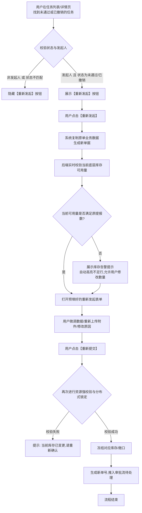
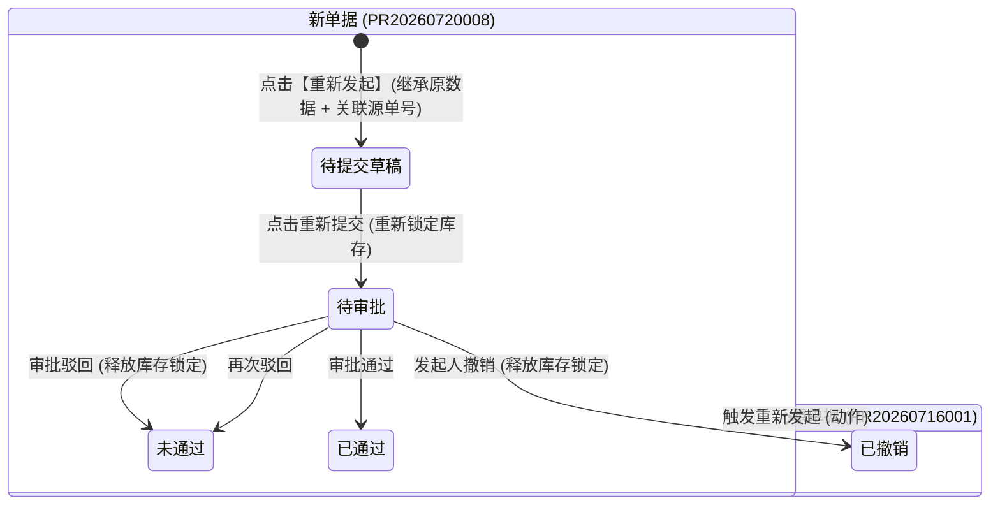

# 供应链金融存货系统 - 未通过/已撤销任务重新发起功能 PRD

版本号：V1.0.0

| 版本 | 时间 | 修订人 | 备注 |
|---|---|---|---|
| V1.0.0 | 2026/07/20 | pm-master / pm-prd-writer | 初始创建完整功能 PRD 文档 |

---

## 一、概述（为什么做）

### 1.1 产品概述及目标

#### 1.1.1 背景介绍
在供应链金融存货管理系统中，各类业务单据（包括入库申请、出库申请、移库申请、货物加工申请、质押/解质押申请、监管报告申请等）均需经过严格的线上审批流。
当前系统中，当单据处于**“未通过”**（审批驳回）或**“已撤销”**（发起人主动撤回）状态后，发起人若需修正数据或再次提报，必须从头开启全新表单，重新选择仓库、货主、货物明细、填报数量并重新上传多份证明附件。这种方式不仅操作路径长、效率低下，且容易产生二次录入错误，影响业务快速推进。

#### 1.1.2 产品概述
本功能针对系统内所有支持审批流的业务任务与单据，在任务列表（我的申请/审批中心）及任务详情页增加**【重新发起】**功能。
发起人点击后，系统自动生成一张以原单据数据为蓝本的**新提报草稿表单**，自动带入原单据中的基础信息、货物明细与附件凭证，同时建立新旧单号之间的父子关联关系（血缘追溯）。在重新提交时，系统会自动重新执行库存可用量校验与并发锁资源操作，确保既提高流转效率，又满足供应链金融的严密风控与审计规范。

#### 1.1.3 产品目标

**业务目标**
| 目标 | 指标 | 目标值 | 达成时间 |
|---|---|---|---|
| 提高单据二次提报效率 | 驳回/撤销单据重新提报平均耗时 | 由 >10 分钟缩短至 <1 分钟 | 上线后立即生效 |
| 降低重新填报出错率 | 重新提报因字段漏填/填错导致二次驳回的比例 | 降低 80% | 上线后 1 个月 |
| 完善金融风控审计闭环 | 驳回/撤销单据与重新发起单据的追溯率 | 100% 具备血缘追溯 | 上线后立即生效 |

**用户目标**
| 目标用户 | 用户目标 | 衡量指标 |
|---|---|---|
| 业务发起人（运营/客户） | 一键一载原数据，快速修改被驳回或撤销的字段并重新提交 | 核心操作路径仅需 2 步（点击重新发起 -> 确认/微调 -> 提交） |
| 风控审批人员 | 清楚查看当前单据是否属于“重新发起”，并可一键对比原驳回原因与修改项 | 审批界面直观展示“关联原任务”及历史审批意见 |

#### 1.1.4 目标用户
| 角色 | 描述 | 核心诉求 |
|---|---|---|
| 平台运营 / 货主代表 | 业务单据的发起者 | 被驳回或撤销后能快速一键带出原有信息重新提交 |
| 风控专员 / 业务主管 | 审批链条中的审核者 | 能识别单据来源，查看原单驳回原因及本次修改对比 |
| 系统审计员 | 合规性检查者 | 确保原驳回/撤销记录不可被篡改或覆盖，要求全链路留痕 |

---

### 1.2 名词说明

| 名词 | 说明 |
|---|---|
| 未通过 | 审批流终态之一，指单据在流转过程中被风控专员或主管执行了“驳回”操作。 |
| 已撤销 | 审批流终态之一，指处于“待审批/审批中”的单据被发起人主动执行了“撤回”操作。 |
| 重新发起 | 用户对“未通过”或“已撤销”的单据点击该操作，复制原单数据生成新单据表单的过程。 |
| 源任务单号 (`source_task_code`) | 新生成的重新发起单据中记录的字段，指向最初被驳回或撤销的原单据号。 |
| 重新校验与资源锁定 | 单据撤销/驳回后原解冻资源已释放；重新发起时系统在提交瞬间对当前物理库存可用量重新校验并加锁。 |

---

### 1.3 角色及权限

| 角色 | 权限范围 | 数据范围 |
|---|---|---|
| 任务发起人 (`created_by`) | 仅对自己发起的、且处于【未通过】或【已撤销】状态的任务拥有【重新发起】操作权限 | 本人创建的数据 |
| 业务主管/管理员 | 在授权代理场景下可代为【重新发起】，或在列表与详情页查看重新发起标记 | 归属机构或辖区数据 |
| 审批人员 | 查看重新发起单据的源单号、历史驳回记录及改动标记 | 所属审批流程权限 |

---

### 1.4 文档阅读对象
产品经理、前端开发工程师、后端开发工程师、测试工程师、风控合规人员。

---

## 二、产品描述（做什么）

### 2.1 产品需求描述

用户在操作**“未通过”**或**“已撤销”**的任务时，系统提供快捷入口**【重新发起】**：
1. **生成新单据（不覆盖历史）**：重新发起必须创建一张**全新的单据（生成新单号）**，绝对禁止直接在原单据上修改覆盖，以确保审计日志可追溯。
2. **数据继承与重置**：自动带入原单据的仓库、货主、货品明细、预期数量、加工参数、原因及附件；重置单据状态为`待提交/草稿`或直接提交为`待审批`，更新创建时间为当前时间。
3. **关联源单据号**：自动填充 `source_task_id` 与 `source_task_code`，并在新单据顶部常驻展示“关联原任务：PR20260716001 [已撤销]”。
4. **实时校验资源**：打开重新发起表单时，系统自动校验底层物理库存/敞口的当前可用量（`available_quantity`）。若当前可用量不足，提示黄色告警并允许用户调整数量后提交。
5. **提交加锁**：提交成功后，重新对底层可用库存执行防并发加锁逻辑，并将新单据推入审批流。

---

### 2.2 产品整体流程

#### 2.2.1 重新发起主业务流程图

#### 2.2.2 状态转换与继承关系图

---

### 2.3 全局说明

#### 2.3.1 按钮显隐规则矩阵

| 场景 / 页面 | 任务状态 | 是否为任务发起人 | 重新发起按钮显示状态 | 点击响应 |
|---|---|---|---|---|
| 我的申请 / 任务列表 | 未通过 (驳回) | 是 | 激活显示 (主要按钮/操作列) | 快捷打开重新发起抽屉/页面 |
| 我的申请 / 任务列表 | 已撤销 | 是 | 激活显示 (主要按钮/操作列) | 快捷打开重新发起抽屉/页面 |
| 我的申请 / 任务列表 | 待审批 / 审批中 | 是 | **不显示** (展示【撤销】) | - |
| 我的申请 / 任务列表 | 已通过 / 已完成 | 是 | **不显示** | - |
| 我的申请 / 任务列表 | 未通过 / 已撤销 | **否** | **不显示** (置灰或隐藏) | - |
| 任务详情页底部栏 | 未通过 (驳回) | 是 | 底部高亮按钮 | 页面进入重新编辑提交模式 |
| 任务详情页底部栏 | 已撤销 | 是 | 底部高亮按钮 | 页面进入重新编辑提交模式 |

#### 2.3.2 字段继承与重置表

| 字段类别 | 字段名称 | 继承/重置处理方式 | 说明 |
|---|---|---|---|
| 基础头信息 | 业务类型 / 货品类型 | **完全继承** | 不可修改（如存货/抵质押货） |
| 基础头信息 | 货主 / 仓库 / 关联单号 | **完全继承** | 默认继承，允许查看 |
| 基础头信息 | 重新发起源单号 | **系统自动关联** | 赋值为原单据号，如 `source_task_code = 'PR20260716001'` |
| 基础头信息 | 新单据号 | **系统自动重新生成** | 按规则生成新单号（如 PR20260720008） |
| 基础头信息 | 状态 | **重置** | 新单据初始状态为 `待审批` 或 `草稿` |
| 基础头信息 | 创建人 / 创建时间 | **更新** | 赋值为当前登录人与当前提交系统时间 |
| 业务明细 | 原货物明细列表 | **完全继承并重新校验** | 带出商品、库位、拟加工/出库数量；若可用量不足高亮标黄 |
| 业务明细 | 期望产出/目标明细 | **完全继承** | 带出预期产出商品与预期数量 |
| 附件凭证 | 附件列表 (PDF/图片) | **继承并允许增删** | 复制原上传的附件文件列表，用户可删除或补充新附件 |
| 说明文本 | 申请原因 / 备注 | **继承并可编辑** | 继承原备注，用户可补充“针对驳回原因已做xxx调整” |

---

## 三、功能需求（怎么做）

### 3.1 任务列表页【重新发起】按钮交互

- **位置**：在“我的申请”、“审批中心-我的发起”、“加工单/出入库申请列表”等页面的操作列。
- **视觉样式**：主按钮样式（如蓝色图标+“重新发起”文字），邻近【查看详情】按钮。
- **交互逻辑**：
  1. 点击【重新发起】按钮，前端调用 `POST /api/v1/task/reinitiate/prefill` 接口。
  2. 接口返回复制后的草稿数据及库存校验结果。
  3. 弹出“重新发起申请”右侧抽屉（Drawer）或页面，表单自动填入所有原数据。

---

### 3.2 任务详情页【重新发起】按钮与血缘展示

- **位置**：
  1. 页面底部固定操作栏（仅状态为`未通过`或`已撤销`且为发起人时可见）。
  2. 页面顶部卡片区域：当查看的是**重新发起的单据**时，顶部展示全局通知条：“🔗 本单据由原任务 [PR20260716001] 重新发起 | 点击查看原任务审批记录”。
- **交互逻辑**：
  - 点击通知条中的原任务单号，以弹窗或新标签页形式打开原驳回/撤销单据的详情及历史审批日志（包含当时的驳回原因）。

---

### 3.3 重新发起表单与资源二次校验

#### 3.3.1 底层库存可用量校验
- **校验逻辑**：
  - 打开表单时，系统异步请求底层库存明细接口：
    `GET /api/v1/inventory/check-availability`
  - 对表单中每一行货物明细校验 `拟用数量 <= 当前可用库存量`。
  - **校验失败提示**：若某行货物的可用库存因在此期间被占用而不足，该行明细卡片上方显示黄色警告标签：“⚠️ 当前可用库存仅剩 50.00 吨，原申请 80.00 吨，请调整后提交”。
  - 前端阻断提交，直到用户将数量调整至 `<= 可用库存` 或更换可用库位批次。

#### 3.3.2 关联抵质押单有效性强拦截（金融风控核心规则）
当重新发起的申请单据属于**抵质押类业务**（如：抵质押货物加工、解押出库、补仓、置换）时，后端预检接口 `POST /api/v1/task/reinitiate/prefill` 必须穿透校验关联的抵质押单（`pledge_order_code`）实时状态：
1. **抵质押单失效判定标准**：若抵质押单状态为 `CLOSED` (已结清)、`RELEASED` (已解押)、`VOIDED` (已作废)、`LIQUIDATED` (已平仓) 或 `FROZEN` (司法冻结)。
2. **处理机制（强拦截与引导）**：
   - **阻断打开表单**：前端禁止打开编辑表单，阻断重新提交。
   - **弹出失效强拦截 Modal 框**：
     - **标题**：“无法重新发起申请”
     - **提示内容**：“原申请关联的抵质押单 **[PL20260510002]** 目前已处于 **[已结清 / 已解押]** 状态，履约效力已终止。该笔质押资产已解除管控，无法继续基于原单号发起变更申请。”
     - **业务引导操作**：
       - 若原货物已解押归还为普通存货，引导用户前往“普通存货板块”发起常规出库/加工；
       - 提供按钮【查看原抵质押单流水】，支持跳转至已结清的抵质押单详情页进行查验。
3. **提交瞬间事务二次锁**：若在填表期间关联的抵质押单状态发生突变，后端提交接口在数据库事务内重新锁校验 `pledge_order.status === 'EFFECTIVE'`，校验失败强制回滚事务并提示“关联抵质押单状态已变更，提交失败”。

---

### 3.4 提交与防并发锁资源

- **提交逻辑**：
  - 用户点击【确认重新提交】按钮后，前端弹窗二次确认：“确认提交重新发起申请？提交后系统将再次冻结对应库存资源。”
  - 后端在一个数据库事务内完成：
    1. 校验当前用户权限。
    2. 执行底层库存分布式加锁。
    3. 插入新单据记录（包含 `source_task_code`）。
    4. 写入操作审计日志。
    5. 将新单据流转至审批流第一节点。
  - 成功后 Toast 提示“重新发起成功！单据号：PR20260720008”，自动跳转至列表或新单据详情页。

---

### 3.5 核心数据字典（新增/扩展字段）

| 表名 | 字段名 | 类型 | 必填 | 说明 |
|---|---|---|---|---|
| `biz_task_main` | `source_task_id` | BIGINT | 否 | 重新发起的直接源任务主键 ID（未通过/已撤销单据的 ID） |
| `biz_task_main` | `source_task_code` | VARCHAR(64) | 否 | 重新发起的直接源任务单号（如 PR20260716001） |
| `biz_task_main` | `root_task_code` | VARCHAR(64) | 否 | 重新发起的最初源根任务单号（多代追溯根节点，如 PR20260710001） |
| `biz_task_main` | `reinitiate_count` | INT | 否 | 重新发起继承代数（首次重新发起为 1，再次被驳回后重新发起为 2） |
| `biz_task_main` | `is_reinitiated` | TINYINT | 否 | 是否为重新发起的单据（0: 否, 1: 是） |

---

## 四、非风控与非功能需求

### 4.1 安全与合规
- **严禁覆盖历史记录**：所有被驳回或撤销的单据属于合规审计凭证，必须原样保留在数据库中，禁止直接做 Update 覆盖。
- **全链路留痕**：重新发起操作必须记录审计日志（日志内容包含：操作人 ID、源单号、新单号、操作 IP、操作时间）。

### 4.2 统计与埋点需求
- 埋点事件 `event_task_reinitiate_click`：统计重新发起按钮点击次数、源单号、业务板块。
- 埋点事件 `event_task_reinitiate_submit`：统计重新发起提交成功率、修改字段项分布（是否修改了数量/附件/备注）。

### 4.3 性能与响应要求
- 点击【重新发起】到表单渲染完成：`< 800ms`。
- 库存二次校验与提交加锁接口响应时间：`< 1.2s`。

---

## 五、附录

### 5.1 验收标准与测试要点

1. **按钮显隐测试**：
   - 验证只有状态为`未通过`或`已撤销`且登录人为发起人时，列表及详情页才出现【重新发起】按钮。
   - 验证处于`待审批`、`已通过`状态时绝不出现【重新发起】按钮。
2. **数据带出测试**：
   - 验证点击【重新发起】后，基础头信息、商品明细行、附件列表是否 100% 正确带出。
   - 验证新生成的单据单号是否独立，且 `source_task_code` 正确指向原单号。
3. **库存变动与拦截测试**：
   - 模拟原单据驳回后，部分库存被他人领用出库的情况。重新发起时，系统能否准确提示“当前可用库存不足”并阻止超额提交。
4. **追溯链条测试**：
   - 在新单据详情页点击“关联原任务”，能否准确弹窗展示原单据信息及历史驳回意见。

---

### 5.2 待确认项清单

| 序号 | 待确认事项 | 影响范围 | 默认建议值 |
|---|---|---|---|
| 1 | 重新发起是否有最大次数限制？（如同一单据最多重新发起 3 次） | 业务规则 | 建议暂不限制，由审批人在审批环节把控 |
| 2 | 原单据附件在重新发起时是否默认带出？ | 用户体验 | 建议**默认带出**，并支持删除/替换/新增 |
| 3 | 驳回原因是否自动填入新单据的“针对驳回说明”字段中？ | 审批协同 | 建议在表单顶部以只读Alert提示原驳回原因：“原驳回原因：附件照片清晰度不足” |
