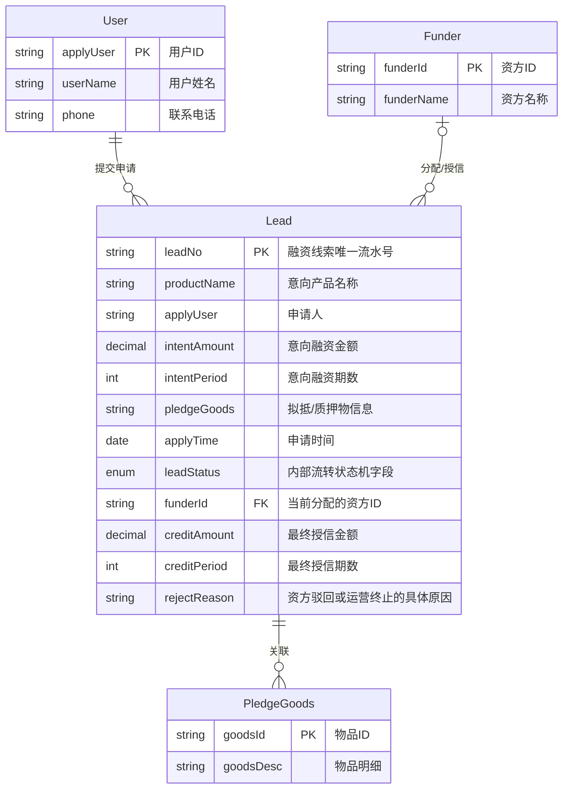
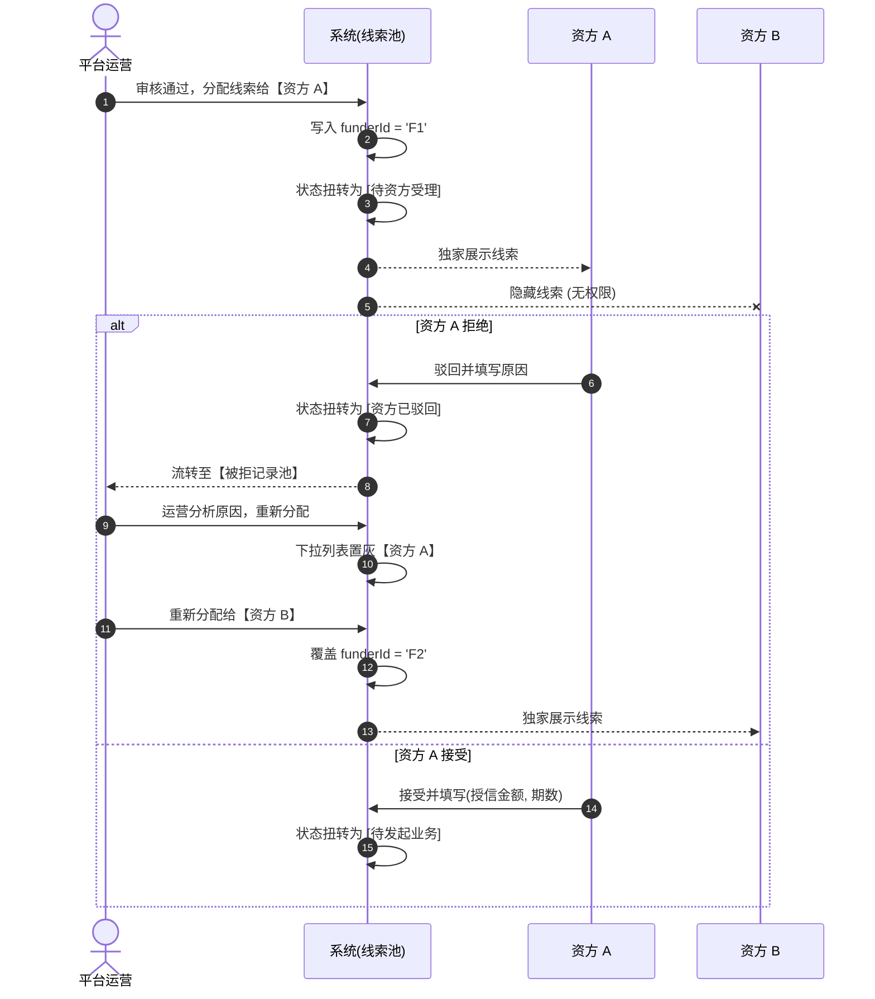
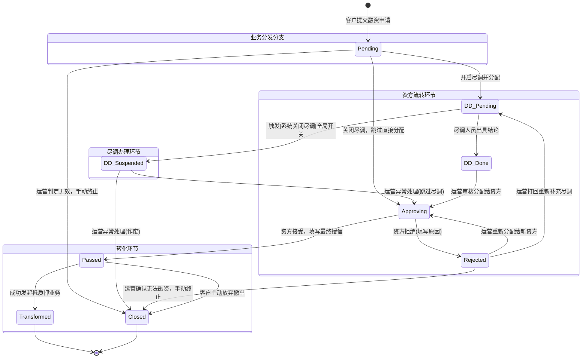
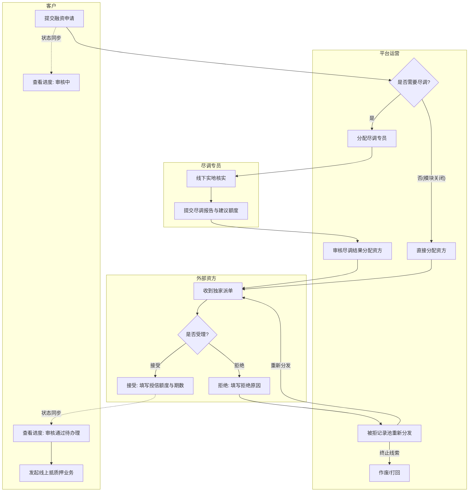
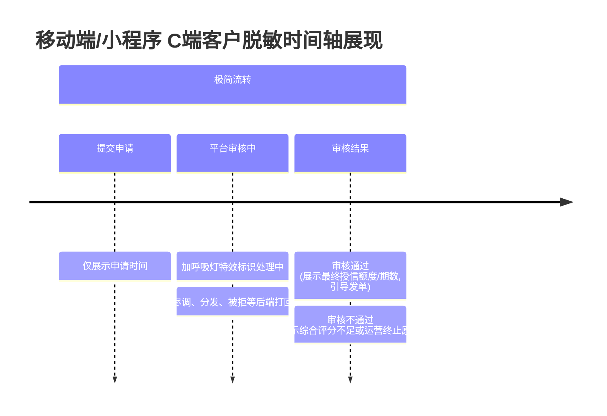

# 森云科技 SYZC - 融资意向可视化图表 (Mermaid 集合)

本文档汇集了 `00-草稿对话/融资意向可视化图表/` 目录下的 5 个 HTML 图表文件内容，已统一转换为标准 Markdown + Mermaid 代码块格式。

---

## 目录
1. [实体关系模型 (ER 图)](#1-实体关系模型-er-图)
2. [独家并发分配控制时序图](#2-独家并发分配控制时序图)
3. [核心状态流转图 (增强版)](#3-核心状态流转图-增强版)
4. [全局业务流转泳道图](#4-全局业务流转泳道图)
5. [C端脱敏进度时间轴](#5-c端脱敏进度时间轴)

---

## 1. 实体关系模型 (ER 图)

对应文件：[1_实体关系模型_ER图.html](file:///Users/robert/Desktop/SYZC/00-%E8%8D%89%E7%A8%BF%E5%AF%B9%E8%AF%9D/%E8%9E%8D%E8%B5%84%E6%84%8F%E5%90%91%E5%8F%AF%E8%A7%86%E5%8C%96%E5%9B%BE%E8%A1%A8/1_%E5%AE%9E%E4%BD%93%E5%85%B3%E7%B3%BB%E6%A8%A1%E5%9E%8B_ER%E5%9B%BE.html)

---

## 2. 独家并发分配控制时序图

对应文件：[2_独家并发分配控制时序图.html](file:///Users/robert/Desktop/SYZC/00-%E8%8D%89%E7%A8%BF%E5%AF%B9%E8%AF%9D/%E8%9E%8D%E8%B5%84%E6%84%8F%E5%90%91%E5%8F%AF%E8%A7%86%E5%8C%96%E5%9B%BE%E8%A1%A8/2_%E7%8B%AC%E5%AE%B6%E5%B9%B6%E5%8F%91%E5%88%86%E9%85%8D%E6%8E%A7%E5%88%B6%E6%97%B6%E5%BA%8F%E5%9B%BE.html)

---

## 3. 核心状态流转图 (增强版)

对应文件：[3_核心状态流转图.html](file:///Users/robert/Desktop/SYZC/00-%E8%8D%89%E7%A8%BF%E5%AF%B9%E8%AF%9D/%E8%9E%8D%E8%B5%84%E6%84%8F%E5%90%91%E5%8F%AF%E8%A7%86%E5%8C%96%E5%9B%BE%E8%A1%A8/3_%E6%A0%B8%E5%BF%83%E7%8A%B6%E6%80%81%E6%B5%81%E8%BD%AC%E5%9B%BE.html)

---

## 4. 全局业务流转泳道图

对应文件：[4_全局业务流转泳道图.html](file:///Users/robert/Desktop/SYZC/00-%E8%8D%89%E7%A8%BF%E5%AF%B9%E8%AF%9D/%E8%9E%8D%E8%B5%84%E6%84%8F%E5%90%91%E5%8F%AF%E8%A7%86%E5%8C%96%E5%9B%BE%E8%A1%A8/4_%E5%85%A8%E5%B1%80%E4%B8%9A%E5%8A%A1%E6%B5%81%E8%BD%AC%E6%B3%B3%E9%81%93%E5%9B%BE.html)

---

## 5. C端脱敏进度时间轴

对应文件：[5_C端脱敏进度时间轴.html](file:///Users/robert/Desktop/SYZC/00-%E8%8D%89%E7%A8%BF%E5%AF%B9%E8%AF%9D/%E8%9E%8D%E8%B5%84%E6%84%8F%E5%90%91%E5%8F%AF%E8%A7%86%E5%8C%96%E5%9B%BE%E8%A1%A8/5_C%E7%AB%AF%E8%84%B1%E6%95%8F%E8%BF%9B%E5%BA%A6%E6%97%B6%E9%97%B4%E8%BD%B4.html)

