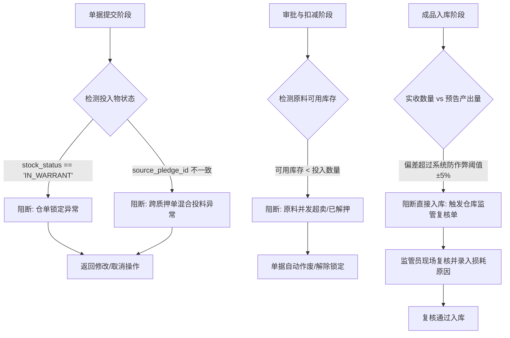
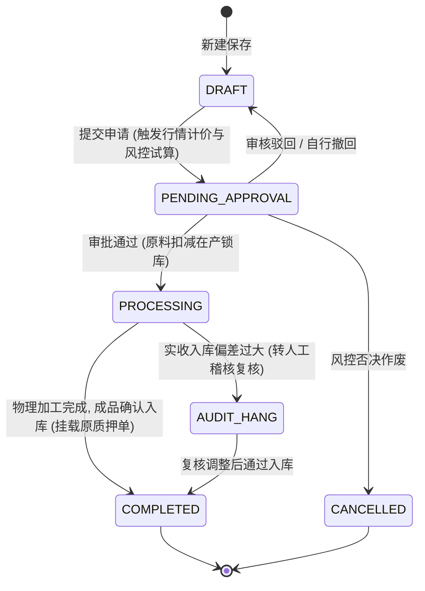

# 货物形态转换业务流程推演 (1:N / N:1 / N:N)

> **文档类型**：业务流程推演与状态机规范  
> **业务场景**：抵质押存货与普通存货形态转换（1:N / N:1 / N:N）全流程风控与状态推演  
> **创建日期**：2026-07-24  
> **分析人员**：Senyun Tech AI PM  

---

## 1. 业务背景

### 1.1 背景说明
在供应链金融存货监管中，企业在生产经营过程中常需对监管仓内的货物进行物理拆分、组合或加工（如原木加工为板材、钢卷剪切为钢板）。为保证**“物理加工正常进行”**与**“金融货权/质押监管不中断”**的双重需求，SYZC 平台需支持普通存货与抵质押存货的 1:N、N:1、N:N 形态转换，并全程自动联动大宗行情试算货值，防范质押率不足与货权脱节风险。

### 1.2 推演目标
1. 梳理形态转换单从“创建申请”到“在产锁库”再到“成品入库挂载质押单”的全生命周期。
2. 明确仓单卡控、同源限制、大宗行情联动计价、质押率跌价弹窗与【高风险告警】触发逻辑。
3. 穷举状态流转与数据 JSON 演变快照，确保逻辑闭环无死锁。

### 1.3 涉及系统/模块
- **存货监管系统 (WMS/WRS)**：库存扣减、锁定、入库、状态判定（普通/抵质押/仓单中）。
- **质押单管理系统 (Pledge Mgmt)**：质押物清单更新、质押总货值重估、质押率监控。
- **大宗商品行情服务 (Market Price Engine)**：基准行情价获取、自动化分摊计价。
- **风控预警引擎 (Risk Engine)**：跌价预警试算、高风险告警打标、追缴通知。
- **工作流引擎 (Flow Engine)**：自定义审批流节点编排。

---

## 2. 业务流程图

### 2.1 主流程 (Main Process)

```mermaid
graph TD
    Start([开始: 发起形态转换]) --> SelectType[步骤1: 选择库存类型: 普通存货 / 抵质押存货]
    
    SelectType --> CheckWarrant{系统校验: 包含'仓单中'货物?}
    CheckWarrant -- 是 --> BlockWarrant[硬性阻断: 提示'仓单货物严禁加工转换'] --> SelectType
    CheckWarrant -- 否 --> InputItems[步骤2: 选择投入原料 & 录入产出物形态]
    
    InputItems --> CheckSameSource{系统校验: 是否来自同源物料?\n(纯普通 或 同一质押单)}
    CheckSameSource -- 否: 混合投料 --> BlockMix[硬性阻断: 提示'禁止普通与质押物或跨质押单混合加工'] --> InputItems
    CheckSameSource -- 是 --> PriceEngine[步骤3: 调取大宗行情基准价\n自动计算产出物单价与总货值]
    
    PriceEngine --> CheckPledgeType{是否为抵质押存货转换?}
    CheckPledgeType -- 否: 普通存货 --> SubmitWorkflow[步骤4: 提交单据进入自定义审批流]
    
    CheckPledgeType -- 是: 抵质押存货 --> RiskEval[系统自动试算: 转换后质押总货值与质押覆盖率]
    RiskEval --> CheckCoverage{转换后货值 × 质押率 >= 融资本金?}
    
    CheckCoverage -- 是: 货值充足 --> SubmitWorkflow
    CheckCoverage -- 否: 跌破警戒线 --> RiskPop[弹出警告窗口:\n预计缺口￥XX, 提示补充保证金/加质]
    
    RiskPop --> UserDecision{用户选择}
    UserDecision -- 取消/补充质押 --> InputItems
    UserDecision -- 执意提交 --> MarkHighRisk[打上【高风险告警】标记\n推送风控预警留痕] --> SubmitWorkflow
    
    SubmitWorkflow --> WorkflowApproval{自定义审批流审批}
    WorkflowApproval -- 审核驳回 --> RejectEnd[单据驳回至草稿]
    WorkflowApproval -- 审核通过 --> LockDeduct[步骤5: 扣减原料可用库存\n锁定为'在产/加工中'状态]
    
    LockDeduct --> Manufacturing[步骤6: 线下物理加工完成\n仓库扫码/人工录入成品入库]
    Manufacturing --> FinishCheck{校验产出物与报备一致?}
    FinishCheck -- 否 --> AdjustDiff[异常人工稽核/差异调整] --> FinishCheck
    FinishCheck -- 是 --> StockIn[成品入库 & 质押存货自动挂载至原质押单]
    
    StockIn --> UpdatePledgeValue[更新质押单总货值与风控指标]
    UpdatePledgeValue --> End([转换完成, 单据归档])
```

### 2.2 异常与拦截流程 (Exception Handling Process)



---

## 3. 关键节点说明

| 节点编号 | 节点名称 | 触发条件 | 处理逻辑 | 输出结果 | 异常处理/阻断机制 |
| :--- | :--- | :--- | :--- | :--- | :--- |
| **N01** | 库存选择与校验 | 点击“新建形态转换单” | 校验物料库存状态，自动过滤排查 `仓单中` 货物 | 渲染可用存货列表 | 包含仓单中货物时，选择框禁用并展示禁调原因 |
| **N02** | 同源投料校验 | 勾选多项投入原料 | 校验 `is_pledged` 是否一致，且 `pledge_id` 是否为同一质押单 | 允许进入产出物录入 | 若混合投料，提示“禁止混合加工”，阻止下一步 |
| **N03** | 行情联动计价与试算 | 录入产出物规格与数量 | 调取行情服务基准价 `market_price`，计算 `产出总货值` 及 `质押率覆盖额` | 实时计算表格与风控试算结果 | 接口异常时取最近一次有效缓存行情并标注提示 |
| **N04** | 跌价预警与高风险标记 | 试算货值 < 融资本金警戒线 | 触发预警逻辑，渲染追缴保证金/加质弹窗；若强行提交则写入 `is_high_risk=true` | 单据打上【高风险告警】 | 用户取消则返回修改；执意提交记入审计日志 |
| **N05** | 在产锁库与出库 | 审批流程节点全部 PASS | 冻结投入原料物理/系统可用量，扣减库存，状态更新为 `PROCESSING` | 原料扣减完成，库存锁定 | 可用量不足时抛出并发冲突异常并阻断 |
| **N06** | 成品挂载与归档 | 仓库确认成品入库 | 成品入库；若为质押物，`pledge_id` 自动写入原质押单，重估质押货值 | 转换单 `COMPLETED`，质押单更新 | 实收偏差 > 5% 时挂起，转现场监管复核 |

---

## 4. 数据推演 (Data Simulation)

### 4.1 初始状态 (Draft)

```json
{
  "convertOrderId": "CVT-20260724-001",
  "stockCategory": "PLEDGED", // PLEDGED (抵质押存货) / FREE (普通存货)
  "sourcePledgeId": "PLG-20260510-888",
  "status": "DRAFT",
  "isHighRisk": false,
  "inputs": [
    { "skuId": "SKU-LOG-001", "skuName": "原木(A级)", "quantity": 10.0, "unit": "吨", "status": "PLEDGED" }
  ],
  "outputs": [],
  "totalInputVal": 100000.00,
  "totalOutputVal": 0.00
}
```

### 4.2 行情计价与风控试算状态 (Pending Approval)

**操作**：用户录入产出物，系统调取大宗行情基准价（板材A: 6000元/吨，板材B: 5000元/吨，木屑: 500元/吨），试算总货值仅 81,000 元（原质押融资本金 90,000 元，导致质押率 81,000/90,000 = 90% < 警戒线 100%）。用户选择强行提交。

```json
{
  "convertOrderId": "CVT-20260724-001",
  "stockCategory": "PLEDGED",
  "sourcePledgeId": "PLG-20260510-888",
  "status": "PENDING_APPROVAL",
  "isHighRisk": true, // 执意提交，触发高风险告警标记
  "riskWarningReason": "转换后预计总货值(￥81,000.00)低于融资本金警戒线(￥90,000.00)，缺口￥9,000.00",
  "inputs": [
    { "skuId": "SKU-LOG-001", "skuName": "原木(A级)", "quantity": 10.0, "unit": "吨", "unitPrice": 10000.00 }
  ],
  "outputs": [
    { "skuId": "SKU-BOARD-A", "skuName": "板材A", "quantity": 10.0, "unit": "吨", "marketPrice": 6000.00, "totalPrice": 60000.00 },
    { "skuId": "SKU-BOARD-B", "skuName": "板材B", "quantity": 4.0, "unit": "吨", "marketPrice": 5000.00, "totalPrice": 20000.00 },
    { "skuId": "SKU-DUST-01", "skuName": "木屑", "quantity": 2.0, "unit": "吨", "marketPrice": 500.00, "totalPrice": 1000.00 }
  ],
  "totalInputVal": 100000.00,
  "totalOutputVal": 81000.00, // 降值 19,000 元 (含加工损耗)
  "submittedAt": "2026-07-24 16:55:00"
}
```

### 4.3 审批通过，在产锁库状态 (Processing)

**操作**：自定义流程配置审批通过，系统扣减原料并发锁。

```json
{
  "convertOrderId": "CVT-20260724-001",
  "status": "PROCESSING",
  "approvalInfo": { "approvedBy": "资方风控官-李华", "approvedAt": "2026-07-24 17:10:00", "comment": "已知晓货值缺口风险，准予生产，已发送补质追缴通知" },
  "inventoryAction": {
    "deductedInputs": [ { "skuId": "SKU-LOG-001", "deductQty": 10.0, "lockStatus": "IN_PROCESSING" } ]
  }
}
```

### 4.4 成品入库与质押挂载完成 (Completed)

**操作**：仓库确认收货入库，成品自动写入原质押单 `PLG-20260510-888`，转换单归档。

```json
{
  "convertOrderId": "CVT-20260724-001",
  "status": "COMPLETED",
  "completedAt": "2026-07-24 18:30:00",
  "pledgeUpdateResult": {
    "pledgeId": "PLG-20260510-888",
    "removedItems": ["SKU-LOG-001 (10.0吨)"],
    "addedItems": ["SKU-BOARD-A (10.0吨)", "SKU-BOARD-B (4.0吨)", "SKU-DUST-01 (2.0吨)"],
    "newTotalValue": 81000.00,
    "pledgeStatus": "HIGH_RISK_WARNING" // 质押单同步继承高风险告警标记
  }
}
```

---

## 5. 状态流转分析

### 5.1 状态流转图 (State Diagram)



### 5.2 状态说明表

| 状态标识 | 状态中文 | 可执行操作 | 允许发起人 | 扭转目标状态 |
| :--- | :--- | :--- | :--- | :--- |
| `DRAFT` | 草稿 | 编辑、删除、提交 | 仓库监管员/企业操作员 | PENDING_APPROVAL, CANCELLED |
| `PENDING_APPROVAL` | 待审批 | 撤回、自定义流程审批、驳回 | 审批流指定人员 (资方/监管/经理) | DRAFT, PROCESSING, CANCELLED |
| `PROCESSING` | 在产/加工中 | 现场出货、成品入库登记 | 仓库现场监管员 | COMPLETED, AUDIT_HANG |
| `AUDIT_HANG` | 稽核挂起 | 差异说明录入、强制纠偏入库 | 风控审计官/资方 | COMPLETED |
| `COMPLETED` | 已完成 | 查看详情、打印单据、日志追溯 | 全部关联角色 | (终态) |
| `CANCELLED` | 已取消 | 查看历史记录 | 全部关联角色 | (终态) |

---

## 6. 边界场景与异常处理

### 6.1 边界场景
1. **最小数据场景**：1:1 简易形态转换（如 1吨 大规格钢板 转换剪切为 1吨 标准钢板）。
   * *规则*：允许操作，按 1:1 分摊行情基准价。
2. **极限损耗场景**：加工损耗率超过 20%（如原木加工产生大量无价值锯末）。
   * *规则*：试算货值大幅跌扣，必定触发跌价警报弹窗，且强制要求填报“加工损耗预估原因”。
3. **仓单状态突变场景**：单据草稿期间，原料突然被推送到交易所开立仓单（状态变为 `IN_WARRANT`）。
   * *规则*：点击“提交”时后端二次强校验，检测到仓单锁定状态立即终止提交，强行切回 `DRAFT` 并告警。

### 6.2 异常处理
* **异常1：并发超卖/抢先解押**
  * *现象*：A用户正在申请形态转换，B用户同时发起了该批原料的提货/解押。
  * *解法*：进入 `PENDING_APPROVAL` 时采用乐观锁/行级锁，锁定原料记录 `is_locked=true`，阻断并发解押。
* **异常2：行情服务超时或宕机**
  * *现象*：大宗行情接口网络超时无响应。
  * *解法*：自动降级读取系统上一次有效基准价（24小时内），并在界面醒目提示“受网络影响，当前采用 2026-07-24 12:00 基准价试算”。
* **异常3：成品实际入库偏差**
  * *现象*：预告产出 10吨，实际仓库扫码仅收到 7吨。
  * *解法*：触发系统阈值报警，单据进入 `AUDIT_HANG`（稽核挂起），必须现场监管员录入“损耗异常说明”并由资方审批后方可完成归档。

---

## 7. 影响范围分析

### 7.1 数据影响
* **形态转换表 (`tb_stock_convert_order`)**：新增单据主表及明细表。
* **库存明细表 (`tb_warehouse_stock`)**：扣减原料存货，新增成品存货，状态打上原质押标记。
* **质押单明细表 (`tb_pledge_order_item`)**：替换质押物明细，更新质押单 `total_pledged_value`。
* **风控告警日志表 (`tb_risk_alarm_log`)**：若执意提交触发高风险，写入预警事件记录。

### 7.2 系统/模块影响
* **流程配置模块**：需增加“形态转换单”的自定义节点模板（支持配置资方、风控、仓储角色）。
* **风控看板模块**：新增“在产转换质押物跌价预警”卡片。

### 7.3 接口影响
* `POST /api/v1/stock/convert/create` (创建转换单)
* `POST /api/v1/stock/convert/eval-risk` (大宗行情计价与质押率试算 API)
* `POST /api/v1/stock/convert/submit` (提交转换单)
* `POST /api/v1/stock/convert/stock-in` (成品入库确认并同步更新质押单)

---

## 8. 关键业务规则

| 规则编号 | 规则描述 | 适用场景 |
| :--- | :--- | :--- |
| **R01 (仓单禁转)** | 处于`仓单中`状态的货物，禁止参与任何形态转换 | 转换单提交/接口校验 |
| **R02 (原料同源)** | 投入物必须为纯普通存货或同属于同一质押单的存货，禁止跨类型/跨单混合 | 投入物选择阶段 |
| **R03 (行情计价)** | 产出物单价强制调取大宗行情基准价，禁止人工任意填报 | 产出物录入阶段 |
| **R04 (跌价告警)** | 转换后货值不足弹窗提醒追加保证金/加质；强行提交打上【高风险告警】 | 风控试算阶段 |
| **R05 (状态继承)** | 抵质押存货转换产出物强制直接挂载至原质押单，继承监控属性 | 成品入库阶段 |
| **R06 (在产锁库)** | 审批通过后原料锁定为 `PROCESSING`，禁止并发解押或二次转换 | 库存扣减阶段 |

---

## 9. 性能与安全考虑

### 9.1 性能要求
* **试算响应时间**：行情联动与质押覆盖率试算在 `< 1.2s` 内完成。
* **并发处理**：支持 100 组仓库监管员同时发起存货转换操作，不发生锁定死锁。

### 9.2 安全与审计
* **幂等性防护**：单据提交接口使用 `Client-Token` 防重锁，防止因弱网连击重复扣减库存。
* **防篡改审计**：所有触发【高风险告警】执意提交的操作，自动截取当时试算快照、IP、MAC 地址并保存至区块链/防篡改日志库。

---

## 10. 结论与建议

### 10.1 结论
本推演完整闭环了抵质押存货与普通存货在 1:N、N:1、N:N 形态转换下的业务流程、数据演变与风控拦截逻辑。通过“同源约束 + 仓单隔离 + 行情联动 + 高风险打标 + 质押继承”5 维防护，完美实现了企业物理生产与资方金融风控的双赢。

### 10.2 改进建议
1. 在前端 UI 原型中，增加“大宗行情联动基准价”的来源出处与刷新时间提示，增加价格权威感。
2. 在自定义流程配置中，建议提供“出现【高风险告警】时自动强制追加资方二级审批”的硬性规则选项。
