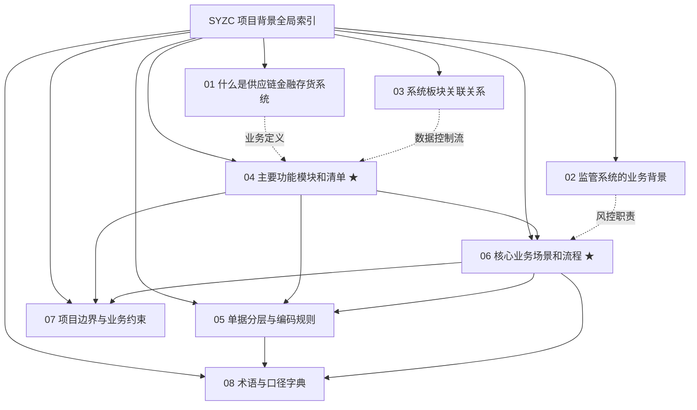

# SYZC 项目背景信息索引

> **定位**：本目录为 **森云科技 - SYZC 供应链金融存货监管系统** 的全局业务背景基线与顶层架构真源。
> `04-主要功能模块和清单.md` 与 `06-核心业务场景和流程.md` 作为功能范围与端到端业务流的唯一基准，其他文档负责阐释业务背景、系统关系、单据规范、边界约束及口径字典。

---

## 一、文档架构与关系图

---

## 二、文件导航与职责分工

| 序号与文档链接 | 核心用途与主要内容 | 适用读者 |
| :--- | :--- | :--- |
| **[01-什么是供应链金融存货系统](./01-什么是供应链金融存货系统.md)** | 说明系统现代定位、四层业务底座、六大核心价值与概念边界。 | 全体成员、决策层、产品经理 |
| **[02-监管系统的业务背景](./02-监管系统的业务背景.md)** | 阐述行业痛点、监管子系统职责（物联穿透/专网审批/预警底座/存证）及合规原则。 | 资金方、监管机构、风控总监 |
| **[03-系统板块关联关系](./03-系统板块关联关系.md)** | 描绘 8 大业务板块架构图、关键数据控制流矩阵及协同设计原则。 | 系统架构师、后端研发、产品经理 |
| **[04-主要功能模块和清单](./04-主要功能模块和清单.md)** | **全系统功能范围、菜单矩阵、RBAC 权限清单的全局唯一基准**。 | 产品经理、前后端研发、测试团队 |
| **[05-单据分层与编码规则](./05-单据分层与编码规则.md)** | 定义四层单据模型、全局编码规范（前缀字典）、状态机与审计快照。 | 数据库架构师、后端研发、测试 |
| **[06-核心业务场景和流程](./06-核心业务场景和流程.md)** | **端到端 13 大核心业务场景、流程图与业务规则矩阵的全局唯一真源基准**。 | 产品、研发、测试、运营、风控 |
| **[07-项目边界与业务约束](./07-项目边界与业务约束.md)** | 明确建设范围与排除范围、系统级强制硬拦截清单及数据权限隔离机制。 | 项目经理、产品合规、质量保障 |
| **[08-术语与口径字典](./08-术语与口径字典.md)** | 统一定义核心业务术语、角色权责、风控公式、高精度金额口径与时间筛选规则。 | 全体成员、数据团队、前端研发 |
| **[README](./README.md)** | 本目录总览与维护准则。 | 全体成员、AI Agent |

---

## 三、推荐阅读路径

1. **快速初识**：`01`（系统定义） $\rightarrow$ `04`（功能矩阵） $\rightarrow$ `06`（核心流程） $\rightarrow$ `07`（边界约束）。
2. **功能设计与研发**：`03`（板块关系） $\rightarrow$ `04`（功能清单） $\rightarrow$ `05`（单据分层） $\rightarrow$ `06`（流程与规则）。
3. **风控与监管设计**：`02`（监管背景） $\rightarrow$ `04`（预警/风控清单） $\rightarrow$ `06`（场景12预警/场景13开锁） $\rightarrow$ `08`（指标公式）。
4. **接口与数据建模**：`04` $\rightarrow$ `05` $\rightarrow$ `08`，再结合 `06` 的异常分支与审计要求。

---

## 四、全局协同与维护原则

1. **真源唯一性**：功能名称、菜单层级与 RBAC 权限以 `04` 为准；流程节点、前置校验与业务规则以 `06` 为准。
2. **数据严谨性**：涉及金额与价值计算必须遵循 `08` 中的高精度 Decimal 与展示精度口径。
3. **安全与合规底线**：所有业务设计必须满足 `07` 中的硬拦截规则（如 P06 自审禁止、R31 人脸门禁短信阻断、物联穿透只读与设备端核销闭环等）。
4. **不可逆存证**：核心业务快照、已处理预警流水、风险公示与审批历史严禁物理删除，必须保留完整审计镜像。
