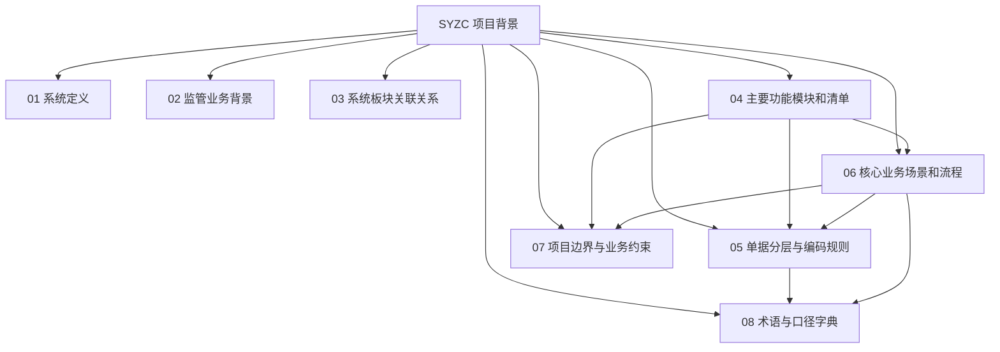

# SYZC 项目背景信息索引

> 本目录是 SYZC 供应链金融存货监管系统的业务基线。`04-主要功能模块和清单.md` 与 `06-核心业务场景和流程.md` 为功能和流程基准，其他文档负责解释背景、关系、数据规则、边界和术语，不新增与基准冲突的业务范围。

## 一、文档关系

## 二、文件导航

| 文件 | 用途 | 主要读者 |
| :--- | :--- | :--- |
| [01-什么是供应链金融存货系统](./01-什么是供应链金融存货系统.md) | 说明系统定位、价值和分层 | 全体成员、决策者 |
| [02-监管系统的业务背景](./02-监管系统的业务背景.md) | 说明行业痛点、监管职责和合规背景 | 资金方、监管方、产品经理 |
| [03-系统板块关联关系](./03-系统板块关联关系.md) | 说明 8 个板块的数据流和控制流 | 产品、架构、研发 |
| [04-主要功能模块和清单](./04-主要功能模块和清单.md) | **功能范围、角色权限和菜单的唯一基准** | 产品、研发、测试 |
| [05-单据分层与编码规则](./05-单据分层与编码规则.md) | 说明业务单据、编号、状态和审计规则 | 后端、数据、测试 |
| [06-核心业务场景和流程](./06-核心业务场景和流程.md) | **端到端业务流程和风控闭环的唯一基准** | 产品、研发、测试、运营 |
| [07-项目边界与业务约束](./07-项目边界与业务约束.md) | 说明纳入范围、排除范围和硬拦截 | 项目、产品、合规 |
| [08-术语与口径字典](./08-术语与口径字典.md) | 统一业务词汇、指标公式和数据来源 | 全体成员、数据团队 |
| [README](./README.md) | 本目录的阅读入口和维护规则 | 全体成员、AI Agent |

## 三、推荐阅读路径

- 初识项目：`01` → `04` → `06` → `07`。
- 设计功能：`03` → `04` → `05` → `06`。
- 设计风控：`02` → `04` → `06` → `08`。
- 设计数据和接口：`04` → `05` → `08`，再回看 `06` 的异常分支。

## 四、统一约束

1. 功能名称、角色边界以 `04` 为准；流程步骤、状态和异常处置以 `06` 为准。
2. `05` 只定义单据和数据实现规则，不改变 `04` 的功能范围或 `06` 的业务结论。
3. 指标必须引用 `08` 的公式和数据源；阈值、保存期限等项目参数必须可配置并留存版本。
4. 新增需求必须标明影响的板块、场景、单据、角色、权限和审计字段。
