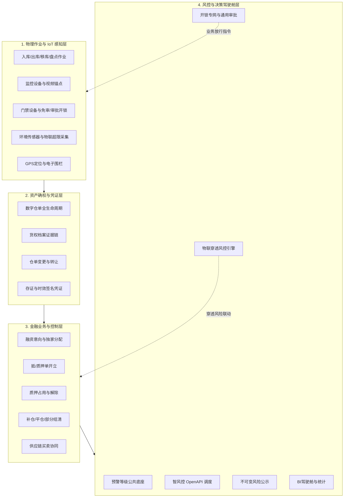

# 什么是 SYZC 供应链金融存货监管系统

## 1. 系统定义

**SYZC（供应链金融存货监管系统）** 是由**森云科技（Senyun Technology）**打造的面向商业银行、保理公司、仓储/监管企业、借款企业、核心企业及平台运营方的一站式数字质押与动态风控监管平台。

系统围绕“**货、仓、金**”建立可穿透、可追溯的数字信任链：
- 以**物理库存与 IoT 设备采集**为事实底座；
- 以**数字仓单和货权档案**承载资产与权属凭证；
- 以**融资与风控引擎**控制质押占用、动态监库、实时预警与安全释放；
- 以**专网审批与通用审批网关**实现高效合规的多方业务协同。

系统涵盖入库作业、仓单开立、抵/质押办理、出库放行、货权转让、仓内移库、存货异动、智能盘点、预警分级配置与物联穿透、智风控对接、司法级风险公示、门禁开锁专网审批、交易协同、统计驾驶舱及计费结算等全生命周期能力。具体功能范围以 [04-主要功能模块和清单](./04-主要功能模块和清单.md) 为准，端到端流程以 [06-核心业务场景和流程](./06-核心业务场景和流程.md) 为准。

---

## 2. 四层业务与架构底座

| 层次 | 作用与核心机制 | 典型对象 |
| :--- | :--- | :--- |
| **物理作业与 IoT 感知层** | 采集并管理现场收发存物理事实，实时监控仓库设备状态、环境指标、安防事件与门禁通行。 | 入库单、出库单、移库单、盘点单、监控设备（锚点）、人脸/挂锁门禁、温湿度/烟感传感器、GPS 追踪器。 |
| **资产确权与凭证层** | 将物理库存规范化组织为具备法律效力证据支撑的可追溯电子资产凭证。 | 数字仓单、货权档案（合同/发票/运单/质检报告）、仓单变更记录、司法存证哈希。 |
| **金融业务与控制层** | 管理融资申请、准入尽调、授信匹配、质押占用、解押放行、加补仓及平仓处置。 | 融资申请、独家资金方方案、授信结果、抵/质押单、解押放行指令、平仓处置单。 |
| **风控与决策驾驶舱层** | 统一预警严重度分级字典、多策略订单风控、物联告警向押品穿透、智风控模型调度、开锁审批专网响应及 BI 统计看板。 | 预警等级配置（2~20档）、设备预警配置（防抖/互斥）、订单预警配置（一单一配/6大策略）、设备/押品预警流水、开锁申请单、风险公示快照。 |

---

## 3. 六大核心业务价值

1. **货权穿透与证据链闭环**：实现入库现场证据、过磅单、质检单、物理库存、数字仓单与货权档案的多维交叉验证与不可篡改追溯。
2. **资金与实物强关联控制**：通过系统质押占用、出库合规校验、解押放行指令与提货核销机制，杜绝擅自放货与重复质押。
3. **物联网实时穿透式监库**：现场传感器超限或安防告警（防拆、闯入、剪锁）触发时，依据严重度穿透开关（`sync_to_order_warn`）自动向上生成押品预警流水，并强制要求现场设备核销闭环。
4. **全生命周期动态风控**：盯市动态估值、双等级抵质押率预警（平仓线/补仓线）、贷中外部智风控 OpenAPI 调度，实现秒级风险响应。
5. **专网专道高频审批与合规防线**：针对高频现场开锁业务建立专网审批流，严防自审禁止（P06/R11），确保秒级安全响应与全路径审计留痕。
6. **多方信任协同与安全隔离**：为资金方、监管方、核心企业与借款企业提供细粒度 RBAC 权限隔离、租户/仓库数据隔离与时效签名安全凭证。

---

## 4. 概念边界与不应混淆的定义

- **库存明细**：物理仓储的账实单元（批次、货位、净重），不直接等同于可融资资产；
- **数字仓单**：经平台确权开立的电子资产凭证，承载货权属性与版本演进；
- **货权档案**：合同、发票、提单、质检单等权属法律要件的数字化证据集；
- **抵/质押单**：金融机构对仓单或库存建立的法律及系统级控制关系。

> **特别声明**：四者层层递进、相互关联但不互相替代。系统提供全数字化记录、算法校验和强一致性业务指令控制，不替代法定不动产/动产登记机构公示、司法裁判或银行底层资金清算。
