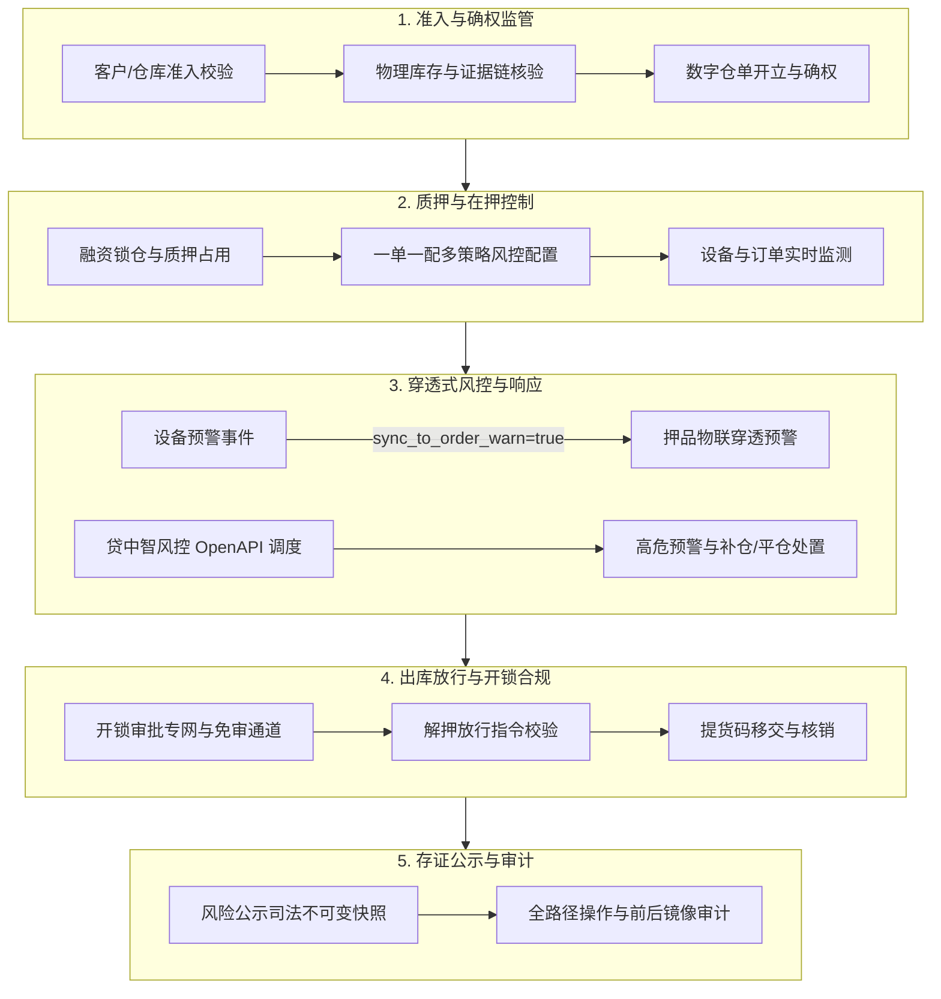

# 监管系统的业务背景

## 1. 行业痛点与 SYZC 应对方向

大宗商品与动产质押融资历来面临“货权不清、监管虚化、预警滞后、现场失控、多方博弈”等痛点。SYZC 存货监管系统针对行业风险提供精准应对机制：

| 行业痛点 | SYZC 的应对机制与技术方案 |
| :--- | :--- |
| **货权悬空与虚假仓单** | 入库现场证据、过磅单、发票合同、数字仓单、货权档案建立强绑定与区块链/时效存证。 |
| **重复质押与擅自放货** | 系统级质押占用强锁定、出库前置合规审批、解押放行指令与提货码核销闭环控制。 |
| **市场价格剧烈波动** | 盯市动态估值引擎、补仓线/平仓线双等级预警、敞口覆盖率监控与自动化处置流程。 |
| **现场物联告警无法穿透** | **物联穿透机制（IoT Penetration）**：设备严重告警（防拆/破门/超阈值）自动穿透至关联在押订单生成押品预警，并在设备现场核销后联动闭环。 |
| **现场高频开锁失控与审批冗长** | **开锁审批专网专道**：门禁开锁双路径机制（免审直发 vs 审批申请），专网专道秒级响应，严格执行 **P06 自审禁止（R11）**。 |
| **预警规则繁杂与主观误判** | **预警等级公共底座（03/01）**：支持租户 2~20 档严重度字典、防抖模型分流（即时/持续时长/连续次数）、订单 6 大策略一站式配置。 |
| **多方协作权责与存证缺失** | 细粒度 RBAC 权限矩阵、租户与仓库数据隔离、风险公示不可变快照（私有 OSS 时效签名）与全生命周期审计追踪。 |

---

## 2. 监管子系统的核心职责与机制

监管能力并非业务旁路，而是贯穿所有核心作业与风控环节的主干控制链：

1. **确权与资产全流程监管**：核验主体资质、入库过磅、质检报告、发票合同，形成不可篡改的数字仓单与货权档案。
2. **状态与一致性强校验**：对质押、解押、补仓、出库、转让与移库执行严格的前置状态校验、幂等控制与并发版本校验。
3. **预警严重度分级底座与防抖机制**：
   - 统一预警严重度字典（`severity_code`），支持 2~20 档动态维护与权重比较（平仓线等级权重必须大于等于补仓线）；
   - 安防事件锁定为 0 延时【即时触发】，传感器事件支持【持续时长】或【连续次数】防抖。
4. **物联穿透闭环机制（R11~R13）**：
   - 当设备预警等级配置 `sync_to_order_warn=true` 且触发告警时，自动向所在库区在押订单生成 `warn_source=IOT_PENETRATION` 押品流水；
   - 订单侧穿透流水只读，必须在现场设备台账核销解除后联动回写订单预警为【已处理有效】。
5. **门禁审批专网专道与自审禁止**：
   - 开锁审批挂载于「工作中心 → 审批中心 → 其他审批 → 开锁审核」，专网专道保障秒级响应；
   - 严格执行 **P06 自审禁止（R11）**：审批人不可审批自己发起的开锁申请。
   - **短信下发边界（R31）**：挂锁门禁支持短信/页面查看，**人脸门禁仅页面展示，绝不调用短信 API**。
6. **贷中智风控 OpenAPI 调度与司法级存证**：
   - 贷中异步调度生成唯一 `task_id`，模型拒绝时回调联动高危预警；
   - 风险公示生成固化快照，仅 R-RISK-MGR 权限可录入理由取消公示，确保合规透明与司法存证效力。

---

## 3. 监管目标与核心业务场景映射表

| 监管目标 | 对应核心业务场景 | 核心风控/监管卡点 |
| :--- | :--- | :--- |
| **真实入库与物理确权** | 场景一：货物入库；场景二：仓单开立 | 过磅单、质检单强制上传；开立仓单前校验未占用库存。 |
| **质押资产安全控制** | 场景三：抵/质押单开立；场景十一：融资管理 | 独家资金方分配；提交融资申请即锁仓；只读继承押品转化质押单。 |
| **合规出库与货权释放** | 场景四：B 端货物出库；场景九：提货单移交 | 抵/质押项下出库校验安全线/控货线及放行指令；提货码核销。 |
| **仓内异动与移位受控** | 场景六：移库；场景七：异动调整 | 移库校验在押状态与目标库位设备；异动调整单多级审批留痕。 |
| **定期盘点账实核实** | 场景八：智能盘点 | 差异生成调整单与盘点异常预警，未核销前阻断质押与出库。 |
| **存货转让合规溯源** | 场景五：存货转让 | 校验质押占用，生成完整货权演进与转让审批链。 |
| **IoT 全域动态监库** | 场景十：设备管理（监控/门禁/物联/GPS） | 监控锚点闯入识别、温湿度超限预警、GPS 越界报警。 |
| **门禁高频开锁合规** | 场景十/十三：开锁审批专网专道 | 审批配置命中判定（免审 vs 审批）；P06 自审禁止；R31 短信边界。 |
| **分级风险与穿透处置** | 场景十二：风险管理（配置/预警/贷中/公示） | 03/01预警等级底座、物联穿透闭环、智风控调度、不可变存证快照。 |

---

## 4. 法律与合规准则

系统遵循“**客观真实、穿透追溯、最小权限、职责分离、全路径审计**”五大原则：
1. **真实性与不可篡改**：外部登记（如中登网/动产融资统一登记公示系统）、司法证据、电子合同及银行清算结果，系统提供接口对接与哈希存证。
2. **审计留痕**：关键配置变更、质押解押、开锁审批、风险处置均记录全要素审计快照（操作人、机构、时间戳、IP、前后数据镜像版本）。
