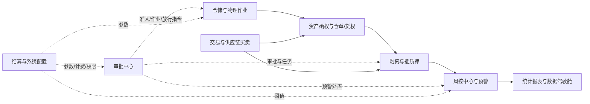

# 系统板块关联关系

## 1. 八大板块协同

`04-主要功能模块和清单.md` 定义八大板块：审批中心、仓储与物理作业、资产确权与仓单/货权、融资与抵质押、交易与供应链买卖、风控中心与预警中枢、统计报表与数据驾驶舱、结算与系统配置。

## 2. 关键数据与控制流

| 起点 | 终点 | 传递内容 | 控制要求 |
| :--- | :--- | :--- | :--- |
| 仓储作业 | 仓单/货权 | 入库、称重、货位、批次和现场证据 | 账实一致，保留版本和流水 |
| 仓单/货权 | 融资/质押 | 可质押资产、权属材料、仓单状态 | 校验占用、重复质押和材料完整性 |
| 融资/质押 | 风控中心 | 融资敞口、盯市价值、覆盖率 | 阈值可配置，预警分级 |
| 风控中心 | 审批中心 | 风险事件、补仓/处置待办 | 按命中规则执行通知、处置或业务阻断 |
| 审批中心 | 仓储作业 | 入库、移库、出库和放行指令 | 无有效审批或作业指令不得执行；具体出库规则以 `06` 为准 |
| 交易模块 | 仓单/货权、融资 | 采购、销售、转让及关联资产 | 状态、权属和质押占用一致 |

## 3. 协同原则

1. 审批中心是业务指令网关，不替代仓储事实、资金清算或外部登记；抵/质押单项下出库仍须经过对应出库审批。
2. 物理库存是数字仓单的事实来源；仓单变更必须能回溯到底层库存流水。
3. 质押占用是仓储、仓单、融资和风控共同识别的控制状态。
4. 所有跨板块写操作使用幂等键、版本校验和审计日志；失败必须可重试、可追踪。
