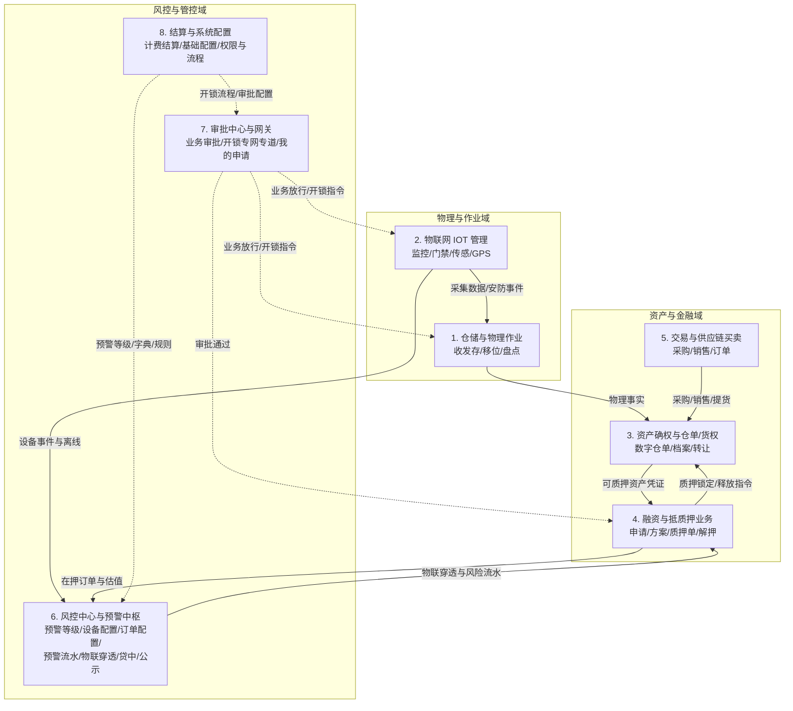

# 系统板块关联关系

## 1. 八大业务板块协同架构

SYZC 系统由 8 大核心业务板块组成，各板块分工明确、紧密联动，形成闭环数据流与控制流：

---

## 2. 关键数据流与控制流矩阵

| 起点板块 | 终点板块 | 传递内容 | 业务控制与系统要求 |
| :--- | :--- | :--- | :--- |
| **仓储与物理作业** | 资产确权 | 入库事实、过磅记录、质检报告、货位与净重 | 账实强一致，多批次管理，生成初始货权档案。 |
| **物联网 IOT 管理** | 风控中心 | 设备离线、锚点闯入、温湿度超限、剪锁/防拆事件 | 按设备规则防抖模型（即时/持续时长/连续次数）过滤与触发。 |
| **物联网 IOT 管理** | 审批中心 | 门禁开锁申请（命中审批配置时发起） | 专网专道流转，严禁进入常规审批池；执行 P06 自审禁止。 |
| **风控中心（等级底座）**| 预警配置/流水 | 严重度字典（`severity_code`）、权重排序、穿透开关 | 全局 2~20 档动态字典统一赋能设备预警与订单预警。 |
| **风控中心（物联穿透）**| 押品预警 | 严重设备告警穿透为 `warn_source=IOT_PENETRATION` | 押品端只读，必须在现场设备台账核销解除后联动回写为【已处理有效】。 |
| **风控中心（贷中风控）**| 第三方智风控平台 | 订单三要素准入、异步模型调度请求 | 生成唯一 `task_id`，模型拒绝时回调生成押品高危预警。 |
| **风控中心（风险公示）**| 外部/全域查看 | 经处置确认的有效告警不可变存证快照 | 私有 OSS 时效签名（15分钟），仅 R-RISK-MGR 可输入理由取消公示。 |
| **资产确权** | 融资抵质押 | 优质仓单明细、货权完整性校验、可质押状态 | 校验重复质押、司法冻结与在押占用。 |
| **融资抵质押** | 仓储与资产确权 | 融资申请锁仓、抵质押占用、解押放行指令 | 锁仓期间禁止出库、转让、移库与重复质押。 |
| **审批中心** | 仓储/物联/融资 | 业务审批结论、开锁下发指令、出库放行凭证 | 审批指令作为现场物理作业与密码获取的唯一前置凭证。 |
| **系统配置** | 各业务板块 | 租户隔离、RBAC 矩阵、单据编码、业务流程 | 多租户强隔离，全路径审计镜像留痕。 |

---

## 3. 跨板块协同的核心设计原则

1. **专网专道与常规流程分流原则**：
   - 门禁开锁审批属于现场高频毫秒级/秒级响应业务，挂载于「工作中心 → 审批中心 → 其他审批 → 开锁审核」，**独立专网专道流转，不接入系统通用工作流引擎，不进通用待处理池**。
2. **物联穿透与源头核销原则**：
   - 设备预警与订单预警通过 `sync_to_order_warn` 建立穿透通道。穿透生成的押品预警在押品侧禁止人工直接解除，必须由现场在设备台账解除后联动回写。
3. **预警严重度全局一致性原则**：
   - 03/01 预警等级是全域公共底座，抵质押率规则强制要求平仓线等级权重 $\ge$ 补仓线等级权重；等级被有效规则引用时强校验拦截删除。
4. **强一致性与并发版本控制**：
   - 涉及质押锁仓、解押放行、提货核销、开锁密码生成等核心操作，均采用分布式锁、请求幂等键（`request_id`）与乐观锁版本号（`version`）防止并发脏读。
