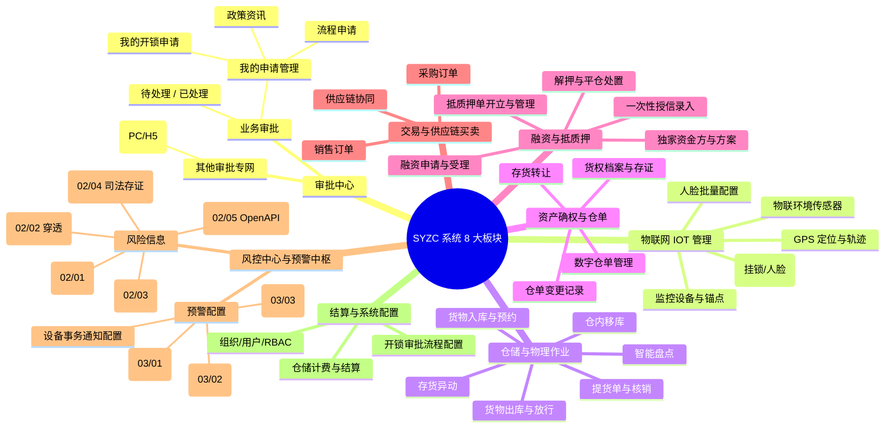

# 森云科技 - SYZC 供应链金融存货监管系统 主要功能模块和清单

> **文档性质**：本文档为 SYZC 系统功能范围、角色权限体系、菜单架构与业务规则矩阵的**全局基准清单**。
> **适用版本**：SYZC 6.2（2026.08）及基准版  
> **制定企业**：森云科技 (Senyun Technology)

---

## 1. 8 大核心业务板块总览

---

## 2. 详细功能清单矩阵

### 2.1 模块 1：审批中心 (Command Gateway)

*定位：系统全局业务指令网关，支持通用业务流程审批与开锁高频专网专道审批。*

| 一级菜单 | 二级菜单/Tab | 功能名称 | 功能描述与核心交互 | 核心业务规则/校验 | 权限编码 |
| :--- | :--- | :--- | :--- | :--- | :--- |
| **工作中心** | 审批中心 → 待处理 | 通用待办列表 | 展示当前登录人待审批的入库、出库、移库、转让、异动等业务单据。 | 支持单笔/批量审批；必须校验当前处理人资格与数据权限。 | `R-APPR-PEND` |
| | 审批中心 → 已处理 | 通用已办列表 | 查看当前登录人已审批完成的单据历史与审批意见。 | 只读查看，支持按审批时间、业务类型检索。 | `R-APPR-DONE` |
| | 审批中心 → 我的申请管理 | 流程申请 Tab | 查看当前用户发起的各类通用业务审批单据及流转进度。 | 支持撤回（仅限未被下一节点处理的申请）。 | `R-APPR-MY-APPLY` |
| | 审批中心 → 我的申请管理 | 政策资讯 Tab | 查看并管理政策资讯发布与阅读记录。 | 权限受控展示。 | `R-APPR-NEWS` |
| | 审批中心 → 我的申请管理 | 我的开锁申请 Tab | 查看当前用户提交的门禁开锁申请（单号、设备、申请原因、审核状态、临时密码）。 | 详情页提供 Deep link；已通过时展示密码（挂锁/人脸均可在页面查看）。 | `R-UNLOCK-APPLY` |
| | 其他审批 → 开锁审核 (PC) | 开锁审核列表与审批 | **专网专道开锁审批入口**。展示待审核与已审核的门禁开锁申请，支持极速审批与密码生成。 | **P06 自审禁止（R11）**：本人申请只展示详情，不可去审批；租户范围强隔离。 | `R-UNLOCK-AUDIT` |
| **业务办理 (H5)** | 其他审批 → 开锁审批 | H5 移动端开锁审批 | 移动端开锁审批专道，支持现场审核人员快速审批放行。 | 规则与 PC 端保持强一致，执行 P06 自审禁止与仓库权限隔离。 | `R-UNLOCK-AUDIT` |
| | 我的申请记录 (H5) | 三 Tab 申请记录 | 移动端集成【流程申请 / 政策资讯 / 开锁审核】三大 Tab。 | 完整回显申请状态、审批进度与密码凭证。 | `R-UNLOCK-APPLY` |

---

### 2.2 模块 2：物联网 IOT 管理 (IoT & Hardware Gateway)

*定位：连接物理世界感知设备，第三方事实接入，本地业务映射与门禁安全防线。*

| 一级菜单 | 二级菜单 | 功能名称 | 功能描述与核心交互 | 核心业务规则/校验 | 权限编码 |
| :--- | :--- | :--- | :--- | :--- | :--- |
| **物联网IOT管理** | 监控设备 | 视频监控台账 | 查看第三方同步监控设备、在线状态、本地备注及绑定位置。 | 在线状态由三方推送只读；支持绑定多个仓库/库区/库位（R-DEV-03）。 | `R-IOT-CAM-VIEW` |
| | | 实时直播与录像 | 查看实时视频流与历史录像回放。 | 播放鉴权 URL 采用 15 分钟时效签名防盗链。 | `R-IOT-CAM-STREAM` |
| | | 监控锚点配置 | 在视频画面上绘制锚点警戒区域，配置人/车闯入检测。 | 锚点配置保存后同步第三方算法；触发闯入时生成设备预警。 | `R-IOT-CAM-ANCHOR` |
| | 门禁设备 | 门禁设备台账 | 展示挂锁门禁与人脸门禁设备列表、在线状态与绑定关系。 | 支持按仓库/库区过滤；支持查看开门记录。 | `R-IOT-DOOR-VIEW` |
| | | 获取门锁密码 (挂锁) | 点击获取挂锁临时密码。系统判断审批配置：免审则直发；命中则弹出申请弹窗。 | **短信边界 (R31)**：免审或通过后支持【短信发送】+【页面展示】。 | `R-IOT-DOOR-PWD` |
| | | 获取门禁密码 (人脸) | 点击获取人脸临时密码。系统判断审批配置：免审直发/发起申请。 | **短信边界 (R31)**：**绝不调用短信 API**，仅在页面弹窗/详情展示。 | `R-IOT-DOOR-PWD` |
| | | 常规人脸授权 | 为指定员工/访客配置人脸门禁通行权限与有效期。 | 同步第三方门禁库；支持设置无限次或有限次通行。 | `R-IOT-DOOR-FACE` |
| | 物联设备 | 传感设备台账 | 展示温湿度、烟感、氧气、二氧化碳等环境采集设备。 | 实时数值展示；支持时间范围历史曲线查询；历史数据不可导出。 | `R-IOT-SENS-VIEW` |
| | GPS 设备 | GPS 定位台账 | 展示车辆/货运 GPS 终端实时位置、在线状态。 | 支持电子围栏配置与越界告警接收。 | `R-IOT-GPS-VIEW` |
| | | 轨迹查询与回放 | 按时间区间查询历史运动轨迹并进行地图动态回放。 | 查询范围必须校验时间区间闭环口径。 | `R-IOT-GPS-TRACK` |
| | 人脸配置 | 人脸批量下发 | 集中管理人员人脸底库并批量下发至指定仓库门禁设备。 | 校验人脸图片质量与合规授权材料。 | `R-IOT-FACE-BATCH` |

---

### 2.3 模块 3：仓储与物理作业 (WMS Operations)

*定位：现场仓储收发存与质检盘点物理作业事实记录。*

| 一级菜单 | 二级菜单 | 功能名称 | 功能描述与核心交互 | 核心业务规则/校验 | 权限编码 |
| :--- | :--- | :--- | :--- | :--- | :--- |
| **仓储作业** | 预约入库/入库管理 | 货物入库登记 | 录入到货通知、过磅净重、质检结果与存放库位。 | 过磅单与质检单必传；入库审批通过后正式增加物理库存。 | `R-WMS-INB-MGR` |
| | 货物出库管理 | 货物出库申请 | 发起普通出库、仓单出库或抵质押项下出库申请。 | 抵质押出库校验安全线/控货线与解押放行指令；生成提货单。 | `R-WMS-OUT-MGR` |
| | 仓内移库管理 | 仓内移位登记 | 发起仓库内或库区间货物移位。 | 在押货物移库需校验目标库位设备覆盖；移位完成前锁定库存。 | `R-WMS-MOV-MGR` |
| | 存货异动管理 | 差异调整单 | 针对货物损耗、水分挥发或计量误差发起调整。 | 严禁直接改动历史事实；必须提供异动证明并经严格审批。 | `R-WMS-ADJ-MGR` |
| | 盘点管理 | 智能盘点任务 | 创建定期/动态盘点任务，录入实盘数据并核对账实。 | 盘点差异自动生成盘点异常预警与调整审批；核销前阻断质押。 | `R-WMS-CHK-MGR` |
| | 提货管理 | 提货单与货物移交 | 现场核销提货码，拍照上传交接单据并确认出库移交。 | 提货码重置/核销全路径审计；支持取消提货与重新入库闭环。 | `R-WMS-PICK-MGR` |

---

### 2.4 模块 4：资产确权与仓单/货权 (Asset Digitization)

*定位：物理库存向可融资数字资产的转化与权属存证中枢。*

| 一级菜单 | 二级菜单 | 功能名称 | 功能描述与核心交互 | 核心业务规则/校验 | 权限编码 |
| :--- | :--- | :--- | :--- | :--- | :--- |
| **资产管理** | 数字仓单管理 | 仓单开立与管理 | 基于已入库合规库存开立数字仓单，生成唯一电子仓单编号。 | 必须校验物理库存无在押/冻结占用；开立后生成防伪存证哈希。 | `R-ASSET-DWR-MGR` |
| | 货权档案管理 | 权属证据链台账 | 归集合同、发票、过磅单、仓储协议、提单等全链证据。 | 证据材料支持在线预览与版本锁定；生效后禁止篡改。 | `R-ASSET-DOC-MGR` |
| | 存货转让管理 | 货权转让申请 | 办理仓单或存货的所有权买卖转移。 | 在押或被风险锁定的资产严禁转让；审批通过后变更货主。 | `R-ASSET-TRF-MGR` |
| | 仓单变更记录 | 变更追溯历史 | 查询仓单拆分、合并、转让、注销等全生命周期流水。 | 只读审计日志，完整记录每次变更前后镜像。 | `R-ASSET-LOG-VIEW` |

---

### 2.5 模块 5：融资与抵质押业务 (Finance & Pledge)

*定位：资产抵质押全流程管控、独家资金方对接与贷中担保品管理。*

| 一级菜单 | 二级菜单 | 功能名称 | 功能描述与核心交互 | 核心业务规则/校验 | 权限编码 |
| :--- | :--- | :--- | :--- | :--- | :--- |
| **融资管理** | 融资申请管理 | 融资意向提交与受理 | 借款人选择产品与拟押品提交申请，B端受理并判断尽调。 | 提交即锁仓；普通库存与仓单不可混选（R-FIN-02/03）。 | `R-FIN-APPLY-MGR` |
| | 资金方分配 | 独家资金方分配 | B 端将融资申请独家分配给一家资金方。 | 同一时间仅限独家分配（R-FIN-07）；资金方可接单或拒绝。 | `R-FIN-ALLOC-MGR` |
| | 融资方案与授信 | 方案提交与授信录入 | 资金方提交拟授信方案并人工录入一次性授信金额与期数。 | 方案提交即锁定不可改（R-FIN-10）；授信结果单次录入无需复核。 | `R-FIN-CREDIT-OP` |
| | 抵质押管理 | 抵/质押单开立 | 基于授信结果生成唯一抵/质押单，转换押品正式质押占用。 | 只读继承锁定押品（R-FIN-12）；一申请一单（R-FIN-13）。 | `R-FIN-PLG-MGR` |
| | 解押与处置 | 解押放行 / 平仓 | 借款人还款后发起解押；或触发平仓线后执行押品拍卖处置。 | 解押需资金方审批通过并出具放行指令；处置全过程存证。 | `R-FIN-RLS-MGR` |

---

### 2.6 模块 6：风控中心与预警中枢 (Risk Control)

*定位：全域风控规则底座、实时监测、物联穿透、智风控对接与风险公示存证。*

| 一级菜单 | 二级菜单 | 功能名称 | 功能描述与核心交互 | 核心业务规则/校验 | 权限编码 |
| :--- | :--- | :--- | :--- | :--- | :--- |
| **03 预警配置** | 01 预警等级 | 严重度字典底座 | 维护租户内 2~20 档严重度（名称、编码、颜色、权重 `sort_order`、穿透开关 `sync_to_order_warn`）。 | **保护规则**：最低保留 2 档禁止删除；被有效规则引用时强校验拦截删除。 | `R-WARN-SEV-CFG` |
| | 02 设备预警配置 | 设备规则配置 | 为具体设备或新设备配置告警规则（离线、锚点闯入、温湿度、门锁剪锁/破门、GPS等）。 | **子类型互斥 (R14)**：上线类须单独成规则；**防抖模型**：安防即时触发，传感支持时长/次数。 | `R-WARN-DEV-CFG` |
| | 03 订单预警配置 | 订单综合规则包 | 针对每笔在押订单一站式配置 6 大策略（超时、跌价、盘点、巡检、质押率、贷中风控）。 | **一单一配 (R04)**：1:1 规则包；策略独立保存；**双等级 (R18)**：平仓线等级权重 $\ge$ 补仓线。 | `R-WARN-ORD-CFG` |
| | 04 设备事务通知配置 | 事务通知规则 | 配置开锁、关锁、设备上线、设备移除等日常通知策略。 | 主规则+明细模式；默认站内信，可选短信/邮件。 | `R-WARN-NOTIF-CFG` |
| **02 预警信息** | 01 设备预警信息 | 设备告警台账 | 展示所有设备触发的告警事件流水、抓拍证据，支持现场解除。 | 展示预警等级与防抖信息；现场解除后回写物联穿透流水。 | `R-WARN-DEV-INFO` |
| | 02 押品预警信息 | 押品风险台账 | 展示订单商业预警与 **物联穿透预警（`warn_source=IOT_PENETRATION`）**。 | **物联穿透只读**：禁止在押品端人工解除，必须现场解除后联动回写为【已处理有效】。 | `R-WARN-COL-INFO` |
| | 03 设备事务通知 | 事务流水记录 | 展示门禁开锁/关锁、设备上线等事务通知历史。 | 记录处理说明与附件，不设失效状态。 | `R-WARN-NOTIF-INFO` |
| | 04 风险公示 | 司法存证公示 | 对已处置完成的有效告警对外合规公示；生成不可变快照。 | **取消约束**：仅 `R-RISK-MGR` 权限可取消且强制输入理由；私有 OSS 时效签名。 | `R-WARN-PUB-MGR` |
| | 05 贷中风控管理 | 智风控模型调度 | 查看订单贷中状态，单笔/批量触发第三方智风控 OpenAPI 调度。 | 异步生成唯一 `task_id`；模型拒绝回调自动生成 02/02 押品高危预警。 | `R-WARN-MID-MGR` |

---

### 2.7 模块 7：统计报表与数据驾驶舱 (Analytics & BI)

*定位：多维度监管数据可视化与风控经营大屏。*

| 一级菜单 | 二级菜单 | 功能名称 | 功能描述与核心交互 | 核心业务规则/校验 | 权限编码 |
| :--- | :--- | :--- | :--- | :--- | :--- |
| **统计与看板** | 风险监控大屏 | 实时风控驾驶舱 | 展示在押总货值、融资总敞口、实时预警分布、设备在线率与高危库区热力图。 | 毫秒级/秒级定时拉取最新指标；敏感金额支持掩码脱敏。 | `R-BI-DASHBOARD` |
| | 监管统计报表 | 存货与质押报表 | 输出仓库收发存台账、质押率趋势、预警处置时效与逾期统计表。 | 支持按租户、仓库、时间范围筛选与合规导出审计。 | `R-BI-REPORTS` |
| | 证据链与存证查询 | 司法追溯大厅 | 输入仓单号/单据号，一键生成从物理入库、设备监控到质押流转的全链路证据图谱。 | 输出不可篡改证据包与数字签名哈希。 | `R-BI-AUDIT-TRACE` |

---

### 2.8 模块 8：结算与系统配置 (Settlement & Config)

*定位：租户基础字典、计费费率、门禁开锁流程配置与 RBAC 权限控制。*

| 一级菜单 | 二级菜单 | 功能名称 | 功能描述与核心交互 | 核心业务规则/校验 | 权限编码 |
| :--- | :--- | :--- | :--- | :--- | :--- |
| **结算管理** | 仓储计费管理 | 仓储费与监管费结算 | 按货物吨位、库位占用时长与监管等级生成账单。 | 结算规则可按客户定制；支持账单确认与开票跟踪。 | `R-SETTLE-BILL-MGR` |
| **配置管理** | 业务流程管理 → 开锁审批 | 开锁审批配置 | 为各仓库/门禁设备配置是否开启审批、审批人员与备选通道。 | 配置启用后，门禁取密自动路由至专网审批申请；未配置则免审直发。 | `R-CONF-UNLOCK-FLOW` |
| | 组织与用户管理 | 租户机构与用户 | 维护租户主体、合作资金方、仓库管理方及员工账号。 | 审批人员选择严格限定在当前租户范围内；多租户数据强隔离。 | `R-CONF-ORG-USER` |
| | 角色与权限矩阵 | RBAC 权限管理 | 维护角色（超管、风控经理、运维、客户经理等）及功能/数据权限。 | 遵循最小权限原则；敏感权限修改全路径审计留痕。 | `R-CONF-RBAC-MGR` |

---

## 3. RBAC 核心角色与菜单权限对照矩阵

| 模块菜单 | R-SYS-ADMIN (超管) | R-IOT-OPS (物联运维) | R-RISK-MGR (风控经理) | R-RISK-OFF (风控专员) | R-ORDER-OP (客户经理) | R-VIEWER (只读审计) |
| :--- | :---: | :---: | :---: | :---: | :---: | :---: |
| **工作中心 · 待处理/已处理** | 全部 | 查看/审批 | 查看/审批 | 查看/审批 | 查看 | 查看 |
| **工作中心 · 其他审批 · 开锁审核** | 全部 | — | 查看/审批* | 查看/审批* | — | — |
| **物联网 · 监控设备 / 锚点** | 全部 | 全部 | 查看 | 查看 | 查看 | 查看 |
| **物联网 · 门禁设备 / 取密** | 全部 | 全部 (免审/申请) | 查看 | — | — | 查看 |
| **物联网 · 物联/GPS设备** | 全部 | 全部 | 查看 | 查看 | — | 查看 |
| **预警配置 · 预警等级 (03/01)** | 全部 | — | 全部 | — | — | 查看 |
| **预警配置 · 设备预警 (03/02)** | 全部 | 全部 | 查看 | 查看 | — | 查看 |
| **预警配置 · 订单预警 (03/03)** | 全部 | — | 全部 | 查看/新增/编辑 | 查看 | 查看 |
| **预警信息 · 设备预警 (02/01)** | 全部 | 查看/现场解除 | 查看/解除 | 查看/解除 | — | 查看 |
| **预警信息 · 押品预警 (02/02)** | 全部 | 查看关联设备 | 全部 | 全部 | 查看/去处理 | 查看 |
| **预警信息 · 风险公示 (02/04)** | 全部 | — | 全部 (含取消) | 查看/发起 | — | 查看 |
| **预警信息 · 贷中风控 (02/05)** | 全部 | — | 全部 | 查看/申请执行 | 查看 | 查看 |
| **配置管理 · 开锁审批流程** | 全部 | — | 全部 | 查看/编辑 | — | 查看 |

> \* 注：开锁审核操作严格执行 **P06 自审禁止（R11）**，且操作人必须具备所在仓库的数据权限。
