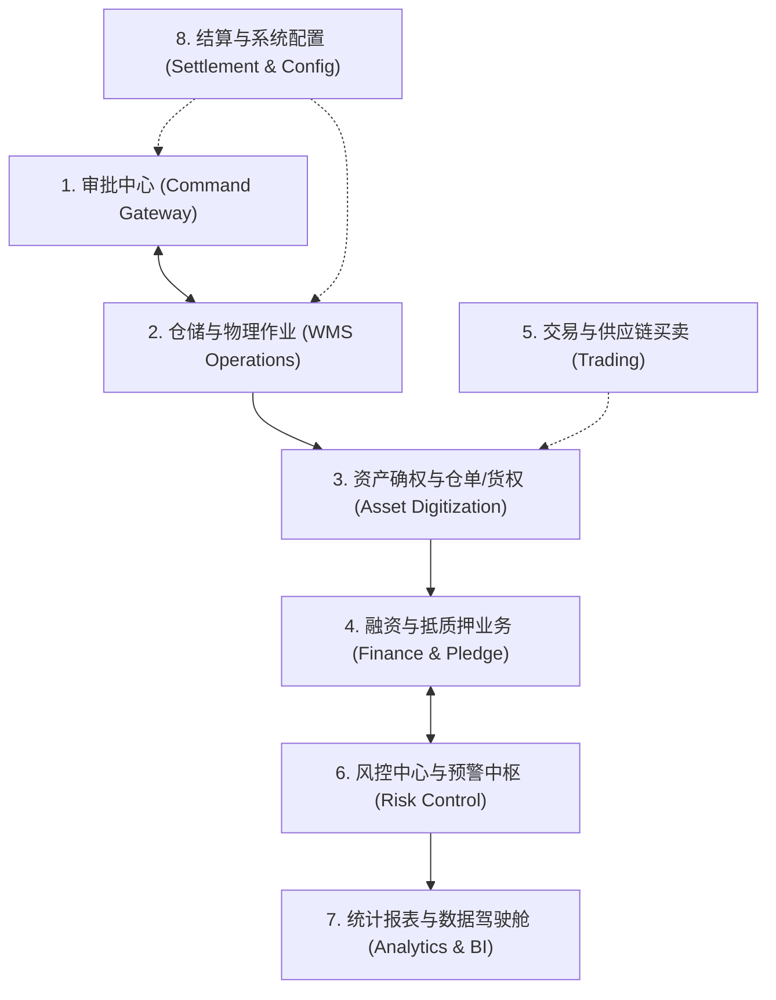
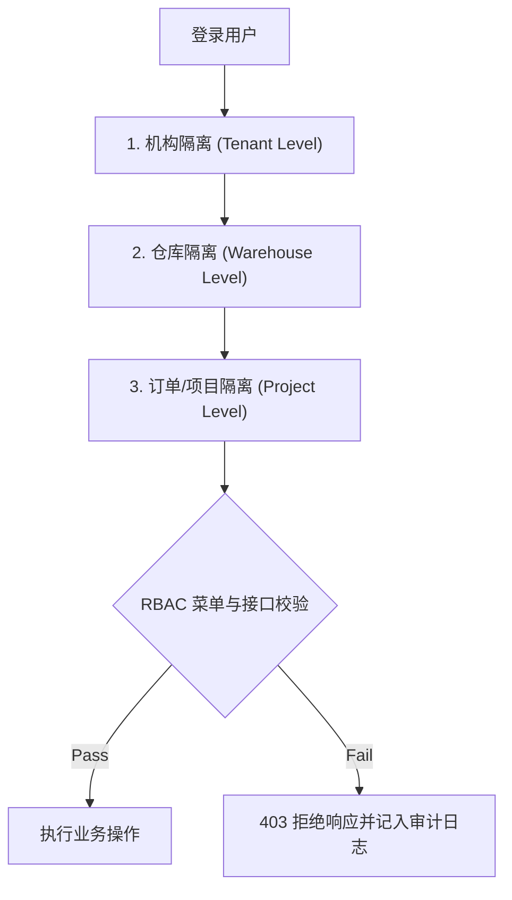

# 森云科技 - SYZC 供应链金融存货监管系统 主要功能模块和清单

---

> **文档定位**：本文件为 SYZC 系统的功能结构大纲与详细功能清单矩阵。全面解构系统 8 大业务板块的组成、子功能定义、核心业务逻辑、涉及角色、RBAC 权限要求及跨模块数据流向。
> **数据来源**：功能权限明细以《功能权限清单（B端）》为准，涵盖 PC 端与移动端全部菜单与权限配置。

---

## 1. 8 大核心业务板块总览

SYZC 围绕"实物数字化 -> 资产确权 -> 金融质押 -> 安全释放"的核心价值链，划分 8 大功能板块：

---

## 2. 详细功能清单矩阵

### 2.1 模块 1：审批中心 (Command Gateway)

*定位：全系统业务指令统一收口与硬控制网关，集中处理各项审批，按货物类型执行出库、解押、质押占用和放行控制。*

| 一级功能 | 二级功能 | 核心业务逻辑与规则 | 主要参与角色 | 权限要求 | 数据/控制流向 |
| :--- | :--- | :--- | :--- | :--- | :--- |
| **工作流大厅** | 我的待办 / 已处理 / 抄送 | 集中展示需当前用户处理的审批节点；支持批量操作、驳回退回、转办、加签与审批轨迹查阅。 | 全角色 | 个人角色视权 | 接入工作流引擎 |
| **客户需求审批** | 客户入库需求审批 | 审核货主发起的入库预约；校验准入合同、拟入库物料白名单及仓库容量。批准后下发物理入库指令。 | 平台运营 / 仓储主管 | 机构级可写 | 触发 WMS 预约入库 |
| | 客户出库需求审批 | 关键安全关卡。按普通货物、仓单货物和抵/质押单项下货物执行对应校验；需要解押或替代担保的情形，须核验资金方有效放行指令，抵/质押单项下出库按 `06` 规定进入出库审批。 | 资金方 / 平台运营 | 机构级可写 | 发放提货码至作业端 |
| | 客户融资需求审批 | 审核借款企业的融资意向申请；核验企业资质、经营状况与基础资产真实性，审核通过后流转至融资尽调环节。 | 资金方审批员 | 资金方专属 | 流转至融资模块 |
| **监管委托** | 监管委托受理与签署 | 资金方、核心企业与仓储监管企业在线签署三方/四方监管协议，确定质押规则、警戒线与监管范围。 | 资金方 / 仓储企业 | 机构管理员 | 生成监管规则基线 |

#### 功能权限明细（PC 端 · 审批中心）

##### 业务管理审批

| 菜单/Tab | 功能说明 | 可用按钮/权限 | 数据权限 |
| :--- | :--- | :--- | :--- |
| 待处理 | 集中处理全系统各类业务单据（入库、出库、移库、盘点、质押）的在线审批流 | 设置监管报告 | 根据当前登录用户针对对应任务的权限决定 |
| 已处理 | 同上 | 查看页面 | — |
| 抄送我的 | 同上 | 查看页面 | — |
| 我的申请管理 | 同上 | 查看页面 | — |
| 业务申请管理 | 同上 | 查看页面 | — |
| 监管委托受理 | 同上 | 查看页面 | — |

##### 客户需求审批

| 菜单/Tab | 功能说明 | 可用按钮/权限 | 数据权限 | 备注 |
| :--- | :--- | :--- | :--- | :--- |
| 客户入库需求 | 基于风控规则和合同校验，对客户提交的入库预约与申请进行业务复核，确认准入货物明细，防范非白名单资产入库 | 查看页面、详情、处理 | 根据当前登录用户针对对应任务的权限决定 | ⚠️ 5.4.3版本取消 |
| 客户入库预约 | 同上 | 查看页面、查看详情、去处理 | 可见数据根据当前登录账号的角色的**仓库**权限决定 | — |
| 客户出库需求 | 系统联动核心风控校验敞口与解押指令，对出库申请进行严格审批，严防无指令出库与敞口跌穿 | 查看页面、详情、处理 | 根据当前登录用户针对对应任务的权限决定 | ⚠️ 5.4.3版本取消 |
| 客户出库预约 | 同上 | 查看页面、查看详情、去处理 | 可见数据根据当前登录账号的角色的**仓库**权限决定 | — |
| 客户融资需求 | 审核客户提交的融资线索与尽调申请，核对底层资产合规性与资信状况，流转至授信放款环节 | 查看页面、详情、驳回（操作权限+数据状态为未分配可用）、分配/再次分配、审核记录 | 有融资申请审核权限的账号可看到所有融资申请信息 | — |
| 融资尽调 | 同上 | — | — | 仅作为联登智风控入口，跳转到智风控平台任务列表 |
| 客户销售需求 | 集中处理全系统各类业务单据的在线审批流，支持多级会签、驳回与权限拦截 | 查看页面、详情、处理、审核记录 | 有菜单权限的账号可看到所有线索 | — |
| 客户采购需求 | 同上 | 查看页面、详情、处理、审核记录 | 有菜单权限的账号可看到所有采购需求申请 | — |

##### 其他审批

| 菜单/Tab | 可用按钮/权限 | 数据权限 | 备注 |
| :--- | :--- | :--- | :--- |
| 政策资讯审核 | 查看页面、详情、处理、审核记录 | 有菜单权限的账号可看到所有线索 | — |
| 贷中风控处理 | — | — | 仅作为联登智风控入口 |

#### 功能权限明细（移动端 · 业务办理 · 客户需求审批）

| 菜单 | 可用按钮/权限 | 数据权限 | 备注 |
| :--- | :--- | :--- | :--- |
| 客户入库需求 | 查看页面；入库：详情、去处理 | 根据当前登录用户针对对应任务的权限决定 | ⚠️ 5.4.3版本取消 |
| 客户入库预约 | 查看页面、查看详情、去处理 | 可见数据根据当前登录账号的角色的仓库权限决定 | — |
| 客户出库需求 | 查看页面；出库：详情、去处理 | 同上 | ⚠️ 5.4.3版本取消 |
| 客户出库预约 | 查看页面、查看详情、去处理 | 同上 | — |
| 客户融资需求 | 查看页面、详情、驳回、分配/再次分配、审核记录 | 有融资申请审核权限的账号可看到所有融资申请信息 | — |
| 融资尽调 | — | — | 仅作为联登智风控入口 |
| 客户销售需求 | 查看页面、详情、去处理、审核记录 | 有菜单权限的账号可看到所有线索 | — |
| 客户采购需求 | 查看页面、详情、去处理、审核记录 | 有菜单权限的账号可看到所有采购需求申请 | — |
| 政策资讯审核 | 查看页面、预览、去处理、审核记录 | 有菜单权限的账号可看到所有线索 | — |
| 贷中风控处理 | 查看页面、去处理 | — | 仅作为联登智风控入口 |

---

### 2.2 模块 2：仓储与物理作业 (WMS Operations)

*定位：数字孪生物理底座，联动地磅、AI 摄像头、RFID 等物联网设备，确保账实相符与现场作业受控。*

| 一级功能 | 二级功能 | 核心业务逻辑与规则 | 主要参与角色 | 权限要求 | 数据/控制流向 |
| :--- | :--- | :--- | :--- | :--- | :--- |
| **存货管理** | 存货明细与库存流水 | 记录 SKU 级库存明细（批次、货位、毛/皮/净重、入库时间）；每一次增减/移动自动生成不可篡改的库存流水。 | 仓储理货员 / 平台运营 | 仓库级可读写 | 数据同步至仓单模块 |
| | 货位与拓扑分布 | 3D 数字孪生可视化库区、库位占用情况；直观展示自由库存与质押锁定库存的分布。 | 仓储主管 | 仓库级可读 | 驾驶舱三维映射 |
| **出入库作业** | 物理入库作业 | 地磅二次称重自动采集，AI 视觉识别车牌与包装外观；作业单经理货员确认后锁定实物数据。 | 仓储理货员 | 仓库级可写 | 生成物理入库记录 |
| | 物理出库作业 | 作业端扫描提货码，防窜货 AI 比对装车轨迹与提货身份。无有效解押放行指令时，系统硬拦截阻止出库。 | 仓储理货员 / 现场监管 | 仓库级可写 | 冲减库存与仓单 |
| | 库内移库与理货 | 库内货位变更须经审批指令授权；现场 CCTV 实时录像，更新货位映射关系。 | 仓储理货员 | 仓库级可写 | 更新库存货位 |
| **盘点与提货** | 货物盘点与差异处理 | 支持定期盘点、随机飞检与 AI 扫码盘点；盘盈/盘亏必须生成差异报告并挂起锁号，经审批后调整。 | 监管员 / 风控巡检 | 仓库级可写 | 触发风险预警 |
| | 提货单核销管理 | 核对电子提货码使用状态、有效期限及核销吨数；防止超数量提货或重复核销。 | 仓储门岗 / 理货员 | 仓库级可写 | 更新提货单状态 |

#### 功能权限明细（PC 端 · 仓储）

##### 库存查询

| 菜单 | 功能说明 | 可用按钮/权限 | 数据权限 | 备注 |
| :--- | :--- | :--- | :--- | :--- |
| 存货管理 | 构建数字孪生底座，实现账实相符的底层物理监控 | 查看页面、存货详情、批量导出 | 账号赋予的仓库权限；货品价格为登录账号归属机构设置的单价 | 优化展示数据 |
| 理货堆放 | 同上 | 查看页面、详情、理货堆放、拆分 | 仓库权限 | — |
| 库存明细 | 提供精确到库区、库位及SKU级别的底层实物台账查询 | 查看页面、详情 | 仓库权限 | — |
| 库存流水 | 记录并追溯特定货物或库位的所有历史进出变动轨迹 | 查看页面、详情 | 仓库权限 | — |

##### 入库管理

| 菜单 | 功能说明 | 可用按钮/权限 | 数据权限 | 备注 |
| :--- | :--- | :--- | :--- | :--- |
| 入库申请 | 管控资产入场全流程，结合物联网设备进行收货校验 | 查看页面、详情、新增入库、撤销入库、操作记录 | 账号角色的仓库权限决定 | ⚠️ 0504：取消入库申请菜单 |
| 入库记录 | 同上 | 查看页面、详情、编辑、分配二维码、下载记录、单据下载、新增入库 | 账号角色的仓库权限决定 | 0504：入库申请入口修改、详情页面优化 |

##### 出库管理

| 菜单 | 功能说明 | 可用按钮/权限 | 数据权限 | 备注 |
| :--- | :--- | :--- | :--- | :--- |
| 出库申请 | 按货物类型执行出库审批、质押占用和放行校验，联动AI防窜货监控 | 查看页面、详情、新增出库、撤销出库、操作记录 | 账号角色的仓库权限决定 | ⚠️ 0504：取消出库申请菜单 |
| 出库记录 | 同上 | 查看页面、详情、下载记录、单据下载、新增出库 | 账号角色的仓库权限决定 | 0504：出库申请入口修改、详情页面优化 |

##### 移库管理

| 菜单 | 功能说明 | 可用按钮/权限 | 数据权限 | 备注 |
| :--- | :--- | :--- | :--- | :--- |
| 移库申请 | 管理库区内的货位变更作业，防范"调包/偷换"风险 | 查看详情、详情、新增移库、撤销移库、操作记录 | 账号角色的仓库权限决定 | ⚠️ 0504：取消移库申请菜单 |
| 移库记录 | 同上 | 查看页面、详情、下载记录、单据下载、新增移库、撤销移库、操作记录 | 账号角色的仓库权限决定 | 0504：移库申请入口修改、详情页面优化 |

##### 货物转让

| 菜单 | 可用按钮/权限 | 数据权限 | 备注 |
| :--- | :--- | :--- | :--- |
| 转让申请 | 查看页面、详情、新增转让、撤销转让 | 账号角色的仓库权限决定 | ⚠️ 0504：取消转让申请菜单 |
| 转让记录 | 查看页面、详情、新增转让、撤销转让 | 账号角色的仓库权限决定 | 0504：转让申请入口修改、详情页面优化 |

##### 货物异动

| 菜单 | 可用按钮/权限 | 数据权限 | 备注 |
| :--- | :--- | :--- | :--- |
| 异动申请 | 查看页面、详情、新增异动、撤销异动、操作记录 | 账号角色的仓库权限决定 | ⚠️ 0504：取消异动申请菜单 |
| 异动记录 | 查看页面、详情、新增异动、撤销异动、操作记录 | 账号角色的仓库权限决定 | 0504：异动申请入口修改、详情页面优化 |

##### 提货单

| 菜单 | 功能说明 | 可用按钮/权限 | 数据权限 |
| :--- | :--- | :--- | :--- |
| 提货单 | 承接出库审批通过后的提货授权，按适用规则校验放行状态，联动AI防窜货监控并验证提货人身份 | 查看页面、详情、取消提货、重置提货码、提货码核销、操作记录、确认提货 | 账号角色的仓库权限决定 |

##### 货物盘点

| 菜单 | 功能说明 | 可用按钮/权限 | 数据权限 |
| :--- | :--- | :--- | :--- |
| 货物盘点 | 支持按总量概盘或按明细盲盘，联动现场进行实地查验，生成电子盘点报告 | 查看页面、详情、生成报告、生成记录、异常处理、新增盘点、撤销盘点 | 账号角色的【仓库】权限决定；解除异常根据配置的权限决定 |

##### 设备管理

| 菜单 | 功能说明 | 可用按钮/权限 | 数据权限 |
| :--- | :--- | :--- | :--- |
| 监控设备 | 统一管理前端物联网硬件，配置设备参数及电子围栏边界 | 查看页面、重命名、仓库绑定、查看直播、查看回放、图像锚点、移除设备 | 仓库权限；未绑定具体位置的设备所有登录账号可见 |
| 门禁设备 | 同上 | 查看页面、重命名、仓库绑定、设备数据、获取密码、移除设备、人脸管理 | 同上 |
| 物联设备 | 同上 | 查看页面、重命名、仓库绑定、设备数据、移除设备 | 同上 |
| GPS设备 | 同上 | 查看页面、重命名、仓库绑定、实时定位、运动轨迹、移除设备、GPS平台规则配置、GPS平台基础数据 | 同上 |
| 门禁事务记录 | 同上 | 查看页面 | 仓库权限；未绑定位置的设备事务记录所有账号可见 |
| 人脸配置 | 同上 | 查看、上传人脸、分配门禁 | 分配门禁：仓库权限；人员列表：机构数据权限 |

##### 仓单管理（仓储板块）

| 菜单 | 功能说明 | 可用按钮/权限 | 数据权限 |
| :--- | :--- | :--- | :--- |
| 仓单管理 | 将物理入库明细打包生成不可篡改的数字仓单，记录全生命周期与物权流转 | 查看页面、详情、仓单开立、下载（列表下载及变更记录中的下载）、货物移除、变更记录、仓单补货、仓单出库、仓单移库、仓单注销 | 开立申请可选仓库为账号权限内的仓库；可见数据为账号赋予的仓库权限决定 |

##### 合同管理（仓储板块）

| 菜单 | 功能说明 | 可用按钮/权限 | 数据权限 |
| :--- | :--- | :--- | :--- |
| 仓储合同管理 | 集中管理仓储协议、融资合同、监管协议等法律文本，夯实动产融资业务的法律合规底座 | 查看页面、合同下载、下载记录 | 合同创建人账号归属机构为该份合同的归属机构；C端产生的合同挂靠顶级机构；登录账号有对应数据权限可查看权限内数据 |

#### 功能权限明细（移动端 · 工作台 · 仓储）

| 菜单 | 功能说明 | 可用按钮/权限 | 数据权限 |
| :--- | :--- | :--- | :--- |
| 存货管理 | 构建数字孪生底座，实现账实相符的底层物理监控 | 查看页面、详情 | 账号赋予的仓库权限；货品价格为归属机构设置的单价 |
| 仓单管理 | 连接实物与金融的桥梁，记录仓单全生命周期 | 查看页面、详情 | 账号赋予的仓库权限 |
| 入库管理 | 管控资产入场全流程，结合物联网设备进行收货校验 | 查看页面、入库、入库记录（入库订单：查看详情、编辑、分配二维码、单据下载、下载记录；入库申请：查看详情、操作记录、入库撤销） | 账号角色的仓库权限决定 |
| 出库管理 | 按货物类型执行出库审批、质押占用和放行校验 | 查看页面、出库、出库记录（出库订单：查看详情、单据下载、下载记录；出库申请：查看详情、操作记录、出库撤销） | 账号角色的仓库权限决定 |
| 移库管理 | 管理库区内的货位变更作业，防范"调包/偷换"风险 | 查看页面、移库、移库记录（移库订单：查看详情、单据下载、下载记录；移库申请：查看详情、操作记录、移库撤销） | 账号角色的仓库权限决定 |
| 货物转让 | 提供支持业务运转的操作入口 | 查看页面、转让、转让记录（转让申请：查看详情、撤销；转让记录：查看详情） | 账号角色的仓库权限决定 |
| 提货单 | 承接出库审批通过后的提货授权，按适用规则校验放行状态并验证提货人身份 | 查看页面、详情、取消提货、重置提货码、提货码核销、操作记录、确认提货 | 账号角色的仓库权限决定 |
| 货物盘点 | 支持按总量概盘或按明细盲盘，生成电子盘点报告 | 查看页面、扫码盘点、盘点记录、解除异常 | 账号角色的仓库权限决定 |
| 异动管理 | 管理库区内的货物数量变更作业 | 查看页面、异动记录（异动订单：查看详情；异动申请：查看详情、操作记录、移库撤销） | 账号角色的仓库权限决定 |
| 理货堆放 | 构建数字孪生底座，实物分布管理 | 查看页面、详情、理货堆放、拆分 | 仓库权限 |
| 库存明细 | 提供精确到库区、库位及SKU级别的底层实物台账查询 | 查看页面、详情 | 仓库权限 |

---

### 2.3 模块 3：资产确权与仓单/货权 (Asset Digitization)

*定位：将物理入库明细打包生成数字仓单，归集购销合同与发票进行货权确权，并接入外部平台公示。*

| 一级功能 | 二级功能 | 核心业务逻辑与规则 | 主要参与角色 | 权限要求 | 数据/控制流向 |
| :--- | :--- | :--- | :--- | :--- | :--- |
| **数字仓单管理** | 仓单开立与打签名 | 根据已验收物理入库单自动打签生成数字仓单（含哈希值、仓储签章）；仓单具备唯一电子编号。 | 仓储企业 / 平台运营 | 机构级可写 | 供融资质押申请使用 |
| | 仓单变更与拆分合并 | 支持因交易或部分解押导致的仓单拆分、合并与权属转移；每次变更保存完整历史版本快照。 | 货主 / 平台运营 | 机构级可写 | 更新仓单版本镜像 |
| | 仓单注销与废止 | 出库完成或仓单失效后执行注销；注销后不可恢复，相关流水永久归档。 | 平台运营 / 资金方 | 机构级可写 | 终结仓单生命周期 |
| **货权档案** | 确权凭证归集 | 归集采购合同、增值税发票、物流运单、装卸单据等材料，建立 360° 货权证据链。 | 货主企业 | 本企业可写 | 风控审查凭证源 |
| | 货权信息公示 | 生成可对外的电子货权公示牌；支持生成公开查验二维码或对接中登网/区块链公示节点。 | 平台运营 / 审计员 | 机构级可读 | 推送中登网/链上 |
| **存证管理** | 关键节点存证索引 | 将仓单生成、质押开立、解押指令及出库事件上传至高可信存证节点，记录存证哈希与时间戳。 | 系统自动化 / 审计员 | 全局只读 | 审计溯源校验 |

#### 功能权限明细（PC 端 · 仓储 · 货权管理）

| 菜单 | 功能说明 | 可用按钮/权限 | 数据权限 |
| :--- | :--- | :--- | :--- |
| 货权档案 | 建立每批货物的权属身份档案，归集采购合同、发票等确权凭证，确立货物初始所有权 | 查看页面、详情、移交档案、确认结束、批量移交 | 账号角色的仓库权限决定；档案移交人员的列表为当前子机构下的所有人员清单（仅展示同级机构） |
| 货权公示 | 将货权与质押状态对接入外部动产融资统一登记系统或区块链节点进行公示 | 查看页面、生成系统货权牌、生成中仓登货权牌、中登网登记、公示页面 | 账号角色的仓库权限决定 |
| 证据管理 | 将物理入库明细打包生成不可篡改的数字仓单，记录全生命周期与物权流转 | 查看页面、存证报告、原文件、货物详情、导出 | 账号角色的仓库权限决定 |

#### 功能权限明细（移动端 · 工作台 · 仓储 · 货权）

| 菜单 | 功能说明 | 可用按钮/权限 | 数据权限 |
| :--- | :--- | :--- | :--- |
| 货权档案 | 建立每批货物的权属身份档案，归集确权凭证，确立货物初始所有权 | 查看页面、详情、批量移交、移交档案、确认结束 | 账号角色的仓库权限决定；档案移交人员列表仅展示同级机构 |
| 证据管理 | 将物理入库明细打包生成不可篡改的数字仓单，记录全生命周期 | 查看页面、存证报告、原文件、货物详情、导出 | 账号角色的仓库权限决定 |

---

### 2.4 模块 4：融资与抵质押业务 (Finance & Pledge)

*定位：承接金融端授信放款与货权质押。管理质押单/抵押单全生命周期，支持置换、解押与平仓。*

| 一级功能 | 二级功能 | 核心业务逻辑与规则 | 主要参与角色 | 权限要求 | 数据/控制流向 |
| :--- | :--- | :--- | :--- | :--- | :--- |
| **融资申请与尽调** | 客户融资尽调线索 | 归集货主融资意向，对接智风控平台进行主体信用、司法诉讼、历史履约情况尽调。 | 资金方客户经理 | 资金方专属 | 推送尽调结论 |
| | 额度与授信映射 | 关联资金方对货主或项目的综合授信额度与动产质押专项额度。 | 资金方风控员 | 资金方专属 | 校验授信敞口 |
| **抵质押业务** | 质押单 / 抵押单开立 | 绑定指定数字仓单，设置初始质押率、质押金额、警戒线与平仓线。开立后锁定底层数字仓单与实物。 | 资金方 / 平台运营 | 资金方可写 | 锁定仓单与库存 |
| | 部分解质押办理 | 借款人按比例还款后，资金方发起部分解质押；系统按金额/吨数释放对应比例仓单的锁定状态。 | 资金方风控员 | 资金方可写 | 解锁对应比例仓单 |
| | 加补仓与置换质押 | 资产跌价导致敞口不足时，货主提交新仓单补仓或等值资产置换；系统校验覆盖率达标后恢复正常状态。 | 货主 / 资金方 | 机构级可写 | 重新计算敞口覆盖率 |
| | 平仓处置管理 | 触发平仓线且超时未补仓时，资金方在线发起平仓处置；生成平仓处置单并下发强制拍卖/提货指令。 | 资金方风控主管 | 资金方高级权限 | 授权拍卖或出库 |

#### 功能权限明细（PC 端 · 融资/监管）

##### 融资管理

| 菜单 | 功能说明 | 可用按钮/权限 | 数据权限 | 备注 |
| :--- | :--- | :--- | :--- | :--- |
| 客户融资需求线索 | 承接金融端授信业务，建立线上质押合同台账 | 查看页面、详情、驳回（操作权限+数据状态为未分配可用）、分配/再次分配、审核记录 | 有融资申请审核权限的账号可看到所有融资申请信息 | 原审批～客户融资需求；门户端C端用户发起的融资信息 |
| 客户融资尽调办理 | 同上 | 查看页面、查看详情、拒绝、分配、发起尽调、客户尽调记录 | 账号角色的数据权限决定；分配时可选机构为登录账号归属机构上配置的合作机构+本机构所有启用的人员账号 | 客户尽调记录仅作为联登智风控入口 |
| 客户融资需求分配 | 同上 | 查看页面、详情、驳回、分配/再次分配、审核记录 | 同上 | 原：需求管理～监管委托需求；用于银行内部管理与分配 |
| 融资结果/线上抵质押办理 | 同上 | 查看页面、详情、分配、状态管理、发起抵/质押、抵/质押信息确认、导出为Excel | 同上 | 同上页面路径，仅状态为申请成功的单据，操作中只有【抵质押信息确认】按钮 |

##### 抵质押业务

| 菜单 | 功能说明 | 可用按钮/权限 | 数据权限 | 备注 |
| :--- | :--- | :--- | :--- | :--- |
| 抵质押业务办理 | 承接金融端授信业务，发起抵押或质押申请 | — | — | 页面优化，发起抵押或质押申请 |
| 抵质押业务管理（抵质押订单） | 承接金融端授信业务，处理质押物动态质押登记 | 查看页面、导出为excel、结算管理；更多操作：质物置换、加/补仓、提货、解抵/质押、货物估值、货物盘点、盘点报告、移库、查看监控、平仓、查看风险、设备管理、查看详情、部分结清、监管报告（查看详情/查看报告/下载报告/生成盘点监管报告）、资料管理、资料上传、风险公示 | 任务发起人及任务处理人可看到相关信息，其他无关人员需要有对应数据所属机构的数据权限才能看到；盘点：盘点人只能盘点自己有仓库权限的货物 | — |
| 抵质押业务管理（监管订单） | 同上 | 查看页面、导出为excel、操作记录、资料管理、资料上传、结算管理；更多操作：加/补仓、提货、解监管、平仓、货物盘点、盘点报告、查看监控、查看风险、设备管理、查看详情、监管报告 | 同上 | — |

##### 监管业务

| 菜单 | 功能说明 | 可用按钮/权限 | 数据权限 |
| :--- | :--- | :--- | :--- |
| 供应链监管业务（监管订单） | 承接金融端授信业务，建立线上质押合同台账 | 查看页面、导出为excel、操作记录、查看资料、结算管理；更多操作：加/补仓、提货、解监管、平仓、货物盘点、盘点报告、查看监控、查看风险、设备管理、查看详情、监管报告（查看详情/查看报告/下载报告/生成盘点监管报告） | 任务发起人及任务处理人可看到相关信息，其他无关人员需要有对应数据所属机构的数据权限才能看到 |

#### 功能权限明细（移动端 · 工作台 · 融资/监管）

| 菜单 | 二级Tab | 功能说明 | 可用按钮/权限 | 数据权限 |
| :--- | :--- | :--- | :--- | :--- |
| 抵质押业务管理 | 抵质押订单 | 承接金融端授信业务，建立线上质押合同台账 | 查看页面、结算管理、货物置换、货物补仓、货物出库、解抵质押、货物估值、货物盘点、盘点报告、货物移库、查看监控、平仓、查看风险、设备管理、操作记录、货物详情、贷款结果录入、查看详情、监管报告、部分结清、部分解抵质押 | 任务发起人及任务处理人可看到相关信息，其他无关人员需要有对应数据所属机构的数据权限才能看到 |
| 抵质押业务管理 | 监管订单 | 同上 | 查看页面、查看监控、查看风险、设备管理、货物估值、平仓、货物详情、查看详情、监管报告（生成盘点监管报告、撤销申请、下载报告、查看详情、重新申请、查看报告） | 同上 |
| 客户融资需求管理 | — | 承接金融端授信业务 | 查看页面、融资详情、分配、状态管理、发起抵质押 | 有融资申请审核权限的账号可看到所有融资申请信息 |
| 客户融资尽调办理 | — | 同上 | 查看页面、查看详情、拒绝（待受理状态）、分配（待受理/受理通过状态）、发起尽调（待受理/受理中状态）、下载资料（受理通过/受理拒绝状态） | 登录账号数据权限内的数据 |
| 监管档案 | — | 承接金融端授信业务 | 查看页面、新增入库、新增出库、新增移库、货物转让、待提货单、仓单开立、抵押单开立、质押单开立、货物列表、仓单、抵押单、质押单、设备预警、订单预警、记录管理、资料管理、资料上传、风险公示 | — |

---

### 2.5 模块 5：交易与供应链买卖 (Trading)

*定位：记录并审核上下游大宗现货买卖需求与合同流转，核验证实供应链交易真实背景。*

| 一级功能 | 二级功能 | 核心业务逻辑与规则 | 主要参与角色 | 权限要求 | 数据/控制流向 |
| :--- | :--- | :--- | :--- | :--- | :--- |
| **买卖需求管理** | 采购需求与销售需求 | 贸易商发布大宗商品采购或销售需求（货号、规格、交割仓库、交割时间）。 | 核心企业 / 货主 | 企业级可写 | 撮合或匹配合同 |
| **合同与关联** | 销售 / 采购合同管理 | 录入并归集线上/线下购销合同文本、电子签章、履约期限及结算条款；与入库单据、仓单关联。 | 货主 / 平台运营 | 企业级可写 | 为货权档案提供依据 |
| | 交易真实性核验 | 比对发票代码、税务流向、物流运单及付款水单，辅助人工识别"自买自卖"或循环交易风险。 | 资金方风控员 | 资金方可读 | 风控评估参考 |

#### 功能权限明细（PC 端 · 交易）

| 菜单 | 功能说明 | 可用按钮/权限 | 数据权限 |
| :--- | :--- | :--- | :--- |
| 采购需求管理 | 记录及审核产业链上下游的大宗现货买卖需求与合同流转 | 查看页面、详情、下架 | 所有数据挂靠顶级机构；登录账号有对应机构的数据权限可看 |
| 销售需求管理 | 同上 | 查看页面、详情、线索下架、线索跟进 | 所有数据挂靠顶级机构；登录账号有对应机构的数据权限可看 |
| 销售合同管理 | 集中管理仓储协议、融资合同、监管协议等法律文本 | 查看页面、下载、下载记录 | 合同创建人账号归属机构为该份合同的归属机构；C端产生的合同挂靠顶级机构 |
| 客户管理 | 客户信息查看 | 查看页面、详情、导出为Excel | 挂靠顶级机构；有功能权限可看 |

#### 功能权限明细（移动端 · 工作台 · 交易）

| 菜单 | 功能说明 | 可用按钮/权限 | 数据权限 |
| :--- | :--- | :--- | :--- |
| 采购需求管理 | 记录及审核产业链上下游的大宗现货买卖需求与合同流转 | 查看页面、详情、下架 | 所有数据挂靠顶级机构；登录账号有对应机构的数据权限可看 |
| 销售需求管理 | 同上 | 查看页面、详情、下架、线索跟进 | 所有数据挂靠顶级机构；登录账号有对应机构的数据权限可看 |
| 政策资讯 | 记录及审核产业链上下游的大宗现货买卖需求与合同流转 | 查看页面、查看详情、编辑、上/下架、删除 | 数据创建成功后挂靠到创建人员账号所属机构；可见数据根据登录账号角色的数据权限决定 |

---

### 2.6 模块 6：风控中心与预警中枢 (Risk Control)

*定位：平台主动防御中枢。实时监测物联网设备离线、非授权移位、资产跌价风险及现场巡检。*

| 一级功能 | 二级功能 | 核心业务逻辑与规则 | 主要参与角色 | 权限要求 | 数据/控制流向 |
| :--- | :--- | :--- | :--- | :--- | :--- |
| **设备预警** | IoT 硬件异常告警 | 按设备预警配置监测设备离线、图像识别、物联阈值、门禁、挂锁及 GPS 异常；命中后生成对应类型的设备预警单。 | 系统自动化 / 运维 | 机构级可读写 | 推送待办至运维 |
| **押品预警** | 盯市跌价与超质押率 | 对接外部行情源计算 Mark-to-Market；当覆盖率低于警戒线时触发"押品预警"，限制新增借款。 | 系统风控引擎 | 资金方/风控可读 | 推送补仓待办 |
| | 权属与重复质押预警 | 校验同一仓单/货物在外部登记系统的状态，防范二次质押或权属司法冻结。 | 风控引擎 / 审计 | 全局可读 | 触发高危硬阻断 |
| **贷中与巡检** | 贷中风控与现场飞检 | 制定定期巡检与突发飞检计划；巡检人员通过移动端上传现场盘点照片、定位与库防记录。 | 现场巡检员 / 监管 | 角色可写 | 归集巡检报告 |

#### 功能权限明细（PC 端 · 风控）

##### 风控中心（看板）

| 菜单 | 可用按钮/权限 | 数据权限 | 备注 |
| :--- | :--- | :--- | :--- |
| 设备中心（新增） | 查看页面 | 仓库权限 | 计划中 |
| 总机构风控管理看板 | 查看页面 | 所有机构权限，所有仓库权限 | — |
| 机构风控管理看板 | 查看页面 | 根据账号机构权限展示订单预警数据，根据仓库权限展示设备预警数据 | — |
| 总机构数字仓库看板 | 查看页面、分享 | 所有仓库权限 | — |
| 机构数字仓库看板 | 查看页面、分享 | 根据仓库权限展示设备、抵质押单信息 | — |

##### 风险信息

| 菜单 | 功能说明 | 可用按钮/权限 | 数据权限 |
| :--- | :--- | :--- | :--- |
| 设备预警信息 | 统一管理前端物联网硬件，配置设备参数及电子围栏边界 | 查看页面、详情、去处理（操作权限+预警状态为未处理） | 仓库权限；未绑定具体位置的设备所有账号可见 |
| 押品预警信息 | 预警规则引擎配置及告警处理，触发毫秒级系统告警与自动熔断 | 查看页面、详情、去查看、公示风险、批量公示风险（已处理数据下才展示） | 订单数据权限；可见订单则可见订单相关的预警消息 |
| 设备事务通知信息 | 统一管理前端物联网硬件，配置设备参数及电子围栏边界 | 查看页面、去处理 | 根据仓库权限决定；未绑定位置的设备事务记录所有账号可见 |
| 贷中风控管理 | 平台主动式安全防御中枢，多维侦测异动事件，将风险分级推送给责任人 | 查看页面、查看详情、执行风控模型、批量执行 | 订单数据权限 |
| 巡检异常管理（新增） | 同上 | 查看页面、处理、查看详情 | 有菜单权限的人可见所有数据；操作权限根据当前用户被配置到处理异常任务的权限决定 |

##### 巡检管理（新）

| 菜单 | 可用按钮/权限 | 数据权限 | 备注 |
| :--- | :--- | :--- | :--- |
| 巡检计划 | 查看页面、新增、编辑、停/启用、删除、查看详情 | 有菜单权限的人可见所有数据 | 计划中 |
| 巡检任务 | 查看页面、详情 | 有菜单权限的人可见所有数据 | 计划中 |
| 巡检结果 | 查看页面、详情 | 有菜单权限的人可见所有数据 | 计划中 |

#### 功能权限明细（移动端 · 工作台 · 风控）

| 菜单 | 功能说明 | 可用按钮/权限 | 数据权限 |
| :--- | :--- | :--- | :--- |
| 设备预警信息 | 统一管理前端物联网硬件，配置设备参数及电子围栏边界 | 查看页面、去处理（操作权限+预警状态为未处理） | 仓库权限；未绑定具体位置的设备所有账号可见 |
| 押品预警信息 | 预警规则引擎配置及告警处理，触发毫秒级系统告警与自动熔断 | 查看页面、去查看 | 可见订单则可见订单相关的预警消息 |
| 设备事务通知 | 统一管理前端物联网硬件，配置设备参数及电子围栏边界 | 查看页面、去处理 | 根据仓库权限决定；未绑定位置的设备事务记录所有账号可见 |
| 贷中风控管理 | 平台主动式安全防御中枢 | 查看页面、查看详情、执行风控模型、批量执行 | 订单数据权限 |
| 巡检异常管理 | 同上 | — | — |
| 巡检任务 | 同上 | — | — |
| 日常巡检 | 同上 | — | — |

---

### 2.7 模块 7：统计报表与数据驾驶舱 (Analytics & BI)

*定位：可视化资产与风险画像。提供大盘数据看板、货位利用率及大宗商品现期货行情走势。*

| 一级功能 | 二级功能 | 核心业务逻辑与规则 | 主要参与角色 | 权限要求 | 数据/控制流向 |
| :--- | :--- | :--- | :--- | :--- | :--- |
| **数据大屏** | 总机构 / 机构风控看板 | 实时展示全盘在库货值、总融资敞口、质押率分布、预警事件待办统计及仓库地理分布图。 | 高管 / 资金方 | 机构/全局可读 | BI 引擎实时渲染 |
| | 数字仓库可视化大屏 | 结合 IoT 设备渲染库区 3D 拟态图；展示实时地磅过重流速、库位占用率与监控视频流。 | 仓库主管 / 监管员 | 仓库级可读 | 监控大屏渲染 |
| **价格走势看板** | 现期货价格走势 | 接入上海期货交易所、大连商品交易所等行情数据；展示准入大宗物料的历史与实时价格走势。 | 全角色 | 通用可读 | 行情数据源 |

#### 功能权限明细（PC 端 · 统计/看板）

##### 总机构报表看板

| 菜单 | 功能说明 | 可用按钮/权限 | 数据权限 |
| :--- | :--- | :--- | :--- |
| 业务管理看板 | 提供多维度、可视化的业务统计报表，穿透展现全盘监管资产价值、货位利用率及预警情况 | 查看页面 | 所有机构权限，所有仓库权限 |
| 资产管理看板 | 同上 | 查看页面 | 所有机构权限，所有仓库权限 |
| 价格走势看板 | 同上 | 查看页面 | 所有机构权限，所有仓库权限 |

##### 机构报表看板

| 菜单 | 功能说明 | 可用按钮/权限 | 数据权限 |
| :--- | :--- | :--- | :--- |
| 业务管理看板 | 提供多维度、可视化的业务统计报表 | 查看页面 | 根据账号机构权限展示数据，根据仓库权限展示部分数据 |
| 资产管理看板 | 同上 | 查看页面 | 同上 |
| 价格走势看板 | 同上 | 查看页面 | 同上 |

#### 功能权限明细（PC 端 · 首页 · 数据一览）

| 菜单 | 功能说明 | 可用按钮/权限 | 数据权限 |
| :--- | :--- | :--- | :--- |
| 客户总数 | 系统级全局数据驾驶舱，实时监控业务量、资产分布、敞口比例及异常指标 | 查看页面、详情 | 仓库权限 |
| 仓库 | 同上 | 查看页面、详情、待提货、新增入库、新增出库、新增移库、货物转让、仓单开立、抵押单开立、质押单开立 | 仓库权限 |
| 货物 | 同上 | 查看页面、详情、待提货、新增入库、新增出库、新增移库、货物转让、仓单开立、抵押单开立、质押单开立 | 仓库权限 |
| 仓单管理 | 同上 | 查看页面、详情、仓单出库、仓单开立、变更记录、仓单补货、仓单移库、仓单移除、仓单注销 | 仓库权限 |
| 抵押单管理 | 同上 | 查看页面、详情、操作记录、货物出库、抵押单开立、部分解抵押、查看资料、查看风险、结算管理、置换抵押、加/补仓、解抵押、货物估值、货物盘点、盘点报告、移库、查看监控、平仓、查看风险、设备管理、贷款结果录入、监管报告、部分结清 | 订单数据权限 |
| 质押单管理 | 同上 | 查看页面、详情、操作记录、货物出库、质押单开立、部分解质押、查看资料、查看风险、结算管理、置换质押、加/补仓、解质押、货物估值、货物盘点、盘点报告、移库、查看监控、平仓、查看风险、设备管理、贷款结果录入、监管报告、部分结清 | 订单数据权限 |
| 设备预警管理 | 同上 | 查看页面、详情 | 仓库权限 |
| 订单预警管理 | 同上 | 查看页面、详情 | 订单数据权限 |
| 记录管理 | 同上 | 查看页面、详情 | 仓库权限 |

---

### 2.8 模块 8：结算与系统配置 (Settlement & Config)

*定位：按吨数与天数自动生成仓储费与监管费账单；配置机构组织、仓库拓扑、设备及 RBAC 权限。*

| 一级功能 | 二级功能 | 核心业务逻辑与规则 | 主要参与角色 | 权限要求 | 数据/控制流向 |
| :--- | :--- | :--- | :--- | :--- | :--- |
| **项目结算** | 结算计费与费用汇总 | 按合同约定计费规则（吨·天、入库费、监管服务费）自动生成月度应收/应付结算单。 | 结算专员 / 财务 | 机构级可写 | 财务对接 |
| **系统配置** | 机构管理与统一合作方 | 统一维护银行、仓储、货主、监管方的企业档案与角色标签（`roleTags`），校验统一社会信用代码。 | 平台管理员 | 平台最高权限 | 基础数据服务 |
| | 仓库拓扑与设备配置 | 建立"仓库-库区-库位"三级拓扑结构；绑定地磅、摄像头 IP、MQTT 端口及设备警报阈值。 | 仓储管理员 | 机构级可写 | 物联网服务底座 |
| | RBAC 权限与日志审计 | 配置角色、菜单权限与数据范围；展示系统全路径审计日志（含操作人、IP、数据 Version 镜像）。 | 安全管理员 / 审计员 | 机构级可写 | 审计追溯 |

#### 功能权限明细（PC 端 · 结算）

| 菜单 | 功能说明 | 可用按钮/权限 | 数据权限 |
| :--- | :--- | :--- | :--- |
| 项目结算管理 | 基于业务发生量（入出库数、存货天数、监管服务）自动计费，生成应收/应付账单 | 查看页面、详情、新增收入结算单、新增支出结算单、结算单编辑、结算单结算、结算单结清、结算单作废、结算记录、结算单下载 | 功能权限 |
| 结算汇总 | 同上 | 查看页面、结算汇总明细、结算汇总导出、结算汇总导出记录 | 功能权限 |

#### 功能权限明细（移动端 · 工作台 · 结算）

| 菜单 | 可用按钮/权限 | 数据权限 |
| :--- | :--- | :--- |
| 结算管理 | 查看页面、详情、编辑、结算、结算记录、下载结算单、结清、作废 | 功能权限 |
| 新增收入结算单 | 查看页面 | 功能权限 |
| 新增支出结算单 | 查看页面 | 功能权限 |

#### 功能权限明细（PC 端 · 配置管理）

##### 门户管理

| 菜单 | 功能说明 | 可用按钮/权限 | 数据权限 |
| :--- | :--- | :--- | :--- |
| 门户端配置 | 提供支持供应链金融业务运转的基础配置或操作入口 | 查看页面、编辑 | 频道参数子页面展示的可选项均为平台端赋予该机构的权限；Banner配置子页面展示的频道为平台端赋予该机构的权限内的频道 |
| 政策资讯 | 同上 | 查看页面、查看详情、编辑、上/下架、删除 | 数据创建成功后挂靠到创建人员账号所属机构；可见数据根据登录账号角色的数据权限决定 |
| 融资产品配置 | 同上 | 查看页面、新增、查看详情、复制、编辑、上/下架、删除、设为推荐 | 数据创建成功后挂靠到创建人员账号所属机构；可见数据根据登录账号角色的数据权限决定 |

##### 平台管理

| 菜单 | 功能说明 | 可用按钮/权限 | 数据权限 |
| :--- | :--- | :--- | :--- |
| 基础配置 | 系统底层字典与规则中台，配置组织架构、员工账号角色、业务审批流模板及通知推送策略 | 查看页面、编辑 | 数据源参数子页面展示给机构可配的数据源为平台端赋予该机构权限内的数据源；硬件参数子页面同理 |
| 机构类别 | 同上 | 查看页面、编辑、停/启用、删除、添加机构类别 | 数据权限通用，所有有该菜单查看权限的账号可见 |
| 机构管理 | 同上 | 查看页面、新增机构、添加下级、编辑、停/启用、删除 | 新增机构按钮弹窗 - 合作机构：非必填，可多选，选择范围为登录账号权限内可看到的机构；新增数据自动挂靠到创建人员账号所属机构 |
| 角色管理 | 同上 | 查看页面、新增角色、查看详情、编辑、停/启用、删除 | 可选管理端及移动端权限、仓库权限、数据权限为登录账号权限内的数据；新增角色归属机构为登录账号归属机构 |
| 账号管理 | 同上 | 查看页面、新增账号、编辑、停/启用、删除 | 新增账号弹窗 - 所属机构：必填，单选，仅展示登录账号权限内的机构；角色：必填，多选，仅展示登录账号权限内的角色 |
| 外链管理（新） | 同上 | 页面展示 | 根据数据权限决定可见数据 |

##### 仓库管理

| 菜单 | 功能说明 | 可用按钮/权限 | 数据权限 |
| :--- | :--- | :--- | :--- |
| 仓库管理 | 建立并维护物理空间拓扑树（仓库-库区-库位），标记金融准入状态与安防评级 | 查看页面、新增仓库、编辑、停/启用、删除 | 仓库管理列表展示内容为登录账号权限内的所有数据（删除状态数据不展示）；可见数据根据登录账号角色的数据权限决定 |
| 产地区域管理 | 同上 | 查看页面、新增信息、批量导出、批量导入、导入导出记录、查看、跟进、编辑、作废、删除 | 可选仓库为登录账号上赋予的仓库权限；新增数据自动挂靠到创建人员账号所属机构 |

##### 货品规格管理

| 菜单 | 功能说明 | 可用按钮/权限 | 数据权限 | 备注 |
| :--- | :--- | :--- | :--- | :--- |
| 大类管理 | 维护标准化的存货金融资产目录（大类、品类、SKU），界定可质押白名单及质押率上限 | 查看页面、新增、编辑、启停用、列表 | 有菜单权限的人可见所有数据 | — |
| 品类管理 | 同上 | 查看页面、新增、编辑、启停用、删除 | 有菜单权限的人可见所有数据 | — |
| 货品管理 | 同上 | 查看页面、新增、编辑、启停用、价格设置 | 有菜单权限的人可见所有数据；货品单价为登录账号归属机构所设置的单价；设置的货品价格为登录账号归属机构的单价，同一货品同一机构人员编辑直接更新 | 优化展示价格曲线、货物入库收集信息配置 |

##### 合同模板管理

| 菜单 | 功能说明 | 可用按钮/权限 | 数据权限 |
| :--- | :--- | :--- | :--- |
| 合同模板管理 | 集中管理仓储协议、融资合同、监管协议等法律文本，夯实动产融资业务的法律合规底座 | 查看页面、上传、编辑、预览、启停用 | 新增数据自动挂靠到登录人员账号归属机构；可见数据根据当前登录账号角色的数据权限决定 |

##### 业务流程管理

| 菜单 | 功能说明 | 可用按钮/权限 | 数据权限 |
| :--- | :--- | :--- | :--- |
| 作业环节（设置模板） | 提供支持供应链金融业务运转的基础配置或操作入口 | 查看页面、新增、编辑、启停用、发布、配置任务（新增、编辑、配置、启停用、删除） | 有菜单权限人员可见所有流程；流程内配置填写对象，可选角色和人员为账号数据权限内的数据；签章组件配置时可选模板为系统内启用的所有合同模板 |
| 作业流程（引用模板） | 同上 | 查看页面、新增、编辑、启停用、配置 | 有菜单权限人员可见所有流程 |
| 质押流程发起审批 | 集中处理全系统各类业务单据的在线审批流，支持多级会签、驳回与权限拦截 | 查看页面、详情、新增、编辑、启停用、删除 | 有菜单权限人员可见所有流程；流程内配置填写对象，可选角色和人员为账号数据权限内的数据 |
| 通知配置 | 提供支持供应链金融业务运转的基础配置或操作入口 | 查看页面、详情、编辑、停用、删除 | 有仓单权限的人员可见所有数据 |

##### 预警配置

| 菜单 | 功能说明 | 可用按钮/权限 | 数据权限 |
| :--- | :--- | :--- | :--- |
| 订单预警配置 | 预警规则引擎配置及告警处理，触发毫秒级系统告警与自动熔断 | 查看页面、详情、新增、编辑、删除 | 可选和可看订单根据登录账号数据权限决定（可见订单则可见订单相关的预警配置和选项）；设备预警配置：可选设备根据登录账号仓库权限决定 |
| 设备预警配置 | 统一管理前端物联网硬件，配置设备参数及电子围栏边界 | 查看页面、详情、新增、编辑、删除 | 同上 |
| 设备事务通知配置 | 同上 | 查看页面、详情、新增、编辑、删除、启停用 | 设备类型分页：如果账号仓库权限和单条规则绑定设备的任意一个设备相同，则展示该条规则；如果单条规则的设备没有绑定任何仓库，则该规则展示给所有人 |

##### 巡检配置（新）

| 菜单 | 可用按钮/权限 | 数据权限 | 备注 |
| :--- | :--- | :--- | :--- |
| 巡检清单 | 查看页面、详情、新增、编辑、删除、启停用 | 机构权限 | 计划中 |
| 巡检点配置 | 查看页面、详情、编辑 | 仓库权限 | 计划中 |

#### 功能权限明细（移动端 · 工作台 · 配置管理）

| 菜单 | 功能说明 | 可用按钮/权限 | 数据权限 |
| :--- | :--- | :--- | :--- |
| 仓库管理 | 建立并维护物理空间拓扑树（仓库-库区-库位），标记金融准入状态与安防评级 | 查看页面、编辑、停/启用 | 仓库管理列表展示内容为登录账号权限内的所有数据（删除状态数据不展示）；可见数据根据登录账号角色的数据权限决定 |
| 新增仓库 | 同上 | 查看页面、编辑、停/启用 | — |
| 新增产业地 | 系统底层字典与规则中台，配置组织架构、员工账号角色、业务审批流模板及通知推送策略 | 查看页面、编辑、停/启用 | — |
| 产业地信息管理 | 同上 | 查看页面、查看、跟进、编辑 | 新增数据自动挂靠到创建人员账号所属机构；可见数据根据登录账号角色的数据权限决定 |

---

## 3. 跨模块权限与数据隔离规范

为确保多机构、多角色协同中的数据安全，系统实行**三重权限隔离机制**：

1. **机构数据隔离 (Tenant Level)**：资金方仅可查看授权给本机构的融资与押品数据；仓储企业仅可查看名下仓库数据；货主仅可查看本企业资产。
2. **仓库与项目隔离 (Warehouse/Project Level)**：理货员与巡检员的权限细化至特定仓库或库区，禁止跨仓库越权访问。
3. **审计与防篡改**：敏感操作（解押、平仓、修改设备配置）必须记录双人在场或二次审批日志，历史日志永久存储不可修改。

---

## 4. 权限类型速查

| 权限类型 | 说明 |
| :--- | :--- |
| **仓库权限** | 可见数据根据当前登录账号的角色的仓库权限决定 |
| **订单数据权限** | 任务发起人及任务处理人可看到相关信息，其他无关人员需要有对应数据所属机构的数据权限才能看到 |
| **机构数据权限** | 根据登录账号角色的数据权限决定，通常挂靠顶级机构或创建人员所属机构 |
| **功能权限** | 有对应菜单功能权限的账号即可操作，不受仓库或机构限制 |
| **操作权限** | 根据角色配置的具体按钮/操作权限决定，与数据状态联动 |

---

## 5. 特殊版本标注说明

| 标识 | 含义 |
| :--- | :--- |
| ⚠️ 5.4.3版本取消 | 该功能在5.4.3版本中已下线 |
| ⚠️ 0504：取消xxx菜单 | 该独立菜单在0504版本中取消，入口合并调整 |
| 计划中 | 该功能尚在规划阶段，暂未上线 |
| 复用页面 | 与其他模块共用同一页面，路径相同 |
| 联登智风控 | 仅作为外部系统跳转入口，联登成功后跳转至智风控平台 |

---
*版本说明：v2.0 | 维护时间：2026年7月 | 森云科技（Senyun Technology）*
