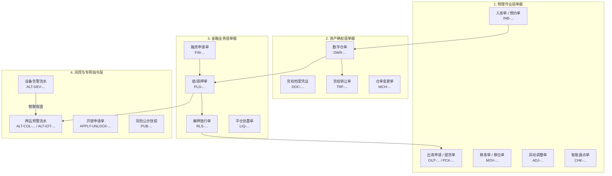

# 单据分层与编码规则

> **文档性质**：本文档定义 SYZC 系统各业务板块单据对象的**数据分层、编码规则、状态机模型与审计快照标准**。

---

## 1. 四层业务单据模型



| 层级 | 单据/对象名称 | 作用与核心机制 | 来源与联动去向 |
| :--- | :--- | :--- | :--- |
| **物理作业层** | 入库单、出库单、移库单、异动单、盘点单、提货单 | 记录物理收发存与现场交接事实。 | IoT 过磅/质检 $\rightarrow$ 入库单；出库审批 $\rightarrow$ 提货码核销。 |
| **资产确权层** | 数字仓单、货权档案、仓单变更单、存货转让单 | 承载法律认可的数字化资产凭证与证据链。 | 入库事实 $\rightarrow$ 仓单开立；转让单 $\rightarrow$ 变更货主。 |
| **金融业务层** | 融资申请单、融资方案、抵/质押单、解押放行单 | 管理授信、押品锁定、质押占用及担保释放。 | C端提交 $\rightarrow$ 锁仓；授信录入 $\rightarrow$ 质押单；解押审批 $\rightarrow$ 放行。 |
| **风控与专网指令层** | 预警等级字典、设备/押品预警流水、开锁申请单、风险公示快照 | 承载实时监控、物联穿透、专网审批放行与司法存证。 | 规则匹配 $\rightarrow$ 预警流水；门禁取密 $\rightarrow$ 开锁申请；有效告警 $\rightarrow$ 公示快照。 |

---

## 2. 统一单据编码规范

### 2.1 编码结构

系统采用全域统一的单据业务主键编码规则：

$$\text{【业务前缀】-【YYYYMMDD】-【机构/仓库代码】-【6位全局流水号】-【校验位】}$$

```text
示例 1（质押单）： PLG-20260818-W001-000342-K8
示例 2（开锁申请）：APPLY-UNLOCK-20260818-CK02-000109-M3
示例 3（穿透预警）：ALT-IOT-20260818-W001-001205-X1
```

### 2.2 核心单据业务前缀字典

| 业务前缀 | 对应业务单据/对象 | 业务前缀 | 对应业务单据/对象 |
| :--- | :--- | :--- | :--- |
| `INB` | 货物入库单 / 预约单 | `OUT` | 货物出库申请单 |
| `PCK` | 提货单（提货码核销单） | `MOV` | 仓内移库单 |
| `ADJ` | 差异异动调整单 | `CHK` | 智能盘点单 |
| `DWR` | 数字仓单 | `TRF` | 存货/仓单转让单 |
| `FIN` | 融资申请单 | `PLG` | 抵/质押单 |
| `RLS` | 解押放行单 | `LIQ` | 平仓处置单 |
| `APPLY-UNLOCK` | 门禁开锁申请单（专网专道） | `ALT-DEV` | 设备预警信息流水 |
| `ALT-COL` | 押品商业预警流水 | `ALT-IOT` | 押品物联穿透预警流水 |
| `PUB` | 风险公示快照单 | `TSK-RISK` | 智风控异步调度任务号 |

---

## 3. 状态机模型与生命周期规范

### 3.1 通用审批单据状态机
- `DRAFT`（草稿） $\rightarrow$ `PENDING`（待审批） $\rightarrow$ `IN_REVIEW`（审批中） $\rightarrow$ `APPROVED`（已通过） / `REJECTED`（已驳回） / `WITHDRAWN`（已撤回） $\rightarrow$ `EXECUTING`（执行中） $\rightarrow$ `COMPLETED`（已完成） / `CLOSED`（已关闭）。

### 3.2 专网开锁申请单状态机（`APPLY-UNLOCK`）
- `PENDING`（待审核） $\rightarrow$ `APPROVED`（已通过，生成临时密码） / `REJECTED`（已驳回） / `WITHDRAWN`（已撤回） / `EXPIRED`（已过期，超时失效） / `VOIDED`（已作废）。

### 3.3 预警流水状态机（`ALT-DEV` / `ALT-COL`）
- `PENDING_VALID`（未处理有效） $\rightarrow$ `PROCESSED`（已处理有效，现场解除或业务解除）
- 规则软删除/失效应变：`PENDING_VALID` $\rightarrow$ `PENDING_INVALID`（未处理无效）
- 历史流水与公示：已处理记录、历史版本与已生成快照**永久只读保留，不物理删除**。

---

## 4. 全生命周期审计与不可变存证规则

1. **不可篡改性**：所有生效单据（仓单、质押单、放行单、已处理预警、公示快照）严禁物理删除（`DELETE`），仅支持通过反向红冲单、调整单或状态流转标记。
2. **审计日志九要素**：每笔单据状态迁移必须强制记录：
   - ① 单据业务编号（`biz_no`）；
   - ② 租户与机构代码（`tenant_id` / `org_id`）；
   - ③ 操作人 ID 与姓名（`operator_id` / `operator_name`）；
   - ④ 客户端 IP 与终端类型（`client_ip` / `user_agent`）；
   - ⑤ 精确时间戳（`timestamp`，毫秒级）；
   - ⑥ 请求幂等键（`request_id`）；
   - ⑦ 变更前数据快照 JSON（`before_data`）；
   - ⑧ 变更后数据快照 JSON（`after_data`）；
   - ⑨ 全局分布式链路追踪号（`trace_id`）。
