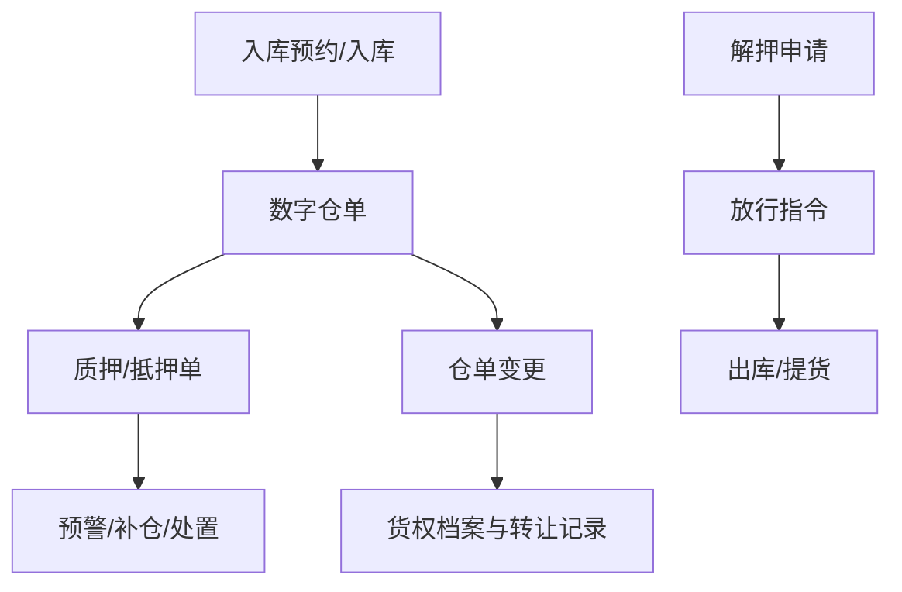

# 单据分层与编码规则

> 本文只规定 `04` 功能清单和 `06` 核心流程所涉及单据的建模规则，不新增业务流程。

## 1. 四层单据

| 层级 | 单据/对象 | 作用 | 主要来源或去向 |
| :--- | :--- | :--- | :--- |
| 物理作业层 | 入库预约、入库、出库、移库、盘点、提货单 | 记录现场收发存事实 | 物联网、仓储作业、审批指令；抵/质押单出库按 `06` 规定审批 |
| 资产确权层 | 数字仓单、货权档案、仓单变更 | 组织资产和权属证据 | 物理入库、合同发票、转让/解押 |
| 金融业务层 | 融资意向、质押/抵押、解押、加补仓、平仓处置 | 记录融资和押品控制关系 | 申请、审批、风控和资金方指令 |
| 风控指令层 | 预警、放行指令、巡检任务 | 控制风险响应和现场释放 | 监控引擎、审批中心、人工处置 |

## 2. 关联规则



底层库存、仓单、质押占用、出库审批、解押/放行指令（如适用）必须保持可追溯关系。部分释放、补仓、转让和盘点差异均通过新版本或调整单记录，不直接覆盖历史事实。

## 3. 编码格式

```text
前缀-YYYYMMDD-机构或仓库代码-六位流水号-校验位
示例：PLG-20260729-W001-000123-X9
```

前缀必须由单据字典维护；流水号按单据类型、日期和机构/仓库维度生成。数据库唯一约束、分布式序列和 `request_id` 幂等键共同防止重复编号和重复创建。编码规则调整时必须保留历史兼容规则。

## 4. 状态与审计

业务单据至少支持草稿、待审批、审批中、已通过、已驳回、已撤回、执行中、已完成和异常挂起等通用状态；具体对象状态、终态和是否允许重新发起以 `06` 的业务流程为准。状态迁移必须校验前置状态、权限、数据版本、有效期和关联单据。

所有关键单据至少记录：单据号、业务对象、机构/仓库、操作人、时间、请求幂等键、前后版本、审批意见、关联证据、结果码和 `trace_id`。生效单据禁止物理删除，只能通过撤销、冲正或补充记录修正。
