# 森云科技 - SYZC 供应链金融存货监管系统 核心业务场景和流程

---

> **文档定位**：本文件为 SYZC 系统当前已确认核心业务场景的流程规范。通过 Mermaid 流程图、关键业务规则矩阵及异常分支，阐明货物入库、仓单开立、抵/质押单开立、货物出库、存货转让、仓内移位、差异调整、盘点、提货移交、设备管理、融资管理和风险信息管理等业务流程。

---

## 1. 核心场景 1：货物入库

*业务目标：运营方权限人员为货主完成货物入库制单，经可配置审批人审批通过后，货物正式进入库存台账。入库完成是后续开立仓单、办理抵/质押业务的硬前置条件。*

### 1.1 端到端主流程与异常分支 (Flowchart)

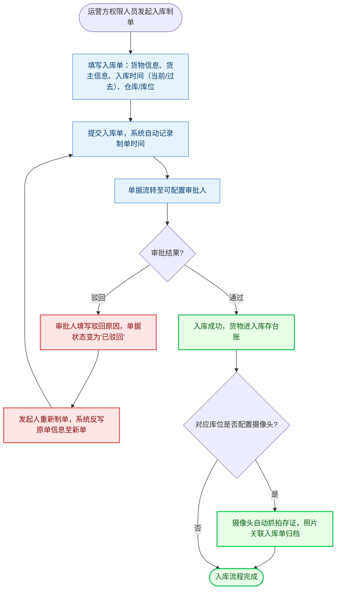
```mermaid
flowchart TD
    Start([运营方权限人员发起入库制单]) --> Step1[填写入库单：货物信息、货主信息、入库时间（当前/过去）、仓库/库位]
    Step1 --> Step2[提交入库单，系统自动记录制单时间]
    Step2 --> Step3[单据流转至可配置审批人]

    Step3 --> Check1{审批结果?}

    Check1 -- 驳回 --> Err1[审批人填写驳回原因，单据状态变为'已驳回']
    Err1 --> Err1_1[发起人重新制单，系统反写原单信息至新单]
    Err1_1 --> Step2

    Check1 -- 通过 --> Step4[入库成功，货物进入库存台账]
    Step4 --> Check2{对应库位是否配置摄像头?}
    Check2 -- 是 --> Step5[摄像头自动抓拍存证，照片关联入库单归档]
    Step5 --> End([入库流程完成])
    Check2 -- 否 --> End

    classDef errStyle fill:#ffe6e6,stroke:#ff4d4d,stroke-width:2px,color:#990000;
    classDef successStyle fill:#e6ffe6,stroke:#00cc44,stroke-width:2px,color:#006611;
    classDef processStyle fill:#e6f3ff,stroke:#3385ff,stroke-width:1px,color:#004080;
    class Err1,Err1_1 errStyle;
    class Step4,Step5,End successStyle;
    class Step1,Step2,Step3 processStyle;
```

### 1.2 关键业务规则矩阵

| 规则编号 | 规则名称 | 适用阶段 | 规则描述与触发条件 | 系统自动化响应 / 拦截动作 | 前置 / 后置影响 | 审计与防篡改要求 |
| :--- | :--- | :--- | :--- | :--- | :--- | :--- |
| **R-RKD-01** | **入库时间限制规则** | 制单录入 | 入库时间（业务时间）只允许选择当前或过去时间，不可选未来时间；制单时间由系统在提交时自动记录。 | 选择未来时间时系统阻断提交，提示时间不合规。 | 前置：无； 后置：单据提交成功。 | 制单时间由系统自动生成，不可人工修改；操作人与时间戳全程记录。 |
| **R-RKD-02** | **审批通过即入库** | 审批节点 | 系统无独立"确认入库"操作，可配置审批人审批通过后，货物即视为入库成功，库存台账同步更新。 | 审批通过后系统自动变更库存记录，无需额外确认动作。 | 前置：入库单提交； 后置：货物出现在库存台账中，可用于发起仓单开立。 | 审批动作记录操作人、审批时间与审批意见，不可篡改。 |
| **R-RKD-03** | **驳回后重新制单** | 驳回处理 | 入库单被驳回后，原单据状态流转为"已驳回"，发起人不可在原单上修改，须重新制一张新单。 | 系统支持将原单信息反写至新单，减少重复录入工作量。 | 前置：单据被驳回； 后置：新单进入审批流程。 | 记录驳回原因、驳回人与时间；新旧单据关联可追溯。 |
| **R-RKD-04** | **摄像头自动抓拍存证** | 入库成功后 | 入库审批通过后，系统检测对应仓库/库房/分区是否配置摄像头，有则自动触发抓拍。 | 摄像头抓拍自动触发，无需人工操作，照片与入库单关联归档。 | 前置：入库审批通过； 后置：现场照片与单据绑定存证。 | 抓拍照片附加时间戳与库位信息，归档后不可修改。 |

---

## 2. 核心场景 2：仓单开立

*业务目标：货物完成入库后，运营方权限人员可在独立入口为货主发起仓单开立申请。仓单为官方认证单据，不可拆分与合并，须经货主本人手机端人脸识别授权及可配置审批人审批通过后方可开立成功。仓单开立成功是后续办理抵/质押业务的硬前置条件。*

### 2.1 端到端主流程与异常分支 (Flowchart)

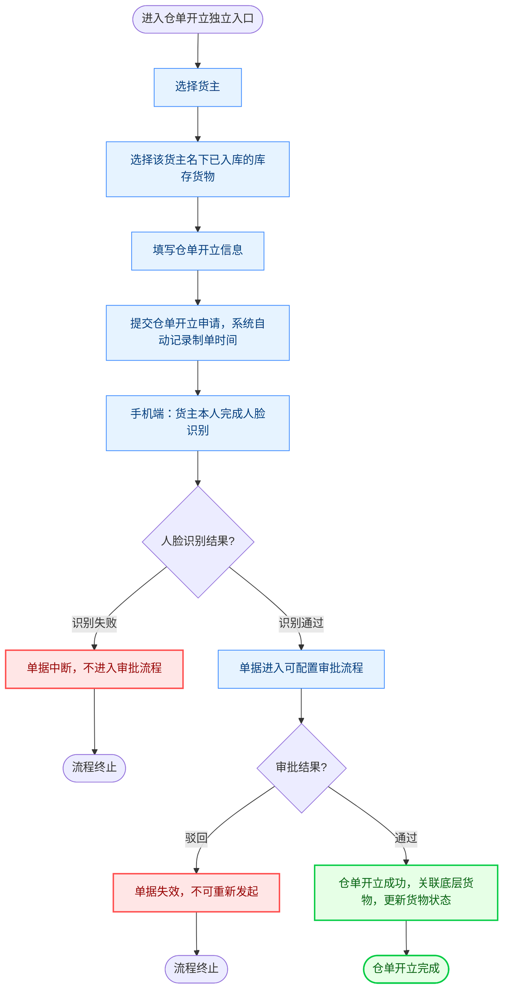
```mermaid
flowchart TD
    Start([进入仓单开立独立入口]) --> Step1[选择货主]
    Step1 --> Step2[选择该货主名下已入库的库存货物]
    Step2 --> Step3[填写仓单开立信息]
    Step3 --> Step4[提交仓单开立申请，系统自动记录制单时间]

    Step4 --> Step5[手机端：货主本人完成人脸识别]
    Step5 --> Check1{人脸识别结果?}

    Check1 -- 识别失败 --> Err1[单据中断，不进入审批流程]
    Err1 --> EndErr1([流程终止])

    Check1 -- 识别通过 --> Step6[单据进入可配置审批流程]
    Step6 --> Check2{审批结果?}

    Check2 -- 驳回 --> Err2[单据失效，不可重新发起]
    Err2 --> EndErr2([流程终止])

    Check2 -- 通过 --> Step7[仓单开立成功，关联底层货物，更新货物状态]
    Step7 --> End([仓单开立完成])

    classDef errStyle fill:#ffe6e6,stroke:#ff4d4d,stroke-width:2px,color:#990000;
    classDef successStyle fill:#e6ffe6,stroke:#00cc44,stroke-width:2px,color:#006611;
    classDef processStyle fill:#e6f3ff,stroke:#3385ff,stroke-width:1px,color:#004080;
    class Err1,Err2 errStyle;
    class Step7,End successStyle;
    class Step1,Step2,Step3,Step4,Step5,Step6 processStyle;
```

### 2.2 关键业务规则矩阵

| 规则编号 | 规则名称 | 适用阶段 | 规则描述与触发条件 | 系统自动化响应 / 拦截动作 | 前置 / 后置影响 | 审计与防篡改要求 |
| :--- | :--- | :--- | :--- | :--- | :--- | :--- |
| **R-DWR-01** | **入库前置强制校验** | 仓单开立发起 | 仓单开立所选货物必须已完成入库（入库单审批通过），不允许对未入库或入库审批中的货物发起仓单开立。 | 选择货物时，系统仅展示库存台账中已入库的可用货物供选择。 | 前置：货物已入库； 后置：提交仓单开立申请。 | 记录所选货物批次与对应入库单编号，确保溯源链完整。 |
| **R-DWR-02** | **货主人脸识别强制授权** | 提交后人脸环节 | 仓单开立申请提交后，必须由货主本人在手机端完成人脸识别，人脸通过后单据方可进入审批流程。 | 人脸识别失败则单据中断，不进入审批；由运营方协助发起，货主本人完成识别动作。 | 前置：申请已提交； 后置：单据进入审批流。 | 记录人脸识别时间、识别结果与操作设备信息。 |
| **R-DWR-03** | **仓单不可拆分与合并** | 仓单全生命周期 | 仓单为官方认证单据，一经开立不可拆分为多张，亦不可与其他仓单合并。 | 系统不提供拆分与合并功能入口。 | 前置：无； 后置：无。 | 仓单编号唯一，与底层货物对应，任何变更均生成审计快照。 |
| **R-DWR-04** | **驳回后不可重新发起** | 审批驳回 | 仓单开立申请被驳回后，该单据状态变为"已驳回失效"，不可在原单基础上重新发起。 | 系统屏蔽驳回单据的重新提交按钮；如需重新开立，须从独立入口全新发起新申请。 | 前置：审批驳回； 后置：单据归档，货物恢复可用状态。 | 记录驳回原因、驳回人与时间；驳回单据永久归档可查。 |

---

## 3. 核心场景 3：抵/质押单开立

*业务目标：支持 C 端外部货主自行发起、B 端运营方直接代发起，以及 B 端从融资申请关联发起抵/质押单。直接发起时提交即冻结所选押品；融资关联发起时继承融资申请已锁定押品并保持只读。抵押单与质押单仅名称不同，共用审批流程；审批通过后形成正式抵/质押占用。*

### 3.1 直接发起主流程与异常分支

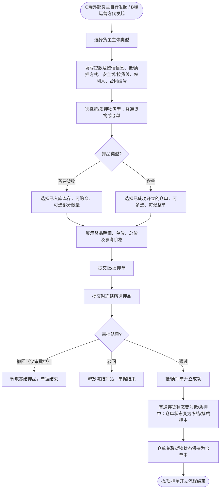
```mermaid
flowchart TD
    A([C端外部货主自行发起 / B端运营方代发起]) --> B[选择货主主体类型]
    B --> C[填写贷款及授信信息、抵/质押方式、安全线/控货线、权利人、合同编号]
    C --> D[选择抵/质押物类型：普通货物或仓单]
    D --> E1{押品类型?}
    E1 -- 普通货物 --> E2[选择已入库库存，可跨仓、可选部分数量]
    E1 -- 仓单 --> E3[选择已成功开立的仓单，可多选、每张整单]
    E2 --> F0[展示货品明细、单价、总价及参考价格]
    E3 --> F0
    F0 --> D1[提交抵/质押单]
    D1 --> D2[提交时冻结所选押品]
    D2 --> E{审批结果?}
    E -- 撤回（仅审批中） --> F[释放冻结押品，单据结束]
    E -- 驳回 --> G[释放冻结押品，单据结束]
    E -- 通过 --> H[抵/质押单开立成功]
    H --> I[普通存货状态变为抵/质押中；仓单状态变为冻结/抵质押中]
    I --> J[仓单关联货物状态保持为仓单中]
    J --> K([抵/质押单开立流程结束])
```

### 3.2 关键业务规则矩阵

| 规则编号 | 规则名称 | 适用阶段 | 规则描述与系统响应 | 前置 / 后置影响 | 审计要求 |
| :--- | :--- | :--- | :--- | :--- | :--- |
| **R-PL-01** | 双入口同规则 | 发起 | C 端外部货主自行发起，B 端运营方代货主发起；两端可选押品范围和业务规则相同。 | 按主体和入口控制数据权限。 | 记录发起入口、货主主体和代办人。 |
| **R-PL-02** | 押品类型互斥 | 押品选择 | 一张单只能选择普通货物或仓单，不能混合。 | 选择一种类型后锁定另一类型入口。 | 保存押品类型快照。 |
| **R-PL-03** | 普通货物选择 | 押品选择 | 普通货物必须已入库，可跨仓选择，并支持部分数量。 | 仅展示可用库存；数量不得超过可用量。 | 保存库存批次、数量、单价、总价。 |
| **R-PL-04** | 仓单选择 | 押品选择 | 仓单必须已成功开立，可多选、可跨仓，但每张仓单必须整单选择。 | 已冻结或已抵/质押仓单不可选。 | 保存仓单及关联货物快照。 |
| **R-PL-05** | 直接发起提交即冻结 | 提交 | C 端或 B 端直接发起时，提交审批即冻结所选押品；审批中不可重复使用。 | 驳回、撤回或开立失败时释放本次冻结。 | 记录冻结和释放的操作、时间及原因。 |
| **R-PL-06** | 审批状态控制 | 审批 | 审批角色和节点由系统自定义；仅审批中允许撤回，审批通过后不可撤回。 | 直接发起的单据驳回或撤回时释放押品；融资关联单据维持融资申请锁定并恢复待抵/质押办理。 | 保存审批意见、节点、人员和时间。 |
| **R-PL-07** | 融资关联发起 | 发起 | 资金方录入授信结果后，由 B 端运营人员从融资申请发起抵/质押单。 | 一笔融资申请只能关联一张有效抵/质押单。 | 保存融资申请、授信结果、发起人与抵/质押单关联。 |
| **R-PL-08** | 融资押品只读继承 | 发起 | 抵/质押物类型、明细、数量、货主、仓库、库位、批次和货品信息从融资申请锁定快照继承，禁止增加、删除、更换或修改数量。 | 仅允许填写抵/质押方式、安全线/控货线、权利人、合同编号等业务字段。 | 保存继承快照、锁定记录和数据版本。 |
| **R-PL-09** | 融资锁定转换 | 审批 | 融资关联发起不重复冻结押品；审批期间维持融资申请锁定，审批通过后转换为正式抵/质押占用。 | 创建失败、驳回或撤回时恢复待抵/质押办理并保留融资申请锁定，除非融资申请关闭。 | 记录锁定关系转换前后版本及失败原因。 |
| **R-PL-10** | 融资押品一致性校验 | 提交 | 提交时重新校验融资申请、授信结果、押品快照、锁定数量和数据版本。 | 任一项不一致时阻断创建，不允许通过编辑押品绕过。 | 记录冲突字段、当前值、快照值和处理结果。 |

### 3.3 单据字段与状态

抵/质押单至少包含：货主主体类型、贷款金额、贷款期数、授信金额、授信期数、抵/质押方式（固定/静态、浮动/流动）、本单货值安全线/控货线、抵/质押权人信息、合同编号（非必填）、抵/质押物类型、货品明细、单价、总价、参考价格、单据状态和发起人。开立阶段不录入货物评估价值。

| 状态 | 含义 | 可执行操作 | 后续状态 |
| :--- | :--- | :--- | :--- |
| 待开立 | 已选择货主主体、押品类型及押品，尚未提交 | 编辑、提交、放弃 | 开立中、已放弃 |
| 开立中 | 执行锁定和建单事务 | 查看、查询结果 | 已开立、开立失败 |
| 已开立 | 已生成业务单并完成押品状态变更 | 查看、发起独立的评估价值录入 | 本流程结束 |
| 开立失败 | 建单未完成或等待补偿 | 查看原因、查询补偿结果 | 待开立或关闭 |
| 已放弃 | 客户放弃办理 | 仅查看 | 终态 |

### 3.4 角色、权限与审计

| 角色 | 责任边界 | 核心权限 |
| :--- | :--- | :--- |
| 平台运营/抵质押业务人员 | 协助核对和处理异常 | 查看授权申请、代办、处理异常任务 |
| 风控/审计人员 | 监督风险和追溯 | 查看锁定、冲突、异常及审计快照，无权绕过校验 |

关键动作记录操作人、机构、时间戳、IP、设备、幂等键、前后状态、押品版本及补偿结果；人工解锁或补偿必须双人复核并留存原因。

### 3.5 独立流程：货物评估价值录入

抵/质押单成功开立后，B 端运营方可针对整张抵/质押单单独发起货物评估价值录入流程。该流程使用系统自定义审批流程，允许同一张抵/质押单重复发起，所有历史记录保留。

| 规则 | 处理方式 |
| :--- | :--- |
| 录入范围 | 以整张抵/质押单为单位录入，不按明细逐项录入。 |
| 生效规则 | 审批通过后成为最新生效的货物评估价值。 |
| 审批中 | 继续使用上一笔已生效评估价值计算抵押率。 |
| 无历史值 | 尚无已生效评估价值时，暂不计算抵押率。 |
| 抵押率 | `抵押率 =（贷款余额 ÷ 货物评估价值）× 100%`。 |
| 历史记录 | 保存每次录入值、发起人、审批记录、生效时间和历史版本。 |

### 3.6 融资申请关联发起流程

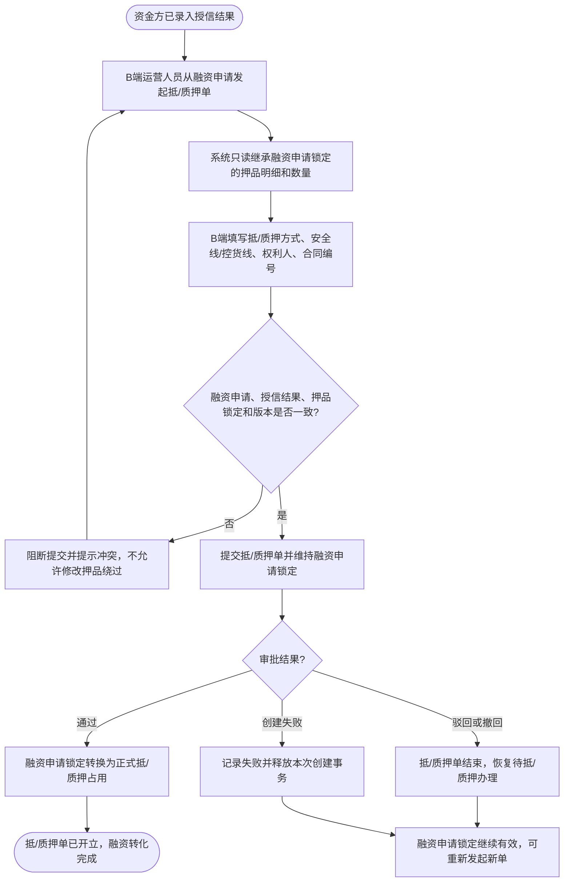
```mermaid
flowchart TD
    A([资金方已录入授信结果]) --> B[B端运营人员从融资申请发起抵/质押单]
    B --> C[系统只读继承融资申请锁定的押品明细和数量]
    C --> D[B端填写抵/质押方式、安全线/控货线、权利人、合同编号]
    D --> E{融资申请、授信结果、押品锁定和版本是否一致?}
    E -- 否 --> F[阻断提交并提示冲突，不允许修改押品绕过]
    F --> B
    E -- 是 --> G[提交抵/质押单并维持融资申请锁定]
    G --> H{审批结果?}
    H -- 通过 --> I[融资申请锁定转换为正式抵/质押占用]
    I --> J([抵/质押单已开立，融资转化完成])
    H -- 驳回或撤回 --> K[抵/质押单结束，恢复待抵/质押办理]
    K --> L[融资申请锁定继续有效，可重新发起新单]
    H -- 创建失败 --> M[记录失败并释放本次创建事务]
    M --> L
```

## 4. 核心场景 4：B 端货物出库流程

*业务目标：由 B 端运营方根据货物类型发起出库申请，经审批通过后扣减对应业务库存，并生成独立的提货单。普通货物、仓单货物和抵/质押单货物分别遵循不同的校验和状态处理规则。*

### 4.1 普通货物出库

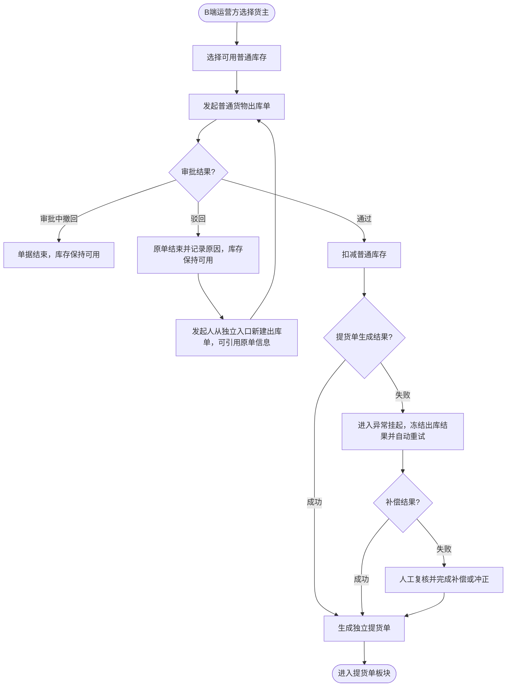
```mermaid
flowchart TD
    A([B端运营方选择货主]) --> B[选择可用普通库存]
    B --> C[发起普通货物出库单]
    C --> D{审批结果?}
    D -- 审批中撤回 --> E[单据结束，库存保持可用]
    D -- 驳回 --> F[原单结束并记录原因，库存保持可用]
    F --> F1[发起人从独立入口新建出库单，可引用原单信息]
    F1 --> C
    D -- 通过 --> G[扣减普通库存]
    G --> H{提货单生成结果?}
    H -- 成功 --> H1[生成独立提货单]
    H -- 失败 --> H2[进入异常挂起，冻结出库结果并自动重试]
    H2 --> H3{补偿结果?}
    H3 -- 成功 --> H1
    H3 -- 失败 --> H4[人工复核并完成补偿或冲正]
    H4 --> H1
    H1 --> I([进入提货单板块])
```

### 4.2 仓单出库

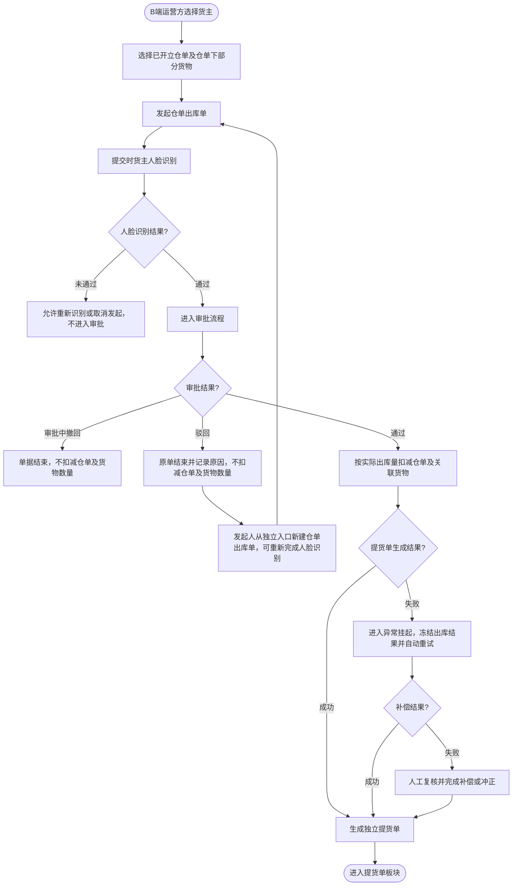
```mermaid
flowchart TD
    A([B端运营方选择货主]) --> B[选择已开立仓单及仓单下部分货物]
    B --> C[发起仓单出库单]
    C --> D[提交时货主人脸识别]
    D --> E{人脸识别结果?}
    E -- 未通过 --> F[允许重新识别或取消发起，不进入审批]
    E -- 通过 --> G[进入审批流程]
    G --> H{审批结果?}
    H -- 审批中撤回 --> I[单据结束，不扣减仓单及货物数量]
    H -- 驳回 --> J[原单结束并记录原因，不扣减仓单及货物数量]
    J --> J1[发起人从独立入口新建仓单出库单，可重新完成人脸识别]
    J1 --> C
    H -- 通过 --> K[按实际出库量扣减仓单及关联货物]
    K --> L{提货单生成结果?}
    L -- 成功 --> L1[生成独立提货单]
    L -- 失败 --> L2[进入异常挂起，冻结出库结果并自动重试]
    L2 --> L3{补偿结果?}
    L3 -- 成功 --> L1
    L3 -- 失败 --> L4[人工复核并完成补偿或冲正]
    L4 --> L1
    L1 --> M([进入提货单板块])
```

### 4.3 抵/质押单项下货物出库

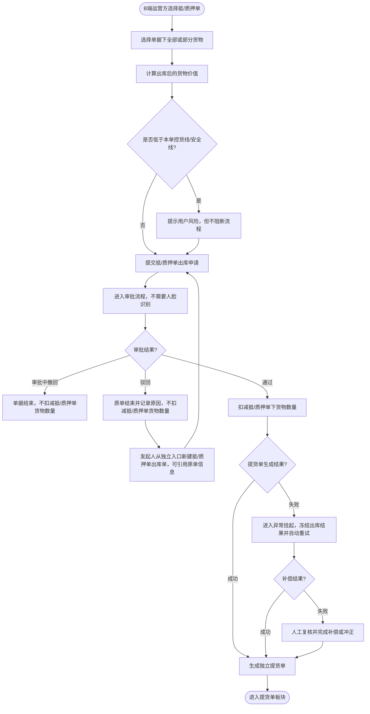
```mermaid
flowchart TD
    A([B端运营方选择抵/质押单]) --> B[选择单据下全部或部分货物]
    B --> C[计算出库后的货物价值]
    C --> D{是否低于本单控货线/安全线?}
    D -- 是 --> E[提示用户风险，但不阻断流程]
    D -- 否 --> F[提交抵/质押单出库申请]
    E --> F
    F --> G[进入审批流程，不需要人脸识别]
    G --> H{审批结果?}
    H -- 审批中撤回 --> I[单据结束，不扣减抵/质押单货物数量]
    H -- 驳回 --> J[原单结束并记录原因，不扣减抵/质押单货物数量]
    J --> J1[发起人从独立入口新建抵/质押单出库单，可引用原单信息]
    J1 --> F
    H -- 通过 --> K[扣减抵/质押单下货物数量]
    K --> L{提货单生成结果?}
    L -- 成功 --> L1[生成独立提货单]
    L -- 失败 --> L2[进入异常挂起，冻结出库结果并自动重试]
    L2 --> L3{补偿结果?}
    L3 -- 成功 --> L1
    L3 -- 失败 --> L4[人工复核并完成补偿或冲正]
    L4 --> L1
    L1 --> M([进入提货单板块])
```

### 4.4 出库规则矩阵

| 规则编号 | 规则名称 | 适用类型 | 规则描述 | 审批通过后置处理 |
| :--- | :--- | :--- | :--- | :--- |
| R-OUT-01 | B端代发起 | 三类出库 | 当前仅梳理 B 端，由运营方选择货主和押品/库存后发起。 | 按货物类型扣减对应数量。 |
| R-OUT-02 | 普通货物范围 | 普通货物 | 只能选择货主名下可用普通库存。 | 扣减普通库存。 |
| R-OUT-03 | 仓单部分出库 | 仓单 | 允许选择仓单下部分货物出库。 | 扣减仓单及关联货物数量。 |
| R-OUT-04 | 仓单人脸识别 | 仓单 | 提交仓单出库单时必须先完成人脸识别；未通过时可重新识别或取消，不进入审批。 | 通过后进入审批。 |
| R-OUT-05 | 抵/质押单出库 | 抵/质押单 | 不要求先解押；支持全部或部分货物出库。 | 扣减抵/质押单下货物数量。 |
| R-OUT-06 | 控货线/安全线提示 | 抵/质押单 | 计算出库后货物价值，低于本单控货线/安全线时提示用户，但不阻断。 | 仍可继续审批。 |
| R-OUT-07 | 撤回、驳回与重新发起 | 三类出库 | 审批中允许撤回；驳回后原单结束，发起人可从独立入口新建单据，原单不可直接修改或复用。 | 撤回或驳回均不扣减数量，新单与原单建立关联。 |
| R-OUT-08 | 提货单生成一致性 | 三类出库 | 审批通过后，数量扣减与提货单生成使用幂等键和版本校验；生成失败进入异常挂起并自动重试。 | 重试成功进入提货单板块；多次失败转人工补偿或冲正。 |
| R-OUT-09 | 异常挂起与补偿 | 三类出库 | 异常期间禁止重复扣减、重复生成提货单和继续核销；人工处理需双人复核。 | 补偿成功恢复可提货状态，冲正成功恢复库存/仓单/质押数量。 |

> 出库单、库存/仓单数量和提货单必须保留关联事务号、幂等键、前后版本和补偿结果；任何异常不得通过重复点击绕过校验。

## 5. 核心场景 5：存货转让

*业务目标：由 B 端运营方代货主发起存货货权转让，经审批通过后，将同一仓库内的部分或全部存货从原货主转移至目标货主。货主没有系统登录账号。*

### 5.1 端到端主流程与异常分支

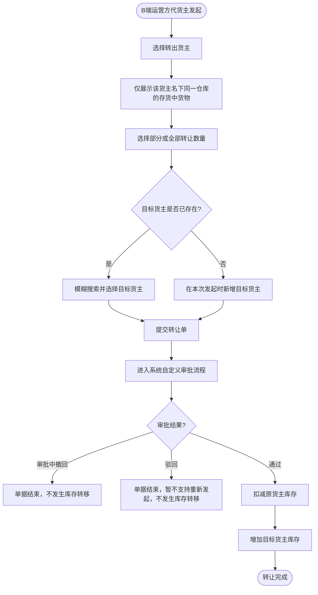
```mermaid
flowchart TD
    A([B端运营方代货主发起]) --> B[选择转出货主]
    B --> C[仅展示该货主名下同一仓库的存货中货物]
    C --> D[选择部分或全部转让数量]
    D --> E{目标货主是否已存在?}
    E -- 是 --> F[模糊搜索并选择目标货主]
    E -- 否 --> G[在本次发起时新增目标货主]
    F --> H[提交转让单]
    G --> H
    H --> I[进入系统自定义审批流程]
    I --> J{审批结果?}
    J -- 审批中撤回 --> K[单据结束，不发生库存转移]
    J -- 驳回 --> L[单据结束，暂不支持重新发起，不发生库存转移]
    J -- 通过 --> M[扣减原货主库存]
    M --> N[增加目标货主库存]
    N --> O([转让完成])
```

### 5.2 关键业务规则矩阵

| 规则编号 | 规则名称 | 规则描述 | 审批通过后置处理 |
| :--- | :--- | :--- | :--- |
| R-TRF-01 | B端代发起 | 由 B 端运营方代货主发起，货主不登录系统。 | 记录代办人和转出货主。 |
| R-TRF-02 | 存货范围 | 仅展示状态为“存货中”的货物，不展示仓单或抵/质押单下货物。 | 转移存货货权。 |
| R-TRF-03 | 同仓限制 | 转让只能选择同一个仓库内的货物，不支持跨仓转让。 | 原货主和目标货主库存均归属同一仓库。 |
| R-TRF-04 | 部分转让 | 支持选择部分数量转让。 | 按实际审批通过的数量扣减和增加库存。 |
| R-TRF-05 | 目标货主 | 目标货主可以选择已有货主，也可以在发起时新增。新增货主在单据撤回或驳回后仍保留，可供后续模糊搜索。 | 审批通过后增加目标货主“存货中”库存。 |
| R-TRF-06 | 撤回与驳回 | 审批中允许撤回；审批驳回后暂不支持重新发起。 | 撤回或驳回不发生库存转移。 |

## 6. 核心场景 6：移库（仓内移位）

*业务目标：由 B 端运营方代货主在同一仓库内调整货物库位，仅改变存放位置，不改变货主，不进行跨仓运输。由于当前系统不具备运输途中的监控能力，跨仓调拨不纳入本流程。*

### 6.1 端到端主流程与异常分支

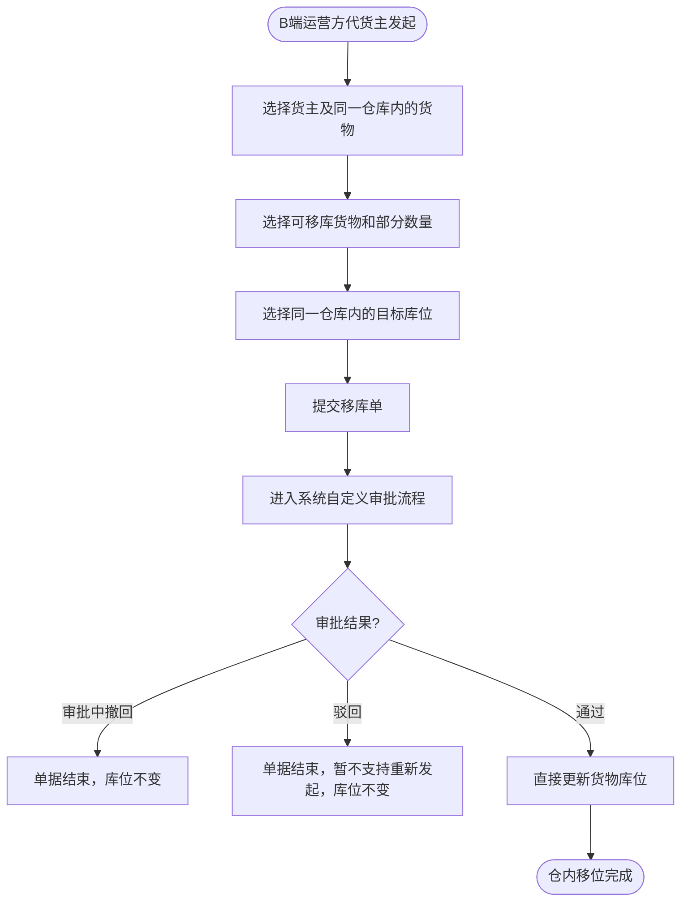
```mermaid
flowchart TD
    A([B端运营方代货主发起]) --> B[选择货主及同一仓库内的货物]
    B --> C[选择可移库货物和部分数量]
    C --> D[选择同一仓库内的目标库位]
    D --> E[提交移库单]
    E --> F[进入系统自定义审批流程]
    F --> G{审批结果?}
    G -- 审批中撤回 --> H[单据结束，库位不变]
    G -- 驳回 --> I[单据结束，暂不支持重新发起，库位不变]
    G -- 通过 --> J[直接更新货物库位]
    J --> K([仓内移位完成])
```

### 6.2 关键业务规则矩阵

| 规则编号 | 规则名称 | 规则描述 | 审批通过后置处理 |
| :--- | :--- | :--- | :--- |
| R-MOV-01 | 仓内移位 | 只能在同一货主、同一仓库内调整库位，不改变货主。 | 更新货物目标库位。 |
| R-MOV-02 | 跨仓禁止 | 不支持 A 仓到 B 仓的跨仓调拨，当前系统不覆盖运输途中的监控。 | 不产生跨仓库存流水。 |
| R-MOV-03 | 全状态可操作 | 普通存货、仓单货物、抵/质押货物等所有货品状态均可操作。 | 按原货物状态保留，仅变更库位。 |
| R-MOV-04 | 部分数量 | 支持对货物选择部分数量进行移位。 | 按实际数量更新库位。 |
| R-MOV-05 | 审批与撤回 | 移库需要审批，审批中允许撤回；审批驳回后暂不支持重新发起。 | 撤回或驳回时库位保持不变。 |

## 7. 核心场景 7：异动（差异调整单）

*业务目标：由 B 端运营方代货主对存在数量差异的普通存货或抵/质押单下货物发起差异调整，经审批通过后更新实际库存数量；抵/质押单下货物同步更新对应单据数量。*

### 7.1 端到端主流程与异常分支

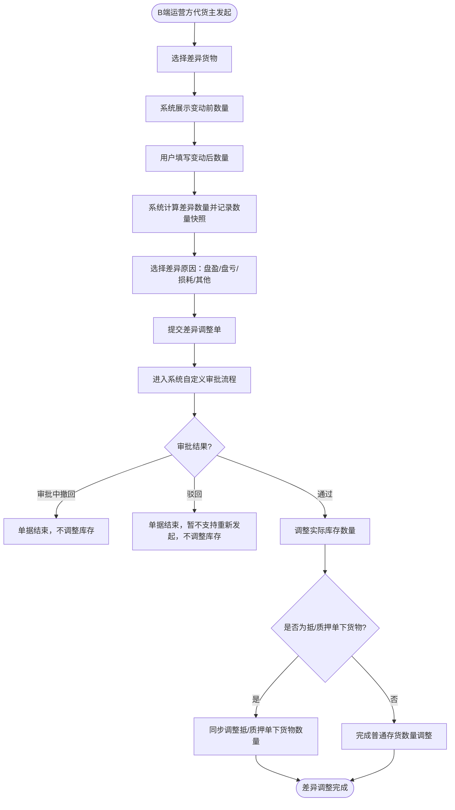
```mermaid
flowchart TD
    A([B端运营方代货主发起]) --> B[选择差异货物]
    B --> C[系统展示变动前数量]
    C --> D[用户填写变动后数量]
    D --> E[系统计算差异数量并记录数量快照]
    E --> F[选择差异原因：盘盈/盘亏/损耗/其他]
    F --> G[提交差异调整单]
    G --> H[进入系统自定义审批流程]
    H --> I{审批结果?}
    I -- 审批中撤回 --> J[单据结束，不调整库存]
    I -- 驳回 --> K[单据结束，暂不支持重新发起，不调整库存]
    I -- 通过 --> L[调整实际库存数量]
    L --> M{是否为抵/质押单下货物?}
    M -- 是 --> N[同步调整抵/质押单下货物数量]
    M -- 否 --> O[完成普通存货数量调整]
    N --> P([差异调整完成])
    O --> P
```

### 7.2 关键业务规则矩阵

| 规则编号 | 规则名称 | 规则描述 | 审批通过后置处理 |
| :--- | :--- | :--- | :--- |
| R-ADJ-01 | B端代发起 | 由 B 端运营方代货主发起，货主不登录系统。 | 记录代办人和货主主体。 |
| R-ADJ-02 | 异动对象 | 支持普通存货和抵/质押单下货物，不支持仓单货物。 | 按对象更新对应数量。 |
| R-ADJ-03 | 数量录入方式 | 系统展示变动前数量，用户填写变动后数量；系统计算差异数量。 | 更新库存至变动后数量。 |
| R-ADJ-04 | 原因字段 | 原因枚举为盘盈、盘亏、损耗、其他，仅用于记录和筛选，与数量没有关联关系。 | 不根据原因自动推导数量。 |
| R-ADJ-05 | 抵/质押单同步 | 抵/质押单下货物发生差异调整时，审批通过后同步调整抵/质押单下货物数量。 | 保持库存与抵/质押单数量一致。 |
| R-ADJ-06 | 审批与撤回 | 需要审批，审批中允许撤回；审批驳回后暂不支持重新发起。 | 撤回或驳回不调整任何数量。 |
| R-ADJ-07 | 数量留痕 | 单据保留变动前数量、变动后数量和系统计算的差异数量。 | 审计可追溯数量变化。 |

## 8. 核心场景 8：盘点

*业务目标：由 B 端运营方发起内部盘点，记录仓库货物的账面数量、实际盘点数量及差异数量，用于日常管理和库存核查。盘点结果只作为记录，不直接改变业务数据。*

### 8.1 盘点方式与流程

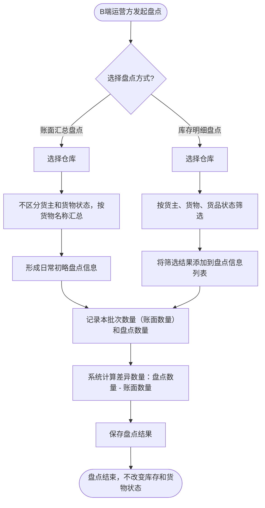
```mermaid
flowchart TD
    A([B端运营方发起盘点]) --> B{选择盘点方式?}
    B -- 账面汇总盘点 --> C[选择仓库]
    C --> D[不区分货主和货物状态，按货物名称汇总]
    D --> E[形成日常初略盘点信息]
    B -- 库存明细盘点 --> F[选择仓库]
    F --> G[按货主、货物、货品状态筛选]
    G --> H[将筛选结果添加到盘点信息列表]
    E --> I[记录本批次数量（账面数量）和盘点数量]
    H --> I
    I --> J[系统计算差异数量：盘点数量 - 账面数量]
    J --> K[保存盘点结果]
    K --> L([盘点结束，不改变库存和货物状态])
```

### 8.2 关键业务规则矩阵

| 规则编号 | 规则名称 | 规则描述 | 系统处理 |
| :--- | :--- | :--- | :--- |
| R-CHK-01 | B端内部发起 | 盘点由 B 端运营方发起，用于内部管理，不涉及 C 端。 | 记录发起人和盘点时间。 |
| R-CHK-02 | 账面汇总盘点 | 选定仓库后，不区分仓内货主和货物状态，按货物名称汇总，用于每日工作的初略盘点。 | 形成汇总盘点信息。 |
| R-CHK-03 | 库存明细盘点 | 选定仓库后，可按货主、货物、货品状态筛选并加入盘点信息列表。 | 形成明细盘点信息。 |
| R-CHK-04 | 数量记录 | 记录本批次数量（账面数量）和盘点数量。 | 自动计算差异数量。 |
| R-CHK-05 | 差异计算 | 差异数量 = 盘点数量 - 账面数量。 | 展示并保存计算结果。 |
| R-CHK-06 | 结果留痕 | 盘点结果只作为内部管理记录保存。 | 不改变库存数量和货物状态。 |
| R-CHK-07 | 无审批无联动 | 盘点不需要审批，不关联异动/差异调整单。 | 盘点结束后不触发其他业务流程。 |

## 9. 核心场景 9：提货单与货物移交

*业务目标：出库单审批通过后，系统自动生成提货单。有权限人员通过短信提货码或线上人工校验确认提货人身份，上传现场移交凭证后一次性完成整单货物移交。提货单不支持分批提货；取消提货时，通过重新入库流程恢复库存。*

### 9.1 端到端主流程与异常分支

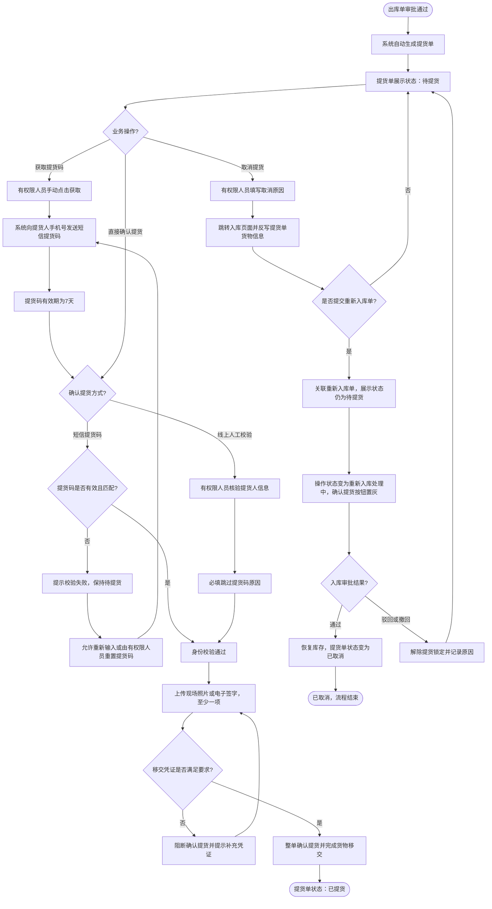
```mermaid
flowchart TD
    A([出库单审批通过]) --> B[系统自动生成提货单]
    B --> C[提货单展示状态：待提货]
    C --> D{业务操作?}

    D -- 获取提货码 --> E[有权限人员手动点击获取]
    E --> F[系统向提货人手机号发送短信提货码]
    F --> G[提货码有效期为7天]
    G --> H{确认提货方式?}

    D -- 直接确认提货 --> H
    H -- 短信提货码 --> I{提货码是否有效且匹配?}
    I -- 否 --> J[提示校验失败，保持待提货]
    J --> K[允许重新输入或由有权限人员重置提货码]
    K --> F
    I -- 是 --> L[身份校验通过]
    H -- 线上人工校验 --> M[有权限人员核验提货人信息]
    M --> N[必填跳过提货码原因]
    N --> L

    L --> O[上传现场照片或电子签字，至少一项]
    O --> P{移交凭证是否满足要求?}
    P -- 否 --> Q[阻断确认提货并提示补充凭证]
    Q --> O
    P -- 是 --> R[整单确认提货并完成货物移交]
    R --> S([提货单状态：已提货])

    D -- 取消提货 --> T[有权限人员填写取消原因]
    T --> U[跳转入库页面并反写提货单货物信息]
    U --> V{是否提交重新入库单?}
    V -- 否 --> C
    V -- 是 --> W[关联重新入库单，展示状态仍为待提货]
    W --> X[操作状态变为重新入库处理中，确认提货按钮置灰]
    X --> Y{入库审批结果?}
    Y -- 通过 --> Z[恢复库存，提货单状态变为已取消]
    Z --> Z1([已取消，流程结束])
    Y -- 驳回或撤回 --> Z2[解除提货锁定并记录原因]
    Z2 --> C
```

### 9.2 提货单状态与操作控制

| 展示状态 | 内部操作状态 | 含义 | 可执行操作 | 后续状态 |
| :--- | :--- | :--- | :--- | :--- |
| 待提货 | 可提货 | 提货单已生成，尚未完成提货或提交重新入库单 | 获取/重置提货码、确认提货、取消提货 | 已提货、重新入库处理中 |
| 待提货 | 重新入库处理中 | 已提交关联入库单，入库流程尚未结束 | 查看提货单、查看关联入库单 | 已取消、可提货 |
| 已取消 | 已重新入库 | 关联入库单审批通过，库存已经恢复，提货单取消生效 | 仅查看 | 终态 |
| 已提货 | 已完成 | 已完成身份校验、凭证上传和整单移交 | 仅查看 | 终态 |

> 页面展示状态与内部操作状态必须分别保存。确认提货按钮由内部操作状态控制，不得仅根据页面展示的“待提货”判断是否可操作。

### 9.3 关键业务规则矩阵

| 规则编号 | 规则名称 | 规则描述与触发条件 | 系统响应与后置影响 | 审计要求 |
| :--- | :--- | :--- | :--- | :--- |
| R-PICK-01 | 自动生成提货单 | 出库单审批通过后，系统自动生成对应提货单，提货人姓名、身份证号和手机号来源于出库申请。 | 生成成功后进入待提货；生成失败按场景四的异常挂起与补偿规则处理。 | 记录关联出库单、提货人信息快照、生成时间和事务号。 |
| R-PICK-02 | 提货人信息校验 | 出库申请填写提货人姓名、身份证号和手机号，仅校验必填及格式。 | 校验不通过时阻断出库申请提交。 | 保存提交时的提货人信息快照。 |
| R-PICK-03 | 提货码手动获取 | 提货单生成后不自动发送提货码，由有权限人员在后台手动点击获取。 | 系统向提货人手机号发送短信提货码。 | 记录获取人、发送时间、手机号脱敏值和发送结果。 |
| R-PICK-04 | 提货码有效期与重置 | 提货码有效期为7天；过期后不能使用，只能重置。重置后原提货码立即失效，新码重新计算7天。 | 同一提货单同一时刻仅允许一个有效提货码。 | 记录提货码版本、有效期、重置人和重置时间，不保存明文提货码。 |
| R-PICK-05 | 双确认方式 | 确认提货支持短信提货码和线上人工校验两种方式。人工校验必须由有权限人员执行并填写跳过提货码原因。 | 任一方式校验通过后进入移交凭证上传。 | 记录确认方式、操作人、校验结果及人工校验原因。 |
| R-PICK-06 | 校验失败处理 | 提货码错误、过期或失效时不锁定提货单，也不自动通知运营人员。 | 保持待提货，可重新输入或由有权限人员重置提货码。 | 记录失败时间、失败原因和来源终端。 |
| R-PICK-07 | 整单提货 | 一张提货单不允许分批提货，必须一次性确认全部货物移交。 | 确认成功后整单变为已提货，禁止再次确认或取消。 | 保存提货货物、数量及确认前后状态快照。 |
| R-PICK-08 | 移交凭证必填 | 确认提货前由用户自行上传现场照片或电子签字，两者至少上传一项。 | 未上传有效凭证时阻断确认提货。 | 保存附件类型、上传人、上传时间、文件摘要和关联提货单。 |
| R-PICK-09 | 取消提货 | 仅待提货且内部操作状态为可提货时允许取消，取消原因必填。 | 跳转入库页面，并反写提货单货物信息。 | 记录取消操作人、取消原因、时间和原货物快照。 |
| R-PICK-10 | 重新入库锁定 | 用户提交重新入库单后，提货单展示状态仍为待提货，内部操作状态变为重新入库处理中。 | 立即将确认提货按钮置灰，禁止提货与重新入库并发执行。 | 保存关联入库单号、锁定时间、操作人和数据版本。 |
| R-PICK-11 | 重新入库结果 | 重新入库必须执行完整入库审批。审批通过后恢复库存，提货单状态变为已取消；驳回或撤回时解除锁定，恢复待提货和可提货状态。 | 通过后进入已取消终态；驳回或撤回后恢复可提货。 | 记录审批结果、库存恢复流水、解锁原因和前后版本。 |

### 9.4 角色、权限与审计

| 角色/权限主体 | 责任边界 | 核心权限 |
| :--- | :--- | :--- |
| 提货操作人员 | 核验提货人、确认现场移交 | 在授权仓库范围内获取/重置提货码、人工校验、确认提货、取消提货 |
| 仓储/运营人员 | 处理取消提货和重新入库 | 查看提货单、发起关联入库、跟踪入库审批结果 |
| 风控/审计人员 | 监督异常操作和证据完整性 | 只读查看提货码操作、人工校验原因、移交凭证、取消原因和库存恢复流水 |

提货操作权限由系统配置，不固定绑定某一角色。数据权限同时受机构和仓库范围约束。获取/重置提货码、人工校验、确认提货、取消提货、提交重新入库和解除锁定均须记录操作人、机构、时间戳、IP、来源终端、关联单号、幂等键、前后状态和数据版本。

## 10. 核心场景 10：设备管理

*业务目标：SYZC 接收第三方设备平台实时推送的设备基础信息、在线状态、采集数据和设备事件，并在监控设备、门禁设备、物联设备、GPS 设备四个独立菜单中完成查看、本地信息维护和位置绑定。第三方平台是设备事实来源，SYZC 负责业务映射、展示、权限控制、风险联动和全路径审计。*

### 10.1 设备同步、绑定与移除主流程

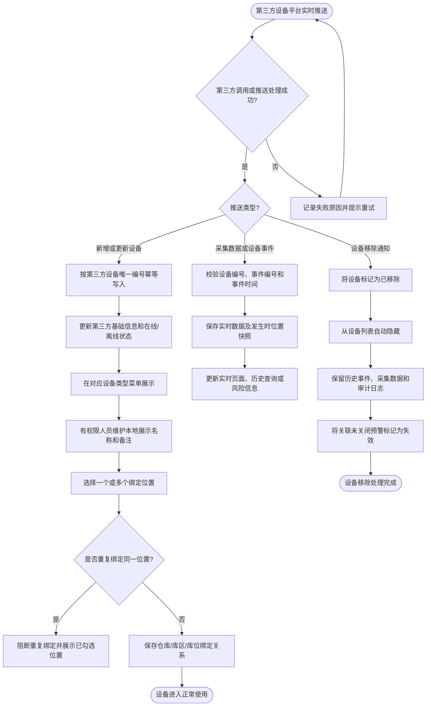
```mermaid
flowchart TD
    A([第三方设备平台实时推送]) --> T{第三方调用或推送处理成功?}
    T -- 是 --> B{推送类型?}
    T -- 否 --> U[记录失败原因并提示重试]
    U --> A
    B -- 新增或更新设备 --> C[按第三方设备唯一编号幂等写入]
    C --> D[更新第三方基础信息和在线/离线状态]
    D --> E[在对应设备类型菜单展示]
    E --> F[有权限人员维护本地展示名称和备注]
    F --> G[选择一个或多个绑定位置]
    G --> H{是否重复绑定同一位置?}
    H -- 是 --> I[阻断重复绑定并展示已勾选位置]
    H -- 否 --> J[保存仓库/库区/库位绑定关系]
    J --> K([设备进入正常使用])

    B -- 采集数据或设备事件 --> L[校验设备编号、事件编号和事件时间]
    L --> M[保存实时数据及发生时位置快照]
    M --> N[更新实时页面、历史查询或风险信息]

    B -- 设备移除通知 --> O[将设备标记为已移除]
    O --> P[从设备列表自动隐藏]
    P --> Q[保留历史事件、采集数据和审计日志]
    Q --> R[将关联未关闭预警标记为失效]
    R --> S([设备移除处理完成])
```

### 10.2 四类设备能力矩阵

| 独立菜单 | 设备范围 | 核心能力 | 配置边界 | 数据与事件来源 |
| :--- | :--- | :--- | :--- | :--- |
| 监控设备 | 视频监控设备 | 实时视频、录像回放、锚点区域绘制 | 锚点区域在 SYZC 页面绘制；人/车识别算法由第三方提供 | 视频、录像和闯入事件由第三方提供或实时推送 |
| 门禁设备 | 人脸门禁、挂锁门禁 | 临时密码、常规人脸授权、开门记录 | SYZC 发起密码或授权操作；第三方执行门禁控制 | 开门记录和操作结果由第三方实时推送 |
| 物联设备 | 温度、湿度、烟感、二氧化碳、氧气采集设备 | 实时数值、按时间范围查询历史数据 | 采集频率由第三方决定；预警阈值在 SYZC 风险配置中维护；历史数据不支持导出 | 原始采集数据由第三方实时推送，SYZC 判断是否超阈值 |
| GPS 设备 | 定位设备 | 实时位置、历史轨迹查询和回放、电子围栏、越界及路线偏离预警 | 电子围栏和规划路线由第三方配置 | 位置、轨迹、越界和路线偏离事件由第三方实时推送 |

### 10.3 监控锚点与预警流程

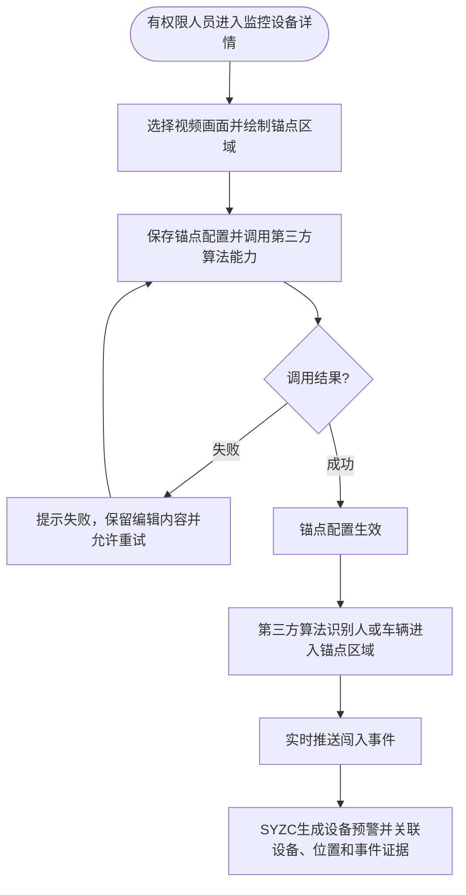
```mermaid
flowchart TD
    A([有权限人员进入监控设备详情]) --> B[选择视频画面并绘制锚点区域]
    B --> C[保存锚点配置并调用第三方算法能力]
    C --> D{调用结果?}
    D -- 失败 --> E[提示失败，保留编辑内容并允许重试]
    E --> C
    D -- 成功 --> F[锚点配置生效]
    F --> G[第三方算法识别人或车辆进入锚点区域]
    G --> H[实时推送闯入事件]
    H --> I[SYZC生成设备预警并关联设备、位置和事件证据]
```

### 10.4 门禁密码与人脸授权流程

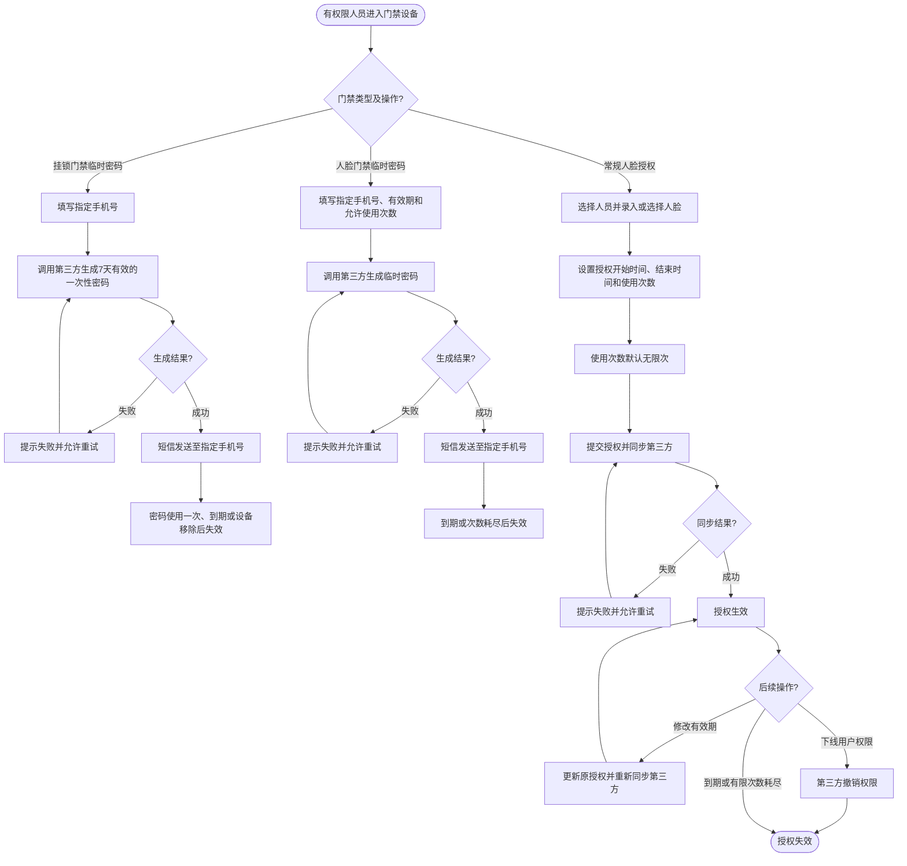
```mermaid
flowchart TD
    A([有权限人员进入门禁设备]) --> B{门禁类型及操作?}

    B -- 挂锁门禁临时密码 --> C[填写指定手机号]
    C --> D[调用第三方生成7天有效的一次性密码]
    D --> E{生成结果?}
    E -- 失败 --> F[提示失败并允许重试]
    F --> D
    E -- 成功 --> G[短信发送至指定手机号]
    G --> H[密码使用一次、到期或设备移除后失效]

    B -- 人脸门禁临时密码 --> I[填写指定手机号、有效期和允许使用次数]
    I --> J[调用第三方生成临时密码]
    J --> K{生成结果?}
    K -- 失败 --> L[提示失败并允许重试]
    L --> J
    K -- 成功 --> M[短信发送至指定手机号]
    M --> N[到期或次数耗尽后失效]

    B -- 常规人脸授权 --> O[选择人员并录入或选择人脸]
    O --> P[设置授权开始时间、结束时间和使用次数]
    P --> Q[使用次数默认无限次]
    Q --> R[提交授权并同步第三方]
    R --> S{同步结果?}
    S -- 失败 --> T[提示失败并允许重试]
    T --> R
    S -- 成功 --> U[授权生效]
    U --> V{后续操作?}
    V -- 修改有效期 --> W[更新原授权并重新同步第三方]
    W --> U
    V -- 下线用户权限 --> X[第三方撤销权限]
    X --> Y([授权失效])
    V -- 到期或有限次数耗尽 --> Y
```

> 门禁设备不支持远程开门。开门记录由第三方实时推送，至少包含开门时间、设备、开门方式和操作结果。

### 10.5 设备状态与数据规则

| 业务状态 | 列表展示 | 状态来源 | 可执行操作 | 后续状态 |
| :--- | :--- | :--- | :--- | :--- |
| 在线 | 展示 | 第三方实时推送 | 查看、维护本地信息、绑定/解绑、使用设备类型能力 | 离线、已移除 |
| 离线 | 展示 | 第三方实时推送 | 查看、维护本地信息、绑定/解绑 | 在线、已移除 |
| 已移除 | 不展示 | 第三方设备移除通知 | 仅通过历史事件、预警和审计记录追溯 | 终态 |

| 规则编号 | 规则名称 | 规则描述与触发条件 | 系统响应与后置影响 | 审计要求 |
| :--- | :--- | :--- | :--- | :--- |
| R-DEV-01 | 第三方事实来源 | 四类设备均由第三方平台同步，第三方设备编号、类型、原始名称和在线状态不得由 SYZC 人工覆盖。 | 按第三方设备唯一编号和事件编号幂等处理实时推送。 | 记录第三方消息编号、推送时间、处理结果和数据版本。 |
| R-DEV-02 | 本地信息维护 | 有设备管理权限的人员可修改本地展示名称和备注，不回写第三方。 | 页面同时展示第三方同步信息和 SYZC 本地信息。 | 保存操作人、前后数据和修改时间。 |
| R-DEV-03 | 多位置绑定 | 一台设备可绑定多个仓库、库区或库位；三种位置类型在绑定逻辑中并列。 | 使用目标类型和目标ID保存多条绑定关系。 | 保存绑定人、绑定时间、设备及位置快照。 |
| R-DEV-04 | 禁止重复绑定 | 同一设备不得重复绑定同一位置；复选框展示已绑定位置并保持勾选。 | 重复提交时由唯一约束和版本校验共同阻断。 | 记录冲突请求和处理结果。 |
| R-DEV-05 | 解绑留痕 | 业务页面不提供历史绑定记录。 | 解绑后删除当前有效关系；历史数据保留发生时位置快照。 | 审计日志必须保存解绑前后关系、操作人和时间。 |
| R-DEV-06 | 在线状态只读 | 在线、离线状态完全以第三方实时推送为准，SYZC 不允许人工修改。 | 更新设备列表和详情状态。 | 保存状态变更时间、来源消息和前后状态。 |
| R-DEV-07 | 离线预警 | 离线预警时长采用第三方全局配置，SYZC 当前不能查看或修改具体阈值。 | 仅接收第三方推送的离线预警结果并进入风险信息管理。 | 保存预警来源、设备、发生时间和第三方规则标识。 |
| R-DEV-08 | 设备移除 | 收到第三方设备移除通知后，设备不再展示在列表。 | 保留历史数据，将关联未关闭预警标记为失效。 | 记录移除消息、处理时间、失效预警和处理结果。 |
| R-DEV-09 | 历史数据查询 | 物联历史数据和 GPS 历史轨迹支持按时间范围查询；GPS 支持轨迹回放。 | 物联历史数据不支持导出。 | 记录敏感查询和轨迹查看行为。 |
| R-DEV-10 | 接口失败重试 | 第三方能力调用失败时，不伪造成功结果。 | 提示失败并允许有权限人员重试；重复调用使用请求幂等键。 | 保存请求参数摘要、结果码、重试次数和最终结果。 |

### 10.6 角色、权限与审计

| 角色/权限主体 | 责任边界 | 核心权限 |
| :--- | :--- | :--- |
| 设备管理人员 | 维护设备在 SYZC 的业务映射 | 查看设备、修改本地信息、绑定/解绑位置、绘制监控锚点 |
| 门禁授权人员 | 管理临时通行和人脸权限 | 获取临时密码、创建/修改人脸授权、下线用户权限、查看开门记录 |
| 仓储/运营人员 | 使用设备数据辅助现场管理 | 查看授权范围内实时视频、回放、物联数据、GPS 位置和轨迹 |
| 风控/审计人员 | 监督设备异常和敏感操作 | 查看设备事件、预警、授权记录、位置快照和审计日志，无权修改第三方事实数据 |

设备权限由菜单权限、操作权限以及机构/仓库数据权限共同控制。实时视频、录像回放、临时密码、人脸信息、开门记录和 GPS 轨迹属于敏感数据，查看和操作均须留痕。关键日志至少包含操作人、机构、时间戳、IP、来源终端、第三方设备编号、绑定位置、关联事件、请求幂等键、前后数据镜像和第三方返回结果。

### 10.7 待确认事项

| 编号 | 待确认事项 | 当前处理方式 | 影响范围 |
| :--- | :--- | :--- | :--- |
| T-DEV-01 | 历史采集数据、GPS 轨迹、开门记录和预警记录的保存期限 | 暂不写死保存时长，按现有存储策略保留 | 数据归档、查询性能、合规和存储成本 |

## 11. 核心场景 11：融资管理

*业务目标：C 端用户选择融资产品和拟抵/质押物提交融资申请，系统立即锁定押品；B 端完成受理、可选尽调和独家资金方分配，资金方接单、提交融资方案并录入授信结果后，由 B 端运营人员发起唯一抵/质押单。系统不替代资金方内部授信决策，仅记录业务过程与结果。*

### 11.1 端到端主流程与异常分支

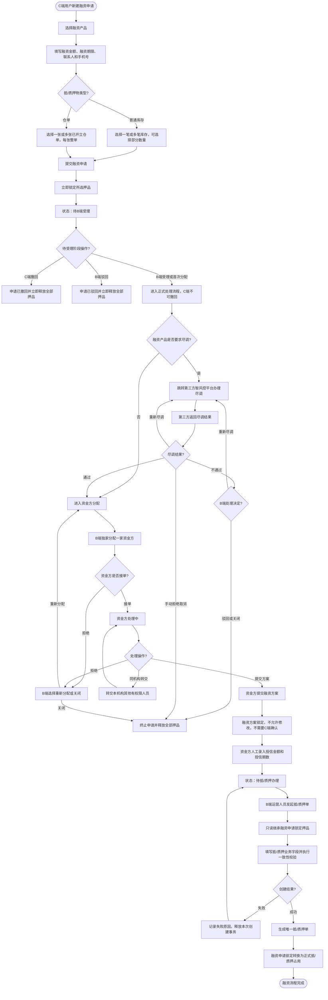
```mermaid
flowchart TD
    A([C端用户新建融资申请]) --> B[选择融资产品]
    B --> C[填写融资金额、融资期限、联系人和手机号]
    C --> D{抵/质押物类型?}
    D -- 普通库存 --> E[选择一笔或多笔库存，可选择部分数量]
    D -- 仓单 --> F[选择一张或多张已开立仓单，每张整单]
    E --> G[提交融资申请]
    F --> G
    G --> H[立即锁定所选押品]
    H --> I[状态：待B端受理]

    I --> J{待受理阶段操作?}
    J -- C端撤回 --> K[申请已撤回并立即释放全部押品]
    J -- B端驳回 --> L[申请已驳回并立即释放全部押品]
    J -- B端受理或首次分配 --> M[进入正式处理流程，C端不可撤回]

    M --> N{融资产品是否要求尽调?}
    N -- 否 --> U[进入资金方分配]
    N -- 是 --> O[跳转第三方智风控平台办理尽调]
    O --> P[第三方返回尽调结果]
    P --> Q{尽调结果?}
    Q -- 通过 --> U
    Q -- 重新尽调 --> O
    Q -- 不通过 --> R{B端处理决定?}
    R -- 重新尽调 --> O
    R -- 驳回或关闭 --> S[终止申请并释放全部押品]
    Q -- 手动拒绝取消 --> S

    U --> V[B端独家分配一家资金方]
    V --> W{资金方是否接单?}
    W -- 拒绝 --> X[B端选择重新分配或关闭]
    X -- 重新分配 --> U
    X -- 关闭 --> S
    W -- 接单 --> W1[资金方处理中]
    W1 --> W2{处理操作?}
    W2 -- 同机构转交 --> W3[转交本机构其他有权限人员]
    W3 --> W1
    W2 -- 拒绝 --> X
    W2 -- 提交方案 --> Y[资金方提交融资方案]
    Y --> Z[融资方案锁定，不允许修改，不需要C端确认]
    Z --> AA[资金方人工录入授信金额和授信期数]
    AA --> AB[状态：待抵/质押办理]

    AB --> AC[B端运营人员发起抵/质押单]
    AC --> AD[只读继承融资申请锁定押品]
    AD --> AE[填写抵/质押业务字段并执行一致性校验]
    AE --> AF{创建结果?}
    AF -- 失败 --> AG[记录失败原因，释放本次创建事务]
    AG --> AB
    AF -- 成功 --> AH[生成唯一抵/质押单]
    AH --> AI[融资申请锁定转换为正式抵/质押占用]
    AI --> AJ([融资流程完成])
```

### 11.2 融资申请、方案与授信字段

| 业务对象 | 核心字段 | 来源/维护方 | 主要校验 |
| :--- | :--- | :--- | :--- |
| 融资申请 | 融资产品、融资金额、融资期限、联系人、手机号、抵/质押物类型及明细 | C 端用户 | 必填、格式、产品有效、押品可用、普通库存与仓单不可混选 |
| 普通库存押品 | 货主、仓库、库位、批次、货品、可用数量、申请锁定数量 | 库存系统/C 端选择 | 可多选、支持部分数量、锁定数量不得超过可用数量 |
| 仓单押品 | 仓单编号、货主、仓库、关联货物和仓单状态 | 仓单系统/C 端选择 | 可多选、必须整张选择、已冻结或已抵/质押仓单不可选 |
| 融资方案 | 资金方、拟授信金额、授信期数、融资说明 | 资金方 | 必填并提交后锁定，不允许修改，不需要 C 端确认 |
| 授信结果 | 授信金额、授信期数 | 资金方人工录入 | 一笔融资只允许录入一次，不需要其他人员复核 |
| 抵/质押单业务字段 | 抵/质押方式、安全线、控货线、抵/质押权人、合同编号等 | B 端运营人员 | 押品字段只读，业务字段按抵/质押单规则校验 |

### 11.3 内部状态与对客状态

| 内部状态 | 含义 | 可执行操作 | 后续状态 |
| :--- | :--- | :--- | :--- |
| 草稿 | C 端尚未提交 | 编辑、提交、删除 | 待受理 |
| 待受理 | 已提交并锁定押品，B 端尚未受理或首次分配 | C 端撤回、B 端受理/分配/驳回 | 处理中、已撤回、已驳回 |
| 处理中 | B 端已受理，正在判断或分配后续任务 | 发起尽调、分配资金方、驳回/关闭 | 尽调中、待资金方接单、已驳回、已关闭 |
| 尽调中 | 已跳转第三方办理尽调 | 查看结果、重新尽调、按结果处理 | 待资金方接单、已驳回、已关闭 |
| 待资金方接单 | 已独家分配一家资金方 | 接单、拒绝 | 资金方处理中、待资金方接单、已关闭 |
| 资金方处理中 | 资金方已接单 | 提交融资方案、拒绝、同机构转交 | 待授信结果、待资金方接单、已关闭 |
| 待授信结果 | 融资方案已提交且不可修改 | 资金方录入授信金额和授信期数 | 待抵/质押办理 |
| 待抵/质押办理 | 授信结果已录入 | B 端发起抵/质押单、查询失败原因 | 抵/质押创建中、已关闭 |
| 抵/质押创建中 | 正在创建唯一抵/质押单 | 查询结果、系统重试 | 已完成、待抵/质押办理 |
| 已完成 | 已生成唯一抵/质押单并转换押品占用 | 查看关联单据 | 终态 |
| 已撤回 | C 端在待受理阶段撤回 | 查看、新建申请 | 终态 |
| 已驳回 | B 端驳回或按尽调结果终止 | 查看、新建申请 | 终态 |
| 已关闭 | B 端主动关闭或资金方拒绝后不再分配 | 查看、新建申请 | 终态 |

| 内部状态范围 | C 端展示状态 | C 端可见内容 |
| :--- | :--- | :--- |
| 草稿 | 待提交 | 申请内容和押品明细 |
| 待受理至资金方处理中 | 审核中 | 当前进度、资金方名称、更新时间和简化处理说明 |
| 待授信结果至抵/质押创建中 | 审核通过待办理 | 融资方案、授信结果和办理进度 |
| 已完成 | 已进入抵/质押办理 | 关联抵/质押单号和入口 |
| 已撤回 | 已撤回 | 撤回时间和申请信息 |
| 已驳回、已关闭 | 审核未通过 | 经合规处理后的原因和重新申请入口 |

### 11.4 关键业务规则矩阵

| 规则编号 | 规则名称 | 规则描述与触发条件 | 系统响应与后置影响 | 审计要求 |
| :--- | :--- | :--- | :--- | :--- |
| R-FIN-01 | 产品前置 | C 端必须选择有效融资产品后才能填写并提交融资申请。 | 保存融资产品快照，用于判断是否需要尽调。 | 记录产品编号、配置版本和提交时间。 |
| R-FIN-02 | 押品类型互斥 | 一笔融资申请只能选择普通库存或仓单，不能混选。 | 选择一种类型后锁定另一类型入口。 | 保存押品类型和选择快照。 |
| R-FIN-03 | 提交即锁定 | C 端提交融资申请时立即锁定全部所选押品。 | 锁定期间禁止重复融资、抵/质押、出库、转让或删除。 | 记录锁定人、时间、数量、版本和关联申请。 |
| R-FIN-04 | 撤回边界 | 仅待受理且 B 端尚未受理或首次分配时允许 C 端撤回。 | 撤回后立即释放全部押品并进入终态。 | 记录撤回人、时间、原因和释放流水。 |
| R-FIN-05 | 驳回后新建 | B 端仅支持直接驳回，不提供退回补件；驳回后原申请不得修改或重新提交。 | 立即释放押品，C 端必须新建申请，可关联原申请追溯。 | 保存驳回意见、新旧申请关联和押品释放结果。 |
| R-FIN-06 | 尽调路由 | 是否尽调由融资产品快照决定；SYZC 跳转第三方智风控平台，结果返回 SYZC。 | 支持通过、不通过、手动拒绝取消和重新尽调结果；不通过由 B 端决定驳回或重新尽调。 | 保存第三方任务号、结果、报告引用和处理决定。 |
| R-FIN-07 | 资金方独家分配 | 同一融资申请同一时间只能分配给一家资金方。 | 使用申请、有效分配状态和版本号阻止并发多分配。 | 记录分配、收回、重分配和处理人。 |
| R-FIN-08 | 拒绝后重分配 | 资金方拒绝后，B 端可重新分配其他资金方；重分配期间押品继续锁定。 | B 端关闭申请时才释放押品。 | 保存拒绝原因、历史资金方和重分配链路。 |
| R-FIN-09 | 同机构转交 | 资金方接单后可转交给本机构其他有权限人员，不改变独家资金方。 | 更新当前处理人，机构数据权限保持不变。 | 记录转交人、接收人、时间和原因。 |
| R-FIN-10 | 融资方案锁定 | 资金方提交拟授信金额、授信期数和融资说明后，方案不允许修改，也不需要 C 端确认。 | 提交后进入待授信结果。 | 保存方案快照、提交人和提交时间。 |
| R-FIN-11 | 单次授信结果 | 资金方人工录入授信金额和授信期数，一笔融资只允许录入一次且无需复核。 | 录入成功后进入待抵/质押办理。 | 记录录入人、时间、前后状态和数据版本。 |
| R-FIN-12 | 押品只读转化 | B 端发起抵/质押单时，必须原样继承融资申请锁定押品，不得增加、删除、更换或修改数量。 | 仅允许编辑抵/质押业务字段；冲突时阻断创建。 | 保存押品快照比对结果和冲突字段。 |
| R-FIN-13 | 一申请一单 | 一笔融资申请只能生成一张有效抵/质押单。 | 以融资申请编号、授信结果版本和幂等键控制唯一创建。 | 保存创建请求、关联单号和幂等结果。 |
| R-FIN-14 | 创建失败重试 | 抵/质押单创建失败时释放本次创建事务，但不释放融资申请押品锁定。 | 恢复待抵/质押办理，展示失败原因，允许 B 端幂等重试。 | 记录失败节点、补偿结果、重试次数和最终结果。 |
| R-FIN-15 | 占用转换 | 抵/质押单创建成功后，融资申请锁定转换为正式抵/质押占用。 | 同一事务内更新融资申请、押品和抵/质押单关联。 | 保存转换前后版本、事务号和结果。 |

### 11.5 角色、权限与审计

| 角色 | 责任边界 | 核心权限 |
| :--- | :--- | :--- |
| C 端融资用户 | 提交真实融资意向和拟押品 | 新建、编辑草稿、提交、待受理阶段撤回、查看进度和结果 |
| B 端平台运营 | 受理、分配和流程控制 | 受理、首次/重新分配、直接驳回、关闭、发起抵/质押单、处理创建异常 |
| 资金方人员 | 评估融资申请并形成业务结果 | 接单、拒绝、同机构转交、提交融资方案、录入一次授信结果 |
| 风控/审计人员 | 监督押品锁定、独家分配和结果真实性 | 查看尽调、分配、方案、授信、锁定转换和完整审计链，无权绕过业务校验 |

权限判定必须同时校验菜单权限、操作权限、机构范围、任务参与关系和当前状态。融资申请、押品锁定、尽调结果、资金方分配、融资方案、授信结果及抵/质押单之间必须建立可追溯关系。关键日志至少包含操作人、机构、时间戳、IP、来源终端、幂等键、前后状态、押品前后版本、第三方任务号和关联单号。

## 12. 核心场景 12：风险信息管理

*业务目标：通过独立的“风险管理配置”板块定义订单预警、设备预警和设备事务通知规则，再由独立的“风险信息”板块承接规则命中后的信息展示、人工处理、通知升级、贷中风控结果和风险公示。配置数据与风险信息记录相互关联但职责隔离，规则变更不得覆盖历史风险事实。*

### 12.1 板块隔离与总体流程

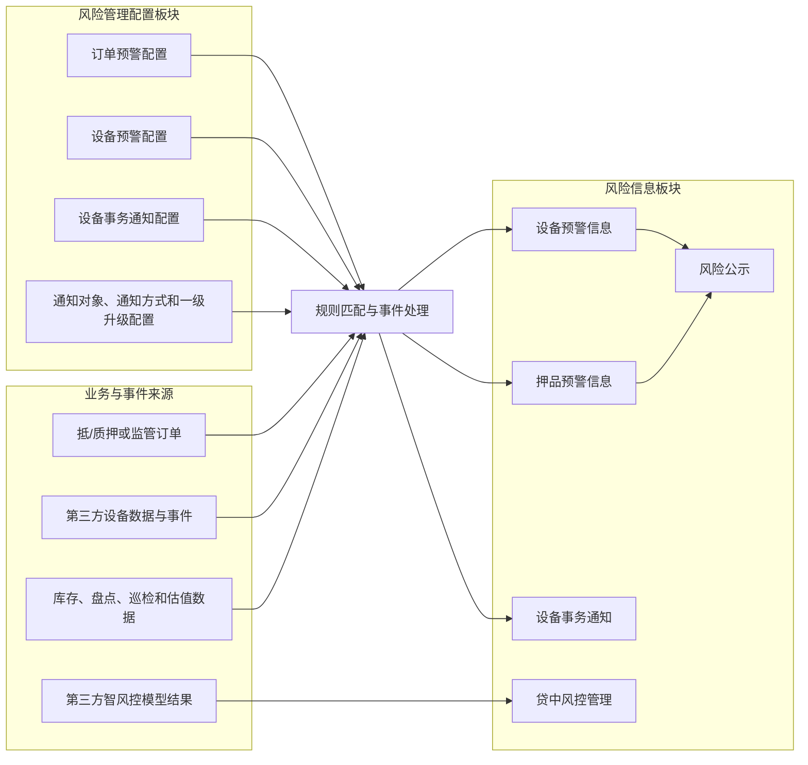
```mermaid
flowchart LR
    subgraph CFG[风险管理配置板块]
        C1[订单预警配置]
        C2[设备预警配置]
        C3[设备事务通知配置]
        C4[通知对象、通知方式和一级升级配置]
    end

    subgraph SRC[业务与事件来源]
        S1[抵/质押或监管订单]
        S2[第三方设备数据与事件]
        S3[库存、盘点、巡检和估值数据]
        S4[第三方智风控模型结果]
    end

    subgraph INFO[风险信息板块]
        I1[设备预警信息]
        I2[押品预警信息]
        I3[设备事务通知]
        I4[贷中风控管理]
        I5[风险公示]
    end

    C1 --> R[规则匹配与事件处理]
    C2 --> R
    C3 --> R
    C4 --> R
    S1 --> R
    S2 --> R
    S3 --> R
    S4 --> I4
    R --> I1
    R --> I2
    R --> I3
    I1 --> I5
    I2 --> I5
```

配置板块只负责规则创建、编辑、启停、设备/订单范围及通知策略；风险信息板块只负责查看、处理、失效、贷中结果展示和公示。风险处理人员不得在风险信息页面直接修改触发规则，配置人员也不得通过修改规则覆盖已生成记录。

### 12.2 风险管理配置板块

#### 12.2.1 订单预警配置

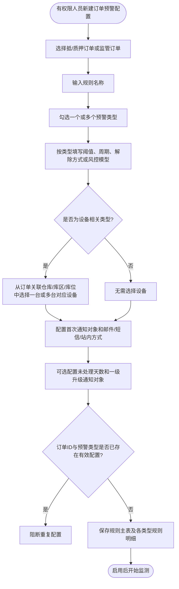
```mermaid
flowchart TD
    A([有权限人员新建订单预警配置]) --> B[选择抵/质押订单或监管订单]
    B --> C[输入规则名称]
    C --> D[勾选一个或多个预警类型]
    D --> E[按类型填写阈值、周期、解除方式或风控模型]
    E --> F{是否为设备相关类型?}
    F -- 是 --> G[从订单关联仓库/库区/库位中选择一台或多台对应设备]
    F -- 否 --> H[无需选择设备]
    G --> I[配置首次通知对象和邮件/短信/站内方式]
    H --> I
    I --> J[可选配置未处理天数和一级升级通知对象]
    J --> K{订单ID与预警类型是否已存在有效配置?}
    K -- 是 --> L[阻断重复配置]
    K -- 否 --> M[保存规则主表及各类型规则明细]
    M --> N([启用后开始监测])
```

| 订单预警类型 | 配置内容 | 触发条件/输出 |
| :--- | :--- | :--- |
| 解抵/质押/监管超时 | 超时日期 | 到达日期仍未完成对应业务时生成押品预警 |
| 价格下跌 | 押品总价值下跌百分比 | 实际跌幅达到配置百分比时生成押品预警 |
| 图像识别异常 | 行人入侵、车辆入侵、物品形态变化；选择多台监控设备 | 第三方算法事件命中时生成押品预警 |
| 盘点异常 | 是否启用 | 盘点数量与系统记录数量不一致时生成押品预警 |
| 巡检异常 | 巡检人员、巡检周期 | 未按配置周期完成巡检时生成押品预警 |
| 物联异常 | 温度、湿度、氧气、二氧化碳上下限区间，烟感异常条件；选择多台物联设备 | SYZC 使用第三方原始采集值匹配本规则阈值，命中后生成押品预警 |
| 智能挂锁异常 | 拆壳、锁舌被卡、锁杆被剪、非法开箱、拆卡报警、密码错误、关锁异常、电量低于20%；选择多台挂锁设备 | 命中所选行为时生成押品预警 |
| 抵/质押率异常 | 一组补仓线或平仓线阈值；解除方式选择补仓、平仓或部分结清 | 抵/质押率命中配置阈值时生成押品预警，并提供对应处置入口 |
| 人脸门禁异常 | 门未关、密码错误；选择多台人脸门禁设备 | 命中所选行为时生成押品预警 |
| GPS异常 | 进围栏、出围栏、普通限速、怠速滞留、路线偏离、非法拆除；选择多台GPS设备 | 第三方推送所选事件时生成押品预警 |
| 贷中风控模型 | 选择第三方智风控模型 | 执行结果仅回写贷中订单行的风险标识，不生成新的押品预警记录 |

一条订单配置可勾选多个预警类型，但保存时必须拆分为独立规则明细，并以“订单ID + 预警类型”保证有效配置唯一。同一台物联设备在不同订单规则中允许配置不同阈值。

#### 12.2.2 设备预警配置

设备预警配置不关联抵/质押订单，由用户选择一台或多台具体设备及一个或多个预警类型。支持设备离线、锚点闯入、物联超阈值、智能挂锁异常、人脸门禁异常和GPS异常。物联阈值在每条 SYZC 风险规则内配置；设备离线时长仍采用第三方全局配置，SYZC 只接收离线事件。

未绑定仓库、库区或库位的设备也允许配置，列表可见性由账号设备和数据权限决定。设备被第三方移出后，引用该设备的有效配置自动失效并停止生成新预警。

#### 12.2.3 设备事务通知配置

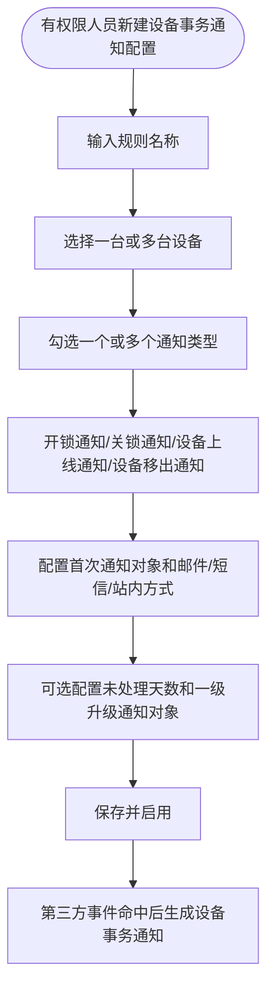
```mermaid
flowchart TD
    A([有权限人员新建设备事务通知配置]) --> B[输入规则名称]
    B --> C[选择一台或多台设备]
    C --> D[勾选一个或多个通知类型]
    D --> E[开锁通知/关锁通知/设备上线通知/设备移出通知]
    E --> F[配置首次通知对象和邮件/短信/站内方式]
    F --> G[可选配置未处理天数和一级升级通知对象]
    G --> H[保存并启用]
    H --> I[第三方事件命中后生成设备事务通知]
```

开锁、关锁通知适用于门禁设备；上线、移出通知适用于所有设备类型。设备移出事件生成的通知记录继续保留并正常处于未处理或已处理状态，同时引用该设备的事务通知配置自动失效。

#### 12.2.4 通知与升级规则

| 配置项 | 规则 |
| :--- | :--- |
| 首次通知对象 | 由规则配置选择，可配置一个或多个对象 |
| 通知方式 | 邮件、短信、站内消息，可多选 |
| 升级条件 | 预警或事务通知生成后达到配置天数仍未处理 |
| 升级对象 | 由规则另选一组通知对象 |
| 升级次数 | 仅支持一级升级 |
| 列表表现 | 升级只发送通知，不生成新记录、不改变状态、不展示“已升级”标签 |
| 停止条件 | 记录已处理或配置/预警已失效后停止后续通知 |

### 12.3 风险信息展示与人工处理板块

#### 12.3.1 押品预警与设备预警生成

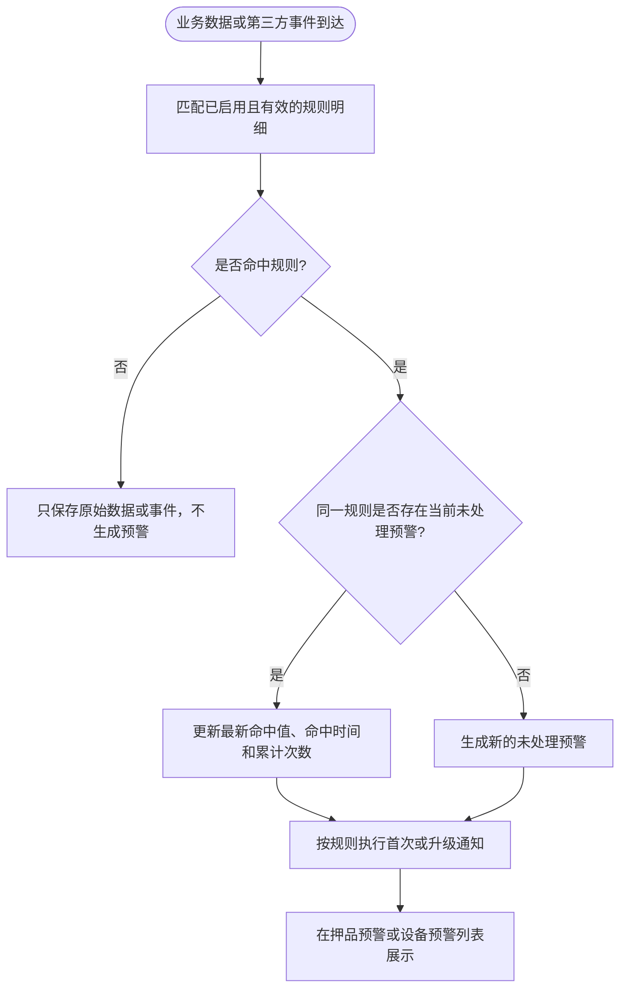
```mermaid
flowchart TD
    A([业务数据或第三方事件到达]) --> B[匹配已启用且有效的规则明细]
    B --> C{是否命中规则?}
    C -- 否 --> D[只保存原始数据或事件，不生成预警]
    C -- 是 --> E{同一规则是否存在当前未处理预警?}
    E -- 是 --> F[更新最新命中值、命中时间和累计次数]
    E -- 否 --> G[生成新的未处理预警]
    F --> H[按规则执行首次或升级通知]
    G --> H
    H --> I[在押品预警或设备预警列表展示]
```

同一规则持续命中时只更新当前未处理预警；已处理后再次命中才生成新记录。预警条件恢复正常后不自动解除，仍须人工处理。规则修改、停用或关联设备移出时，当前未处理预警变为失效，历史记录继续保留。

#### 12.3.2 状态与处理要求

| 信息类型 | 状态/筛选项 | 人工处理要求 | 失效规则 |
| :--- | :--- | :--- | :--- |
| 押品预警信息 | 未处理、已处理、失效 | 处理说明和附件必填 | 规则修改/停用、关联对象失效时，当前未处理预警变为失效 |
| 设备预警信息 | 未处理、已处理、失效 | 处理说明和附件必填 | 规则修改/停用、设备移出时，当前未处理预警变为失效 |
| 设备事务通知 | 全部、未处理、已处理 | 处理说明和附件必填 | 通知记录不失效；设备移出时仅将关联配置标记失效 |

抵/质押率异常选择补仓、平仓或部分结清后，系统跳转对应业务流程；业务流程完成后，仍由有权限人员填写处理说明、上传附件并人工标记已处理。

风险信息不设置预警等级。列表直接展示预警类型、配置阈值、实际命中值、命中时间、累计次数、处理状态及配置的处置方式。

### 12.4 贷中风控管理

```mermaid
flowchart TD
    A([第三方智风控平台同步模型]) --> B[订单规则选择一个风控模型]
    B --> C[有权限人员在贷中风控列表单选或批量勾选订单]
    C --> D[逐笔调用各订单规则关联的模型]
    D --> E{第三方执行结果?}
    E -- 调用失败 --> F[展示失败原因并允许重新执行]
    F --> D
    E -- 成功 --> G[接收指标数值、结果资料和是否触发预警标识]
    G --> H[保存本次执行历史]
    H --> I{是否触发预警?}
    I -- 是 --> J[订单行展示最新风险标识和结果]
    J --> K[按规则发送邮件/短信/站内通知]
    I -- 否 --> L[清除订单行当前风险标识]
    L --> M[历史执行结果继续保留]
```

贷中风控页面展示全部纳入贷中管理的抵/质押或监管订单，并按订单数据权限控制。一条规则只关联一个模型；同一订单需要执行多个模型时创建多条规则。第三方负责判断是否触发预警并上传结果资料，SYZC 只接收、保存和展示。贷中风险只更新订单行标识，不在押品预警列表重新生成记录。

### 12.5 风险公示

```mermaid
flowchart TD
    A([有权限人员进入已处理预警]) --> B{是否与抵/质押单关联?}
    B -- 否 --> C[不允许公示]
    B -- 是 --> D{预警来源?}
    D -- 订单预警 --> E[生成独立公示快照]
    D -- 抵/质押单关联设备预警 --> E
    E --> F[运营方可编辑对外展示内容]
    F --> G{单条或批量公示?}
    G -- 单条 --> H[发布一条公示快照]
    G -- 批量 --> I[每条预警分别生成并发布独立快照]
    H --> J[风险公示Tab展示]
    I --> J
    J --> K{后续操作?}
    K -- 撤回 --> L[立即停止对外展示并保留公示历史]
    L --> M[允许编辑后重新公示]
    M --> J
```

风险公示使用独立 Tab。公示时不选择目标机构、不发送通知；所有拥有风险公示 Tab 权限的账号均可查看当前已公示内容。公示快照可由运营方编辑，但不得反向修改原始预警、原始处理说明或附件。单条和批量公示均以每条预警为单位保存独立快照、版本和操作记录。

### 12.6 关键业务规则矩阵

| 规则编号 | 规则名称 | 规则描述与系统响应 | 审计要求 |
| :--- | :--- | :--- | :--- |
| R-RISK-01 | 配置与信息隔离 | 风险配置和风险信息使用独立菜单、权限和数据对象；信息页面不得修改规则。 | 记录配置版本、命中版本和风险记录关联。 |
| R-RISK-02 | 规则明细唯一 | 订单配置允许勾选多个类型，但同一订单同一预警类型只能有一条有效规则明细。 | 记录唯一约束冲突和处理结果。 |
| R-RISK-03 | 设备范围校验 | 订单设备类规则只能选择订单关联仓库、库区或库位下的设备，且支持多选。 | 保存配置时设备及位置快照。 |
| R-RISK-04 | 物联本地阈值 | 第三方推送原始采集数据，SYZC 按具体订单或设备规则的区间阈值判断。 | 保存原始值、阈值版本、判断时间和结果。 |
| R-RISK-05 | 未处理预警去重 | 同一规则持续命中只更新当前未处理记录；处理后再次命中才新建。 | 保存首次/最新命中时间和累计次数。 |
| R-RISK-06 | 人工处理 | 预警条件恢复不自动解除；处理说明和附件必填后才可标记已处理。 | 保存处理人、说明、附件摘要和前后状态。 |
| R-RISK-07 | 规则失效影响 | 规则修改、停用或设备移出不删除历史；关联未处理预警变为失效。 | 保存失效原因、时间和配置版本。 |
| R-RISK-08 | 事务通知状态 | 设备事务通知只使用未处理、已处理，列表另有全部筛选；设备移出仅使配置失效。 | 保存通知事件、处理记录和配置失效关系。 |
| R-RISK-09 | 一级通知升级 | 达到配置未处理天数后仅向升级对象发送一次通知，不改变风险状态。 | 保存各渠道发送结果、对象和时间。 |
| R-RISK-10 | 贷中结果不重复建警 | 第三方结果更新订单行风险标识并保留执行历史，不新增押品预警记录。 | 保存模型、订单、执行批次、原始结果和最新标识。 |
| R-RISK-11 | 公示快照独立 | 仅已处理且关联抵/质押单的订单预警或设备预警可公示；对外编辑不覆盖原始数据。 | 保存原始快照、公示版本、编辑、发布、撤回和重发记录。 |
| R-RISK-12 | 不设预警等级 | 风险信息按类型、阈值、实际命中值和处置方式展示，不增加等级字段。 | 保存触发参数和处理依据。 |

### 12.7 角色、权限与数据范围

| 角色/权限主体 | 配置权限 | 信息权限 |
| :--- | :--- | :--- |
| 风险配置人员 | 创建、编辑、启停订单预警、设备预警和事务通知配置 | 按授权查看配置命中结果 |
| 风险处理人员 | 无权在信息页修改规则 | 查看并处理授权范围内预警和事务通知，说明及附件必填 |
| 贷中风控人员 | 选择模型规则，单选/批量执行 | 查看订单行风险标识、指标、报告和执行历史 |
| 运营方公示人员 | 无权改写原始预警 | 单条/批量生成公示快照、编辑对外内容、公示、撤回和重新公示 |
| 银行/资金方查看人员 | 无配置和处理权限 | 配置风险公示 Tab 权限后查看当前已公示内容 |
| 审计人员 | 只读查看全部配置版本 | 查看原始事件、预警处理、通知发送、模型结果和公示全链路 |

订单预警和贷中风控按订单数据权限控制；设备预警和设备事务通知按设备及仓库数据权限控制，未绑定位置设备按账号设备权限控制；风险公示仅按独立 Tab 权限控制，不在公示时选择目标机构。

### 12.8 待确认事项

| 编号 | 待确认事项 | 当前处理方式 | 影响范围 |
| :--- | :--- | :--- | :--- |
| T-RISK-01 | 邮件、短信或站内通知发送失败后的自动重试次数和间隔 | 记录发送失败，不写死重试策略 | 消息到达率、重复通知和运维补偿 |

## 13. 后续待确认事项

本章汇总各核心场景尚未确认的业务规则，作为后续继续梳理的入口。原场景内保留待确认项及临时处理方式；本章确认结论形成后，必须同步回写对应场景并关闭待确认项。

### 13.1 设备历史数据保存期限

**待确认编号**：`T-DEV-01`  
**来源章节**：`10.7 待确认事项`

待继续梳理：

- 物联设备历史采集数据保存期限；
- GPS 历史轨迹保存期限；
- 门禁开门记录保存期限；
- 设备预警及关联证据保存期限；
- 在线查询期、归档期和到期处置方式；
- 不同机构、仓库或项目是否允许配置不同保存期限。

当前临时口径：暂不写死保存时长，按现有存储策略保留。

### 13.2 风险通知发送失败重试策略

**待确认编号**：`T-RISK-01`  
**来源章节**：`12.8 待确认事项`

待继续梳理：

- 邮件、短信和站内消息是否使用相同重试策略；
- 自动重试次数、重试间隔和退避方式；
- 首次通知与一级升级通知是否分别重试；
- 重试期间的幂等、去重和防重复触达规则；
- 超过重试上限后的人工补偿、运维告警和状态展示；
- 第三方通道恢复后是否自动补发。

当前临时口径：记录发送失败及通道返回结果，不写死自动重试次数和间隔。
