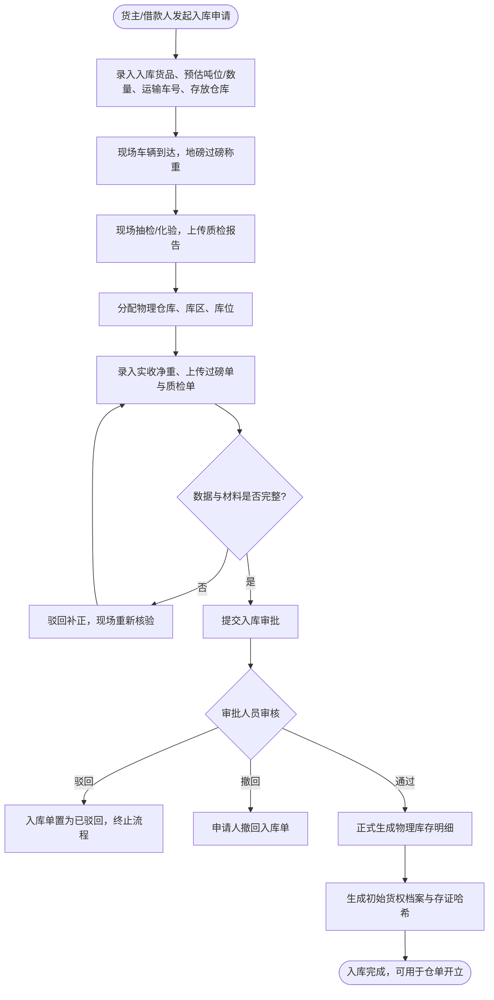
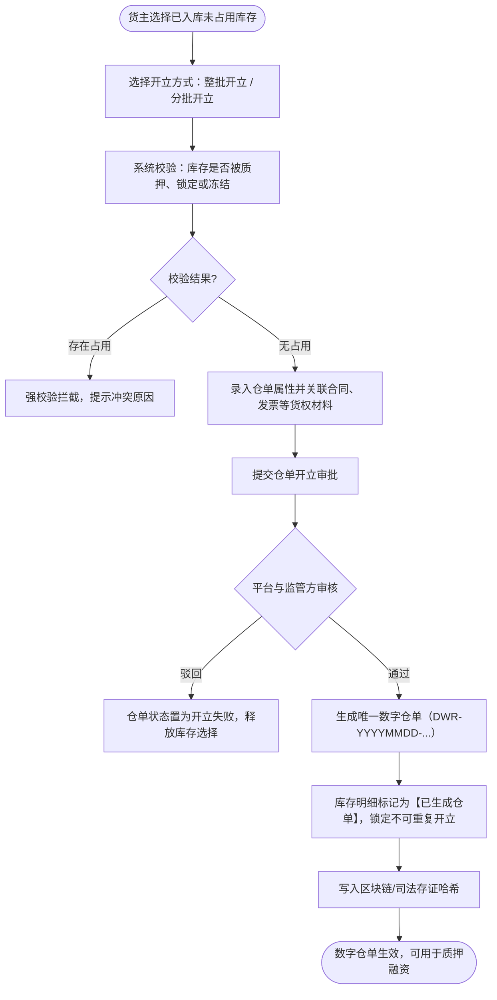
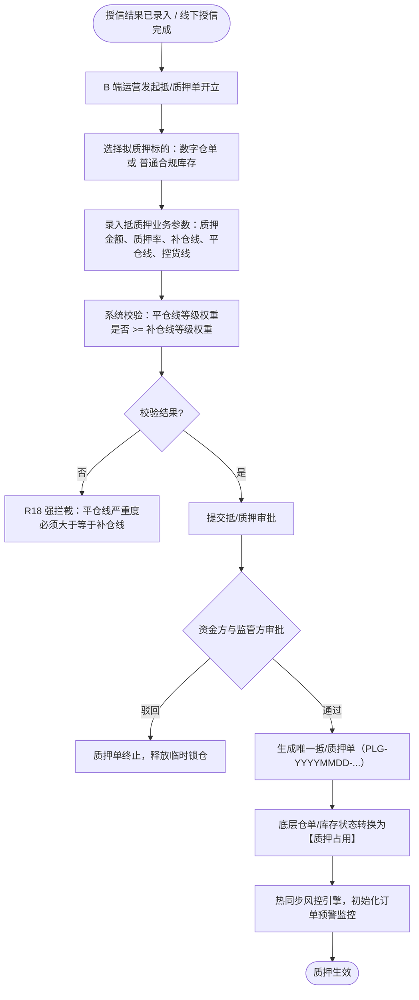
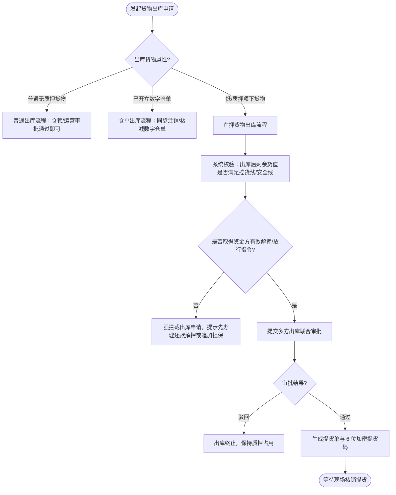
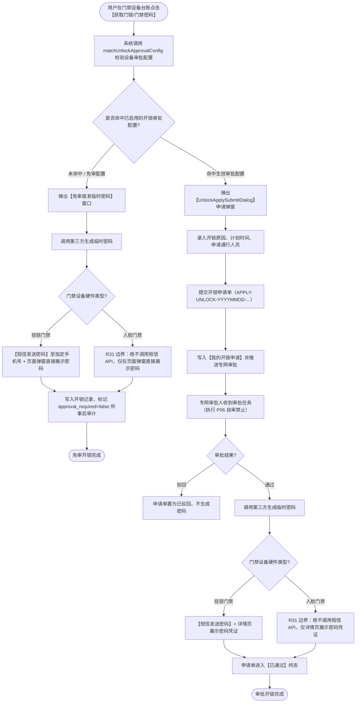
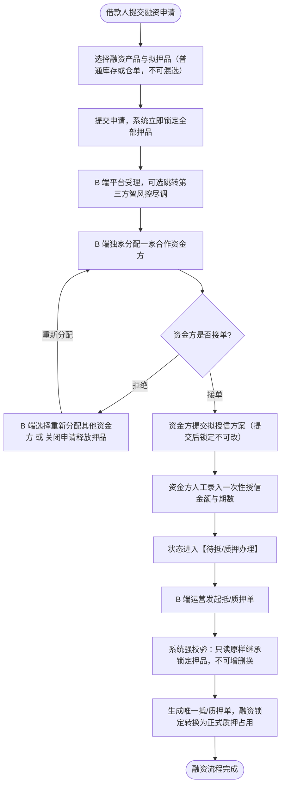
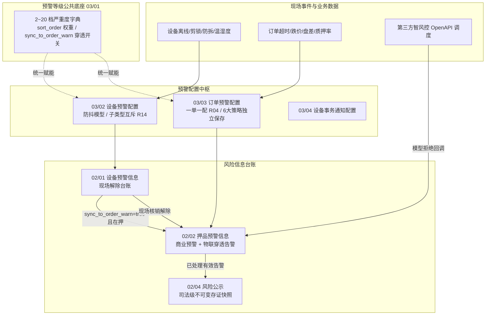
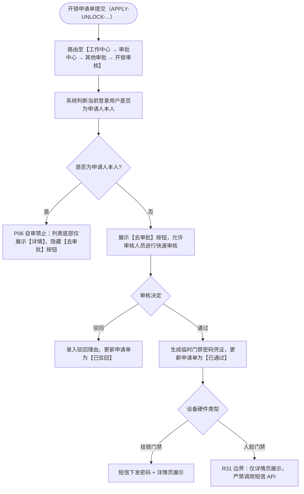

# 森云科技 - SYZC 供应链金融存货监管系统 核心业务场景和流程

> **文档性质**：本文档为 SYZC 供应链金融存货监管系统**端到端核心业务场景、流程图与业务规则矩阵的全局唯一真源基准**。
> **制定企业**：森云科技 (Senyun Technology) | **版本**：v2.5（2026.08）

---

## 1. 核心场景 1：货物入库

*业务目标：借款企业或货主发起入库预约/申请，仓储现场完成到货登记、地磅过磅、质检化验与库位存放，经入库审批通过后正式计入物理库存并生成入库事实证据。*

### 1.1 端到端主流程与异常分支 (Flowchart)

### 1.2 关键业务规则矩阵

| 规则编号 | 规则名称 | 触发条件与描述 | 系统响应与后置影响 | 审计要求 |
| :--- | :--- | :--- | :--- | :--- |
| `R-INB-01` | 单据材料必填 | 提交入库审批时。 | 过磅单、质检报告、车牌号及实收净重必填；缺少任一项拦截提交。 | 记录上传附件哈希与时间。 |
| `R-INB-02` | 精度控制规范 | 录入货物重量与单价。 | 单价保留 2 位小数；净重保留 4 位小数；后端 Decimal 高精度计算。 | 保存精确数值镜像。 |
| `R-INB-03` | 库存入账时机 | 审批通过前。 | 在审批通过前仅为待入库单据，严禁提前计入可用库存；通过后实时入账。 | 记录审批人、时间与库存版本。 |

---

## 2. 核心场景 2：仓单开立

*业务目标：将未被占用的合规物理库存转化为标准数字化资产凭证（数字仓单），生成唯一仓单编码与防伪存证。*

### 2.1 端到端主流程 (Flowchart)

### 2.2 关键业务规则矩阵

| 规则编号 | 规则名称 | 触发条件与描述 | 系统响应与后置影响 | 审计要求 |
| :--- | :--- | :--- | :--- | :--- |
| `R-DWR-01` | 防重复开立 | 选择物理库存开立仓单时。 | 强校验库存状态必须为【正常未开单】；已质押或已开单库存强拦截。 | 记录校验日志与冲突单据号。 |
| `R-DWR-02` | 权属证据链绑定 | 仓单生效前。 | 必须归集入库过磅单、仓储协议及基础货权发票材料。 | 固化归档附件版本快照。 |

---

## 3. 核心场景 3：抵/质押单开立与管理

*业务目标：基于数字仓单或普通库存建立金融质押控制关系，完成资金方授信匹配、质押锁定与风控规则绑定。*

### 3.1 端到端主流程 (Flowchart)

### 3.2 关键业务规则矩阵

| 规则编号 | 规则名称 | 触发条件与描述 | 系统响应与后置影响 | 审计要求 |
| :--- | :--- | :--- | :--- | :--- |
| `R-PLG-01` | 质押状态互斥 | 选定仓单或库存时。 | 校验无在押、无司法冻结、无未处理盘点异常。 | 记录校验前置版本。 |
| `R-PLG-02` | 预警等级权重校验 (R18) | 配置补仓线与平仓线预警等级。 | 平仓线严重度等级权重（`sort_order`）必须 $\ge$ 补仓线等级权重。 | 记录两线等级编码与权重值。 |
| `R-PLG-03` | 押品不可篡改性 | 质押生效后。 | 质押单项下押品明细只读，禁止人工增删替换，仅可通过解押/补仓流转。 | 保存前后数据镜像版本。 |

---

## 4. 核心场景 4：B 端货物出库流程

*业务目标：实现普通库存、仓单及在押货物的合规出库审批、解押放行校验与提货码核销。*

### 4.1 出库分类与流程分支

### 4.2 出库核心规则矩阵

| 规则编号 | 规则名称 | 触发条件与描述 | 系统响应与后置影响 | 审计要求 |
| :--- | :--- | :--- | :--- | :--- |
| `R-OUT-01` | 放行指令前置 | 在押货物申请出库。 | 必须存在资金方出具且处于有效期内的解押/放行指令；否则直接阻断。 | 记录放行指令编号与有效期。 |
| `R-OUT-02` | 仓单同步核销 | 仓单项下出库审批通过。 | 若整单出库则仓单注销；若部分出库则生成拆单变更版本。 | 记录仓单生命周期版本链。 |

---

## 5. 核心场景 5：存货转让

*业务目标：在监管系统内实现存货或仓单的货权交易与买卖过户，确保证据链无缝承接。*

- **前置条件**：转让标的必须为【正常可用】状态；处于在押、司法冻结或存在未关闭预警时**强拦截转让**。
- **业务结果**：转让审批通过后，系统自动变更数字仓单货主归属，归档转让合同与发票，并生成历史货权流转快照。

---

## 6. 核心场景 6：移库（仓内移位）

*业务目标：记录仓库内部库位、库区之间的物理移位，保证设备监控与在押状态不中断。*

- **核心规则**：在押货物移库前，系统自动校验目标库区/库位是否已绑定对应类型的监控与物联设备；移位期间锁定库存，移库完成后自动继承在押监控关系并更新位置快照。

---

## 7. 核心场景 7：异动（差异调整单）

*业务目标：处理因合理损耗、水分挥发或计量校准导致的重量微调。*

- **核心规则**：严禁直接修改历史入库记录；必须发起【异动调整单】，上传现场鉴定证明并经多级审批；在押货物异动后系统自动重算敞口覆盖率与抵质押率。

---

## 8. 核心场景 8：智能盘点

*业务目标：定期或动态核对系统账面库存与现场实物库存。*

- **核心规则**：盘点录入实盘数据后，若产生盘差，系统自动生成 `ALT-COL-CHECK` 盘点异常预警并创建调整审批；在盘点差异核销完成前，对应批次货物禁止发起质押与出库。

---

## 9. 核心场景 9：提货单与货物移交

*业务目标：出库审批通过后，现场操作人员核验提货人身份与提货码，拍照确认实物交接并完成闭环。*

- **核心规则**：提货码采用动态加密机制，支持获取与安全重置；现场确认提货时强制拍照上传移交凭证；支持取消提货与重新入库闭环流转。

---

## 10. 核心场景 10：设备管理（IoT 监库与门禁安全）

*业务目标：对接第三方设备平台，展示监控、门禁、物联传感与 GPS 终端；提供视频锚点绘制；建立**双路径门禁开锁与严格短信边界**。*

### 10.1 门禁开锁与密码获取双路径主流程

### 10.2 设备核心业务规则矩阵

| 规则编号 | 规则名称 | 规则描述与触发条件 | 系统响应与后置影响 | 审计要求 |
| :--- | :--- | :--- | :--- | :--- |
| `R-DEV-01` | 第三方事实来源 | 监控/门禁/传感/GPS 设备由三方平台同步。 | 设备编号、在线状态以三方推送为准，本地只读。 | 记录三方消息编号与推送时间。 |
| `R-DEV-02` | 多位置绑定 | 一台设备可绑定多个仓库、库区或库位。 | 使用目标类型与目标 ID 保存多条映射，防止重复绑定。 | 保存绑定操作人与位置快照。 |
| `R-DEV-31` | 人脸门禁短信阻断 (R31) | 无论免审直发还是审批通过后下发密码。 | **挂锁支持短信+页面；人脸门禁仅页面展示，绝不调用短信 API**。 | 记录阻断标识与下发途径。 |
| `R-DEV-32` | 临时密码时效 | 密码生成成功后。 | 挂锁密码单次使用/7天失效；人脸密码按配置次数/时间失效。 | 记录生成时间、失效时间与使用次数。 |

---

## 11. 核心场景 11：融资管理（申请、独家分配与授信转换）

*业务目标：借款人提交融资申请并锁仓，平台独家分配资金方，资金方接单并录入一次性授信结果后，只读继承押品转化为正式抵/质押单。*

### 11.1 端到端主流程 (Flowchart)

### 11.2 融资核心业务规则矩阵

| 规则编号 | 规则名称 | 规则描述与触发条件 | 系统响应与后置影响 | 审计要求 |
| :--- | :--- | :--- | :--- | :--- |
| `R-FIN-02` | 押品类型互斥 | 选择融资拟押品时。 | 普通库存与仓单不可混选；已选一种后锁定另一种。 | 保存选择类型快照。 |
| `R-FIN-03` | 提交即锁仓 | 提交融资申请时。 | 立即锁定所选押品，锁仓期间禁止重复质押、出库或转让。 | 记录锁定人、数量与时间。 |
| `R-FIN-07` | 资金方独家分配 | 分配资金方时。 | 同一申请同一时间只能分配给一家资金方，防止多头博弈。 | 记录分配链路与接收人。 |
| `R-FIN-12` | 押品只读继承 | 发起抵/质押单时。 | 必须 100% 原样继承锁定押品，不得修改数量或品种。 | 校验押品快照一致性。 |

---

## 12. 核心场景 12：风险信息管理与全域预警中枢

*业务目标：构建**预警等级公共底座（03/01）**，实现设备预警配置（防抖/互斥）、订单预警配置（一单一配/6大策略）、**物联告警穿透（IoT Penetration）**、贷中智风控 OpenAPI 异步调度及司法级不可变风险公示。*

### 12.1 全域预警体系与物联穿透架构

### 12.2 核心预警机制与业务规则矩阵

| 规则编号 | 规则名称 | 规则描述与触发机制 | 系统响应与后置影响 | 审计要求 |
| :--- | :--- | :--- | :--- | :--- |
| `R-WARN-01` | **预警等级公共底座 (03/01)** | 租户配置 2~20 档严重度等级，定义名称、编码、颜色、`sort_order` 权重及 `sync_to_order_warn` 开关。 | **保护规则**：最低 2 档保护禁止删除；被有效规则引用时强拦截删除。 | 记录等级调整前后快照。 |
| `R-WARN-02` | **设备规则防抖与互斥 (03/02)** | 安防事件（防拆/破门/剪锁）锁定 0 延时即时触发；传感事件支持持续时长/连续次数防抖。 | **互斥规则 (R14)**：设备上线类须单独成规则；同一设备同子类型租户内唯一。 | 保存防抖模型与命中参数。 |
| `R-WARN-03` | **订单一单一配与 6 大策略 (03/03)** | 1 笔抵质押订单 1:1 对应 1 条综合规则包（R04）；涵盖超时、跌价、盘点、巡检、质押率、贷中风控。 | 卡片独立保存并热同步风控引擎；抵质押率强制校验平仓线权重 $\ge$ 补仓线权重。 | 记录各策略保存版本。 |
| `R-WARN-04` | **物联穿透闭环机制 (R11~R13)** | 当设备预警等级配置 `sync_to_order_warn=true` 且触发告警时，所在库区存在在押订单自动生成穿透流水。 | **押品端只读**：禁止在押品侧直接解除，必须现场在设备端核销后联动回写订单预警为【已处理有效】。 | 记录穿透源头设备流水与联动核销时间。 |
| `R-WARN-05` | **贷中智风控 OpenAPI 调度** | 贷中风控发起模型调用，智风控平台受理并返回唯一 `task_id` 异步执行。 | 模型拒绝时回调系统，自动生成 02/02 押品高危预警并发送通知。 | 记录任务 ID、指标报告与回调结果。 |
| `R-WARN-06` | **司法级风险公示与取消约束** | 对已处置完成的有效预警对外披露，固化原预警事实、抓拍图与处置材料不可变快照。 | **取消约束**：仅 `R-RISK-MGR` 可操作，强制录入 $\le 200$ 字理由；私有 OSS 动态时效签名。 | 记录公示与取消公示全要素审计。 |

---

## 13. 核心场景 13：开锁审批专网专道与自审禁止

*业务目标：为现场门禁开锁建立秒级响应的高频专网审批通道，严格执行 P06 自审禁止（R11）。*

### 13.1 专网专道审批流程

### 13.2 专网专道核心规则

1. **专网专道隔离**：开锁审批**不接入系统通用工作流引擎，不进待处理/已处理通用池**，保障现场高频开锁实时响应。
2. **P06 自审禁止（R11）**：审批人严禁审批自己发起的开锁申请；
3. **租户范围隔离**：审批人员必须在当前租户范围内配置，且具备对应仓库的数据权限。
