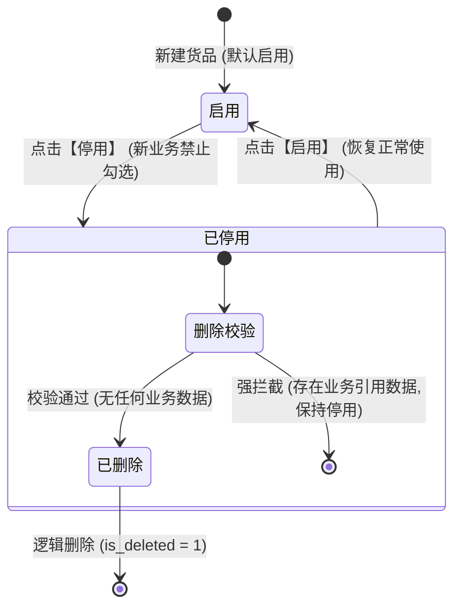
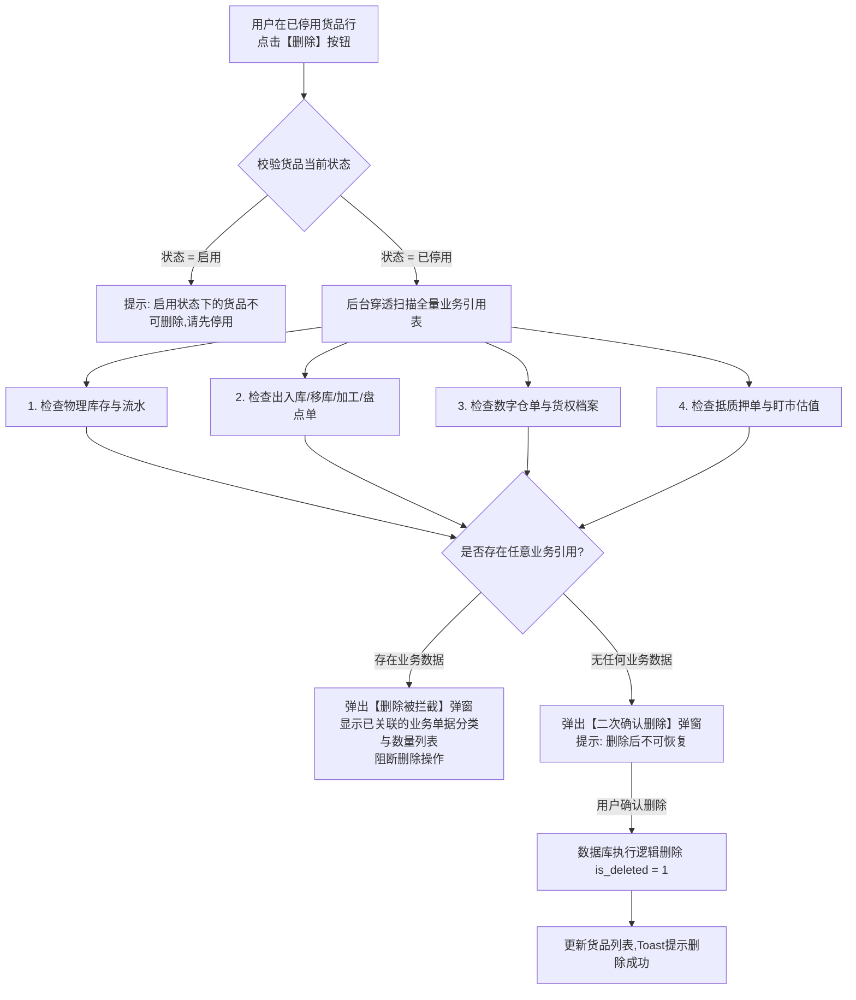

# 供应链金融存货系统 - 货品停用与删除管理功能 PRD

版本号：V1.0.0

| 版本 | 时间 | 修订人 | 备注 |
|---|---|---|---|
| V1.0.0 | 2026/07/20 | pm-master / pm-prd-writer | 初始创建货品停用与安全删除功能 PRD 文档 |

---

## 一、概述（为什么做）

### 1.1 产品概述及目标

#### 1.1.1 背景介绍
在供应链金融存货管理系统中，“货品（SKU）”是贯穿物理仓储、仓单确权、质押融资及盯市风控的核心元数据资产。
在实际运营中，经常会出现货品信息录入错误、误新建或旧型号淘汰的情况。当前系统缺乏规范的货品删除机制：
- 若允许随意删除货品，一旦该货品已被仓单、出入库单或质押合同引用，删除后将导致系统产生大量“孤儿关联记录”和账实不符风险，严重破坏金融审计闭环。
- 若完全不允许删除，会导致库中充斥大量的脏数据和测试垃圾数据。

#### 1.1.2 产品概述
本功能规范了货品的完整生命周期管理，确立**“先停用、再校验、后删除”**的严密管控机制：
1. **状态前置控制**：只有处于**【已停用】**状态的货品，才开放【删除】入口。启用状态下的货品禁止直接删除。
2. **全量业务引用强校验**：点击删除时，系统自动穿透扫描全库 8 大类业务表（底层库存、出入库单、移库单、加工单、盘点单、数字仓单、质押单、盯市记录）。
3. **分流处置逻辑**：
   - **无业务数据**：允许进行安全逻辑删除（`is_deleted = 1`），清理无用脏数据。
   - **有业务数据**：**强控拦截**，阻止删除，并弹窗清晰告知用户已关联的业务单据类型与数量（例如：已关联合同 2 笔、出库单 5 笔），引导其保持“已停用”状态。

#### 1.1.3 产品目标

**业务目标**
| 目标 | 指标 | 目标值 | 达成时间 |
|---|---|---|---|
| 规范货品数据清理 | 误建/无效货品清理成功率 | 100% 安全清理 | 上线后立即生效 |
| 杜绝数据孤立风险 | 因货品删除导致的数据孤立/审计中断事故发生率 | 0% | 上线后立即生效 |
| 提高业务拦截透明度 | 删除被拦截时用户对“拦截原因”的知情率 | 100% 具备明确单据明细 | 上线后立即生效 |

**用户目标**
| 目标用户 | 用户目标 | 衡量指标 |
|---|---|---|
| 基础数据管理员 | 清理新建错乱的垃圾货品数据，维护干净的货品主数据表 | 简单无业务货品一键二次确认删除 |
| 风控与系统审计员 | 确保所有产生过金融或仓储流水的货品主数据绝对不可被物理粉碎 | 历史单据引用 100% 可追溯 |

---

### 1.2 名词说明

| 名词 | 说明 |
|---|---|
| 货品 (SKU) | 仓储与金融质押中的基础商品元数据（如：热轧卷板 Q235、螺纹钢 HRB400）。 |
| 启用 (Active) | 货品正常主数据状态，允许在新建入库、仓单开立、加工申请等业务中被选用。 |
| 已停用 (Deactivated) | 货品冻结状态，禁止在新业务单据中被选用，但历史单据仍可正常展示。 |
| 业务数据引用 (Business Reference) | 任何业务单据、库存明细或仓单记录中引用了该货品主键 ID 的记录。 |
| 逻辑删除 (Soft Delete) | 数据库将 `is_deleted` 字段置为 1，前端列表隐藏，但底层历史保留。 |

---

### 1.3 角色及权限

| 角色 | 权限范围 | 数据范围 |
|---|---|---|
| 系统管理员 / 主数据运维 | 拥有货品的【新增】、【编辑】、【启用/停用】及【删除】权限 | 全局货品主数据 |
| 仓库理货员 / 平台运营 | 拥有货品【查看】及【发起停用申请】权限 | 所属机构辖区数据 |

---

## 二、产品描述（做什么）

### 2.1 产品整体流程

#### 2.1.1 货品生命周期状态转换图



#### 2.1.2 删除业务校验数据流图



---

### 2.2 全局说明

#### 2.2.1 操作按钮显隐与控制矩阵

| 货品当前状态 | 是否存在业务数据 | 【停用】按钮 | 【启用】按钮 | 【删除】按钮状态 | 点击【删除】响应 |
|---|---|---|---|---|---|
| **启用** | 无业务数据 | 显示并可操作 | 不显示 | **置灰不可用** (Tooltip: 请先停用) | 拦截提示：“请先停用货品后再进行删除操作” |
| **启用** | 有业务数据 | 显示并可操作 | 不显示 | **置灰不可用** (Tooltip: 请先停用) | 拦截提示：“请先停用货品后再进行删除操作” |
| **已停用** | **无业务数据** | 不显示 | 显示并可操作 | **高亮可操作 (红色Danger)** | 弹出二次确认框，确认后成功逻辑删除 |
| **已停用** | **有业务数据** | 不显示 | 显示并可操作 | **高亮可操作 (红色Danger)** | 触发全库扫描，弹出【删除拦截及单据明细】弹窗阻断删除 |

#### 2.2.2 业务数据引用强校验范围清单（8 大核心业务表）

系统在执行删除校验时，必须穿透检查以下数据库表，只要**任意一张表存在匹配关联**，即判定为“有业务数据”：

| 校验序号 | 关联板块 | 校验的目标数据库表 / 业务实体 | 存在引用时的拦截说明 |
|---|---|---|---|
| 1 | 仓储物理作业 | 库存明细表 (`wms_inventory_detail`) | “存在物理库存明细记录” |
| 2 | 仓储物理作业 | 入库单明细 (`wms_inbound_item`) / 出库单明细 (`wms_outbound_item`) | “存在入库/出库单据记录” |
| 3 | 仓储物理作业 | 移库单明细 (`wms_transfer_item`) / 加工单明细 (`wms_processing_item`) | “存在移库或货物加工记录” |
| 4 | 仓储物理作业 | 盘点任务明细 (`wms_check_item`) | “存在仓库盘点明细记录” |
| 5 | 资产确权 | 数字仓单明细 (`scf_warehouse_receipt_item`) | “已开立数字仓单确权凭证” |
| 6 | 资产确权 | 货权档案归集 (`scf_title_archive`) | “存在货权档案关联合同/发票” |
| 7 | 金融风控 | 质押单/抵押单明细 (`scf_pledge_item`) | “已被抵质押单据锁定” |
| 8 | 金融风控 | 盯市估值与预警记录 (`scf_valuation_log`) | “存在历史盯市估值计算流水” |

---

## 三、功能需求（怎么做）

### 3.1 货品列表页操作交互

- **位置**：配置管理 -> 货品管理 (SKU Management) 列表。
- **列表控制**：
  - 【状态】列展示 `启用`（绿色 Badge）与 `已停用`（灰色 Badge）。
  - 点击操作列【停用】按钮：弹窗确认“确认停用该货品？停用后新业务单据将无法选择该货品。” -> 确认后更新状态为 `已停用`。
  - 点击操作列【启用】按钮：一键恢复状态为 `启用`。

---

### 3.2 有业务数据强拦截弹窗交互

- **触发条件**：处于 `已停用` 状态的货品，点击【删除】且后端校验返回存在关联业务数据。
- **弹窗样式**：警告拦截弹窗（Modal），顶部带黄色警告图标 `alert-triangle`。
- **弹窗内容**：
  - 标题：“无法删除该货品”
  - 主说明：“该货品（SKU: 热轧卷板 Q235）已在系统中产生业务流水或金融确权数据。为保障金融资产安全与审计链路完整，**禁止删除**。”
  - 关联单据明细卡片（列表展示）：
    - 📦 仓储出入库记录：4 笔
    - 📄 数字仓单确权：2 笔 (仓单号: WR20260301099 等)
    - 🔒 抵质押监管单据：1 笔 (质押单号: PL20260510002)
  - 建议提示：“建议保持‘已停用’状态，以防止新业务误选。”
  - 按钮：仅提供【我知道了】关闭按钮，不提供强制删除选项。

---

### 3.3 无业务数据二次确认删除交互

- **触发条件**：处于 `已停用` 状态的货品，点击【删除】且后端校验返回无任何业务引用。
- **弹窗样式**：危险操作确认弹窗，按钮为红色【确认删除】。
- **提示文案**：“确认删除货品 [测试钢管-不锈钢]？删除后该货品将从系统中移除且无法恢复。”
- **提交逻辑**：
  - 用户点击【确认删除】后，前端调用 `DELETE /api/v1/commodity/{sku_id}`。
  - 后端在单事务内更新 `is_deleted = 1`，写入主数据变更日志。
  - 前端 Toast 提示：“货品删除成功”，列表自动刷新。

---

### 3.4 核心数据字典与 API 设计

#### 核心数据表 (`base_commodity_sku`)
| 字段名 | 类型 | 必填 | 默认值 | 说明 |
|---|---|---|---|---|
| `sku_id` | BIGINT | 是 | 自增 | 货品主键 ID |
| `sku_code` | VARCHAR(64) | 是 | - | 货品编码 (索引: `UNIQUE KEY uk_code_del (sku_code, is_deleted)`) |
| `sku_name` | VARCHAR(128) | 是 | - | 货品名称 |
| `status` | VARCHAR(32) | 是 | 'ACTIVE' | 状态：`ACTIVE` (启用), `DEACTIVATED` (已停用) |
| `is_deleted` | TINYINT | 是 | 0 | 逻辑删除标识：0 (未删除), 1 (已删除) |
| `updated_at` | DATETIME | 是 | CURRENT_TIMESTAMP | 更新时间 |

#### 业务校验 API
- **接口**：`GET /api/v1/commodity/{sku_id}/check-references`
- **响应示例 (有业务数据拦截)**：
```json
{
  "code": 200,
  "data": {
    "can_delete": false,
    "reason": "HAS_BUSINESS_DATA",
    "references": [
      { "module": "出入库单据", "count": 4 },
      { "module": "数字仓单确权", "count": 2, "sample_code": "WR20260301099" },
      { "module": "抵质押监管单据", "count": 1, "sample_code": "PL20260510002" }
    ]
  }
}
```

---

## 四、非功能需求

### 4.1 安全与审计合规
- **新建业务后端强拦截**：全系统所有新建业务接口（入库、出库、移库、加工、质押等）在提交时，必须二次校验选定的 `sku_id` 是否处于 `status = 'ACTIVE'`。若货品已被停用或删除，阻断单据提交并提示：“货品已停用/失效，不可发起新业务”。
- **严禁物理粉碎**：产生过业务流水的货品主数据是供应链金融资产确权的基础，底层数据库物理记录必须永久保存，严禁执行 `DELETE FROM base_commodity_sku` 物理删除。
- **主数据变更日志**：货品的停用、启用、删除操作均需写入 `sys_audit_log` 审计日志。

### 4.2 性能要求
- 关联业务穿透检查接口（扫描 8 张业务表关联 Count）：响应时间必须 `< 500ms`（对应业务表 `sku_id` 必须建立高效 B-Tree 索引）。

---

## 五、附录

### 5.1 验收标准与测试要点

1. **状态前置拦截测试**：
   - 验证处于 `启用` 状态的货品点击【删除】按钮时被拦截提示“请先停用”。
2. **有业务数据强拦截测试**：
   - 选取在系统中有过入库单或质押单记录的货品，将其停用后点击【删除】。
   - 验证系统弹出拦截框，准确展示已关联的单据类型与数量，且无法删除。
3. **无业务数据删除测试**：
   - 新建一个测试货品，直接停用并点击【删除】。
   - 验证弹出二次确认框，确认后货品在列表中消失，底层 `is_deleted = 1`。

---

### 5.2 待确认项清单

| 序号 | 待确认事项 | 影响范围 | 默认建议值 |
|---|---|---|---|
| 1 | 只有顶级管理员拥有删除权限，还是普通货品管理员也可删除？ | 权限控制 | 建议限制为**主数据管理员角色**可操作【删除】 |
| 2 | 若关联的单据全部处于“已作废”状态，是否视作有业务数据？ | 审计合规 | 建议只要生成过单据号（哪怕已作废）均视为有业务数据，**禁止删除** |
