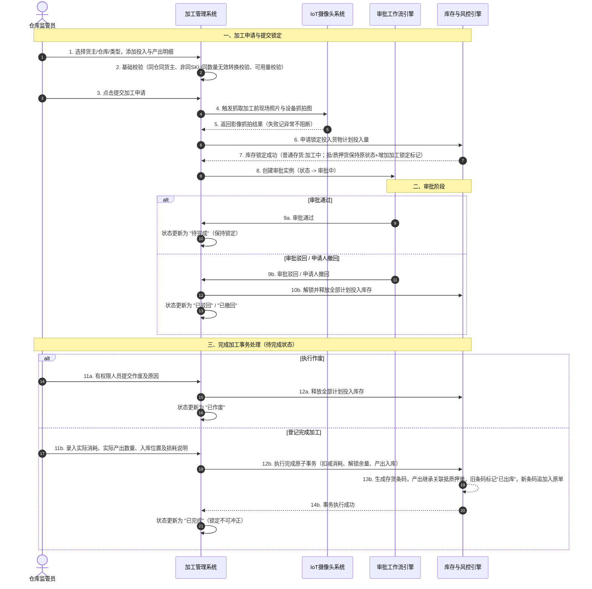

# 加工管理 - 业务流程推演

> **文档定位**：加工管理业务流程的动态沙盘推演说明，用于明确单据流转、数据传递、库存锁定与解锁机制及异常闭环。  
> **版本**：V1.0 | 更新时间：2026-08-06 | 森云科技（Senyun Technology）

---

## 一、推演范围

本推演覆盖供应链金融存货监管视角下的加工管理全生命周期链路：

- **正向主链路**：加工申请发起 ➔ 提交校验与库存锁定 ➔ 审批处理（审批通过） ➔ 完成加工登记 ➔ 实际消耗扣减 / 余量解锁释放 / 产出存货入库与条码生成 / 抵质押货权继承。
- **逆向/终止链路**：
  - 审批阶段：审批驳回 / 申请人主动撤回 ➔ 释放全部计划投入库存。
  - 待完成阶段：风控人员按权限作废 ➔ 释放全部计划投入库存。
- **不包含范围**：草稿态保存、历史单据修改、已完成单据的业务冲正。

---

## 二、涉及角色

| 角色 | 职责 | 参与节点 |
| :--- | :--- | :--- |
| **仓库管理员 / 监管员** | 发起加工申请，录入投入产出计划；加工完成后登记实际消耗与产出信息 | 加工申请发起、完成加工登记 |
| **风控/仓储审批员** | 审核加工申请的业务合理性、货权质押冲突及库存转换合规性 | 审批中（审核 / 驳回） |
| **申请人（发起人）** | 撤回处于审批流程中的加工单 | 审批中（撤回） |
| **风控主管 / 运维** | 对待完成状态的加工单执行作废阻断处理 | 待完成（作废） |
| **IoT / 摄像头系统** | 提交时自动联动抓取现场加工前影像与设备抓拍图 | 提交校验触发 |
| **库存与风控引擎** | 自动执行计划投入量锁定、实际消耗扣减、余量解锁及产出库存继承与条码生成 | 提交成功、作废/驳回、完成事务 |

---

## 三、涉及单据与职责

| 单据/记录 | 层级 | 核心职责 | 上游 | 下游 | 库存/货权影响 |
| :--- | :--- | :--- | :--- | :--- | :--- |
| **加工单（主表）** | 单据级 | 记录加工业务主信息（货主、仓库、加工类型、状态、损耗、抓拍影像等） | 货主档案、仓储合同 | 审批记录、库存流水 | 控制单据全生命周期状态与损耗留痕 |
| **投入货物明细** | 行级（明细） | 记录待加工投入货物的原位置、入库快照、计划投入量及实际消耗量 | 可用库存 / 抵质押单 | 库存流水 | 提交即锁定计划量；完成扣减消耗并解锁余量；终止全额解锁 |
| **产出货物明细** | 行级（明细） | 记录预计及实际产出规格、数量、入库位置、行业单价及计价金额 | 货品档案 / 行业单价库 | 产出库存、存货条码 | 完成时按实际数量生成新库存，继承主表抵质押关系 |
| **抵质押关联单据** | 单据级（关联） | 抵押/质押加工时提供质押物锁定镜像与货权溯源 | 抵押单 / 质押单 | 产出货物明细 | 锁定关联货权；产出货物自动继承对应抵质押单号 |
| **审批与审计日志** | 记录级 | 留痕审批节点意见、全路径操作人、时间戳、IP 及数据快照 | 加工单动作 | 风险监控大屏 | 无直接库存影响，提供穿透审计追溯 |

---

## 四、主流程时序图

---

## 五、单据联动规则表

| 上游动作 | 触发条件 | 下游单据/记录 | 继承/传递数据 | 后置影响 | 待确认事项 |
| :--- | :--- | :--- | :--- | :--- | :--- |
| **提交加工申请** | 校验通过（数量>0、可用量充足、同仓同货主、非同SKU同数量无意义转换） | 19位加工单、投入/产出明细快照 | 继承原库存位置、入库时间、扩展规格快照 | 冻结预计产出结构；锁定投入计划量并打上加工锁定标记 | 无 |
| **抵/质押加工提交** | 加工类型为抵押货/质押货 | 关联抵质押单关联记录 | 继承主表关联抵质押单号 | 锁定关联单据内对应货物；产出预置继承关系 | 仓单货物过滤规则 |
| **审批驳回 / 撤回** | 审批节点驳回 或 申请人主动撤回 | 库存解锁流水、审批日志 | 传递单号及撤回/驳回意见 | 全额解锁计划投入量；单据终止；不恢复草稿 | 无 |
| **待完成单据作废** | 状态为待完成 且 具备作废权限 | 库存解锁流水、审计日志 | 传递作废人及作废原因 | 全额解锁计划投入量；单据终止 | 无 |
| **完成加工提交** | 实际消耗≤锁定量 且 实际产出>0 且 损耗必填 且 入库位置有效（允许选择授权仓库，由首条产出锁定产出仓库，要求单据内所有产出属于同一仓库，允许不同库房/分区） | 产出库存记录、存货条码、库存流水 | 产出继承关联抵质押单号及行业单价 | 扣减实际消耗；解锁计划余量；生成新存货与条码；原抵质押单旧条码置为已出库且追加新条码；状态转已完成 | 无 |

---

## 六、关键异常分支与闭环

| 序号 | 异常场景 | 触发机制 | 阻断/容错策略 | 系统状态与闭环结果 |
| :---: | :--- | :--- | :--- | :--- |
| **1** | **提交基础校验失败** | 投入/产出明细为空、转换方式为1:1、加工日期晚于当前、投入货物非同一仓库 | 强阻断，禁止提交 | 不生成加工单，不调用库存锁库接口。 |
| **2** | **实时可用库存变动** | 提交时目标投入货物被其他并发业务扣减或锁定 | 强阻断，原子事务校验失败 | 不生成加工单，提示“可用库存不足或库存状态已变更”，回滚所有锁定操作。 |
| **3** | **IoT 影像抓拍异常** | 仓库无监控设备、网络超时或摄像头接口响应失败 | 容错处理，允许提交 | 记录“无监控设备”或“抓图失败”日志，成功生成加工单并正常进入审批流程。 |
| **4** | **行业参考单价缺失** | 产出货物在商品管理中未配置行业参考单价 | 提示警告，允许提交与完成 | 预计/实际金额汇总仅统计有价货物，提示“存在未定价货物”，抵/质押货提示“无法完成安全线试算”，但不阻断流程。 |
| **5** | **实际消耗异常填写** | 用户在完成加工时尝试填写实际消耗数量为 0 | 强阻断，校验拒绝 | 提示“实际消耗必须大于0；若完全未使用需作废单据后重新发起”。 |
| **6** | **完成事务中途失败** | 数据库宕机、库存流水插入失败或条码生成冲突 | 全局事务回滚（Atomicity） | 加工单保持“待完成”状态，投入锁定库存保持不变，不产生部分扣减或部分产出。 |
| **7** | **作废与完成并发冲突** | 监管员提交完成的同时，风控主管提交作废指令 | 分布式锁 / 乐观锁防护 | 仅首个到达的有效请求成功处理，后到达者提示“单据状态已变更”，拒绝重复操作。 |

---

## 七、修订记录

| 日期 | 变更摘要 |
| :--- | :--- |
| 2026-08-06 | V1.0 发布加工管理业务流程推演说明 |
| 2026-08-07 | V1.1 走查优化：更新锁定标记、无意义转换校验、产出仓库锁定规则及原抵质押单旧条码标记已出库追加新条码逻辑 |
