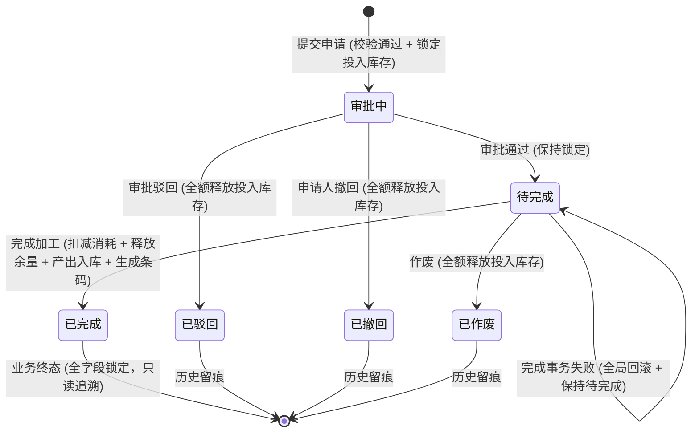
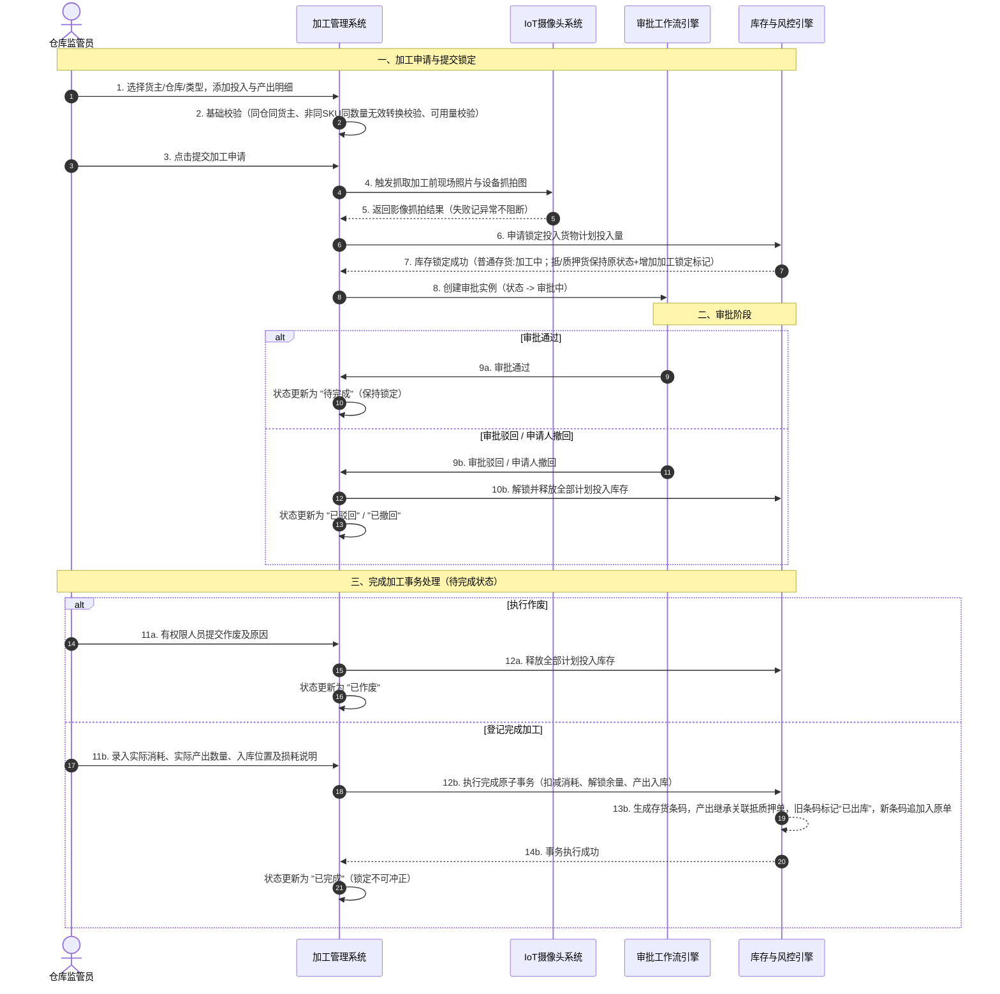

# 加工管理 业务规则规格

> **文档定位**：加工管理单据状态机、动作约束、前置校验规则、计算公式、权限与风控规则的唯一定义来源（Single Source of Truth）。
> **参考文档**：[加工管理主PRD.md](./加工管理主PRD.md)、[加工管理字段清单.md](./加工管理字段清单.md)、[B-迭代需求跨文档引用口径与来源索引](../../README.md)
> **版本**：V1.0 | 更新时间：2026-08-14 | 责任人：森云科技（Senyun Technology）

---

## 一、单据定位

| 项目 | 内容 |
| :--- | :--- |
| **单据层级** | **【第2层-订单/执行控制层】**（库存业务层——加工管理控制单据） |
| **核心职责** | 规范存货在仓储监管期间因切割、拆分、熔炼、组装等产生的加工业务，锁定投入库存，记录实际消耗与余量释放，入库产出存货并生成存货条码，实现抵/质押货权的无缝继承与全路径追溯。 |
| **单据来源** | 业务操作人员或仓库监管人员在 PC 端或移动端（App/PDA）手动发起。 |
| **上游单据** | **货主档案**：提供货主主体 ID、名称和数据权限，正式字段来源待补充；**可用库存明细**：提供库存批次/条码、仓库/库房/分区、可用数量和货权状态，正式字段来源待补充；**抵押单、质押单**：各 1:1 提供有效单据 ID、货权状态和物料清单，业务规则由下游融资单据维护；**货品基础信息**：读取大类、品类、规格、计量单位和单价，来源：[货品管理字段清单](../货品规格管理/03货品管理/货品管理字段清单.md)。加工提交时必须按持久化 ID 关联，不能只按名称匹配。 |
| **下游影响** | 锁定/扣减投入库存流水、释放计划余量流水、生成产出库存及存货条码、更新原抵质押单物料清单（旧条码置为已出库，新条码追加入单）、写入全路径审计日志。 |
| **审核流** | **【有审核流】**（创建提交 ➔ 锁库 ➔ 审批中 ➔ 审批通过 ➔ 待完成 ➔ 登记完成 ➔ 已完成）。 |

### 数量/金额口径隔离表

| 口径名称 | 存在于 | 业务含义与公式 | 约束条件 |
| :--- | :--- | :--- | :--- |
| **一级计划投入量（汇总）** | 投入明细（头部） | 同一规格（大类+品类+规格）下全部二级计划投入量之和 | 必须等于同规格二级计划投入量之和；公式：`Sum(二级计划投入量)` |
| **二级计划投入量（明细）** | 投入明细（行级） | 针对特定批次/位置库存填写的计划投入数量 | `0 < 二级计划投入量 ≤ 提交时实时可用库存` |
| **实际消耗数量** | 投入明细（行级） | 完成加工时填写的实际消耗物理数量 | `0 < 实际消耗数量 ≤ 二级计划投入数量`（不可为 0） |
| **释放数量** | 投入明细（行级） | 完成加工：`计划投入量 - 实际消耗量`；终止态（撤回/驳回/作废）：`全额计划投入量` | 必须由系统自动计算与流水回写，禁止手工修改 |
| **预计产出数量** | 产出明细（行级） | 申请时填写的预计产出数量 | `预计产出数量 > 0`；提交后产出 SKU 结构强行冻结 |
| **实际产出数量** | 产出明细（行级） | 完成加工时填写的实际产出入库物理数量 | `实际产出数量 > 0`；允许大于或小于预计产出数量 |
| **预计产出总金额** | 汇总区域 | `Σ (预计产出数量 × 行业参考单价)` | 仅汇总有价行；缺价提示“存在未定价货物”，不阻断提交 |
| **实际产出总金额** | 汇总区域 | `Σ (实际产出数量 × 行业参考单价)` | 仅汇总有价行；缺价提示“存在未定价货物”，不阻断完成 |
| **加工损耗比例** | 汇总区域 | 手动录入的实际损耗百分比；范围 `0%~100%` | 仅做整单记录留痕，不参与库存扣减与货值/安全线计算 |

---

## 二、状态定义

| 状态名称 | 枚举值 (`Enum`) | 业务含义 | 是否终态 | 进入条件 | 离开条件 |
| :--- | :--- | :--- | :---: | :--- | :--- |
| **审批中** | `PENDING_APPROVAL` | 单据已提交，计划投入库存已成功锁定，正在等待审批流裁决 | 否 | 校验通过且计划投入库存锁定成功 | 审批通过 / 审批驳回 / 申请人撤回 |
| **待完成** | `PENDING_COMPLETION` | 审批流已通过，计划投入库存保持锁定，等待现场仓库监管员登记实际加工结果 | 否 | 审批流“审批通过”节点执行成功 | 完成加工成功 / 有权限人员执行作废 |
| **已完成** | `COMPLETED` | 实际消耗扣减、余量释放、产出入库、条码生成及货权继承事务执行成功，单据锁定 | **是** | 完成加工原子事务整体执行成功 | — （不可逆，不支持业务冲正或作废） |
| **已驳回** | `REJECTED` | 审批流拒绝该申请，已被驳回，计划投入库存全额解锁释放 | **是** | 审批节点执行“驳回”动作 | — |
| **已撤回** | `WITHDRAWN` | 申请人在审批完成前主动撤回，计划投入库存全额解锁释放 | **是** | 申请人在审批中执行“撤回”动作 | — |
| **已作废** | `VOIDED` | 待完成状态下授权人员执行作废，计划投入库存全额解锁释放 | **是** | 有作废权限人员执行“作废”动作 | — |

**设计说明**：
- 加工单不设草稿态（系统设计不支持草稿/暂存）；完成加工事务执行为系统内部原子状态，不作为外部业务状态展示。
- 状态变更严格禁止通过 Dropdown 下拉框直接修改，必须通过具体业务动作（提交、审批、撤回、作废、完成）触发。

---

## 三、状态流转图

---

## 四、状态流转表（核心规则矩阵）

| 当前状态 | 触发动作 | 前置校验条件 | 结果状态 | 二次确认弹窗 | 后置级联影响 | 失败阻断提示 (Toast) |
| :--- | :--- | :--- | :--- | :--- | :--- | :--- |
| 未提交 | 提交加工申请 | R01: 加工日期 ≤ 当前时间 R02: 必选货主/类型/仓库 R03: 普通货仅选“存货中”可用库存 R04: 抵质押货关联正常单据且过滤仓单货 R05: 投入货物满足“三同” R06: 0 < 计划量 ≤ 实时可用量 R07: 产出量 > 0 且非同SKU同数量无效操作 | 审批中 | 无 | ① 生成 19 位加工单号 ② 锁定二级计划投入量（普通货置为“加工中”；抵/质押货置为“抵押中/质押中”+增加“加工锁定”标记） ③ 抓取 IoT 现场/设备影像（失败记日志不阻断） ④ 创建审批流实例 | Toast: 「提交失败：{具体未满足的前置校验，如“可用库存不足”/“投入货物必须同仓”/“无法对仓单货物发起加工”/“无效加工操作”}」 |
| 审批中 | 审批通过 | 审批节点通过 | 待完成 | 无 | ① 状态更新为“待完成” ② 计划投入库存继续保持锁定 ③ 开放“完成加工”与“作废”入口 | Toast: 「审批处理失败：单据状态已变更」 |
| 审批中 | 审批驳回 | 审批节点操作人具备驳回权限 | 已驳回 | 「确认驳回该加工申请？」 | ① 状态更新为“已驳回” ② 调用库存引擎全额释放计划投入量 ③ 写入审批日志与库存解锁流水 | Toast: 「驳回失败：单据已被处理」 |
| 审批中 | 申请人撤回 | 当前登录用户为单据申请人且审批未结束 | 已撤回 | 「确认撤回该加工申请？撤回后将释放锁定库存」 | ① 状态更新为“已撤回” ② 调用库存引擎全额释放计划投入量 ③ 终止审批流 | Toast: 「撤回失败：审批已完成，不可撤回」 |
| 待完成 | 作废 | 操作人具备 `[加工管理·作废]` 权限；填写作废原因 | 已作废 | 「作废后单据终止且不可恢复，确认作废该加工单？」 | ① 状态更新为“已作废” ② 调用库存引擎全额释放计划投入量 ③ 写入操作审计日志 | Toast: 「作废失败：单据已被完成处理」 |
| 待完成 | 完成加工 | R21: 实际产出量 > 0 R22: 产出仓库必须与主表仓库强一致，入库位置/具体位置有效 R23: 实际消耗量 > 0 且 ≤ 锁定量 R25: 损耗比例(0%~100%)及说明必填 | 已完成 | 「完成加工后将扣减消耗库存、释放计划余量并生成产出库存，确认提交？」 | 全局原子事务： ① 扣减实际消耗库存 ② 释放计划余量 (`计划量 - 实际消耗`)  ③ 生成产出库存及全局唯一存货条码 ④ 抵质押产出继承主单；原抵质押单旧条码置“已出库”，追加新条码 ⑤ 建立整单血缘与审计日志 | Toast: 「完成失败：{具体错误，如“实际消耗不可超过锁定量”/“产出仓库与主表仓库不一致”/“事务执行失败全局回滚”}」 |

---

## 五、动作能力矩阵

| 动作 | 未提交页面 | 审批中 | 待完成 | 已完成 | 已驳回 | 已撤回 | 已作废 |
| :--- | :---: | :---: | :---: | :---: | :---: | :---: | :---: |
| **查看详情** | ❌ | ✅ | ✅ | ✅ | ✅ | ✅ | ✅ |
| **编辑申请** | ✅ | ❌ | ❌ | ❌ | ❌ | ❌ | ❌ |
| **提交申请** | ✅ | ❌ | ❌ | ❌ | ❌ | ❌ | ❌ |
| **审批通过** | ❌ | ✅ (审批人) | ❌ | ❌ | ❌ | ❌ | ❌ |
| **审批驳回** | ❌ | ✅ (审批人) | ❌ | ❌ | ❌ | ❌ | ❌ |
| **申请人撤回**| ❌ | ✅ (限本人) | ❌ | ❌ | ❌ | ❌ | ❌ |
| **完成加工** | ❌ | ❌ | ✅ (监管员) | ❌ | ❌ | ❌ | ❌ |
| **单据作废** | ❌ | ❌ | ✅ (授权人) | ❌ | ❌ | ❌ | ❌ |
| **查看审批记录**| ❌ | ✅ | ✅ | ✅ | ✅ | ✅ | ✅ |
| **查看库存结果**| ❌ | ✅ | ✅ | ✅ | ✅ | ✅ | ✅ |
| **导出加工单** | ❌ | ✅ | ✅ | ✅ | ✅ | ✅ | ✅ |

---

## 六、特殊动作规则对比（作废 vs 撤回/驳回 vs 完成加工）

| 比较维度 | 单据作废 (Void) | 审批撤回 / 驳回 (Withdraw/Reject) | 完成加工 (Complete) |
| :--- | :--- | :--- | :--- |
| **业务含义** | 终止处于“待完成”状态的加工意图 | 终止处于“审批中”阶段的加工申请 | 确认执行物理加工结果，完成加工业务 |
| **适用状态** | `待完成 (PENDING_COMPLETION)` | `审批中 (PENDING_APPROVAL)` | `待完成 (PENDING_COMPLETION)` |
| **库存影响** | 全额释放计划投入锁定量 (0 扣减) | 全额释放计划投入锁定量 (0 扣减) | 扣减实际消耗，释放计划余量，生成新产出库存 |
| **货权/条码** | 不改变原存货条码与货权关系 | 不改变原存货条码与货权关系 | 产出生成新存货条码，抵质押单旧条码置出库并反写新条码 |
| **可逆性** | **不可逆** (终态) | **不可逆** (终态) | **不可逆** (终态，不支持业务冲正) |

---

## 七、权限与数据隔离规则

| 规则ID | 规则分类 | 具体规则定义 | 异常/无权限处理 |
| :--- | :--- | :--- | :--- |
| **P01** | 菜单权限 | 须具备 `[加工管理·查看]` 权限方可进入列表与详情页 | 隐蔽菜单入口或提示「无访问权限」 |
| **P02** | 操作子权限 | `[新增申请]`、`[审批处理]`、`[完成加工]`、`[作废]`、`[导出]` 须配置独立权限位 | 界面入口置灰或隐藏 |
| **P03** | 机构/仓库隔离| 仓库监管员数据范围：`仓库 IN User.AssignedWarehouses` 且 `货主 IN User.AssignedCustomers`；仅可操作与查看管辖数据 | 自动追加 SQL 过滤条件，列表静默隔离 |
| **P04** | 端侧权限一致| PC 端与移动端（App/PDA）共享同一套 RBAC 角色与数据权限配置，移动端不得扩大数据范围 | 移动端强校验后端接口权限 |

---

## 八、规则索引

### 8.1 前置校验与业务控制规则 (R01 – R35)

| 代码 | 规则名称 | 规则逻辑定义 |
| :--- | :--- | :--- |
| **R01** | 加工日期校验 | 加工日期默认今日，选择时间不得晚于系统当前服务器时间，精确到时分秒。 |
| **R02** | 主表必填校验 | 货主类型、货主名称、加工类型必填；货主选中后系统带出货主标识和联系电话。 |
| **R03** | 普通存货范围 | 普通存货加工仅可选择所选货主名下处于“存货中”状态的可用库存。 |
| **R04** | 抵质押货与仓单过滤 | 抵/质押货加工必须关联同一张正常状态的抵押单/质押单；**强行过滤包含仓单的货物**。 |
| **R05** | 投入“三同”限制 | 单据内所有投入货物必须严格属于**同货主、同仓库、同加工类型**。 |
| **R06** | 投入数量与极值 | `0 < 二级计划投入量 ≤ 提交时实时可用库存`；一级计划投入量等于同规格二级计划投入量之和。 |
| **R07** | 产出结构与有效转换 | 预计产出量 `> 0`；允许投入与产出不同货品/单位；**仅当投入与产出 SKU 相同且数量相等时判定为无意义操作并阻断提交**。 |
| **R08** | 产出结构冻结 | 申请提交成功后预计产出 SKU 结构冻结，完成加工时禁止新增、删除或替换产出 SKU。 |
| **R09** | 幂等防重提交 | 相同幂等键请求不得重复生成加工单、重复创建审批实例或重复锁定库存。 |
| **R11** | 库存锁定与标记 | 提交成功锁定计划量。普通存货变更为“加工中”；抵/质押货保持“抵/质押中”并叠加“加工锁定”标记，锁定期禁止出库/移库/解押/转让/重复加工。 |
| **R12** | 审批通过保持锁定 | 审批通过进入待完成，计划投入量继续保持锁定。 |
| **R13** | 终止态全额释放 | 审批驳回、撤回及作废均调用库存引擎全额释放该单全部计划投入锁定量。 |
| **R14** | 实际消耗校验 | 完成加工时 `0 < 实际消耗量 ≤ 锁定量`；释放数量 = `计划投入数量 - 实际消耗数量`。 |
| **R15** | 完全未使用处理 | 某条投入货物完全未使用时不允许填 `0` 消耗；需撤回或作废单据后重新发起。 |
| **R21** | 实际产出数量 | 完成时每条实际产出数量必须 `> 0`，可以大于或小于预计产出数量。 |
| **R22** | 产出仓库与位置强校验 | 允许选择授权范围内的仓库，首条产出确定产出仓库；**强校验单据内所有产出属于同一个仓库（即主表仓库）**，允许不同库房/分区；具体位置必填。 |
| **R23** | 货权继承与条码反写 | 抵/质押产出自动继承主单；原抵/质押单旧条码置为“已出库”，新产出条码及实际数量追加写入原单；普通存货产出继承为空。 |
| **R24** | 条码生成与血缘 | 完成成功后每条产出自动生成全局唯一存货条码，建立投入与产出的整单血缘。 |
| **R25** | 损耗填报规则 | 加工损耗比例（`0%~100%`）与损耗说明（≤500字）在完成时必填。 |
| **R26** | 损耗计算隔离 | 加工损耗仅作为整单记录留痕，不参与库存扣减、金额计算或货值安全线计算。 |
| **R27** | 原子完成事务 | 扣减、释放、入库、条码生成及货权继承任一步失败，全局回滚，单据保持“待完成”。 |
| **R28** | 完成后强锁定 | 已完成加工单不提供修改、撤回、作废或业务冲正入口。 |
| **R31** | 产出金额计算 | 行金额 = `产出数量 × 行业参考单价`，保留6位小数。 |
| **R32** | 缺价提示容错 | 预计/实际产出缺少行业参考单价时仅提示“存在未定价货物”，缺价行不计金额，不阻断提交与完成。 |
| **R34** | IoT 影像抓拍容错 | 提交时自动抓取现场及设备影像；无设备或网络失败记异常日志，不阻断提交。 |

### 8.2 业务计算公式索引 (C01 – C05)

| 代码 | 公式/算法名称 | 详细计算逻辑 |
| :--- | :--- | :--- |
| **C01** | 一级计划投入量 | `一级计划投入量 = Σ 二级计划投入量 (按 货品大类 + 品类 + 规格 维度分组汇总)` |
| **C02** | 计划余量释放量 | `释放数量 = max(0, 二级计划投入数量 - 二级实际消耗数量)` |
| **C03** | 预计产出总金额 | `预计产出总金额 = Σ (预计产出行金额)` （仅汇总 `行业参考单价 ≠ null` 的行） |
| **C04** | 实际产出总金额 | `实际产出总金额 = Σ (实际产出行金额)` （仅汇总 `行业参考单价 ≠ null` 的行） |

### 8.3 风控预警与异常阻断 (W01 – W04)

| 代码 | 预警/阻断类型 | 触发条件 | 视觉/系统响应 |
| :--- | :--- | :--- | :--- |
| **W01** | 无效加工阻断 | `投入SKU == 产出SKU` 且 `投入总数量 == 产出总数量` | Toast 提示：「投入与产出货物及数量完全一致，无效加工」，阻断提交 |
| **W02** | 仓单货物阻断 | 关联抵质押单包含 `仓单货物` | 列表过滤不可选，后端提交强阻断 Toast：「仓单质押货物不可直接发起加工」 |
| **W03** | 缺价试算预警 | 任一预计/实际产出明细缺少行业参考单价 | 详情页 Banner 提示：「存在未定价货物，产出总金额仅汇总有价明细」，不阻断流程 |
| **W04** | 跨仓入库阻断 | 产出货物入库仓库 `!=` 主表仓库 | Form 校验阻断 Toast：「产出入库位置必须与主表仓库一致」 |

---

## 业务流程与联动

> 以下内容由原《加工管理业务流程》合并，与上文规则 ID 配合阅读；重复的状态机定义以上文为准。

## 一、推演范围

本推演覆盖供应链金融存货监管视角下的加工管理全生命周期链路：

- **正向主链路**：加工申请发起 ➔ 提交校验与库存锁定 ➔ 审批处理（审批通过） ➔ 完成加工登记 ➔ 实际消耗扣减 / 余量解锁释放 / 产出存货入库与条码生成 / 抵质押货权继承。
- **逆向/终止链路**：
  - 审批阶段：审批驳回 / 申请人主动撤回 ➔ 释放全部计划投入库存。
  - 待完成阶段：风控人员按权限作废 ➔ 释放全部计划投入库存。
- **不包含范围**：草稿态保存、历史单据修改、已完成单据的业务冲正。

---

## 二、涉及角色

| 角色 | 职责 | 参与节点 |
| :--- | :--- | :--- |
| **仓库管理员 / 监管员** | 发起加工申请，录入投入产出计划；加工完成后登记实际消耗与产出信息 | 加工申请发起、完成加工登记 |
| **风控/仓储审批员** | 审核加工申请的业务合理性、货权质押冲突及库存转换合规性 | 审批中（审核 / 驳回） |
| **申请人（发起人）** | 撤回处于审批流程中的加工单 | 审批中（撤回） |
| **风控主管 / 运维** | 对待完成状态的加工单执行作废阻断处理 | 待完成（作废） |
| **IoT / 摄像头系统** | 提交时自动联动抓取现场加工前影像与设备抓拍图 | 提交校验触发 |
| **库存与风控引擎** | 自动执行计划投入量锁定、实际消耗扣减、余量解锁及产出库存继承与条码生成 | 提交成功、作废/驳回、完成事务 |

---

## 三、涉及单据与职责

| 单据/记录 | 层级 | 核心职责 | 上游 | 下游 | 库存/货权影响 |
| :--- | :--- | :--- | :--- | :--- | :--- |
| **加工单（主表）** | 单据级 | 记录加工业务主信息（货主、仓库、加工类型、状态、损耗、抓拍影像等） | 货主档案、仓储合同 | 审批记录、库存流水 | 控制单据全生命周期状态与损耗留痕 |
| **投入货物明细** | 行级（明细） | 记录待加工投入货物的原位置、入库快照、计划投入量及实际消耗量 | 可用库存 / 抵质押单 | 库存流水 | 提交即锁定计划量；完成扣减消耗并解锁余量；终止全额解锁 |
| **产出货物明细** | 行级（明细） | 记录预计及实际产出规格、数量、入库位置、行业单价及计价金额 | 货品档案 / 行业单价库 | 产出库存、存货条码 | 完成时按实际数量生成新库存，继承主表抵质押关系 |
| **抵质押关联单据** | 单据级（关联） | 抵押/质押加工时提供质押物锁定镜像与货权溯源 | 抵押单 / 质押单 | 产出货物明细 | 锁定关联货权；产出货物自动继承对应抵质押单号 |
| **审批与审计日志** | 记录级 | 留痕审批节点意见、全路径操作人、时间戳、IP 及数据快照 | 加工单动作 | 风险监控大屏 | 无直接库存影响，提供穿透审计追溯 |

---

## 四、主流程时序图

---

## 五、单据联动规则表

| 上游动作 | 触发条件 | 下游单据/记录 | 继承/传递数据 | 后置影响 | 待确认事项 |
| :--- | :--- | :--- | :--- | :--- | :--- |
| **提交加工申请** | 校验通过（数量>0、可用量充足、同仓同货主、非同SKU同数量无意义转换） | 19位加工单、投入/产出明细快照 | 继承原库存位置、入库时间、扩展规格快照 | 冻结预计产出结构；锁定投入计划量并打上加工锁定标记 | 无 |
| **抵/质押加工提交** | 加工类型为抵押货/质押货 | 关联抵质押单关联记录 | 继承主表关联抵质押单号 | 锁定关联单据内对应货物；产出预置继承关系 | 仓单货物过滤规则 |
| **审批驳回 / 撤回** | 审批节点驳回 或 申请人主动撤回 | 库存解锁流水、审批日志 | 传递单号及撤回/驳回意见 | 全额解锁计划投入量；单据终止；不恢复草稿 | 无 |
| **待完成单据作废** | 状态为待完成 且 具备作废权限 | 库存解锁流水、审计日志 | 传递作废人及作废原因 | 全额解锁计划投入量；单据终止 | 无 |
| **完成加工提交** | 实际消耗≤锁定量 且 实际产出>0 且 损耗必填 且 入库位置有效（允许选择授权仓库，由首条产出锁定产出仓库，要求单据内所有产出属于同一仓库，允许不同库房/分区） | 产出库存记录、存货条码、库存流水 | 产出继承关联抵质押单号及行业单价 | 扣减实际消耗；解锁计划余量；生成新存货与条码；原抵质押单旧条码置为已出库且追加新条码；状态转已完成 | 无 |

---

## 六、关键异常分支与闭环

| 序号 | 异常场景 | 触发机制 | 阻断/容错策略 | 系统状态与闭环结果 |
| :---: | :--- | :--- | :--- | :--- |
| **1** | **提交基础校验失败** | 投入/产出明细为空、转换方式为1:1、加工日期晚于当前、投入货物非同一仓库 | 强阻断，禁止提交 | 不生成加工单，不调用库存锁库接口。 |
| **2** | **实时可用库存变动** | 提交时目标投入货物被其他并发业务扣减或锁定 | 强阻断，原子事务校验失败 | 不生成加工单，提示“可用库存不足或库存状态已变更”，回滚所有锁定操作。 |
| **3** | **IoT 影像抓拍异常** | 仓库无监控设备、网络超时或摄像头接口响应失败 | 容错处理，允许提交 | 记录“无监控设备”或“抓图失败”日志，成功生成加工单并正常进入审批流程。 |
| **4** | **行业参考单价缺失** | 产出货物在商品管理中未配置行业参考单价 | 提示警告，允许提交与完成 | 预计/实际金额汇总仅统计有价货物，提示“存在未定价货物”，抵/质押货提示“无法完成安全线试算”，但不阻断流程。 |
| **5** | **实际消耗异常填写** | 用户在完成加工时尝试填写实际消耗数量为 0 | 强阻断，校验拒绝 | 提示“实际消耗必须大于0；若完全未使用需作废单据后重新发起”。 |
| **6** | **完成事务中途失败** | 数据库宕机、库存流水插入失败或条码生成冲突 | 全局事务回滚（Atomicity） | 加工单保持“待完成”状态，投入锁定库存保持不变，不产生部分扣减或部分产出。 |
| **7** | **作废与完成并发冲突** | 监管员提交完成的同时，风控主管提交作废指令 | 分布式锁 / 乐观锁防护 | 仅首个到达的有效请求成功处理，后到达者提示“单据状态已变更”，拒绝重复操作。 |

---

## 七、修订记录

| 日期 | 变更摘要 |
| :--- | :--- |
| 2026-08-06 | V1.0 发布加工管理业务流程推演说明 |
| 2026-08-07 | V1.1 走查优化：更新锁定标记、无意义转换校验、产出仓库锁定规则及原抵质押单旧条码标记已出库追加新条码逻辑 |

## 修订记录

| 日期 | 版本 | 变更 |
| :--- | :---: | :--- |
| 2026-08-20 | — | 合并原《加工管理业务流程》至本文件「业务流程与联动」章节 |
