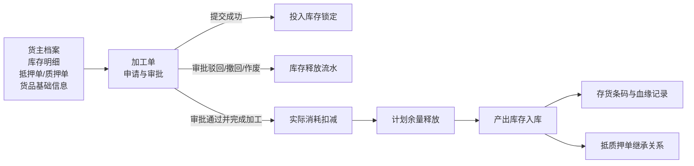
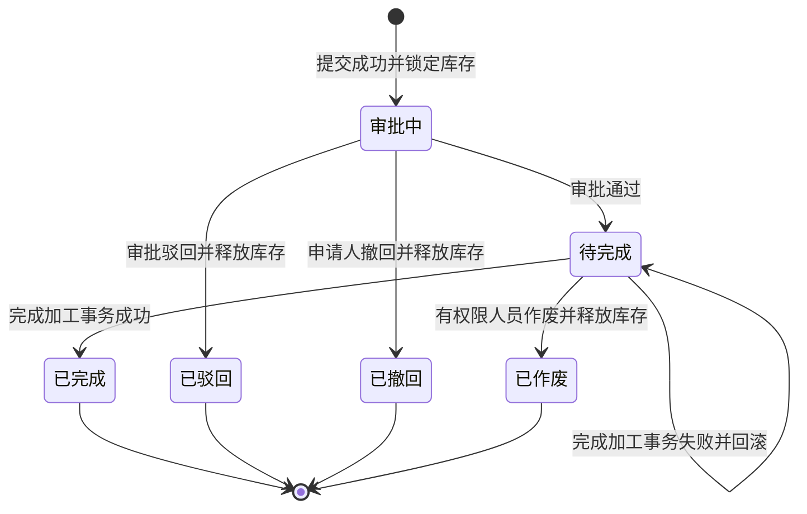

# 加工管理主PRD

> **版本**：V1.0 | 2026-08-06  
> **读者**：研发工程师、测试工程师、产品复核  
> **编写依据**：加工管理字段清单、加工管理功能清单、加工管理业务流程及现有加工管理 PRD 资料  
> **字段基准**：`加工管理字段清单.md` 是本功能所有字段、状态和字段规则的唯一基准

---

### 1. 业务背景

存货在仓储监管期间可能发生切割、拆分、熔炼、组装等加工行为，导致投入货物和产出货物的 SKU、数量、单位或形态发生变化。加工前后的库存、货权和监管状态必须在系统中形成可追溯的业务闭环。

没有统一的加工管理：

- 投入库存可能与出库、移库、解押或其他加工业务重复占用；
- 加工后的产出货物无法与原投入货物建立稳定的血缘关系；
- 抵押货、质押货加工后可能脱离原抵质押单，造成货权链路中断；
- 实际消耗、余量释放和产出入库可能部分成功，导致库存账实不一致；
- 加工损耗、产出金额和加工前影像无法统一留痕和追溯。

加工单提交后锁定计划投入库存，审批通过后由仓库操作人员登记实际结果，系统一次性完成实际消耗扣减、计划余量释放、产出入库、存货条码生成和抵质押关系继承。

---

### 2. 功能范围

**本期范围**：

- 加工单新增、列表、筛选、详情和完成加工；
- 普通存货、抵押货、质押货的加工申请；
- 同货主、同仓库和同加工类型校验；
- 抵押单、质押单关联及仓单货物过滤；
- `1:N`、`N:1`、`N:N` 及 `1:1` 加工业务（仅阻断投入与产出 SKU 相同且数量相等的无意义操作）；
- 允许投入与产出使用不同的货物与计量单位；
- 计划投入量校验、库存锁定和库存释放；
- 审批通过、审批驳回和审批中撤回；
- 待完成加工单按权限直接作废；
- 实际消耗、实际产出、产出位置和加工损耗登记（副产品/边角料同在产出明细录入）；
- 产出库存生成、存货条码生成和抵质押单继承（旧条码置为已出库，新条码加入原抵质押单）；
- 加工前现场照片和设备抓拍图获取；
- 预计产出金额、实际产出金额和缺价提示；
- PC 端与移动端同等业务功能（移动端无独立 PDA 设备及硬件扫码头）；
- 权限、并发、幂等、审批记录、库存流水和操作审计。

**不在本期范围**：

- 草稿和暂存（系统设计不支持）；
- 已提交加工单编辑；
- 已完成加工单业务修改、撤回、作废和冲正；
- 加工工艺、BOM、配方及系统自动单位换算；
- 加工成本归集、质检、委外加工和加工费用结算；
- 投入与产出的逐行分配矩阵；
- 普通存货与抵质押货混合加工；
- 跨货主、跨仓库、多张抵押单或多张质押单共同投入。

> **注（后续可优化项）**：未来版本可考虑增加：① 加工后货值跌破原质押单最低安全线时的风险预警与阻断；② 待完成单据作废的独立审批流程；③ 产出货物中主产品/副产品/边角料的分级标签。

---

### 3. 单据定位

#### 3.1 在系统中的位置

| 项目 | 内容 |
| :--- | :--- |
| 单据层级 | **库存业务层——加工管理控制单据** |
| 核心职责 | 记录加工货主、加工类型、仓库、投入货物、预计产出和实际加工结果 |
| 单据来源 | 业务操作人员或仓库监管人员手动发起 |
| 上游数据 | 货主档案、库存明细、抵押单、质押单、货品基础信息、行业参考单价 |
| 下游结果 | 库存扣减流水、库存释放流水、产出库存、存货条码、抵质押关系和审计记录 |
| 端侧范围 | PC 端与移动端提供同等业务功能 |
| 单据生命周期 | 审批中、待完成、已完成、已驳回、已撤回、已作废 |

#### 3.2 系统链路图



#### 3.3 实体关系说明

| 关系 | 说明 |
| :--- | :--- |
| 加工单 : 投入货物明细 | **1:N**，一张加工单可包含多条投入库存明细 |
| 加工单 : 产出货物明细 | **1:N**，一张加工单可包含多条预计及实际产出明细 |
| 加工单 : 审批记录 | **1:N**，记录审批节点和处理结果 |
| 加工单 : 库存流水 | **1:N**，记录锁定、扣减、释放和产出入库 |
| 投入库存 : 产出库存 | 通过加工单建立整单血缘，不建立逐行数量分配关系 |
| 抵质押单 : 加工单 | 抵押货或质押货一张加工单只关联一张符合条件的抵质押单 |

---

### 4. 业务场景

| 场景ID | 场景 | 类型 | 说明 |
| :--- | :--- | :--- | :--- |
| S01 | 普通存货加工 | 主流程 | 选择同货主、同仓库的“存货中”库存，提交、审批、完成并生成普通产出库存 |
| S02 | 抵押货加工 | 主流程 | 选择同货主名下正常抵押单，过滤仓单货物，完成后产出继承原抵押单 |
| S03 | 质押货加工 | 主流程 | 选择同货主名下正常质押单，过滤仓单货物，完成后产出继承原质押单 |
| S04 | 多种加工比例转换 | 主流程 | 支持 `1:N`、`N:1`、`N:N`，不支持 `1:1` |
| S05 | 审批驳回后终止 | 支线 | 审批节点驳回，释放全部计划投入量，单据进入已驳回 |
| S06 | 审批中申请人撤回 | 支线 | 申请人在审批结束前撤回，释放全部计划投入量，单据进入已撤回 |
| S07 | 待完成单据作废 | 支线 | 有权限人员作废待完成单据，释放全部计划投入量，单据进入已作废 |
| S08 | 实际加工结果登记 | 主流程 | 填写实际消耗、实际产出、入库位置和损耗后完成库存转换 |
| S09 | 完成事务失败重试 | 异常流程 | 扣减、释放、入库或条码生成失败时全部回滚，单据保持待完成 |
| S10 | 影像或价格缺失 | 容错流程 | 影像获取失败或行业参考单价缺失时记录并提示，不阻断提交或完成 |

---

### 5. 状态机

#### 5.1 单据状态

| 状态 | 含义 | 是否终态 |
| :--- | :--- | :---: |
| 审批中 | 加工单已提交，投入库存已锁定，等待审批 | 否 |
| 待完成 | 审批通过，等待登记实际加工结果 | 否 |
| 已完成 | 实际消耗、余量释放、产出入库和结果保存成功 | **是** |
| 已驳回 | 审批未通过，全部计划投入量已释放 | **是** |
| 已撤回 | 申请人在审批中主动撤回，全部计划投入量已释放 | **是** |
| 已作废 | 待完成加工单被授权作废，全部计划投入量已释放 | **是** |

完成加工过程中的系统事务执行不作为业务状态展示；事务失败时加工单保持“待完成”。

#### 5.2 状态机图



#### 5.3 状态流转表

| 当前状态 | 动作 | 前置条件 | 结果状态 | 二次确认 | 后置影响 | 失败处理 |
| :--- | :--- | :--- | :--- | :--- | :--- | :--- |
| 未提交页面 | 提交加工申请 | 加工日期、货主、加工类型、投入和产出满足校验；实时库存可用 | 审批中 | 无 | 生成加工单号、保存快照、锁定计划投入量、创建审批记录 | 不生成正式加工单，不锁定库存 |
| 审批中 | 审批通过 | 审批流程通过 | 待完成 | 无 | 保持计划投入量锁定，开放完成加工 | 状态保持审批中 |
| 审批中 | 审批驳回 | 当前审批节点有驳回权限 | 已驳回 | 无 | 释放全部计划投入量，记录审批意见 | 状态保持审批中 |
| 审批中 | 申请人撤回 | 审批尚未结束，当前用户为申请人 | 已撤回 | 可按页面确认 | 释放全部计划投入量，终止审批记录 | 状态保持审批中 |
| 待完成 | 作废 | 操作人有作废权限，填写作废原因 | 已作废 | 「作废后不可恢复，确认作废？」 | 释放全部计划投入量，不生成产出库存 | 状态保持待完成 |
| 待完成 | 完成加工 | 实际消耗、实际产出、入库位置、具体位置和损耗满足校验 | 已完成 | 「完成后不支持业务冲正，确认完成？」 | 扣减实际消耗、释放余量、产出入库、生成存货条码 | 全部回滚，状态保持待完成 |
| 已完成 | 再次操作 | 已完成状态 | — | — | 仅查看和追溯 | 不提供操作入口 |

---

### 6. 动作能力矩阵

> ✅ = 允许；❌ = 不允许（不展示入口）；✅（条件）= 满足前置条件后允许。

| 动作 | 未提交页面 | 审批中 | 待完成 | 已完成 | 已驳回 | 已撤回 | 已作废 |
| :--- | :---: | :---: | :---: | :---: | :---: | :---: | :---: |
| 编辑申请内容 | ✅ | ❌ | ❌ | ❌ | ❌ | ❌ | ❌ |
| 提交加工申请 | ✅ | ❌ | ❌ | ❌ | ❌ | ❌ | ❌ |
| 审批通过 | ❌ | ✅ | ❌ | ❌ | ❌ | ❌ | ❌ |
| 审批驳回 | ❌ | ✅ | ❌ | ❌ | ❌ | ❌ | ❌ |
| 申请人撤回 | ❌ | ✅（仅本人） | ❌ | ❌ | ❌ | ❌ | ❌ |
| 完成加工 | ❌ | ❌ | ✅ | ❌ | ❌ | ❌ | ❌ |
| 作废 | ❌ | ❌ | ✅（按权限） | ❌ | ❌ | ❌ | ❌ |
| 查看 | ❌ | ✅ | ✅ | ✅ | ✅ | ✅ | ✅ |
| 查看审批记录 | ❌ | ✅ | ✅ | ✅ | ✅ | ✅ | ✅ |
| 查看库存结果 | ❌ | ✅ | ✅ | ✅ | ✅ | ✅ | ✅ |

---

### 7. 核心业务规则

#### 7.1 创建与提交规则

| 规则ID | 规则 |
| :--- | :--- |
| R01 | 加工日期默认今日，只允许选择不晚于当前时间的日期时间，精确到时分秒。 |
| R02 | 加工单必须选择货主类型、货主名称和加工类型；货主选择后系统带出货主标识和联系电话。 |
| R03 | 普通存货仅可选择货主名下状态为“存货中”的可用库存。 |
| R04 | 抵押货、质押货必须选择对应货主名下、处于正常状态且不包含仓单货物的关联单据。 |
| R05 | 单据内投入货物必须同货主、同仓库、同加工类型；新增时可主动选择主表仓库过滤库存，也可由首条投入货物带出；普通存货不展示关联单号。 |
| R06 | 计划投入量必须大于0且不超过提交时实时可用数量；一级计划投入量必须等于同规格二级计划投入量之和；允许投入与产出明细使用不同的货品与计量单位。 |
| R07 | 预计产出货物必须为启用货品（副产品、边角料同在产出明细录入），预计产出数量必须大于0；仅当投入与产出 SKU 相同且数量相等时判定为无意义操作并阻断提交。 |
| R08 | 预计产出结构在提交成功后冻结，完成时不得新增、删除或替换产出 SKU。 |
| R09 | 同一幂等请求不得重复生成加工单、重复创建审批记录或重复锁定库存。 |

#### 7.2 库存锁定与释放规则

| 规则ID | 规则 |
| :--- | :--- |
| R11 | 提交成功即按二级计划投入量锁定库存，普通存货状态变更为“加工中”，抵押货/质押货保持“抵押中”/“质押中”状态并增加“加工锁定”业务标记，锁定期间禁止被出库、移库、解押、转让或重复加工占用。 |
| R12 | 审批通过后进入待完成，计划投入量继续保持锁定。 |
| R13 | 审批驳回、审批中撤回和待完成按权限直接作废均释放该单全部计划投入量。 |
| R14 | 完成时实际消耗数量必须大于0且不超过对应锁定数量；释放数量=计划投入数量－实际消耗数量。 |
| R15 | 某条投入货物完全未使用时不允许填0；需撤回或作废后重新发起。 |
| R16 | 库存锁定、扣减和释放均生成库存流水；任一核心库存操作失败不得产生部分库存结果。 |

#### 7.3 完成与产出规则

| 规则ID | 规则 |
| :--- | :--- |
| R21 | 完成时每条实际产出数量必须大于0，可以大于或小于预计产出数量。 |
| R22 | 每条产出必须填写货物入库位置和具体位置；入库位置强校验必须属于同一个仓库（即加工单主表仓库），允许在不同的分区和库房进行选择。 |
| R23 | 抵押货、质押货的全部产出自动继承主表关联抵质押单；完成加工时，原抵质押单质押物清单中旧存货条码自动标记为“已出库”，新生成的产出存货条码及实际数量自动追加加入原抵质押单；普通存货产出为空。 |
| R24 | 完成成功后每条产出自动生成唯一存货条码，并建立投入与产出的整单血缘关系。 |
| R25 | 加工损耗比例仅在完成加工时填写，范围为 `0%～100%`；加工损耗说明必填，最多500个字符。 |
| R26 | 加工损耗只作整单记录，不参与库存、金额或安全线计算。 |
| R27 | 完成事务任一步失败时全部回滚，状态保持待完成，原锁定库存保持不变。 |
| R28 | 已完成加工单不提供修改、撤回、作废或业务冲正入口。 |

#### 7.4 金额、影像与缺价规则

| 规则ID | 规则 |
| :--- | :--- |
| R31 | 预计产出行金额=预计产出数量×行业参考单价；实际产出行金额=实际产出数量×行业参考单价，金额保留6位。 |
| R32 | 预计产出缺价时，预计产出总金额只汇总已有行业参考单价的明细，并提示“存在未定价货物”。 |
| R33 | 抵押货、质押货缺价时提示无法完成货值安全线试算，但不阻断提交；实际产出缺价不阻断完成。 |
| R34 | 提交时自动获取投入货物所在仓库的现场照片和设备抓拍图；无监控设备或抓图失败不阻断提交。 |
| R35 | 影像获取失败时详情展示“无监控设备”或“抓图失败”；完成加工后不重复获取加工前影像。 |

---

### 8. 权限设计

#### 8.1 数据可见范围

| 角色 | 可见数据范围 | 说明 |
| :--- | :--- | :--- |
| 业务操作人员 | 所属组织、授权货主和仓库范围内的加工单 | 可发起加工申请，审批中仅可撤回本人申请 |
| 审批人员 | 审批流程节点授权范围内的加工单 | 仅处理分配到当前节点的审批任务 |
| 仓库操作人员 | 所属仓库范围内的加工单 | 可登记实际加工结果和提交完成 |
| 作废人员 | 组织和仓库授权范围内的待完成加工单 | 仅可作废具备权限的待完成单据 |
| 系统管理员 | 全部加工单 | 按系统配置执行管理和审计查看 |

PC 端与移动端沿用同一套角色权限和数据权限，不因端侧不同扩大数据可见范围。

#### 8.2 操作权限矩阵

| 操作 | 业务操作人员 | 审批人员 | 仓库操作人员 | 作废人员 | 系统管理员 |
| :--- | :---: | :---: | :---: | :---: | :---: |
| 查看 | ✅ | ✅ | ✅ | ✅ | ✅ |
| 新增并提交 | ✅ | ❌ | 按配置 | ❌ | ✅ |
| 审批通过/驳回 | ❌ | 按节点 | 按节点 | 按节点 | ✅ |
| 审批中撤回 | 仅本人 | ❌ | 仅本人 | ❌ | 按配置 |
| 完成加工 | ❌ | ❌ | ✅ | 按配置 | ✅ |
| 作废待完成单据 | ❌ | ❌ | 按配置 | ✅ | ✅ |
| 查看审批记录 | ✅ | ✅ | ✅ | ✅ | ✅ |
| 查看库存流水和快照 | 按授权 | 按授权 | 按仓库 | 按授权 | ✅ |
| 查看操作审计 | 按授权 | 按授权 | 按授权 | 按授权 | ✅ |

#### 8.3 权限约束

| 约束 | 说明 |
| :--- | :--- |
| 后端强校验 | 所有接口必须校验功能权限、数据权限、单据状态和数据版本，不能仅依赖前端隐藏按钮。 |
| 申请人撤回 | 仅审批尚未结束且当前用户为申请人的加工单允许撤回。 |
| 作废权限 | 仅待完成状态允许作废，作废必须填写原因。 |
| 完成权限 | 仅待完成状态且仓库数据范围匹配时允许完成加工。 |

---

### 9. 数据溯源与审计

#### 9.1 数据溯源

| 数据对象 | 必须留存的数据 |
| :--- | :--- |
| 投入货物 | 原库存明细、货物规格、原位置、具体位置、入库时间、其他信息、原库存状态、存货二维码、计划投入量、实际消耗量和释放数量 |
| 产出货物 | 货物规格、预计产出数量、实际产出数量、入库位置、具体位置、行业参考单价、预计/实际产出金额、存货条码 |
| 货权关系 | 加工单与投入库存、产出库存的整单血缘；抵押货或质押货产出与原关联单号的继承关系 |
| 影像资料 | 现场照片、设备抓拍图、仓库、设备、抓拍时间、附件引用和失败原因 |
| 审批记录 | 审批节点、审批人、参与人、审批结果、处理时间、处理意见和节点状态 |

#### 9.2 审计动作

至少记录：提交、锁库、提交失败、审批通过、审批驳回、审批撤回、作废、作废失败、完成请求、完成成功、完成失败、库存扣减、库存释放、产出入库、存货条码生成和抵质押单继承。

审计日志至少包含操作人、角色、机构、时间、IP、请求ID、幂等键、操作前版本、操作后版本、操作前数据快照、操作后数据快照和失败原因。

---

### 10. 边界与异常处理

#### 10.1 并发控制

| 场景 | 处理方式 |
| :--- | :--- |
| 两个用户同时提交同一批库存 | 以库存实时可用量和库存版本校验为准，仅一个请求成功锁定，其余请求失败 |
| 两个用户同时审批同一加工单 | 以单据状态和数据版本为准，仅一个审批结果成功，其他请求提示状态已变更 |
| 撤回与审批并发 | 以审批实例和单据版本为准，仅一个状态变更成功 |
| 作废与完成并发 | 以单据状态和数据版本为准，仅一个操作成功，失败操作不得释放或扣减库存 |

#### 10.2 幂等操作约束

| 操作 | 幂等规则 |
| :--- | :--- |
| 提交加工申请 | 相同幂等键只生成一张加工单、一个审批实例和一组库存锁定结果 |
| 撤回、驳回、作废 | 已完成相同状态变更的重复请求返回首次结果，不重复释放库存 |
| 完成加工 | 相同幂等键只执行一次扣减、释放、入库和条码生成 |
| 影像获取 | 同一加工单只获取加工前影像，不在完成加工时重复抓取 |

#### 10.3 边界约束

| 场景 | 规则 |
| :--- | :--- |
| 无投入明细 | 阻断提交 |
| 无产出明细 | 阻断提交 |
| 无意义加工操作 | 仅当投入与产出 SKU 相同且数量相等时阻断提交，提示“投入与产出货物及数量完全一致，无效加工” |
| 计划投入量超出可用量 | 阻断提交，不部分锁定 |
| 实际消耗数量为0 | 阻断完成，需撤回或作废后重新发起 |
| 实际产出数量不大于0 | 阻断完成 |
| 产出位置为空或跨仓库 | 阻断完成，提示“产出入库位置必须与主表仓库一致” |
| 损耗比例为空或越界 | 阻断完成 |
| 行业参考单价缺失 | 提示缺价，不阻断提交或完成 |
| 影像获取失败 | 记录异常，不阻断提交 |

#### 10.4 完成事务失败

完成事务必须保证以下结果同时成功：

```text
实际消耗扣减
+ 计划余量释放
+ 产出库存生成
+ 存货条码生成
+ 整单血缘建立
+ 抵质押关系继承（原单旧条码置为已出库，新条码追加入单）
+ 库存流水和加工结果保存
= 加工单已完成
```

任一步失败时全部回滚：加工单保持“待完成”，原计划投入量保持锁定，不产生部分扣减、部分释放、部分入库或孤立条码。

---

### 11. 验收重点

> 验收标准采用“输入条件 → 预期结果”格式，研发自测和测试用例必须覆盖以下核心风险点。

| # | 验收项 | 输入条件 | 预期结果 |
| :--- | :--- | :--- | :--- |
| V01 | **提交锁库** | 选择有效投入货物并提交加工申请 | 生成加工单号，锁定计划投入量（增加加工锁定标记），状态为审批中 |
| V02 | **库存不足阻断** | 提交时实时可用量小于计划投入量 | 提交失败，不生成正式加工单，不部分锁定 |
| V03 | **同源校验** | 选择跨货主、跨仓库或混合加工类型的投入货物 | 阻断选择或提交并提示原因 |
| V04 | **关联单据过滤** | 选择包含仓单货物的抵押单或质押单 | 单据不可选，后端提交再次阻断 |
| V05 | **无意义加工阻断** | 投入与产出 SKU 相同且数量相等 | 提交失败，提示无效加工操作 |
| V06 | **审批通过** | 审批节点全部通过 | 状态进入待完成，计划投入量继续锁定 |
| V07 | **审批驳回释放** | 审批节点驳回加工单 | 状态进入已驳回，全部计划投入量释放 |
| V08 | **审批撤回释放** | 申请人在审批中撤回本人加工单 | 状态进入已撤回，全部计划投入量释放 |
| V09 | **作废限制** | 待完成单据执行作废 | 状态进入已作废，全部计划投入量释放；已完成单无作废入口 |
| V10 | **实际消耗校验** | 任一实际消耗为0或超过锁定量 | 阻断完成，库存不发生变化 |
| V11 | **产出结构锁定** | 完成时新增、删除或替换产出 SKU | 阻断完成，只允许调整实际产出数量 |
| V12 | **位置校验** | 产出位置为空、具体位置为空或入库仓库与主表仓库不一致 | 阻断完成；限制为单据主表仓库，允许同一仓库下的不同库房和分区 |
| V13 | **原子完成** | 扣减、释放、入库、条码或货权继承任一步失败 | 全部回滚，状态保持待完成，原锁定库存不变 |
| V14 | **抵质押继承** | 抵押货或质押货完成加工 | 全部产出继承主表关联抵质押单 |
| V15 | **缺价容错** | 预计或实际产出缺少行业参考单价 | 提示缺价，不阻断提交或完成，缺价明细不计金额 |
| V16 | **影像容错** | 无监控设备或抓图接口失败 | 记录失败状态，不阻断提交 |
| V17 | **幂等防重** | 使用相同幂等键重复提交或完成 | 返回首次结果，不重复生成单据、锁库、扣减或入库 |
| V18 | **并发保护** | 同时执行审批、撤回、作废或完成 | 仅一个操作成功，其余提示状态已变更 |
| V19 | **完成后只读** | 已完成加工单尝试修改、撤回、作废或冲正 | 操作入口不展示，单据仅可查看和追溯 |
| V20 | **移动端一致** | 在移动端执行 PC 端支持的加工操作 | 功能、权限、数据范围、状态和校验规则与 PC 端一致 |

---

### 修订记录

| 日期 | 变更摘要 |
| :--- | :--- |
| 2026-08-06 | V1.0 新增加工管理主 PRD，参照采购订单主 PRD 结构，整合加工管理字段、功能、流程、权限、异常和验收规则 |
| 2026-08-07 | V1.1 走查优化：①抵质押物锁定增加“加工锁定”标记；②修正1:1阻断为仅同SKU同数量无效操作阻断；③产出仓库支持选择授权仓库并由首条锁定同仓；④原抵质押单旧条码置为已出库且追加新条码；⑤增加风控预警、作废审批与主副产品分类等后续优化备注 |
