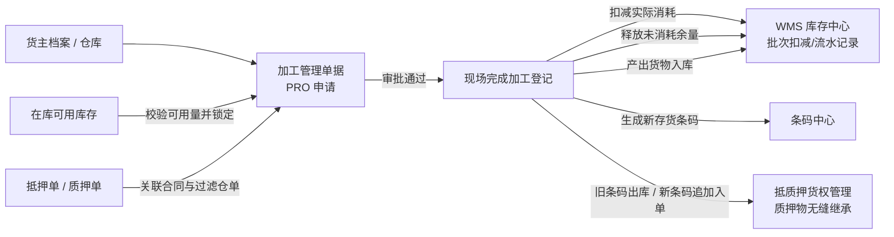

# 加工管理主PRD

> **模块定位**：库存业务层核心流转单据，规范存货在仓储监管期间的加工行为（切割、拆分、熔炼、组装等），实现计划投入库存锁定、实际消耗扣减、计划余量释放、产出入库、条码生成及抵/质押货权无缝继承的全链路闭环。  
> **版本**：V3.0 | 更新时间：2026-09-02 | 责任人：森云科技（Senyun Technology）  
> **编写依据**：[加工管理字段清单.md](./加工管理字段清单.md) 是本模块所有字段定义、枚举与页面展示的唯一基准；[加工管理业务规则规格.md](./加工管理业务规则规格.md) 是本模块状态机、原子事务、货权继承与并发控制的唯一定义来源。

---

## 1. 业务背景

存货在仓储监管期间可能发生切割、拆分、熔炼、组装等加工行为，导致投入货物和产出货物的 SKU、数量、单位或物理形态发生变化。加工前后的库存、货权和监管状态必须在系统中形成可追溯的业务闭环。

没有统一的加工管理系统：
- 投入库存可能与出库、移库、解押或其他加工业务发生并发争抢与重复占用；
- 加工后的产出货物无法与原投入货物建立稳定的物理与货权血缘关系；
- 抵押货、质押货加工后可能脱离原抵质押单据，造成银行或资金方货权链路中断；
- 实际消耗、余量释放和产出入库若非原子执行，易导致库存账实不符与数据孤岛；
- 加工损耗、产出货值和加工前现场影像无法统一留痕与追溯。

加工单提交后即时锁定计划投入库存，审批通过后由仓库操作人员登记实际结果，系统在单一原子事务内一次性完成实际消耗扣减、计划余量释放、产出入库、存货条码生成和抵质押关系继承。

---

## 2. 功能范围

| 包含功能 (In Scope) | 不包含功能 (Out of Scope) |
| :--- | :--- |
| - 加工单新增申请、列表多维筛选、单据详情展示及完成加工登记； - 普通存货、抵押货、质押货的加工申请与货权隔离； - 同货主、同仓库、同加工类型（“三同”）强校验； - 抵押单、质押单有效性关联及仓单货物前置过滤； - `1:N`、`N:1`、`N:N` 及 `1:1` 加工业务（阻断同SKU同数量无效操作）； - 计划投入量校验、库存即时锁定与终止/余量释放； - 审批流转（审批通过、审批驳回及申请人审批中撤回）； - 待完成单据授权人员直接作废并释放库存； - 实际消耗、实际产出、入库位置及加工损耗登记； - 产出入库、全局唯一存货条码生成及原抵质押单自动继承； - 加工前现场照片与设备抓拍图联动获取及降级容错； - 预计/实际产出金额试算与缺价统一提示； - PC 端与移动端全功能支持（移动端适配拍照与手持录入）； - 全生命周期操作审计、库存流水与版本乐观锁。 | - 草稿和暂存（系统设计不支持草稿态）； - 已提交加工单属性直接编辑； - 已完成加工单业务修改、撤回、作废与冲正； - 复杂工艺路线、BOM 清单、配方管理及自动单位换算； - 加工成本核算、委外加工与加工费用结算； - 普通存货与抵质押货物混合加工； - 跨货主、跨仓库、多张抵押单或多张质押单共同投入； - 已作废/已删除加工单的物理恢复。 |

---

## 3. 模块定位与系统链路

---

## 4. 业务场景

| 场景ID | 场景名称 | 场景类型 | 业务说明与核心约束 |
| :--- | :--- | :--- | :--- |
| **S01** | 发起加工申请 | 主流程 | 录入加工日期、货主、类型、选择仓库与在库货物，配置预计产出；校验通过即时锁定投入库存并进入审批流 |
| **S02** | 审批流裁决 | 主流程 | 审批人审核加工申请：审批通过单据进入“待完成”，库存保持锁定；审批驳回单据终止，全额释放锁定库存 |
| **S03** | 申请人撤回 | 控制流程 | 在审批未完成前，申请人可主动撤回申请，单据进入“已撤回”，审批终止并全额释放锁定库存 |
| **S04** | 授权人作废 | 控制流程 | 待完成状态下，具备权限人员可执行作废，单据进入“已作废”，全额释放锁定库存并记录作废原因 |
| **S05** | 现场完成加工登记 | 主流程 | 现场监管员录入实际消耗量（$\le$ 锁定量）、实际产出量、产出位置及损耗；系统原子执行消耗扣减、余量释放与产出入库 |
| **S06** | 抵质押货权继承 | 联动流程 | 抵质押货物加工完成后，系统自动将原抵质押单内被消耗的旧条码标记为已出库，并将新生成的产出条码追加入原单据 |

---

## 5. 状态机与动作能力矩阵

> 状态流转详细规则、前置校验与阻断提示详见 [加工管理业务规则规格.md §四 状态流转表](./加工管理业务规则规格.md#五状态流转表核心规则矩阵)。

| 动作名称 | 审批中 (`PENDING_APPROVAL`) | 待完成 (`PENDING_COMPLETION`) | 已完成 (`COMPLETED`) | 已驳回 (`REJECTED`) | 已撤回 (`WITHDRAWN`) | 已作废 (`VOIDED`) |
| :--- | :---: | :---: | :---: | :---: | :---: | :---: |
| **查看详情 / 审批记录** | ✅ | ✅ | ✅ | ✅ | ✅ | ✅ |
| **提交加工申请** | ❌（仅新增页） | ❌ | ❌ | ❌ | ❌ | ❌ |
| **审批通过** | ✅（审批人） | ❌ | ❌ | ❌ | ❌ | ❌ |
| **审批驳回** | ✅（审批人） | ❌ | ❌ | ❌ | ❌ | ❌ |
| **申请人撤回** | ✅（限制单本人）| ❌ | ❌ | ❌ | ❌ | ❌ |
| **完成加工登记** | ❌ | ✅（监管员） | ❌ | ❌ | ❌ | ❌ |
| **单据作废** | ❌ | ✅（授权人） | ❌ | ❌ | ❌ | ❌ |
| **导出单据** | ✅ | ✅ | ✅ | ✅ | ✅ | ✅ |

---

## 6. 页面与字段规则

页面全量字段定义、取值范围、必填性与展示格式完全继承自 [加工管理字段清单.md](./加工管理字段清单.md)：
- **列表展示字段**：`加工单号`、`货主名称/标识`、`加工类型`、`加工日期`、`仓库`、`投入货物摘要`、`产出货物摘要`、`加工单状态`、`制单人`、`制单时间`、`操作`；
- **筛选条件**：`加工单号`（文本模糊搜索）、`加工日期`（日期时间范围）、`货主名称`（下拉搜索）、`加工类型`（下拉单选）、`仓库`（下拉单选）、`加工单状态`（下拉单选）；
- **新增页交互**：
  - 头部选择货主与类型，选择投入货物自动锁定仓库；
  - 投入明细支持一级总量分摊与二级逐行输入，实时校验可用库存；
  - 产出明细配置产出规格与预计数量，试算预计产出总金额（缺价提示「存在未定价货物」）。
- **完成加工登记页**：
  - 录入每行二级实际消耗量（$0 < \text{实际消耗} \le \text{计划量}$）；
  - 录入产出货物实际数量、选择入库库房/分区（限定单据主表仓库）与具体位置；
  - 必填加工损耗比例（$0\% \sim 100\%$）及损耗说明。

---

## 7. 核心业务规则索引

| 规则编码 | 规则名称 | 核心口径摘要 | 唯一定义来源 |
| :--- | :--- | :--- | :--- |
| **R01~R02** | 业务时间与货主主体校验 | 加工日期 $\le$ 当前时间；企业/个人货主信息联动与字段隔离 | [业务规则规格 §六.1](./加工管理业务规则规格.md#一申请与前置校验规则) |
| **R03~R04** | 加工类型与抵质押关联 | 普通货仅限可用库存；抵质押货关联有效单据且强过滤仓单货物 | [业务规则规格 §六.1](./加工管理业务规则规格.md#一申请与前置校验规则) |
| **R05** | 投入货物“三同”校验 | 单据内所有投入货物必须满足：同货主、同仓库、同加工类型 | [业务规则规格 §六.1](./加工管理业务规则规格.md#一申请与前置校验规则) |
| **R06** | 投入数量校验与即时锁库 | $0 < \text{计划投入量} \le \text{实时可用量}$；提交成功即时锁定库存 | [业务规则规格 §六.1](./加工管理业务规则规格.md#一申请与前置校验规则) |
| **R07** | 产出有效性与结构冻结 | 预计数量 $> 0$；阻断同 SKU 同数量无效操作；提交后产出结构冻结 | [业务规则规格 §六.1](./加工管理业务规则规格.md#一申请与前置校验规则) |
| **R11~R14** | 审批流转与终止释放规则 | 审批通过保持锁定；驳回、撤回、作废在事务内全额释放锁定库存 | [业务规则规格 §六.2](./加工管理业务规则规格.md#二审批与作废控制规则) |
| **R21~R22** | 实际产出与入库同仓约束 | 实际数量 $> 0$；产出仓库必须与单据主表仓库一致，具体位置必填 | [业务规则规格 §六.3](./加工管理业务规则规格.md#三完成加工与产出入库原子事务) |
| **R23~R24** | 实际消耗扣减与余量释放 | $0 < \text{消耗量} \le \text{锁定量}$；原子事务扣减消耗，自动释放余量 | [业务规则规格 §六.3](./加工管理业务规则规格.md#三完成加工与产出入库原子事务) |
| **R25** | 加工损耗留痕规则 | 损耗比例与说明必填；仅做整单记录，严禁参与库存或货值计算 | [业务规则规格 §六.3](./加工管理业务规则规格.md#三完成加工与产出入库原子事务) |
| **R26** | 存货条码生成与货权继承 | 产出生成全局唯一条码；抵质押单旧条码置已出库，新条码追加入单 | [业务规则规格 §六.3](./加工管理业务规则规格.md#三完成加工与产出入库原子事务) |
| **R31~R35** | 价格提示、影像与并发审计 | 缺价统一提示口径；IoT 抓拍降级；Version 乐观锁与幂等防重 | [业务规则规格 §六.4](./加工管理业务规则规格.md#四价格计算影像抓拍与并发审计) |

---

## 8. 权限与风控约束

- **数据权限**：基于 `tenant_id` 与仓库数据权限范围强隔离；
- **RBAC 角色权限矩阵**：
  - **仓库监管员 / 业务操作员**：具备新增申请、查看列表/详情、撤回本人单据及登记完成加工权限；
  - **业务主管 / 审批人员**：具备查看详情与审批通过/驳回权限；
  - **风控管理人员 / 系统管理员**：具备全量只读审计与待完成单据特权作废权限。
- **货权防抽逃控制**：抵质押货物加工全程具备“加工锁定”标记，严禁在加工期间被出库、移库或重复质押。

---

## 9. 边界与异常处理

- **IoT 抓拍异常降级**：提交申请时现场摄像头或设备抓拍失败，记录异常状态（“无监控设备”或“抓图失败”），不阻断加工申请提交；
- **库存并发冲突**：多人并发操作同一库存批次时，基于乐观锁排他控制，可用量不足直接阻断提交并提示刷新；
- **完成事务全局回滚**：完成加工登记中若任一子步骤（消耗扣减、余量释放、产出入库、条码生成、货权继承）发生异常，整单全局事务回滚，单据保持“待完成”状态。

---

## 10. 验收重点

| 编号 | 验收项 | 输入条件与操作步骤 | 预期结果 |
| :--- | :--- | :--- | :--- |
| **V-PRO-01** | 三同校验拦截 | 尝试选择不同仓库或不同货主的在库货物一同投入 | 前端阻断添加或后端拦截，提示「投入货物必须属于同一货主与同一仓库」 |
| **V-PRO-02** | 仓单货物过滤 | 加工类型为抵押/质押货，尝试选择已被开具仓单的货物 | 货物选择列表过滤仓单货物，不可选择，提示「仓单货物不可发起加工」 |
| **V-PRO-03** | 无效加工拦截 | 投入与产出选择完全相同的 SKU 且填写相同数量 | 提交失败，提示「投入与产出货物规格及数量完全一致，属于无效操作」 |
| **V-PRO-04** | 提交即时锁库 | 填写申请并成功提交 | 生成 19 位单号，对应库存可用量扣减，库存状态标记为“加工锁定”，进入审批流 |
| **V-PRO-05** | 审批驳回释放 | 审批人执行审批驳回 | 单据状态变更为“已驳回”，锁定的计划投入库存全额解锁并恢复为可用库存 |
| **V-PRO-06** | 申请人撤回释放 | 制单人在审批中点击撤回 | 单据状态变更为“已撤回”，审批终止，锁定库存全额释放 |
| **V-PRO-07** | 待完成作废释放 | 授权人员对待完成单据执行作废 | 单据状态变更为“已作废”，锁定库存全额释放，记录作废原因 |
| **V-PRO-08** | 消耗超额拦截 | 完成加工时实际消耗数量录入大于原计划投入锁定数量 | 阻断提交，提示「实际消耗数量不得大于计划投入锁定量」 |
| **V-PRO-09** | 产出跨仓拦截 | 完成加工时尝试选择与主表不同仓库的入库库房/分区 | 阻断提交，提示「产出货物入库位置必须属于单据主表仓库」 |
| **V-PRO-10** | 完成原子事务与货权继承 | 录入有效消耗、产出、位置及损耗并确认提交 | 扣减消耗、释放余量、产出入库并生成新条码；原抵质押单旧条码置已出库，新条码追加入单，单据变为“已完成” |

---

## 修订记录

| 日期 | 版本 | 变更摘要 | 变更人 |
| :--- | :---: | :--- | :--- |
| 2026-08-06 | V1.0 | 初版加工管理主 PRD | 产品团队 |
| 2026-09-02 | **V3.0** | **对齐 6.2 标杆架构全面重构**：规范 10 章结构，将字段唯一定义收拢至字段清单、业务逻辑与事务收拢至业务规则规格，补充标准 V-PRO-01~10 验收矩阵 | AI PM / 森云科技 |
