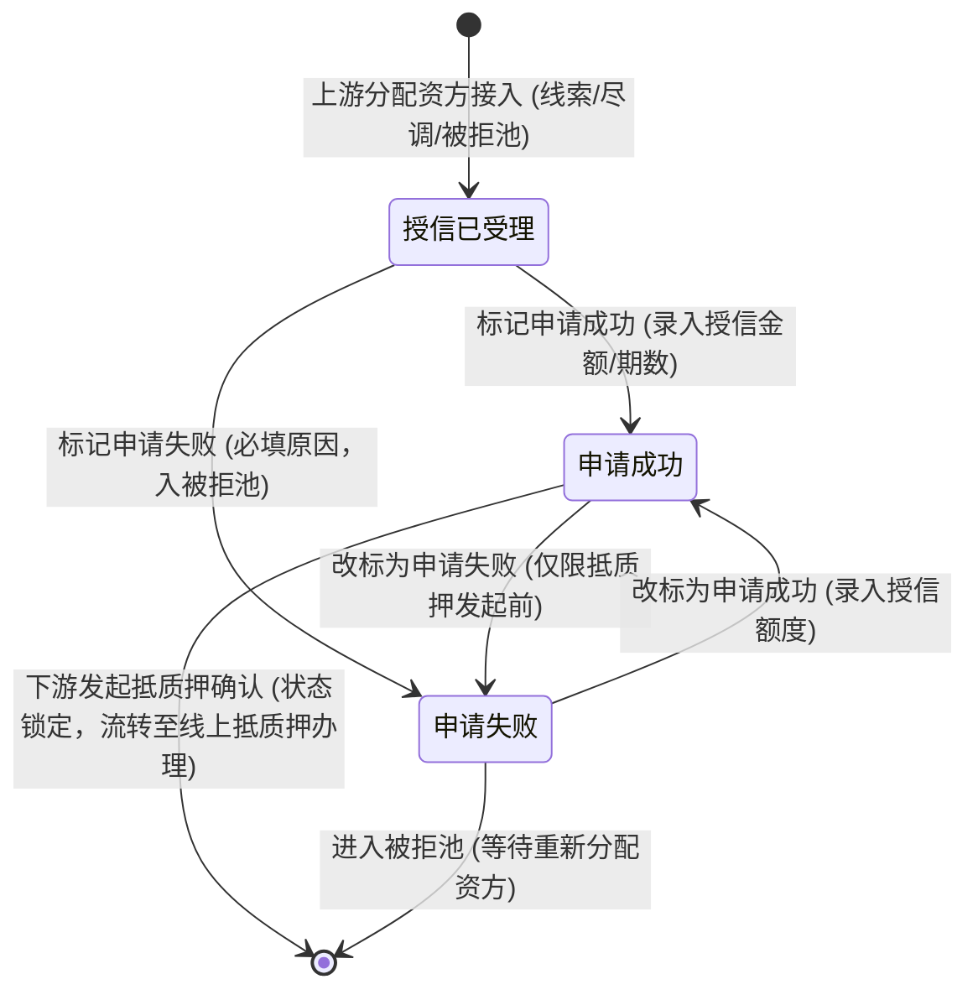
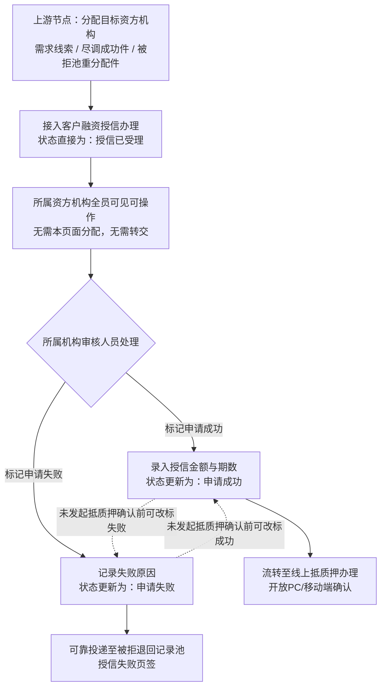

# 客户融资授信办理 业务规则规格

> **文档定位**：客户融资授信办理单据状态机、动作约束、前置校验规则、计算公式、权限与风控规则的唯一定义来源。
> **参考文档**：[客户融资授信办理主PRD.md](./客户融资授信办理主PRD.md)、[客户融资授信办理字段清单.md](./客户融资授信办理字段清单.md)、[客户融资需求线索业务规则规格](../01客户融资需求线索/客户融资需求线索业务规则规格.md)、[客户融资尽调办理业务规则规格](../02客户融资尽调办理/客户融资尽调办理业务规则规格.md)、[B-迭代需求跨文档引用口径与来源索引](../../../README.md)
> **版本**：V1.0 | 更新时间：2026-08-14 | 责任人：森云科技（Senyun Technology）

---

## 一、单据定位

| 项目 | 内容 |
| :--- | :--- |
| **单据层级** | **【第2层-资方授信/审核决策层】**（资方机构专属授信审核单据） |
| **核心职责** | 承接在上游节点（需求线索、尽调办理或被拒池）已完成指定资方机构的申请单据，由目标资方机构授权审核人员进行全员共享式风控审议，核定授信金额与期数，标记申请成功（流转抵质押）或标记申请失败（入被拒池）。 |
| **单据来源** | 1. 客户融资需求线索（需要尽调=否）直接分配资方生成； 2. 客户融资尽调办理（尽调成功）分配资方生成； 3. 被拒退回记录池（授信失败页签 / 尽调失败页签变更路由）重新分配资方生成。 |
| **上游单据** | **需求线索单**和**尽调任务单**：各 1:1 提供申请主体、融资需求、尽调结论、抵/质押物和路由快照；**被拒记录重调度任务**：1:1 提供原单据 ID、重分配动作和目标资方。来源：[客户融资需求线索业务规则规格](../01客户融资需求线索/客户融资需求线索业务规则规格.md)、[客户融资尽调办理业务规则规格](../02客户融资尽调办理/客户融资尽调办理业务规则规格.md)、[被拒退回记录池业务规则规格](../05被拒退回记录池/被拒退回记录池业务规则规格.md)。 |
| **下游影响** | 1. 标记申请成功：激活【线上抵质押办理】节点发起确认权限，固化核准授信金额与期数； 2. 标记申请失败：通过可靠投递写入【被拒退回记录池 -> 授信失败页签】。 |
| **审核流** | **【资方机构内全员共享审议】**（所属机构内任意授权审核专员均可办理，无个人独占与转交流）。 |

### 数量/金额/期数口径隔离表

| 口径名称 | 存在于 | 业务含义与公式 | 约束条件 |
| :--- | :--- | :--- | :--- |
| **意向融资金额（元）** | 申请信息区 | 客户初始填写的融资期望额度 | 只读展示，不可修改 |
| **意向融资期数** | 申请信息区 | 客户初始填写的期望融资期限 | 只读展示，正整数 |
| **授信金额（元）** | 授信核定区 | 资方机构最终审批同意授予的最高授信额度 | 标记成功时必填；`授信金额 > 0`，保留 4 位小数 |
| **授信期数** | 授信核定区 | 资方机构最终批准的最长授信期限 | 标记成功时必填；正整数（`授信期数 ≥ 1`） |
| **敞口覆盖率（参考）** | 风险测算区 | `抵/质押物参考市值 / 授信金额 × 100%` | 系统自动测算，作为资方审核参考指标 |

---

## 二、状态定义

| 状态名称 | 枚举值 (`Enum`) | 业务含义 | 是否终态 | 进入条件 | 离开条件 |
| :--- | :--- | :--- | :---: | :--- | :--- |
| **授信已受理** | `CREDIT_ACCEPTED` | 资方机构成功接入申请的初始状态，所属资方机构专员均可见待审 | 否 | 上游节点完成资方机构分配 | 标记申请成功 / 标记申请失败 |
| **申请成功** | `CREDIT_SUCCESS` | 资方审核通过，已核定授信金额与期数，等待发起抵质押确认 | 否 | 资方人员填写授信金额/期数并提交成功 | 下游发起抵质押确认 / 资方反悔改标为失败 |
| **申请失败** | `CREDIT_FAILED` | 资方审议不通过，已记录拒绝原因并入被拒池 | 否（入池待调度） | 资方人员填写拒绝原因并提交成功 | 在未发起确认前改标为成功 / 被拒池重分配新资方 |

**设计说明**：
- 接入本模块的单据已完成资方机构指定，本页面严格禁止“分配资方”与“任务转交”按钮；
- 状态变更严格禁止 Dropdown 下拉修改，必须通过弹窗动作触发。

---

## 三、状态流转图

---

## 四、状态流转表（核心规则矩阵）

| 当前状态 | 触发动作 | 前置校验条件 | 结果状态 | 二次确认弹窗 | 后置级联影响 | 失败阻断提示 (Toast) |
| :--- | :--- | :--- | :--- | :--- | :--- | :--- |
| 授信已受理 | 标记申请成功 | R01: 操作人属于单据所属资方机构且有审核权限 R02: 授信金额 > 0 且格式合规 R03: 授信期数 ≥ 1 且为正整数 | 申请成功 | 「确认给予该申请授信？授信金额：{金额} 元，期数：{期数} 期」 | ① 状态变更为“申请成功” ② 固化授信金额、授信期数、审核人与核准时间 ③ 开放【线上抵质押办理】节点发起确认功能 | Toast: 「操作失败：{授信金额必须大于0 / 授信期数必须为正整数 / 无权操作}」 |
| 授信已受理 | 标记申请失败 | R01: 操作人属于单据所属资方机构 R04: 失败原因必填（≤300字） | 申请失败（入池） | 「确认拒绝该授信申请？拒绝后将进入被拒记录池」 | ① 状态变更为“申请失败” ② 记录拒绝资方机构、审核人与拒绝原因 ③ 通过事务内 Outbox 可靠投递至【被拒退回记录池 -> 授信失败页签】 | Toast: 「操作失败：请填写失败原因」 |
| 申请成功 | 改标为申请失败 | R05: 抵质押节点状态为“申请成功”（尚未发起抵质押确认）；填写改标原因 | 申请失败（入池） | 「当前申请尚未进入抵质押，确认改标为申请失败？」 | ① 状态反转为“申请失败” ② 废止已核定授信金额 ③ 写入【被拒退回记录池 -> 授信失败页签】 | Toast: 「改标失败：下游抵质押已进入办理流程，状态已锁定」 |
| 申请失败 | 改标为申请成功 | R01: 操作人属于单据所属资方机构 R02/R03: 重新填报合规授信金额与期数；当前批次尚未被被拒池重调度 | 申请成功 | 「确认重新改标为申请成功？核准授信：{金额} 元」 | ① 状态反转为“申请成功” ② 将对应被拒池记录标记为已处理（不得物理删除） ③ 开放抵质押发起入口 | Toast: 「改标失败：数据已被其他人员重调度」 |

---

## 五、动作能力矩阵

| 操作动作 | 授信已受理 (`CREDIT_ACCEPTED`) | 申请成功 (`CREDIT_SUCCESS`) | 申请失败 (`CREDIT_FAILED`) | 抵质押处理中（下游已发起） |
| :--- | :---: | :---: | :---: | :---: |
| **查看详情（机构全员）** | ✅ | ✅ | ✅ | ✅ |
| **标记申请成功** | ✅ | ❌ | ✅（改标） | ❌ |
| **标记申请失败** | ✅ | ✅（改标） | ❌ | ❌（强行锁定） |
| **下载尽调/申请材料** | ✅ | ✅ | ✅ | ✅ |

---

## 六、前置业务校验规则（R01~R05）

### R01：资方机构归属与全员共享
- 当前登录用户的所属机构 ID 必须与单据中的 `target_funder_id`（目标资方机构 ID）严格一致；
- 同一资方机构内的所有拥有 `[授信·审核]` 权限的账号均享有平等的查看与审批权，不设单人独占锁。

### R02：授信金额合规校验
- 授信金额必须输入合法数字，保留最多 4 位小数，允许大于、等于或小于客户的“意向融资金额”，但必须满足 `授信金额 > 0`。

### R03：授信期数合规校验
- 授信期数必须为 $\ge 1$ 的正整数，不可输入小数、负数或 0。

### R04：拒绝原因必录与历史保留
- 资方标记失败必须在弹窗中选择失败主因分类（如：主体资质不符、存货估值不足、敞口超限、政策性拒单等）并填写文字说明；系统完整保留该资方的历史拒单记录。

### R05：改标防穿透与抵质押状态联动锁
- 资方在申请成功与申请失败之间互相改标前，后端必须同步向【线上抵质押办理】节点发起状态探针：
  - 若抵质押节点状态为“申请成功”（尚未发起抵质押确认），允许改标；
  - 若抵质押节点状态已变为“处理中/已放款/已结清”，系统强行阻断改标，提示“抵质押业务已在办理中，无法更改授信决策”。

---

## 七、计算公式与口径（C01）

### C01：资方授信额度利用率测算
- **额度利用率（预估）**：$$\text{预估额度利用率} = \min\left(100\%, \frac{\text{意向融资金额}}{\text{核准授信金额}} \times 100\%\right)$$
- 仅作为资方风控审批界面的辅助参考卡片展示。

---

## 八、权限、风控与安全控制（P01~P02 / W01~W02）

### P01：严格的多租户资方数据隔离
- 数据库查询采用机构租户强隔离过滤（`WHERE funder_org_id = :current_user_org_id`），资方 A 账号绝对无法检索、查看或导出资方 B 的授信单据。

### P02：关键操作审计轨迹
- 标记成功、标记失败及多次改标操作，系统均独立插入一条带有处理人姓名、角色、时间戳及操作前后数据镜像的审计日志。

### W01：机构内防并发抢单锁
- 当同机构内两名审核员同时打开单据详情并提交不同结论时，系统依据单据乐观锁版本号（`version`）控制，先提交者成功，后提交者 Toast 提示：“单据已被同事处理，请刷新查看最新状态”。

### W02：防数据篡改签名
- 授信金额核定后，系统对关键要素（客户ID + 资方ID + 授信金额 + 期数 + 审批时间戳）生成 SHA-256 数据指纹，供下游线上抵质押校验防篡改。

---

## 业务流程与联动

> 以下内容由原《客户融资授信办理业务流程》合并，与上文规则 ID 配合阅读；重复的状态机定义以上文为准。

## 一、业务流程说明

1. 上游节点（线索分配资方、尽调成功分配资方、被拒池重分配资方）在指派目标资方机构后，单据直接进入【客户融资授信办理】菜单，初始接入状态即为“授信已受理”。
2. 本菜单界面内无“分配资方机构”按钮，无“任务转交”功能。
3. 所属资方机构内所有授权审核人员均可查看列表并协同处理，任意审核人员均可执行：
   - **标记申请成功**：输入核准授信金额与授信期数，主单据状态更新为“申请成功”，进入线上抵质押办理；
   - **标记申请失败**：记录失败原因，主单据状态更新为“申请失败”，通过可靠投递写入【被拒退回记录池 -> 授信失败页签】。
4. 在未发起抵质押确认前，所属机构授权审核人员支持互相改标（申请成功 $\leftrightarrow$ 申请失败）。

---

## 二、业务流程图

## 修订记录

| 日期 | 版本 | 变更 |
| :--- | :---: | :--- |
| 2026-08-20 | — | 合并原《客户融资授信办理业务流程》至本文件「业务流程与联动」章节 |
