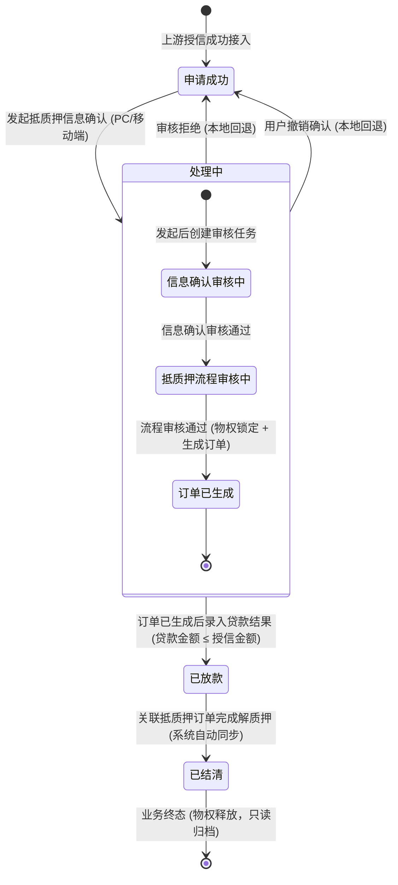
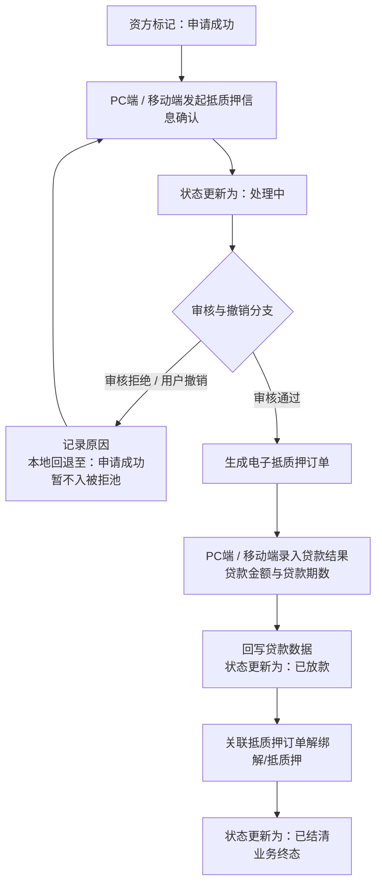

# 线上抵质押办理 业务规则规格

> **文档定位**：线上抵质押办理单据状态机、动作约束、前置校验规则、计算公式、权限与风控规则的唯一定义来源（Single Source of Truth）。
> **参考文档**：[线上抵质押办理主PRD.md](./线上抵质押办理主PRD.md)、[线上抵质押办理字段清单.md](./线上抵质押办理字段清单.md)、[客户融资授信办理业务规则规格](../03客户融资授信办理/客户融资授信办理业务规则规格.md)、[B-迭代需求跨文档引用口径与来源索引](../../../README.md)
> **版本**：V1.0 | 更新时间：2026-08-14 | 责任人：森云科技（Senyun Technology）

---

## 一、单据定位

| 项目 | 内容 |
| :--- | :--- |
| **单据层级** | **【第3层-物权锁定/执行放款层】**（物权质押与贷款落地执行单据） |
| **核心职责** | 承接资方授信成功的融资单据，支持在 PC 端或移动端发起抵质押信息确认、质押物锁定核验、生成正式抵质押订单、录入贷款放款结果，并根据还款/解押完成情况同步单据终态结清。 |
| **单据来源** | 客户融资授信办理（标记申请成功）流转接入。 |
| **上游单据** | **授信通过单据**：1:1 提供授信金额、期限、申请主体和可办理路由；**底层可用存货/数字仓单**：1:N 提供存货/仓单 ID、货品、数量、仓库位置、货权状态和可质押价值。来源：[客户融资授信办理业务规则规格](../03客户融资授信办理/客户融资授信办理业务规则规格.md)；存货、仓单主档字段在当前 B 迭代需求中未形成独立 SSOT，需由仓储/仓单模块补充。 |
| **下游影响** | 1. 发起确认与审核通过：锁定存货/仓单（标记“质押中”），生成【抵质押订单】； 2. 录入放款结果：回写各节点“贷款金额/贷款期数”，状态置为“已放款”； 3. 订单解质押：触发融资单据状态自动同步为“已结清”（业务终态）。 |
| **审核流** | **【支持 PC + 移动端双端发起与审核】**（支持本地回退机制）。 |

### 数量/金额/期数口径隔离表

| 口径名称 | 存在于 | 业务含义与公式 | 约束条件 |
| :--- | :--- | :--- | :--- |
| **授信金额（元）** | 授信基准 | 上游资方核准的最高授信额度 | 只读基准；贷款金额的绝对上限 |
| **授信期数** | 授信基准 | 上游资方核准的最长授信期限 | 只读基准；贷款期数的上限参考 |
| **贷款金额（元）** | 贷款结果录入 | 银行/资方实际打款到账的贷款本金 | 手工录入；`0 < 贷款金额 ≤ 授信金额`，保留 4 位小数 |
| **贷款期数** | 贷款结果录入 | 借款合同正式约定的贷款期数 | 手工录入；正整数（`1 ≤ 贷款期数 ≤ 授信期数`） |
| **质押率（%）** | 风险测算区 | `贷款金额 / 质押存货评估总货值 × 100%` | 系统自动测算；必须 $\le$ 资方预设质押率上限（如 70%） |

---

## 二、状态定义

| 状态名称 | 枚举值 (`Enum`) | 业务含义 | 是否终态 | 进入条件 | 离开条件 |
| :--- | :--- | :--- | :---: | :--- | :--- |
| **申请成功** | `CREDIT_SUCCESS` | 授信已通过，处于“待发起抵质押信息确认”的就绪状态 | 否 | 上游授信成功接入，或本节点审核拒绝/撤销后本地回退 | 发起抵质押信息确认成功（进入处理中） |
| **处理中** | `IN_PROCESSING` | 已发起抵质押确认，正在进行信息复核、物权锁定及订单生成；内部审核节点不单独写入本字段 | 否 | 在 PC 或移动端点击“发起抵质押确认”成功 | 订单生成后录入放款结果 / 审核拒绝或撤销（本地回退至申请成功） |
| **已放款** | `LOAN_DISBURSED` | 抵质押订单已成功开立，贷款资金已录入发放，存货/仓单处于强锁定中 | 否 | 录入贷款金额与期数成功 | 关联抵质押订单全部解质押（进入已结清） |
| **已结清** | `SETTLED` | 借款人还款完毕，抵质押物权已全额解绑释放，融资业务完整闭环 | **是** | 关联抵质押订单解质押完成，系统自动触发同步 | — （不可逆，业务终态） |

---

## 三、状态流转图

> **内部节点说明**：`信息确认审核中`、`抵质押流程审核中`、`订单已生成`仅用于记录“处理中”状态下的发起后置流程与操作履历，不新增或改变字段清单中的融资状态枚举；订单已生成但尚未完成放款结果录入时，外部融资状态仍为“处理中”。

---

## 四、状态流转表（核心规则矩阵）

| 当前状态 | 触发动作 | 前置校验条件 | 结果状态 | 二次确认弹窗 | 后置级联影响 | 失败阻断提示 (Toast) |
| :--- | :--- | :--- | :--- | :--- | :--- | :--- |
| 申请成功 | 发起抵质押信息确认 | R01：操作人具备发起权限；押品处于可用/未被其他订单锁定状态 | 处理中 | 「确认发起抵质押信息确认？发起后将锁定质押存货」 | ① 状态更新为“处理中” ② 锁定底层存货或仓单 ③ 创建抵质押业务审核任务 | Toast: 「发起失败：{质押货物已被占用 / 存货状态异常}」 |
| 处理中 | 用户主动撤销 | R02: 尚未生成正式抵质押订单；撤销原因必填 | 申请成功（本地回退） | 「确认撤销该确认任务？撤销后将释放质押物锁定」 | ① 状态回退为“申请成功” ② 调用库存/仓单引擎解除临时锁定 ③ 记录撤销日志，允许重新发起 | Toast: 「撤销失败：订单已开立，无法撤销」 |
| 处理中 | 审核拒绝 | 审核人具备权限；拒绝原因必填（≤300字） | 申请成功（本地回退） | 「确认拒绝该抵质押确认任务？拒绝后将回退并释放锁定」 | ① 状态回退为“申请成功” ② 释放质押物临时锁定 ③ 记录审核意见，允许修改后再次发起 | Toast: 「拒绝失败：请填写审核拒绝原因」 |
| 处理中 | 订单生成失败或超时 | 审核已通过；订单接口返回失败或在超时窗口内无响应 | 处理中 | 无 | ① 保留“处理中”状态与失败原因 ② 释放未成功落单的临时锁定 ③ 生成可重试任务；重试必须幂等，不得重复生成订单 | Toast: 「订单生成失败：请稍后重试」 |
| 处理中 | 录入贷款结果 | R03: 0 < 贷款金额 ≤ 授信金额 R04: 1 ≤ 贷款期数 ≤ 授信期数 R05: 订单已成功开立且通过并发版本校验 | 已放款 | 「确认录入放款结果？放款金额：{金额} 元」 | ① 状态更新为“已放款” ② 存货状态正式置为“质押中” ③ 异步回写全流程各节点贷款金额与期数 | Toast: 「录入失败：{贷款金额不可大于授信金额 / 贷款期数不合规}」 |
| 已放款 | 订单解质押同步 | 关联的抵质押订单在仓储端完成解质押 | 已结清 | 无（系统自动） | ① 状态自动更新为“已结清” ② 固化结清时间戳 ③ 锁定全字段，归档只读 | 记录系统异步同步告警，支持定时任务补偿 |

---

## 五、动作能力矩阵

| 操作动作 | 申请成功（待发起） | 处理中（审核/办理） | 已放款 | 已结清（终态） |
| :--- | :---: | :---: | :---: | :---: |
| **查看详情（PC/移动端）** | ✅ | ✅ | ✅ | ✅ |
| **发起抵质押确认（PC/移动端）** | ✅ | ❌ | ❌ | ❌ |
| **审核抵质押任务（PC/移动端）** | ❌ | ✅ | ❌ | ❌ |
| **用户主动撤销（PC/移动端）** | ❌ | ✅（未生成订单前） | ❌ | ❌ |
| **录入放款结果（PC/移动端）** | ❌ | ✅（订单生成后） | ❌ | ❌ |
| **导出台账与打印单据** | ✅ | ✅ | ✅ | ✅ |

---

## 六、前置业务校验规则（R01~R06）

### R01：质押标的可用性强校验
- 发起抵质押确认时，系统强校验关联的存货明细或仓单编号状态：
  - 存货必须处于“存货中”，且可用库存 $\ge$ 申请质押数量；
  - 仓单必须处于“有效未质押”状态，禁止对已被冻结、在途或已被其他质押单绑定的资产重复质押（MECE 原则）。
- 执行发起动作的账号还必须具备 `[抵质押·发起确认]` 权限。

### R02：本地回退机制
- 本期抵质押异常件（用户主动撤销、流程审核拒绝）暂不流向【被拒退回记录池】，统一在本地回退至“申请成功”状态，保障业务在发生资料微调时可快速再次发起。

### R03：贷款金额与授信额度强约束
- 录入放款结果时，系统实施强校验：`0 < 贷款金额 <= 授信金额`。若录入金额超过授信额度，前端红字阻断并拦截提交。

### R04：贷款期数强约束
- 贷款期数必须为正整数，且必须满足 `1 <= 贷款期数 <= 授信期数`。

### R05：双端防并发版本锁
- PC 端与移动端交叉并发操作时，后端基于单据 `version` 版本号进行 CAS 乐观锁校验，先到达服务器的请求生效，后到达请求提示“单据状态已被更新，请刷新”。

### R06：订单状态单向终态锁定
- 一旦进入“已结清”状态，单据全量字段永久锁定，禁止任何形式的人工逆向修改或重新激活。

---

## 七、计算公式与风控阈值（C01~C02）

### C01：初始质押率与货值测算公式
- **质押物总货值**：$$\text{质押物总货值} = \sum (\text{质押数量} \times \text{基准单价})$$
- **初始质押率**：$$\text{质押率} = \frac{\text{贷款金额}}{\text{质押物总货值}} \times 100\%$$

### C02：动态预警线与平仓线货值计算
- **警戒线货值**：$$\text{警戒线货值} = \frac{\text{贷款金额}}{\text{警戒质押率（如 80\%）}}$$
- **平仓线货值**：$$\text{平仓线货值} = \frac{\text{贷款金额}}{\text{平仓质押率（如 90\%）}}$$
- 实时货值跌破警戒线/平仓线时，自动向风控看板与资金方推送补仓/处置预警。

---

## 八、权限、风控与安全控制（P01~P02 / W01~W02）

### P01：双端 RBAC 权限控制
- `[抵质押·发起确认]`：借款客户经办人、平台业务专员；
- `[抵质押·审核]`：监管运营主管、资方风控专员；
- `[抵质押·放款录入]`：资方账务专员、资金结算专员。

### P02：物权操作全路径审计
- 记录存货/仓单锁定与解锁的精确时间戳、操作人、关联单据号及底层库存变动流水。

### W01：物权防双花机制
- 存货或仓单在被锁定时，数据库在资产表打上 `lock_biz_type='FINANCE_PLEDGE'` 与 `lock_biz_id`，底层严禁任何出库、移库或重复抵押操作。

### W02：异步补偿与状态对账
- 每小时执行对账定时任务，扫描“已放款”单据与仓储抵质押订单解绑状态，发现解押完成但未结清的单据自动触发结清补偿流。

---

## 业务流程与联动

> 以下内容由原《线上抵质押办理业务流程》合并，与上文规则 ID 配合阅读；重复的状态机定义以上文为准。

## 一、业务流程说明

1. 资方标记“申请成功”后，客户或授权业务人员可在 **PC 端或移动端** 发起抵质押信息确认，状态变更为“处理中”。
2. 在处理中阶段，抵质押业务人员进行信息确认审核与抵质押流程审核（支持 PC 端及移动端）：
   - **审核通过**：系统自动生成电子抵质押订单；
   - **审核拒绝**：记录拒绝原因，本期**本地回退至“申请成功”状态**（暂不入被拒池）。
3. 在处理中阶段，用户或授权人员亦可在 **PC 端或移动端** 发起主动撤销，记录撤销原因，本期**本地回退至“申请成功”状态**（暂不入被拒池）。
4. 订单生成后，授权人员在 **PC 端或移动端** 录入贷款金额与贷款期数（贷款金额 $\le$ 授信金额），提交后主单据状态更新为“已放款”。
5. 关联抵质押订单解绑（变为解/抵质押状态）后，系统自动同步融资状态更新为“已结清”（业务终态）。

---

## 二、业务流程图

## 修订记录

| 日期 | 版本 | 变更 |
| :--- | :---: | :--- |
| 2026-08-20 | — | 合并原《线上抵质押办理业务流程》至本文件「业务流程与联动」章节 |
