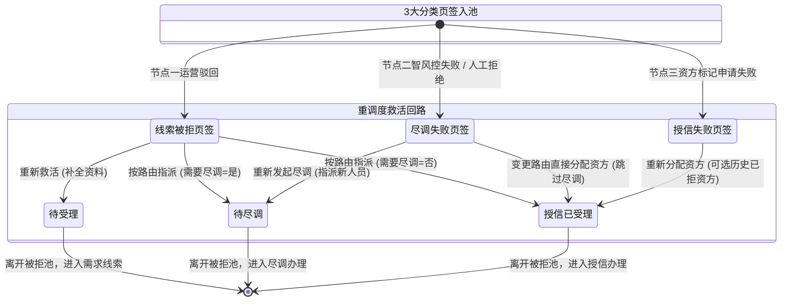
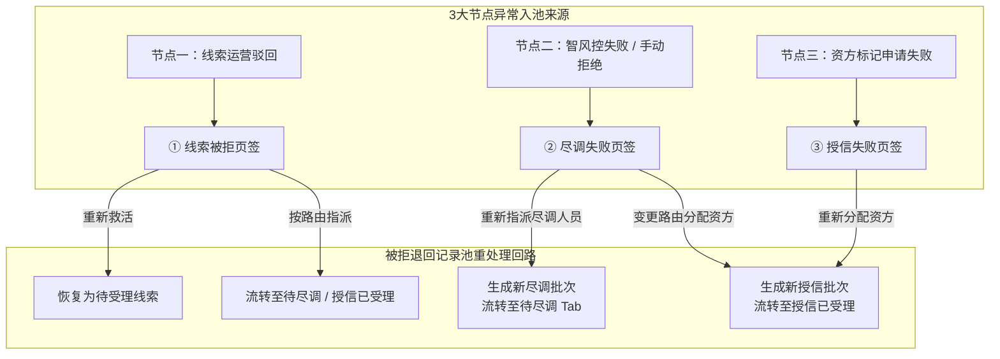

# 被拒退回记录池 业务规则规格

> **文档定位**：被拒退回记录池状态机、动作约束、前置校验规则、计算公式、权限与风控规则的唯一定义来源（Single Source of Truth）。
> **参考文档**：[被拒退回记录池主PRD.md](./被拒退回记录池主PRD.md)、[被拒退回记录池字段清单.md](./被拒退回记录池字段清单.md)、[客户融资需求线索业务规则规格](../01客户融资需求线索/客户融资需求线索业务规则规格.md)、[客户融资尽调办理业务规则规格](../02客户融资尽调办理/客户融资尽调办理业务规则规格.md)、[客户融资授信办理业务规则规格](../03客户融资授信办理/客户融资授信办理业务规则规格.md)、[B-迭代需求跨文档引用口径与来源索引](../../../README.md)
> **版本**：V1.0 | 更新时间：2026-08-14 | 责任人：森云科技（Senyun Technology）

---

## 一、单据定位

| 项目 | 内容 |
| :--- | :--- |
| **单据层级** | **【第2层-异常归集/重调度控制层】**（全系统统一的异常监控与重调度单据） |
| **核心职责** | 集中收口融资管理前 3 个节点（需求线索、尽调办理、授信办理）产生的驳回、失败与拒绝件，划分为 **3 大分类页签** 进行集中监控、追溯审计与二次重调度救活，防止业务线索流失与死锁。 |
| **单据来源** | 1. 客户融资需求线索（运营驳回）自动写入； 2. 客户融资尽调办理（智风控失败 / 手动拒绝）自动写入； 3. 客户融资授信办理（资方标记申请失败）自动写入。 |
| **上游单据** | **客户融资需求线索、客户融资尽调办理、客户融资授信办理**产生的驳回/失败单据，按来源单据 1:1 镜像保留原单据 ID、来源节点、失败原因、原状态、主体和融资快照；重处理时只新增处理记录，不覆盖原始失败快照。来源：上述三个业务规则规格。 |
| **下游影响** | 根据重处理动作将申请重新激活并分流至目标模块： 1. 重新救活：恢复为“待受理”，重新进入需求线索分配池； 2. 按路由重新指派：流转至【客户融资尽调办理】或【客户融资授信办理】； 3. 重新发起尽调：生成新尽调批次，推送到【客户融资尽调办理】待尽调 Tab； 4. 重新分配资方：生成新授信批次，推送到【客户融资授信办理】授信已受理。 |
| **审核流** | **【平台运营专员/风控主管直接重调度】**（免审批流，直接派发新批次）。 |

### 数量/金额/期数口径隔离表

| 口径名称 | 存在于 | 业务含义与公式 | 约束条件 |
| :--- | :--- | :--- | :--- |
| **意向融资金额（元）** | 记录主表 | 继承自原始申请金额 | 只读展示，支持救活时修改资料重算 |
| **意向融资期数** | 记录主表 | 继承自原始申请期数 | 只读展示，正整数 |
| **重调度批次号 (`batch_no`)** | 系统生成 | 记录该单据在被拒池经历的重调度轮次（`V1`, `V2`, ...） | 系统自动递增，永久留存历史履历 |
| **历史被拒次数** | 聚合统计 | 该客户在全平台历史被驳回/拒绝的累计总次数 | 系统自动统计，辅助运营判断是否值得救活 |

---

## 二、状态定义与 3 大分类页签划分

页面划分为 **3 大分类页签**，各页签独立管理对应异常来源的状态与重处理回路：

| 所在页签 | 异常来源类型 | 初始入池状态 | 支持的重处理动作 | 调度流转结果状态 |
| :--- | :--- | :--- | :--- | :--- |
| **① 线索被拒页签** | 需求线索运营驳回件 | `申请失败` | 1. **【重新救活】** 2. **【按路由重新指派】** | 1. 恢复为 `待受理` 线索 2. 流转至 `待尽调` / `授信已受理` |
| **② 尽调失败页签** | 智风控不通过 / 尽调专员手动拒绝件 | `受理失败` / `申请失败` | 1. **【重新发起尽调】** 2. **【变更路由直接分配资方】** | 1. 生成新尽调批次流转至 `待尽调` 2. 生成新授信批次流转至 `授信已受理` |
| **③ 授信失败页签** | 资方机构标记申请失败件 | `申请失败` | **【重新分配资方】** | 生成新授信批次，流转至 `授信已受理` |

**设计说明**：
- 被拒池不设单据物理删除，所有重调度均生成新子批次流转，旧批次保留作历史追溯；
- 本期抵质押异常件暂不入池，由抵质押模块本地回退处理。

---

## 三、状态流转图

---

## 四、状态流转表（核心规则矩阵）

| 当前页签 | 触发动作 | 前置校验条件 | 结果状态 | 二次确认弹窗 | 后置级联影响 | 失败阻断提示 (Toast) |
| :--- | :--- | :--- | :--- | :--- | :--- | :--- |
| **① 线索被拒** | 重新救活 | R01: 申请资料已补充/修改合规 | 待受理（主流程） | 「确认救活该线索？救活后将恢复为待受理线索重新进入分配池」 | ① 移出被拒池 ② 原线索状态更新为“待受理” ③ 记录救活日志 | Toast: 「救活失败：资料不满足提交要求」 |
| **① 线索被拒** | 按路由重新指派 | R02: 需要尽调=是且已选尽调人员；或需要尽调=否且已选有效资方 | 流转下游 | 「确认重新指派流转？」 | ① 移出被拒池 ② 按路由生成待尽调或授信已受理任务 ③ 记录指派日志 | Toast: 「指派失败：请选择有效指派对象」 |
| **② 尽调失败** | 重新发起尽调 | R03: 目标尽调专员处于启用状态 | 待尽调（主流程） | 「确认重新指派尽调人员？将生成新尽调批次」 | ① 移出被拒池 ② 创建第 N 轮尽调新任务，推送至尽调办理【待尽调 Tab】 ③ 记录重新指派日志 | Toast: 「发起失败：请选择有效尽调专员」 |
| **② 尽调失败** | 变更路由直接分配资方 | R04: 目标资方处于启用状态；风控主管特批确认 | 授信已受理（主流程） | 「确认跳过尽调直接分配给资方？」 | ① 移出被拒池 ② 变更路由快照为“需要尽调=否” ③ 生成授信已受理任务推送到【客户融资授信办理】 | Toast: 「分配失败：请选择有效资方」 |
| **③ 授信失败** | 重新分配资方 | R05: 目标资方有效；R06: 历史已拒资方可选 | 授信已受理（主流程） | 「确认分配给资方：{机构名称}？将生成新授信批次」 | ① 移出被拒池 ② 生成新授信任务，推送至【客户融资授信办理】（原尽调结论继续生效） ③ 记录资方调度履历 | Toast: 「分配失败：请选择有效资方」 |

---

## 五、动作能力矩阵

| 操作动作 | ① 线索被拒页签 | ② 尽调失败页签 | ③ 授信失败页签 |
| :--- | :---: | :---: | :---: |
| **查看详情与拒绝历史** | ✅ | ✅ | ✅ |
| **重新救活（恢复为待受理）** | ✅ | ❌ | ❌ |
| **按路由重新指派（转尽调/资方）**| ✅ | ❌ | ❌ |
| **重新发起尽调（指派新人员）** | ❌ | ✅ | ❌ |
| **变更路由直接分配资方** | ❌ | ✅ | ❌ |
| **重新分配资方（可选已拒资方）** | ❌ | ❌ | ✅ |
| **导出异常分析台账** | ✅ | ✅ | ✅ |

---

## 六、前置业务校验规则（R01~R06）

### R01：3 大页签精准收口分类
- 系统依据单据触发被拒/失败时的节点类型强行分流归集：
  - 节点一（线索） $\to$ 【① 线索被拒页签】；
  - 节点二（尽调） $\to$ 【② 尽调失败页签】；
  - 节点三（授信） $\to$ 【③ 授信失败页签】。
- 各页签仅展示对应类型的记录，禁止跨页签混合展示。

### R02：授信失败重调度专属规则
- 【授信失败页签】严格仅提供【重新分配资方】动作；
- 资方拒绝仅代表该特定资方的风控偏好或额度限制，原先完成的尽调报告与信用结论继续保持有效，重新分配新资方时无需重新走一遍尽调流程。

### R03：历史已拒资方可选规则
- 在【授信失败页签】或【尽调失败变更路由】执行“分配资方”时，资方机构选择器展示全量有效资方；
- 历史曾经拒绝过该客户的资方机构**不置灰、不禁止选择**（但在资方名称旁标注“*历史曾拒”提示），以满足客户补强担保后向原资方再次申请的实际业务需求。

### R04：多轮重调度批次历史与审计不可篡改
- 每次从被拒池成功重调度流转后，系统自动生成新的业务流水批次号（如 `clue_id-B02`），旧批次的拒绝时间、拒绝资方/人员、拒绝原因永久只读留痕，禁止任何覆盖或物理删除。

### R05：抵质押异常暂不入池
- 本期抵质押异常件暂不接入被拒池，由抵质押模块本地回退处理。

### R06：防重复重调度锁
- 运营人员在点击重调度弹窗确认时，系统对该被拒记录加互斥锁，避免多人并发同时对同一笔异常件分派给不同人员/资方。

---

## 七、计算公式与统计口径（C01~C02）

### C01：被拒停滞时长计算口径
- **停滞时长**：$$\text{停滞时长} = \text{当前时间} - \text{入池时间戳}$$
- 停滞时长超过 72 小时未处理时，列表展示红色“超期未调度”警示标签。

### C02：拒单率与挽回率指标
- **异常挽回率**：$$\text{挽回率} = \frac{\text{从被拒池重调度后最终放款成功的单据数}}{\text{被拒池历史累计入池总单据数}} \times 100\%$$

---

## 八、权限、风控与安全控制（P01~P02 / W01~W02）

### P01：重调度专职权限控制
- `[被拒池·查看]`：平台运营人员、风控专员；
- `[被拒池·重调度操作]`：仅限平台运营主管、首席风控官角色拥有执行权限。

### P02：跨资方拒绝原因隐私脱敏
- 在向新资方重新分配时，旧资方的内部审核评语与批注仅限平台运营内部可见，禁止向新资方机构泄露旧资方的内部商业审批备注。

### W01：重调度分布式锁
- 重调度请求执行时锁定 `clue_id`，防止网络抖动导致的重复生成下游任务。

### W02：流转熔断机制
- 单笔线索累计进入被拒池超过 5 次时，系统自动触发熔断，锁定该线索禁止再次救活，需线下发起特批工单解除锁定。

---

## 业务流程与联动

> 以下内容由原《被拒退回记录池业务流程》合并，与上文规则 ID 配合阅读；重复的状态机定义以上文为准。

## 一、业务流程说明

1. 融资管理前 3 个节点（需求线索、尽调办理、授信办理）产生的失败、驳回及拒绝件，根据退回节点自动路由归集至【被拒退回记录池】对应的 **3 大分类页签**。
2. 运营人员进入被拒池，按 3 大页签分类进行重处理：
   - **① 线索被拒页签**：支持执行【重新救活】（修改/补全申请资料后恢复为“待受理”重新进入分配池），或【按路由重新指派】（需要尽调=是：转尽调；需要尽调=否：直接分配资方）；
   - **② 尽调失败页签**：执行【重新发起尽调】（重新指派尽调人员生成新批次流转至待尽调 Tab），或执行【变更路由直接分配资方】（流转至授信已受理）；
   - **③ 授信失败页签**：专门进行【重新分配资方】（选择新资方或历史已拒资方，生成新授信批次流转至授信已受理，尽调结论继续有效）。

---

## 二、业务流程图

## 修订记录

| 日期 | 版本 | 变更 |
| :--- | :---: | :--- |
| 2026-08-20 | — | 合并原《被拒退回记录池业务流程》至本文件「业务流程与联动」章节 |
