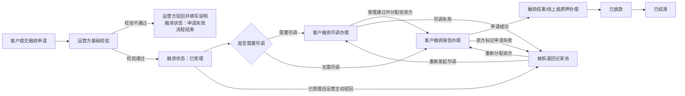
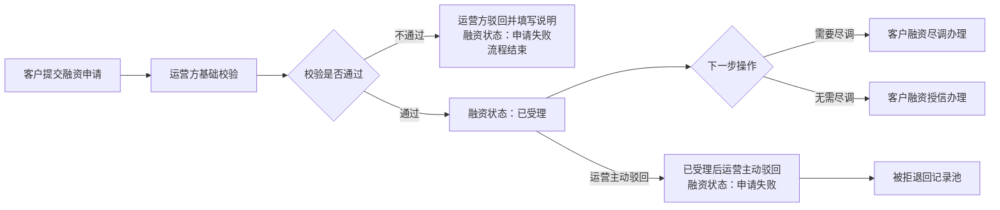
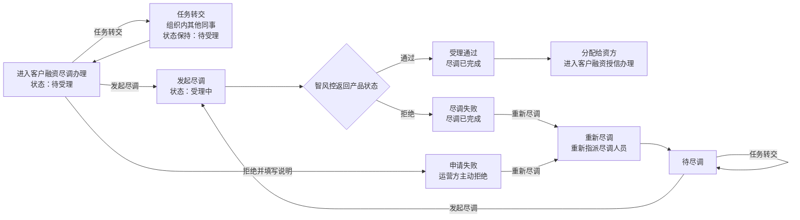
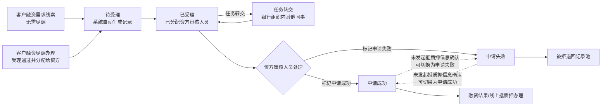
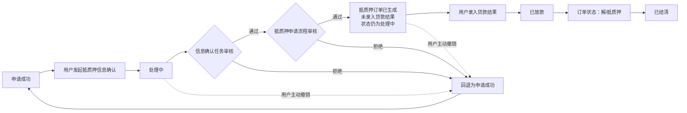
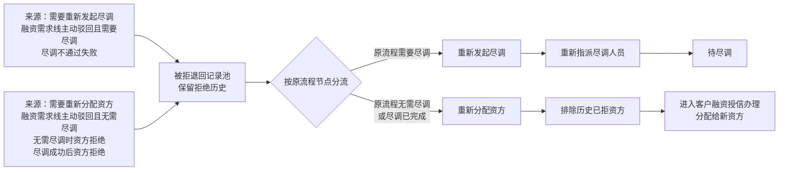

# 融资管理业务流程

版本：V1.0  
日期：2026-08-05  
适用范围：客户融资需求线索、客户融资尽调办理、客户融资授信办理、融资结果/线上抵质押办理、被拒退回记录池

## 一、流程边界

融资管理完成客户融资需求受理、可选尽调、资方审核、抵质押业务办理和贷款结果回写，不替代资方内部授信系统、贷款还款及核销流程。

### 1.1 统一业务原则

| 规则 | 口径 |
|---|---|
| 客户融资需求线索基础校验不通过 | 运营方驳回并填写说明，融资状态为“申请失败”，流程结束且不进入被拒退回记录池 |
| 客户融资需求线索已受理后的运营主动驳回 | 融资状态为“申请失败”，进入被拒退回记录池，不直接结束 |
| 资方审核人员标记申请失败 | 进入被拒退回记录池 |
| 资方处理 | 不设置“接单”动作；任务分配后状态为“已受理” |
| 资方任务转交 | 仅转交给资方组织内其他同事，状态保持不变 |
| 资方处理超时 | 当前流程不设置超时分支 |
| 客户申请撤回 | 线索、尽调、授信办理阶段不设置；抵质押办理“处理中”阶段按业务规则支持用户主动撤销并回退为“申请成功” |
| 被拒退回记录池 | 仅保留重新发起尽调、重新分配资方两类处理路径，暂不设置无可用资方或终止处理分支 |

### 1.2 线索字段承接

各下游板块继承“客户融资需求线索”字段，包括产品名称、申请人信息、抵/质押物、意向融资金额、意向融资期数、附件资料、存货明细、仓单编号、申请时间、处理人和处理时间。

授信办理完成后回写授信金额、授信期数；贷款结果录入后回写贷款金额、贷款期数。

## 二、全局流程

## 三、客户融资需求线索

### 3.1 流程规则

1. 客户提交融资申请，系统生成客户融资需求线索。
2. 运营方进行基础校验。
3. 校验不通过时，运营方驳回并填写说明，融资状态更新为“申请失败”，流程结束且不进入被拒退回记录池。
4. 校验通过后，融资状态更新为“已受理”。
5. 运营方根据申请提交时保存的尽调配置快照选择下一步：需要尽调进入“客户融资尽调办理”，无需尽调进入“客户融资授信办理”。
6. 线索已受理后，运营方仍可主动驳回；融资状态更新为“申请失败”，该类驳回进入“被拒退回记录池”，不直接结束。

### 3.2 流程图

### 3.3 关键字段

客户融资需求线索使用字段清单中的产品名称、申请人类型、申请人名称、申请人标识、申请人电话、申请人身份证号、营业执照、经办人信息、抵/质押物、意向融资金额、意向融资期数、附件资料、存货明细、仓单编号、申请时间、处理人、处理时间和融资状态。

## 四、客户融资尽调办理

### 4.1 状态及操作

| 状态 | 说明 | 可用操作 |
|---|---|---|
| 待受理 | 尽调任务尚未发起 | 发起尽调、拒绝、任务转交 |
| 受理中 | 已发起尽调，智风控尚未返回最终状态 | 发起尽调 |
| 受理通过 | 智风控返回产品状态为通过 | 下载资料、分配给资方 |
| 尽调失败 | 智风控返回产品状态为拒绝，尽调已完成 | 下载资料、重新尽调 |
| 申请失败 | 尽调列表中运营方主动拒绝后的状态 | 重新尽调 |
| 待尽调 | 重新指派尽调人员后，等待再次发起尽调 | 发起尽调、任务转交 |

“任务转交”指转交给尽调组织内其他同事；“重新尽调”必须重新指派尽调人员，完成后进入“待尽调”。

### 4.2 流程图

## 五、客户融资授信办理

### 5.1 流程规则

1. 入口一：客户融资需求线索无需尽调，进入授信办理。
2. 入口二：客户融资尽调办理受理通过并分配给资方，进入授信办理。
3. 系统先生成“待受理”记录，再将任务分配至资方审核人员，融资状态为“已受理”。
4. “已受理”不设置资方接单动作；资方审核人员可以任务转交给组织内其他同事。
5. 资方审核人员可以主动标记申请成功或申请失败。
6. 申请成功后进入融资结果/线上抵质押办理。
7. 资方标记申请失败后，进入被拒退回记录池。
8. 在尚未发起抵质押信息确认前，申请成功与申请失败允许相互切换。

### 5.2 流程图

## 六、融资结果 / 线上抵质押办理

### 6.1 状态规则

| 状态 | 进入条件 | 后续规则 |
|---|---|---|
| 申请成功 | 资方审核人员标记申请成功，或处理中异常回退 | 用户可以发起抵质押信息确认 |
| 处理中 | 用户发起抵质押信息确认 | 审批成功生成抵质押订单但未录入贷款结果时，仍保持处理中 |
| 已放款 | 抵质押订单生成成功，用户完成贷款结果录入 | 等待订单结清 |
| 已结清 | 抵质押订单状态变为解/抵质押 | 流程结束 |

用户主动撤销、信息确认任务审核拒绝、抵质押申请流程审核拒绝，均回退为“申请成功”。

### 6.2 流程图

## 七、被拒退回记录池

### 7.1 来源分类

| 处理方向 | 来源 |
|---|---|
| 重新发起尽调 | 融资需求线已受理后主动驳回，且原流程需要尽调；尽调不通过失败 |
| 重新分配资方 | 融资需求线已受理后主动驳回，且原流程无需尽调；无需尽调时在授信办理阶段被资方拒；尽调成功后在授信办理阶段被资方拒 |

### 7.2 流程规则

1. 所有进入被拒退回记录池的记录保留原拒绝原因、原处理机构、拒绝时间及历史处理信息。
2. 原流程需要尽调的记录，重新发起尽调并重新指派尽调人员，完成后进入“待尽调”。
3. 原流程无需尽调或尽调已完成的记录，重新分配资方；历史已拒资方不可直接选择。
4. 重新分配资方后进入客户融资授信办理，资方任务分配后状态为“已受理”。

### 7.3 流程图

## 八、状态闭环检查

| 板块 | 闭环结果 |
|---|---|
| 客户融资需求线索 | 基础校验通过进入下一节点；基础校验不通过时状态为申请失败并结束；已受理后的运营主动驳回状态为申请失败并进入被拒退回记录池 |
| 客户融资尽调办理 | 待受理、受理中、受理通过、尽调失败、申请失败、待尽调均有后续操作 |
| 客户融资授信办理 | 申请成功进入抵质押办理；资方申请失败进入被拒退回记录池；任务转交保持已受理 |
| 融资结果/线上抵质押办理 | 申请成功、处理中、已放款、已结清及异常回退路径已闭环 |
| 被拒退回记录池 | 按原流程分流为重新发起尽调或重新分配资方 |
