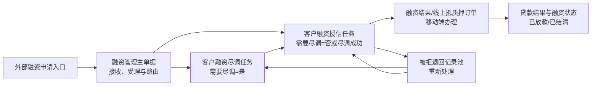
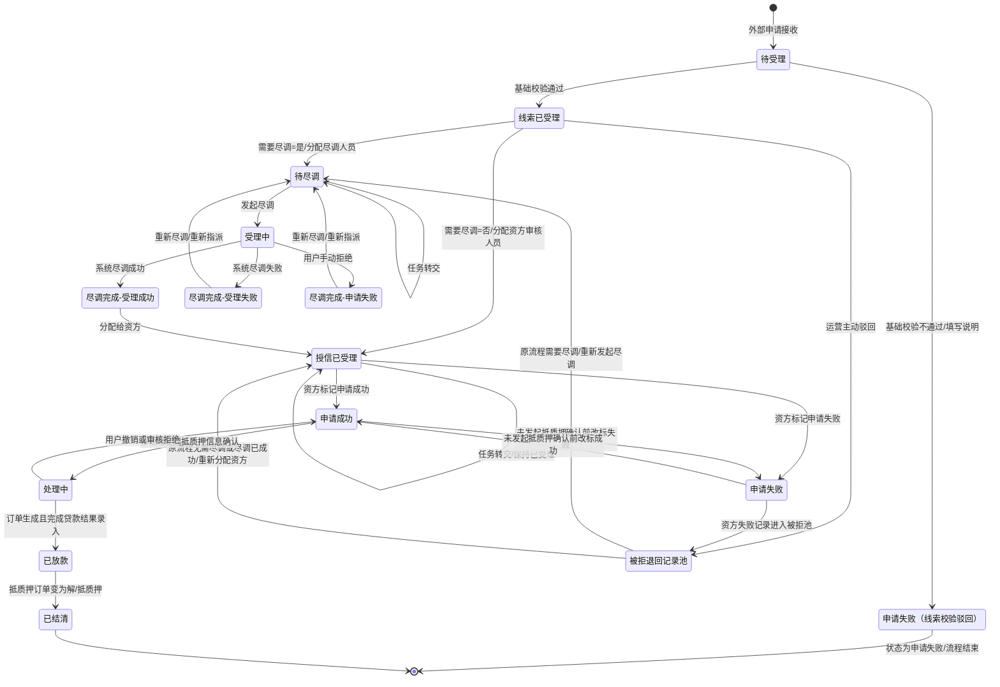

# 融资管理主PRD

> **版本**：V1.0 | 2026-08-05  
> **读者**：研发工程师、测试工程师、产品复核

## 1. 业务背景

融资管理主单据承接外部融资申请信息，统一完成融资需求受理、尽调分流、资方授信办理、线上抵质押办理和贷款结果回写，解决融资业务在多个角色和多个端侧之间流转时缺少统一记录、状态和责任人的问题。没有统一管理时，融资申请容易出现遗漏、重复分配、拒绝后无法继续处理和授信结果无法回写等问题。

没有统一的融资管理主单据：

- 外部入口提交的融资申请无法统一进入运营受理队列，容易漏单；
- 是否需要尽调依赖人工判断，可能把申请分配到错误的处理环节；
- 尽调、资方审核和抵质押办理之间缺少明确状态，任务责任人不清晰；
- 资方拒绝或尽调失败后缺少可再次处理的记录池，历史原因无法追溯；
- 抵质押订单、贷款结果和融资状态无法形成闭环，运营无法准确查询业务进度。

本版以《客户融资需求线索字段清单_V1.0.md》（内容版本 V1.1）、《融资管理功能清单_PC及移动端.md》和《融资管理业务流程.md》为基础文档，以《融资管理全流程_PRD_V4.0.md》和《融资意向管理PRD_标准模板版.markdown》为参考文档；基础文档和已确认业务口径优先。

## 2. 功能范围

**In Scope**：

- 接收外部融资申请并自动生成客户融资需求线索；
- 对融资需求线索进行列表查询、详情查看、基础校验和受理；
- 根据“需要尽调”字段自动路由到尽调人员或资方分配；
- 提供客户融资尽调办理的“待尽调”和“尽调完成”两个 Tab；
- 支持尽调任务发起、重新尽调、组织内任务转交和尽调结果流转；
- 支持资方分配、资方组织内任务转交、申请成功/失败标记；
- 支持被拒退回记录池中的重新发起尽调和重新分配资方；
- 支持移动端抵质押信息确认、审核、订单生成和贷款结果录入；
- 维护融资状态、字段回写、角色权限、数据隔离、消息和操作审计。

**Out of Scope**：

- 客户融资申请提交入口，由其他业务入口负责发起；
- 资方内部评级、授信模型和审批规则，属于资方内部系统或机构规则；
- 资方接单动作、资方处理超时和并行抢单，本流程不设置这些节点；
- 授信办理阶段客户申请撤回，本阶段不允许客户撤回；
- 被拒记录池中的“无可用资方”和“终止处理”分支，本期暂不设置；
- 贷款还款计划、逾期、核销和司法处置，属于贷后或风险管理模块。

## 3. 单据定位

### 3.1 在系统中的位置

| 项目 | 内容 |
| :--- | :--- |
| 单据层级 | 第2层——业务执行层；承接外部融资申请并驱动尽调、授信和抵质押办理 |
| 核心职责 | 统一保存融资申请信息，控制业务路由、任务责任、融资状态和结果回写 |
| 单据来源 | 由其他入口提交融资申请后，系统自动生成 |
| 下游单据 | 客户融资尽调任务、客户融资授信任务、被拒退回记录、线上抵质押订单、贷款结果记录 |
| 实体关系 | 一条融资申请对应一条主业务记录；可产生多批次尽调/资方处理记录和多条操作审计记录，原则上同一时点仅有一个有效处理任务 |

### 3.2 系统链路图

### 3.3 实体关系说明

| 关系 | 说明 |
| :--- | :--- |
| 本单据 : 外部融资申请 | **1:1**，每次外部申请生成一条融资管理主记录；重复请求按申请标识幂等处理 |
| 本单据 : 尽调任务 | **1:N**，同一融资申请可因重新尽调产生多个任务批次，但同一时点只有一个有效批次 |
| 本单据 : 授信任务 | **1:N**，同一融资申请可因重新分配资方产生多个授信批次 |
| 本单据 : 被拒记录 | **1:N**，每次尽调失败、线索主动驳回或资方拒绝都保留一条来源记录 |
| 本单据 : 抵质押订单 | **1:N**，允许历史订单留存；同一业务版本只能生成一条有效订单 |
| 本单据 : 关联字段 | **1:1 快照**，下游任务继承申请字段，需保留的字段以申请批次快照为准 |

## 4. 业务场景

| 场景ID | 场景 | 类型 | 说明 |
| :--- | :--- | :--- | :--- |
| S01 | 需要尽调并成功放款 | **主流程** | 外部申请接收、线索校验通过、尽调成功、资方申请成功、移动端完成抵质押和贷款结果录入，最终为已放款 |
| S02 | 无需尽调并成功放款 | **主流程** | 线索校验通过后直接分配资方，申请成功后进入移动端抵质押办理 |
| S03 | 需要尽调的分步处理 | **支线** | 尽调任务先处于待受理或受理中，完成后进入尽调完成 Tab，再由运营分配资方 |
| S04 | 线索基础校验不通过 | **异常** | 运营驳回并填写说明，状态为申请失败，流程结束且不进入被拒退回记录池 |
| S05 | 线索已受理后主动驳回 | **支线** | 状态为申请失败；需要尽调的进入被拒池后重新发起尽调；无需尽调的进入被拒池后重新分配资方 |
| S06 | 尽调失败或手动拒绝 | **异常** | 记录进入尽调完成 Tab，并可重新指派尽调人员后回到待尽调 |
| S07 | 资方申请失败 | **异常** | 资方标记失败后进入被拒退回记录池，运营重新分配资方；历史已拒资方仍可选择 |
| S08 | 抵质押办理异常回退 | **异常** | 用户主动撤销、信息确认审核拒绝或抵质押流程审核拒绝，融资状态回退为申请成功 |

## 5. 状态机

### 5.1 单据状态

| 状态 | 含义 | 是否终态 |
| :--- | :--- | :---: |
| 待受理 | 系统自动生成初始记录；在线索板块为待运营校验，在尽调/授信任务中表示尚未开始处理 | 否 |
| 已受理 | 在线索板块表示基础校验通过；在授信板块表示任务已分配至资方审核人员 | 否 |
| 申请成功 | 资方审核人员主动标记成功，或抵质押办理异常回退后的可继续处理状态 | 否 |
| 申请失败 | 资方审核人员主动标记失败，或客户融资需求线索、尽调办理中的运营/尽调人员手动拒绝后的结果状态 | 否 |
| 处理中 | 用户已发起抵质押信息确认，或抵质押订单已生成但尚未录入贷款结果 | 否 |
| 已放款 | 抵质押订单生成且已完成贷款结果录入 | 否 |
| 已结清 | 抵质押订单状态变为解/抵质押 | 是 |

尽调办理使用独立业务页签状态：待尽调 Tab 包含“待受理、受理中”，尽调完成 Tab 包含“受理成功、受理失败、申请失败”。系统自动尽调返回成功、失败或用户手动拒绝后，记录进入尽调完成 Tab。

### 5.2 状态机图

### 5.3 状态流转表

| 当前状态 | 动作 | 前置条件 | 结果状态 | 二次确认 | 后置影响 | 失败处理 |
| :--- | :--- | :--- | :--- | :--- | :--- | :--- |
| 待受理（线索） | 基础校验通过 | 申请信息完整；字段规则校验通过 | 已受理 | 无 | 固化受理时间和处理人；按“需要尽调”路由 | Toast：“受理失败，请检查申请信息” |
| 待受理（线索） | 驳回并填写说明 | 校验不通过；说明必填 | 申请失败 | 需确认 | 记录驳回说明、处理人和处理时间；流程结束且不进入被拒池 | Toast：“请填写驳回说明” |
| 已受理（线索） | 分配跟进 | 需要尽调字段已保存 | 待尽调或授信已受理 | 无 | 是：只能选择尽调人员；否：只能选择资方 | Toast：“当前申请缺少有效路由配置” |
| 已受理（线索） | 主动驳回 | 已受理；驳回原因必填 | 被拒退回记录池 | 需确认 | 记录原节点、需要尽调值和驳回原因 | Toast：“请填写驳回原因” |
| 待尽调 | 发起尽调 | 已分配尽调人员；任务未被其他人处理 | 受理中 | 无 | 创建或更新尽调请求；记录发起人和时间 | Toast：“任务已被其他人员处理” |
| 待尽调 | 任务转交 | 目标人员属于当前尽调组织；任务处于待受理 | 待尽调 | 需确认 | 更新当前责任人；保留原责任人和转交记录 | Toast：“只能转交给本组织其他同事” |
| 受理中 | 系统返回成功 | 系统回传结果与当前任务批次一致 | 尽调完成-受理成功 | 无 | 保存尽调结果；移入尽调完成 Tab | Toast：“尽调结果处理失败，请重试” |
| 受理中 | 系统返回失败 | 系统回传结果与当前任务批次一致 | 尽调完成-受理失败 | 无 | 保存失败原因；移入尽调完成 Tab | Toast：“尽调结果处理失败，请重试” |
| 受理中/待受理 | 手动拒绝 | 拒绝说明必填；操作者有权限 | 尽调完成-申请失败 | 需确认 | 保存申请失败原因；移入尽调完成 Tab | Toast：“请填写拒绝说明” |
| 尽调完成-受理成功 | 分配给资方 | 结果完整；目标资方可用 | 授信已受理 | 无 | 创建资方任务；资方任务分配后即视为已受理 | Toast：“请选择有效资方” |
| 尽调完成-受理失败/申请失败 | 重新尽调 | 重新指派尽调人员；原结果已留存 | 待尽调 | 需确认 | 创建新的尽调批次；保留历史结果 | Toast：“请先指派尽调人员” |
| 授信待受理 | 分配资方审核人员 | 资方和审核人员均有效 | 授信已受理 | 无 | 生成资方审核任务；不生成接单待办 | Toast：“请选择有效审核人员” |
| 授信已受理 | 任务转交 | 目标人员属于资方组织；任务未完成 | 授信已受理 | 需确认 | 更新责任人；状态保持已受理 | Toast：“只能转交给本组织其他同事” |
| 授信已受理 | 标记申请成功 | 审核资料满足资方规则；未发起抵质押确认 | 申请成功 | 无 | 允许客户或授权业务人员发起抵质押信息确认 | Toast：“当前资料不满足申请成功条件” |
| 授信已受理/申请成功 | 标记申请失败 | 失败原因必填；未发起抵质押确认 | 被拒退回记录池 | 需确认 | 记录资方、批次和失败原因；生成被拒来源 | Toast：“请填写申请失败原因” |
| 申请成功 | 发起抵质押信息确认 | 移动端操作；主体、押品和权限校验通过 | 处理中 | 无 | 创建信息确认任务；锁定当前业务版本 | Toast：“当前申请暂不满足抵质押办理条件” |
| 处理中 | 用户主动撤销 | 当前处于处理中；未生成不可撤销的最终结果 | 申请成功 | 需确认 | 关闭当前确认任务；记录撤销原因 | Toast：“当前任务不可撤销” |
| 处理中 | 信息确认或抵质押流程审核拒绝 | 审核人员有权限；拒绝原因必填 | 申请成功 | 需确认 | 关闭被拒任务；允许再次发起抵质押确认 | Toast：“请填写审核拒绝原因” |
| 处理中 | 生成抵质押订单并录入贷款结果 | 订单生成成功；贷款金额和期数校验通过 | 已放款 | 无 | 回写贷款金额、贷款期数；保留订单关联 | Toast：“贷款结果录入失败，请检查金额和期数” |
| 已放款 | 同步订单结清 | 关联抵质押订单状态为解/抵质押 | 已结清 | 无 | 回写结清状态和时间；进入终态 | Toast：“结清状态同步失败，请重试” |

### 5.4 动作能力矩阵

| 动作 | 线索待受理 | 线索已受理 | 待尽调 | 受理中 | 尽调完成 | 授信已受理 | 申请成功 | 处理中 | 被拒池 | 已放款/已结清 |
| :--- | :---: | :---: | :---: | :---: | :---: | :---: | :---: | :---: | :---: | :---: |
| 查看详情 | ✅ | ✅ | ✅ | ✅ | ✅ | ✅ | ✅ | ✅ | ✅ | ✅ |
| 基础校验 | ✅ | ❌ | ❌ | ❌ | ❌ | ❌ | ❌ | ❌ | ❌ | ❌ |
| 驳回并填写说明 | ✅ | ❌ | ❌ | ❌ | ❌ | ❌ | ❌ | ❌ | ❌ | ❌ |
| 分配跟进 | ❌ | ✅（按需要尽调路由） | ❌ | ❌ | ❌ | ❌ | ❌ | ❌ | ❌ | ❌ |
| 发起/重新尽调 | ❌ | ❌ | ✅ | ✅（再次发起） | ✅（结果失败） | ❌ | ❌ | ❌ | ✅（需尽调来源） | ❌ |
| 任务转交 | ❌ | ❌ | ✅ | ❌ | ❌ | ✅（资方组织内） | ❌ | ❌ | ❌ | ❌ |
| 分配给资方 | ❌ | ✅（无需尽调） | ❌ | ❌ | ✅（受理成功） | ❌ | ❌ | ❌ | ✅（重新分配） | ❌ |
| 标记申请成功/失败 | ❌ | ❌ | ❌ | ❌ | ❌ | ✅ | ✅（未发起确认） | ❌ | ❌ | ❌ |
| 发起抵质押确认 | ❌ | ❌ | ❌ | ❌ | ❌ | ❌ | ✅ | ❌ | ❌ | ❌ |
| 审核抵质押任务 | ❌ | ❌ | ❌ | ❌ | ❌ | ❌ | ❌ | ✅ | ❌ | ❌ |
| 用户主动撤销 | ❌ | ❌ | ❌ | ❌ | ❌ | ❌ | ❌ | ✅ | ❌ | ❌ |
| 贷款结果录入 | ❌ | ❌ | ❌ | ❌ | ❌ | ❌ | ❌ | ✅（移动端） | ❌ | ❌ |

## 6. 核心业务规则

### 6.1 创建与提交规则

| 规则ID | 规则 |
| :--- | :--- |
| R01 | 客户融资申请由其他入口发起，客户融资需求线索板块不提供重复提交入口。 |
| R02 | 外部申请接收成功后，系统自动生成一条融资管理主记录，初始状态为待受理。 |
| R03 | 同一外部申请标识不得重复生成有效主记录；重复接收应关联原记录并返回原业务编号。 |
| R04 | “需要尽调”由融资产品配置带出，枚举只能为“是、否”，并在申请级保存快照。 |
| R05 | 需要尽调=是时，分配跟进只能选择尽调人员；需要尽调=否时，分配跟进只能进入资方分配。 |
| R06 | 线索基础校验不通过时，运营必须填写说明，驳回后融资状态为申请失败，流程结束且不进入被拒退回记录池。 |

### 6.2 审核与字段锁定规则

| 规则ID | 规则 |
| :--- | :--- |
| R07 | 基础校验通过后，融资状态更新为已受理，产品、申请人、押品、意向金额和需要尽调等申请原始字段不可在本板块手工修改。 |
| R08 | 资方任务分配完成后，资方任务状态为已受理，不设置接单动作；资方任务转交只允许转给本资方组织内其他同事。 |
| R09 | 尽调任务转交只允许转给当前尽调组织内其他同事；转交不改变待受理或待尽调状态。 |
| R10 | 资方标记申请失败必须填写失败原因，并生成被拒退回记录；历史已拒资方在重新分配时仍可选择。 |
| R11 | 尽调结果成功、失败或用户手动拒绝后，记录必须从待尽调 Tab 移入尽调完成 Tab。 |

### 6.3 执行/入库/出库规则

| 规则ID | 规则 |
| :--- | :--- |
| R12 | 尽调完成为受理成功时，运营可执行“分配给资方”；尽调失败或申请失败时，只能执行重新尽调。 |
| R13 | 资方标记申请成功后，客户或授权业务人员才可在移动端发起抵质押信息确认。 |
| R14 | 抵质押信息确认、抵质押申请流程审核和贷款结果录入只允许在移动端执行，PC 端只读。 |
| R15 | 信息确认审核拒绝、抵质押申请流程审核拒绝或用户主动撤销时，融资状态回退为申请成功。 |
| R16 | 抵质押订单生成但尚未完成贷款结果录入时，融资状态保持处理中。 |
| R17 | 抵质押订单生成且贷款结果录入成功后，回写贷款金额、贷款期数，融资状态更新为已放款。 |
| R18 | 关联抵质押订单状态变为解/抵质押后，融资状态更新为已结清。 |

### 6.4 作废/取消规则

| 规则ID | 规则 |
| :--- | :--- |
| R19 | 客户融资需求线索、客户融资尽调办理和客户融资授信办理阶段不允许客户撤回。 |
| R20 | 只有融资状态为处理中时，客户或授权业务人员才可发起用户主动撤销；撤销必须填写原因并回退为申请成功。 |
| R21 | 基础校验驳回后的融资状态为申请失败，当前流程不可恢复且不进入被拒池；如需继续处理，必须从外部入口重新提交新的融资申请。 |

### 6.5 关闭/完结规则

| 规则ID | 规则 |
| :--- | :--- |
| R22 | 申请失败记录不自动终结，按原流程需要尽调与否分别进入重新尽调或重新分配资方路径。 |
| R23 | 被拒退回记录池仅提供重新发起尽调和重新分配资方两类处理方向，本期不设置无可用资方或终止处理。 |
| R24 | 已结清为融资业务终态，终态记录只允许查看、导出和审计追溯，不允许再次分配或发起抵质押办理。 |
| R25 | 同一申请同一时点只能存在一个有效尽调任务、一个有效资方任务和一个有效抵质押办理版本。 |

### 6.6 数量与金额计算规则

| 规则ID | 规则 |
| :--- | :--- |
| R26 | 意向融资金额、授信金额和贷款金额单位均为元，按字段清单要求保留小数点后4位。 |
| R27 | 意向融资期数、授信期数和贷款期数必须为正整数，贷款期数按字段清单规则保存。 |
| R28 | 贷款金额不得超过已确认授信金额；金额、期数任一不满足规则时不得提交贷款结果。 |
| R29 | 抵质押办理前必须校验申请主体、押品权属、在库状态、冻结状态、重复占用和业务权限。 |
| R30 | 字段名称、取值、展示和脱敏规则以《客户融资需求线索字段清单_V1.0.md》为唯一来源；下游仅引用，不重复定义。 |

## 7. 权限设计

### 7.1 数据可见范围

| 角色 | 可见数据范围 | 说明 |
| :--- | :--- | :--- |
| 客户 | 本人或本企业融资申请及本人可见的办理结果 | 不可查看内部处理说明、其他客户或其他机构数据 |
| 运营 | 融资管理全量业务数据 | 可处理受理、路由、被拒池和跨节点流转 |
| 尽调人员 | 分配给本人或授权组织的尽调任务 | 可查看对应申请资料和尽调历史 |
| 资方审核人员 | 分配给本人或所在资方机构的授信任务 | 只能访问本机构数据，不得访问其他资方数据 |
| 抵质押业务人员 | 授权业务范围内的抵质押任务和订单 | 只能处理授权仓库、押品和机构范围内数据 |

### 7.2 操作权限矩阵

| 操作 | 客户 | 运营 | 尽调人员 | 资方审核人员 | 抵质押业务人员 |
| :--- | :---: | :---: | :---: | :---: | :---: |
| 查看详情 | ✅（本人） | ✅ | ✅（授权任务） | ✅（本机构任务） | ✅（授权业务） |
| 基础校验和受理 | ❌ | ✅ | ❌ | ❌ | ❌ |
| 需要尽调路由 | ❌ | ✅ | ❌ | ❌ | ❌ |
| 尽调办理 | ❌ | ✅（查看/流转） | ✅ | ✅（查看） | ❌ |
| 尽调任务转交 | ❌ | ✅（分配） | ✅ | ❌ | ❌ |
| 资方任务分配 | ❌ | ✅ | ❌ | ❌ | ❌ |
| 资方任务转交 | ❌ | ❌ | ❌ | ✅（本组织） | ❌ |
| 标记申请成功/失败 | ❌ | 按授权 | ❌ | ✅ | ❌ |
| 被拒池处理 | ❌ | ✅ | ✅（接收重新尽调任务） | ✅（查看相关记录） | ❌ |
| 发起抵质押信息确认 | ✅ | 按授权 | ❌ | ❌ | 按授权 |
| 抵质押任务审核 | ❌ | 查看 | ❌ | ❌ | ✅ |
| 贷款结果录入 | ✅（按授权） | 查看 | ❌ | ❌ | ✅（按授权） |
| 用户主动撤销 | ✅（处理中） | 按授权 | ❌ | ❌ | ✅（按授权） |

## 8. 边界与异常处理

### 8.1 并发控制

- 线索受理、分配跟进、尽调转交和资方转交必须校验当前状态及数据版本；
- 同一申请的分配、转交、标记结果等互斥操作同时提交时，仅一个请求成功；
- 被拒池重新处理时必须校验记录仍处于可处理状态，已被其他人员处理的记录不得重复操作；
- 抵质押办理过程中必须锁定业务版本和押品占用关系，防止重复生成有效订单。

### 8.2 幂等操作约束

- 外部申请接收使用外部申请标识幂等；
- 尽调结果回调使用申请编号、尽调批次和回调编号幂等；
- 资方分配、任务转交和被拒池处理使用业务记录和操作请求编号幂等；
- 抵质押订单生成使用申请编号、业务版本和客户端请求编号幂等；重复请求返回原处理结果或原订单号。

### 8.3 数量边界约束

- 贷款金额不得大于授信金额；
- 意向融资金额、授信金额和贷款金额按照字段清单精度保存；
- 期数字段必须为正整数；
- 押品必须存在、在库、未冻结、未出库且未被其他有效业务占用；
- 同一申请不允许重复创建有效抵质押订单。

### 8.4 单据状态与下游不一致时的处理

| 场景 | 处理方式 |
| :--- | :--- |
| 尽调回调结果批次与当前有效批次不一致 | 拒绝更新当前状态，保留回调原文和异常日志，进入人工核查 |
| 资方拒绝后主记录未进入被拒池 | 以资方失败操作为准补写被拒来源记录，禁止直接丢弃失败结果 |
| 订单已生成但主记录仍为申请成功 | 以订单关联状态为准触发状态校正，校正过程记录审计日志 |
| 订单已解/抵质押但主记录未变为已结清 | 允许重试状态同步；重复同步不得生成新订单或重复结清记录 |
| 重复提交贷款结果 | 返回原贷款结果或提示已处理，不覆盖已确认结果，除非具备明确的更正权限 |
| 目标人员或资方被停用 | 阻止分配或转交，提示重新选择有效人员或资方 |

## 9. 验收重点

| # | 验收项 | 输入条件 | 预期结果 |
| :--- | :--- | :--- | :--- |
| V01 | 外部申请接收 | 外部入口提交一条合法融资申请 | 自动生成一条待受理主记录，重复请求不生成新记录 |
| V02 | 线索校验通过 | 运营补齐并确认必需信息 | 融资状态变为已受理，并按需要尽调值进入对应路由 |
| V03 | 线索校验不通过 | 运营驳回并填写说明 | 融资状态变为申请失败，流程结束，保留说明且不进入被拒退回记录池 |
| V04 | 需要尽调自动路由 | 需要尽调=是，运营执行分配跟进 | 只能选择尽调人员，任务进入待尽调 Tab 的待受理状态 |
| V05 | 无需尽调自动路由 | 需要尽调=否，运营执行分配跟进 | 直接进入资方分配，不生成尽调任务 |
| V06 | 尽调任务转交 | 待尽调任务转交给同组织其他同事 | 责任人更新，状态保持待受理/待尽调，生成转交记录 |
| V07 | 尽调发起 | 已分配尽调人员，执行发起尽调 | 状态变为受理中，待尽调 Tab 保留该记录 |
| V08 | 系统尽调成功 | 受理中收到当前批次成功结果 | 记录进入尽调完成 Tab 的受理成功，可分配给资方 |
| V09 | 系统尽调失败 | 受理中收到当前批次失败结果 | 记录进入尽调完成 Tab 的受理失败，可重新尽调 |
| V10 | 尽调手动拒绝 | 待受理或受理中填写拒绝说明 | 记录变为申请失败并进入尽调完成 Tab，可重新尽调 |
| V11 | 尽调成功分配资方 | 尽调完成状态为受理成功 | 运营可分配资方，生成授信待受理任务 |
| V12 | 资方任务分配 | 运营选择有效资方审核人员 | 任务状态直接为已受理，不出现接单按钮 |
| V13 | 资方任务转交 | 资方审核人员转交给本组织其他同事 | 责任人更新，状态仍为已受理，禁止跨组织转交 |
| V14 | 资方标记申请成功 | 资方审核资料满足规则且未发起抵质押确认 | 融资状态变为申请成功，可发起抵质押信息确认 |
| V15 | 资方标记申请失败 | 填写失败原因并确认 | 进入被拒退回记录池，保留资方、批次和原因 |
| V16 | 被拒池重新尽调 | 来源为需要尽调的线索主动驳回或尽调失败 | 重新指派尽调人员后进入待尽调，可再次发起尽调 |
| V17 | 被拒池重新分配资方 | 来源为无需尽调拒绝或尽调成功后资方拒绝 | 可重新选择资方；历史已拒资方不置灰、不禁止选择 |
| V18 | 授信成功状态切换 | 申请成功且尚未发起抵质押确认 | 按权限可切换为申请失败；申请失败也可在同一前置条件下切换为申请成功 |
| V19 | 移动端发起抵质押确认 | 申请成功状态下由客户或授权人员移动端发起 | 状态变为处理中，PC 端无发起操作按钮 |
| V20 | 抵质押审核拒绝或用户撤销 | 处理中执行审核拒绝或用户主动撤销 | 状态回退为申请成功，记录原因并允许重新发起 |
| V21 | 贷款结果录入 | 抵质押订单已生成，移动端录入合法贷款金额和期数 | 回写贷款字段，融资状态变为已放款 |
| V22 | 结清同步 | 关联抵质押订单状态变为解/抵质押 | 融资状态变为已结清，后续只允许查看和审计 |
| V23 | 金额边界校验 | 贷款金额大于授信金额或期数非正整数 | 阻止提交并给出明确校验提示 |
| V24 | 抵质押重复提交 | 对同一业务版本连续提交两次订单生成请求 | 只生成一笔有效订单，重复请求返回原订单号 |
| V25 | 并发转交保护 | 两名人员同时转交同一任务 | 仅一个请求成功，另一个提示任务已被处理 |
| V26 | 授信办理撤回阻断 | 客户在授信已受理或资方处理阶段尝试撤回 | 不展示撤回入口或阻止请求；只有处理中阶段允许按规则撤销 |

## 10. 修订记录

| 日期 | 变更摘要 |
| :--- | :--- |
| 2026-08-05 | 按《业务单据PRD模板.md》重排融资管理主 PRD，补充单据定位、实体关系、场景、状态机、状态流转表、动作能力矩阵、规则、权限、异常和验收重点 |
