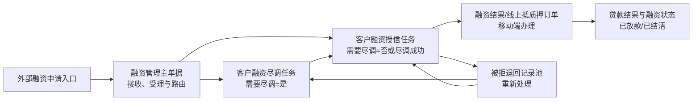
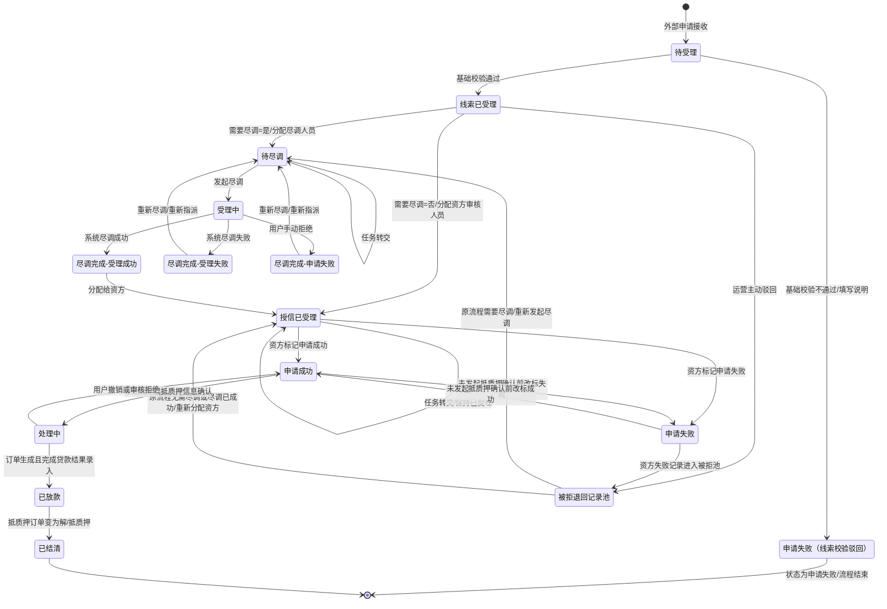

# 融资管理主PRD

> **版本**：V1.0 | 2026-08-05  
> **读者**：研发工程师、测试工程师、产品复核

## 1. 业务背景

融资管理主单据统一承接外部融资申请，贯穿需求受理、尽调分流、资方授信、线上抵质押及贷款结果回写，解决多角色多端侧流转中的漏单、路由错配、责任不清、拒绝不可追溯及状态未闭环问题。

**依据文档**（基础及已确认口径优先）：
- **基础文档**：《客户融资需求线索字段清单_V1.0.md》(V1.1)、《融资管理功能清单_PC及移动端.md》、《融资管理业务流程.md》
- **参考文档**：《融资管理全流程_PRD_V4.0.md》、《融资意向管理PRD_标准模板版.markdown》

## 2. 功能范围

| 模块 | 包含事项 (In Scope) | 排除事项 (Out of Scope) |
| :--- | :--- | :--- |
| **接入与分流** | 接收外部申请生成线索；列表/详情查询；基础校验与受理；按“需要尽调”路由分流。 | 外部申请提交入口（上游入口负责）。 |
| **尽调管理** | 提供“待尽调/尽调完成”Tab；支持发起尽调、重新尽调、组织内转交、结果流转。 | 资方接单/超时/并行抢单节点。 |
| **授信管理** | 资方分配、组织内任务转交、申请成功/失败标记。 | 资方内部评级、授信模型及审批规则。 |
| **异常处理** | 被拒退回记录池管理，支持重新尽调与重新分配资方。 | 授信阶段客户撤回；被拒池“无可用资方/终止处理”（本期暂不设）。 |
| **抵质押与回写** | 移动端抵质押确认、审核、订单生成及贷款结果录入。 | 贷后还款计划、逾期、核销及司法处置。 |
| **基础支撑** | 融资状态维护、字段回写、RBAC权限、数据隔离、消息与审计日志。 | - |

## 3. 单据定位

### 3.1 在系统中的位置

| 项目 | 内容 |
| :--- | :--- |
| **单据层级** | 第2层（业务执行层）；承接外部申请并驱动尽调、授信与抵质押办理。 |
| **核心职责** | 统一保存申请信息，控制路由分流、任务责任、状态流转与结果回写。 |
| **单据来源** | 外部申请提交后系统自动生成。 |
| **下游单据** | 尽调任务、授信任务、被拒退回记录、线上抵质押订单、贷款结果记录。 |
| **实体关系** | 1条申请对应1条主记录；可产生多批次尽调/资方记录与审计日志，同一时点仅1个有效处理任务。 |

### 3.2 系统链路图

### 3.3 实体关系说明

| 关系 | 配比 | 说明 |
| :--- | :---: | :--- |
| 本单据 : 外部融资申请 | **1:1** | 每次申请生成1条主记录；重复请求按申请标识幂等处理。 |
| 本单据 : 尽调任务 | **1:N** | 重新尽调产生多批次，同一时点仅1个有效批次。 |
| 本单据 : 授信任务 | **1:N** | 重新分配资方产生多批次。 |
| 本单据 : 被拒记录 | **1:N** | 尽调失败、主动驳回或资方拒绝均留存1条来源记录。 |
| 本单据 : 抵质押订单 | **1:N** | 允许历史订单留存；同一业务版本仅生成1条有效订单。 |
| 本单据 : 关联字段 | **1:1** | 状态快照；下游继承申请字段，以申请批次快照为准。 |

## 4. 业务场景

| 场景ID | 场景 | 类型 | 说明 |
| :--- | :--- | :--- | :--- |
| S01 | 需要尽调并成功放款 | **主流程** | 申请接收 -> 校验通过 -> 尽调成功 -> 资方成功 -> 移动端抵质押/贷款录入 -> 已放款。 |
| S02 | 无需尽调并成功放款 | **主流程** | 校验通过 -> 直接分配资方 -> 申请成功 -> 移动端抵质押办理。 |
| S03 | 需要尽调的分步处理 | **支线** | 尽调任务在“待受理/受理中”处理完成后进入“尽调完成 Tab”，再分配资方。 |
| S04 | 线索基础校验不通过 | **异常** | 运营驳回并填写说明，状态更新为“申请失败”，流程结束（不进入被拒池）。 |
| S05 | 线索已受理后主动驳回 | **支线** | 状态更新为“申请失败”并进入被拒池；需尽调者可重新尽调，无需者可重新分配资方。 |
| S06 | 尽调失败或手动拒绝 | **异常** | 记录进入“尽调完成 Tab”，支持重新指派尽调人员后切回“待尽调”。 |
| S07 | 资方申请失败 | **异常** | 资方标记失败后进入被拒池，运营可重新分配资方（包含历史已拒资方）。 |
| S08 | 抵质押办理异常回退 | **异常** | 用户主动撤销、信息确认或抵质押流程审核拒绝，融资状态回退至“申请成功”。 |

## 5. 状态机

### 5.1 单据状态

| 状态 | 含义 | 是否终态 |
| :--- | :--- | :---: |
| 待受理 | 系统自动生成初始记录；在线索板块为待运营校验，在尽调/授信任务中表示尚未开始处理 | 否 |
| 已受理 | 在线索板块表示基础校验通过；在授信板块表示任务已分配至资方审核人员 | 否 |
| 申请成功 | 资方审核人员主动标记成功，或抵质押办理异常回退后的可继续处理状态 | 否 |
| 申请失败 | 资方审核人员主动标记失败，或客户融资需求线索、尽调办理中的运营/尽调人员手动拒绝后的结果状态 | 否 |
| 处理中 | 用户已发起抵质押信息确认，或抵质押订单已生成但尚未录入贷款结果 | 否 |
| 已放款 | 抵质押订单生成且已完成贷款结果录入 | 否 |
| 已结清 | 抵质押订单状态变为解/抵质押 | 是 |

*注：尽调办理设独立 Tab：“待尽调”（含待受理、受理中）与“尽调完成”（含受理成功、受理失败、申请失败）。*

### 5.2 状态机图

### 5.3 状态流转表

| 当前状态 | 动作 | 前置条件 | 结果状态 | 二次确认 | 后置影响 | 失败处理 |
| :--- | :--- | :--- | :--- | :--- | :--- | :--- |
| 待受理（线索） | 基础校验通过 | 申请信息完整；字段规则校验通过 | 已受理 | 无 | 固化受理时间和处理人；按“需要尽调”路由 | Toast：“受理失败，请检查申请信息” |
| 待受理（线索） | 驳回并填写说明 | 校验不通过；说明必填 | 申请失败 | 需确认 | 记录驳回说明、处理人和处理时间；流程结束且不进入被拒池 | Toast：“请填写驳回说明” |
| 已受理（线索） | 分配跟进 | 需要尽调字段已保存 | 待尽调或授信已受理 | 无 | 是：只能选择尽调人员；否：只能选择资方 | Toast：“当前申请缺少有效路由配置” |
| 已受理（线索） | 主动驳回 | 已受理；驳回原因必填 | 被拒退回记录池 | 需确认 | 记录原节点、需要尽调值和驳回原因 | Toast：“请填写驳回原因” |
| 待尽调 | 发起尽调 | 已分配尽调人员；任务未被其他人处理 | 受理中 | 无 | 创建或更新尽调请求；记录发起人和时间 | Toast：“任务已被其他人员处理” |
| 待尽调 | 任务转交 | 目标人员属于当前尽调组织；任务处于待受理 | 待尽调 | 需确认 | 更新当前责任人；保留原责任人和转交记录 | Toast：“只能转交给本组织其他同事” |
| 受理中 | 系统返回成功 | 系统回传结果与当前任务批次一致 | 尽调完成-受理成功 | 无 | 保存尽调结果；移入尽调完成 Tab | Toast：“尽调结果处理失败，请重试” |
| 受理中 | 系统返回失败 | 系统回传结果与当前任务批次一致 | 尽调完成-受理失败 | 无 | 保存失败原因；移入尽调完成 Tab | Toast：“尽调结果处理失败，请重试” |
| 受理中/待受理 | 手动拒绝 | 拒绝说明必填；操作者有权限 | 尽调完成-申请失败 | 需确认 | 保存申请失败原因；移入尽调完成 Tab | Toast：“请填写拒绝说明” |
| 尽调完成-受理成功 | 分配给资方 | 结果完整；目标资方可用 | 授信已受理 | 无 | 创建资方任务；资方任务分配后即视为已受理 | Toast：“请选择有效资方” |
| 尽调完成-受理失败/申请失败 | 重新尽调 | 重新指派尽调人员；原结果已留存 | 待尽调 | 需确认 | 创建新的尽调批次；保留历史结果 | Toast：“请先指派尽调人员” |
| 授信待受理 | 分配资方审核人员 | 资方和审核人员均有效 | 授信已受理 | 无 | 生成资方审核任务；不生成接单待办 | Toast：“请选择有效审核人员” |
| 授信已受理 | 任务转交 | 目标人员属于资方组织；任务未完成 | 授信已受理 | 需确认 | 更新责任人；状态保持已受理 | Toast：“只能转交给本组织其他同事” |
| 授信已受理 | 标记申请成功 | 审核资料满足资方规则；未发起抵质押确认 | 申请成功 | 无 | 允许客户或授权业务人员发起抵质押信息确认 | Toast：“当前资料不满足申请成功条件” |
| 授信已受理/申请成功 | 标记申请失败 | 失败原因必填；未发起抵质押确认 | 被拒退回记录池 | 需确认 | 记录资方、批次和失败原因；生成被拒来源 | Toast：“请填写申请失败原因” |
| 申请成功 | 发起抵质押信息确认 | 移动端操作；主体、押品和权限校验通过 | 处理中 | 无 | 创建信息确认任务；锁定当前业务版本 | Toast：“当前申请暂不满足抵质押办理条件” |
| 处理中 | 用户主动撤销 | 当前处于处理中；未生成不可撤销的最终结果 | 申请成功 | 需确认 | 关闭当前确认任务；记录撤销原因 | Toast：“当前任务不可撤销” |
| 处理中 | 信息确认或抵质押流程审核拒绝 | 审核人员有权限；拒绝原因必填 | 申请成功 | 需确认 | 关闭被拒任务；允许再次发起抵质押确认 | Toast：“请填写审核拒绝原因” |
| 处理中 | 生成抵质押订单并录入贷款结果 | 订单生成成功；贷款金额和期数校验通过 | 已放款 | 无 | 回写贷款金额、贷款期数；保留订单关联 | Toast：“贷款结果录入失败，请检查金额和期数” |
| 已放款 | 同步订单结清 | 关联抵质押订单状态为解/抵质押 | 已结清 | 无 | 回写结清状态和时间；进入终态 | Toast：“结清状态同步失败，请重试” |

### 5.4 动作能力矩阵

| 动作 | 线索待受理 | 线索已受理 | 待尽调 | 受理中 | 尽调完成 | 授信已受理 | 申请成功 | 处理中 | 被拒池 | 已放款/已结清 |
| :--- | :---: | :---: | :---: | :---: | :---: | :---: | :---: | :---: | :---: | :---: |
| 查看详情 | ✅ | ✅ | ✅ | ✅ | ✅ | ✅ | ✅ | ✅ | ✅ | ✅ |
| 基础校验 | ✅ | ❌ | ❌ | ❌ | ❌ | ❌ | ❌ | ❌ | ❌ | ❌ |
| 驳回并填写说明 | ✅ | ❌ | ❌ | ❌ | ❌ | ❌ | ❌ | ❌ | ❌ | ❌ |
| 分配跟进 | ❌ | ✅（按需要尽调路由） | ❌ | ❌ | ❌ | ❌ | ❌ | ❌ | ❌ | ❌ |
| 发起/重新尽调 | ❌ | ❌ | ✅ | ✅（再次发起） | ✅（结果失败） | ❌ | ❌ | ❌ | ✅（需尽调来源） | ❌ |
| 任务转交 | ❌ | ❌ | ✅ | ❌ | ❌ | ✅（资方组织内） | ❌ | ❌ | ❌ | ❌ |
| 分配给资方 | ❌ | ✅（无需尽调） | ❌ | ❌ | ✅（受理成功） | ❌ | ❌ | ❌ | ✅（重新分配） | ❌ |
| 标记申请成功/失败 | ❌ | ❌ | ❌ | ❌ | ❌ | ✅ | ✅（未发起确认） | ❌ | ❌ | ❌ |
| 发起抵质押确认 | ❌ | ❌ | ❌ | ❌ | ❌ | ❌ | ✅ | ❌ | ❌ | ❌ |
| 审核抵质押任务 | ❌ | ❌ | ❌ | ❌ | ❌ | ❌ | ❌ | ✅ | ❌ | ❌ |
| 用户主动撤销 | ❌ | ❌ | ❌ | ❌ | ❌ | ❌ | ❌ | ✅ | ❌ | ❌ |
| 贷款结果录入 | ❌ | ❌ | ❌ | ❌ | ❌ | ❌ | ❌ | ✅（移动端）| ❌ | ❌ |

## 6. 核心业务规则

### 6.1 创建与提交规则

| 规则ID | 规则 |
| :--- | :--- |
| **R01** | 客户融资申请由其他入口发起，线索板块不设重复提交入口。 |
| **R02** | 外部申请接收成功后，系统自动生成融资主记录（初始状态：待受理）。 |
| **R03** | 同一外部申请标识不得重复生成有效主记录；重复接收需关联原记录并返回原业务编号。 |
| **R04** | “需要尽调”由融资产品配置带出（枚举：是、否），并在申请级保存快照。 |
| **R05** | 需要尽调=是：分配跟进仅能选择尽调人员；需要尽调=否：分配跟进仅能进行资方分配。 |
| **R06** | 线索基础校验不通过必须填写说明，驳回后状态为申请失败，流程结束且不进入被拒池。 |

### 6.2 审核与字段锁定规则

| 规则ID | 规则内容 |
| :--- | :--- |
| **R07** | 校验通过后状态更新为已受理，产品、申请人、押品、意向金额及路由等原始字段不可手工修改。 |
| **R08** | 资方任务分配即进入已受理状态（无接单动作）；资方转交仅限同资方组织内进行。 |
| **R09** | 尽调转交仅限同尽调组织内进行；转交不改变任务当前状态（待受理/待尽调）。 |
| **R10** | 资方标记申请失败必须填写原因并生成被拒记录；历史已拒资方在重新分配时仍可选。 |
| **R11** | 尽调结果返回（成功/失败）或手动拒绝后，记录必须从“待尽调 Tab”移入“尽调完成 Tab”。 |

### 6.3 执行/入库/出库规则

| 规则ID | 规则内容 |
| :--- | :--- |
| **R12** | 尽调成功可“分配给资方”；尽调失败/手动拒绝仅能执行“重新尽调”。 |
| **R13** | 资方标记申请成功后，客户/授权人员方可在移动端发起抵质押信息确认。 |
| **R14** | 抵质押信息确认、流程审核及贷款结果录入限定在移动端执行，PC 端仅供查看。 |
| **R15** | 信息确认审核拒绝、流程审核拒绝或用户撤销时，融资状态统一回退为“申请成功”。 |
| **R16** | 抵质押订单生成但尚未录入贷款结果时，融资状态保持“处理中”。 |
| **R17** | 订单生成且贷款结果录入成功后，回写贷款金额与期数，状态更新为“已放款”。 |
| **R18** | 关联抵质押订单变为解/抵质押后，融资状态更新为“已结清”。 |

### 6.4 作废与取消规则

| 规则ID | 规则内容 |
| :--- | :--- |
| R19 | 客户融资需求线索、客户融资尽调办理和客户融资授信办理阶段不允许客户撤回。 |
| R20 | 只有融资状态为处理中时，客户或授权业务人员才可发起用户主动撤销；撤销必须填写原因并回退为申请成功。 |
| R21 | 基础校验驳回后的融资状态为申请失败，当前流程不可恢复且不进入被拒池；如需继续处理，必须从外部入口重新提交新的融资申请。 |

### 6.5 关闭/完结规则

| 规则ID | 规则内容 |
| :--- | :--- |
| **R22** | 申请失败记录不自动终结，依据来源属性进入“重新尽调”或“重新分配资方”路径。 |
| **R23** | 被拒池本期仅保留重新尽调与重新分配资方两条路径，暂不设无可用资方或终止处理。 |
| **R24** | “已结清”为业务终态，仅提供查看、导出与审计追溯，禁止重新分配或发起抵质押。 |
| **R25** | 同一申请同一时点仅能存在一个有效尽调任务、一个有效资方任务及一个有效抵质押办理版本。 |

### 6.6 数值与精度规则

| 规则ID | 规则内容 |
| :--- | :--- |
| **R26** | 意向融资金额、授信金额及贷款金额单位均为元，保留4位小数。 |
| **R27** | 意向融资期数、授信期数及贷款期数必须为正整数。 |
| **R28** | 贷款金额不得超过已确认授信金额；金额或期数不合规禁止提交贷款结果。 |
| **R29** | 抵质押办理前须校验主体、押品权属、在库、冻结状态、重复占用及业务权限。 |
| **R30** | 字段名称、取值与脱敏规则唯一引用《客户融资需求线索字段清单_V1.0.md》，下游不重复定义。 |

## 7. 权限设计

### 7.1 数据可见范围

| 角色 | 可见数据范围 | 说明 |
| :--- | :--- | :--- |
| **客户** | 本人/本企业融资申请及本人可见的结果 | 不可查看内部说明、其他客户或机构数据 |
| **运营** | 全量业务数据 | 可处理受理、路由、被拒池与跨节点流转 |
| **尽调人员** | 本人或授权组织的尽调任务 | 可查看对应申请资料及尽调历史 |
| **资方审核人员** | 本人或本机构的授信任务 | 仅限访问本机构数据，隔离其他资方数据 |
| **抵质押业务人员** | 授权范围内的抵质押任务与订单 | 仅限授权仓库、押品与机构数据 |

### 7.2 操作权限矩阵

| 操作 | 客户 | 运营 | 尽调人员 | 资方审核人员 | 抵质押业务人员 |
| :--- | :---: | :---: | :---: | :---: | :---: |
| 查看详情 | ✅（本人） | ✅ | ✅（授权任务） | ✅（本机构任务） | ✅（授权业务） |
| 基础校验和受理 | ❌ | ✅ | ❌ | ❌ | ❌ |
| 需要尽调路由 | ❌ | ✅ | ❌ | ❌ | ❌ |
| 尽调办理 | ❌ | ✅（查看/流转） | ✅ | ✅（查看） | ❌ |
| 尽调任务转交 | ❌ | ✅（分配） | ✅ | ❌ | ❌ |
| 资方任务分配 | ❌ | ✅ | ❌ | ❌ | ❌ |
| 资方任务转交 | ❌ | ❌ | ❌ | ✅（本组织） | ❌ |
| 标记申请成功/失败 | ❌ | 按授权 | ❌ | ✅ | ❌ |
| 被拒池处理 | ❌ | ✅ | ✅（接收重尽调）| ✅（查看记录） | ❌ |
| 发起抵质押信息确认 | ✅ | 按授权 | ❌ | ❌ | 按授权 |
| 抵质押任务审核 | ❌ | 查看 | ❌ | ❌ | ✅ |
| 贷款结果录入 | ✅（按授权） | 查看 | ❌ | ❌ | ✅（按授权） |
| 用户主动撤销 | ✅（处理中） | 按授权 | ❌ | ❌ | ✅（按授权） |

## 8. 边界与异常处理

### 8.1 边界约束与控制

| 维度 | 控制策略 |
| :--- | :--- |
| **并发控制** | 受理、分配、转交须校验状态及数据版本；互斥操作并发提交仅允许单笔成功；被拒池重处理前须校验待处理状态；抵质押锁定版本与押品占用。 |
| **幂等约束** | 外部接收校验外部申请标识；尽调回调校验申请号+批次+回调ID；分配/转交/被拒池校验记录+请求ID；订单生成校验申请号+版本+客户端请求ID。 |
| **数值边界** | 贷款金额 $\le$ 授信金额；金额保留4位小数；期数必须为正整数；押品须存在、在库、未冻结、未出库且无重复占用。 |

### 8.2 状态不一致异常处理

| 场景 | 处理方式 |
| :--- | :--- |
| **尽调回调批次不一致** | 拒绝更新当前状态，保留原文与日志，转人工核查。 |
| **资方拒绝后主记录未入被拒池** | 依据资方失败操作补写被拒来源记录，严禁丢弃失败结果。 |
| **订单已生成但主记录仍为申请成功**| 以订单关联状态为准触发状态校正，记录审计日志。 |
| **订单已解/抵质押但主记录未结清** | 允许重试同步；重复同步不得生成新订单或重复结清记录。 |
| **重复提交贷款结果** | 返回原结果或提示已处理，非特权不可覆盖已确认结果。 |
| **目标人员或资方被停用** | 阻止分配或转交，提示重新选择有效人员或资方。 |

## 9. 验收重点

| # | 验收项 | 输入条件 | 预期结果 |
| :--- | :--- | :--- | :--- |
| **V01** | 外部申请接收 | 上游提交合法申请 | 自动生成待受理主记录；重复请求不生成新记录。 |
| **V02** | 线索校验通过 | 运营确认必需信息 | 状态变更为已受理，按路由规则进入对应处理节点。 |
| **V03** | 线索校验不通过 | 运营驳回并填写说明 | 状态变更为申请失败，流程终结，保留说明且不入被拒池。 |
| **V04** | 需尽调路由 | 需要尽调=是 | 仅能选择尽调人员，任务进入“待尽调 Tab”待受理状态。 |
| **V05** | 无需尽调路由 | 需要尽调=否 | 直接进入资方分配，不生成尽调任务。 |
| **V06** | 尽调任务转交 | 待尽调任务转交同组同事 | 责任人更新，状态保持待受理/待尽调，生成转交记录。 |
| **V07** | 尽调发起 | 已分配人员执行发起尽调 | 状态变更为受理中，记录保留在“待尽调 Tab”。 |
| **V08** | 系统尽调成功 | 收到当前批次成功回调 | 记录进入“尽调完成 Tab-受理成功”，开放资方分配。 |
| **V09** | 系统尽调失败 | 收到当前批次失败回调 | 记录进入“尽调完成 Tab-受理失败”，开放重新尽调。 |
| **V10** | 尽调手动拒绝 | 填写拒绝说明并提交 | 状态变为申请失败并移入“尽调完成 Tab”，开放重新尽调。 |
| **V11** | 尽调成功分配资方 | 尽调状态为受理成功 | 运营可分配资方，生成授信待受理任务。 |
| **V12** | 资方任务分配 | 选择有效资方审核人员 | 任务直接进入已受理状态（无接单节点）。 |
| **V13** | 资方任务转交 | 转交本资方组织同事 | 责任人更新，状态保持已受理，阻断跨组织转交。 |
| **V14** | 标记申请成功 | 资料满足规则且未发起抵质押 | 状态变更为申请成功，开放移动端抵质押确认。 |
| **V15** | 标记申请失败 | 填写失败原因并确认 | 进入被拒池，保留资方、批次与失败原因。 |
| **V16** | 被拒池重新尽调 | 来源为需尽调驳回/失败件 | 重新指派人员后切回待尽调，支持再次发起尽调。 |
| **V17** | 被拒池重分配资方 | 来源为无需尽调件/资方拒绝件 | 可重新分配资方；历史已拒资方保持可选。 |
| **V18** | 授信成功状态切换 | 申请成功且未发起抵质押 | 按权限可切换为申请失败；反向切换同样支持。 |
| **V19** | 移动端发起抵质押 | 申请成功状态下移动端发起 | 状态变更为处理中，PC 端仅只读无发起入口。 |
| **V20** | 抵质押退回处理 | 处理中执行审核拒绝/用户撤销 | 状态回退至申请成功，记录原因并允许重新发起。 |
| **V21** | 贷款结果录入 | 订单已生成，移动端录入合规数据 | 回写贷款字段，状态变更为已放款。 |
| **V22** | 结清同步 | 关联订单变更为解/抵质押 | 状态变更为已结清（终态），仅保留查看与审计。 |
| **V23** | 金额边界校验 | 贷款金额>授信金额或期数非正整数| 阻断提交并给出精确校验提示。 |
| **V24** | 抵质押并发提交 | 连续提交订单生成请求 | 仅生成一笔有效订单，重复请求返回原订单号。 |
| **V25** | 并发转交保护 | 两人同时转交同一任务 | 单笔成功，另一笔提示任务已处理。 |
| **V26** | 授信撤回阻断 | 授信阶段尝试撤回申请 | 阻断请求或不展示撤回入口（仅处理中阶段允许撤销）。 |

## 10. 修订记录

| 日期 | 变更摘要 |
| :--- | :--- |
| **2026-08-05** | 按《业务单据PRD模板.md》重排融资管理主 PRD，补充单据定位、实体关系、场景、状态机、状态流转表、动作能力矩阵、规则、权限、异常和验收重点。 |
| **2026-08-06** | 保持业务逻辑与规则完整的前提下进行结构化精简：剔除铺垫套话，长文本重构为高密度表格与清晰列表。 |
