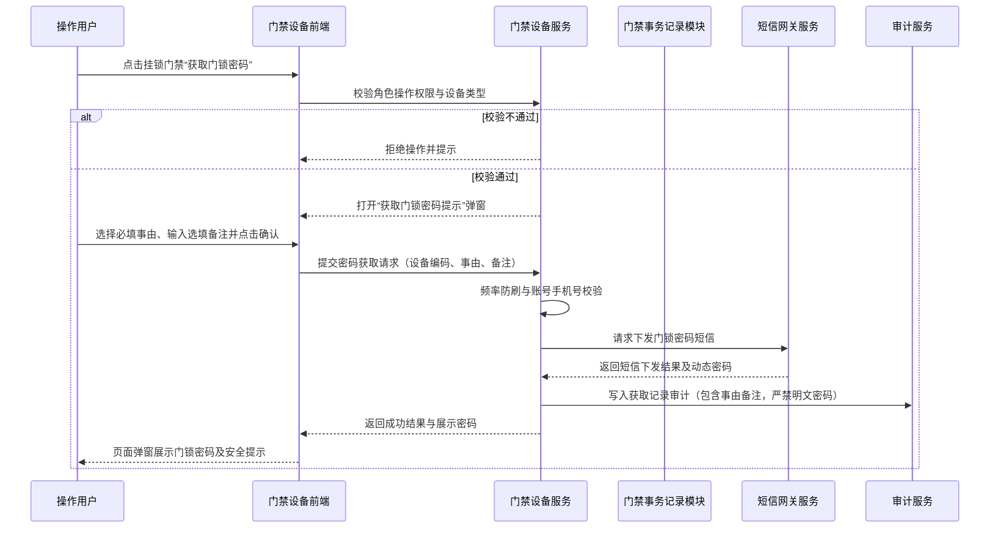
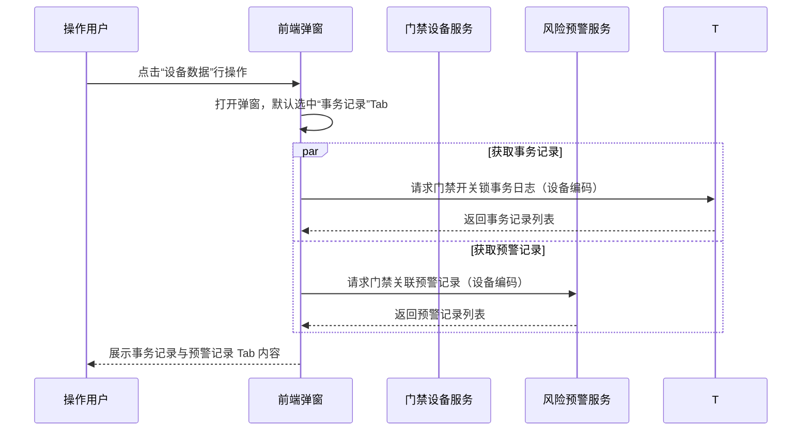
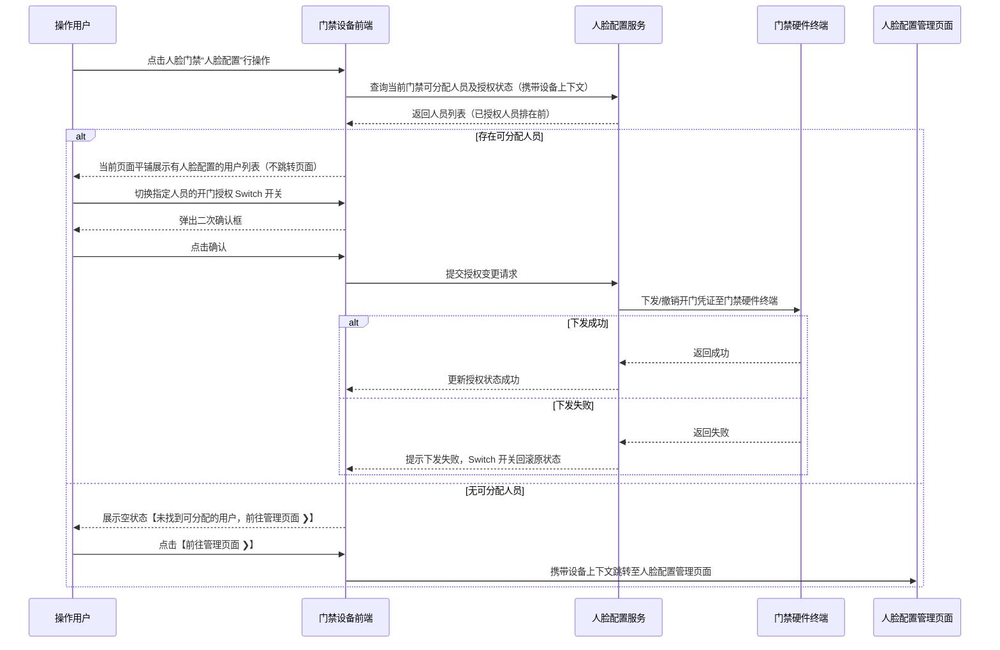

# 门禁设备主需求文档

> **版本**：V1.3 | 2026-08-07
> **读者**：研发工程师、测试工程师、产品复核
> **编写依据**：门禁设备字段清单、监控设备主 PRD、人脸配置主 PRD
> **字段基准**：[`门禁设备字段清单.md`](./门禁设备字段清单.md) 是本功能所有字段、枚举和字段规则的唯一基准

## 1. 业务背景

门禁设备是仓储监管与质押安全控制的关键物理屏障，分为挂锁门禁与人脸门禁两类设备。挂锁门禁主要用于仓库出入口、大门或货柜的物理挂锁出入控制；人脸门禁兼具身份识别开门与视频监控监控摄像头双重能力。

系统负责维护门禁设备基础档案、仓库绑定关系，并提供“获取门锁密码”（挂锁门禁专属）、“人脸配置”（人脸门禁专属）及“设备数据”（门禁开关锁事务记录与预警记录）等操作。设备数据同时被订单、仓库管理、人脸授权和风险预警模块引用，设备移除或绑定变更会影响多个下游业务。

本菜单不承载审批单据，也不建立独立设备业务状态机。设备的“状态”（在线/离线）属于系统实时获取与维护字段，不能通过状态按钮直接驱动业务流转；重命名、仓库绑定、设备数据、获取门锁密码、人脸配置和移除设备均是独立操作。

## 2. 功能范围

**本期范围**：

- 门禁设备列表、组合筛选和字段展示（支持设备类型、设备状态、绑定仓库等组合查询）；
- 挂锁门禁与人脸门禁的分类展示、筛选与行操作差异化控制；
- 按数据权限查看已绑定或未绑定仓库的门禁设备；
- 重命名、仓库绑定、设备数据、获取门锁密码、人脸配置和移除设备六个行操作；
- “设备数据”弹窗只读展示门禁“事务记录”（开关锁事件日志）与“预警记录”（开锁异常/门锁超时未闭合等预警）；
- 挂锁门禁“获取门锁密码”的安全验证、提示弹窗、事由/备注填写、手机号短信下发及页面展示；
- 人脸门禁当前页面平铺展示“人脸配置”可授权人员，无可分配人员时携带设备上下文跳转至“人脸配置”模块，并提供门禁开锁权限开关控制；
- 设备操作的权限校验、并发控制、幂等处理和审计记录。

**不在本期范围**：

- 门禁设备接入、注册和第三方门禁硬件基础档案创建；
- 人脸照片采集、开锁密码生成算法及底层硬件固件通信；
- 人脸配置模块内部的人员档案维护、密码修改和人脸特征库同步；
- 门禁预警信息的处理、解除和处置过程（由风险预警模块承载）；
- 抵质押订单审批、订单解绑等业务办理过程；
- 门禁设备独立业务状态机和独立审批流程；
- 第三方厂商门禁状态计算、短信网关及人脸识别算法内部实现。

## 3. 模块定位

### 3.1 系统位置

| 项目 | 内容 |
| :--- | :--- |
| 模块层级 | 设备基础数据与门禁安全控制层 |
| 核心职责 | 维护门禁设备名称和仓库位置，提供门锁密码下发、人脸授权配置及门禁开关锁事务与预警数据查询 |
| 数据来源 | 第三方门禁接入平台、系统设备配置、用户仓库绑定操作、人脸配置模块及风险预警模块 |
| 上游依赖 | 第三方设备接入、仓库/库房/分区档案、账号与数据权限、人脸配置数据 |
| 下游引用 | 仓库物理出入控制、人脸门禁授权管理、设备预警信息、押品预警信息、设备事务通知及订单风控规则 |
| 业务单据 | 不生成独立业务单据，不建立单据状态机 |

### 3.2 设备分类与能力差异

| 设备类型 | 物理形态/功能 | 核心行操作能力 | 菜单归属 |
| :--- | :--- | :--- | :--- |
| 挂锁门禁 | 物理挂锁/电子挂锁，用于大门或柜门 | 重命名、仓库绑定、设备数据、获取门锁密码、移除设备 | 仅门禁设备菜单 |
| 人脸门禁 | 具备人脸识别开门及监控摄像头能力 | 重命名、仓库绑定、设备数据、人脸配置、移除设备 | 可同时存在于门禁设备和监控设备菜单 |

人脸门禁因具备摄像头功能，同时属于监控设备范围。同一设备 ID 作为同一设备主数据，根据设备能力归属并展示到对应菜单：在“门禁设备”菜单承载人脸配置与门禁事务数据；在“监控设备”菜单承载直播、回放及图像锚点能力。设备分类、设备编码、名称和操作结果在两个菜单中不得出现不一致。

### 3.3 设备同步规则

移除设备成功后，设备从门禁设备有效列表中移除。系统每 5 分钟轮询三方设备接口，发现被移除设备仍存在时，按原设备 ID 重新加入设备数据和有效列表；名称、仓库/库房/分区绑定、人脸授权及门禁凭证是否恢复列为后续可优化项。本模块不定义独立状态字段或状态流转。

## 4. 页面与字段规则

### 4.1 列表字段与排序

列表业务字段顺序如下，字段定义继承自[`门禁设备字段清单.md`](./门禁设备字段清单.md)：

> 序号、设备原名称、系统内名称、设备编码、设备类型、状态、绑定仓库、具体位置、修改人员、更新时间。

序号固定为列表第一列，仅为当前页展示序号，不作为设备主键；页面“设备名称”是“系统内名称”的查询标签，不单独定义字段；操作属于列表交互列，不作为业务数据字段。绑定状态仅作为筛选项，不参与列表展示。

名称取值规则：设备原名称展示三方平台实际返回的设备原始展示名称。系统内名称首次默认取设备原名称，用户重命名后以保存的系统内名称为准，后续三方名称变化不得覆盖人工维护值。

### 4.2 筛选规则

| 筛选项 | 控件 | 匹配方式 | 规则 |
| :--- | :--- | :--- | :--- |
| 设备名称 | 输入框 | 模糊匹配 | “设备名称”仅为页面查询标签，实际查询“系统内名称”；系统内名称包含输入内容即可返回 |
| 设备类型 | 下拉选择 | 精确匹配 | 枚举：挂锁门禁、人脸门禁 |
| 设备状态 | 下拉选择 | 精确匹配 | 枚举：在线、离线；页面筛选标签为“设备状态”，实际查询“状态”字段 |
| 仓库 | 下拉选择 | 精确匹配 | 引用字段“绑定仓库”；仅展示登录账号有权限的仓库 |
| 绑定状态 | 下拉选择 | 精确匹配 | 枚举：已绑定、未绑定；设备绑定仓库、库房或分区任一位置时为“已绑定”，三者均未绑定时为“未绑定”；仅作为筛选项 |
| 更新时间 | 日期范围 | 范围匹配 | 按服务端时间筛选 |

### 4.3 数据可见范围

| 设备绑定情况 | 可见规则 |
| :--- | :--- |
| 已绑定仓库 | 登录用户拥有该仓库数据权限时可见；无对应仓库权限时不返回设备数据 |
| 未绑定仓库 | 当前租户内具备有效账号且拥有门禁设备菜单查看权限的用户可见 |
| 人脸门禁设备 | 在门禁设备菜单按门禁业务权限展示；在监控设备菜单按监控分类与权限展示 |
| 已移除设备 | 有效门禁设备列表不展示；历史业务详情及追溯按快照规则保留 |

“所有用户可见”仍受租户隔离、账号有效性和菜单功能权限限制，不代表跨租户可见。

## 5. 操作功能

### 5.1 操作总览

| 操作 | 适用设备 | 入口 | 是否改变设备基础数据 | 规则来源 / 详细定义 |
| :--- | :--- | :--- | :---: | :--- |
| 重命名 | 挂锁门禁、人脸门禁 | 列表“操作”列 | 是 | 继承[监控设备主 PRD·5.2 重命名](../01监控设备/监控设备主PRD.md#52-重命名) |
| 仓库绑定 | 挂锁门禁、人脸门禁 | 列表“操作”列 | 是 | 继承[监控设备主 PRD·5.3 仓库绑定](../01监控设备/监控设备主PRD.md#53-仓库绑定) |
| 设备数据 | 挂锁门禁、人脸门禁 | 列表“操作”列 | 否 | 本文档第5.4节 |
| 获取门锁密码 | 仅挂锁门禁 | 列表“操作”列 | 否 | 本文档第5.5节 |
| 人脸配置 | 仅人脸门禁 | 列表“操作”列 | 否 | 本文档第5.6节（当前页面平铺展示有人脸配置用户，无用户时点击【前往管理页面 ❯】跳转） |
| 移除设备 | 挂锁门禁、人脸门禁 | 列表“操作”列 | 是 | 继承[监控设备主 PRD·5.7 移除设备](../01监控设备/监控设备主PRD.md#57-移除设备) |

重命名、仓库绑定和移除设备的弹窗、权限、校验、并发控制、幂等和审计基础规则继承监控设备；门禁设备的跨模块移除结果处理和后续补偿以本PRD第8.4节及“后续可优化事项”为准。如监控设备基础规则发生变更，门禁设备同步继承最新版本。

### 5.2 重命名

继承[监控设备主 PRD·5.2 重命名](../01监控设备/监控设备主PRD.md#52-重命名)，重点规则如下：

- 弹窗输入“系统内名称”，最多 50 个字，不允许提交空值。
- 仅更新系统内名称、修改人员和更新时间。保存成功后，三方平台同步名称不再覆盖人工维护值。
- 保存前后端必须重新执行数据权限、名称长度及并发版本校验。

### 5.3 仓库绑定

继承[监控设备主 PRD·5.3 仓库绑定](../01监控设备/监控设备主PRD.md#53-仓库绑定)，重点规则如下：

- 支持选择仓库（单选）、库房及分区（多选）与具体位置（文本）。
- 仓库、库房、分区字段及层级归属规则以[门禁设备字段清单](./门禁设备字段清单.md)中的“绑定仓库”“绑定库房”“绑定分区”为准；设备最多绑定一个仓库，但可绑定同一仓库下多个库房和分区。
- 保存前后端必须重新校验设备是否关联有效抵质押或监管订单，若关联有效订单则阻止变更并提示：“该设备已绑定有效订单，请先解绑后再修改。”

### 5.4 设备数据

#### 5.4.1 页面进入与弹窗结构

从列表操作列点击“设备数据”，系统打开“设备数据”弹窗。弹窗包含两个 Tab 页签：**事务记录** 和 **预警记录**。默认选中的 Tab 为“事务记录”。

#### 5.4.2 事务记录 Tab

事务记录用于记录当前门禁设备的开关锁日志及历史操作情况。事务记录字段、枚举、分页、筛选和数据留存规则由“门禁事务记录模块”维护；本PRD只定义从门禁设备进入该模块的设备上下文、只读展示边界和设备编码关联要求。

| 页面规则 | 说明 |
| :--- | :--- |
| 数据范围 | 仅查询当前门禁设备的事务记录 |
| 交互控制 | 仅提供只读查看，不提供删除或修改事务记录的入口；具体列表字段和查询控件以门禁事务记录模块为准 |
| 关联识别 | 服务端必须使用设备编码作为唯一请求参数，禁止使用列表行号 |

#### 5.4.3 预警记录 Tab

预警记录用于展示当前门禁设备产生的预警信息。预警字段、枚举、分页、筛选、处理状态和权限规则由“风险-设备预警信息”模块维护；本PRD只定义从门禁设备进入该模块的设备上下文和只读展示边界。

| 页面规则 | 说明 |
| :--- | :--- |
| 数据范围 | 仅查询当前门禁设备关联的预警记录 |
| 交互控制 | 门禁设备端仅只读展示，不提供处理、解除或修改预警状态的入口；具体列表字段和处理状态以风险-设备预警信息模块为准 |
| 关联识别 | 服务端必须使用设备编码作为唯一请求参数，禁止使用列表行号 |

### 5.5 获取门锁密码（挂锁门禁专属）

#### 5.5.1 权限与显示条件

- **适用设备**：仅设备类型为“挂锁门禁”的行展示“获取门锁密码”操作；“人脸门禁”行隐去该操作。
- **权限校验**：登录账号的角色必须具备“获取门锁密码”功能权限。前端按权限控制按钮可见性，服务端接口必须独立校验角色权限。

#### 5.5.2 提示弹窗与表单

点击“获取门锁密码”后，系统打开“获取门锁密码提示”弹窗，提供以下内容：

| 页面项目 | 展示或交互规则 | 校验与约束 |
| :--- | :--- | :--- |
| 安全提示 | 明确展示：“当前获取密码将通过短信下发给登录账号绑定的手机，请妥善保管，禁止透露给他人！” | 弹窗中明确标识当前门锁设备，如“门锁设备：LU-006” |
| 事由 | 下拉选择控件，标记为必填，默认提示“请选择” | 未选择事由时阻止提交，提示：“请选择获取密码事由”；事由下拉选项枚举为：出库、入库、移库、参观、其他 |
| 备注 | 文本域控件，选填，最多 50 个字 | 超过 50 个字时阻止提交，提示：“备注不得超过 50 个字” |
| 取消按钮 | 关闭弹窗，不触发短信发送，不生成或返回密码 | 不产生任何后端修改或审计异常 |
| 确认按钮 | 点击后触发后端校验，防重复提交 | 后端执行权限、设备类型及表单校验 |

#### 5.5.3 密码下发与展示规则

1. 点击“确认”提交后，系统自动向登录账号绑定的手机号下发门锁动态密码短信。
2. 短信下发成功后，门锁密码同步返回页面弹窗中展示给当前操作人（例如：“当前门锁密码为：849201，有效期 3 天”）。
3. 密码属于敏感信息，页面展示时必须具备安全时效控制（弹窗关闭后页面不留存明文密码，再次查看需重新发起获取流程）。

#### 5.5.4 密码审计与安全要求

- 记录完整审计日志：包含操作人、角色、设备编码、事由、备注、请求标识、短信下发结果、密码获取结果及操作时间。
- **安全禁令**：审计日志及数据库日志中**严禁记录门锁密码明文**或短信具体内容，仅留存密码下发状态与安全请求凭证。

### 5.6 人脸配置入口（人脸门禁专属）

#### 5.6.1 页面交互与结构定位

- **适用设备**：仅设备类型为“人脸门禁”的行展示“人脸配置”操作；“挂锁门禁”行隐去该操作。
- **当前页面平铺展示**：点击“人脸配置”后，**当前页面不进行页面跳转**，直接在当前页面展开平铺视图（或抽屉弹窗），顶部标题展示为“人脸管理”。
- **顶部管理跳转**：页面左上方标题右侧提供红字引导提示：“❓ 未找到可分配的用户 前往管理页面 ❯”。仅在此处点击【前往管理页面 ❯】按钮/链接时，才真正携带当前设备上下文跳转至 [设备管理/人脸配置/人脸管理](../06人脸配置/人脸配置主PRD.md) 主页面。
- **筛选区**：提供“人员名称”输入框以及【查询】和【重置】按钮，支持按人员姓名进行模糊搜索。

#### 5.6.2 列表字段与展示规则

平铺视图的列表字段定义完全参照原型图设计，继承自[`人脸配置字段清单.md`](../06人脸配置/人脸配置字段清单.md)：

| 字段名称 | 展示规则与说明 | 备注 |
| :--- | :--- | :--- |
| 序号 | 列表自增行序号，从 1 开始 | 当前页展示序号 |
| 人脸照片 | 展示人员人脸图像缩略图，点击支持查看大片原图 | 人脸凭证图片 |
| 账号名称 | 展示人员姓名，如“张三”、“莉丝”、“王五” | 人员真实姓名 |
| 账号 | 展示手机号码，必须执行部分掩码脱敏，例如 `186****5923` | 前 3 位加后 4 位，中间 4 位掩码 |
| 角色 | 展示系统角色名称，如“银行角色 2-拥有全数据”、“银行角色 1” | RBAC 权限角色 |
| 归属机构 | 展示人员所属银行或机构名称，如“卡皮银行” | 机构权限隔离 |
| 账号状态 | 展示账号当前状态（如“·启用中”）；**禁用账号在此页面一律不展示** | 仅允许有效账号授权 |
| 人脸状态 | 枚举：已录入、未录入；表示是否完成人脸图像采集 | 授权准入依据之一 |
| 开锁密码 | 枚举：已录入、未录入；表示是否完成开锁密码采集 | 授权准入依据之一 |
| 门禁数据 | 展示当前账号已关联授权的门禁数量，如“3个门禁”、“0个门禁” | 门禁数统计 |
| 操作 | 展示 Switch 开关控件（“开”/“关”）；列头包含问号提示：“开启/关闭 用户用于开门的权限” | “开”表示已授权当前门禁，“关”表示未授权 |

#### 5.6.3 过滤、排序与授权控制规则

原型图中右侧核心规则明确如下：

1. **排序规则**：已授权给当前门禁的人员（Switch 为“开”）固定排在列表最前面。
2. **准入与勾选条件**：该页面只管理可以分配授权的角色账号。人员必须完成“人脸状态”或“开锁密码”其中一类凭证采集（即人脸状态为已录入 或 开锁密码为已录入），才允许出现在该列表进行授权分配；两者均未录入的账号在此页面不展示；被禁用的账号不展示。
3. **授权开关交互**：鼠标悬停操作列问号图标展示提示气泡：“开启/关闭 用户用于开门的权限”。切换 Switch 开关时弹窗二次确认，确认后允许发起下发/撤销凭证请求；当前门禁设备平铺授权场景由底层终端同步直接返回成功或失败，失败时 Switch 状态自动回滚并提示。该规则不改变“人脸配置”模块其他异步分配门禁流程。
4. **常规分页**：列表底部提供完整的分页控件（支持总条数、页码切换、每页条数下拉及跳页）。
5. **权限边界**：人员列表按登录账号所属机构数据权限过滤；当前门禁设备的授权开关和分配操作按设备绑定仓库数据权限过滤。两类权限均需由服务端独立校验。

### 5.7 移除设备

继承[监控设备主 PRD·5.7 移除设备](../01监控设备/监控设备主PRD.md#57-移除设备)，重点规则如下：

- 确认弹窗标题为“提示”，提示内容明确设备移除后未处理风险失效、订单解绑、预警规则及通知规则解绑。
- “说明”字段为必填文本域。
- 移除成功后，设备从有效列表中移除；历史详情按快照规则保留。系统每 5 分钟轮询三方接口，若设备仍存在则按原设备 ID 自动重新加入；重入后的名称、位置绑定、人脸授权和门禁凭证恢复规则列为后续可优化项。

## 6. 权限、并发与审计

### 6.1 权限原则与矩阵

1. 所有列表查询和操作接口必须同时校验菜单功能权限、操作权限、租户权限、机构权限和仓库数据权限。
2. 前端隐藏按钮只用于交互优化，后端必须独立执行权限校验。
3. 已绑定仓库设备按仓库数据权限控制；未绑定仓库设备按租户、账号有效性和菜单查看权限控制。

| 操作 | 具备门禁设备查看权限 | 具备对应仓库数据权限 | 具备操作权限 | 结果 |
| :--- | :---: | :---: | :---: | :--- |
| 查看未绑定设备 | 是 | 不适用 | 不要求 | 可查看 |
| 查看已绑定设备 | 是 | 是 | 不要求 | 可查看 |
| 重命名 | 是 | 按设备绑定规则 | 是 | 可操作 |
| 仓库绑定 | 是 | 目标仓库有权限 | 是 | 可操作 |
| 设备数据 | 是 | 按设备绑定规则 | 是 | 可查看事务/预警记录 |
| 获取门锁密码 | 是 | 按设备绑定规则 | 专属角色权限（挂锁门禁） | 可发起获取并收发短信密码 |
| 人脸配置 | 是 | 当前设备绑定仓库数据权限 | 人脸配置入口/授权操作权限，且人员列表需具备所属机构数据权限 | 可查看并操作当前人脸门禁的开门授权；人员列表按机构数据权限过滤，设备授权按仓库数据权限控制 |
| 移除设备 | 是 | 按设备绑定规则 | 是 | 可操作 |

### 6.2 并发与幂等控制

- 重命名、仓库绑定和移除设备继承监控设备的版本校验与锁机制。
- 挂锁门禁“获取门锁密码”使用设备编码 + 操作人账号 + 请求时间戳进行防重复提交拦截；同一操作人在 60 秒内禁止对同一挂锁重复发起密码获取请求。
- 所有设备维护及查询请求必须使用设备编码作为唯一键，禁止使用列表行号作为请求条件。

### 6.3 审计规则

以下操作必须记录操作人、角色、所属机构、操作时间、设备编码、设备类型、请求标识、操作前后数据、操作结果和失败原因：

- 重命名；
- 仓库绑定或清空绑定；
- 查询设备数据（事务记录与预警记录）；
- 获取门锁密码（记录事由、备注及短信发送结果，**严禁记录密码明文**）；
- 人脸配置授权开关变更；
- 移除设备及其必填说明；
- 第三方门禁接口调用失败。

## 7. 数据溯源与审计字段

### 7.1 数据溯源

| 数据 | 来源 | 处理规则 |
| :--- | :--- | :--- |
| 设备原名称、设备编码、设备类型、状态 | 设备接入 / 第三方门禁平台 | 设备原名称使用三方返回值；设备编码作为跨模块幂等关联键；状态由三方实时接口返回（在线/离线） |
| 系统内名称 | 设备管理配置 / 用户维护 | 首次默认继承设备原名称；人工重命名后保存当前值，三方名称变化不得覆盖 |
| 绑定仓库、绑定库房、绑定分区、具体位置 | 仓库档案和用户绑定操作 | 保存各层级绑定标识和展示快照，按数据权限返回；层级关系和多选规则继承门禁设备字段清单 |
| 开锁事务记录 | 门禁事务记录模块（数据接入第三方门禁平台） | 门禁设备按设备编码只读引用；字段、枚举、分页和筛选规则由事务记录模块维护 |
| 预警记录 | 风险-设备预警信息模块 | 门禁设备按设备编码只读引用；字段、枚举、处理状态和权限规则由风险模块维护 |
| 门锁密码 | 密码服务 / 短信网关 | 动态生成下发，不存储明文，页面展示具备安全时效 |

### 7.2 审计要求

审计日志必须包含：操作人、角色、所属租户、所属机构、操作时间、客户端 IP、请求标识、设备编码、操作前后数据版本、操作结果和失败原因。

获取门锁密码时，额外记录事由与备注；人脸配置变更时，额外记录授权目标人员与开门权限状态变更镜像。

## 8. 边界与异常处理

### 8.1 门锁密码获取异常

- **短信发送失败**：提示：“密码发送失败，请稍后重试或联系管理员”，不展示页面密码，不更新操作成功状态。
- **未绑定手机号**：若登录账号未绑定手机号，提交时阻止请求，提示：“当前登录账号未绑定手机号，无法获取门锁密码”。
- **频率限制**：60秒内重复点击提交，前端拦截并提示：“请求过于频繁，请稍后再试”。

### 8.2 人脸配置授权异常

- **下发门禁终端失败**：人脸配置切换授权开关时，若三方门禁终端下发失败，开关状态自动回滚为原状态，并提示：“授权下发失败，请检查门禁设备网络”。
- **人员无有效凭证**：尝试给无有效人脸且无有效开锁密码的人员授权时，系统阻止操作并提示：“该人员未录入有效人脸或密码，无法授权”。

### 8.3 设备数据查询异常

- **事务记录或预警记录接口失败**：“事务记录”与“预警记录”Tab 区域独立加载；任一接口失败时，对应 Tab 内展示错误重试提示，不影响另一 Tab 的数据展示。
- **设备已移除**：进入设备数据弹窗时若设备已被他人移除，提示：“当前设备已被移除”，并自动关闭弹窗刷新列表。

### 8.4 移除设备一致性

移除设备涉及订单解绑、风险失效、规则解绑和仓库解绑。当前版本按步骤记录各子操作结果；任一子操作失败时不得返回“移除设备成功”，设备不得错误标记为已完成移除，并需记录失败原因。跨模块原子回滚、补偿事务和统一任务状态列为后续可优化项。

## 9. 操作时序

### 9.1 获取门锁密码操作时序

### 9.2 设备数据查询时序

### 9.3 人脸配置开门授权交互时序

## 10. 验收重点

| 编号 | 验收项 |
| :--- | :--- |
| A01 | 列表字段顺序为序号、设备原名称、系统内名称、设备编码、设备类型、状态、绑定仓库、具体位置、修改人员、更新时间；绑定状态仅作为筛选项 |
| A02 | 页面“设备名称”仅查询“系统内名称”，模糊匹配；“设备状态”筛选精确匹配在线/离线状态 |
| A03 | 挂锁门禁展示“获取门锁密码”行操作，不展示“人脸配置”；人脸门禁展示“人脸配置”行操作，不展示“获取门锁密码” |
| A04 | 人脸门禁可同时存在于门禁设备与监控设备菜单，基础数据与仓库绑定保持双向一致 |
| A05 | 重命名、仓库绑定和移除设备完整继承监控设备对应规则，不产生独立分叉逻辑 |
| A06 | 点击“设备数据”打开包含“事务记录”与“预警记录”两个 Tab 的弹窗；预警记录只读展示，不提供处置修改入口 |
| A07 | 事务记录与预警记录接口独立处理，任一接口失败不影响另一个 Tab 的正常展示 |
| A08 | 点击“获取门锁密码”需校验角色权限与挂锁设备类型，未勾选事由时阻止提交 |
| A09 | 备注最多允许输入 50 个字，超过时前端拦截并提示 |
| A10 | 点击确认后系统自动向登录账号绑定手机号发送短信，同时在页面弹窗中安全展示门锁密码 |
| A11 | 获取门锁密码审计日志包含操作人、设备编码、事由、备注、发送结果，严禁记录门锁密码明文 |
| A12 | 点击“人脸配置”行操作在当前页面平铺展示有人脸配置用户（已授权排在未授权之前），不离门禁设备页面 |
| A13 | 仅在平铺视图无分配人员时展示【未找到可分配的用户，前往管理页面 ❯】，点击后才跳转至人脸配置管理页面 |
| A14 | 人脸配置开门授权开关切换时弹出确认框；终端下发失败时开关状态自动回滚 |
| A15 | 已绑定仓库门禁设备按仓库数据权限可见；未绑定仓库设备按租户和菜单权限可见 |
| A16 | 移除门禁设备说明必填，订单/风险/规则/仓库解绑，并记录审计 |
| A17 | 移除设备成功后有效设备列表不展示，每 5 分钟轮询三方接口发现设备仍存在时按原设备 ID 自动重新加入 |
| A18 | 移除设备任一子操作失败时，不返回完整成功；记录各子操作结果和失败原因，跨模块原子回滚列为后续可优化项 |
| A19 | 门禁设备维护与查询请求均采用设备编码作为幂等关联键，禁止使用列表行号 |
| A20 | 操作失败、接口失败和并发冲突均有明确提示且不产生错误部分结果 |
| A21 | 仓库绑定支持单仓库、多库房、多分区；库房必须归属所选仓库，分区必须归属所选库房；绑定状态按仓库、库房或分区任一层级是否存在计算 |

## 11. 待补充与可优化事项

| 编号 | 待补充内容 | 影响范围 |
| :--- | :--- | :--- |
| 1 | 设备编码生成方、编码格式、长度及接口字段编码 | 门禁设备基础字段、维护接口和幂等关联 |
| 2 | 门锁动态密码短信模板配置 | 可优化项；当前密码有效期固定为3天 |
| 3 | 门禁设备平铺授权的终端超时处理与重试机制 | 可优化项；当前版本允许发起并由终端直接返回成功/失败，失败回滚 Switch；不改变人脸配置模块其他异步分配流程 |
| 4 | 门禁设备实时状态（在线/离线）的轮询或推送机制 | 设备状态显示与设备状态筛选 |
| 5 | 跨模块移除的原子回滚、补偿事务和统一任务状态 | 可优化项；当前版本记录各子操作结果，失败不得返回完整成功 |
| 6 | 移除后设备重入时名称、仓库/库房/分区绑定、人脸授权及门禁凭证的恢复策略 | 可优化项；当前版本按原设备ID重新加入有效设备列表 |

## 修订记录

| 日期 | 版本 | 变更内容 | 影响范围 |
| :--- | :--- | :--- | :--- |
| 2026-08-07 | V1.0 | 新增门禁设备主需求文档，定义挂锁与人脸门禁差异、设备数据弹窗（事务与预警）、获取门锁密码规则、人脸配置入口规则、权限、审计及验收标准 | 门禁设备列表、挂锁密码获取、人脸配置入口及门禁设备维护操作 |
| 2026-08-07 | V1.1 | 明确“获取门锁密码”提示弹窗的事由下拉选项枚举为：出库、入库、移库、参观、其他 | 挂锁门禁行操作、获取门锁密码提示弹窗 |
| 2026-08-07 | V1.2 | 明确“人脸配置”行操作点击后在当前页面平铺展示有人脸配置用户（不跳转），仅当空状态点击【未找到可分配的用户，前往管理页面 ❯】时才真正跳转至人脸配置管理页面 | 人脸门禁行操作、人脸配置平铺展示与跳转规则 |
| 2026-08-07 | V1.3 | 补齐仓库/库房/分区字段；明确事务与预警模块分别维护设备数据；固定门锁密码有效期3天；将跨模块回滚和移除后重入列为可优化项；明确人脸授权按机构权限和仓库权限分层过滤并同步直接返回成功/失败 | 门禁设备字段、设备数据、门锁密码、人脸授权和移除设备闭环 |
