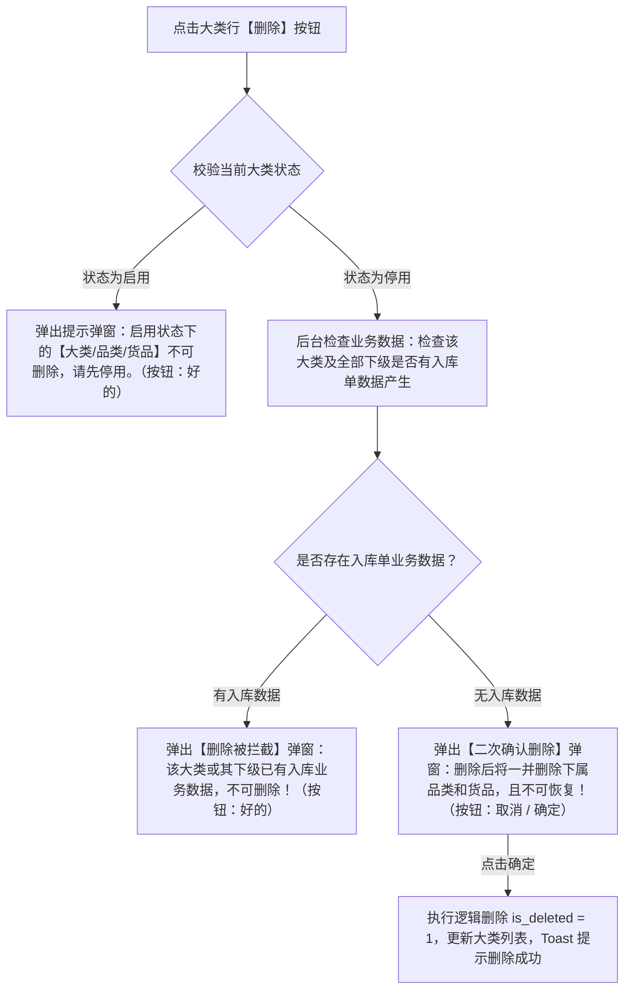

# 货品大类字段清单

> **文档定位**：货品大类（01-大类管理）所有字段的唯一定义来源。下游品类管理、货品管理及相关配置/单据页面只引用字段名称，不重复定义字段规则。
>
> **引用规则**：
> - 下游“品类管理”、“货品管理”中引用货品大类时，标注「继承自大类管理」，不重复写字段定义。
> - 下游页面展示大类信息时，优先引用本清单口径。
>
> **修改原则**：字段定义变化 → **只改本文件**；PRD 与原型不手动修改字段规则，由产品设计/AI 统一同步更新。
>
> **版本**：V1.3 | 更新时间：2026-08-14

---

## 一、基础识别字段

| 字段名称 | 字段来源 | 取值说明 | 必填性 | 新增页 | 编辑页 | 列表展示 | 可筛选 | 详情展示 | 字段说明 | 备注 |
| :--- | :--- | :--- | :--- | :--- | :--- | :--- | :--- | :--- | :--- | :--- |
| 序号 | 系统生成 | 整数；按当前列表页排序从1开始 | 系统自动 | 不适用 | 不涉及 | 是 | 否 | 不适用 | 当前列表结果的行序号 | 仅为页面展示序号，不作为持久化主键；固定为列表第一列，翻页后按当前页重新计算 |
| 大类名称 | 用户填写 | 文本，最多20字 | 必填 | 必填 | 必填 | 是 | 是（Input，支持模糊/精确搜索） | 不适用 | 新建大类录入的名称 | 大类名称在租户内需保持唯一；若该大类下关联货品已产生入库数据，保存时阻断修改并提示 |

---

## 二、系统字段

| 字段名称 | 字段来源 | 取值说明 | 必填性 | 新增页 | 编辑页 | 列表展示 | 可筛选 | 详情展示 | 字段说明 | 备注 |
| :--- | :--- | :--- | :--- | :--- | :--- | :--- | :--- | :--- | :--- | :--- |
| 创建人 | 系统生成 | 文本；当前登录用户账号/姓名 | 不适用 | 不适用 | 不涉及 | 是 | 否 | 不适用 | 提交大类创建成功时登录账号名称 | 系统自动留痕，不可由用户修改 |
| 创建时间 | 系统生成 | 日期时间；格式：`YYYY-MM-DD HH:mm:ss` | 不适用 | 不适用 | 不涉及 | 是 | 否 | 不适用 | 提交大类创建成功时间 | 系统服务端生成的时间戳，创建后不可变更 |
| 更新时间 | 系统生成 | 日期时间；格式：`YYYY-MM-DD HH:mm:ss` | 不适用 | 不适用 | 不涉及 | 是 | 否 | 不适用 | 大类状态或内容最近一次发生变化的时间 | 大类名称修改或启用/停用状态变更时自动更新 |
| 状态 | 系统生成 | 枚举：启用 (`ENABLED`)、停用 (`DISABLED`) | 不适用 | 不适用 | 不涉及 | 是 | 是（Select下拉选择，启用/停用） | 不适用 | 大类的启停用管控状态 | 新建保存后默认状态为“启用”；启用/停用时级联更新下级品类和货品；启用状态展示“停用”按钮，停用状态展示“启用”按钮 |

---

## 三、操作行为与校验规则

列表操作列提供 **【编辑】**、**【启用 / 停用】**、**【删除】** 操作按钮，具体控制规则与交互如下：

### 1. 编辑（Edit）操作规则

- **触发入口**：列表行操作列【编辑】按钮。
- **交互形式**：点击后唤起【编辑大类】弹窗。
- **校验逻辑（保存时）**：
  - 点击【保存】时，系统实时校验该租户下该大类关联的货品规格是否已有入库数据产生。
  - **拦截规则**：若该大类关联货品已产生入库数据，阻断保存修改，并弹窗提示：
    > ⚠️ **提示信息**：“该大类已有业务数据产生，不可编辑！”
  - **正常规则**：若无入库数据产生，校验大类名称唯一性后允许保存修改，更新大类名称并 Toast 提示“修改成功”。

---

### 2. 启用 / 停用（Enable / Disable）操作规则

- **按钮展示逻辑**：
  - 当大类状态为 **【启用】** 时，列表行操作列展示 **【停用】** 按钮。
  - 当大类状态为 **【停用】** 时，列表行操作列展示 **【启用】** 按钮。
- **停用确认弹窗**：
  - 点击【停用】按钮，唤起二次确认弹窗：
    > ⚠️ **弹窗提示内容**：“停用后后续新增品类无法选择，但历史已产生数据不受影响”
  - 用户点击【确定】后，大类及其下品类、货品状态级联更新为 **【停用】**，同步更新最后修改时间；级联更新失败时整体回滚。
- **启用恢复**：
  - 点击【启用】按钮，确认后大类及其下品类、货品状态级联恢复；需按级联前保存的下级状态恢复，避免覆盖下级原有停用状态。

---

### 3. 删除（Delete）操作规则

点击列表行操作列【删除】按钮时，系统按以下两阶段状态与业务引用分支进行强校验及弹窗分流：

#### 阶段一：状态强校验（启用拦截）
- **前置条件**：若大类当前 `状态 = 启用`。
- **拦截交互**：弹出提示弹窗（图标 `!`）：
  > ⚠️ **弹窗内容**：“启用状态下的【大类/品类/货品】不可删除，请先停用。”  
  > **操作按钮**：【好的】
- **处理结果**：强控阻断删除操作，大类保持启用状态。

#### 阶段二：停用大类的删除校验（检查入库单）
- **前置条件**：若大类当前 `状态 = 停用`。
- **后台扫描范围**：系统后台校验该租户下大类及其全部品类、货品是否有入库单数据产生。
- **分支 A（存在入库单业务数据）**：
  - 弹出【删除被拦截】弹窗（图标 `!`）：
    > ⚠️ **弹窗内容**：“该大类或其下级已有入库业务数据，不可删除！”  
    > **操作按钮**：【好的】
  - **处理结果**：强控拦截阻断删除，引导用户维持“停用”状态。
- **分支 B（无入库单业务数据）**：
  - 弹出【二次确认删除】弹窗（图标 `!`）：
    > ⚠️ **弹窗内容**：“删除后将一并删除下属品类和货品，且不可恢复！”  
    > **操作按钮**：【取消】【确定】
  - **处理结果**：用户点击【确定】后，系统在同一事务内对大类及全部下级执行逻辑删除（`is_deleted = 1`），刷新大类列表并 Toast 提示“删除成功”。

---

## 四、展示与引用规则

- **列表展示顺序**：固定为 `序号`、`大类名称`、`状态`、`创建人`、`创建时间`、`更新时间`、`操作`。
- **筛选联动规则**：
  - 页面查询筛选区提供 `大类名称`（文本输入框，支持模糊匹配）与 `状态`（下拉单选项：全部 / 启用 / 停用）。
- **唯一性校验规则**：`大类名称` 在新增和编辑保存时触发唯一性校验，若名称重复则阻止提交并给出具体提示：“大类名称已存在，请重新输入”。
- **停用与关联约束规则**：
  - 大类启用/停用时级联更新下级品类和货品；大类及所有上级均启用时，下级才允许被新业务选择。
  - 已关联该大类的历史品类与货品保留既有数据快照，不受物理影响。

---

## 修订记录

| 日期 | 版本 | 变更内容 | 影响范围 | 变更人 |
| :--- | :--- | :--- | :--- | :--- |
| 2026-08-10 | V1.0 | 初版发布：大类字段清单标准规范 | 筛选区、列表字段、系统字段 | AI PM / 森云科技 |
| 2026-08-10 | V1.1 | 规则升级：编辑入库数据拦截、启用停用按钮逻辑、删除两阶段控制 | 编辑、启停用、删除流程 | AI PM / 森云科技 |
| 2026-08-14 | V1.3 | 架构升级：重构为 01大类管理 独立子模块并对齐 SYZC 标准规范体系 | 01大类管理全套文档 | AI PM / 森云科技 |
