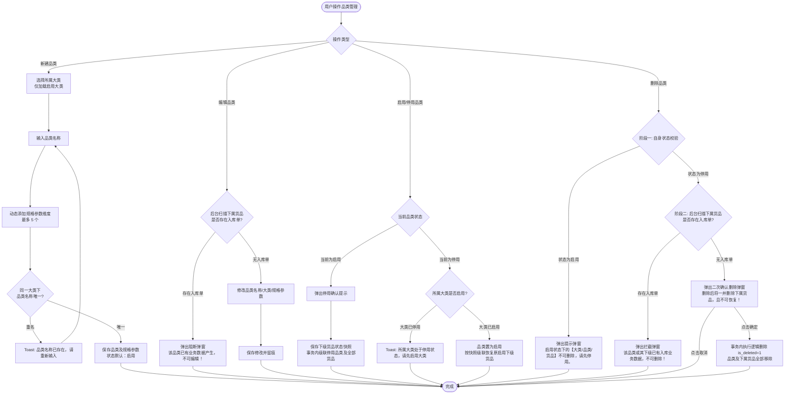
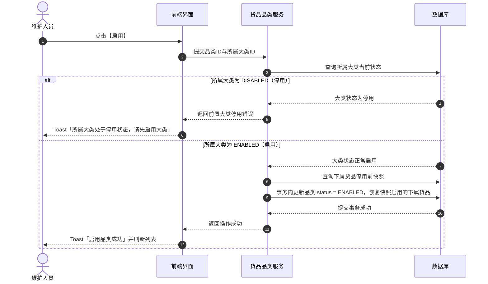
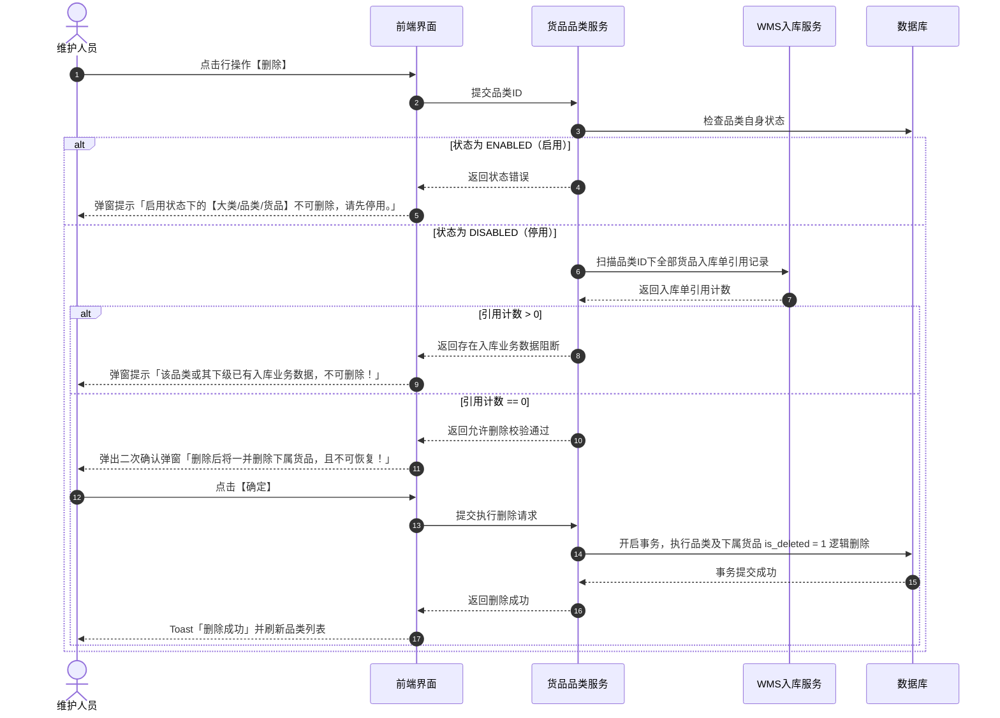

# 品类管理 业务规则规格

> **文档定位**：货品品类（02-品类管理）状态机、动态规格参数维度控制（≤5个）、上级大类依赖、入库数据强拦截、父子级联及删除两阶段控制的唯一定义来源（Single Source of Truth）。
> **参考文档**：[品类管理主PRD.md](./品类管理主PRD.md)、[品类管理字段清单.md](./品类管理字段清单.md)
> **版本**：V1.0 | 更新时间：2026-08-14 | 责任人：森云科技（Senyun Technology）

---

## 一、模块与单据定位

| 项目 | 内容 |
| :--- | :--- |
| **层级定位** | **【第2层-品类主档】**（货品规格管理中层分类与规格元数据定义节点） |
| **核心职责** | 维护从属于大类的具体品类（如：螺纹钢、热轧卷板、电解铜、白砂糖、玉米等），并定义该品类细分为货品（SKU）时的动态规格参数维度（最多 5 个）；承上启下传递有效状态。 |
| **实体映射** | `sys_goods_subcategory`（品类实体表，外键 `category_id`） |
| **上下游关系** | **上游**：继承大类管理（`01大类管理`），严格依赖所属大类启用状态； **下游**：货品管理（`03货品管理`，1:N 映射），向货品提供规格参数模板；入库单与加工管理品类分类。 |
| **数据约束** | 同一大类下品类名称严格唯一；规格参数维度数量 $\le 5$。 |

---

## 二、状态定义与计算

| 状态名称 | 字段与枚举 (`status`) | 是否可直接修改 | 含义说明 | 影响范围 |
| :--- | :--- | :---: | :--- | :--- |
| **启用** | `ENABLED` | 是 | 品类自身处于正常可用状态 | 允许下级新增货品，在父级大类启用时货品有效状态计算为“有效启用” |
| **停用** | `DISABLED` | 是 | 品类自身处于停用管控状态 | 级联停用该品类下所有货品；货品有效状态变为“无效停用”，禁止新增业务单据选择该品类货品 |
| **已删除** | `is_deleted = 1` | 否 | 逻辑删除标记，前台不可见 | 仅停用且下属货品完全无入库单时允许触发；不可物理恢复 |

---

## 三、状态流转表（核心规则矩阵）

| 当前状态 | 触发动作 | 前置校验条件 | 结果状态 | 二次确认弹窗 | 后置级联影响 | 失败阻断提示 (Toast/Modal) |
| :--- | :--- | :--- | :--- | :--- | :--- | :--- |
| 未创建 | 新建保存 | ① 品类名称必填（≤20字）且同一大类下唯一 ② 所属大类必须处于“启用”状态 ③ 动态规格参数维度 $1 \le N \le 5$ | 启用 | 无 | 自动留痕创建人、创建时间，生成品类主档与规格参数定义 | Toast: 「品类名称已存在 / 所属大类已停用 / 规格参数上限为5个」 |
| 启用/停用 | 编辑保存 | ① 品类名称、大类、规格参数校验通过 ② **入库数据强校验**：该品类下无任何入库单数据 | 保持原状态 | 无 | 更新品类名称、所属大类、规格参数维度与更新时间 | 弹窗阻断: 「该品类已有业务数据产生，不可编辑！」 |
| 启用 | 停用 | 具备配置维护/管理员权限 | 停用 | 弹窗: 「停用后后续新增货品无法选择，但历史已产生数据不受影响」 | ① 当前品类置为停用 ② **保存下级货品当前状态快照** ③ 事务内级联停用该品类下所有货品 ④ 更新更新时间 | Toast: 「停用失败，请稍后重试」 |
| 停用 | 启用 | ① 具备权限 ② **父级状态强校验**：所属大类必须为启用状态 | 启用 | 无 | ① 当前品类置为启用 ② **按快照恢复下级货品状态**：仅恢复停用前处于启用的货品 ③ 更新更新时间 | Toast: 「所属大类处于停用状态，请先启用大类」 |
| 启用 | 删除 | 无 | 阻断 | 弹窗提示 | 不允许操作，品类保持启用 | 弹窗阻断: 「启用状态下的【大类/品类/货品】不可删除，请先停用。」 |
| 停用 | 删除 | **下属无入库单强校验**：扫描该品类下所有货品，均不存在入库单数据 | 已删除 (`is_deleted=1`) | 弹窗: 「删除后将一并删除下属货品，且不可恢复！」 | 事务内将该品类及全部下属货品执行逻辑删除，前台列表与选择树中移除 | 弹窗阻断: 「该品类或其下级已有入库业务数据，不可删除！」 |

---

## 四、核心业务规则（R01 ~ R06）

### R01：大类从属与品类唯一性
- 新建或编辑品类时，所属大类仅能从当前租户处于 `ENABLED` 状态的大类中选择；
- 同一大类下，品类名称不得重复（去除首尾空格后比较）；
- 数据库底层建立 `(tenant_id, category_id, subcategory_name, is_deleted)` 唯一索引。

### R02：动态规格参数维度上限控制（最多5个）
- 每个品类支持配置其下属 SKU 的规格参数维度（如：产地、材质、品质、规格型号等）；
- 品类规格参数维度上限为 **5 个**；
- 前端在达到 5 个时置灰或隐藏【+添加规格参数】按钮，服务端接收请求时进行强校验，超过 5 个直接抛出业务异常阻断保存。

### R03：上级大类状态实时校验
- 品类执行启用操作或新建保存时，服务端必须重新查询所属大类的实时状态；
- 若所属大类已被停用，必须强行阻断并提示「所属大类处于停用状态，请先启用大类」，防止出现“上级停用但下级私自激活”的数据孤岛。

### R04：编辑操作入库单拦截规则
- 编辑品类属性（名称、所属大类、规格参数维度）时，服务端实时校验下属货品入库单引用情况；
- 一旦该品类下任一货品存在入库单（`wms_inbound_order_detail` 中存在记录），全量阻断保存并唤起「该品类已有业务数据产生，不可编辑！」阻断弹窗。

### R05：级联停用与两阶段删除
- **级联停用**：品类停用时级联将其下所有货品置为停用，并保留停用前状态快照；
- **两阶段删除**：
  - 阶段一：品类为启用状态直接阻断；
  - 阶段二：品类为停用状态时扫描所有下属货品是否存在入库单，无入库单经二次确认后，同事务对该品类及下属货品执行逻辑删除（`is_deleted = 1`）。

### R06：并发控制与数据一致性
- 基于乐观锁机制（`version` 字段），防止多人并发修改同一品类或并发调整规格参数冲突；
- 规格参数维度的增删改与品类主表更新必须处于同一数据库事务中。

---

## 五、权限与风控约束

| 角色 | 查看品类列表 | 新建/编辑品类 | 启用品类 | 停用品类 | 删除品类 | 数据范围 |
| :--- | :---: | :---: | :---: | :---: | :---: | :--- |
| **系统管理员** | ✅ | ✅ | ✅ | ✅ | ✅ | 当前租户全量 |
| **配置维护人员** | ✅ | ✅ | ✅ | ✅ | ✅ | 当前租户全量 |
| **风控管理人员** | ✅ | ❌ | ❌ | ❌ | ❌ | 当前租户全量（只读） |
| **业务人员/只读用户** | ✅ | ❌ | ❌ | ❌ | ❌ | 当前租户全量（只读） |

---

## 业务流程与联动

> 以下内容由原《品类管理业务流程》合并，与上文规则 ID 配合阅读；重复的状态机定义以上文为准。

## 一、业务流程说明

1. **新建品类与规格定义流程**：
   - 维护人员录入品类名称、选择已启用的所属大类，并动态添加规格参数维度（1~5个）；
   - 系统校验大类启用状态、品类名称在所属大类下的唯一性、规格维度数量上限；全部通过后保存生效。
2. **编辑品类流程**：
   - 用户点击编辑，系统实时扫描下属货品是否已产生入库单：
     - 若已产生入库数据，弹出阻断弹窗并终止保存；
     - 若未产生入库数据，允许修改品类名称、所属大类及规格参数维度并保存。
3. **启用/停用品类流程**：
   - **启用**：系统强前置校验所属大类状态，若所属大类停用则阻断启用；若大类启用，则更新品类为启用并按快照恢复下属原本启用的货品；
   - **停用**：用户确认后，保存下属货品状态快照，事务内级联停用所有下属货品。
4. **两阶段删除流程**：
   - **阶段一**：品类自身为启用状态时直接阻断并提示「请先停用后再删除」；
   - **阶段二**：品类处于停用状态时，后台扫描下属所有货品入库单引用：存在入库单则拦截；无入库单经二次确认后，同事务对该品类及下属货品执行逻辑删除（`is_deleted = 1`）。

---

## 二、品类管理核心业务流程图

---

## 三、操作时序图

### 1. 品类启用前置大类状态校验时序

### 2. 品类两阶段删除时序

## 修订记录

| 日期 | 版本 | 变更 |
| :--- | :---: | :--- |
| 2026-08-20 | — | 合并原《品类管理业务流程》至本文件「业务流程与联动」章节 |
