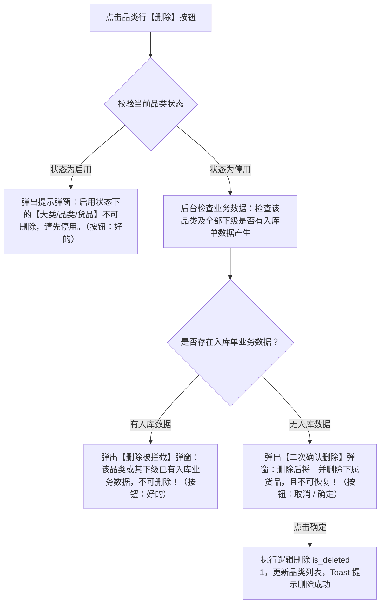

# 货品品类字段清单

> **文档定位**：货品品类（02-品类管理）所有字段的唯一定义来源。下游货品管理及相关配置/单据页面只引用字段名称，不重复定义字段规则。
>
> **引用规则**：
> - 下游“货品管理”中引用货品品类时，标注「继承自品类管理」，不重复写字段定义。
> - 下游页面展示品类信息时，优先引用本清单口径。
> - 大类信息继承自 [01大类管理字段清单.md](../01大类管理/大类管理字段清单.md)。
>
> **修改原则**：字段定义变化 → **只改本文件**；PRD 与原型不手动修改字段规则，由产品设计/AI 统一同步更新。
>
> **版本**：V1.2 | 更新时间：2026-08-14

---

## 一、基础识别字段

| 字段名称 | 字段来源 | 取值说明 | 必填性 | 新增页 | 编辑页 | 列表展示 | 可筛选 | 详情展示 | 字段说明 | 备注 |
| :--- | :--- | :--- | :--- | :--- | :--- | :--- | :--- | :--- | :--- | :--- |
| 序号 | 系统生成 | 整数；按当前列表页排序从1开始 | 系统自动 | 不适用 | 不涉及 | 是 | 否 | 不适用 | 当前列表结果的行序号 | 仅为页面展示序号，不作为设备持久化主键；固定为列表第一列，翻页后按当前页重新计算 |
| 品类 | 用户填写 | 文本，最多20字 | 必填 | 必填 | 必填 | 是 | 是（Input，支持模糊/精确搜索） | 不适用 | 新建品类录入的名称 | 必填，不超过20个字符；同一大类下品类名称需保持唯一；若关联货品已产生入库数据保存时阻断 |
| 所属大类 | 用户选择（继承自大类管理） | 下拉选择；仅来源于已启用的货品大类 | 必填 | 必填 | 必填 | 是 | 是（Select下拉选择，支持搜索） | 不适用 | 品类所属的货品大类名称 | 继承自大类管理；下拉选项仅展示所有状态为【启用】的大类，停用大类不予加载 |
| 货品规格参数 | 用户填写 | 动态配置标签/文本组；最多可添加5个参数字段 | 必填 | 必填 | 必填 | 是 | 否 | 不适用 | 品类的货品规格参数维度 | 定义该品类细分成最小货品单位（SKU）的规格维度（如：产地、品质）；添加上限为5个 |

---

## 二、系统字段

| 字段名称 | 字段来源 | 取值说明 | 必填性 | 新增页 | 编辑页 | 列表展示 | 可筛选 | 详情展示 | 字段说明 | 备注 |
| :--- | :--- | :--- | :--- | :--- | :--- | :--- | :--- | :--- | :--- | :--- |
| 创建人 | 系统生成 | 文本；当前登录用户账号/姓名 | 不适用 | 不适用 | 不涉及 | 是 | 否 | 不适用 | 提交品类创建成功时登录账号名称 | 系统自动留痕，不可由用户修改 |
| 创建时间 | 系统生成 | 日期时间；格式：`YYYY-MM-DD HH:mm:ss` | 不适用 | 不适用 | 不涉及 | 是 | 否 | 不适用 | 提交品类创建成功时间 | 系统服务端生成的时间戳，创建后不可变更 |
| 更新时间 | 系统生成 | 日期时间；格式：`YYYY-MM-DD HH:mm:ss` | 不适用 | 不适用 | 不涉及 | 是 | 否 | 不适用 | 品类状态或内容最近一次发生变化的时间 | 品类名称、所属大类修改或启用/停用状态变更时自动更新 |
| 状态 | 系统生成 | 枚举：启用 (`ENABLED`)、停用 (`DISABLED`) | 不适用 | 不适用 | 不涉及 | 是 | 是（Select下拉选择，启用/停用） | 不适用 | 品类的启停用管控状态 | 新建保存后默认状态为“启用”；启用/停用时级联更新下级货品；启用状态展示“停用”按钮，停用状态展示“启用”按钮 |

---

## 三、操作行为与校验规则

列表操作列提供 **【编辑】**、**【启用 / 停用】**、**【删除】** 操作按钮，具体控制规则与交互如下：

### 1. 新增 / 编辑（Add / Edit）操作规则

- **触发入口**：列表顶部【新建品类】按钮 / 行操作列【编辑】按钮。
- **表单交互与细化校验**：
  - **品类名称**：必填，文本格式，限制输入 **不超过 20 个字符**。保存时校验在同一大类下的名称唯一性。
  - **所属大类**：必填，下拉单选框。下拉选项**仅显示所有处于“启用”状态的大类**；停用的大类不可选择。
  - **货品规格参数**：
    - 用于定义当前品类下进一步细分为最小货品单位（SKU）时的规格参数维度（例如：“苹果”品类下添加“产地”、“品质”两个规格参数字段）。
    - 支持点击【+添加规格参数】动态增加参数输入框，可添加多组。
    - **添加上限**：单个品类下规格参数最多添加 **5 个**。当规格参数数量达到 5 个时，隐藏/置灰【+添加规格参数】按钮，阻止继续添加。
- **编辑保存校验（入库数据拦截）**：
  - 点击【保存】时，系统实时校验该租户下该品类关联的货品规格是否已有入库数据产生。
  - **拦截规则**：若该品类关联货品已产生入库数据，阻断保存修改，并弹窗提示：
    > ⚠️ **提示信息**：“该品类已有业务数据产生，不可编辑！”
  - **正常规则**：若无入库数据产生，校验品类名称唯一性后允许保存修改，更新品类内容并 Toast 提示“修改成功”。

---

### 2. 启用 / 停用（Enable / Disable）操作规则

- **按钮展示逻辑**：
  - 当品类状态为 **【启用】** 时，列表行操作列展示 **【停用】** 按钮。
  - 当品类状态为 **【停用】** 时，列表行操作列展示 **【启用】** 按钮。
- **停用确认弹窗**：
  - 点击【停用】按钮，唤起二次确认弹窗：
    > ⚠️ **弹窗提示内容**：“停用后后续新增货品无法选择，但历史已产生数据不受影响”
  - 用户点击【确定】后，品类及其下货品状态级联更新为 **【停用】**，同步更新最后修改时间；级联更新失败时整体回滚。
- **启用恢复**：
  - 点击【启用】按钮前，系统强校验所属大类状态：若所属大类处于停用状态，阻断操作并 Toast 提示「所属大类处于停用状态，请先启用大类」；
  - 所属大类启用时，确认后品类及其下货品状态级联恢复；需按级联前保存的下级状态恢复，避免覆盖下级原有停用状态。

---

### 3. 删除（Delete）操作规则

点击列表行操作列【删除】按钮时，系统按以下两阶段状态与业务引用分支进行强校验及弹窗分流：

#### 阶段一：状态强校验（启用拦截）
- **前置条件**：若品类当前 `状态 = 启用`。
- **拦截交互**：弹出提示弹窗（图标 `!`）：
  > ⚠️ **弹窗内容**：“启用状态下的【大类/品类/货品】不可删除，请先停用。”  
  > **操作按钮**：【好的】
- **处理结果**：强控阻断删除操作，品类保持启用状态。

#### 阶段二：停用品类的删除校验（检查入库单）
- **前置条件**：若品类当前 `状态 = 停用`。
- **后台扫描范围**：系统后台校验该租户下品类及其全部货品是否有入库单数据产生。
- **分支 A（存在入库单业务数据）**：
  - 弹出【删除被拦截】弹窗（图标 `!`）：
    > ⚠️ **弹窗内容**：“该品类或其下级已有入库业务数据，不可删除！”  
    > **操作按钮**：【好的】
  - **处理结果**：强控拦截阻断删除，引导用户维持“停用”状态。
- **分支 B（无入库单业务数据）**：
  - 弹出【二次确认删除】弹窗（图标 `!`）：
    > ⚠️ **弹窗内容**：“删除后将一并删除下属货品，且不可恢复！”  
    > **操作按钮**：【取消】【确定】
  - **处理结果**：用户点击【确定】后，系统在同一事务内对品类及全部下级货品执行逻辑删除（`is_deleted = 1`），刷新品类列表并 Toast 提示“删除成功”。

---

## 四、展示与引用规则

- **列表展示顺序**：固定为 `序号`、`品类`、`所属大类`、`货品规格参数`、`状态`、`创建人`、`创建时间`、`更新时间`、`操作`。
- **筛选联动规则**：
  - 页面查询筛选区提供 `品类名称`（文本输入框，模糊匹配）、`所属大类`（下拉选择，仅加载启用大类）与 `状态`（下拉单选：全部 / 启用 / 停用）。
- **唯一性校验规则**：`品类名称` 在新增和编辑保存时触发唯一性校验，在同一大类内重名则阻止提交并提示：“品类名称已存在，请重新输入”。
- **停用与关联约束规则**：
  - 品类启用/停用时级联更新下级货品；大类及品类均启用时，下级货品才允许被新业务选择。

---

## 修订记录

| 日期 | 版本 | 变更内容 | 影响范围 | 变更人 |
| :--- | :--- | :--- | :--- | :--- |
| 2026-08-10 | V1.0 | 初版发布：品类字段清单标准规范 | 筛选区、列表字段、系统字段 | AI PM / 森云科技 |
| 2026-08-10 | V1.1 | 规则升级：规格参数上限5个、所属大类联动、入库拦截与删除控制 | 规格配置、启停用、删除流程 | AI PM / 森云科技 |
| 2026-08-14 | V1.2 | 架构升级：重构为 02品类管理 独立子模块并对齐 SYZC 标准规范体系 | 02品类管理全套文档 | AI PM / 森云科技 |
