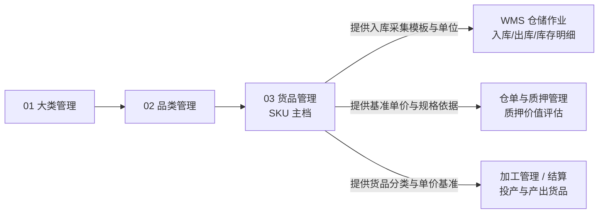

# 货品管理主PRD

> **模块定位**：货品规格管理第 3 节点（SKU 主档），作为最小业务与交易核算单元，维护动态规格参数、计量参数与单位、入库收集信息配置（逐项必填）、基准参考单价（元/万元精度）与设价日志，实现自身/有效状态双层控制、入库强校验与两阶段安全删除。  
> **版本**：V2.0 | 更新时间：2026-09-02 | 责任人：森云科技（Senyun Technology）  
> **编写依据**：[货品管理字段清单.md](./货品管理字段清单.md) 是本模块所有字段格式、16 项入库收集预置项与页面展示的唯一基准；[货品管理业务规则规格.md](./货品管理业务规则规格.md) 是本模块状态机、有效启用公式、两阶段删除与设价规则的唯一定义来源。

---

## 1. 业务背景

货品管理是 SYZC 存货监管系统“货-仓-金”全链路的最小实体基石。货品（SKU）继承品类所定义的动态规格维度，并绑定计量单位、入库信息收集规则和参考单价，向入库单、实时库存、数字仓单、动产质押与融资核算提供唯一的货品规格与价格参照。

---

## 2. 功能范围

| 包含功能 (In Scope) | 不包含功能 (Out of Scope) |
| :--- | :--- |
| - 货品列表与左侧大类/品类层级树联动展示； - 添加货品（填写规格取值、计量参数与单位）； - 入库收集信息配置（从系统 16 项预置项中勾选并逐项配置必填）； - 编辑货品与入库配置（入库引用强拦截）； - 启用/停用货品与有效状态实时动态计算； - 设置价格（支持元/万元展示精度）与价格修改历史留痕； - 货品删除（阶段一启用拦截 + 阶段二入库单扫描）； - 货品详情全量只读预览与操作审计追溯。 | - 入库单、出库单业务办理与实物质检； - 数字仓单生成、流转与解押办理； - 融资授信审批与额度扣减； - 大宗商品外部行情自动拉取与自动调价。 |

---

## 3. 模块定位与系统链路

---

## 4. 业务场景

| 场景ID | 场景名称 | 场景类型 | 业务说明与核心约束 |
| :--- | :--- | :--- | :--- |
| **S01** | 添加货品 | 主流程 | 选择启用状态品类，录入动态规格参数、计量参数与单位，同品类下组合唯一校验 |
| **S02** | 入库收集信息配置 | 主流程 | 从 16 项预置项中按需勾选，逐项设置是否必填；入库单选择货品后动态生成字段 |
| **S03** | 编辑货品与配置 | 主流程 | 修改货品规格、计量单位或入库配置；若已产生入库单强阻断并弹窗提示 |
| **S04** | 启用/停用与有效状态计算 | 控制流程 | 货品有效状态由自身、品类、大类综合实时计算（$\text{自身} \land \text{品类} \land \text{大类}$），仅有效启用方可被下游选择 |
| **S05** | 设置参考单价 | 主流程 | 录入元单价（保留2位小数），支持元（6位+千分位）与万元（10位）切换展示，设价自动记录日志 |
| **S06** | 删除货品 | 阻断/终态 | 阶段一启用强拦截；阶段二扫描入库单，无入库单经二次确认后逻辑删除 |

---

## 5. 状态机与动作能力矩阵

> 状态流转详细规则、有效启用计算公式及阻断提示详见 [货品管理业务规则规格.md §二 状态定义与计算公式](./货品管理业务规则规格.md#二状态定义与计算公式)。

| 动作名称 | 自身启用且有效启用 | 自身启用但父级停用 | 自身停用 (`DISABLED`) | 已删除 (`is_deleted=1`) |
| :--- | :---: | :---: | :---: | :---: |
| **查看列表 / 预览** | ✅ | ✅ | ✅ | ❌ |
| **添加货品** | ✅ | ✅ | ✅ | ❌ |
| **编辑货品** | ✅（需无入库数据） | ✅（需无入库数据） | ✅（需无入库数据） | ❌ |
| **设置价格 / 查看记录** | ✅ | ✅ | ✅ | ❌ |
| **停用货品** | ✅ | ✅ | ❌ | ❌ |
| **启用货品** | ❌ | ❌ | ✅（重算有效状态） | ❌ |
| **删除货品** | ❌（阶段一阻断） | ❌（阶段一阻断） | ✅（阶段二无入库单允许） | ❌ |
| **下游业务新建选择** | ✅ | ❌（被过滤拦截） | ❌（被过滤拦截） | ❌ |

---

## 6. 页面与字段规则

页面全量字段定义、取值范围、16 项入库收集预置项与展示格式完全继承自 [货品管理字段清单.md](./货品管理字段清单.md)：
- **列表展示字段**：`序号`、`品类`、`[动态规格参数拆列组]`、`计量参数(单位)`、`入库收集信息摘要`、`单价`、`状态`、`操作`；
- **左侧层级树**：大类/品类层级树联动，支持关键字检索，底部提供【显示已停用货品信息】勾选框；
- **操作弹窗**：添加/编辑货品表单、设置价格弹窗、修改记录二级弹窗、货品详情预览弹窗、停用确认弹窗、删除二次确认弹窗。

---

## 7. 核心业务规则索引

| 规则编码 | 规则名称 | 核心口径摘要 | 唯一定义来源 |
| :--- | :--- | :--- | :--- |
| **R-SKU-01** | 货品 SKU 唯一性校验 | 同品类下 `规格参数组合 + 计量参数 + 单位` 组合唯一 | [业务规则规格 R01](./货品管理业务规则规格.md#r01货品-sku-唯一性校验) |
| **R-SKU-02** | 计量参数与单位分离 | 计量参数与单位独立维护；列表按 `计量参数(单位)` 拼接展示 | [业务规则规格 R02](./货品管理业务规则规格.md#r02计量参数与单位分离维护) |
| **R-SKU-03** | 入库收集信息配置 | 从 16 项预置项中勾选并逐项设必填；未配置入库单不展示额外项 | [业务规则规格 R03](./货品管理业务规则规格.md#r03入库收集信息配置规则) |
| **R-SKU-04** | 入库单联动与强校验 | 入库单动态渲染采集项；强校验必填、数值区间与日期逻辑关系 | [业务规则规格 R04](./货品管理业务规则规格.md#r04入库单联动与强校验规则) |
| **R-SKU-05** | 参考单价维护与展示精度 | 按元录入存储（2位）；展示支持元（6位+千分位）与万元（10位）；设价自动留痕 | [业务规则规格 R05](./货品管理业务规则规格.md#r05参考单价维护与展示精度) |
| **R-SKU-06** | 缺价下游统一提示 | 货品未设单价时，下游业务单据统一提示「系统未设置的单价」 | [业务规则规格 R06](./货品管理业务规则规格.md#r06未设置单价的下游统一提示规则) |
| **R-SKU-08** | 编辑操作入库单拦截 | 实时扫描入库单引用；存在入库单阻断修改并弹窗提示 | [业务规则规格 R08](./货品管理业务规则规格.md#r08编辑操作入库单强拦截) |
| **R-SKU-09** | 两阶段安全删除 | 阶段一启用拦截；阶段二扫描入库单，无记录二次确认后逻辑删除 | [业务规则规格 R09](./货品管理业务规则规格.md#r09两阶段安全删除) |
| **R-SKU-10** | 并发乐观锁与幂等 | 采用 `version` 乐观锁；设价与删除接口做幂等防重 | [业务规则规格 R10](./货品管理业务规则规格.md#r10并发乐观锁与幂等) |

---

## 8. 权限与风控约束

- **数据权限**：基于 `tenant_id` 强隔离；
- **操作权限**：系统管理员与配置维护人员具备添加、编辑、启停用、设价与删除权限；风控人员具备查看及设价权限；普通业务人员仅具备只读与引用权限。

---

## 9. 边界与异常处理

- **动态规格组合重复拦截**：提交已存在的 SKU 规格组合，Toast 提示「该货品规格配置已存在，请重新输入」；
- **日期关系校验冲突**：入库单提交时若生产日期 + 保质期 $\ne$ 过期时间，服务端强行阻断并提示核对；
- **并发设价冲突**：两人同时设置价格，后提交者提示「数据已被他人修改，请刷新后重试」。

---

## 10. 验收重点

| 编号 | 验收项 | 输入条件与操作步骤 | 预期结果 |
| :--- | :--- | :--- | :--- |
| **V-SKU-01** | SKU 重复配置拦截 | 同品类下录入相同规格组合、计量参数和单位 | 保存失败，Toast 提示「该货品规格配置已存在，请重新输入」 |
| **V-SKU-02** | 有效状态计算过滤 | 货品自身启用但所属大类或品类已停用 | 有效状态计算为无效停用，入库单等下游新建无法检索选择 |
| **V-SKU-03** | 入库收集项必填校验 | 货品配置了必填入库项，入库单提交时未填 | 前后端均阻断提交，提示对应字段必填 |
| **V-SKU-04** | 设价与历史留痕 | 录入元单价并保存 | 更新当前单价，价格修改记录中新增一条操作流水 |
| **V-SKU-05** | 未设单价下游提示 | 货品单价为空，在加工/抵质押单据中引用 | 价格位置统一展示「系统未设置的单价」 |
| **V-SKU-06** | 编辑入库拦截 | 已产生入库单的货品，点击编辑保存 | 阻断保存，弹出阻断弹窗「该货品已有业务数据产生，不可编辑！」 |
| **V-SKU-07** | 启用删除拦截 | 处于启用状态的货品点击删除 | 阻断操作，提示「启用状态下的【大类/品类/货品】不可删除，请先停用。」 |
| **V-SKU-08** | 停用删除业务拦截 | 存在入库单的停用货品点击删除 | 阻断操作，提示「该【大类/品类/货品】已有业务数据产生，不可删除！」 |
| **V-SKU-09** | 无入库数据删除成功 | 停用货品且无入库单，二次确认删除 | 执行逻辑删除，列表不再展示，删除后不可恢复 |

---

## 修订记录

| 日期 | 版本 | 变更摘要 | 变更人 |
| :--- | :---: | :--- | :--- |
| 2026-08-14 | V1.0 | 初版货品管理主 PRD | 产品团队 |
| 2026-09-02 | **V2.0** | **V3.0 标杆架构重构**：去除重复规则正文，规范 10 章结构，将字段唯一定义收拢至字段清单、业务逻辑收拢至业务规则规格 | AI PM / 森云科技 |
