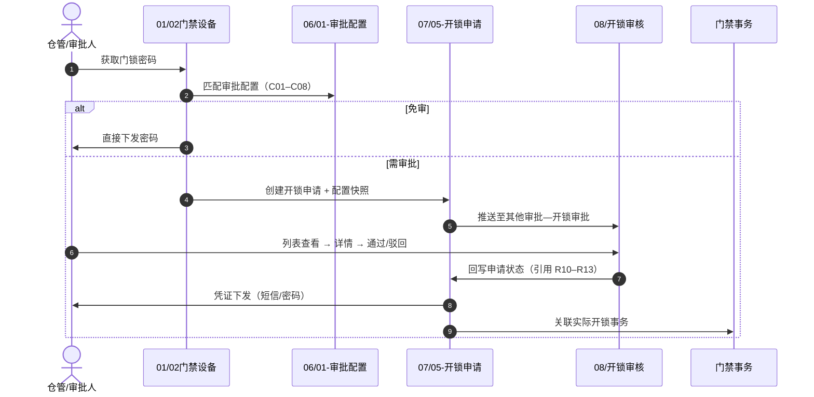

# 06 / 07 / 08 联合导读

> **版本**：V1.2 | **更新日期**：2026-08-28
>
> **文档定位**：6.2 门禁开锁审批扩展链路的**跨板块阅读入口**（覆盖 `06-门禁开锁审批`、`07-审批中心`、`08-开锁审核`，含 07/05-开锁申请 子类型）。在 [07/00-06与07联合导读](./07-审批中心/00-06与07联合导读.md) 基础上，补充 **08-开锁审核**（审批人菜单页）的分工说明。
>
> **文件命名**：`00-` 为版本根目录跨板块文档前缀，非独立板块编号；板块编号见文件名 `06-07-08` 段。
>
> **上级索引**：[6.2版本 README](./README.md) · [08-开锁审核主PRD](./08-开锁审核/开锁审核主PRD.md)

---

## 一、三板块 + 子类型分工

| 模块 | 角色类比 | 管什么 | 不管什么 |
| :--- | :--- | :--- | :--- |
| **06-门禁开锁审批** | 规则配置台 | 何时需审批、审批链怎么配；全链路推演 | 申请、待办 UI、凭证 |
| **07-审批中心** | 审批大厅（平台） | 待办/已办/抄送/我的申请记录（**接入流程配置**的子类型） | 未接入流程配置的独立其他审批 |
| **07/05-开锁申请** | 业务单据 | 申请主表、凭证、事务；我的申请记录子类型 | 审批人列表 UI、配置 CRUD |
| **08-开锁审核** | 审批人工作台 | 其他审批—开锁审批 列表/详情/通过/驳回 | 申请状态机正文、配置 CRUD |

---

## 二、对象归属速查

| 序号 | 对象 | 唯一定义文档 | 物理目录 |
| :---: | :--- | :--- | :--- |
| — | 审批配置 | [门禁开锁审批配置业务规则规格](./06-门禁开锁审批/01-审批配置/门禁开锁审批配置业务规则规格.md) | `06/01-审批配置/` |
| — | 开锁申请主表 | [01开锁申请主表字段清单](./07-审批中心/05-子类型/01-开锁申请/01-字段清单/01开锁申请主表字段清单.md) | `07/05-子类型/01-开锁申请/` |
| — | 临时开锁凭证 | [02临时开锁凭证字段清单](./07-审批中心/05-子类型/01-开锁申请/01-字段清单/02临时开锁凭证字段清单.md) | 申请人查看密码；审批人仅查看状态摘要 |
| — | 通用审批动作 | [通用审批处理字段清单](./07-审批中心/04-操作字段清单/01通用审批处理字段清单.md) | `07/04-操作字段清单/` |
| — | **审批人列表/详情/审批 UI** | [开锁审核业务规则规格](./08-开锁审核/开锁审核业务规则规格.md) | **`08/`** |
| — | 全链路推演 | [门禁开锁审批-业务流程推演](./06-门禁开锁审批/门禁开锁审批-业务流程推演.md) | `06/` 根目录 |

---

## 三、端到端时序

---

## 四、菜单与文档映射

| 线上菜单 | 模块唯一定义 |
| :--- | :--- |
| 配置管理 → 业务流程管理 → 开锁审批 | `06/01-审批配置` |
| 工作中心 → 审批中心 → 其他审批 → 开锁审批（PC） | **`08-开锁审核`** |
| 业务办理 → 其他审批 → 开锁审批（H5） | **`08-开锁审核`** |
| 工作中心 / 业务办理 → 我的申请记录（子类型=开锁申请） | `07/05-开锁申请` |
| 仓储 → 门禁设备 → 获取门锁密码 | `01/02门禁设备` + `07/05-开锁申请`（发起） |
| 审批中心 → 待处理 / 已处理 | `07-审批中心`（**不含**开锁） |

---

## 修订记录

| 日期 | 版本 | 变更内容 |
| :--- | :---: | :--- |
| 2026-08-28 | V1.0 | 初版；补充 08 模块分工与时序 |
| 2026-08-28 | V1.1 | 从 08 目录迁至版本根目录，与叶子模块结构对齐 |
| 2026-08-28 | V1.2 | 澄清 `00-` 命名约定；「四模块」改为「三板块 + 子类型」 |
