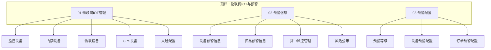

# B端PC · 菜单地图（6.2 目标态）

> **版本**：V1.0 | **更新日期**：2026-09-03
>
> **文档定位**：6.2 上线后的 **PC 顶栏/侧栏目标结构**（非当前线上采集口径）。
>
> **当前线上基准**（上线前仍以采集为准）：[最新基准版/B端PC/00-菜单地图.md](../../🌟🌟🌟-最新基准版/B端PC/00-菜单地图.md) §一
>
> **原型对照**：`03-前端原型demo/B端PC/src/config/navigation.ts`（顶栏 #6 `物联网IOT与预警`）
>
> **变更摘要**：[00-菜单迭代记录.md](./00-菜单迭代记录.md) · **割接**：[04-历史迁移与割接方案/](./04-历史迁移与割接方案/历史迁移总索引.md)

---

## 一、顶栏一级模块（6.2 目标）

| 序号 | 顶栏模块 | 说明 |
| :---: | :--- | :--- |
| 1 | **工作中心** | 审批中心、数据一览等（与线上一致） |
| 2 | 仓储 | 库存、仓单、货权、出入移库、加工等；**不含**设备管理 |
| 3 | 融资/监管 | 同线上 |
| 4 | 交易 | 同线上 |
| 5 | 风控 | **仅**风控看板 / 数字仓库看板；**不含**风险信息流水 |
| 6 | **物联网IOT与预警** | ⭐ 6.2 新增顶栏；合并原设备管理 + 风险信息 + 风险管理（配置） |
| 7 | 统计/看板 | 同线上 |
| 8 | 结算 | 同线上 |
| 9 | 配置管理 | 门户、仓库、货品、业务流程等；**不含**风险管理（预警配置） |

---

## 二、物联网IOT与预警 · 侧栏结构

| 一级侧栏 | 页面 | 6.2 PRD 目录 | 原线上归属 |
| :--- | :--- | :--- | :--- |
| **物联网IOT管理** | 监控设备 | `01-物联网IOT管理/01监控设备/` | 仓储 → 设备管理 |
| | 门禁设备 | `01-物联网IOT管理/02门禁设备/` | 仓储 → 设备管理 |
| | 物联设备 | `01-物联网IOT管理/03物联设备/` | 仓储 → 设备管理 |
| | GPS设备 | `01-物联网IOT管理/04GPS设备/` | 仓储 → 设备管理 |
| | 人脸配置 | `01-物联网IOT管理/05人脸配置/` | 仓储 → 设备管理 |
| **预警信息** | 设备预警信息 | `02-预警信息/01设备预警信息/` | 风控 → 风险信息；合流门禁事务/设备事务通知流水 |
| | 押品预警信息 | `02-预警信息/02押品预警信息/` | 风控 → 风险信息 |
| | 贷中风控管理 | `02-预警信息/03贷中风控管理/` | 风控 → 风险信息 |
| | 风险公示 | `02-预警信息/04风险公示/` | 风控 → 风险信息 |
| **预警配置** | 预警等级 | `03-预警配置/01预警等级/` | 6.2 新增；原无独立菜单 |
| | 设备预警配置 | `03-预警配置/02设备预警配置/` | 配置管理 → 风险管理；合流设备事务通知配置 |
| | 订单预警配置 | `03-预警配置/03订单预警配置/` | 配置管理 → 风险管理 |

---

## 三、取消 / 合流菜单（6.2 不再独立成页）

| 6.1 / 线上菜单 | 6.2 处置 |
| :--- | :--- |
| 仓储 → 设备管理 → **门禁事务记录** | 菜单取消；流水合入 **设备预警信息** |
| 风控 → 风险信息 → **设备事务通知信息** | 菜单取消；流水合入 **设备预警信息** |
| 配置管理 → 风险管理 → **设备事务通知配置** | 菜单取消；规则合入 **设备预警配置** |

---

## 四、与权限清单双轨口径

| 口径 | CSV `记录状态` | 何时使用 |
| :--- | :--- | :--- |
| **线上** | `active` | 当前生产/采集菜单路径；基准菜单地图 §一 |
| **6.2 目标** | `6.2-target` | 本文件侧栏路径；原型权限主列表以 `6.2目标` 标识，并支持「6.2目标菜单」聚合弹窗 |

> 上线后：以新采集刷新基准 §一 → 将 `6.2-target` 行提升为 `active` → 归档旧路径行。详见 [00-菜单迭代记录/维护说明-双轨口径.md](../00-菜单迭代记录/维护说明-双轨口径.md)。

---

## 五、修订记录

| 日期 | 说明 |
| :--- | :--- |
| 2026-09-03 | 初版：6.2 顶栏「物联网IOT与预警」及三块侧栏合流映射 |
