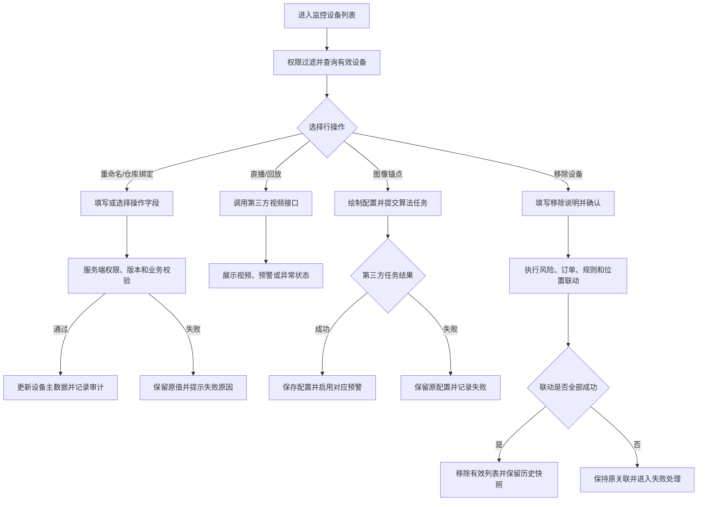

# 监控设备业务规则规格

> **文档定位**：监控设备状态机、动作约束、校验规则、权限与计算规则的唯一定义来源。主 PRD、字段清单只引用本文件规则 ID，不重复定义规则本体。

> **文档定位**：监控设备的设备分类、权限、操作约束、第三方联动和审计规则唯一来源。
> **参考文档**：[监控设备主PRD](./监控设备主PRD.md)、[监控设备字段清单](./监控设备字段清单.md)、[监控设备业务规则规格](监控设备业务规则规格.md)
> **版本**：V1.0 | **更新时间**：2026-08-14

## 一、对象定位

监控设备是设备基础数据对象，不生成独立审批单据，不建立持续审批状态机。设备主数据维护当前有效信息；直播、回放、图像锚点和移除属于设备操作记录或第三方调用记录。

## 二、设备分类规则

| 规则编号 | 规则 |
| :--- | :--- |
| R01 | 设备分类为视频监控、人脸门禁；具备摄像头能力的人脸门禁可同时展示在监控设备菜单。 |
| R02 | 设备编码或设备唯一ID是设备关联、幂等和审计的唯一业务键，不得使用列表序号。 |
| R03 | 系统内名称首次继承设备原名称；人工重命名后，第三方名称变化不得覆盖系统内名称。 |
| R04 | 已绑定仓库设备按仓库数据权限返回；未绑定设备仍受租户、机构和菜单权限约束。 |

## 三、操作规则

| 操作 | 前置条件 | 后置影响 | 失败处理 |
| :--- | :--- | :--- | :--- |
| 重命名 | 有设备操作权限、名称非空且不超过50字 | 更新系统内名称、修改人和更新时间 | 保留原名称，不产生部分更新 |
| 仓库绑定 | 位置层级归属正确，后端校验当前订单关联 | 更新仓库、库房、分区和具体位置 | 版本冲突或业务阻断时不更新 |
| 查看直播/回放 | 有查看权限、设备有效 | 产生第三方查看记录，不修改设备 | 展示加载、离线、超时或断流状态 |
| 图像锚点 | 监控类型不重复，区域至少3点且闭合 | 创建或更新算法任务和预警配置 | 第三方失败时本地配置不得标记成功 |
| 移除设备 | 有移除权限，填写移除说明 | 风险失效、订单解绑、规则解绑和仓库解绑 | 任一联动失败执行全量回滚；回滚失败进入补偿任务并告警，仍不得提示成功 |

## 四、并发、幂等与审计

1. 重命名、仓库绑定、图像锚点和移除必须进行服务端版本校验、锁或等效并发控制。
2. 同一设备同一操作请求必须支持幂等；重复提交不得产生重复绑定、重复解绑或重复算法任务。
3. 审计日志至少包含操作人、角色、时间、IP、请求标识、设备编码、操作前后快照、结果和失败原因。
4. 设备移除后，历史订单详情保留设备快照；设备重入只恢复第三方基础识别信息，系统内配置需要重新维护。

---

## 业务流程与联动

> 以下内容由原《监控设备业务流程》合并，与上文规则 ID 配合阅读；重复的状态机定义以上文为准。

> **版本**：V1.0 | **更新时间**：2026-08-14
> **适用模块**：监控设备查询、设备维护、视频查看、图像锚点和设备移除

## 一、流程说明

1. 用户进入列表后，系统先按租户、机构、菜单和仓库数据权限查询有效设备。
2. 用户可查看直播、回放或配置图像锚点；第三方调用异常只影响当前操作。
3. 用户执行重命名或仓库绑定时，系统重新校验权限、设备版本和业务关联后保存。
4. 用户执行移除设备时，系统记录移除说明，完成风险失效、订单解绑、规则解绑和位置解绑；失败时保留原状态并记录失败原因。
5. 三方设备轮询重新发现已移除设备时，只恢复第三方基础识别信息，系统配置不自动恢复。

## 二、设备操作流程图

## 三、异常回路

| 异常场景 | 处理结果 |
| :--- | :--- |
| 设备已被其他用户修改 | 阻止覆盖，提示刷新后重试 |
| 第三方直播或回放超时 | 保留当前页面，展示接口异常，不修改业务数据 |
| 图像锚点删除失败 | 本地配置保留，不关闭对应预警 |
| 移除联动任一子步骤失败 | 采用全量回滚：撤销本次请求已完成的全部联动变更，按操作前快照恢复设备、订单、风险、规则、通知和仓库关联；回滚完成前不提示成功且不得从有效列表移除。全量回滚失败时进入内部补偿任务并告警，仍返回失败 |
| 移除设备重新被三方发现 | 仅恢复基础识别信息，名称、位置、锚点和预警配置清空 |

## 修订记录

| 日期 | 版本 | 变更 |
| :--- | :---: | :--- |
| 2026-08-20 | — | 合并原《监控设备业务流程》至本文件「业务流程与联动」章节 |
