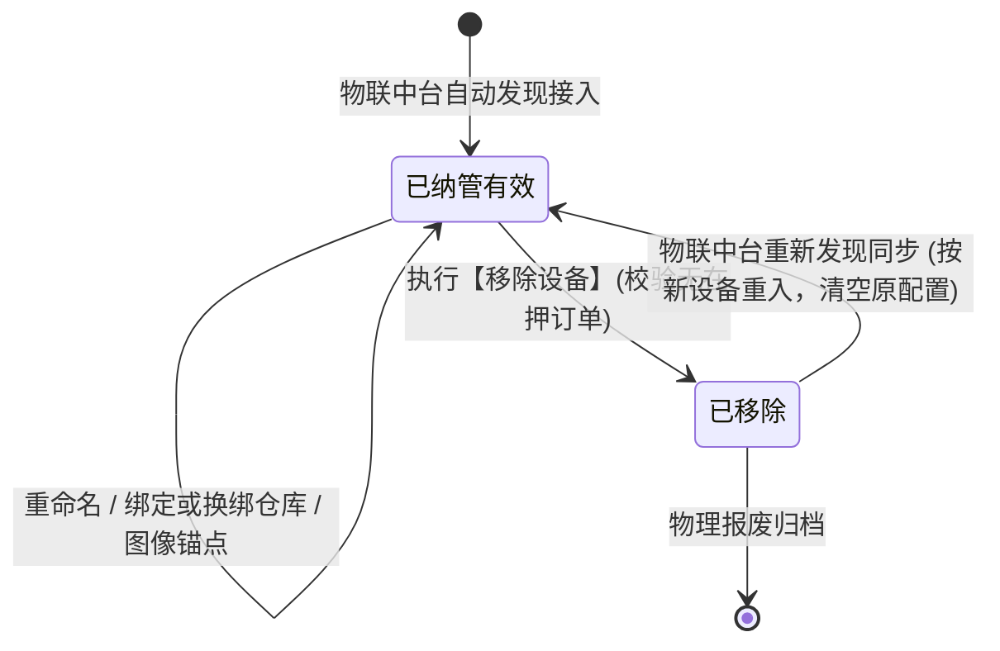
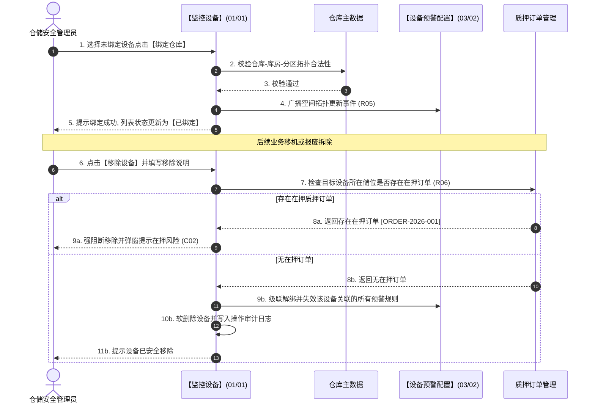

# 监控设备 业务规则规格

> **文档定位**：**三件套核心**——状态机、动作约束、校验规则、计算联动、权限与跨模块流程的**唯一定义来源**。配套：[主PRD](./监控设备主PRD.md)（业务与页面功能）、[字段清单](./监控设备字段清单.md)（字段）。ASCII/Demo 为衍生，只引用本文件规则 ID，不重复定义规则本体。
>
> **统一引用规范**：
> - 本台账：【监控设备】台账（菜单：物联网IOT管理 → 监控设备，代号 01/01）
> - 门禁设备：【门禁设备】台账（菜单：物联网IOT管理 → 门禁设备，代号 01/02）
> - 下游预警：【设备预警配置】策略（菜单：预警配置 → 设备预警配置，代号 03/02）
> - 下游流水：【设备预警信息】台账（菜单：预警信息 → 设备预警信息，代号 02/01）
>
> **版本**：V4.0 基准版 | **更新时间**：2026-09-18 | **责任人**：产品架构组

---

## 一、单据与能力定位

| 维度 | 标准定位规格 | 业务解释与控制边界 |
| :--- | :--- | :--- |
| **模块层级** | 物理感知与设备资产层（Physical Perception & Asset Layer） | 纳管仓储视觉感知设备主数据，支持流媒体交互与空间拓扑标定。 |
| **菜单路径** | `物联网IOT管理 → 监控设备` | 系统代号为 `01/01`，为监管库区视频安防中枢台账。 |
| **核心职责** | 监控与人脸设备视觉资产维护 | 提供设备重命名、仓位绑定、直播调阅、历史回放、图像锚点标定与级联解绑移除。 |
| **单据/数据源头** | 物联中台自动发现与手工纳管 | 设备硬件信息源自海康、大华等第三方设备中台自动同步；业务别名与仓位由系统管理员手工维护。 |
| **上下游协同** | 空间坐标与视觉能力向下赋能 | 向订单提供核验抓拍画面，向【设备预警配置】(03/02) 提供设备载体，向【设备预警信息】(02/01) 提供视频流支持。 |
| **审核与存证机制**| 无审批流，操作强一致性留痕 | 属性修改实时生效，变更操作全量记入审计日志，历史被引用的订单保留不可变设备快照。 |

---

## 二、数量与计算口径隔离表

| 指标/判定项 | 严格业务口径与判定公式 | 边界条件与约束控制 | 关联规则编号 |
| :--- | :--- | :--- | :--- |
| **绑定状态严格口径** | 设设备的仓库标识为 $W_{id}$、库房标识为 $R_{id}$、分区标识为 $Z_{id}$。绑定状态判定函数定义为：$$\text{BoundState}(d) = \begin{cases} \text{BOUND}, & \text{if } W_{id} \neq \emptyset \;\lor\; R_{id} \neq \emptyset \;\lor\; Z_{id} \neq \emptyset \\ \text{UNBOUND}, & \text{if } W_{id} = \emptyset \;\land\; R_{id} = \emptyset \;\land\; Z_{id} = \emptyset \end{cases}$$ | 1. 只要绑定了任一空间层级即为已绑定； 2. 筛选「未绑定」时严禁带出历史残留仓库信息。 | **R05** |
| **在押订单关联阻断判定** | 设设备所在库房分区当前生效的抵质押在押订单集合为 $\mathbb{O}_{active}$，该设备绑定的质押监管任务集合为 $\mathbb{T}(d)$。移除允许函数定义为：$$\text{CanRemove}(d) = \begin{cases} \text{FALSE}, & \text{if } \mathbb{O}_{active} \cap \mathbb{T}(d) \neq \emptyset \\ \text{TRUE}, & \text{if } \mathbb{O}_{active} \cap \mathbb{T}(d) = \emptyset \end{cases}$$ | 若返回 FALSE，系统强制阻断移除，防止在押抵质押物脱离视频监管。 | **R06** |
| **图像锚点多边形几何有效性** | 设锚点顶点序列为 $V = (v_1, v_2, \dots, v_n)$，其中 $v_i = (x_i, y_i) \in [0, 1]^2$。有效性必须满足：$$n \ge 3 \quad \land \quad \forall i \neq j, \; \overline{v_i v_{i+1}} \cap \overline{v_j v_{j+1}} = \emptyset \quad (\text{除公共端点外无自相交})$$ | 顶点数必须不少于 3 个点，构成闭合平面且不自相交；坐标按视频分辨率归一化存储。 | **R07** |
| **历史回放时间窗口计算** | 设当前系统时间戳为 $T_{now}$，查询回放起止为 $[T_{start}, T_{end}]$。必须满足：$$T_{now} - 30 \times 86400 \le T_{start} < T_{end} \le T_{now} \quad \land \quad T_{end} - T_{start} \le 86400$$ | 1. 仅支持查询最近 30 天内历史录像； 2. 单次查询跨度不得超过 24 小时。 | **R08** |

---

## 三、单据状态机与生命周期流转

### 3.1 运行状态与生命周期
* 设备本身为物理资产，采用**物理连接状态**与**系统纳管生命周期**双轨模型：
  - **物理连接状态**：在线 (`ONLINE`)、离线 (`OFFLINE`)、故障 (`FAULT`)；由第三方物联平台心跳网关实时推送维持；
  - **纳管生命周期**：已纳管有效、已移除软删除 (`REMOVED`)。

### 3.2 设备生命周期流转图

### 3.3 动作控制与流转规则表

| 当前生命周期 | 触发动作 | 适用角色 | 前置业务校验条件 | 结果状态 | 联动后置影响 | 失败阻断处理与提示 |
| :--- | :--- | :--- | :--- | :--- | :--- | :--- |
| **已纳管有效** | 重命名 | 仓储安全管理员 (`R-WH-SEC`) | 1. 具备设备编辑权限； 2. 系统内名称合法（1~50字）； 3. 租户内同类型不重名。 | 保持有效 | 1. 更新系统内名称； 2. 标记人工别名保护； 3. 写入操作审计日志。 | 浮窗提示：「重命名失败：系统内名称已存在」 |
| **已纳管有效** | 绑定仓库 | 仓储安全管理员 (`R-WH-SEC`) | 1. 选择合法仓库/库房/分区； 2. 具备目标仓库管辖权限。 | 保持有效 | 1. 建立设备与储位空间拓扑； 2. 状态更新为已绑定； 3. 热更新预警引擎设备索引。 | 浮窗提示：「绑定失败：无权操作该仓库」 |
| **已纳管有效** | 图像锚点 | 质押风控专员 (`R-RISK-AUDIT`) | 1. 设备处于在线状态； 2. 多边形围栏顶点 $\ge 3$ 且闭合。 | 保持有效 | 1. 固化锚点配置坐标； 2. 向边缘网关下发 AI 分析任务； 3. 关联启用对应预警规则。 | 浮窗提示：「标定失败：多边形存在自相交」 |
| **已纳管有效** | 移除设备 | 仓储安全管理员 (`R-WH-SEC`) | 1. 当前设备无生效在押订单关联； 2. 强制输入 $\le 200$ 字移除说明。 | **已移除** | 1. 级联失效关联设备预警规则； 2. 列表物理隐蔽，历史单据保留快照； 3. 全事务提交并记审计日志。 | 浮窗提示：「移除失败：当前设备所在库位存在在押质押订单，禁止移除」 |

---

## 四、动作能力与流转控制矩阵

| 触发动作 | 操作入口 | 适用角色 | 前置业务校验条件 | 结果状态 | 联动后置影响 | 失败阻断提示 |
| :--- | :--- | :--- | :--- | :--- | :--- | :--- |
| **【查看直播】** | 列表行操作【查看直播】 | 授权风控/监管人员 | 设备为有效且在线（离线阻断） | 调起播放弹窗 | 调用第三方流媒体接口，记录调阅审计 | 浮窗提示：「设备当前离线，无法调阅直播画面」 |
| **【查看回放】** | 列表行操作【查看回放】 | 授权风控/监管人员 | 选择 30 天内且跨度 $\le 24$ 小时 | 调起回放弹窗 | 查询 NVR/云存储录像切片播放 | 浮窗提示：「所选时间段暂无历史录像」 |
| **【重命名】** | 列表行操作【重命名】 | 仓储安全管理员 | 携带最新乐观锁版本戳 | 更新别名 | 更新系统内名称并固化别名保护标记 | 浮窗提示：「名称冲突或数据版本已过期」 |
| **【绑定仓库】** | 列表行操作【绑定仓库】 | 仓储安全管理员 | 目标仓库属于当前用户数据权限管辖 | 更新仓位 | 空间拓扑建立，通知预警引擎更新设备池 | 浮窗提示：「仓库绑定失败：目标储位无效」 |
| **【图像锚点】** | 列表行操作【图像锚点】 | 质押风控专员 | 仅限 PC 端操作；设备在线且已绑定 | 调起绘制弹窗 | 下发边缘 AI 算法分析任务 | 浮窗提示：「设备未绑定仓库，请先绑定仓位」 |
| **【移除设备】** | 列表行操作【移除设备】 | 仓储安全管理员 | 无在押订单占用；必录移除说明 | 移出有效列表 | 级联失效预警规则，写入全量审计 | 浮窗提示：「移除阻断：存在在押质押订单」 |

---

## 五、核心业务规则清单

### 5.1 纳管体系与命名保护规则 (R01~R04)

#### 【设备类型分类与多菜单映射】(R01)
1. **多能力兼具归属**：设备分类划分为「视频监控」与「人脸门禁」。
2. **能力复用展示**：普通视频监控摄像头仅展示在【监控设备】台账；**具备摄像头能力的人脸门禁设备，同时出现在【监控设备】(01/01) 与【门禁设备】(01/02) 菜单中**。在监控设备菜单中，人脸门禁被视作摄像头，完全支持查看直播、查看回放、图像锚点等视觉操作。

#### 【硬件业务标识全局唯一性】(R02)
1. **持久业务主键**：系统强制以底层物联平台分配的 `device_code`（设备编码）或 `device_id` 为全局唯一业务主键。
2. **禁止假主键关联**：严禁采用列表渲染的自增序号或前端临时 ID 作为数据关联与接口入参，所有审计日志与订单引用强绑定全局设备编码。

#### 【系统内名称人工维护保护】(R03)
1. **首次继承机制**：第三方设备新接入同步入库时，若系统内名称为空，系统默认将第三方原始名称与通道号拼接赋值为系统内名称。
2. **人工别名强保护**：管理员一旦在平台执行了【重命名】操作并保存，系统立即为该记录打上 `manual_renamed = 1` 保护标记。后续第三方定时轮询同步设备基础档案时，**绝对禁止覆盖已人工维护的系统内名称**。

#### 【仓库数据权限双重过滤】(R04)
1. **已绑定设备过滤**：已绑定具体仓库的设备，严格按照当前登录人员绑定的仓库数据权限范围进行查询过滤。
2. **未绑定设备隔离**：尚未绑定具体仓库的新接入设备，仅向具备租户级或所属机构总部级管理权限的用户展示，防止跨机构数据穿透。

### 5.2 空间绑定与级联解绑规则 (R05~R07)

#### 【仓库储位空间拓扑绑定】(R05)
1. **拓扑层级校验**：执行仓库绑定时，系统强制校验所选的仓库、库房、分区必须具备严格的物理树形包含关系，禁止跨仓库悬挂储位。
2. **具体位置补充**：支持录入最多 100 字的具体物理点位说明（如「一号库大门内侧立柱2米高」），便于现场快速找寻。

#### 【移除设备级联解绑与安全阻断】(R06)
1. **在押订单强阻断**：点击移除设备时，系统必须实时校验设备所在库区是否存在状态为「在押」或「待解押」的供应链金融订单。若存在，系统**绝对阻断移除**，弹窗提示：「阻断：该设备所在库区当前存在在押订单【订单编号】，受金融风控监管限制禁止移除」。
2. **关联规则级联解绑**：若无在押订单，确认移除后，系统在单个原子事务内完成两项操作：① 级联将【设备预警配置】(03/02) 中绑定该设备的预警规则置为失效；② 将设备从监控有效列表中逻辑移除，并记录移除人与原因。
3. **重入重置规则**：第三方轮询重新接入已移除的设备时，视为新设备重新纳管，原系统内别名、仓位绑定与图像锚点一律清空，需重新配置。

#### 【图像锚点多边形几何与算法任务】(R07)
1. **几何拓扑合法性**：用户在视频首帧上标定的电子围栏多边形，顶点数必须 $\ge 3$，且任意两条不相邻边严禁发生自相交。
2. **下发与回滚**：锚点保存后系统异步向 AI 视频分析引擎推送算法任务。若第三方算法引擎返回错误，本地配置自动回滚并浮窗提示，禁止展示虚假布控成功。

---

## 六、异常与边界控制矩阵

| 异常编号 | 异常场景 | 系统判定与控制动作 | 前端反馈与提示 |
| :--- | :--- | :--- | :--- |
| **【设备离线调阅直播】(C01)**| 点击【查看直播】但设备心跳断开为 OFFLINE | 拦截流媒体拉流请求 | 播放器居中展示离线占位图，提示：「设备已离线，无法调阅实时画面」 |
| **【在押订单移除阻断】(C02)**| 尝试移除绑定在在押质押库区的监控设备 | 校验到 $\mathbb{O}_{active} \cap \mathbb{T}(d) \neq \emptyset$ | 错误弹窗阻断：「该设备关联在押质押订单【{订单号}】，禁止移除」 |
| **【多边形自相交】(C03)** | 图像锚点绘制的多边形线段出现自交叉 | 多边形有效性算法校验失败 | 画布红线标定交点，提示：「围栏边线不可相交，请重新绘制」 |
| **【回放跨度超限】(C04)** | 选择历史回放时间范围大于 24 小时或超30天 | 校验起止时间区间 | 浮窗提示：「单次回放查询跨度不可超过 24 小时，且仅限查询最近 30 天内录像」 |
| **【重命名名称冲突】(C05)**| 重命名为当前租户下已有的其他设备别名 | 租户内唯一性校验失败 | 输入框标红提示：「该设备名称已被使用，请更换」 |
| **【三方流媒体超时】(C06)**| 调阅直播/回放时第三方视频网关超过 10s 未响应 | 流媒体请求超时熔断 | 播放器重试提示：「视频拉流超时，请检查网络或点击重新加载」 |

---

## 七、跨模块业务联动与时序推演

---

## 八、规则全景速查索引表

| 规则类别 | 规则编号 | 规则名称 | 核心约束摘要 |
| :--- | :--- | :--- | :--- |
| **分类映射** | **R01** | 设备类型与多菜单映射规则 | 人脸门禁兼具摄像头能力，同时在监控设备与门禁设备纳管。 |
| **业务主键** | **R02** | 硬件业务标识全局唯一规则 | 全局以设备编码/设备 ID 作为持久化业务主键，杜绝虚假序号。 |
| **名称保护** | **R03** | 系统内名称人工别名保护规则 | 首次继承原名，人工重命名后形成强保护，第三方同步不覆盖。 |
| **权限隔离** | **R04** | 仓库数据权限双重过滤规则 | 已绑设备按仓库权限隔离，未绑设备按租户机构总部权限隔离。 |
| **空间绑定** | **R05** | 仓库储位空间拓扑绑定规则 | 强制校验仓库-库房-分区层级合法性，绑定任一层即为已绑定。 |
| **级联解绑** | **R06** | 移除设备级联解绑与安全阻断 | 存在在押订单时强阻断移除；其余关联规则原子级联解绑。 |
| **算法标定** | **R07** | 图像锚点多边形几何有效性 | 顶点数 $\ge 3$ 且无自相交，异步下发 AI 算法任务，失败回滚。 |
| **录像调阅** | **R08** | 历史回放时效与跨度约束规则 | 仅限查询最近 30 天录像，单次查询跨度不得超过 24 小时。 |

---
*版本说明：V4.0 基准版 | 责任人：产品架构组 | 2026年09月*
