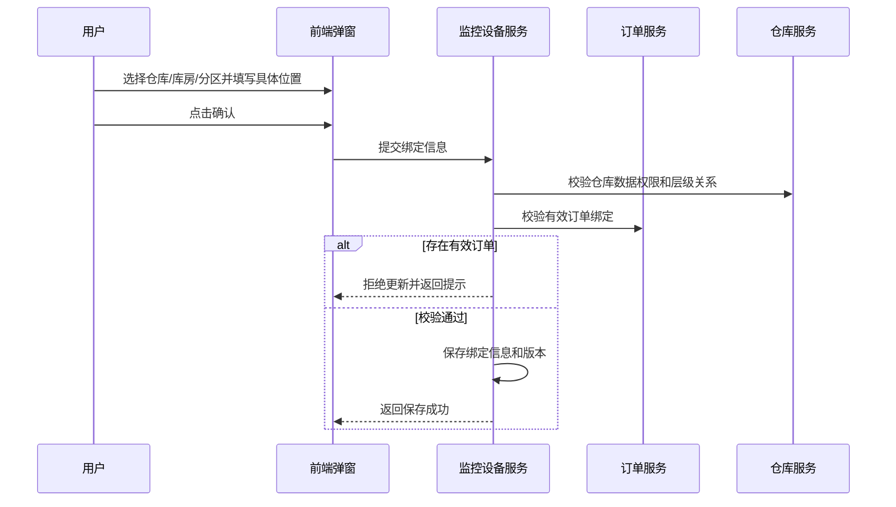
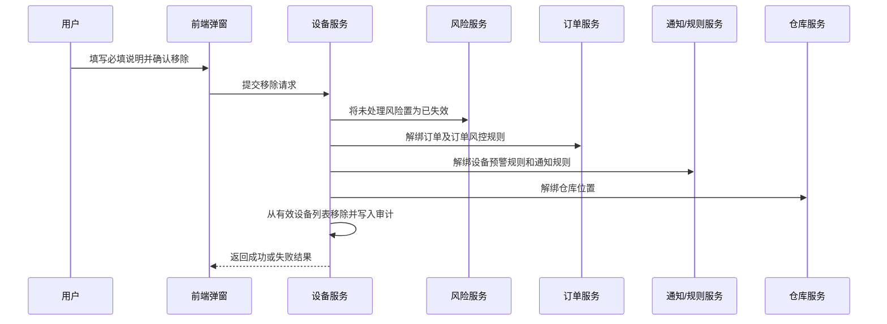

# 监控设备主需求文档

> **版本**：V1.8 | 2026-08-14
> **读者**：研发工程师、测试工程师、产品复核
> **编写依据**：监控设备字段清单、设备操作的历史逻辑和规则
> **字段基准**：`监控设备字段清单.md` 是设备主数据和系统字段的唯一基准；行操作的输入、查询、展示、返回及特有审计字段以对应操作子清单为准。

## 1. 业务背景

监控设备是仓储监管场景中的设备基础数据管理入口，负责维护视频监控和具备摄像头能力的人脸门禁设备，并提供直播、回放、图像锚点和仓库绑定等操作。设备数据同时被订单、库存、门禁和风险预警模块引用，设备移除或绑定变更会影响多个下游业务。

本菜单不承载审批单据，也不产生需要持续推进的业务任务。设备的“状态”属于系统维护字段，不能通过状态按钮直接驱动业务流转；重命名、仓库绑定、图像锚点和移除设备均是独立操作。

## 2. 功能范围

**本期范围**：

- 监控设备列表、组合筛选和字段展示；
- 视频监控和人脸门禁设备分类展示与筛选；
- 按数据权限查看已绑定位置或未绑定位置的设备；
- 重命名、仓库绑定、查看直播、查看回放、图像锚点和移除设备；
- 人脸门禁设备在监控设备菜单中的摄像头能力；
- 设备与订单、风险预警规则、通知规则和仓库绑定的联动处理；
- 第三方直播、回放和算法接口调用；
- 设备操作的权限校验、并发控制、幂等处理和审计记录。

### 2.1 移动端范围（已确认）

移动端支持设备列表与筛选、重命名、仓库绑定、查看直播、查看回放和移除设备；图像锚点、第三方设备同步和操作审计查询不纳入本次移动端范围。

**不在本期范围**：

- 设备接入、设备注册和第三方设备基础档案创建；
- 人脸门禁菜单中的人脸授权、临时密码、开门记录和门禁控制；
- 风险-设备预警信息模块中的预警处理、解除和处置；
- 抵质押订单审批、订单解绑的业务办理过程；
- 监控设备独立业务状态机和独立审批流程；
- 第三方厂商接口内部算法、视频编解码和设备在线状态计算。

## 3. 模块定位

### 3.1 系统位置

| 项目 | 内容 |
| :--- | :--- |
| 模块层级 | 设备基础数据与监控操作层 |
| 核心职责 | 维护设备名称、分类和仓库位置，并提供摄像头相关操作入口 |
| 数据来源 | 第三方设备接入数据、系统设备配置和用户仓库绑定操作 |
| 上游依赖 | **第三方设备接入**提供设备 ID、设备编码、设备分类和原始名称；**仓库档案**提供仓库/库房/分区 ID、有效状态和具体位置；**账号与数据权限**提供当前账号、机构和仓库可见范围，列表及绑定操作由服务端二次校验。来源：[监控设备字段清单](./监控设备字段清单.md)、REF-WH、REF-ACCOUNT、REF-RBAC。 |
| 下游引用 | 入库/出库/移库/转让/加工抓拍、抵质押业务管理、设备预警信息、押品预警信息、设备事务通知、订单预警配置、设备预警配置、设备事务通知配置 |
| 业务单据 | 不生成独立业务单据，不建立单据状态机 |

### 3.2 设备分类关系

| 设备分类 | 数据范围 | 摄像头能力 | 菜单展示 |
| :--- | :--- | :--- | :--- |
| 视频监控 | 历史数据 | 查看直播、查看回放、图像锚点等 | 监控设备 |
| 人脸门禁 | 新增设备分类 | 与视频监控一致，可查看直播、查看回放、配置图像锚点等 | 可同时存在于监控设备和人脸门禁菜单 |

人脸门禁因具备摄像头功能，属于监控设备范围。同一设备 ID作为同一设备主数据，根据设备能力归属并展示到对应菜单；具备摄像头能力的人脸门禁可同时出现在“监控设备”和“人脸门禁”菜单。设备分类、设备编码、名称和操作结果不得出现不一致；设备分类后端编码仍需由研发确定。

### 3.3 设备同步规则

移除设备成功后，设备从监控设备有效列表中移除。系统每 5 分钟轮询三方设备接口，发现被移除设备仍存在时，按原设备 ID重新加入设备数据和有效列表；重入记录仅恢复三方设备基础识别信息，系统内名称、仓库/库房/分区绑定、图像锚点和设备预警配置均不恢复并清空，需重新维护。本模块不定义独立状态字段或状态流转。

## 4. 页面与字段规则

### 4.1 字段引用

列表字段、筛选字段、字段来源、取值、展示顺序和字段级校验统一以[监控设备字段清单](./监控设备字段清单.md)为准；本主 PRD 不重复定义字段属性。行操作的输入、查询、展示、返回和特有审计字段统一以[监控设备操作字段清单索引](./02-操作字段清单/操作字段清单索引.md)及其子清单为准。

本节只保留数据权限、操作流程、业务规则和异常处理；“操作”列是页面交互列，不作为设备主数据字段。

### 4.3 数据可见范围

| 设备绑定情况 | 可见规则 |
| :--- | :--- |
| 已绑定位置 | 登录用户拥有该位置所属仓库数据权限时可见；无对应仓库权限时不返回设备数据 |
| 未绑定位置 | 当前租户内账号有效且具备监控设备菜单查看权限的用户可见；不要求仓库数据权限；仓库、库房、分区和具体位置字段返回空值 |
| 人脸门禁设备 | 在监控设备菜单按设备分类展示；在人脸门禁菜单按人脸门禁业务权限展示 |
| 已移除设备 | 有效设备列表不展示；订单历史详情按快照规则保留 |

“所有用户可见”仍受租户隔离、账号有效性和菜单功能权限限制，不代表跨租户可见。

## 5. 操作功能

### 5.1 操作总览

| 操作 | 适用设备 | 入口 | 是否改变设备基础数据 | 是否涉及跨模块联动 |
| :--- | :--- | :--- | :---: | :---: |
| 重命名 | 视频监控、人脸门禁 | 列表操作列 | 是 | 否 |
| 仓库绑定 | 视频监控、人脸门禁 | 列表操作列 | 是 | 是，订单绑定校验、仓库数据权限 |
| 查看直播 | 视频监控、人脸门禁 | 列表操作列 | 否 | 是，第三方直播接口 |
| 查看回放 | 视频监控、人脸门禁 | 列表操作列 | 否 | 是，第三方回放接口和风险预警查询 |
| 图像锚点 | 视频监控、人脸门禁 | 列表操作列 | 是 | 是，第三方算法任务和设备预警配置 |
| 移除设备 | 视频监控、人脸门禁 | 列表操作列 | 是 | 是，订单、预警规则、通知规则和仓库绑定 |

人脸门禁在监控设备菜单中的操作能力与视频监控一致。操作按钮是否在两个菜单同时展示，必须同时满足对应菜单功能权限和设备数据权限。

### 5.2 重命名

| 规则项 | 规则 |
| :--- | :--- |
| 字符限制 | 最多 50 个字，不允许提交空值 |
| 可见范围 | 已绑定位置设备需拥有所属仓库数据权限；未绑定位置设备按当前租户内有效账号和菜单权限可见 |
| 默认名称 | 系统内名称首次默认取设备原名称；设备原名称按设备名称与通道名称拼接优先、设备名称兜底 |
| 保存结果 | 更新系统内名称、修改人员和更新时间；保存后的系统内名称不再被三方名称同步覆盖 |
| 取消 | 关闭弹窗，不保存修改 |
| 保存失败 | 保留原名称，不产生部分更新，并提示失败原因 |

保存时后端必须重新执行权限校验、名称长度校验和数据版本校验，不能仅依赖前端按钮控制。

### 5.3 仓库绑定

#### 5.3.1 选择规则

| 字段 | 规则 |
| :--- | :--- |
| 仓库 | 下拉单选，非必选；按登录账号仓库数据权限展示 |
| 库房分区 | 选择仓库后展示；支持跨选多个库房和多个分区，非必选 |
| 具体位置 | 非必填，最多 50 个字，用于补充设备实际安装或布设位置 |
| 已选位置 | 展示当前勾选的仓库、库房和分区完整信息；原“已选仓库”区域统一改名为“已选位置” |
| 层级约束 | 已选库房和分区必须归属于所选仓库；分区必须归属于对应库房 |

设备最多绑定一个仓库，但可在同一仓库下绑定多个库房和多个分区。仓库为空时，库房和分区不得保留无归属选择；具体位置是否允许在仓库为空时单独保存，以研发接口校验规则为准。

#### 5.3.2 弹窗操作

| 操作 | 规则 |
| :--- | :--- |
| 取消 | 关闭弹窗，不保存本次仓库、库房、分区和具体位置变更 |
| 确认 | 后端校验通过后保存或更新绑定信息，并更新修改人员和更新时间 |
| 清空绑定 | 允许将已有绑定编辑为空；但保存前仍需执行有效订单校验 |
| 有效订单阻断 | 设备已绑定申请中，或处于抵/质押中、监管中的抵/质押订单或监管订单时，不允许更新绑定信息 |
| 阻断提示 | “该设备已绑定有效订单，请先解绑后再修改。” |

保存前必须由后端重新校验设备当前订单绑定情况，防止并发创建订单或并发修改绑定绕过限制。

#### 5.3.3 设备绑定后的抓拍范围

| 设备绑定范围 | 抓拍范围 |
| :--- | :--- |
| 仅绑定某仓库 | 该仓库、下属全部库房及所有库房下属分区 |
| 绑定某库房，未绑定该库房具体分区 | 该库房及其下属全部分区 |
| 绑定某库房具体分区 | 仅该仓库-库房-分区具体单元 |

多个绑定项的抓拍范围取展开结果并集，并对重复设备去重。一个摄像头绑定多个区域时，抓拍结果展示该摄像头绑定的全部位置信息。

### 5.4 查看直播

1. 用户从列表操作列点击“查看直播”。
2. 系统校验菜单权限、设备数据权限和设备有效状态。
3. 系统调用第三方直播查看接口。
4. 页面展示第三方返回的直播画面。

直播查看不修改设备基础数据和业务状态。第三方接口加载中、设备离线、鉴权失败、超时和断流属于交互或异常状态；直播、回放和图像锚点调用三方接口发生异常时，统一提示：“赛达监控平台调用异常”。

### 5.5 查看回放

回放页面同时展示回放画面和该监控设备关联的图像识别预警。多个预警必须以列表形式展示。

| 预警信息 | 展示规则 |
| :--- | :--- |
| 预警时间 | 展示预警产生时间 |
| 预警类型 | 展示命中的图像识别类型 |
| 预警描述 | 展示预警具体描述 |
| 处理人 | 预警已处理时展示处理人 |
| 处理机构 | 预警已处理时展示处理人所属机构 |
| 解除时间 | 预警已处理时展示解除时间 |
| 情况说明 | 预警已处理时展示处置说明 |
| 现场照片 | 预警已处理时支持查看 |
| 解除预警抓拍照片 | 预警已处理时支持查看 |

预警处理由“风险-设备预警信息”模块负责，监控设备仅只读展示，不提供处理、解除或修改预警状态入口。

### 5.6 图像锚点

#### 5.6.1 页面和分组规则

| 规则项 | 规则 |
| :--- | :--- |
| 配置对象 | 当前监控设备 |
| 配置组数量 | 最多创建的组数量与后端返回的监控类型数量一致；当前监控类型为 3 种，最多 3 组 |
| 监控类型 | 行人入侵检测、车辆入侵检测、物品形态监控；每组单选 |
| 类型唯一 | 不同配置组的监控类型不允许重复 |
| 时间模板 | 后端返回选项；每组单选，例如“全天模板” |
| 锚点背景 | 打开监控时捕捉到的一帧静态图片，不使用动态视频作为绘制背景 |

#### 5.6.2 画布与坐标

- 鼠标可在画布上绘制闭合锚点区域。
- 锚点区域最少 3 个点位；少于 3 个点位或未闭合时不可保存。
- “重置锚点”只清空当前前端画布，不删除已保存配置。
- 锚点坐标按原始监控画面分辨率保存；前端展示时根据当前画面尺寸换算。

#### 5.6.3 保存、离开和删除

| 操作 | 规则 |
| :--- | :--- |
| 单组保存 | 每组单独保存，保存成功后更新该组配置和算法任务 |
| 未保存离开 | 弹窗：“当前配置尚未保存，是否确认离开？” |
| 确定离开 | 关闭弹窗并离开页面，不保存未保存配置 |
| 取消离开 | 关闭弹窗，停留当前页面 |
| 删除确认 | 弹窗：“您正在删除${页签名称}的锚点，删除后预警不可用？” |
| 删除确定 | 调用赛达删除云端算法任务接口；成功后删除该组本地配置并关闭该监控类型预警 |
| 删除取消 | 关闭弹窗，不删除配置 |
| 三方删除失败 | 本地配置保留，不得标记为已删除；提示失败并支持按接口规则重试 |
| 删除全部 | 所有锚点删除后，同步关闭该设备的图像预警配置，后续不再触发图像预警 |

删除单组只关闭对应监控类型的预警，不影响同一设备其他监控类型配置。

### 5.7 移除设备

#### 5.7.1 概念统一

平台端“删除设备”和当前操作“移除设备”是同一个动作，正式文档统一称为“移除设备”。移除成功后设备不再出现在监控设备有效列表中。

#### 5.7.2 确认弹窗

| 规则项 | 规则 |
| :--- | :--- |
| 弹窗标题 | 提示 |
| 提示内容 | “您正在操作${设备类型}:${系统内设备名称}的移除，请确认是否继续该操作！移除设备后该设备产生的所有未处理风险状态会失效，所绑定的订单会解绑，所涉及的预警规则、通知规则会解除该设备绑定。如需继续请点击确认！” |
| 说明字段 | 文本域，必填，用于记录本次移除说明 |
| 校验与交互 | 弹窗醒目展示风险与解绑影响提示；设备即使绑定有效订单，弹窗提示后用户仍可填写必填说明并点击确认继续执行移除（系统不执行硬拦截阻断） |
| 取消 | 关闭弹窗，不执行移除 |
| 确认 | 用户填写必填说明并点击确认后，后端执行移除联动处理及订单解绑 |

#### 5.7.3 系统处理

| 执行动作 | 规则 |
| :--- | :--- |
| 订单维度风险 | 该设备未处理的订单维度风险状态更新为“已失效”，原因为“设备移除” |
| 设备维度风险 | 该设备未处理的设备维度风险状态更新为“已失效”，原因为“设备移除” |
| 订单绑定 | 解绑该设备与抵质押订单、监管订单的绑定 |
| 订单风控规则 | 解除该设备与订单风控规则的绑定 |
| 设备预警规则 | 解除该设备与设备预警规则的绑定 |
| 通知规则 | 解除该设备与通知规则的绑定 |
| 仓库绑定 | 解绑该设备的仓库、库房、分区和具体位置 |

#### 5.7.4 历史数据处理

- 抵质押订单设备管理的有效设备列表不展示已移除设备。
- 抵质押订单历史详情保留被移除设备的设备快照信息，用户手动删除时仅删除页面展示关系；历史审计记录、设备快照和业务追溯数据继续保留。
- 设备移除时，已产生且未解除的设备预警由后端更新为“已失效”；风险模块负责后续展示和处理归属。

#### 5.7.5 结果处理

| 结果 | 处理 |
| :--- | :--- |
| 成功 | 记录完整审计信息，提示：“移除设备成功” |
| 失败 | 提示：“移除设备失败，请联系管理员”；不得将未完成移除的设备错误标记为删除 |
| 任一子操作失败 | 全部撤回本次移除操作产生的变更；设备不得标记为“删除”，并提示：“移除设备失败，请联系管理员” |

## 6. 操作权限与数据权限

### 6.1 权限原则

1. 所有列表查询和操作接口必须同时校验菜单功能权限、操作权限、租户权限、机构权限和仓库数据权限。
2. 前端隐藏按钮只用于交互优化，后端必须独立执行权限校验。
3. 已绑定位置设备按所属仓库数据权限控制；未绑定位置设备按租户、账号有效性和菜单查看权限控制。
4. 人脸门禁菜单和监控设备菜单的权限可以独立配置，但同一设备的基础数据、绑定关系和摄像头操作结果必须保持一致。

### 6.2 操作权限矩阵

| 操作 | 具备监控设备查看权限 | 具备对应仓库数据权限 | 具备操作权限 | 结果 |
| :--- | :---: | :---: | :---: | :--- |
| 查看未绑定设备 | 是 | 不适用 | 不要求 | 可查看 |
| 查看已绑定设备 | 是 | 是 | 不要求 | 可查看 |
| 重命名 | 是 | 按设备绑定规则 | 是 | 可操作 |
| 仓库绑定 | 是 | 目标仓库有权限 | 是 | 可操作 |
| 查看直播/回放 | 是 | 按设备绑定规则 | 是 | 可操作 |
| 图像锚点 | 是 | 按设备绑定规则 | 是 | 可操作 |
| 移除设备 | 是 | 按设备绑定规则 | 是 | 可操作 |

具体角色名称由系统角色权限配置确定。本矩阵定义能力和数据范围，不新增角色。

## 7. 数据溯源与审计

### 7.1 数据溯源

| 数据 | 来源 | 处理规则 |
| :--- | :--- | :--- |
| 设备原名称、设备编码、设备分类 | 设备接入/第三方设备数据 | 设备原名称优先取设备名称与通道名称的拼接名称，通道名称缺失时兜底为设备名称；使用设备编码作为跨模块幂等关联键 |
| 系统内名称 | 物联网IOT管理配置/系统带出 | 首次默认继承设备原名称；用户重命名后保存当前值，并记录修改历史，三方名称变化不得覆盖 |
| 仓库、库房、分区 | 仓库档案和用户绑定操作 | 保存绑定标识和展示快照，按数据权限返回 |
| 直播/回放画面 | 第三方接口 | 监控设备只负责调用和展示，不存储第三方接口内部状态 |
| 图像锚点 | 本地配置和赛达云端算法任务 | 坐标按原始画面分辨率保存；本地和云端结果必须保持可追溯 |
| 预警信息 | 风险-设备预警信息模块 | 回放页面只读引用；预警处理不在本模块完成 |

### 7.2 审计要求

以下操作必须记录操作人、所属机构、操作时间、设备编码、设备分类、请求标识、操作前后数据、操作结果和失败原因：

- 重命名；
- 仓库绑定或清空绑定；
- 图像锚点新增、保存、重置、删除和第三方接口失败；
- 移除设备及其说明；
- 第三方直播、回放和算法接口调用失败。

移除设备额外记录订单解绑、规则解绑、预警失效和仓库解绑的处理结果。

## 8. 边界与异常处理

### 8.1 并发控制

| 场景 | 处理规则 |
| :--- | :--- |
| 同时修改设备名称 | 使用设备版本号或等效机制；后提交请求失败并提示数据已更新 |
| 同时修改仓库绑定 | 保存前重新校验设备订单绑定和版本；失败不覆盖他人修改 |
| 同时删除图像锚点 | 以监控类型和配置版本幂等；已删除或正在删除时不得重复创建云端任务 |
| 同时移除设备 | 仅首个有效请求执行；后续请求返回设备已移除，不重复解绑和写审计 |
| 订单绑定与仓库更新并发 | 后端使用事务、锁或数据版本保证有效订单校验不可绕过 |

### 8.2 第三方接口

- 第三方接口请求必须设置超时、请求标识和幂等标识；发生鉴权失败、超时、断流或其他调用异常时，统一提示：“赛达监控平台调用异常”。
- 直播、回放或图像锚点接口失败时，不修改监控设备字段。
- 赛达删除云端算法任务失败时，本地锚点配置保留，禁止出现本地已删除但云端未删除的错误状态。
- 第三方返回结果与当前设备编码、监控类型或配置版本不一致时，丢弃结果并记录异常日志。

### 8.3 移除设备一致性

移除设备采用全量回滚和业务原子语义：只有订单解绑、风险失效、规则解绑、通知规则解绑和仓库解绑全部完成，才返回“移除成功”。任一子操作失败时，必须撤销本次请求已完成的全部联动变更，按操作前快照恢复设备、订单、风险、规则、通知和仓库关联；全量回滚完成前不得返回成功，也不得从有效列表移除。分布式事务或补偿任务仅是后端实现全量回滚的技术手段，不是用户可见的成功状态。若全量回滚本身失败，设备仍不得从有效列表移除，系统必须标记联动异常、告警并保留可重放的补偿记录。

## 9. 操作时序

监控设备没有独立业务流程文件，但以下操作时序属于主需求文档必须实现的交互规则。

### 9.1 仓库绑定保存

### 9.2 移除设备

---

## 4. 功能清单

> 功能能力矩阵由原《监控设备功能清单》合并；规则细节见《监控设备业务规则规格》。

## 一、功能清单矩阵

| 功能编号 | 功能名称 | 适用角色 | PC端能力 | 移动端能力 | 关键控制与规则 |
| :--- | :--- | :--- | :--- | :--- | :--- |
| M-01 | 设备列表与组合筛选 | 具备菜单权限的用户 | 列表、分类筛选、仓库筛选、绑定状态筛选 | 查看列表与筛选 | 按租户、机构和仓库数据权限返回 |
| M-02 | 设备名称维护 | 设备管理员 | 重命名、保存、取消 | 重命名 | 最多50字，服务端校验版本和权限 |
| M-03 | 仓库位置绑定 | 设备管理员 | 绑定仓库、库房、分区和具体位置 | 仓库绑定 | 有效订单绑定时按规则阻断或提示 |
| M-04 | 查看直播与回放 | 监管、风控 | 直播、历史回放、关联风险预警只读展示 | 查看直播、查看回放 | 第三方接口异常不得改变设备主数据 |
| M-05 | 图像锚点配置 | 风控或设备管理员 | 创建、保存、重置、删除锚点 | 未纳入本次移动端范围 | 监控类型不可重复，锚点至少3点且闭合 |
| M-06 | 移除设备 | 设备管理员 | 移除确认、联动结果查看 | 移除设备 | 记录移除说明，失败保留原状态和关联 |
| M-07 | 第三方设备同步 | 系统任务 | 移除设备重入、基础信息同步 | 不适用 | 重入只恢复第三方基础识别信息 |
| M-08 | 操作审计 | 审计、管理员 | 查询操作人、时间、前后值和结果 | 未纳入本次移动端范围 | 查询、变更、失败请求均需留痕 |

## 二、端侧能力说明

- 移动端已确认支持：设备列表与筛选、重命名、仓库绑定、查看直播、查看回放和移除设备；图像锚点、第三方同步和操作审计查询不纳入本次移动端范围。
- 具备摄像头能力的人脸门禁可同时出现在监控设备菜单，但人脸授权由人脸配置模块负责。
- “操作”列是交互入口，不作为监控设备业务字段；各按钮字段见[操作字段清单](./02-操作字段清单/操作字段清单索引.md)。

## 11. 验收重点

| 编号 | 验收项 |
| :--- | :--- |
| A01 | 列表字段及顺序以《监控设备字段清单》为准；绑定状态仅作为筛选项 |
| A02 | 设备绑定仓库、库房或分区任一位置时筛选值为“已绑定”；三者均未绑定时筛选值为“未绑定” |
| A03 | 设备分类可按视频监控、人脸门禁精确筛选 |
| A04 | 人脸门禁可同时出现在监控设备和人脸门禁菜单，并可使用直播、回放、图像锚点操作 |
| A05 | 已绑定位置设备按所属仓库数据权限可见；未绑定位置设备按租户、账号有效性和菜单权限可见 |
| A06 | 设备原名称优先展示设备名称与通道名称的拼接名称，通道名称缺失时兜底为设备名称；系统内名称首次默认继承设备原名称 |
| A07 | 重命名最多 50 个字，空值提交被拦截，失败不产生部分更新；人工维护后的系统内名称不被三方名称覆盖 |
| A08 | 仓库单选、库房和分区多选，具体位置非必填且最多 50 个字；存在有效订单时禁止更新绑定 |
| A09 | 查看直播调用第三方接口；查看回放同时展示回放画面和多条预警列表，监控设备不提供预警处理入口 |
| A10 | 图像锚点支持多组、监控类型不重复、闭合区域至少 3 个点位，坐标按原始分辨率保存 |
| A11 | 重置锚点只清空前端画布；第三方删除失败时本地配置保留；删除全部后关闭设备图像预警配置 |
| A12 | 移除设备说明必填，风险状态失效、订单和规则解绑、仓库解绑，并记录审计 |
| A13 | 移除设备成功后有效设备列表不展示，订单历史详情保留设备快照且支持用户手动删除 |
| A14 | 监控设备不定义或依赖独立状态字段和状态机；操作失败、接口失败和并发冲突均有明确提示且不产生错误部分结果 |
| A15 | 移除设备后，系统每 5 分钟轮询三方接口；发现设备仍存在时按原设备 ID重新加入；系统内名称、仓库/库房/分区绑定、图像锚点和设备预警配置均清空，不自动恢复 |
| A16 | 直播、回放和图像锚点调用三方接口异常时，统一提示“赛达监控平台调用异常” |
| A17 | 移除设备任一子操作失败时，提示移除失败，设备保持原状态和原关联，不进入移除成功状态 |
| A18 | 订单历史详情手动删除仅删除页面展示关系，历史审计记录和设备快照继续保留 |
| A19 | 页面“设备名称”仅查询“系统内名称”，不查询设备原名称 |

## 12. 待补充事项

| 编号 | 待补充内容 | 影响范围 |
| :--- | :--- | :--- |
| 1 | 设备分类的后端枚举编码；已确定同一设备 ID按设备能力归属并展示到不同菜单 | 设备分类、菜单联动、接口设计 |
| 2 | 直播、回放和图像锚点调用三方接口时的具体鉴权、超时、重试和幂等规则；统一异常提示已确定为“赛达监控平台调用异常” | 直播、回放、图像锚点 |

## 修订记录

| 日期 | 版本 | 变更内容 |
| :--- | :--- | :--- |
| 2026-08-20 | — | 合并原《监控设备功能清单》至本文件 第4章 功能清单 |
| 2026-08-06 | V1.0 | 首次形成监控设备主需求文档；明确不建立独立业务状态机和业务流程文档，将设备操作时序、权限、跨模块联动和异常规则纳入本需求文档 |
| 2026-08-06 | V1.1 | 明确绑定状态仅用于筛选，并按仓库、库房、分区任一位置计算已绑定/未绑定 |
| 2026-08-06 | V1.2 | 优化设备原名称和系统内名称取值：设备名称拼接通道名称优先，通道名称缺失时兜底为设备名称；系统内名称首次默认继承设备原名称 |
| 2026-08-06 | V1.3 | 明确“设备名称”筛选为设备原名称和系统内名称的综合搜索，并简化待补充事项描述 | 列表筛选和跨模块接口规则 |
| 2026-08-06 | V1.4 | 补充同一设备 ID的菜单归属、移除后5分钟轮询重新加入、统一三方异常提示、移除失败保持原状及历史详情展示关系删除规则 | 设备分类、三方接口、移除设备和订单历史详情 |
| 2026-08-13 | V1.6 | 明确设备重入仅恢复三方基础识别信息，系统内名称、仓库位置、图像锚点和设备预警配置均清空；更新时间不可筛选 | 设备同步、字段筛选、移除后重入 |
| 2026-08-06 | V1.5 | 调整序号为列表第一列，明确页面“设备名称”仅对应“系统内名称” | 监控设备列表字段和筛选区 |
| 2026-08-14 | V1.7 | 收口字段职责：主字段清单维护设备主数据，操作子清单维护行操作字段；统一未绑定设备机构权限和移除失败补偿口径 | 字段引用、数据权限、移除一致性 |
| 2026-08-14 | V1.8 | 明确移除设备采用全量回滚；补充未绑定设备仓库字段返回空值；确认移动端支持范围 | 移除一致性、数据权限、移动端范围 |
