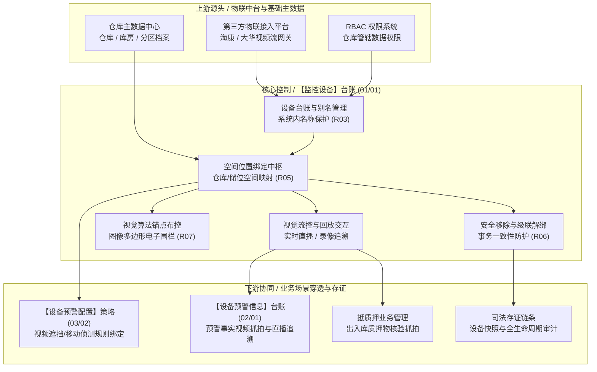

# 监控设备 主PRD

> **文档体系（三件套为核心）**：
>
> | 层级 | 文档 | 职责 | 真源 |
> | :--- | :--- | :--- | :---: |
> | **核心** | 本文（主 PRD） | 业务背景、痛点、功能范围、模块架构、**页面功能说明**、业务场景、状态机摘要、规则摘要、验收 | ✅ |
> | **核心** | [监控设备字段清单](./监控设备字段清单.md) | 字段定义、筛选/列表/行操作弹窗、展示顺序、必填性与控件规格 | ✅ |
> | **核心** | [监控设备业务规则规格](./监控设备业务规则规格.md) | 状态机本体、R/C/P 规则、计算口径、动作矩阵、异常矩阵、时序图 | ✅ |
> | *衍生* | ASCII 线框 / Demo 文档 | 由三件套派生的可视化与原型输入，**非独立真源** | ❌ |
>
> **版本**：V4.0 基准版 | **更新时间**：2026-09-18 | **责任人**：产品架构组
>
> **统一引用规范**：
> - 本台账：【监控设备】台账（菜单：物联网IOT管理 → 监控设备，代号 01/01）
> - 门禁设备：【门禁设备】台账（菜单：物联网IOT管理 → 门禁设备，代号 01/02）
> - 下游预警：【设备预警配置】策略（菜单：预警配置 → 设备预警配置，代号 03/02）
> - 下游流水：【设备预警信息】台账（菜单：预警信息 → 设备预警信息，代号 02/01）
> - 状态机与业务规则本体 → [《监控设备业务规则规格》](./监控设备业务规则规格.md)
> - 字段层级与属性 → [《监控设备字段清单》](./监控设备字段清单.md)

---

## 一、业务背景与业务痛点

### 1.1 业务背景
在 SYZC 供应链金融存货监管体系中，大宗商品质押动产（如电解铜板、热轧卷板、铝锭、天然橡胶等）存放于多方监管仓库或企业自管仓库。视频监控设备作为物联网（IoT）数字监管底座的“视觉感知中枢”，承担着全天候实况监库、货物状态抓拍、AI 算法越界防盗分析及出入库合规视频存证的重任。

【监控设备】台账（菜单：物联网IOT管理 → 监控设备，代号 01/01）集中纳管全网视频监控摄像头以及具备摄像头能力的人脸识别门禁设备。系统支持重命名别名、仓库储位动态绑定、实时直播调阅、历史回放溯源、图像锚点布控与设备安全解绑移除，形成现场视觉感知与货权安全联防的一体化控制。

### 1.2 核心业务痛点
* **【设备多源异构与命名语义混乱】**：第三方监控厂商（如海康、大华）下发的原始设备名和通道号冗长杂乱，缺乏与大宗商品仓储货位（仓库/库房/分区）的业务映射，导致风控与巡库人员无法直观对应实际仓储物理空间。
* **【货权质押与视觉资产脱节】**：监管库内摄像头缺乏与在押订单的动态空间锚定，移库、偷运等货权异动发生时无法快速调取对应货位的实时画面，造成现场取证迟滞。
* **【设备变更缺乏级联风控防护】**：随意变更监控设备绑定的仓库或误移除设备，极易导致下游正在生效的电子围栏 AI 锚点与设备预警规则失效，破坏司法存证链条。
* **【双端协同与视频调阅卡顿】**：现场监管员巡库使用移动端、风控人员在中台使用 PC 端，传统方案缺乏针对内外网视频流转码与权限隔离的统筹，导致高频巡检体验差。

---

## 二、功能范围

| 包含功能范围 (In Scope) | 不包含功能范围 (Out of Scope) |
| :--- | :--- |
| **【监控台账与多维检索】**：展示全量有效监控设备列表，支持按设备名称、设备分类（视频监控/人脸门禁）、仓库及绑定状态综合筛选。 | **【硬件底层驱动接入】**：摄像头硬件底层私有协议对接、流媒体服务器架设，由底层物联中间件承接。 |
| **【仓库与储位绑定管理】**：支持行操作【绑定仓库】，将设备绑定至具体仓库、库房、分区及输入具体位置，校验订单关联状态。 | **【门禁人脸名单与开锁控制】**：人脸门禁的人脸白名单、开锁密码与通行审核，由【门禁设备】(01/02) 与【开锁审核】(07/05/03) 承接。 |
| **【系统内名称别名维护】**：支持行操作【重命名】，设定便于业务识别的系统内别名，第三方同步时不被意外覆盖。 | **【预警告警处置闭环】**：摄像头触发的离线、遮挡告警处置，属于【设备预警信息】台账（代号 02/01）。 |
| **【视频流实时调阅与回放】**：集成第三方流媒体接口，支持行操作【查看直播】与【查看回放】（跨度最高 30 天）。 | **【质押订单业务审批】**：订单质押申请与货值折算属于抵质押业务管理模块。 |
| **【图像锚点算法布控】**：支持行操作【图像锚点】，在视频画面中绘制多边形电子围栏并绑定 AI 越界/移动检测算法任务。 | **【视频本地持久化存储】**：监控录像文件存储于 NVR/云存储设备，本台账仅调用流媒体播放地址。 |
| **【设备级联解绑与移除】**：支持行操作【移除设备】，强制校验下游订单与预警规则，全量事务解绑并记录审计。 | **【移动端高级算法标定】**：图像锚点电子围栏标定仅在 PC 端支持，移动端不支持多边形绘制。 |

---

## 三、模块定位与系统链路

### 3.1 模块定位
【监控设备】台账（菜单：物联网IOT管理 → 监控设备，代号 01/01）属于系统**物理感知与资产纳管层（Physical Perception & Asset Management Layer）**。它向上同步硬件接入层的设备基线，向下为预警规则引擎、电子围栏 AI 计算及抵质押订单提供空间位置坐标与视觉视频流。

### 3.2 系统链路图

---

## 四、业务场景与用户故事

| 场景编号与名称 | 触发角色 | 核心交互与风控约束 | 业务价值 |
| :--- | :--- | :--- | :--- |
| **【SC-01 新设备入库位置标定】** | 仓储安全管理员 (`R-WH-SEC`) | 仓库新装 4 台高清云台摄像机，设备网关自动同步至台账。管理员进入「物联网IOT管理 → 监控设备」，针对未绑定设备点击【绑定仓库】，选择「无锡保税1号库 → A区铜排储位」，并点击【重命名】修改为「A区1号铜锭监控球机」。 | 消除设备乱码命名，确立精准仓储空间映射。 |
| **【SC-02 质押垛位图像锚点布控】** | 质押风控专员 (`R-RISK-AUDIT`) | 针对一批高货值电解铜入库质押，风控人员在监控设备列表找到对应立柱摄像头，点击行操作【图像锚点】。在视频静帧上使用多边形工具框选铜垛区域，设定敏感度为高，提交保存。系统向 AI 边缘网关下发算法任务并联动启用预警。 | 实现非接触式数字围栏布控，防范非法移库。 |
| **【SC-03 异常报警快速调阅直播】** | 驻库监管主管 (`R-WH-MGR`) | 收到系统推送的「库房非作业时间人员闯入」预警，主管在监控设备列表筛选对应仓库，点击【查看直播】。弹窗秒级拉起高清实时视频流，支持放大与云台控制，迅速核查现场情况。 | 视觉穿透现场，保障风控事件极速响应。 |
| **【SC-04 故障设备合规级联解绑】** | 仓储安全管理员 (`R-WH-SEC`) | 某摄像头硬件老化报废需拆卸，管理员在列表点击【移除设备】并录入移除说明。系统校验该设备若当前关联在押质押订单，强提示阻断；若仅关联预警规则，自动解绑并生成全量审计留痕。 | 杜绝风控盲区拆卸，保障监管链条完整。 |

---

## 五、状态机与动作能力矩阵

### 5.1 状态定义
* 监控设备本身属于物联基础硬件主数据，不设审批单据状态机，采用物理运行与绑定状态双维度刻画：
  - **运行状态**：在线 (`ONLINE`)、离线 (`OFFLINE`)、异常 (`FAULT`)；
  - **绑定状态**：已绑定 (`BOUND`)、未绑定 (`UNBOUND`)；
  - **生命周期**：正常纳管、已移除软删除 (`REMOVED`)。

### 5.2 动作能力矩阵

| 动作名称 | 已绑定 + 在线 | 已绑定 + 离线 | 未绑定设备 | 已移除设备 |
| :--- | :---: | :---: | :---: | :---: |
| **查看设备列表** | ✅ | ✅ | ✅ | ❌ (历史快照只读) |
| **重命名系统名称** | ✅ | ✅ | ✅ | ❌ |
| **绑定 / 换绑仓库** | ✅ | ✅ | ✅ | ❌ |
| **查看实时直播** | ✅ | ❌ (提示设备离线) | ✅ (若在线) | ❌ |
| **查看历史回放** | ✅ | ✅ (查历史云端录像)| ✅ | ❌ |
| **图像锚点标定** | ✅ | ❌ (需在线画面) | ❌ (需先绑仓) | ❌ |
| **移除设备** | ✅ (校验订单与规则)| ✅ (校验订单与规则)| ✅ (直接移除) | ❌ |

---

## 六、页面交互规格索引

### 6.1 PC 端列表页交互规格
* **菜单路径**：`物联网IOT管理 → 监控设备`（`/iot/camera-devices`）
* **统计看板区**：顶部展示「监控设备总数」、「在线设备数」、「离线设备数」、「未绑定位置数」指标卡；
* **筛选交互区**：
  - 设备名称（模糊搜索系统内名称）；
  - 设备分类（下拉单选：全部、视频监控、人脸门禁）；
  - 绑定仓库（当前管辖仓库下拉选择器）；
  - 绑定状态（下拉单选：全部、已绑定、未绑定）；
  - 重置与查询按钮。
* **数据表格区**：
  - 列定义：序号、设备原名称、系统内名称、设备编码、设备分类、绑定仓库、具体位置、修改人员、更新时间、操作列；
  - 行操作列按钮群：【查看直播】、【查看回放】、【图像锚点】、【重命名】、【绑定仓库】、【移除设备】。

### 6.2 行操作弹窗交互规格
* **【重命名】弹窗**：展示设备编码与原名称（只读），输入新系统内名称（1~50字符，必填，防重名校验），确定后保存；
* **【绑定仓库】弹窗**：级联选择仓库 → 库房 → 分区，输入具体安装位置说明（选填，最多100字），提交后热同步空间拓扑；
* **【查看直播】弹窗**：大尺寸播放器弹窗，支持选择主码流/子码流、全屏播放、抓拍截图及云台控制（PTZ，若硬件支持）；
* **【查看回放】弹窗**：日历选择历史日期（支持最近 30 天），下方展示 24 小时录像时间轴（有录像段标蓝），支持拖拽播放与片段下载；
* **【图像锚点】弹窗**：调取当前实时视频首帧作为底图，支持点击标定多边形闭合围栏（$\ge 3$ 个点），选择布控算法类型（禁区入侵、周界越界）并设定灵敏度；
* **【移除设备】二次确认弹窗**：展示高危告警提示，展示将自动解绑的规则数量；强制输入 $\le 200$ 字移除原因，点击确认后执行原子级联解绑。

---

## 七、核心业务规则索引与非功能需求

### 7.1 核心规则映射索引
| 规则类别 | 规则编号 | 规则名称 | 核心控制摘要 |
| :--- | :--- | :--- | :--- |
| **分类归属** | R01 | 设备类型与多菜单映射规则 | 视频监控与具备摄像头的人脸门禁双纳管，人脸门禁兼具门禁与监控能力。 |
| **标识唯一** | R02 | 硬件业务标识全局唯一规则 | 以设备编码与设备 ID 为唯一业务键，严禁用自增序号作为业务标识。 |
| **别名保护** | R03 | 系统内名称人工别名保护规则 | 首次继承原名称，人工重命名后形成强保护，第三方同步不覆盖别名。 |
| **权限隔离** | R04 | 仓库数据权限双重过滤规则 | 已绑定设备按仓库权限过滤，未绑定设备按租户机构基线隔离。 |
| **空间绑定** | R05 | 仓库储位拓扑绑定完整性 | 仓库绑定必须满足仓库-库房-分区的空间拓扑合法性校验。 |
| **级联移除** | R06 | 移除设备级联解绑与安全阻断 | 存在在押订单时强阻断移除；其余关联规则执行事务级联解绑与留痕。 |
| **算法布控** | R07 | 图像锚点多边形几何有效性 | 多边形顶点数 $N \ge 3$，线段不可自相交，任务同步至边缘网关。 |

### 7.2 非功能性需求
* **视频调阅性能**：直播首帧拉流耗时 $\le 1.8\text{s}$，回放时间轴拖拽定位耗时 $\le 2.0\text{s}$；
* **操作高可用**：设备绑定与移除支持高并发分布式锁，杜绝空间绑定死锁与重复解绑；
* **全路径审计**：重命名、换绑、调阅视频、标定锚点与移除操作 100% 记入持久化审计日志。

---
*版本说明：V4.0 基准版 | 责任人：产品架构组 | 2026年09月*
